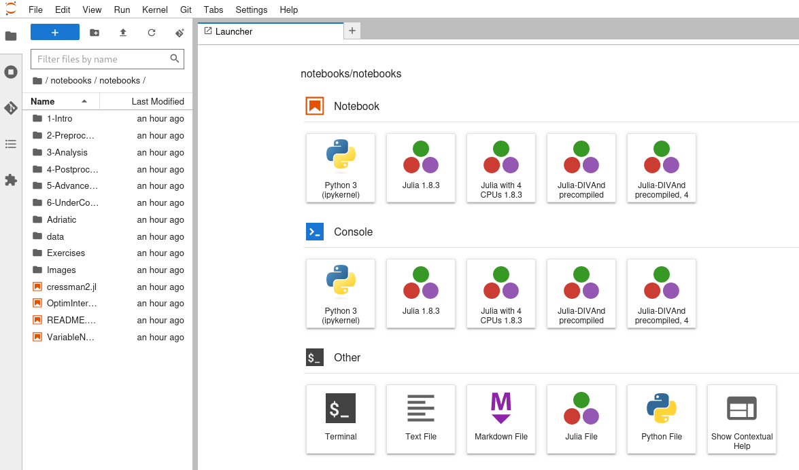

# Context

Fair-Ease project aim at providing users with an easy and FAIR tool for discovery and access to environmental multidisciplinary and aggregated data-sets, as well as set up a virtual environment (EAL - Earth Analytical Lab) through web-based interfaces.

EuroScienceGatewayleverage a distributed computing network and user-friendly web portal, facilitating access to compute and storage infrastructures across Europe as well as to data, tools, workflows and services that can be customised to suit researchers’ needs

Thus, the collaboration of those two EOSC project will allow the creation of cross-discipline workflows between climate science, biodiversity studies and the earth sciences—creating, sharing and re-using tools and workflows in Galaxy.

# The 2-days training session

With the strong support and help of Björn Grüning and Tunc Tkayikci we conducted a Galaxy discovery of 2 days in Lille. 

The first day aimed at providing training on how to use the Galaxy plateform. In order to do so our guiding thread was the climate related tutorials from the GTN written by Anne Fouilloux (https://training.galaxyproject.org/training-material/topics/climate/tutorials/pangeo-notebook/tutorial.html, https://training.galaxyproject.org/training-material/topics/climate/tutorials/pangeo/tutorial.html and https://training.galaxyproject.org/training-material/topics/climate/tutorials/panoply/tutorial.html). 
We finished the day by a quick explanation on how to develop and integrate tools for Galaxy with the installtion of a local test instance.

The seconde day was meant as a workshop where everybody could work on the tools they wanted to integrate in Galaxy and could ask questions and for help to the 3 teachers (Björn, Tunc and myself Marie).
During this day we were able to get 3 tools up and running in the European Galaxy server:
	- DIVAnd Interactive Tool: notebooks in this Jupyter Lab environment allows to explore programmatic access to DIVAnd's (Data-Interpolating Variational Analysis in n dimensions) package.
	
	-  Interactive Hdfview tool: Desktop application to display netcdf, hdf4 or hdf5 files.
	-  Scoop3-Argo : interactive visual quality control of Argo netCDF files
	

# Conclusion

This training allowed the Fair-Ease partners to get the basis on galaxy on how to use the plateform and how to integrate tools. It was pretty efficient as we succeeded, with the attendants, to get 3 tools ready and even more still in production. We hope to continue this collaboration and go on on working on Galaxy.

