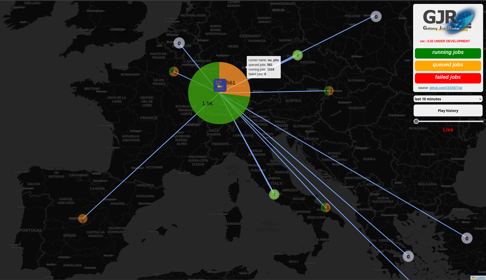

The Galaxy Project offers invaluable support to scientists and researchers, but its inner workings can be complex and lack visual appeal, potentially deterring many prospective users. To bridge this gap, I've started developing a project entitled __Galaxy Job Radar__, designed to dynamically visualize the current and past computations within the Galaxy system. This tool also provides significant advantages to Galaxy administrators by offering insights into computational maintenance and potential threats across the network.

My name is __Tomas Vondrak__, and I am working on the __Galaxy Job Radar__ as part of my Master's thesis at __CESNET__ in the Czech Republic, while studying theoretical computer science at __Masaryk University in Brno__.

Currently, __Galaxy Job Radar__ can visualize the live status of running and queued jobs on __Pulsar interfaces connected to its Galaxy server and other computational resources__. It also includes the ability to __replay recent computations__. All data is fetched from the __InfluxDB__ database of the Galaxy node. The project is still __under development__, and we are actively collaborating with European Galaxy node administrators to access more data from internal Galaxy database. Our goal is to design this tool so that every Galaxy admin can easily integrate Galaxy Job Radar into their systems.

## Data Collection for Galaxy Job Radar
The primary data source for Galaxy Job Radar is the InfluxDB database, which is populated with data from the internal Galaxy Database. __Galaxy administrators can configure data transfer from their Galaxy instances to InfluxDB using the Telegraf project__. Currently, we are utilizing data from the European Galaxy node, but we anticipate expanding the Galaxy Job Radar to other instances in the future. Additionally, there are plans to support multiple Galaxies with a single Galaxy Job Radar instance, offering a comprehensive view of computations across the Galaxy ecosystem.

## Example and Repository
__A live instance of Galaxy Job Radar is available at [gjr.metacentrum.cz](http://gjr.metacentrum.cz)__ and its source code can be accessed on GitHub at [CESNET/gjr](https://github.com/CESNET/gjr).

## Future Prospects
Looking ahead, we plan numerous enhancements for Galaxy Job Radar, ensuring the security and anonymity of Galaxy users. Our aim is to make Galaxy more visually appealing to users and provide a clearer view of their running tasks.
For computational resource administrators running their Pulsar interfaces, we plan to implement graphs detailing resource efficiency in job scheduling over time, and for Galaxy administrators, insights into system-wide job scheduling performance. These features will be crucial for optimizing the Galaxy scheduling system, as outlined in [this Zenodo record](https://zenodo.org/record/14936846).

I am optimistic about the swift progression of __Galaxy Job Radar__ and its imminent integration into the Galaxy ecosystem!
