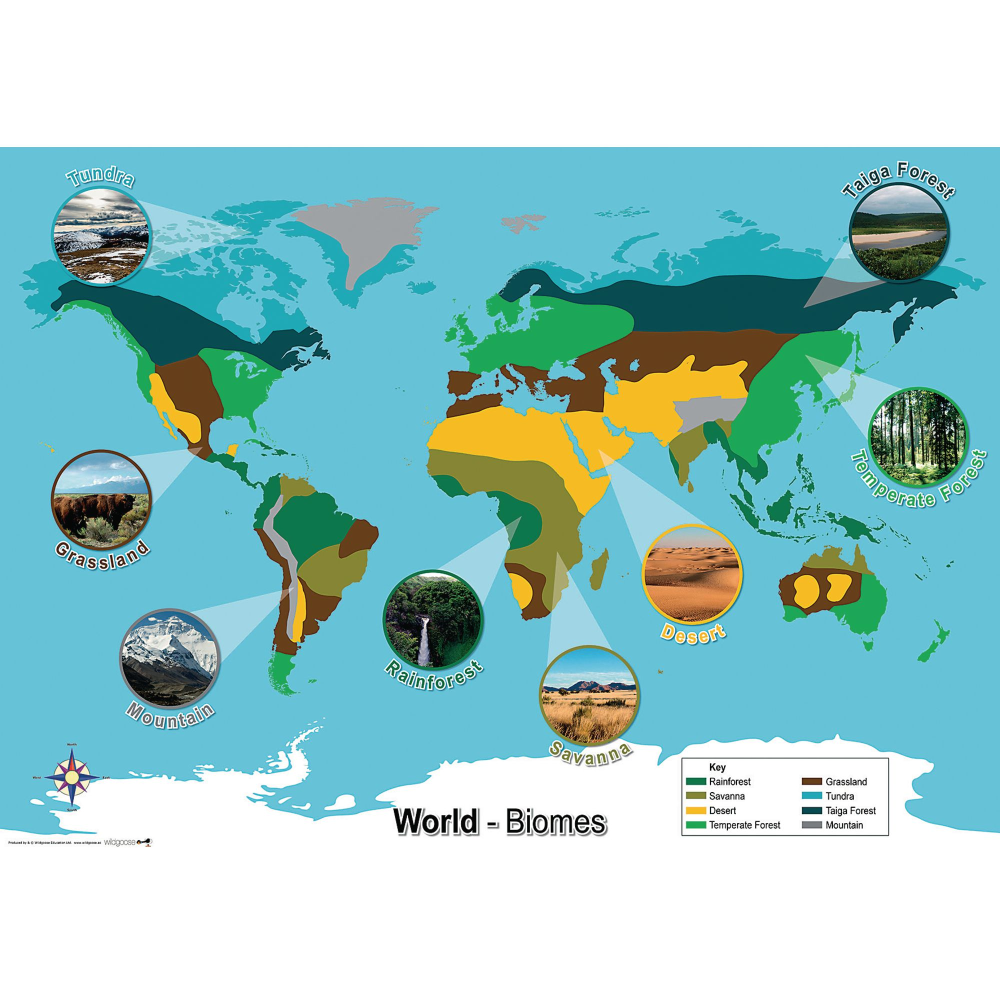
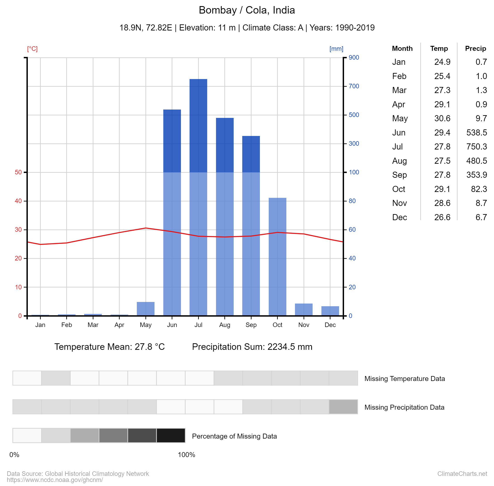

---

title: "Galaxy climate to support local/regional initiatives and concrete actions to fight climate change" 

tease: "Second blog post presenting the Outreachy project on Galaxy Climate"

authors: "Soumya Jha, Anne Fouilloux, Jean Iaquinta"

source_blog: "Galaxy Climate Outreachy Project"

date: "2022-07-25"

---

# What is climate? 

[Climate](https://en.wikipedia.org/wiki/Climate) is the long-term, around 30 years, average weather over a particular region. It’s the typical pattern of temperature, precipitation, and wind and how those change seasonally throughout the year. 

# What does climate look like?

Have a look around. Whatever you see is a part of the biosphere. Due to its massiveness, a collective study of this biosphere is nearly impossible. Thus the terrestrial part of the biosphere has been divided into smaller but enormous slices named “Biomes”. No two biomes are alike and the climate determines the boundary of a biome and the abundance of plants and animals found in them.

There are five major biomes in the world : **aquatic**, **grassland**, **forest**, **desert**, and **tundra**. Following are the best examples of the five biomes : **Pacific Ocean** (aquatic), **Eurasian steppe** (grassland), **Amazon rainforests** (forest), **Sahara** (desert) and **Kalaallit Nunaat high arctic** (tundra). 

The daily weather might be fluctuating a lot in these biomes. But a long-term trend is the answer to the climate patterns. So a question arises, how is the climate at a place represented?

Scientists use a  [Climatogram](http://mrswhittsweb.pbworks.com/w/file/fetch/103526601/climatograms%20unknown%20graphs.pdf) . A climatogram is a graph with a double-Y axis that plots the average monthly temperature & precipitation in a biome. The climate depends on a number of factors but the temperature and precipitation are the major ones which are decisive in the depiction of climate.

The precipitation is shown with a bar graph and is labelled on the left y-axis. The temperature is shown with a line graph, which is labelled on the right y-axis. The months of the year are the x-axis. Following are the climatograms of major cities of the world.

It is very evident from the climatograms that the city of Tindouf, Algeria must be of a desert biome with very scarce winter rainfall and high temperatures. On the other hand, Barrow in AK has a very cold climate with little rainfall during the monsoons and winters. The climate of Peru is hot and humid with high rainfall throughout the year and a nearly constant temperature.  Los Angeles also experiences some tricky weather with winter rainfalls and moderate temperatures. The city of Mangalore in India experiences moderate temperatures with heavy monsoons and some winter rainfall.

# Why do different places have different climates?

The main source of heat for the planet is the Sun. Earth has an [ellipsoidal](https://oceanservice.noaa.gov/facts/earth-round.html#:~:text=The%20Earth%20is%20an%20irregularly%20shaped%20ellipsoid.&text=While%20the%20Earth%20appears%20to,actually%20closer%20to%20an%20ellipsoid.) shape, thus different regions receive heat in different proportions. The equator receives direct rays of the sun, thus heats the most. The rays not only heat the land and ocean surfaces but also heats the air above them. This serves to be the major region from where the hot air rises up and forms air currents which further drives the [global conveyor belt system](https://education.nationalgeographic.org/resource/global-conveyor-belt). This eventually transports the moisture and ocean water throughout the globe. This uneven distribution of temperature leads to different patterns of wind, rain and heat which eventually produces a varied climate pattern throughout the globe. But wait! Don’t you think this can lead to extreme temperature differences? The very reason we don’t experience extremes in temperatures and precipitation is due to the atmosphere. The atmosphere acts as a blanket of air around the earth and helps to prevent the heat produced due to solar insolation, from escaping directly into space. And thus a moderate temperature is maintained. Thus it can be concluded that the atmosphere along with solar heating is the major reason for varied climate patterns around the globe.

# What can cause climate change?

A few degrees can make a world of difference. Glacial ice around 2 miles thick covers most of the Northern Hemisphere. Is it obvious to think that glacial melting is a natural phenomenon and has been happening for a very long? Are we just panicking over a natural phenomenon that was bound to be happening in time? 

Well, during the last ice age, people journeyed across the land connecting North America and Asia. The land was visible. Today, the Bering Sea bridge is about 50 metres below the current water level. This indicates that the sea level has risen by 50 metres in around 18,000 years. Considering a very rough average, the expected sea level rise should be close to 2.7 mm/year, in order to submerge anything as high as the Bering Sea Bridge. Currently, the average global rise in sea level temperature is accelerating at the rate of 3.7 mm/year which is around 37% higher. Well, the melting is natural but its rate is something which can’t be regarded as natural. There must be some underlying factors which have led to this rough increase.

Overall a change in temperature and precipitation over a region can affect its climate. There are many underlying factors which lead to changing patterns of precipitation and global atmospheric and surface temperature. The rising levels of greenhouse gases such as carbon dioxide, methane, water vapour, etc. are leading to enhanced trapping of heat within the atmosphere of the world.  Thus leading to rising temperatures. This has led to higher land and ocean surface temperatures. As a result, the rate of evaporation has gone up, further increasing the global precipitation rate. There are many less obvious factors such as Albedo which have great significance in Earth's heat exchange processes.

# What is Albedo?

The growing population brings the need for more land for shelter. This has led to deforestation and changing patterns of land use. The more construction of roads and urbanisation a city has, the lesser will be the albedo. You might wonder, what actually is albedo? It is defined as the proportion of light reflected from a surface. The albedo is estimated by measuring the solar radiation reflected from a region of Earth and comparing that with the insolation. Any bright or white coloured surface reflects most of the light or heat falling on it. Thus the reflected light or heat does not get trapped inside the earth and is mostly returned to space. This does not contribute to increasing in Earth’s temperature. These surfaces are said to have high albedo values. On the contrary, the dark-coloured objects such as concrete roads, tar and gravel rooves, etc. absorb the heat falling on them. This contributes to an increase in Earth’s temperature. The albedo increases with latitude because solar zenith angle, cloud coverage, and snow cover all increase with latitude. The increased cloud coverage is noticed due to excessive burning of fossil fuels which has increased the levels of aerosols and suspended particulate matters in the atmosphere. More cloud coverage will be the heat trapped within the earth’s atmosphere. The highest albedo values are attributed to the ice caps and glacial ice. Most of the sunlight falling on these is reflected and this prevents the heating of the polar waters. With the reduction in ice caps, the temperature of these water bodies is bound to increase. Thus we can expect accelerated melting of polar ice caps due to reducing albedo.

# What is the domain of climate science?

We know the world is shifting towards a more critical phase, scientists and researchers, all over the world are working day and night for the betterment of the current health of the planet. Just like a patient, in order to get rid of its ailments, the Earth has to go through a diagnosis, treatment and rehabilitation process. We will discuss the treatment and prevention aspects in the next blog.  Thus this blog can bring forth the various diagnostic processes for earth’s health conditions.

The very first diagnostic step began in the early 19th century when ice ages and other natural changes in paleoclimate were first suspected and the natural greenhouse effect was first identified. Since then, there have been many satellites constantly orbiting the earth and collecting data with respect to climate variables such as aerosols, ocean temperature, ocean colour, albedo, ocean chlorophyll content and thousands of others. The category of satellites used to monitor short-term weather patterns, climate change and natural disasters are called [**Earth Observation Satellites**](https://en.wikipedia.org/wiki/List_of_Earth_observation_satellites)

Below is the list of satellites orbiting the earth and collecting climate data:

## Satellites for climate change studies
|Name|Status| Agency | Country(s) | Date launched | Estimated end of life | Orbit  | Altitude (km) | Mass (kg) | Primary target of observation | Description                                                                                                                                                                                                                                                                                                                                                                                                                                                                                                                         | Source(s)                                                                                                                                                                                                                                                                                                  |                                                                                                                                                                                                                                                                                 |                                                                                                                                                                                                                                                                                             |                                                                                                                                                                                                                                                                                           |                                                                                                                                                                                                                                                                                     |
| ----------------------------------------------------------------------------- | ------------------------------------------------------------- | ------------------------------------------------------ | -------------------------------------------- | ------------- | --------------------- | --------------------------------------- | ------------- | --------- | ----------------------------- | ----------------------------------------------------------------------------------------------------------------------------------------------------------------------------------------------------------------------------------------------------------------------------------------------------------------------------------------------------------------------------------------------------------------------------------------------------------------------------------------------------------------------------------- | ---------------------------------------------------------------------------------------------------------------------------------------------------------------------------------------------------------------------------------------------------------------------------------------------------------- | ------------------------------------------------------------------------------------------------------------------------------------------------------------------------------------------------------------------------------------------------------------------------------- | ------------------------------------------------------------------------------------------------------------------------------------------------------------------------------------------------------------------------------------------------------------------------------------------- | ----------------------------------------------------------------------------------------------------------------------------------------------------------------------------------------------------------------------------------------------------------------------------------------- | ----------------------------------------------------------------------------------------------------------------------------------------------------------------------------------------------------------------------------------------------------------------------------------- |
| ALOS-2 (Advanced Land Observing Satellite - 2)                                | Active                                                        | JAXA                                                   | Japan                                        | 24/05/2014    | ≥2019                 | Sun-synchronous                         | 640           | 2,000     | Land                          | Land and ocean observation.                                                                                                                                                                                                                                                                                                                                                                                                                                                                                                         | [http://www.wmo-sat.info/oscar/satellites/view/6](https://www.google.com/url?q=http://www.wmo-sat.info/oscar/satellites/view/6&sa=D&source=editors&ust=1658745445256462&usg=AOvVaw11pb7dLg0L9K8B4cUWsaVr)                                                                                                  |                                                                                                                                                                                                                                                                                 |                                                                                                                                                                                                                                                                                             |                                                                                                                                                                                                                                                                                           |                                                                                                                                                                                                                                                                                     |
| AlSat-2                                                                       | Active                                                        | ASA                                                    | Algeria                                      | 12/07/2010    | ≥2015                 | Sun-synchronous                         | 686           | 116       | Land                          | Land observation for disaster monitoring.                                                                                                                                                                                                                                                                                                                                                                                                                                                                                           | [http://www.wmo-sat.info/oscar/satellites/view/9](https://www.google.com/url?q=http://www.wmo-sat.info/oscar/satellites/view/9&sa=D&source=editors&ust=1658745445257164&usg=AOvVaw3U4Y-CxvYrX48YrcEFWxdG)                                                                                                  |                                                                                                                                                                                                                                                                                 |                                                                                                                                                                                                                                                                                             |                                                                                                                                                                                                                                                                                           |                                                                                                                                                                                                                                                                                     |
| Aqua                                                                          | Active                                                        | NASA                                                   | US                                           | 04/05/2002    | ≥2015                 | Sun-synchronous, low earth              | 705           | 2,934     | Mixed                         | Carries six instruments to observe interactions among the four sphere's for earth's systems: oceans, land, atmosphere, and biosphere.                                                                                                                                                                                                                                                                                                                                                                                               | [http://en.wikipedia.org/wiki/Aqua\_%28satellite%29](https://www.google.com/url?q=http://en.wikipedia.org/wiki/Aqua_%2528satellite%2529&sa=D&source=editors&ust=1658745445257710&usg=AOvVaw06-LfJsqGy1i4gx7C7u2_Z)                                                                                         | [http://www.wmo-sat.info/oscar/satellites/view/79](https://www.google.com/url?q=http://www.wmo-sat.info/oscar/satellites/view/79&sa=D&source=editors&ust=1658745445257763&usg=AOvVaw0AicX4WWvP4Qz5KUSehVWu)                                                                     |                                                                                                                                                                                                                                                                                             |                                                                                                                                                                                                                                                                                           |                                                                                                                                                                                                                                                                                     |
| ASNARO-1                                                                      | Active                                                        | USEF, NEC MITI                                         | Japan                                        | 06/11/2014    | ≥2019                 | Sun-synchronous                         | 504           | 495       | Land                          | High resolution land observation.                                                                                                                                                                                                                                                                                                                                                                                                                                                                                                   | [http://www.wmo-sat.info/oscar/satellites/view/467](https://www.google.com/url?q=http://www.wmo-sat.info/oscar/satellites/view/467&sa=D&source=editors&ust=1658745445258244&usg=AOvVaw2aEWHX0MhWrIFQGXRapvWu)                                                                                              |                                                                                                                                                                                                                                                                                 |                                                                                                                                                                                                                                                                                             |                                                                                                                                                                                                                                                                                           |                                                                                                                                                                                                                                                                                     |
| AURA (EOS CH-1)                                                               | Active                                                        | NASA                                                   | US                                           | 15/07/2004    | ≥2015                 | Sun-synchronous                         | 705           | 2,967     | atmosphere                    | A multi-national scientific research satellite investigating questions about ozone trends, air-quality changes and their linkage to climate change, through observation of the composition, chemistry, and dynamics of the atmosphere. It flies in formation with six other satellites, known as the "A-train".                                                                                                                                                                                                                     | [http://en.wikipedia.org/wiki/Aura\_(satellite)](https://www.google.com/url?q=http://en.wikipedia.org/wiki/Aura_(satellite)&sa=D&source=editors&ust=1658745445258762&usg=AOvVaw1k6JLpIKAgltzp4QaEO_GQ)                                                                                                     | [http://en.wikipedia.org/wiki/Earth\_Observing\_System](https://www.google.com/url?q=http://en.wikipedia.org/wiki/Earth_Observing_System&sa=D&source=editors&ust=1658745445258811&usg=AOvVaw05LoqcaBtKOM2fROjfiCFk)                                                             | [http://www.wmo-sat.info/oscar/satellites/view/80](https://www.google.com/url?q=http://www.wmo-sat.info/oscar/satellites/view/80&sa=D&source=editors&ust=1658745445258853&usg=AOvVaw0W5eaDOWcL6xzjGF86GKD_)                                                                                 |                                                                                                                                                                                                                                                                                           |                                                                                                                                                                                                                                                                                     |
| Beijing-1                                                                     | Active                                                        | NRSCC                                                  | China                                        | 27/08/2008    | ≥2015                 | Sun-synchronous                         | 699           | 166       | Land                          | Disaster monitoring.                                                                                                                                                                                                                                                                                                                                                                                                                                                                                                                | [http://www.wmo-sat.info/oscar/satellites/view/18](https://www.google.com/url?q=http://www.wmo-sat.info/oscar/satellites/view/18&sa=D&source=editors&ust=1658745445259336&usg=AOvVaw1ddc0voFYkeihqoqJ5HaOf)                                                                                                |                                                                                                                                                                                                                                                                                 |                                                                                                                                                                                                                                                                                             |                                                                                                                                                                                                                                                                                           |                                                                                                                                                                                                                                                                                     |
| CALIPSO (Cloud-Aerosol Lidar and Infrared Pathfinder Satellite Observations)  | Active                                                        | NASA/CNES                                              | US/France                                    | 28/04/2006    | ≥2015                 | Sun-synchronous                         | 705           | 635       | atmosphere                    | Studies thickness of clouds and aerosols for understanding of how much air pollution is present and changes in compositions in the atmophere.                                                                                                                                                                                                                                                                                                                                                                                       | [http://en.wikipedia.org/wiki/CALIPSO](https://www.google.com/url?q=http://en.wikipedia.org/wiki/CALIPSO&sa=D&source=editors&ust=1658745445259827&usg=AOvVaw0OIidRqdfbsbA6puWnKZio)                                                                                                                        | [http://www.wmo-sat.info/oscar/satellites/view/19](https://www.google.com/url?q=http://www.wmo-sat.info/oscar/satellites/view/19&sa=D&source=editors&ust=1658745445259884&usg=AOvVaw0HM4hL0UZaGXCZK4Zjgjw1)                                                                     |                                                                                                                                                                                                                                                                                             |                                                                                                                                                                                                                                                                                           |                                                                                                                                                                                                                                                                                     |
| Cartosat-1 (IRS-P5)                                                           | Active                                                        | ISRO                                                   | India                                        | 05/01/2005    | ≥2015                 | Sun-synchronous circular orbit          | 618           | 680       | Land                          | A stereoscopic Earth observation satellite. Applications will mainly be towards cartography in India.                                                                                                                                                                                                                                                                                                                                                                                                                               | [http://en.wikipedia.org/wiki/Cartosat-1](https://www.google.com/url?q=http://en.wikipedia.org/wiki/Cartosat-1&sa=D&source=editors&ust=1658745445260397&usg=AOvVaw3Iu6HsYSHwjIIHqWHyWKha)                                                                                                                  | [https://directory.eoportal.org/web/eoportal/satellite-missions/i/irs-p5](https://www.google.com/url?q=https://directory.eoportal.org/web/eoportal/satellite-missions/i/irs-p5&sa=D&source=editors&ust=1658745445260447&usg=AOvVaw2PREQs8z3PGBrmIPY4ls2W)                       | [http://www.wmo-sat.info/oscar/satellites/view/20](https://www.google.com/url?q=http://www.wmo-sat.info/oscar/satellites/view/20&sa=D&source=editors&ust=1658745445260489&usg=AOvVaw2TaIJtxuoDWIQZqpA8ogrc)                                                                                 |                                                                                                                                                                                                                                                                                           |                                                                                                                                                                                                                                                                                     |
| CartoSat-2                                                                    | Active                                                        | ISRO                                                   | India                                        | 10/01/2007    | ≥2015                 | Sun-synchronous                         | 635           | 680       | Land                          | Land observation.                                                                                                                                                                                                                                                                                                                                                                                                                                                                                                                   | [https://en.wikipedia.org/wiki/Cartosat-2](https://www.google.com/url?q=https://en.wikipedia.org/wiki/Cartosat-2&sa=D&source=editors&ust=1658745445260979&usg=AOvVaw0W39pRxgl7yNLhD7hh-RyF)                                                                                                                | [http://www.wmo-sat.info/oscar/satellites/view/21](https://www.google.com/url?q=http://www.wmo-sat.info/oscar/satellites/view/21&sa=D&source=editors&ust=1658745445261026&usg=AOvVaw3jwXjlHio1kQX_GiJQ2Qdk)                                                                     |                                                                                                                                                                                                                                                                                             |                                                                                                                                                                                                                                                                                           |                                                                                                                                                                                                                                                                                     |
| CartoSat-2A                                                                   | Active                                                        | ISRO                                                   | India                                        | 28/04/2008    | ≥2015                 | Sun-synchronous                         | 635           | 690       | Land                          | Land observation.                                                                                                                                                                                                                                                                                                                                                                                                                                                                                                                   | [http://www.wmo-sat.info/oscar/satellites/view/22](https://www.google.com/url?q=http://www.wmo-sat.info/oscar/satellites/view/22&sa=D&source=editors&ust=1658745445261472&usg=AOvVaw1VAO1Amd7oUuD3X6KVX_J8)                                                                                                |                                                                                                                                                                                                                                                                                 |                                                                                                                                                                                                                                                                                             |                                                                                                                                                                                                                                                                                           |                                                                                                                                                                                                                                                                                     |
| Cartosat-2B                                                                   | Active                                                        | ISRO                                                   | India                                        | 12/07/2010    | ≥2015                 | Low earth                               | 640           | 694       | Land                          | An Earth Observation Satellite that carries a panchromatic (PAN) camera capable of taking black-and-white pictures in the visible region of electromagnetic spectrum.                                                                                                                                                                                                                                                                                                                                                               | [http://en.wikipedia.org/wiki/Cartosat-2B](https://www.google.com/url?q=http://en.wikipedia.org/wiki/Cartosat-2B&sa=D&source=editors&ust=1658745445261861&usg=AOvVaw2SASU4Wtn4a1eUo73eEmU_)                                                                                                                |                                                                                                                                                                                                                                                                                 |                                                                                                                                                                                                                                                                                             |                                                                                                                                                                                                                                                                                           |                                                                                                                                                                                                                                                                                     |
| CBERS-4                                                                       | Active                                                        | BSA/CMA                                                | Brazil/China                                 | 07/12/2014    | ≥2017                 | Sun-synchronous                         | 778           | 1,980     | Land                          | Earth observation. Only active satellite from a Sino-Brazilian partnership. The family of remote sensing satellites CBERS brought significant scientific advances to Brazil. In the country, almost all institutions related to the environment and natural resources are users of CBERS images. Images are used in important fields such as controlling deforestation and burning in the Amazon, the monitoring of water resources, agriculture, growth urban, land use, education and many other applications. Carries 4 cameras. | [http://www.cbers.inpe.br/sobre\_satelite/lancamento\_cbers4.php](https://www.google.com/url?q=http://www.cbers.inpe.br/sobre_satelite/lancamento_cbers4.php&sa=D&source=editors&ust=1658745445262418&usg=AOvVaw2cFKSP7owNX7mZXVtsgfff)                                                                    | [http://en.wikipedia.org/wiki/Brazilian\_Space\_Agency#Satellites](https://www.google.com/url?q=http://en.wikipedia.org/wiki/Brazilian_Space_Agency%23Satellites&sa=D&source=editors&ust=1658745445262485&usg=AOvVaw1HZtaXkAaQ2cXZ5JzBPKWX)                                     | [http://en.wikipedia.org/wiki/China%E2%80%93Brazil\_Earth\_Resources\_Satellite\_program](https://www.google.com/url?q=http://en.wikipedia.org/wiki/China%25E2%2580%2593Brazil_Earth_Resources_Satellite_program&sa=D&source=editors&ust=1658745445262543&usg=AOvVaw38X0_3sHIP5kF5H3hSHJfT) | [http://en.wikipedia.org/wiki/CBERS-4](https://www.google.com/url?q=http://en.wikipedia.org/wiki/CBERS-4&sa=D&source=editors&ust=1658745445262591&usg=AOvVaw306Zw8qPbv3YqDU98gTy57)                                                                                                       | [http://www.wmo-sat.info/oscar/satellites/view/29](https://www.google.com/url?q=http://www.wmo-sat.info/oscar/satellites/view/29&sa=D&source=editors&ust=1658745445262637&usg=AOvVaw2MBjDzCfCFfr8ULavHWl0B)                                                                         |
| CloudSat                                                                      | Active                                                        | NASA/Canada                                            | US                                           | 28/04/2006    | 28/04/2009            | Low Earth                               | 705           | 995       | atmosphere                    | Monitors the state of earth's atmosphere and weather through radar, which can be used to predict which clouds produce rain, observe snowfall, and monitor the moisture content of clouds.                                                                                                                                                                                                                                                                                                                                           | [http://cloudsat.atmos.colostate.edu/](https://www.google.com/url?q=http://cloudsat.atmos.colostate.edu/&sa=D&source=editors&ust=1658745445263099&usg=AOvVaw2ub3kiLo-0_XO9m8rFlRl0)                                                                                                                        | [http://en.wikipedia.org/wiki/CloudSat](https://www.google.com/url?q=http://en.wikipedia.org/wiki/CloudSat&sa=D&source=editors&ust=1658745445263145&usg=AOvVaw3BTsSlOimJ4OIabwmQm7w0)                                                                                           |                                                                                                                                                                                                                                                                                             |                                                                                                                                                                                                                                                                                           |                                                                                                                                                                                                                                                                                     |
| COMS (Chollian)                                                               | Active                                                        | KMA                                                    | South Korea                                  | 27/06/2010    | ≥2019                 | Geostationary                           | 35,786        | 2,460     | Mixed                         | Communication, Ocean and Meteorological Satellite (COMS), looking in particular at coastal zones.                                                                                                                                                                                                                                                                                                                                                                                                                                   | [http://nmsc.kma.go.kr/html/homepage/en/chollian/choll\_info.do](https://www.google.com/url?q=http://nmsc.kma.go.kr/html/homepage/en/chollian/choll_info.do&sa=D&source=editors&ust=1658745445263638&usg=AOvVaw3U3c6jSsf_-dufm_R9gLv_)                                                                     | [http://en.wikipedia.org/wiki/Chollian](https://www.google.com/url?q=http://en.wikipedia.org/wiki/Chollian&sa=D&source=editors&ust=1658745445263685&usg=AOvVaw34eACHC3fBa2XHDWIgGZ75)                                                                                           | [http://www.wmo-sat.info/oscar/satellites/view/33](https://www.google.com/url?q=http://www.wmo-sat.info/oscar/satellites/view/33&sa=D&source=editors&ust=1658745445263724&usg=AOvVaw0vpK7uwdnAaEbWtTFwY--4)                                                                                 |                                                                                                                                                                                                                                                                                           |                                                                                                                                                                                                                                                                                     |
| COSMIC (Constellation Observing System for Meteorology, Ionosphere & Climate) | Active                                                        | NSPO/NOAA/UCAR                                         | US/China                                     | 14/06/2006    | ≥2015                 | Drifting orbit                          | 800           | 61        | atmosphere                    | A constellation of six satellites contributing to meteorology, ionospheric research, climatology, and space weather. Two of the microsatellites are no longer fully functional.                                                                                                                                                                                                                                                                                                                                                     | [http://www.wmo-sat.info/oscar/satellites/view/37](https://www.google.com/url?q=http://www.wmo-sat.info/oscar/satellites/view/37&sa=D&source=editors&ust=1658745445264278&usg=AOvVaw1oysKTW4Jsqnnf7kK0aj9d)                                                                                                |                                                                                                                                                                                                                                                                                 |                                                                                                                                                                                                                                                                                             |                                                                                                                                                                                                                                                                                           |                                                                                                                                                                                                                                                                                     |
| Cryosat-2                                                                     | Active                                                        | ESA                                                    | ESA member states (22)                       | 08/04/2010    | ≥2015                 | Drifting orbit                          | 717           | 720       | Ice                           | An ESA programme which will monitor variations in the extent and thickness of polar ice through use of a satellite in low Earth orbit. The information provided about the behaviour of coastal glaciers that drain thinning ice sheets will be key to better predictions of future sea level rise. It measures 'freeboard' - the difference in height between sea ice and adjacent water - as well as ice sheet altitude, tracking changes in ice thickness.                                                                        | [https://earth.esa.int/web/guest/missions/esa-operational-eo-missions/cryosat](https://www.google.com/url?q=https://earth.esa.int/web/guest/missions/esa-operational-eo-missions/cryosat&sa=D&source=editors&ust=1658745445264794&usg=AOvVaw0g_a3kcv08RTFnEQbLqdDN)                                        | [http://en.wikipedia.org/wiki/CryoSat](https://www.google.com/url?q=http://en.wikipedia.org/wiki/CryoSat&sa=D&source=editors&ust=1658745445264858&usg=AOvVaw3zZcuHLCus4rl1_v0W5DWr)                                                                                             | [http://www.wmo-sat.info/oscar/satellites/view/39](https://www.google.com/url?q=http://www.wmo-sat.info/oscar/satellites/view/39&sa=D&source=editors&ust=1658745445264913&usg=AOvVaw1MHToD2izcPx1-01Gl_n2n)                                                                                 |                                                                                                                                                                                                                                                                                           |                                                                                                                                                                                                                                                                                     |
| CSK-1                                                                         | Active                                                        | ASI                                                    | Italy                                        | 08/06/2007    | ≥2015                 | Sunsynchronous                          | 620           | 1,700     | Land                          | Surveillance/emergency management.                                                                                                                                                                                                                                                                                                                                                                                                                                                                                                  | [http://www.wmo-sat.info/oscar/satellites/view/42](https://www.google.com/url?q=http://www.wmo-sat.info/oscar/satellites/view/42&sa=D&source=editors&ust=1658745445265413&usg=AOvVaw0EyZSkodF9UNglTqZKtemX)                                                                                                |                                                                                                                                                                                                                                                                                 |                                                                                                                                                                                                                                                                                             |                                                                                                                                                                                                                                                                                           |                                                                                                                                                                                                                                                                                     |
| CSK-2                                                                         | Active                                                        | ASI                                                    | Italy                                        | 09/12/2007    | ≥2015                 | Sunsynchronous                          | 620           | 1,700     | Land                          | Surveillance and emergency management.                                                                                                                                                                                                                                                                                                                                                                                                                                                                                              | [http://www.wmo-sat.info/oscar/satellites/view/43](https://www.google.com/url?q=http://www.wmo-sat.info/oscar/satellites/view/43&sa=D&source=editors&ust=1658745445265904&usg=AOvVaw3EdiYV1Kk1N8271Buw8ZUx)                                                                                                |                                                                                                                                                                                                                                                                                 |                                                                                                                                                                                                                                                                                             |                                                                                                                                                                                                                                                                                           |                                                                                                                                                                                                                                                                                     |
| CSK-3                                                                         | Active                                                        | ASI                                                    | Italy                                        | 25/10/2008    | ≥2015                 | Sunsynchronous                          | 620           | 1,700     | Land                          | Surveillance and emergency management                                                                                                                                                                                                                                                                                                                                                                                                                                                                                               | [http://www.wmo-sat.info/oscar/satellites/view/44](https://www.google.com/url?q=http://www.wmo-sat.info/oscar/satellites/view/44&sa=D&source=editors&ust=1658745445266388&usg=AOvVaw1K_VNLGYF5F4jsxFw22ctu)                                                                                                |                                                                                                                                                                                                                                                                                 |                                                                                                                                                                                                                                                                                             |                                                                                                                                                                                                                                                                                           |                                                                                                                                                                                                                                                                                     |
| CSK-4                                                                         | Active                                                        | ASI                                                    | Italy                                        | 06/11/2010    | ≥2015                 | Sunsynchronous                          | 620           | 1,700     | Land                          | Surveillance/emergency management                                                                                                                                                                                                                                                                                                                                                                                                                                                                                                   | [http://www.wmo-sat.info/oscar/satellites/view/45](https://www.google.com/url?q=http://www.wmo-sat.info/oscar/satellites/view/45&sa=D&source=editors&ust=1658745445266841&usg=AOvVaw1cKauROvBVB8lnjFi2wXmn)                                                                                                |                                                                                                                                                                                                                                                                                 |                                                                                                                                                                                                                                                                                             |                                                                                                                                                                                                                                                                                           |                                                                                                                                                                                                                                                                                     |
| Deimos                                                                        | Active                                                        | Elecnor Deimos                                         | Spain                                        | 29/07/2009    | ≥2019                 | Sunsynchronous                          | 660           | 91        | Land                          | High resolution land observation and disaster monitoring.                                                                                                                                                                                                                                                                                                                                                                                                                                                                           | [http://www.wmo-sat.info/oscar/satellites/view/46](https://www.google.com/url?q=http://www.wmo-sat.info/oscar/satellites/view/46&sa=D&source=editors&ust=1658745445267339&usg=AOvVaw1EgsHvZGOc2YA0liU1eiKL)                                                                                                |                                                                                                                                                                                                                                                                                 |                                                                                                                                                                                                                                                                                             |                                                                                                                                                                                                                                                                                           |                                                                                                                                                                                                                                                                                     |
| Deimos-2                                                                      | Active                                                        | Elecnor Deimos                                         | Spain                                        | 19/06/2014    | ≥2024                 | Sunsynchronous                          | 620           | 300       | Land                          | High-resolution land observation.                                                                                                                                                                                                                                                                                                                                                                                                                                                                                                   | [http://www.wmo-sat.info/oscar/satellites/view/629](https://www.google.com/url?q=http://www.wmo-sat.info/oscar/satellites/view/629&sa=D&source=editors&ust=1658745445267863&usg=AOvVaw1cJP1CsN1Ng5Q-vjzqgVPp)                                                                                              |                                                                                                                                                                                                                                                                                 |                                                                                                                                                                                                                                                                                             |                                                                                                                                                                                                                                                                                           |                                                                                                                                                                                                                                                                                     |
| DMC-3 (3 satellites, A,B & C)                                                 | Active                                                        | SSTL/21AT                                              | UK/China                                     | 10/07/2015    | ≥2022                 | Sunsynchronous                          | 630           | 1,341     | Land                          | Land observation for disaster monitoring.                                                                                                                                                                                                                                                                                                                                                                                                                                                                                           | [http://www.wmo-sat.info/oscar/satellites/view/670](https://www.google.com/url?q=http://www.wmo-sat.info/oscar/satellites/view/670&sa=D&source=editors&ust=1658745445268353&usg=AOvVaw1LxuRuonan1e1cGHs83EGJ)                                                                                              |                                                                                                                                                                                                                                                                                 |                                                                                                                                                                                                                                                                                             |                                                                                                                                                                                                                                                                                           |                                                                                                                                                                                                                                                                                     |
| DMSP-F16                                                                      | Active                                                        | NOAA/DoD                                               | US                                           | 18/10/2003    | ≥2015                 | Sunsynchronous                          | 850           | 1,200     | atmosphere                    | Cloud imagery and MW imaging/temperature/humidity sounding. Military satellite, imagery available from NOAA on the basis of bilateral agreements.                                                                                                                                                                                                                                                                                                                                                                                   | [http://www.wmo-sat.info/oscar/satellites/view/63](https://www.google.com/url?q=http://www.wmo-sat.info/oscar/satellites/view/63&sa=D&source=editors&ust=1658745445268835&usg=AOvVaw2BiFb_hHcSQkQQVJ6TdRiO)                                                                                                |                                                                                                                                                                                                                                                                                 |                                                                                                                                                                                                                                                                                             |                                                                                                                                                                                                                                                                                           |                                                                                                                                                                                                                                                                                     |
| DMSP-F17                                                                      | Active                                                        | NOAA/DoD                                               | US                                           | 04/11/2006    | ≥2015                 | Sunsynchronous                          | 850           | 1,220     | atmosphere                    | Cloud imagery and MW imaging/temperature/humidity sounding. Military satellite, imagery available from NOAA on the basis of bilateral agreements.                                                                                                                                                                                                                                                                                                                                                                                   | [http://www.wmo-sat.info/oscar/satellites/view/64](https://www.google.com/url?q=http://www.wmo-sat.info/oscar/satellites/view/64&sa=D&source=editors&ust=1658745445269296&usg=AOvVaw23lA3n1VZqu24z-bD4TvEL)                                                                                                |                                                                                                                                                                                                                                                                                 |                                                                                                                                                                                                                                                                                             |                                                                                                                                                                                                                                                                                           |                                                                                                                                                                                                                                                                                     |
| DMSP-F18                                                                      | Active                                                        | NOAA/DoD                                               | US                                           | 18/10/2009    | ≥2015                 | Sunsynchronous                          | 850           | 1,220     | atmosphere                    | Cloud imagery and MW imaging/temperature/humidity sounding. Military satellite, imagery available from NOAA on the basis of bilateral agreements.                                                                                                                                                                                                                                                                                                                                                                                   | [http://www.wmo-sat.info/oscar/satellites/view/65](https://www.google.com/url?q=http://www.wmo-sat.info/oscar/satellites/view/65&sa=D&source=editors&ust=1658745445269789&usg=AOvVaw3GoMzmVwoCvoMxkf6KONge)                                                                                                |                                                                                                                                                                                                                                                                                 |                                                                                                                                                                                                                                                                                             |                                                                                                                                                                                                                                                                                           |                                                                                                                                                                                                                                                                                     |
| DMSP-F19                                                                      | Active                                                        | NOAA/DoD                                               | US                                           | 03/04/2014    | ≥2015                 | Sunsynchronous                          | 850           | 1,220     | atmosphere                    | Cloud imagery and microwave imaging/temperature/humidity sounding. Military satellite, imagery available from NOAA on the basis of bilateral agreements.                                                                                                                                                                                                                                                                                                                                                                            | [http://www.wmo-sat.info/oscar/satellites/view/66](https://www.google.com/url?q=http://www.wmo-sat.info/oscar/satellites/view/66&sa=D&source=editors&ust=1658745445270254&usg=AOvVaw22dkyWozsuj14wFdVbRqEU)                                                                                                |                                                                                                                                                                                                                                                                                 |                                                                                                                                                                                                                                                                                             |                                                                                                                                                                                                                                                                                           |                                                                                                                                                                                                                                                                                     |
| DubaiSat-1                                                                    | Active                                                        | EIAST                                                  | United Arab Emirates                         | 29/07/2009    | ≥2015                 | Sunsynchronous                          | 686           | 200       | Land                          | Land observation for disaster monitoring                                                                                                                                                                                                                                                                                                                                                                                                                                                                                            | [http://www.wmo-sat.info/oscar/satellites/view/68](https://www.google.com/url?q=http://www.wmo-sat.info/oscar/satellites/view/68&sa=D&source=editors&ust=1658745445270749&usg=AOvVaw1O3vNAFplt69jiS6JUQUg8)                                                                                                |                                                                                                                                                                                                                                                                                 |                                                                                                                                                                                                                                                                                             |                                                                                                                                                                                                                                                                                           |                                                                                                                                                                                                                                                                                     |
| DubaiSat-2                                                                    | Active                                                        | EIAST                                                  | United Arab Emirates                         | 21/11/2013    | ≥2018                 | Sunsynchronous                          | 600           | 300       | Land                          | Land observation for disaster monitoring.                                                                                                                                                                                                                                                                                                                                                                                                                                                                                           | [http://www.wmo-sat.info/oscar/satellites/view/565](https://www.google.com/url?q=http://www.wmo-sat.info/oscar/satellites/view/565&sa=D&source=editors&ust=1658745445271286&usg=AOvVaw14qYq8P0syYRsN_7QMqcCP)                                                                                              |                                                                                                                                                                                                                                                                                 |                                                                                                                                                                                                                                                                                             |                                                                                                                                                                                                                                                                                           |                                                                                                                                                                                                                                                                                     |
| Earth Observing-1 (NMP)                                                       | Active                                                        | NASA                                                   | US                                           | 21/11/2001    | ≥2015                 | Sunsynchronous                          | 691           | 588       | Land                          | Carrying land-imaging technology, used to demonstrate new instruments and spacecraft systems for future missions. Part of New millennium programme.                                                                                                                                                                                                                                                                                                                                                                                  | [http://eo1.gsfc.nasa.gov/](https://www.google.com/url?q=http://eo1.gsfc.nasa.gov/&sa=D&source=editors&ust=1658745445271799&usg=AOvVaw1_RXoryxb4KfgIYu9Np-Yy)                                                                                                                                              | [http://www.wmo-sat.info/oscar/satellites/view/322](https://www.google.com/url?q=http://www.wmo-sat.info/oscar/satellites/view/322&sa=D&source=editors&ust=1658745445271847&usg=AOvVaw3YxsBepMYxV2N4223LSrLU)                                                                   | [http://en.wikipedia.org/wiki/Earth\_Observing-1](https://www.google.com/url?q=http://en.wikipedia.org/wiki/Earth_Observing-1&sa=D&source=editors&ust=1658745445271892&usg=AOvVaw3uEZYC8nSu6RRNhrS-WBHN)                                                                                    |                                                                                                                                                                                                                                                                                           |                                                                                                                                                                                                                                                                                     |
| EgyptSat-2                                                                    | Active                                                        | NARSS                                                  | Egypt                                        | 19/04/2014    | 09/06/2015            | Drifting orbit                          | 634           | 1,050     | Land                          | Land observation and disaster monitoring. Orbital control lost on 09/06/2015.                                                                                                                                                                                                                                                                                                                                                                                                                                                       | [http://www.wmo-sat.info/oscar/satellites/view/597](https://www.google.com/url?q=http://www.wmo-sat.info/oscar/satellites/view/597&sa=D&source=editors&ust=1658745445272355&usg=AOvVaw0Gwg8l4i6MR_II_LbgiFER)                                                                                              |                                                                                                                                                                                                                                                                                 |                                                                                                                                                                                                                                                                                             |                                                                                                                                                                                                                                                                                           |                                                                                                                                                                                                                                                                                     |
| Elektro-L N2                                                                  | Commissioning (launch successful, operations not yet started) | RosHydroMet, Roscosmos                                 | Russia                                       | 11/12/2015    | ≥2022                 | Geostationary                           | 35,786        | 3,000     | atmosphere                    | Weather forecasting satellite.                                                                                                                                                                                                                                                                                                                                                                                                                                                                                                      | [http://www.wmo-sat.info/oscar/satellites/view/74](https://www.google.com/url?q=http://www.wmo-sat.info/oscar/satellites/view/74&sa=D&source=editors&ust=1658745445272875&usg=AOvVaw1IzcSDBJZfHtxCmDZ3weo9)                                                                                                |                                                                                                                                                                                                                                                                                 |                                                                                                                                                                                                                                                                                             |                                                                                                                                                                                                                                                                                           |                                                                                                                                                                                                                                                                                     |
| Elektro–L N1/GOMS-2                                                           | Active                                                        | Roscosmos                                              | Russia                                       | 20/01/2011    | ≥2018                 | Geostationary                           | 35,786        | 3,000     | atmosphere                    | Operational meteorology.                                                                                                                                                                                                                                                                                                                                                                                                                                                                                                            | [http://en.wikipedia.org/wiki/Elektro-L\_No.1](https://www.google.com/url?q=http://en.wikipedia.org/wiki/Elektro-L_No.1&sa=D&source=editors&ust=1658745445273371&usg=AOvVaw2hVfLExNc7CkiX22yLvYP4)                                                                                                         | [http://en.wikipedia.org/wiki/Elektro%E2%80%93L](https://www.google.com/url?q=http://en.wikipedia.org/wiki/Elektro%25E2%2580%2593L&sa=D&source=editors&ust=1658745445273423&usg=AOvVaw1wk8QdoXS56Iz49sz3A6CC)                                                                   | [http://www.spacedaily.com/reports/Russia\_Launches\_Meteorological\_Satellite\_999.html](https://www.google.com/url?q=http://www.spacedaily.com/reports/Russia_Launches_Meteorological_Satellite_999.html&sa=D&source=editors&ust=1658745445273466&usg=AOvVaw21MLUmfSDfXZR79X3mFFcq)       | [http://www.virtuallab.bom.gov.au/files/4813/8187/7390/s1\_1200\_AOMSUC\_Russia\_Asmus.pdf](https://www.google.com/url?q=http://www.virtuallab.bom.gov.au/files/4813/8187/7390/s1_1200_AOMSUC_Russia_Asmus.pdf&sa=D&source=editors&ust=1658745445273509&usg=AOvVaw30UcadlRsKsknKIk_IrKce) | [http://www.wmo-sat.info/oscar/satellites/view/73](https://www.google.com/url?q=http://www.wmo-sat.info/oscar/satellites/view/73&sa=D&source=editors&ust=1658745445273552&usg=AOvVaw0TNCS4j1KDr-aWHoQlbuTd)                                                                         |
| Fengyun-2D                                                                    | Active                                                        | CMA , NRSCC                                            | China                                        | 08/12/2006    | ≥2015                 | Geostationary                           | 35,786        | 1,380     | atmosphere                    | Operational meteorology.                                                                                                                                                                                                                                                                                                                                                                                                                                                                                                            | [http://www.wmo-sat.info/oscar/satellites/view/108](https://www.google.com/url?q=http://www.wmo-sat.info/oscar/satellites/view/108&sa=D&source=editors&ust=1658745445273981&usg=AOvVaw3SUaOgfXZb4q1kLaTEti-3)                                                                                              |                                                                                                                                                                                                                                                                                 |                                                                                                                                                                                                                                                                                             |                                                                                                                                                                                                                                                                                           |                                                                                                                                                                                                                                                                                     |
| Fengyun-2E                                                                    | Active                                                        | CMA , NRSCC                                            | China                                        | 23/12/2008    | ≥2017                 | Geostationary                           | 35,786        | 1,380     | atmosphere                    | A meteorological satellite series of China, organized by CMA (China Meteorological Administration). Within the meteorological programme, the odd-numbered satellites (FengYun-1 or simply FY-1) refer to the polar-orbiting LEO series, while the even-numbered S/C (FY-2, FY-4, etc.) refer to the GEO series.                                                                                                                                                                                                                     | [http://en.wikipedia.org/wiki/Fengyun](https://www.google.com/url?q=http://en.wikipedia.org/wiki/Fengyun&sa=D&source=editors&ust=1658745445274454&usg=AOvVaw3ULphav9ySsKTDXVbXE5LW)                                                                                                                        | [http://www.wmo-sat.info/oscar/satellites/view/109](https://www.google.com/url?q=http://www.wmo-sat.info/oscar/satellites/view/109&sa=D&source=editors&ust=1658745445274498&usg=AOvVaw2GQH6rrtPtBBu2vHrp78uj)                                                                   |                                                                                                                                                                                                                                                                                             |                                                                                                                                                                                                                                                                                           |                                                                                                                                                                                                                                                                                     |
| Fengyun-2F                                                                    | Standby                                                       | CMA/NRSCC                                              | China                                        | 13/01/2012    | ≥2018                 | Geostationary                           | 35,786        | 1,380     | atmosphere                    | Fengyun-2F ("wind cloud" in Chinese) is a meteorological satellite that also contributes to research in space weather.                                                                                                                                                                                                                                                                                                                                                                                                              | [http://www.wmo-sat.info/oscar/satellites/view/110](https://www.google.com/url?q=http://www.wmo-sat.info/oscar/satellites/view/110&sa=D&source=editors&ust=1658745445274952&usg=AOvVaw2cVPdBxPmPqxSoiXbBI7bF)                                                                                              |                                                                                                                                                                                                                                                                                 |                                                                                                                                                                                                                                                                                             |                                                                                                                                                                                                                                                                                           |                                                                                                                                                                                                                                                                                     |
| Fengyun-3B                                                                    | Active                                                        | CMA , NRSCC                                            | China                                        | 04/11/2010    | ≥2015                 | Sunsynchronous                          | 836           | 2,298     | Mixed                         | Fengyun-3B ("wind cloud" in Chinese) monitors the oceans, ice and climate, and contribute to research on atmospheric chemistry and space weather.                                                                                                                                                                                                                                                                                                                                                                                   | [http://www.wmo-sat.info/oscar/satellites/view/114](https://www.google.com/url?q=http://www.wmo-sat.info/oscar/satellites/view/114&sa=D&source=editors&ust=1658745445275395&usg=AOvVaw22wB1qsXJFkCcpr2uf4fh3)                                                                                              |                                                                                                                                                                                                                                                                                 |                                                                                                                                                                                                                                                                                             |                                                                                                                                                                                                                                                                                           |                                                                                                                                                                                                                                                                                     |
| Fengyun-3C                                                                    | Active                                                        | CMA , NRSCC                                            | China                                        | 23/09/2013    | ≥2018                 | Sunsynchronous                          | 836           | 2,300     | Mixed                         | A weather satellite also contributing to the monitoring of the oceans, ice, climate and space weather.                                                                                                                                                                                                                                                                                                                                                                                                                              | [http://www.wmo-sat.info/oscar/satellites/view/115](https://www.google.com/url?q=http://www.wmo-sat.info/oscar/satellites/view/115&sa=D&source=editors&ust=1658745445275866&usg=AOvVaw2bPOaLYthc7zjnk8Jj2bZt)                                                                                              |                                                                                                                                                                                                                                                                                 |                                                                                                                                                                                                                                                                                             |                                                                                                                                                                                                                                                                                           |                                                                                                                                                                                                                                                                                     |
| FORMOSAT-2                                                                    | Active                                                        | NSPO                                                   | Taiwan                                       | 21/05/2004    | ≥2015                 | Sunsynchronous                          | 891           | 764       | Land                          | High-resolution land observation.                                                                                                                                                                                                                                                                                                                                                                                                                                                                                                   | [http://www.wmo-sat.info/oscar/satellites/view/100](https://www.google.com/url?q=http://www.wmo-sat.info/oscar/satellites/view/100&sa=D&source=editors&ust=1658745445276288&usg=AOvVaw0SU-f1osDwXBpCtNQaOBKP)                                                                                              |                                                                                                                                                                                                                                                                                 |                                                                                                                                                                                                                                                                                             |                                                                                                                                                                                                                                                                                           |                                                                                                                                                                                                                                                                                     |
| GCOM-W1 (Global Change Observation Mission for Water - 1)                     | Active                                                        | JAXA                                                   | Japan                                        | 17/05/2002    | ≥2017                 | Sunsynchronous                          | 700           | 1,991     | Oceans                        | Ocean observation, with a substantial contribution to operational meteorology and hydrology.                                                                                                                                                                                                                                                                                                                                                                                                                                        | [http://www.wmo-sat.info/oscar/satellites/view/130](https://www.google.com/url?q=http://www.wmo-sat.info/oscar/satellites/view/130&sa=D&source=editors&ust=1658745445276730&usg=AOvVaw36o31OvwEl5rxyZaPm_1Ya)                                                                                              |                                                                                                                                                                                                                                                                                 |                                                                                                                                                                                                                                                                                             |                                                                                                                                                                                                                                                                                           |                                                                                                                                                                                                                                                                                     |
| GeoEye-1                                                                      | Active                                                        | GeoEye (now DigitalGlobe)                              | US                                           | 06/09/2008    | ≥2015                 | Sunsynchronous                          | 681           | 1,955     | Land                          | The fourth flight of the commercial GeoEye programme, carrying out high-resolution land observation. The GeoEye company later merged into the DigitalGlobe corporation in 2013.                                                                                                                                                                                                                                                                                                                                                     | [http://www.wmo-sat.info/oscar/satellites/view/494](https://www.google.com/url?q=http://www.wmo-sat.info/oscar/satellites/view/494&sa=D&source=editors&ust=1658745445277171&usg=AOvVaw1079vMN1HhieZrQI-EH-Pn)                                                                                              |                                                                                                                                                                                                                                                                                 |                                                                                                                                                                                                                                                                                             |                                                                                                                                                                                                                                                                                           |                                                                                                                                                                                                                                                                                     |
| GF-1                                                                          | Active                                                        | CNSA                                                   | China                                        | 26/04/2013    | ≥2018                 | Sunsynchronous                          | 647           | 1,080     | Land                          | High-resolution land observation                                                                                                                                                                                                                                                                                                                                                                                                                                                                                                    | [http://www.wmo-sat.info/oscar/satellites/view/588](https://www.google.com/url?q=http://www.wmo-sat.info/oscar/satellites/view/588&sa=D&source=editors&ust=1658745445277676&usg=AOvVaw07Xxpm1Bsj0ONEHUHK-SE8)                                                                                              | [https://directory.eoportal.org/web/eoportal/satellite-missions/g/gaofen-1](https://www.google.com/url?q=https://directory.eoportal.org/web/eoportal/satellite-missions/g/gaofen-1&sa=D&source=editors&ust=1658745445277724&usg=AOvVaw3LxAURGoSiMRpM0i-wyB5f)                   |                                                                                                                                                                                                                                                                                             |                                                                                                                                                                                                                                                                                           |                                                                                                                                                                                                                                                                                     |
| GF-2                                                                          | Active                                                        | CNSA                                                   | China                                        | 19/08/2014    | ≥2019                 | Sunsynchronous                          | 650           | 2,100     | Land                          | High-resolution land observation and disaster monitoring.                                                                                                                                                                                                                                                                                                                                                                                                                                                                           | [http://www.wmo-sat.info/oscar/satellites/view/589](https://www.google.com/url?q=http://www.wmo-sat.info/oscar/satellites/view/589&sa=D&source=editors&ust=1658745445278226&usg=AOvVaw1xkOOyu6iuSSkXn75Q2ipI)                                                                                              | [https://directory.eoportal.org/web/eoportal/satellite-missions/g/gaofen-2](https://www.google.com/url?q=https://directory.eoportal.org/web/eoportal/satellite-missions/g/gaofen-2&sa=D&source=editors&ust=1658745445278259&usg=AOvVaw07nz1tDXACoZN_Y3kI1nIc)                   |                                                                                                                                                                                                                                                                                             |                                                                                                                                                                                                                                                                                           |                                                                                                                                                                                                                                                                                     |
| GF-4                                                                          | Commissioning (launch successful, operations not yet started) | CNSA                                                   | China                                        | 14/01/2016    | ≥2023                 | Geostationary                           | 35,786        | 4,600     | Land                          | High-resolution land observation and disaster monitoring.                                                                                                                                                                                                                                                                                                                                                                                                                                                                           | [http://www.wmo-sat.info/oscar/satellites/view/608](https://www.google.com/url?q=http://www.wmo-sat.info/oscar/satellites/view/608&sa=D&source=editors&ust=1658745445278727&usg=AOvVaw2Y5Ij9tze8mDirbJIMEqlP)                                                                                              |                                                                                                                                                                                                                                                                                 |                                                                                                                                                                                                                                                                                             |                                                                                                                                                                                                                                                                                           |                                                                                                                                                                                                                                                                                     |
| GOES-13                                                                       | Active                                                        | NOAA/NASA                                              | US                                           | 24/06/2006    | ≥2015                 | Geostationary                           | 35,786        | 3,210     | atmosphere                    | GOES I-M monitors and forecasts weather for NOAA. Made up to two satellites GOES East and GOES West. GOES-East: geostationary operational environmental satellites (GOES) for short-range warning and "now-casting".                                                                                                                                                                                                                                                                                                                | [http://goes.gsfc.nasa.gov/text/mission.html](https://www.google.com/url?q=http://goes.gsfc.nasa.gov/text/mission.html&sa=D&source=editors&ust=1658745445279275&usg=AOvVaw3tCgJLzL5IQZF89Yc2D-tb)                                                                                                          | [http://science.nasa.gov/missions/goes-m/](https://www.google.com/url?q=http://science.nasa.gov/missions/goes-m/&sa=D&source=editors&ust=1658745445279323&usg=AOvVaw0QuKDJipJnUBMJQGc6JMks)                                                                                     | [http://en.wikipedia.org/wiki/GOES\_13](https://www.google.com/url?q=http://en.wikipedia.org/wiki/GOES_13&sa=D&source=editors&ust=1658745445279371&usg=AOvVaw3j4xhuipKzH-uxQF_yT8hA)                                                                                                        | [http://www.wmo-sat.info/oscar/satellites/view/149](https://www.google.com/url?q=http://www.wmo-sat.info/oscar/satellites/view/149&sa=D&source=editors&ust=1658745445279412&usg=AOvVaw15UJ81fMyoSZwmT-f-KdQk)                                                                             |                                                                                                                                                                                                                                                                                     |
| GOES-14                                                                       | Standby                                                       | NOAA                                                   | US                                           | 27/06/2009    | ≥2016                 | Geostationary                           | 35,786        | 3,210     | atmosphere                    | GOES-14 is being stored in orbit as a replacement for either GOES-15 or GOES-13, in the event of failure.                                                                                                                                                                                                                                                                                                                                                                                                                           | [http://en.wikipedia.org/wiki/GOES\_14](https://www.google.com/url?q=http://en.wikipedia.org/wiki/GOES_14&sa=D&source=editors&ust=1658745445279898&usg=AOvVaw1WANY2zwLPnf1pthg_4HdD)                                                                                                                       | [http://www.wmo-sat.info/oscar/satellites/view/150](https://www.google.com/url?q=http://www.wmo-sat.info/oscar/satellites/view/150&sa=D&source=editors&ust=1658745445279956&usg=AOvVaw2yEp6A9iVC9MkdkYu6hcRU)                                                                   |                                                                                                                                                                                                                                                                                             |                                                                                                                                                                                                                                                                                           |                                                                                                                                                                                                                                                                                     |
| GOES-15                                                                       | Active                                                        | NOAA/NASA                                              | US                                           | 04/03/2010    | ≥2020                 | Geostationary                           | 35,786        | 3,210     | atmosphere                    | GOES-West. The two operate together to produce a full-face picture of the Earth, day and night. Coverage extends approximately from 20 W longitude to 165 E longitude.                                                                                                                                                                                                                                                                                                                                                              | [http://goes.gsfc.nasa.gov/text/mission.html](https://www.google.com/url?q=http://goes.gsfc.nasa.gov/text/mission.html&sa=D&source=editors&ust=1658745445280608&usg=AOvVaw3sT7raMunjDZ4OHHuVQjee)                                                                                                          | [http://science.nasa.gov/missions/goes-m/](https://www.google.com/url?q=http://science.nasa.gov/missions/goes-m/&sa=D&source=editors&ust=1658745445280659&usg=AOvVaw0A5ZSzenaRHWlJXwsDgVK8)                                                                                     | [http://www.wmo-sat.info/oscar/satellites/view/151](https://www.google.com/url?q=http://www.wmo-sat.info/oscar/satellites/view/151&sa=D&source=editors&ust=1658745445280704&usg=AOvVaw0z98AQZFIy7-GQo5iRN7LM)                                                                               |                                                                                                                                                                                                                                                                                           |                                                                                                                                                                                                                                                                                     |
| Göktürk-2                                                                     | Active                                                        | TÜBITAK-UZAY                                           | Turkey                                       | 18/12/2012    | ≥2017                 | Sunsynchronous                          | 679           | 450       | Land                          | High-resolution land observation                                                                                                                                                                                                                                                                                                                                                                                                                                                                                                    | [http://www.wmo-sat.info/oscar/satellites/view/550](https://www.google.com/url?q=http://www.wmo-sat.info/oscar/satellites/view/550&sa=D&source=editors&ust=1658745445281166&usg=AOvVaw2Fg22MybSHbg-N_-Acp9Bo)                                                                                              |                                                                                                                                                                                                                                                                                 |                                                                                                                                                                                                                                                                                             |                                                                                                                                                                                                                                                                                           |                                                                                                                                                                                                                                                                                     |
| GOSAT (Greenhouse gas Observing Satellite)                                    | Active                                                        | JAXA, MOE                                              | Japan                                        | 23/01/2009    | ≥2015                 | Sunsynchronous                          | 666           | 1,750     | atmosphere                    | Atmospheric chemistry                                                                                                                                                                                                                                                                                                                                                                                                                                                                                                               | [http://www.wmo-sat.info/oscar/satellites/view/154](https://www.google.com/url?q=http://www.wmo-sat.info/oscar/satellites/view/154&sa=D&source=editors&ust=1658745445281883&usg=AOvVaw3tN2E1JZwhIcVEz2gUFnFq)                                                                                              |                                                                                                                                                                                                                                                                                 |                                                                                                                                                                                                                                                                                             |                                                                                                                                                                                                                                                                                           |                                                                                                                                                                                                                                                                                     |
| GPM (GLOBAL PRECIPITATION MEASUREMENT)                                        | Active                                                        | NASA, JAXA, INPE                                       | US/Japan/Brazil                              | 27/02/2014    | ≥2017                 | Drifting orbit, low earth               | 407           | 3,850     | atmosphere                    | A global network of satellites that makes observations of Earth’s precipitation every 2-3 hours, to further understanding of the Earth's water and energy cycle, and improve forecasting of extreme events.                                                                                                                                                                                                                                                                                                                         | [http://en.wikipedia.org/wiki/Global\_Precipitation\_Measurement](https://www.google.com/url?q=http://en.wikipedia.org/wiki/Global_Precipitation_Measurement&sa=D&source=editors&ust=1658745445282546&usg=AOvVaw1cmLK3FkB7X9m2JDBZGtok)                                                                    | [http://www.nasa.gov/mission\_pages/GPM/main/](https://www.google.com/url?q=http://www.nasa.gov/mission_pages/GPM/main/&sa=D&source=editors&ust=1658745445282603&usg=AOvVaw0gtSMeTwjnvkG-5Szz5_OF)                                                                              | [http://www.wmo-sat.info/oscar/satellites/view/156](https://www.google.com/url?q=http://www.wmo-sat.info/oscar/satellites/view/156&sa=D&source=editors&ust=1658745445282645&usg=AOvVaw3DOowHIDbTxQvhMhuDDbT7)                                                                               |                                                                                                                                                                                                                                                                                           |                                                                                                                                                                                                                                                                                     |
| GRACE (Gravity Recovery and Climate Experiment) (2 sats)                      | Active                                                        | NASA/DLR                                               | US/Germany                                   | 17/03/2002    | ≥2015                 | Drifting orbit, low earth               | 426           | 432       | Gravity                       | Observes and measures earth's gravitational field, which may help determining the shape and composition of the planet's distribution of water and ice. Formed of twin satellites nicknamed 'Tom' and 'Jerry'.                                                                                                                                                                                                                                                                                                                       | [http://en.wikipedia.org/wiki/Gravity\_Recovery\_and\_Climate\_Experiment](https://www.google.com/url?q=http://en.wikipedia.org/wiki/Gravity_Recovery_and_Climate_Experiment&sa=D&source=editors&ust=1658745445283166&usg=AOvVaw3tpKMt3pvjOv_itKVvfyH7)                                                    | [http://www.nasa.gov/mission\_pages/Grace/](https://www.google.com/url?q=http://www.nasa.gov/mission_pages/Grace/&sa=D&source=editors&ust=1658745445283227&usg=AOvVaw2Prs3NRB7NwV_NJ0HVb_F-)                                                                                    | [http://grace.jpl.nasa.gov/files/GRACE\_Press\_Kit.pdf](https://www.google.com/url?q=http://grace.jpl.nasa.gov/files/GRACE_Press_Kit.pdf&sa=D&source=editors&ust=1658745445283270&usg=AOvVaw2knTeCsaHQKYKc7ElevYjM)                                                                         | [http://www.wmo-sat.info/oscar/satellites/view/158](https://www.google.com/url?q=http://www.wmo-sat.info/oscar/satellites/view/158&sa=D&source=editors&ust=1658745445283308&usg=AOvVaw2HYDyIulFGwyBGzP0Y-Fk4)                                                                             |                                                                                                                                                                                                                                                                                     |
| Himawari-7 (MTSAT-2)                                                          | Active                                                        | JMA                                                    | Japan                                        | 18/02/2006    | ≥2017                 | Geostationary                           | 35,786        | 2,900     | atmosphere                    | Japanese weather and communications satellite, that tracks tropical cyclones and contributes to meteorological research.                                                                                                                                                                                                                                                                                                                                                                                                            | [http://en.wikipedia.org/wiki/Multi-Functional\_Transport\_Satellite](https://www.google.com/url?q=http://en.wikipedia.org/wiki/Multi-Functional_Transport_Satellite&sa=D&source=editors&ust=1658745445283780&usg=AOvVaw3LgmDRhMqUEe3nESuRNdxi)                                                            | [http://en.wikipedia.org/wiki/Himawari\_%28satellite%29](https://www.google.com/url?q=http://en.wikipedia.org/wiki/Himawari_%2528satellite%2529&sa=D&source=editors&ust=1658745445283830&usg=AOvVaw1tOfPskz_e8ToY2ua1fHss)                                                      |                                                                                                                                                                                                                                                                                             |                                                                                                                                                                                                                                                                                           |                                                                                                                                                                                                                                                                                     |
| Himawari-8                                                                    | Active                                                        | JMA                                                    | Japan                                        | 07/10/2010    | ≥2029                 | Geostationary                           | 35,800        | 3,500     | atmosphere                    | Japanese weather satellite.                                                                                                                                                                                                                                                                                                                                                                                                                                                                                                         | [http://en.wikipedia.org/wiki/Himawari\_8](https://www.google.com/url?q=http://en.wikipedia.org/wiki/Himawari_8&sa=D&source=editors&ust=1658745445284277&usg=AOvVaw1DOhMpJY1M0HX_n_gO7pA9)                                                                                                                 | [http://www.wmo-sat.info/oscar/satellites/view/167](https://www.google.com/url?q=http://www.wmo-sat.info/oscar/satellites/view/167&sa=D&source=editors&ust=1658745445284309&usg=AOvVaw3i0UuxeFgybKQoTRXJLt1m)                                                                   |                                                                                                                                                                                                                                                                                             |                                                                                                                                                                                                                                                                                           |                                                                                                                                                                                                                                                                                     |
| Himwari-6 (MTSAT-1R)                                                          | Standby                                                       | JMA                                                    | Japan                                        | 26/02/2005    | ≥2015                 | Geostationary                           | 35,600        | 2,900     | atmosphere                    | Operational meteorology.                                                                                                                                                                                                                                                                                                                                                                                                                                                                                                            | [http://en.wikipedia.org/wiki/Multi-Functional\_Transport\_Satellite](https://www.google.com/url?q=http://en.wikipedia.org/wiki/Multi-Functional_Transport_Satellite&sa=D&source=editors&ust=1658745445284795&usg=AOvVaw2XoYClx2E6i4gmFMWVCECf)                                                            | [http://www.wmo-sat.info/oscar/satellites/view/165](https://www.google.com/url?q=http://www.wmo-sat.info/oscar/satellites/view/165&sa=D&source=editors&ust=1658745445284847&usg=AOvVaw1bJv8RnlfWgfGMa9VpDiYQ)                                                                   |                                                                                                                                                                                                                                                                                             |                                                                                                                                                                                                                                                                                           |                                                                                                                                                                                                                                                                                     |
| HJ-1A                                                                         | Active                                                        | CAST, CRESDA                                           | China                                        | 06/09/2008    | ≥2015                 | Sunsynchronous                          | 654           | 470       | Land                          | Land observation and disaster monitoring                                                                                                                                                                                                                                                                                                                                                                                                                                                                                            | [http://www.wmo-sat.info/oscar/satellites/view/169](https://www.google.com/url?q=http://www.wmo-sat.info/oscar/satellites/view/169&sa=D&source=editors&ust=1658745445285331&usg=AOvVaw1XnmL__FB1YizrasyBZSyU)                                                                                              |                                                                                                                                                                                                                                                                                 |                                                                                                                                                                                                                                                                                             |                                                                                                                                                                                                                                                                                           |                                                                                                                                                                                                                                                                                     |
| HJ-1B                                                                         | Active                                                        | CAST, CRESDA                                           | China                                        | 06/09/2008    | ≥2015                 | Sunsynchronous                          | 654           | 470       | Land                          | Land observation and disaster monitoring                                                                                                                                                                                                                                                                                                                                                                                                                                                                                            | [http://www.wmo-sat.info/oscar/satellites/view/170](https://www.google.com/url?q=http://www.wmo-sat.info/oscar/satellites/view/170&sa=D&source=editors&ust=1658745445285808&usg=AOvVaw3Jr8lgimExRFAMU2NMymyA)                                                                                              |                                                                                                                                                                                                                                                                                 |                                                                                                                                                                                                                                                                                             |                                                                                                                                                                                                                                                                                           |                                                                                                                                                                                                                                                                                     |
| HJ-1C                                                                         | Active                                                        | CAST, CRESDA                                           | China                                        | 18/11/2012    | ≥2015                 | Sunsynchronous                          | 502           | 890       | Land                          | Land observation/disaster monitoring                                                                                                                                                                                                                                                                                                                                                                                                                                                                                                | [http://www.wmo-sat.info/oscar/satellites/view/171](https://www.google.com/url?q=http://www.wmo-sat.info/oscar/satellites/view/171&sa=D&source=editors&ust=1658745445286254&usg=AOvVaw32qnR-x_UW3r4s_fU5MESd)                                                                                              |                                                                                                                                                                                                                                                                                 |                                                                                                                                                                                                                                                                                             |                                                                                                                                                                                                                                                                                           |                                                                                                                                                                                                                                                                                     |
| HY-1B                                                                         | Active                                                        | NSOAS, CAST                                            | China                                        | 11/04/2007    | ≥2015                 | Sunsynchronous                          | 798           | 442       | Oceans                        | Ocean observation.                                                                                                                                                                                                                                                                                                                                                                                                                                                                                                                  | [http://www.wmo-sat.info/oscar/satellites/view/173](https://www.google.com/url?q=http://www.wmo-sat.info/oscar/satellites/view/173&sa=D&source=editors&ust=1658745445286728&usg=AOvVaw1JEAdUxZF4fh0-ouLRaDE7)                                                                                              |                                                                                                                                                                                                                                                                                 |                                                                                                                                                                                                                                                                                             |                                                                                                                                                                                                                                                                                           |                                                                                                                                                                                                                                                                                     |
| HY-2A                                                                         | Active                                                        | NSOAS, CAST                                            | China                                        | 11/08/2011    | ≥2015                 | Sunsynchronous                          | 973           | 1,500     | Oceans                        | Ocean observation                                                                                                                                                                                                                                                                                                                                                                                                                                                                                                                   | [http://www.wmo-sat.info/oscar/satellites/view/176](https://www.google.com/url?q=http://www.wmo-sat.info/oscar/satellites/view/176&sa=D&source=editors&ust=1658745445287185&usg=AOvVaw2myIlln2XsBDDUnR6b4jqX)                                                                                              |                                                                                                                                                                                                                                                                                 |                                                                                                                                                                                                                                                                                             |                                                                                                                                                                                                                                                                                           |                                                                                                                                                                                                                                                                                     |
| Ikonos                                                                        | Active                                                        | GeoEye (now DigitalGlobe)                              | US                                           | 24/09/1999    | ≥2015                 | Sunsynchronous                          | 681           | 817       | Land                          | The first flight of the commercial GeoEye programme, carrying out high resolution land observation.                                                                                                                                                                                                                                                                                                                                                                                                                                 | [http://www.wmo-sat.info/oscar/satellites/view/502](https://www.google.com/url?q=http://www.wmo-sat.info/oscar/satellites/view/502&sa=D&source=editors&ust=1658745445287686&usg=AOvVaw3oFqM7qZXLAKz2P-dsbeiy)                                                                                              | [https://en.wikipedia.org/wiki/Ikonos](https://www.google.com/url?q=https://en.wikipedia.org/wiki/Ikonos&sa=D&source=editors&ust=1658745445287731&usg=AOvVaw2dmKlAz9FOm8U-V70ZBEi5)                                                                                             |                                                                                                                                                                                                                                                                                             |                                                                                                                                                                                                                                                                                           |                                                                                                                                                                                                                                                                                     |
| IMS-1 (Indian mini satellite)                                                 | Active                                                        | ISRO                                                   | India                                        | 28/04/2008    | ≥2015                 | Sunsynchronous                          | 632           | 83        | Land                          | Land observation.                                                                                                                                                                                                                                                                                                                                                                                                                                                                                                                   | [http://www.wmo-sat.info/oscar/satellites/view/179](https://www.google.com/url?q=http://www.wmo-sat.info/oscar/satellites/view/179&sa=D&source=editors&ust=1658745445288204&usg=AOvVaw3kSR6RXhW5FjRN8WINJRN4)                                                                                              |                                                                                                                                                                                                                                                                                 |                                                                                                                                                                                                                                                                                             |                                                                                                                                                                                                                                                                                           |                                                                                                                                                                                                                                                                                     |
| INSAT-3A                                                                      | Active                                                        | ISRO                                                   | India                                        | 10/04/2003    | ≥2015                 | Geostationary                           | 35,786        | 2,950     | atmosphere                    | Operational meteorology and telecommunication.                                                                                                                                                                                                                                                                                                                                                                                                                                                                                      | [http://www.wmo-sat.info/oscar/satellites/view/190](https://www.google.com/url?q=http://www.wmo-sat.info/oscar/satellites/view/190&sa=D&source=editors&ust=1658745445288685&usg=AOvVaw0VAfo5MwoiiwtyvT45D_1m)                                                                                              |                                                                                                                                                                                                                                                                                 |                                                                                                                                                                                                                                                                                             |                                                                                                                                                                                                                                                                                           |                                                                                                                                                                                                                                                                                     |
| INSAT-3C                                                                      | Active                                                        | ISRO                                                   | India                                        | 24/01/2002    | ≥2015                 | Geostationary                           | 35,786        | 2,750     | atmosphere                    | Operational meteorology and telecommunication.                                                                                                                                                                                                                                                                                                                                                                                                                                                                                      | [http://www.wmo-sat.info/oscar/satellites/view/192](https://www.google.com/url?q=http://www.wmo-sat.info/oscar/satellites/view/192&sa=D&source=editors&ust=1658745445289154&usg=AOvVaw0d-FYkg232SSQSUuRurMUi)                                                                                              |                                                                                                                                                                                                                                                                                 |                                                                                                                                                                                                                                                                                             |                                                                                                                                                                                                                                                                                           |                                                                                                                                                                                                                                                                                     |
| INSAT-3D                                                                      | Active                                                        | ISRO                                                   | India                                        | 25/07/2013    | ≥2021                 | Geostationary                           | 35,786        | 2,060     | Mixed                         | The mission goal is stated as "to provide an operational, environmental & storm warning system to protect life & property and also to monitor earth’s surface and carryout oceanic observations and also provide data dissemination capabilities."                                                                                                                                                                                                                                                                                  | [http://en.wikipedia.org/wiki/INSAT-3D](https://www.google.com/url?q=http://en.wikipedia.org/wiki/INSAT-3D&sa=D&source=editors&ust=1658745445289680&usg=AOvVaw1XIqmukvcQ345uNvaA3ut8)                                                                                                                      | [http://www.wmo-sat.info/oscar/satellites/view/193](https://www.google.com/url?q=http://www.wmo-sat.info/oscar/satellites/view/193&sa=D&source=editors&ust=1658745445289729&usg=AOvVaw2yjCXcFuRtGkB5OewKtrH3)                                                                   |                                                                                                                                                                                                                                                                                             |                                                                                                                                                                                                                                                                                           |                                                                                                                                                                                                                                                                                     |
| ISS CATS                                                                      | Active                                                        | NASA/Roscosmos/JAXA/ESA/CSA                            | International collaboration                  | 10/01/2015    | ≥2018                 | Drifting orbit                          | 407           | 500       | Atmosphere                    | One of the climate sensors aboard the International Space Station, built to observe atmospheric pollution, dust, smoke, and aerosols.                                                                                                                                                                                                                                                                                                                                                                                               | [http://www.wmo-sat.info/oscar/satellites/view/622](https://www.google.com/url?q=http://www.wmo-sat.info/oscar/satellites/view/622&sa=D&source=editors&ust=1658745445290013&usg=AOvVaw1sKLBge1pr9CfcJLGhppXJ)                                                                                              | [http://www.wmo-sat.info/oscar/instruments/view/1079](https://www.google.com/url?q=http://www.wmo-sat.info/oscar/instruments/view/1079&sa=D&source=editors&ust=1658745445290046&usg=AOvVaw2XzNTAQxvtyBHu2PPB4Hre)                                                               |                                                                                                                                                                                                                                                                                             |                                                                                                                                                                                                                                                                                           |                                                                                                                                                                                                                                                                                     |
| ISS RapidScat                                                                 | Active                                                        | NASA/Roscosmos/JAXA/ESA/CSA                            | International collaboration                  | 21/09/2014    | ≥2019                 | Drifting orbit                          | 407           | 200       | Oceans                        | One of the climate sensors aboard the International Space Station. RapidsScat is a replacment for QuikScat, which monitored ocean winds to provide essential measurements used in weather predictions, including hurricane monitoring.                                                                                                                                                                                                                                                                                              | [http://www.jpl.nasa.gov/missions/iss-rapidscat/](https://www.google.com/url?q=http://www.jpl.nasa.gov/missions/iss-rapidscat/&sa=D&source=editors&ust=1658745445290533&usg=AOvVaw0DxoikH8Y82jm1QqLGOPvQ)                                                                                                  | [https://winds.jpl.nasa.gov/missions/RapidScat/](https://www.google.com/url?q=https://winds.jpl.nasa.gov/missions/RapidScat/&sa=D&source=editors&ust=1658745445290606&usg=AOvVaw22CigfODvbkMy2ruhhFGTY)                                                                         | [http://en.wikipedia.org/wiki/International\_Space\_Station](https://www.google.com/url?q=http://en.wikipedia.org/wiki/International_Space_Station&sa=D&source=editors&ust=1658745445290661&usg=AOvVaw2m94t_qQmk92m2TeYbDkUT)                                                               | [http://en.wikipedia.org/wiki/SpaceX\_CRS-4](https://www.google.com/url?q=http://en.wikipedia.org/wiki/SpaceX_CRS-4&sa=D&source=editors&ust=1658745445290721&usg=AOvVaw1hHBU1kt1HNtltfMMGDeO2)                                                                                            | [http://science.nasa.gov/missions/gedi/](https://www.google.com/url?q=http://science.nasa.gov/missions/gedi/&sa=D&source=editors&ust=1658745445290787&usg=AOvVaw3tbCdcJeAgP5xXGcznO104)                                                                                             |
| Jason-3                                                                       | Active                                                        | NASA/NOAA/CNES                                         | US/France                                    | 17/01/2016    | ≥2021                 | Drifting orbit                          | 1,336         | 553       | Oceans                        | Jason-3 is the fourth mission in American-European series of satellite missions that measure the height of the ocean surface.                                                                                                                                                                                                                                                                                                                                                                                                       | [http://sealevel.jpl.nasa.gov/missions/jason3/](https://www.google.com/url?q=http://sealevel.jpl.nasa.gov/missions/jason3/&sa=D&source=editors&ust=1658745445291467&usg=AOvVaw1tGkKdaRGl4BCjo-9VpT4u)                                                                                                      | [http://www.wmo-sat.info/oscar/satellites/view/206](https://www.google.com/url?q=http://www.wmo-sat.info/oscar/satellites/view/206&sa=D&source=editors&ust=1658745445291529&usg=AOvVaw1yRPPXsIG4QjDMxy5QDwJw)                                                                   |                                                                                                                                                                                                                                                                                             |                                                                                                                                                                                                                                                                                           |                                                                                                                                                                                                                                                                                     |
| Jilin-1                                                                       | Active                                                        | CRESDA                                                 | China                                        | 07/10/2015    | ≥2018                 | Sunsynchronous                          | 658           | 450       | Land                          | High-resolution land observation and disaster monitoring.                                                                                                                                                                                                                                                                                                                                                                                                                                                                           | [http://www.wmo-sat.info/oscar/satellites/view/674](https://www.google.com/url?q=http://www.wmo-sat.info/oscar/satellites/view/674&sa=D&source=editors&ust=1658745445292101&usg=AOvVaw2eJRS9oQYiIOX8S8yIIBNE)                                                                                              |                                                                                                                                                                                                                                                                                 |                                                                                                                                                                                                                                                                                             |                                                                                                                                                                                                                                                                                           |                                                                                                                                                                                                                                                                                     |
| Kalpana-1 (MetSat-1)                                                          | Active                                                        | ISRO                                                   | India                                        | 12/09/2002    | ≥2015                 | Geostationary                           | 35,786        | 1,055     | Land                          | Disaster monitoring.                                                                                                                                                                                                                                                                                                                                                                                                                                                                                                                | [http://en.wikipedia.org/wiki/Kalpana-1](https://www.google.com/url?q=http://en.wikipedia.org/wiki/Kalpana-1&sa=D&source=editors&ust=1658745445292718&usg=AOvVaw39dlF38r9up-Uyzr9T0Ocy)                                                                                                                    | [http://en.allmetsat.com/satellite-kalpana.php](https://www.google.com/url?q=http://en.allmetsat.com/satellite-kalpana.php&sa=D&source=editors&ust=1658745445292764&usg=AOvVaw28IUptSvabkxPzwhcCBmT2)                                                                           | [http://www.wmo-sat.info/oscar/satellites/view/210](https://www.google.com/url?q=http://www.wmo-sat.info/oscar/satellites/view/210&sa=D&source=editors&ust=1658745445292802&usg=AOvVaw0icRNmL57kfNvCu3sicPeF)                                                                               |                                                                                                                                                                                                                                                                                           |                                                                                                                                                                                                                                                                                     |
| KANOPUS- V1                                                                   | Active                                                        | Roscosmos/RosHydroMet                                  | Russia                                       | 22/07/2012    | ≥2017                 | Sunsynchronous                          | 510           | 450       | Land                          | High resolution land observation                                                                                                                                                                                                                                                                                                                                                                                                                                                                                                    | [http://www.wmo-sat.info/oscar/satellites/view/211](https://www.google.com/url?q=http://www.wmo-sat.info/oscar/satellites/view/211&sa=D&source=editors&ust=1658745445293294&usg=AOvVaw37KR9_utcjJjFlO8XRSBP7)                                                                                              |                                                                                                                                                                                                                                                                                 |                                                                                                                                                                                                                                                                                             |                                                                                                                                                                                                                                                                                           |                                                                                                                                                                                                                                                                                     |
| KazEOSat-1                                                                    | Active                                                        | Kazcosmos                                              | Kazahkstan                                   | 30/04/2014    | ≥2021                 | Sunsynchronous                          | 759           | 918       | Land                          | High resolution land observation.                                                                                                                                                                                                                                                                                                                                                                                                                                                                                                   | [http://www.wmo-sat.info/oscar/satellites/view/600](https://www.google.com/url?q=http://www.wmo-sat.info/oscar/satellites/view/600&sa=D&source=editors&ust=1658745445293878&usg=AOvVaw3rMABhH5so3eQn0jUVXWcY)                                                                                              |                                                                                                                                                                                                                                                                                 |                                                                                                                                                                                                                                                                                             |                                                                                                                                                                                                                                                                                           |                                                                                                                                                                                                                                                                                     |
| KazEOSat-2                                                                    | Active                                                        | Kazcosmos                                              | Kazahkstan                                   | 19/06/2014    | ≥2021                 | Sunsynchronous                          | 630           | 185       | Land                          | High resolution land observation.                                                                                                                                                                                                                                                                                                                                                                                                                                                                                                   | [http://www.wmo-sat.info/oscar/satellites/view/601](https://www.google.com/url?q=http://www.wmo-sat.info/oscar/satellites/view/601&sa=D&source=editors&ust=1658745445294427&usg=AOvVaw2YLOrqhIzIksQVKlVVz9iA)                                                                                              |                                                                                                                                                                                                                                                                                 |                                                                                                                                                                                                                                                                                             |                                                                                                                                                                                                                                                                                           |                                                                                                                                                                                                                                                                                     |
| KOMPSAT-2                                                                     | Active                                                        | KARI                                                   | South Korea                                  | 28/07/2006    | ≥2015                 | Sunsynchronous                          | 685           | 800       | Land                          | Land observation and disaster monitoring.                                                                                                                                                                                                                                                                                                                                                                                                                                                                                           | [http://www.wmo-sat.info/oscar/satellites/view/214](https://www.google.com/url?q=http://www.wmo-sat.info/oscar/satellites/view/214&sa=D&source=editors&ust=1658745445295009&usg=AOvVaw1XagY2kqQUtAHRQK2xydf9)                                                                                              |                                                                                                                                                                                                                                                                                 |                                                                                                                                                                                                                                                                                             |                                                                                                                                                                                                                                                                                           |                                                                                                                                                                                                                                                                                     |
| KOMPSAT-3                                                                     | Active                                                        | KARI                                                   | South Korea                                  | 17/05/2012    | ≥2016                 | Sunsynchronous                          | 675           | 980       | Land                          | Land observation and disaster monitoring.                                                                                                                                                                                                                                                                                                                                                                                                                                                                                           | [http://www.wmo-sat.info/oscar/satellites/view/215](https://www.google.com/url?q=http://www.wmo-sat.info/oscar/satellites/view/215&sa=D&source=editors&ust=1658745445295488&usg=AOvVaw3IV9Z17LYKwL0E5mE6uGCX)                                                                                              | [https://directory.eoportal.org/web/eoportal/satellite-missions/k/kompsat-3](https://www.google.com/url?q=https://directory.eoportal.org/web/eoportal/satellite-missions/k/kompsat-3&sa=D&source=editors&ust=1658745445295561&usg=AOvVaw3Zq9WSH09AlhUAE0G3z9xp)                 |                                                                                                                                                                                                                                                                                             |                                                                                                                                                                                                                                                                                           |                                                                                                                                                                                                                                                                                     |
| KOMPSAT-3A                                                                    | Active                                                        | KARI                                                   | South Korea                                  | 26/03/2015    | ≥2019                 | Sunsynchronous                          | 528           | 1,000     | Land                          | Land observation and disaster monitoring.                                                                                                                                                                                                                                                                                                                                                                                                                                                                                           | [http://www.wmo-sat.info/oscar/satellites/view/481](https://www.google.com/url?q=http://www.wmo-sat.info/oscar/satellites/view/481&sa=D&source=editors&ust=1658745445296131&usg=AOvVaw2bCKNsXuZruhP2FWbXwJhI)                                                                                              | [https://directory.eoportal.org/web/eoportal/satellite-missions/k/kompsat-3a](https://www.google.com/url?q=https://directory.eoportal.org/web/eoportal/satellite-missions/k/kompsat-3a&sa=D&source=editors&ust=1658745445296171&usg=AOvVaw29AQ_I_qRLjxZoTPEAqnIw)               |                                                                                                                                                                                                                                                                                             |                                                                                                                                                                                                                                                                                           |                                                                                                                                                                                                                                                                                     |
| KOMPSAT-5                                                                     | Active                                                        | KARI                                                   | South Korea                                  | 22/08/2013    | ≥2018                 | Sunsynchronous                          | 550           | 1,400     | Land                          | Land observation, atmospheric sounding and space weather.                                                                                                                                                                                                                                                                                                                                                                                                                                                                           | [http://www.wmo-sat.info/oscar/satellites/view/216](https://www.google.com/url?q=http://www.wmo-sat.info/oscar/satellites/view/216&sa=D&source=editors&ust=1658745445296664&usg=AOvVaw0U2e4dgCoCAbtbwobZ_C1f)                                                                                              |                                                                                                                                                                                                                                                                                 |                                                                                                                                                                                                                                                                                             |                                                                                                                                                                                                                                                                                           |                                                                                                                                                                                                                                                                                     |
| LAGEOS 1                                                                      | Active                                                        | NASA/GSFC/ASI                                          | US/Italy                                     | 04/05/1976    | ≥2016                 | Drifting orbit                          | 5,900         | 407       | Gravity                       | The Laser Geodynamic Satellites were designed to provide an accurate measurement of the satellite's position with respect to Earth, to determine the planet's shape. This provides a reference system for post-glacial rebound, sea level and ice volume change.                                                                                                                                                                                                                                                                    | [http://en.wikipedia.org/wiki/LAGEOS](https://www.google.com/url?q=http://en.wikipedia.org/wiki/LAGEOS&sa=D&source=editors&ust=1658745445297287&usg=AOvVaw2j4FbFqwH2JI9_k_-qXv3d)                                                                                                                          | [http://www.wmo-sat.info/oscar/satellites/view/217](https://www.google.com/url?q=http://www.wmo-sat.info/oscar/satellites/view/217&sa=D&source=editors&ust=1658745445297338&usg=AOvVaw14AY1WjrjqAqhPVWPME4GB)                                                                   |                                                                                                                                                                                                                                                                                             | [https://directory.eoportal.org/web/eoportal/satellite-missions/l/lageos](https://www.google.com/url?q=https://directory.eoportal.org/web/eoportal/satellite-missions/l/lageos&sa=D&source=editors&ust=1658745445297408&usg=AOvVaw1md7Umx3HNp9LWzfIP7axE)                                 | [http://science.nasa.gov/missions/lageos-1-2/](https://www.google.com/url?q=http://science.nasa.gov/missions/lageos-1-2/&sa=D&source=editors&ust=1658745445297462&usg=AOvVaw098vMfBuF-I0nUWqXqBd0a)                                                                                 |
| LAGEOS 2                                                                      | Active                                                        | NASA/GSFC/ASI                                          | US/Italy                                     | 23/10/1992    | ≥2032                 | Drifting orbit                          | 5,780         | 405       | Gravity                       | The Laser Geodynamic Satellites were designed to provide an accurate measurement of the satellite's position with respect to Earth, to determine the planet's shape. This provides a reference system for post-glacial rebound, sea level and ice volume change.                                                                                                                                                                                                                                                                    | [http://en.wikipedia.org/wiki/LAGEOS](https://www.google.com/url?q=http://en.wikipedia.org/wiki/LAGEOS&sa=D&source=editors&ust=1658745445297933&usg=AOvVaw0eZ8Proih7W09qQTOrRjB5)                                                                                                                          | [http://www.wmo-sat.info/oscar/satellites/view/218](https://www.google.com/url?q=http://www.wmo-sat.info/oscar/satellites/view/218&sa=D&source=editors&ust=1658745445297981&usg=AOvVaw1BUbUJwU04w1nl73SIrqtJ)                                                                   |                                                                                                                                                                                                                                                                                             |                                                                                                                                                                                                                                                                                           |                                                                                                                                                                                                                                                                                     |
| Landsat-7                                                                     | Active                                                        | NASA/USGS                                              | US                                           | 15/04/1999    | ≥2015                 | Sun-synchronous                         | 705           | 2,100     | Land                          | Landsat 7's primary goal is to provide up-to-date and cloud-free images of the earth, to supplement the global archive of satellite photos. It takes digital images of earth's coastal areas with global coverage on a seasonal basis. The satellite's companion, Earth Observing-1, follows one minute behind.                                                                                                                                                                                                                     | [http://en.wikipedia.org/wiki/Landsat\_7](https://www.google.com/url?q=http://en.wikipedia.org/wiki/Landsat_7&sa=D&source=editors&ust=1658745445298576&usg=AOvVaw10CZNTa9aWlMqQ5NldRJRn)                                                                                                                   | [http://www.wmo-sat.info/oscar/satellites/view/225](https://www.google.com/url?q=http://www.wmo-sat.info/oscar/satellites/view/225&sa=D&source=editors&ust=1658745445298627&usg=AOvVaw19wsGnpQzN9R2itZNFBOMe)                                                                   |                                                                                                                                                                                                                                                                                             |                                                                                                                                                                                                                                                                                           |                                                                                                                                                                                                                                                                                     |
| Landsat-8                                                                     | Active                                                        | NASA/USGS                                              | US                                           | 11/02/2013    | 11/02/2018            | Sun-synchronous                         | 710           | 2,623     | Land                          | Landsat 8 joins Landsat 7 on-orbit, providing increased coverage of the Earth's surface.                                                                                                                                                                                                                                                                                                                                                                                                                                            | [http://pubs.usgs.gov/fs/2013/3060/pdf/fs2013-3060.pdf](https://www.google.com/url?q=http://pubs.usgs.gov/fs/2013/3060/pdf/fs2013-3060.pdf&sa=D&source=editors&ust=1658745445299142&usg=AOvVaw2R2OL40RUsOOLqxbtS3nPD)                                                                                      | [http://en.wikipedia.org/wiki/Landsat\_8](https://www.google.com/url?q=http://en.wikipedia.org/wiki/Landsat_8&sa=D&source=editors&ust=1658745445299194&usg=AOvVaw3KgZAbEHWh84vKFoYAF8er)                                                                                        |                                                                                                                                                                                                                                                                                             |                                                                                                                                                                                                                                                                                           |                                                                                                                                                                                                                                                                                     |
| Megha-Tropiques                                                               | Active                                                        | ISRO/CNES                                              | India/France                                 | 12/10/2011    | ≥2016                 | Drifting orbit                          | 865           | 960       | atmosphere                    | A mission to study the water cycle in the tropical atmosphere in the context of climate change.                                                                                                                                                                                                                                                                                                                                                                                                                                     | [http://en.wikipedia.org/wiki/Megha-Tropiques](https://www.google.com/url?q=http://en.wikipedia.org/wiki/Megha-Tropiques&sa=D&source=editors&ust=1658745445299732&usg=AOvVaw0bv9inbsVKIgGGkGRsDGZt)                                                                                                        | [http://www.wmo-sat.info/oscar/satellites/view/228](https://www.google.com/url?q=http://www.wmo-sat.info/oscar/satellites/view/228&sa=D&source=editors&ust=1658745445299779&usg=AOvVaw0GReS9Y3U1c3ILLh1iEVmt)                                                                   |                                                                                                                                                                                                                                                                                             |                                                                                                                                                                                                                                                                                           |                                                                                                                                                                                                                                                                                     |
| Meteor-M N2                                                                   | Active                                                        | Roscosmos/RosHydroMet                                  | Russia                                       | 08/07/2014    | ≥2019                 | Sun-synchronous                         | 836           | 2,900     | atmosphere                    | Operational meteorology, with a substantial contribution to climatology.                                                                                                                                                                                                                                                                                                                                                                                                                                                            | [http://www.wmo-sat.info/oscar/satellites/view/284](https://www.google.com/url?q=http://www.wmo-sat.info/oscar/satellites/view/284&sa=D&source=editors&ust=1658745445300398&usg=AOvVaw1xg4dZwnfbj6iIIL_GhLug)                                                                                              |                                                                                                                                                                                                                                                                                 |                                                                                                                                                                                                                                                                                             |                                                                                                                                                                                                                                                                                           |                                                                                                                                                                                                                                                                                     |
| Meteosat-10                                                                   | Active                                                        | EUMETSAT/ESA                                           | ESA/EUMETSAT member states                   | 05/07/2012    | ≥2019                 | Geostationary                           | 35,786        | 2,040     | atmosphere                    | Operational meteorology, with a substantial contribution to climatology                                                                                                                                                                                                                                                                                                                                                                                                                                                             | [http://www.wmo-sat.info/oscar/satellites/view/304](https://www.google.com/url?q=http://www.wmo-sat.info/oscar/satellites/view/304&sa=D&source=editors&ust=1658745445300956&usg=AOvVaw1ngKRwBf3cErW9nP5jiVbP)                                                                                              |                                                                                                                                                                                                                                                                                 |                                                                                                                                                                                                                                                                                             |                                                                                                                                                                                                                                                                                           |                                                                                                                                                                                                                                                                                     |
| Meteosat-11                                                                   | Active                                                        | EUMETSAT/ESA                                           | ESA/EUMETSAT member states                   | 15/07/2015    | ≥2022                 | Geostationary                           | 35,786        | 2,040     | atmosphere                    | A weather satellite also contributing to the field of climatology.                                                                                                                                                                                                                                                                                                                                                                                                                                                                  | [http://www.wmo-sat.info/oscar/satellites/view/305](https://www.google.com/url?q=http://www.wmo-sat.info/oscar/satellites/view/305&sa=D&source=editors&ust=1658745445301575&usg=AOvVaw0VV9yb3bwcPLntW3wtk_MZ)                                                                                              |                                                                                                                                                                                                                                                                                 |                                                                                                                                                                                                                                                                                             |                                                                                                                                                                                                                                                                                           |                                                                                                                                                                                                                                                                                     |
| Meteosat-7 (Indian Ocean Data Coverage)                                       | Active                                                        | EUMETSAT/ESA                                           | ESA/EUMETSAT member states                   | 05/12/2006    | ≥2017                 | Geostationary                           | 35,786        | 696       | atmosphere                    | Operational meteorology.                                                                                                                                                                                                                                                                                                                                                                                                                                                                                                            | [http://www.wmo-sat.info/oscar/satellites/view/301](https://www.google.com/url?q=http://www.wmo-sat.info/oscar/satellites/view/301&sa=D&source=editors&ust=1658745445302121&usg=AOvVaw0f3E_CceMnqD2fDh3hYg0o)                                                                                              |                                                                                                                                                                                                                                                                                 |                                                                                                                                                                                                                                                                                             |                                                                                                                                                                                                                                                                                           |                                                                                                                                                                                                                                                                                     |
| Meteosat-8                                                                    | Standby                                                       | EUMETSAT/ESA                                           | ESA/EUMETSAT member states                   | 28/08/2002    | ≥2016                 | Geostationary                           | 35,786        | 2,040     | atmosphere                    | Part of the second generation of geostationary weather satellites operated by EUMETSAT, a European intergovernmental meteorological organsiation. The satellite also contributes to the field of climatology.                                                                                                                                                                                                                                                                                                                       | [http://www.wmo-sat.info/oscar/satellites/view/302](https://www.google.com/url?q=http://www.wmo-sat.info/oscar/satellites/view/302&sa=D&source=editors&ust=1658745445302680&usg=AOvVaw2YRj6w3Dvfx3lM3WwArhAJ)                                                                                              |                                                                                                                                                                                                                                                                                 |                                                                                                                                                                                                                                                                                             |                                                                                                                                                                                                                                                                                           |                                                                                                                                                                                                                                                                                     |
| Meteosat-9                                                                    | Active                                                        | EUMETSAT/ESA                                           | ESA/EUMETSAT member states                   | 21/12/2005    | ≥2019                 | Geostationary                           | 35,786        | 2,040     | atmosphere                    | Operational meteorology, with a substantial contribution to climatology.                                                                                                                                                                                                                                                                                                                                                                                                                                                            | [http://www.wmo-sat.info/oscar/satellites/view/303](https://www.google.com/url?q=http://www.wmo-sat.info/oscar/satellites/view/303&sa=D&source=editors&ust=1658745445303369&usg=AOvVaw2evXaVan-HvgbHSZnk5EXz)                                                                                              |                                                                                                                                                                                                                                                                                 |                                                                                                                                                                                                                                                                                             |                                                                                                                                                                                                                                                                                           |                                                                                                                                                                                                                                                                                     |
| Metop-A                                                                       | Active                                                        | EUMETSAT                                               | EUMETSAT member states                       | 19/10/2006    | ≥2015                 | Polar, Sun synchronous, Low earth orbit | 817           | 4,085     | atmosphere                    | MetOp is a series of three polar orbiting meteorological satellites. Metop-A and Metop-B are in a lower polar orbit, at an altitude of 817 kilometres, to provide more detailed observations of the global atmosphere, oceans and continents. The two satellites will operate in parallel for as long as Metop-A's available capacities bring benefits to users. Metop-C is due to be launched in 2017.                                                                                                                             | [http://en.wikipedia.org/wiki/MetOp](https://www.google.com/url?q=http://en.wikipedia.org/wiki/MetOp&sa=D&source=editors&ust=1658745445304417&usg=AOvVaw1SyNTuclgZV_fnuC6wlwdZ)                                                                                                                            | [http://www.eumetsat.int/website/home/Satellites/CurrentSatellites/Metop/index.html](https://www.google.com/url?q=http://www.eumetsat.int/website/home/Satellites/CurrentSatellites/Metop/index.html&sa=D&source=editors&ust=1658745445304515&usg=AOvVaw3A87arwWMNervfGGeRc1op) | [http://www.wmo-sat.info/oscar/satellites/view/306](https://www.google.com/url?q=http://www.wmo-sat.info/oscar/satellites/view/306&sa=D&source=editors&ust=1658745445304609&usg=AOvVaw1KQpbO5O1D4TzWSt-g87mA)                                                                               |                                                                                                                                                                                                                                                                                           |                                                                                                                                                                                                                                                                                     |
| Metop-B                                                                       | Active                                                        | EUMETSAT                                               | EUMETSAT member states                       | 17/09/2012    | ≥2018                 | Polar, sun synchronous, low earth orbit | 817           | 4,087     | atmosphere                    | MetOp is a series of three polar orbiting meteorological satellites. Metop-A and Metop-B are in a lower polar orbit, at an altitude of 817 kilometres, to provide more detailed observations of the global atmosphere, oceans and continents. The two satellites will operate in parallel for as long as Metop-A's available capacities bring benefits to users. Metop-C is due to be launched in 2017.                                                                                                                             | [http://en.wikipedia.org/wiki/MetOp](https://www.google.com/url?q=http://en.wikipedia.org/wiki/MetOp&sa=D&source=editors&ust=1658745445305539&usg=AOvVaw2Q6i5E3_5yl2MFEZFL-l4P)                                                                                                                            |                                                                                                                                                                                                                                                                                 |                                                                                                                                                                                                                                                                                             |                                                                                                                                                                                                                                                                                           |                                                                                                                                                                                                                                                                                     |
| Nigeriasat-2                                                                  | Active                                                        | NASRDA                                                 | Nigeria                                      | 17/08/2011    | ≥2018                 | Sun-synchronous                         | 718           | 286       | Land                          | Land observation for disaster monitoring.                                                                                                                                                                                                                                                                                                                                                                                                                                                                                           | [http://www.wmo-sat.info/oscar/satellites/view/314](https://www.google.com/url?q=http://www.wmo-sat.info/oscar/satellites/view/314&sa=D&source=editors&ust=1658745445306464&usg=AOvVaw2V6RPxHCL5Odmtpm1XGsOM)                                                                                              |                                                                                                                                                                                                                                                                                 |                                                                                                                                                                                                                                                                                             |                                                                                                                                                                                                                                                                                           |                                                                                                                                                                                                                                                                                     |
| Nigeriasat-x                                                                  | Active                                                        | NASRDA                                                 | Nigeria                                      | 17/08/2011    | ≥2018                 | Sun-synchronous                         | 681           | 87        | Land                          | Land observation for disaster monitoring.                                                                                                                                                                                                                                                                                                                                                                                                                                                                                           | [http://www.wmo-sat.info/oscar/satellites/view/564](https://www.google.com/url?q=http://www.wmo-sat.info/oscar/satellites/view/564&sa=D&source=editors&ust=1658745445307505&usg=AOvVaw3clstut23QKcAC9KvWpYo-)                                                                                              |                                                                                                                                                                                                                                                                                 |                                                                                                                                                                                                                                                                                             |                                                                                                                                                                                                                                                                                           |                                                                                                                                                                                                                                                                                     |
| NOAA-15                                                                       | Semi-operational                                              | NOAA                                                   | US                                           | 13/05/1998    | ≥2015                 | Sun-synchronous                         | 504           | 2,232     | Mixed                         | Weather forecasting satellite. Continues to transmit data but not classified as 'operational'.                                                                                                                                                                                                                                                                                                                                                                                                                                      | [http://en.wikipedia.org/wiki/NOAA-15](https://www.google.com/url?q=http://en.wikipedia.org/wiki/NOAA-15&sa=D&source=editors&ust=1658745445308446&usg=AOvVaw30N590V8cuO49sd1E0AHzA)                                                                                                                        | [http://space.skyrocket.de/doc\_sdat/noaa-k.htm](https://www.google.com/url?q=http://space.skyrocket.de/doc_sdat/noaa-k.htm&sa=D&source=editors&ust=1658745445308521&usg=AOvVaw0eLuAVC1a92DU85UIl1cV_)                                                                          | [http://www.wmo-sat.info/oscar/satellites/view/337](https://www.google.com/url?q=http://www.wmo-sat.info/oscar/satellites/view/337&sa=D&source=editors&ust=1658745445308580&usg=AOvVaw19U9CO8wJeQ8ggTu0hZzjv)                                                                               |                                                                                                                                                                                                                                                                                           |                                                                                                                                                                                                                                                                                     |
| NOAA-17                                                                       | Semi-operational                                              | NOAA                                                   | US                                           | 24/06/2002    | 10/04/2013            | Sun-synchronous                         | 810           | 2,232     | Mixed                         | Weather forecasting satellite. Continues to transmit data but not classified as 'operational'.                                                                                                                                                                                                                                                                                                                                                                                                                                      | [http://en.wikipedia.org/wiki/NOAA-17](https://www.google.com/url?q=http://en.wikipedia.org/wiki/NOAA-17&sa=D&source=editors&ust=1658745445309445&usg=AOvVaw2TPuBC5YOkr2Cqo0UUtzvo)                                                                                                                        | [http://www.wmo-sat.info/oscar/satellites/view/339](https://www.google.com/url?q=http://www.wmo-sat.info/oscar/satellites/view/339&sa=D&source=editors&ust=1658745445309519&usg=AOvVaw2N-YdfeO2XKvnn2KutlxbT)                                                                   |                                                                                                                                                                                                                                                                                             |                                                                                                                                                                                                                                                                                           |                                                                                                                                                                                                                                                                                     |
| NOAA-18                                                                       | Semi-operational                                              | NOAA                                                   | US                                           | 20/05/2005    | ≥2015                 | Polar, sun-synchronous                  | 854           | 2,232     | Mixed                         | Operational meteorology, with as significant contribution to atmospheric chemistry and space weather. Some instruments inoperable.                                                                                                                                                                                                                                                                                                                                                                                                  | [http://en.wikipedia.org/wiki/NOAA-18](https://www.google.com/url?q=http://en.wikipedia.org/wiki/NOAA-18&sa=D&source=editors&ust=1658745445310361&usg=AOvVaw1NrGbX1iCdGDI60t1uFTb5)                                                                                                                        | [http://noaasis.noaa.gov/NOAASIS/ml/genlsatl.html](https://www.google.com/url?q=http://noaasis.noaa.gov/NOAASIS/ml/genlsatl.html&sa=D&source=editors&ust=1658745445310433&usg=AOvVaw0cTWkEHOCYVlnTUKn93QUS)                                                                     |                                                                                                                                                                                                                                                                                             |                                                                                                                                                                                                                                                                                           |                                                                                                                                                                                                                                                                                     |
| NOAA-19                                                                       | Active                                                        | NOAA                                                   | US                                           | 06/02/2009    | ≥2015                 | Polar, Sun synchronous                  | 870           | 2,232     | atmosphere                    | A polar-orbiting satellite complementing NOAA's network of geostationary ones for longer-term forecasting. A suite of instruments is able to measure many aspects of the Earth's atmosphere, including its surface, cloud cover, incoming solar protons, positive ions, electron-flux density, and the energy spectrum at that altitude.                                                                                                                                                                                            | [http://en.wikipedia.org/wiki/NOAA-19](https://www.google.com/url?q=http://en.wikipedia.org/wiki/NOAA-19&sa=D&source=editors&ust=1658745445311307&usg=AOvVaw20lwzbKBn8ha4pGqsJ7Bmi)                                                                                                                        | [http://www.wmo-sat.info/oscar/satellites/view/341](https://www.google.com/url?q=http://www.wmo-sat.info/oscar/satellites/view/341&sa=D&source=editors&ust=1658745445311383&usg=AOvVaw33FilOcEFsIcbDV0FOk4Hu)                                                                   |                                                                                                                                                                                                                                                                                             |                                                                                                                                                                                                                                                                                           |                                                                                                                                                                                                                                                                                     |
| Oceansat-2                                                                    | Active                                                        | ISRO                                                   | India                                        | 23/09/2009    | ≥2015                 | Sun-synchronous                         | 730           | 970       | Oceans                        | Studies surface winds and ocean surface strata, observes of chlorophyll concentrations and phytoplankton blooms, and monitors atmospheric aerosols and suspended sediments in the water.                                                                                                                                                                                                                                                                                                                                            | [http://en.wikipedia.org/wiki/Oceansat-2](https://www.google.com/url?q=http://en.wikipedia.org/wiki/Oceansat-2&sa=D&source=editors&ust=1658745445312195&usg=AOvVaw0KOelvdo0-GFglu-OjL4Va)                                                                                                                  | [http://www.wmo-sat.info/oscar/satellites/view/344](https://www.google.com/url?q=http://www.wmo-sat.info/oscar/satellites/view/344&sa=D&source=editors&ust=1658745445312269&usg=AOvVaw2NLGV-iiqsM_OrXd_DxSes)                                                                   |                                                                                                                                                                                                                                                                                             |                                                                                                                                                                                                                                                                                           |                                                                                                                                                                                                                                                                                     |
| OCO-2 (Orbiting Carbon Observatory)                                           | Active                                                        | NASA                                                   | US                                           | 02/07/2014    | ≥2017                 | Sun-synchronous                         | 705           | 460       | atmosphere                    | The spacecraft will be used to study carbon dioxide concentrations and distributions in the atmosphere.                                                                                                                                                                                                                                                                                                                                                                                                                             | [http://en.wikipedia.org/wiki/Orbiting\_Carbon\_Observatory\_2](https://www.google.com/url?q=http://en.wikipedia.org/wiki/Orbiting_Carbon_Observatory_2&sa=D&source=editors&ust=1658745445313104&usg=AOvVaw1G_8wc8BB334dII5Y3KXnk)                                                                         | [http://www.wmo-sat.info/oscar/satellites/view/347](https://www.google.com/url?q=http://www.wmo-sat.info/oscar/satellites/view/347&sa=D&source=editors&ust=1658745445313168&usg=AOvVaw2pOAsjqSlf7g_HK3lc6151)                                                                   |                                                                                                                                                                                                                                                                                             |                                                                                                                                                                                                                                                                                           |                                                                                                                                                                                                                                                                                     |
| Odin                                                                          | Active                                                        | SNSB/CNES/CSA                                          | Sweden/France/Canada                         | 20/02/2001    | ≥2015                 | Sun-synchronous                         | 578           | 250       | atmosphere                    | Studies the chemistry of the upper atmosphere. Orbit progressively decaying from its original altitude of 600km.                                                                                                                                                                                                                                                                                                                                                                                                                    | [http://www.wmo-sat.info/oscar/satellites/view/348](https://www.google.com/url?q=http://www.wmo-sat.info/oscar/satellites/view/348&sa=D&source=editors&ust=1658745445313973&usg=AOvVaw00yt1hjazlAeSY_FcsgPcq)                                                                                              |                                                                                                                                                                                                                                                                                 |                                                                                                                                                                                                                                                                                             |                                                                                                                                                                                                                                                                                           |                                                                                                                                                                                                                                                                                     |
| OSTM (JASON-2)                                                                | Active                                                        | NOAA/CNES/NASA/EUMETSAT                                | US/France/European member states of EUMETSAT | 20/06/2008    | ≥2015                 | Drifting orbit                          | 1,336         | 553       | Oceans                        | Ocean Surface Topography Mission (OSTM) is used to monitor the height of water of earth's ocean, which help understand weather patterns such as El Nino and formations of hurricanes. Successor to Jason-1.                                                                                                                                                                                                                                                                                                                         | [http://en.wikipedia.org/wiki/Ocean\_Surface\_Topography\_Mission](https://www.google.com/url?q=http://en.wikipedia.org/wiki/Ocean_Surface_Topography_Mission&sa=D&source=editors&ust=1658745445314821&usg=AOvVaw3hg6jRArLbq3AhfQ6Zo-pb)                                                                   | [http://www.nasa.gov/mission\_pages/ostm/overview/index.html#.VUt5rtNVhBc](https://www.google.com/url?q=http://www.nasa.gov/mission_pages/ostm/overview/index.html%23.VUt5rtNVhBc&sa=D&source=editors&ust=1658745445314889&usg=AOvVaw3-aKg-PYH18sTfNy11WiGM)                    | [http://www.wmo-sat.info/oscar/satellites/view/205](https://www.google.com/url?q=http://www.wmo-sat.info/oscar/satellites/view/205&sa=D&source=editors&ust=1658745445314965&usg=AOvVaw0oV86IZ6rS_QYC3QJgTOnK)                                                                               |                                                                                                                                                                                                                                                                                           |                                                                                                                                                                                                                                                                                     |
| Pléiades-1A                                                                   | Active                                                        | CNES                                                   | France                                       | 17/12/2011    | ≥2016                 | Sun-synchronous                         | 705           | 1,015     | Land                          | High resolution land observation and disaster monitoring.                                                                                                                                                                                                                                                                                                                                                                                                                                                                           | [http://www.wmo-sat.info/oscar/satellites/view/361](https://www.google.com/url?q=http://www.wmo-sat.info/oscar/satellites/view/361&sa=D&source=editors&ust=1658745445315713&usg=AOvVaw0gPXupH1RpCXsgtkEbuUT_)                                                                                              |                                                                                                                                                                                                                                                                                 |                                                                                                                                                                                                                                                                                             |                                                                                                                                                                                                                                                                                           |                                                                                                                                                                                                                                                                                     |
| Pléiades-1B                                                                   | Active                                                        | CNES                                                   | France                                       | 02/12/2012    | ≥2017                 | Sun-synchronous                         | 694           | 1,015     | Land                          | High resolution land observation / disaster monitoring                                                                                                                                                                                                                                                                                                                                                                                                                                                                              | [http://www.wmo-sat.info/oscar/satellites/view/362](https://www.google.com/url?q=http://www.wmo-sat.info/oscar/satellites/view/362&sa=D&source=editors&ust=1658745445316441&usg=AOvVaw0THLDy6TmNjl1ZXkfxki3j)                                                                                              |                                                                                                                                                                                                                                                                                 |                                                                                                                                                                                                                                                                                             |                                                                                                                                                                                                                                                                                           |                                                                                                                                                                                                                                                                                     |
| Proba-1                                                                       | Active                                                        | ESA/ISRO                                               | Belgium/India                                | 22/10/2001    | ≥2015                 | Sun-synchronous                         | 600           | 94        | Land                          | Land and vegetation observation. At less than a cubic metre in volume, it's ESA's smallest earth observation mission.                                                                                                                                                                                                                                                                                                                                                                                                               | [https://earth.esa.int/web/guest/missions/esa-operational-eo-missions/proba](https://www.google.com/url?q=https://earth.esa.int/web/guest/missions/esa-operational-eo-missions/proba&sa=D&source=editors&ust=1658745445317247&usg=AOvVaw1TTvUYYJmF7quSvXaciwlt)                                            | [http://en.wikipedia.org/wiki/PROBA](https://www.google.com/url?q=http://en.wikipedia.org/wiki/PROBA&sa=D&source=editors&ust=1658745445317315&usg=AOvVaw00E5md-l7GlnswDUzhsQNV)                                                                                                 | [http://www.wmo-sat.info/oscar/satellites/view/364](https://www.google.com/url?q=http://www.wmo-sat.info/oscar/satellites/view/364&sa=D&source=editors&ust=1658745445317382&usg=AOvVaw3hw6TK0WoTSmw1U2V7657G)                                                                               |                                                                                                                                                                                                                                                                                           |                                                                                                                                                                                                                                                                                     |
| PROBA-V                                                                       | Active                                                        | ESA                                                    | ESA member states (22)                       | 07/05/2013    | ≥2018                 | Sun-synchronous                         | 820           | 160       | Land                          | The Proba-V mission provides multispectral images to study the evolution of the vegetation cover on a daily and global basis, in continuation of the Vegetation instrument on board SPOT-4 and SPOT-5.                                                                                                                                                                                                                                                                                                                              | [https://earth.esa.int/web/guest/missions/esa-operational-eo-missions/proba-v](https://www.google.com/url?q=https://earth.esa.int/web/guest/missions/esa-operational-eo-missions/proba-v&sa=D&source=editors&ust=1658745445318303&usg=AOvVaw28HCUUX3pBAkE6RdG1cv-r)                                        | [http://en.wikipedia.org/wiki/Proba-V](https://www.google.com/url?q=http://en.wikipedia.org/wiki/Proba-V&sa=D&source=editors&ust=1658745445318395&usg=AOvVaw1utDA81OhbrcjXe0RtJZu6)                                                                                             | [http://www.wmo-sat.info/oscar/satellites/view/562](https://www.google.com/url?q=http://www.wmo-sat.info/oscar/satellites/view/562&sa=D&source=editors&ust=1658745445318474&usg=AOvVaw1Od-QnK3gkIKny1ArrnhSI)                                                                               |                                                                                                                                                                                                                                                                                           |                                                                                                                                                                                                                                                                                     |
| RadarSat-2                                                                    | Active                                                        | CSA                                                    | Canada                                       | 14/12/2007    | ≥2015                 | Sun-synchronous                         | 798           | 2,200     | Ice                           | Applications include iceberg detection, marine surveillance for pollution detection, and the mapping of sea-ice, land use and wetlands.                                                                                                                                                                                                                                                                                                                                                                                             | [http://www.wmo-sat.info/oscar/satellites/view/367](https://www.google.com/url?q=http://www.wmo-sat.info/oscar/satellites/view/367&sa=D&source=editors&ust=1658745445319522&usg=AOvVaw0M6N4xyDEtUsCWBlV3C70Z)                                                                                              | [https://en.wikipedia.org/wiki/Radarsat-2](https://www.google.com/url?q=https://en.wikipedia.org/wiki/Radarsat-2&sa=D&source=editors&ust=1658745445319617&usg=AOvVaw1G1QxNcCrGROBMQOsFCLRy)                                                                                     |                                                                                                                                                                                                                                                                                             |                                                                                                                                                                                                                                                                                           |                                                                                                                                                                                                                                                                                     |
| RapidEye (5 sats)                                                             | Active                                                        | RapidEye (now Planet Labs)                             | Germany                                      | 29/08/2008    | ≥2015                 | Sun-synchronous                         | 630           | 156       | Land                          | A commercial venture comprising a fleet of five satellites regularly distributed along the same orbit. The satellites provide high resolution land observation and disaster monitoring.                                                                                                                                                                                                                                                                                                                                             | [http://www.wmo-sat.info/oscar/satellites/view/368](https://www.google.com/url?q=http://www.wmo-sat.info/oscar/satellites/view/368&sa=D&source=editors&ust=1658745445320503&usg=AOvVaw3Cp1NXGx7f3X7rzWdx-jfu)                                                                                              | [https://en.wikipedia.org/wiki/RapidEye](https://www.google.com/url?q=https://en.wikipedia.org/wiki/RapidEye&sa=D&source=editors&ust=1658745445320563&usg=AOvVaw3eObcnNRkd2XHtoie8wdQh)                                                                                         |                                                                                                                                                                                                                                                                                             |                                                                                                                                                                                                                                                                                           |                                                                                                                                                                                                                                                                                     |
| RASAT                                                                         | Active                                                        | TÜBITAK-UZAY                                           | Turkey                                       | 17/08/2011    | ≥2015                 | Sun-synchronous                         | 690           | 95        | Land                          | High resolution land observation and disaster monitoring.                                                                                                                                                                                                                                                                                                                                                                                                                                                                           | [http://www.wmo-sat.info/oscar/satellites/view/369](https://www.google.com/url?q=http://www.wmo-sat.info/oscar/satellites/view/369&sa=D&source=editors&ust=1658745445321265&usg=AOvVaw1ymLfQdWxtSYoFy63vabpF)                                                                                              |                                                                                                                                                                                                                                                                                 |                                                                                                                                                                                                                                                                                             |                                                                                                                                                                                                                                                                                           |                                                                                                                                                                                                                                                                                     |
| ResourceSat-1 (IRS-P6)                                                        | Active                                                        | ISRO                                                   | India                                        | 17/10/2003    | ≥2015                 | Polar, sun-synchronous                  | 817           | 1,200     | Land                          | Land observation satellite built by the Indian Space Research Organisation.                                                                                                                                                                                                                                                                                                                                                                                                                                                         | [http://www.wmo-sat.info/oscar/satellites/view/373](https://www.google.com/url?q=http://www.wmo-sat.info/oscar/satellites/view/373&sa=D&source=editors&ust=1658745445322145&usg=AOvVaw2un4spQRXEHjDYWodtENHO)                                                                                              | [https://en.wikipedia.org/wiki/Resourcesat-1](https://www.google.com/url?q=https://en.wikipedia.org/wiki/Resourcesat-1&sa=D&source=editors&ust=1658745445322222&usg=AOvVaw0FamPMJW1RQBzAMBjhp3kZ)                                                                               |                                                                                                                                                                                                                                                                                             |                                                                                                                                                                                                                                                                                           |                                                                                                                                                                                                                                                                                     |
| ResourceSat-2                                                                 | Active                                                        | ISRO                                                   | India                                        | 20/04/2011    | ≥2016                 | Sun-synchronous                         | 817           | 1,206     | Land                          | Land observation                                                                                                                                                                                                                                                                                                                                                                                                                                                                                                                    | [http://www.wmo-sat.info/oscar/satellites/view/374](https://www.google.com/url?q=http://www.wmo-sat.info/oscar/satellites/view/374&sa=D&source=editors&ust=1658745445323011&usg=AOvVaw29g34b_jS47raWVbwqlHBQ)                                                                                              |                                                                                                                                                                                                                                                                                 |                                                                                                                                                                                                                                                                                             |                                                                                                                                                                                                                                                                                           |                                                                                                                                                                                                                                                                                     |
| Resurs-DK                                                                     | Active                                                        | Roscosmos                                              | Russia                                       | 15/06/2006    | 2013 (planned)        | Drifting orbit                          | 570           | 6,570     | Land                          | Astrophysics, land observation and space weather.                                                                                                                                                                                                                                                                                                                                                                                                                                                                                   | [http://www.wmo-sat.info/oscar/satellites/view/375](https://www.google.com/url?q=http://www.wmo-sat.info/oscar/satellites/view/375&sa=D&source=editors&ust=1658745445323798&usg=AOvVaw2TUZVKeA9-ZmTZxb1JGWIv)                                                                                              |                                                                                                                                                                                                                                                                                 |                                                                                                                                                                                                                                                                                             |                                                                                                                                                                                                                                                                                           |                                                                                                                                                                                                                                                                                     |
| Resurs-P1                                                                     | Active                                                        | Roscosmos                                              | Russia                                       | 25/06/2013    | ≥2018                 | Sun-synchronous                         | 473           | 6,570     | Land                          | Land observation.                                                                                                                                                                                                                                                                                                                                                                                                                                                                                                                   | [http://www.wmo-sat.info/oscar/satellites/view/452](https://www.google.com/url?q=http://www.wmo-sat.info/oscar/satellites/view/452&sa=D&source=editors&ust=1658745445324517&usg=AOvVaw1qUmNQQe0T9WuQDfB_e6-f)                                                                                              |                                                                                                                                                                                                                                                                                 |                                                                                                                                                                                                                                                                                             |                                                                                                                                                                                                                                                                                           |                                                                                                                                                                                                                                                                                     |
| Resurs-P2                                                                     | Active                                                        | Roscosmos                                              | Russia                                       | 26/12/2014    | ≥2019                 | Sun-synchronous                         | 475           | 6,570     | Land                          | Land observation and space weather.                                                                                                                                                                                                                                                                                                                                                                                                                                                                                                 | [http://www.wmo-sat.info/oscar/satellites/view/558](https://www.google.com/url?q=http://www.wmo-sat.info/oscar/satellites/view/558&sa=D&source=editors&ust=1658745445325294&usg=AOvVaw2ShIKSRc7qpKx19DXHvU59)                                                                                              |                                                                                                                                                                                                                                                                                 |                                                                                                                                                                                                                                                                                             |                                                                                                                                                                                                                                                                                           |                                                                                                                                                                                                                                                                                     |
| RISAT-1                                                                       | Active                                                        | ISRO                                                   | India                                        | 26/04/2012    | ≥2017                 | Sun-synchronous                         | 536           | 1,858     | Land                          | Used for natural resources management, primarily agriculture planning and forestry surveys, as well as to predict and prevent flooding.                                                                                                                                                                                                                                                                                                                                                                                             | [http://en.wikipedia.org/wiki/RISAT-1](https://www.google.com/url?q=http://en.wikipedia.org/wiki/RISAT-1&sa=D&source=editors&ust=1658745445326121&usg=AOvVaw2RctUDfb_WmpyOMsOcbgmE)                                                                                                                        | [http://www.wmo-sat.info/oscar/satellites/view/380](https://www.google.com/url?q=http://www.wmo-sat.info/oscar/satellites/view/380&sa=D&source=editors&ust=1658745445326188&usg=AOvVaw02KMNVDicDXnRuq_q3CHSN)                                                                   |                                                                                                                                                                                                                                                                                             |                                                                                                                                                                                                                                                                                           |                                                                                                                                                                                                                                                                                     |
| RISAT-2                                                                       | Active                                                        | ISRO                                                   | India                                        | 20/04/2009    | ≥2015                 | Drifting orbit                          | 440           | 300       | Land                          | Reconnaissance and disaster management                                                                                                                                                                                                                                                                                                                                                                                                                                                                                              | [http://www.wmo-sat.info/oscar/satellites/view/381](https://www.google.com/url?q=http://www.wmo-sat.info/oscar/satellites/view/381&sa=D&source=editors&ust=1658745445326943&usg=AOvVaw3haIL0rMv5VyiF5hHnF9oX)                                                                                              |                                                                                                                                                                                                                                                                                 |                                                                                                                                                                                                                                                                                             |                                                                                                                                                                                                                                                                                           |                                                                                                                                                                                                                                                                                     |
| SARAL                                                                         | Active                                                        | ISRO/CNES                                              | India/France                                 | 25/02/2013    | ≥2018                 | Sun-synchronous                         | 800           | 630       | Oceans                        | The SARAL mission is complementary to the Jason-2 mission of NASA/NOAA and CNES/EUMETSAT. It will fill the gap between Envisat and the Sentinel 3 mission of the European GMES program. The combination of two altimetry missions in orbit has a considerable impact on the reconstruction of sea surface height (SSH), reducing the mean mapping error by a factor of 4.                                                                                                                                                           | [http://en.wikipedia.org/wiki/SARAL](https://www.google.com/url?q=http://en.wikipedia.org/wiki/SARAL&sa=D&source=editors&ust=1658745445327692&usg=AOvVaw1VujN3yiZUrH4hpJLTYchQ)                                                                                                                            | [http://www.wmo-sat.info/oscar/satellites/view/390](https://www.google.com/url?q=http://www.wmo-sat.info/oscar/satellites/view/390&sa=D&source=editors&ust=1658745445327756&usg=AOvVaw0bWAkNPJmX5IVLTfe9lF7K)                                                                   |                                                                                                                                                                                                                                                                                             |                                                                                                                                                                                                                                                                                           |                                                                                                                                                                                                                                                                                     |
| SCD1 (Satélite de Coleta de Dados)                                            | Active                                                        | INPE                                                   | Brazil                                       | 09/02/1993    | ≥2015                 | Drifting orbit                          | 750           | 115       | atmosphere                    | Earth observation. Applications include hydrology, meteorology, and monitoring of the environment in general. An example is meteorological and environmental data, including the levels of carbon dioxide and carbon monoxide in the atmosphere for monitoring forest fires in the Amazon. As the batteries have run down, the satellite can no longer be used while it is in the Earth's shadow.                                                                                                                                   | [http://en.wikipedia.org/wiki/Sat%C3%A9lite\_de\_Coleta\_de\_Dados](https://www.google.com/url?q=http://en.wikipedia.org/wiki/Sat%25C3%25A9lite_de_Coleta_de_Dados&sa=D&source=editors&ust=1658745445328523&usg=AOvVaw0KOSw8EFADUVnmMYWs-K-d)                                                              | [http://pt.wikipedia.org/wiki/Sat%C3%A9lite\_de\_Coleta\_de\_Dados\_1](https://www.google.com/url?q=http://pt.wikipedia.org/wiki/Sat%25C3%25A9lite_de_Coleta_de_Dados_1&sa=D&source=editors&ust=1658745445328605&usg=AOvVaw0XWn6iJneu2x2qH1iT9Eqt)                              | [http://www.wmo-sat.info/oscar/satellites/view/391](https://www.google.com/url?q=http://www.wmo-sat.info/oscar/satellites/view/391&sa=D&source=editors&ust=1658745445328665&usg=AOvVaw2mwkJQirLlHD0SmvsCuZOe)                                                                               |                                                                                                                                                                                                                                                                                           |                                                                                                                                                                                                                                                                                     |
| SCD2                                                                          | Active                                                        | INPE                                                   | Brazil                                       | 25/10/1998    | ≥2015                 | Drifting orbit                          | 750           | 117       | atmosphere                    | Earth observation. Collects meteorological and environmental data in the Amazon region, including the levels of carbon dioxide and carbon monoxide in the atmosphere for monitoring forest fires.                                                                                                                                                                                                                                                                                                                                   | [http://en.wikipedia.org/wiki/Sat%C3%A9lite\_de\_Coleta\_de\_Dados](https://www.google.com/url?q=http://en.wikipedia.org/wiki/Sat%25C3%25A9lite_de_Coleta_de_Dados&sa=D&source=editors&ust=1658745445329443&usg=AOvVaw29iOX9u8wLKuulXMbJmQCd)                                                              | [http://www.wmo-sat.info/oscar/satellites/view/392](https://www.google.com/url?q=http://www.wmo-sat.info/oscar/satellites/view/392&sa=D&source=editors&ust=1658745445329516&usg=AOvVaw2D8en4zggSaJ3zD9SGlDPc)                                                                   |                                                                                                                                                                                                                                                                                             |                                                                                                                                                                                                                                                                                           |                                                                                                                                                                                                                                                                                     |
| Sentinel-1A                                                                   | Active                                                        | ESA (Copernicus European Earth Observation Project)/EC | ESA member states (22)                       | 03/04/2014    | ≥2021                 | Sun-synchronous                         | 693           | 2,300     | Mixed                         | Radar imaging satellite that monitors sea ice, oil spills, floods, earthquakes and other natural events and emergencies.                                                                                                                                                                                                                                                                                                                                                                                                            | [http://en.wikipedia.org/wiki/Sentinel-1A](https://www.google.com/url?q=http://en.wikipedia.org/wiki/Sentinel-1A&sa=D&source=editors&ust=1658745445330308&usg=AOvVaw3QcIOoW0THw1joAan12nzz)                                                                                                                | [https://earth.esa.int/web/guest/missions/esa-operational-eo-missions/sentinel-1](https://www.google.com/url?q=https://earth.esa.int/web/guest/missions/esa-operational-eo-missions/sentinel-1&sa=D&source=editors&ust=1658745445330380&usg=AOvVaw3ksSD-gEUEFtU2oeBvmwlS)       | [http://www.wmo-sat.info/oscar/satellites/view/396](https://www.google.com/url?q=http://www.wmo-sat.info/oscar/satellites/view/396&sa=D&source=editors&ust=1658745445330439&usg=AOvVaw14BEVh6igC6RMuo2kvDl4A)                                                                               |                                                                                                                                                                                                                                                                                           |                                                                                                                                                                                                                                                                                     |
| Sentinel-2A                                                                   | Active                                                        | ESA (Copernicus European Earth Observation Project)/EC | ESA member states (22) and the EU            | 25/06/2015    | ≥2022                 | Sun-synchronous                         | 786           | 1,200     | Land                          | Monitors agriculture, forests, land-use change, land-cover change, coastal and inland waters; maps biophysical variables such as leaf chlorophyll content, leaf water content and leaf area index.                                                                                                                                                                                                                                                                                                                                  | [http://www.esa.int/Our\_Activities/Observing\_the\_Earth/Copernicus/Sentinel-2/Facts\_and\_figures](https://www.google.com/url?q=http://www.esa.int/Our_Activities/Observing_the_Earth/Copernicus/Sentinel-2/Facts_and_figures&sa=D&source=editors&ust=1658745445331190&usg=AOvVaw0O-BhgPzSMvc3jje57QTmW) | [http://www.wmo-sat.info/oscar/satellites/view/398](https://www.google.com/url?q=http://www.wmo-sat.info/oscar/satellites/view/398&sa=D&source=editors&ust=1658745445331264&usg=AOvVaw0UTkfZFuV5e9WfiT9cmP9o)                                                                   |                                                                                                                                                                                                                                                                                             |                                                                                                                                                                                                                                                                                           |                                                                                                                                                                                                                                                                                     |
| Sentinel-3A                                                                   | Commissioning                                                 | ESA (Copernicus European Earth Observation Project)/EC | ESA member states (22) and the EU            | 16/02/2016    | ≥2023                 | Sun-synchronous                         | 815           | 1,250     | Oceans                        | Sea-surface topography, sea-surface height and significant wave height, ice extent and topography, and ocean and land-surface temperature.                                                                                                                                                                                                                                                                                                                                                                                          | [http://www.wmo-sat.info/oscar/satellites/view/400](https://www.google.com/url?q=http://www.wmo-sat.info/oscar/satellites/view/400&sa=D&source=editors&ust=1658745445331972&usg=AOvVaw2rr4b_lFZ55BGwMA4tDAAr)                                                                                              | [https://earth.esa.int/web/guest/missions/esa-future-missions/sentinel-3](https://www.google.com/url?q=https://earth.esa.int/web/guest/missions/esa-future-missions/sentinel-3&sa=D&source=editors&ust=1658745445332031&usg=AOvVaw0OLOncN68rwvhav3lkPqVI)                       |                                                                                                                                                                                                                                                                                             |                                                                                                                                                                                                                                                                                           |                                                                                                                                                                                                                                                                                     |
| SICH-2                                                                        | Active                                                        | NSAU                                                   | Ukraine                                      | 17/08/2011    | ≥2016                 | Sun-synchronous                         | 700           | 176       | Land                          | Land observation, and contributes to research in space weather.                                                                                                                                                                                                                                                                                                                                                                                                                                                                     | [http://www.wmo-sat.info/oscar/satellites/view/405](https://www.google.com/url?q=http://www.wmo-sat.info/oscar/satellites/view/405&sa=D&source=editors&ust=1658745445332780&usg=AOvVaw0UjcHGHKoM8hoDRvM8hkEU)                                                                                              |                                                                                                                                                                                                                                                                                 |                                                                                                                                                                                                                                                                                             |                                                                                                                                                                                                                                                                                           |                                                                                                                                                                                                                                                                                     |
| SJ-9A                                                                         | Active                                                        | CAST, CRESDA                                           | China                                        | 14/10/2012    | ≥2015                 | Sun-synchronous                         | 645           | 790       | Land                          | Land observation in the VIS/NIR bands.                                                                                                                                                                                                                                                                                                                                                                                                                                                                                              | [http://www.wmo-sat.info/oscar/satellites/view/652](https://www.google.com/url?q=http://www.wmo-sat.info/oscar/satellites/view/652&sa=D&source=editors&ust=1658745445333639&usg=AOvVaw2GBnbzpZpKZamnTs99C7dT)                                                                                              | [http://weebau.com/satellite/S/sj9a.htm](https://www.google.com/url?q=http://weebau.com/satellite/S/sj9a.htm&sa=D&source=editors&ust=1658745445333704&usg=AOvVaw0eJCXPzK8uNhsrUhKhgLkM)                                                                                         |                                                                                                                                                                                                                                                                                             |                                                                                                                                                                                                                                                                                           |                                                                                                                                                                                                                                                                                     |
| SJ-9B                                                                         | Active                                                        | CAST, CRESDA                                           | China                                        | 14/10/2012    | ≥2015                 | Sun-synchronous                         | 645           | 260       | Land                          | Land observation in the TIR band                                                                                                                                                                                                                                                                                                                                                                                                                                                                                                    | [http://www.wmo-sat.info/oscar/satellites/view/653](https://www.google.com/url?q=http://www.wmo-sat.info/oscar/satellites/view/653&sa=D&source=editors&ust=1658745445334422&usg=AOvVaw0OnwcywsxTASY4H2ahViVO)                                                                                              |                                                                                                                                                                                                                                                                                 |                                                                                                                                                                                                                                                                                             |                                                                                                                                                                                                                                                                                           |                                                                                                                                                                                                                                                                                     |
| SkySat-1                                                                      | Active                                                        | Skybox                                                 | US                                           | 21/11/2013    | ≥2018                 | Sun-synchronous                         | 587           | 83        | Land                          | Land observation and disaster monitoring.                                                                                                                                                                                                                                                                                                                                                                                                                                                                                           | [http://www.wmo-sat.info/oscar/satellites/view/630](https://www.google.com/url?q=http://www.wmo-sat.info/oscar/satellites/view/630&sa=D&source=editors&ust=1658745445335094&usg=AOvVaw0aUAZfYG4a2E5L143Cq6dm)                                                                                              | [https://directory.eoportal.org/web/eoportal/satellite-missions/s/skysat](https://www.google.com/url?q=https://directory.eoportal.org/web/eoportal/satellite-missions/s/skysat&sa=D&source=editors&ust=1658745445335159&usg=AOvVaw28r_eFJP3YtQLZ-Xypi2XR)                       |                                                                                                                                                                                                                                                                                             |                                                                                                                                                                                                                                                                                           |                                                                                                                                                                                                                                                                                     |
| SkySat-2                                                                      | Active                                                        | Skybox                                                 | US                                           | 08/07/2014    | ≥2019                 | Sun-synchronous                         | 600           | 83        | Land                          | A commercial satellite taking high resolution panchromatic and multispectral images of the Earth.                                                                                                                                                                                                                                                                                                                                                                                                                                   | [http://www.wmo-sat.info/oscar/satellites/view/631](https://www.google.com/url?q=http://www.wmo-sat.info/oscar/satellites/view/631&sa=D&source=editors&ust=1658745445335893&usg=AOvVaw0xRfjyQWcAvgY3HLkawhZb)                                                                                              | [https://directory.eoportal.org/web/eoportal/satellite-missions/s/skysat](https://www.google.com/url?q=https://directory.eoportal.org/web/eoportal/satellite-missions/s/skysat&sa=D&source=editors&ust=1658745445335957&usg=AOvVaw1z4Uif7YTh2ICjRdx4-ii4)                       |                                                                                                                                                                                                                                                                                             |                                                                                                                                                                                                                                                                                           |                                                                                                                                                                                                                                                                                     |
| SMAP (Soil Moisture Active Passive)                                           | Active                                                        | NASA                                                   | US                                           | 31/01/2015    | ≥2018                 | Sun-synchronous                         | 685           | 1,122     | Land                          | Measures soil moisture and its state of freezing, which enhance understanding of processes that link water, energy, and carbon cycles to extend the capabilities of weather and climate models. Part of the first tier of missions recommended for NASA by the Earth Science Decadal Survey.                                                                                                                                                                                                                                        | [http://en.wikipedia.org/wiki/Soil\_Moisture\_Active\_Passive](https://www.google.com/url?q=http://en.wikipedia.org/wiki/Soil_Moisture_Active_Passive&sa=D&source=editors&ust=1658745445336796&usg=AOvVaw2ySBZEniSZiceZYqrx_AzH)                                                                           | [http://smap.jpl.nasa.gov/](https://www.google.com/url?q=http://smap.jpl.nasa.gov/&sa=D&source=editors&ust=1658745445336865&usg=AOvVaw0EvSFRN9o_HCsfpjXMId7T)                                                                                                                   | [http://www.wmo-sat.info/oscar/satellites/view/406](https://www.google.com/url?q=http://www.wmo-sat.info/oscar/satellites/view/406&sa=D&source=editors&ust=1658745445336927&usg=AOvVaw0NnCzlax9BrMsC0Tu2yv_Z)                                                                               |                                                                                                                                                                                                                                                                                           |                                                                                                                                                                                                                                                                                     |
| SMOS (Soil Moisture Ocean Salinity)                                           | Active                                                        | ESA                                                    | ESA member states (22)                       | 02/11/2009    | ≥2017                 | Sun-synchronous                         | 763           | 658       | atmosphere                    | Part of ESA's Living Planet Programme, it is intended to provide new insights into Earth's water cycle and climate. In addition, it is intended to provide improved weather forecasting and monitoring of snow and ice accumulation                                                                                                                                                                                                                                                                                                 | [https://earth.esa.int/web/guest/missions/esa-operational-eo-missions/smos](https://www.google.com/url?q=https://earth.esa.int/web/guest/missions/esa-operational-eo-missions/smos&sa=D&source=editors&ust=1658745445337695&usg=AOvVaw1EgTts8O91GN2Var--y0f1)                                              | [http://en.wikipedia.org/wiki/Soil\_Moisture\_and\_Ocean\_Salinity](https://www.google.com/url?q=http://en.wikipedia.org/wiki/Soil_Moisture_and_Ocean_Salinity&sa=D&source=editors&ust=1658745445337761&usg=AOvVaw0croIKLSjth1MaUS7RDmja)                                       | [http://www.wmo-sat.info/oscar/satellites/view/408](https://www.google.com/url?q=http://www.wmo-sat.info/oscar/satellites/view/408&sa=D&source=editors&ust=1658745445337822&usg=AOvVaw0m3o3CZuf2U9RH9LmzJoPd)                                                                               |                                                                                                                                                                                                                                                                                           |                                                                                                                                                                                                                                                                                     |
| SORCE (Solar Radiation and Climate Experiment)                                | Active                                                        | NASA                                                   | US                                           | 25/01/2003    | ≥2015                 | Low Earth                               | 645           | 315       | Sun                           | Monitors total output from the sun for understanding of earth's absorption of radiation energy. Provides measurements of incoming X-ray, ultraviolet, visible, near-infrared, and total solar radiation.                                                                                                                                                                                                                                                                                                                            | [http://science.nasa.gov/missions/sorce/](https://www.google.com/url?q=http://science.nasa.gov/missions/sorce/&sa=D&source=editors&ust=1658745445338577&usg=AOvVaw1vUU9nncmx923gw6ue0o67)                                                                                                                  | [http://lasp.colorado.edu/home/sorce/](https://www.google.com/url?q=http://lasp.colorado.edu/home/sorce/&sa=D&source=editors&ust=1658745445338642&usg=AOvVaw0AyT1qGPs4W7z4Rh9K1_AN)                                                                                             | [http://en.wikipedia.org/wiki/Solar\_Radiation\_and\_Climate\_Experiment](https://www.google.com/url?q=http://en.wikipedia.org/wiki/Solar_Radiation_and_Climate_Experiment&sa=D&source=editors&ust=1658745445338699&usg=AOvVaw3fLZ4a33LPw0fENM5_GVYV)                                       | [http://www.wmo-sat.info/oscar/satellites/view/411](https://www.google.com/url?q=http://www.wmo-sat.info/oscar/satellites/view/411&sa=D&source=editors&ust=1658745445338757&usg=AOvVaw3MOy88RYt_g4LJro7UjnC7)                                                                             | [http://www.ucsusa.org/nuclear-weapons/space-weapons/satellite-database#.VqDnRVOLRBx](https://www.google.com/url?q=http://www.ucsusa.org/nuclear-weapons/space-weapons/satellite-database%23.VqDnRVOLRBx&sa=D&source=editors&ust=1658745445338819&usg=AOvVaw1XrGWlgMksQBqCw5rLba4p) |
| SPOT-4                                                                        | Semi-operational                                              | CNES                                                   | France                                       | 24/03/1998    | 11/01/2013            | Sun-synchronous                         | 832           | 2,755     | Mixed                         | Land observation, and research on atmospheric chemistry and space weather. Some instruments inoperable.                                                                                                                                                                                                                                                                                                                                                                                                                             | [http://www.wmo-sat.info/oscar/satellites/view/415](https://www.google.com/url?q=http://www.wmo-sat.info/oscar/satellites/view/415&sa=D&source=editors&ust=1658745445339517&usg=AOvVaw1omP1HmZ-MX5ZgumTT_mPv)                                                                                              |                                                                                                                                                                                                                                                                                 |                                                                                                                                                                                                                                                                                             |                                                                                                                                                                                                                                                                                           |                                                                                                                                                                                                                                                                                     |
| SPOT-5                                                                        | Active                                                        | CNES                                                   | France                                       | 04/05/2002    | ≥2015                 | Sun-synchronous                         | 832           | 3,030     | Land                          | Land observation, vegetation data.                                                                                                                                                                                                                                                                                                                                                                                                                                                                                                  | [http://www.wmo-sat.info/oscar/satellites/view/416](https://www.google.com/url?q=http://www.wmo-sat.info/oscar/satellites/view/416&sa=D&source=editors&ust=1658745445340276&usg=AOvVaw1isGyaCj92zE2Lf6asx5bl)                                                                                              |                                                                                                                                                                                                                                                                                 |                                                                                                                                                                                                                                                                                             |                                                                                                                                                                                                                                                                                           |                                                                                                                                                                                                                                                                                     |
| SPOT-6                                                                        | Active                                                        | CNES                                                   | France                                       | 09/09/2012    | ≥2022                 | Sun-synchronous                         | 695           | 712       | Land                          | Land observation and disaster monitoring                                                                                                                                                                                                                                                                                                                                                                                                                                                                                            | [http://www.wmo-sat.info/oscar/satellites/view/417](https://www.google.com/url?q=http://www.wmo-sat.info/oscar/satellites/view/417&sa=D&source=editors&ust=1658745445341035&usg=AOvVaw3ZGm7uSZrf-KEmwKcry2jg)                                                                                              |                                                                                                                                                                                                                                                                                 |                                                                                                                                                                                                                                                                                             |                                                                                                                                                                                                                                                                                           |                                                                                                                                                                                                                                                                                     |
| SPOT-7                                                                        | Active                                                        | CNES                                                   | France                                       | 30/06/2014    | ≥2024                 | Sun-synchronous                         | 695           | 712       | Land                          | Land observation and disaster monitoring.                                                                                                                                                                                                                                                                                                                                                                                                                                                                                           | [http://www.wmo-sat.info/oscar/satellites/view/418](https://www.google.com/url?q=http://www.wmo-sat.info/oscar/satellites/view/418&sa=D&source=editors&ust=1658745445341785&usg=AOvVaw0Ab-BggR3aksJLEYE0bZ_t)                                                                                              |                                                                                                                                                                                                                                                                                 |                                                                                                                                                                                                                                                                                             |                                                                                                                                                                                                                                                                                           |                                                                                                                                                                                                                                                                                     |
| SSOT                                                                          | Active                                                        | ACE                                                    | Chile                                        | 17/12/2011    | ≥2016                 | Sun-synchronous                         | 630           | 117       | Land                          | High-resolution land observation and surveillance.                                                                                                                                                                                                                                                                                                                                                                                                                                                                                  | [http://www.wmo-sat.info/oscar/satellites/view/493](https://www.google.com/url?q=http://www.wmo-sat.info/oscar/satellites/view/493&sa=D&source=editors&ust=1658745445342603&usg=AOvVaw1DPbyK5wvw-ycAU3TKBA1R)                                                                                              |                                                                                                                                                                                                                                                                                 |                                                                                                                                                                                                                                                                                             |                                                                                                                                                                                                                                                                                           |                                                                                                                                                                                                                                                                                     |
| STPSat-2                                                                      | Active                                                        | DoD                                                    | US                                           | 20/11/2010    | ≥2015                 | Drifting orbit                          | 647           | 137       | Land                          | Experimental techniques for data collection                                                                                                                                                                                                                                                                                                                                                                                                                                                                                         | [http://www.wmo-sat.info/oscar/satellites/view/543](https://www.google.com/url?q=http://www.wmo-sat.info/oscar/satellites/view/543&sa=D&source=editors&ust=1658745445343403&usg=AOvVaw1wOuql34o7uNbsBvDSSkP1)                                                                                              |                                                                                                                                                                                                                                                                                 |                                                                                                                                                                                                                                                                                             |                                                                                                                                                                                                                                                                                           |                                                                                                                                                                                                                                                                                     |
| STSat-3                                                                       | Active                                                        | KARI                                                   | South Korea                                  | 21/10/2013    | ≥2015                 | Sun-synchronous                         | 700           | 150       | Land                          | Space weather and vegetation process observation.                                                                                                                                                                                                                                                                                                                                                                                                                                                                                   | [http://www.wmo-sat.info/oscar/satellites/view/571](https://www.google.com/url?q=http://www.wmo-sat.info/oscar/satellites/view/571&sa=D&source=editors&ust=1658745445343924&usg=AOvVaw1Xir6tzIV9dqswOK2nK6Sm)                                                                                              |                                                                                                                                                                                                                                                                                 |                                                                                                                                                                                                                                                                                             |                                                                                                                                                                                                                                                                                           |                                                                                                                                                                                                                                                                                     |
| SUOMI-NPP                                                                     | Active                                                        | NOAA/NASA/DoD                                          | US                                           | 28/10/2011    | ≥2016                 | Sun-synchronous                         | 834           | 2,128     | atmosphere                    | Its instruments provide climate measurements that continue prior observations by NASA's Earth Observing System.                                                                                                                                                                                                                                                                                                                                                                                                                     | [http://en.wikipedia.org/wiki/Suomi\_NPP](https://www.google.com/url?q=http://en.wikipedia.org/wiki/Suomi_NPP&sa=D&source=editors&ust=1658745445344427&usg=AOvVaw0a2LCFoNbg7GLi61TtsAE8)                                                                                                                   | [http://npp.gsfc.nasa.gov/](https://www.google.com/url?q=http://npp.gsfc.nasa.gov/&sa=D&source=editors&ust=1658745445344471&usg=AOvVaw3pOd1w1KiVypLJWuH9tjsZ)                                                                                                                   | [http://www.wmo-sat.info/oscar/satellites/view/342](https://www.google.com/url?q=http://www.wmo-sat.info/oscar/satellites/view/342&sa=D&source=editors&ust=1658745445344512&usg=AOvVaw2fC_OKZmVorAXT3MYflpuq)                                                                               |                                                                                                                                                                                                                                                                                           |                                                                                                                                                                                                                                                                                     |
| SWARM A&B (2 sats)                                                            | Active                                                        | ESA/CNES/CSA                                           | China/France/Canada/ESA members              | 22/11/2013    | ≥2017                 | Drifting orbit/ Polar orbit             | 462           | 946       | atmosphere                    | An ESA mission to study the Earth's magnetic field, consisting of a constellation of three identical satellites (Alpha, Bravo & Charlie) placed in two different polar orbits. The objective of the Swarm mission is to provide the best-ever survey of the geomagnetic field and how is changes through time as well as the electric field in the atmosphere, using sophisticated magnetometers and electric field instruments.                                                                                                    | [https://earth.esa.int/web/guest/missions/esa-operational-eo-missions/swarm](https://www.google.com/url?q=https://earth.esa.int/web/guest/missions/esa-operational-eo-missions/swarm&sa=D&source=editors&ust=1658745445344939&usg=AOvVaw1j-MuMQoDwBXcfV65TIWHW)                                            | [http://www.wmo-sat.info/oscar/satellites/view/423](https://www.google.com/url?q=http://www.wmo-sat.info/oscar/satellites/view/423&sa=D&source=editors&ust=1658745445345061&usg=AOvVaw2ZgvI35X8iWqg8lmos1wrC)                                                                   |                                                                                                                                                                                                                                                                                             |                                                                                                                                                                                                                                                                                           |                                                                                                                                                                                                                                                                                     |
| SWARM C                                                                       | Active                                                        | ESA/CNES/CSA                                           | China/France/ESA members                     | 22/11/2013    | ≥2017                 | Drifting orbit/ Polar orbit             | 510           | 473       | atmosphere                    | An ESA mission to study the Earth's magnetic field, consisting of a constellation of three identical satellites (Alpha, Bravo & Charlie) placed in two different polar orbits. The objective of the Swarm mission is to provide the best-ever survey of the geomagnetic field and how is changes through time as well as the electric field in the atmosphere, using sophisticated magnetometers and electric field instruments.                                                                                                    | [http://www.wmo-sat.info/oscar/satellites/view/422](https://www.google.com/url?q=http://www.wmo-sat.info/oscar/satellites/view/422&sa=D&source=editors&ust=1658745445345523&usg=AOvVaw3GxVhtCcHu2ulTxz3s2HR7)                                                                                              |                                                                                                                                                                                                                                                                                 |                                                                                                                                                                                                                                                                                             |                                                                                                                                                                                                                                                                                           |                                                                                                                                                                                                                                                                                     |
| TanDEM X                                                                      | Active                                                        | DLR                                                    | Germany                                      | 21/06/2010    | ≥2015                 | Sun-synchronous                         | 515           | 1,340     | Land                          | All-weather land observation, including emergency management. Temperature/humidity sounding.                                                                                                                                                                                                                                                                                                                                                                                                                                        | [http://www.wmo-sat.info/oscar/satellites/view/426](https://www.google.com/url?q=http://www.wmo-sat.info/oscar/satellites/view/426&sa=D&source=editors&ust=1658745445345978&usg=AOvVaw2w8D10uUZcMRMj6FYl27hC)                                                                                              |                                                                                                                                                                                                                                                                                 |                                                                                                                                                                                                                                                                                             |                                                                                                                                                                                                                                                                                           |                                                                                                                                                                                                                                                                                     |
| TERRA (EOS-AM)                                                                | Active                                                        | NASA                                                   | US/Canada/Japan                              | 18/12/1999    | ≥2015                 | Low earth orbit/Sun-synchronous         | 705           | 5,190     | Mixed                         | The flagship satellite of NASA's Earth Observing programme, TERRA's mission is to provide global data on the state of the atmosphere, land, and oceans. It carries five instruments to observe the state of the atmosphere, land, and oceans, as well as their interactions with solar radiation and with one another.                                                                                                                                                                                                              | [http://terra.nasa.gov/](https://www.google.com/url?q=http://terra.nasa.gov/&sa=D&source=editors&ust=1658745445346491&usg=AOvVaw0942rGrK_VDHhPnMzkMLFb)                                                                                                                                                    | [http://en.wikipedia.org/wiki/Terra\_(satellite)](https://www.google.com/url?q=http://en.wikipedia.org/wiki/Terra_(satellite)&sa=D&source=editors&ust=1658745445346535&usg=AOvVaw0iAZ7lWjIBzdfm1tDsi5f5)                                                                        |                                                                                                                                                                                                                                                                                             | [http://www.wmo-sat.info/oscar/satellites/view/81](https://www.google.com/url?q=http://www.wmo-sat.info/oscar/satellites/view/81&sa=D&source=editors&ust=1658745445346591&usg=AOvVaw2vx9rLCE0l6r5QnwOKGXe0)                                                                               |                                                                                                                                                                                                                                                                                     |
| TerraSAR-X                                                                    | Active                                                        | DLR                                                    | Germany                                      | 15/06/2007    | ≥2015                 | Sun-synchronous                         | 515           | 1,230     | Land                          | All-weather land observation, including emergency management and temperature/humidity sounding.                                                                                                                                                                                                                                                                                                                                                                                                                                     | [http://www.wmo-sat.info/oscar/satellites/view/427](https://www.google.com/url?q=http://www.wmo-sat.info/oscar/satellites/view/427&sa=D&source=editors&ust=1658745445347039&usg=AOvVaw02hd4ktZzPxbXCKLrf3Rj6)                                                                                              |                                                                                                                                                                                                                                                                                 |                                                                                                                                                                                                                                                                                             |                                                                                                                                                                                                                                                                                           |                                                                                                                                                                                                                                                                                     |
| TH-1                                                                          | Active                                                        | PLA, CAST                                              | China                                        | 24/08/2010    | ≥2015                 | Sun-synchronous                         | 503           | 2,500     | Land                          | High resolution land observation.                                                                                                                                                                                                                                                                                                                                                                                                                                                                                                   | [http://www.wmo-sat.info/oscar/satellites/view/527](https://www.google.com/url?q=http://www.wmo-sat.info/oscar/satellites/view/527&sa=D&source=editors&ust=1658745445347511&usg=AOvVaw2irgE3FzUtdIv9ULs_eUrA)                                                                                              |                                                                                                                                                                                                                                                                                 |                                                                                                                                                                                                                                                                                             | [http://www.ucsusa.org/nuclear-weapons/space-weapons/satellite-database#.VqIQNlOLRBy](https://www.google.com/url?q=http://www.ucsusa.org/nuclear-weapons/space-weapons/satellite-database%23.VqIQNlOLRBy&sa=D&source=editors&ust=1658745445347597&usg=AOvVaw0th6TilIVPjt_UV5Rgt08o)       |                                                                                                                                                                                                                                                                                     |
| TH-1B                                                                         | Active                                                        | PLA, CAST                                              | China                                        | 06/05/2012    | ≥2015                 | Sun-synchronous                         | 498           | 2,500     | Land                          | High resolution land observation.                                                                                                                                                                                                                                                                                                                                                                                                                                                                                                   | [http://www.wmo-sat.info/oscar/satellites/view/528](https://www.google.com/url?q=http://www.wmo-sat.info/oscar/satellites/view/528&sa=D&source=editors&ust=1658745445348047&usg=AOvVaw1MlJNVHqAResYlA6fYFrMT)                                                                                              |                                                                                                                                                                                                                                                                                 |                                                                                                                                                                                                                                                                                             |                                                                                                                                                                                                                                                                                           |                                                                                                                                                                                                                                                                                     |
| TH-1C                                                                         | Active                                                        | PLA, CAST                                              | China                                        | 26/10/2015    | ≥2018                 | Sun-synchronous                         | 498           | 2,636     | Land                          | Land obsservation, cartography and disaster monitoring.                                                                                                                                                                                                                                                                                                                                                                                                                                                                             | [http://www.wmo-sat.info/oscar/satellites/view/673](https://www.google.com/url?q=http://www.wmo-sat.info/oscar/satellites/view/673&sa=D&source=editors&ust=1658745445348506&usg=AOvVaw084lL9WiU-6FGT-_70TEjc)                                                                                              |                                                                                                                                                                                                                                                                                 |                                                                                                                                                                                                                                                                                             |                                                                                                                                                                                                                                                                                           |                                                                                                                                                                                                                                                                                     |
| THEOS                                                                         | Active                                                        | GISTA                                                  | Thailand                                     | 01/10/2008    | ≥2015                 | Sun-synchronous                         | 822           | 750       | Land                          | High resolution land observation                                                                                                                                                                                                                                                                                                                                                                                                                                                                                                    | [http://www.wmo-sat.info/oscar/satellites/view/429](https://www.google.com/url?q=http://www.wmo-sat.info/oscar/satellites/view/429&sa=D&source=editors&ust=1658745445348974&usg=AOvVaw3i0Kud6wSCLS-Bbo4GpzKR)                                                                                              |                                                                                                                                                                                                                                                                                 |                                                                                                                                                                                                                                                                                             |                                                                                                                                                                                                                                                                                           |                                                                                                                                                                                                                                                                                     |
| TIMED (Thermosphere, Ionosphere, Mesosphere Energetics and Dynamics mission)  | Active                                                        | NASA                                                   | US                                           | 07/12/2001    | ≥2015                 | Drifting orbit                          | 625           | 660       | atmosphere                    | Solar-terrestrial interactions, atmospheric dynamics.                                                                                                                                                                                                                                                                                                                                                                                                                                                                               | [http://www.wmo-sat.info/oscar/satellites/view/430](https://www.google.com/url?q=http://www.wmo-sat.info/oscar/satellites/view/430&sa=D&source=editors&ust=1658745445349398&usg=AOvVaw2iV1mDgG3Ss1MWAT7BDxnu)                                                                                              |                                                                                                                                                                                                                                                                                 |                                                                                                                                                                                                                                                                                             |                                                                                                                                                                                                                                                                                           |                                                                                                                                                                                                                                                                                     |
| Total: 162, counting satellites within the same formation separately          |                                                               |                                                        |                                              |               |                       |                                         |               |           |                               |                                                                                                                                                                                                                                                                                                                                                                                                                                                                                                                                     |                                                                                                                                                                                                                                                                                                            |                                                                                                                                                                                                                                                                                 |                                                                                                                                                                                                                                                                                             |                                                                                                                                                                                                                                                                                           |                                                                                                                                                                                                                                                                                     |
| UK-DMC-2                                                                      | Active                                                        | BNSC                                                   | UK                                           | 29/07/2009    | ≥2015                 | Sun-synchronous                         | 686           | 120       | Land                          | Disaster monitoring                                                                                                                                                                                                                                                                                                                                                                                                                                                                                                                 | [http://www.wmo-sat.info/oscar/satellites/view/448](https://www.google.com/url?q=http://www.wmo-sat.info/oscar/satellites/view/448&sa=D&source=editors&ust=1658745445350188&usg=AOvVaw3zkj6oNeTsNbPTaaGtHWLk)                                                                                              |                                                                                                                                                                                                                                                                                 |                                                                                                                                                                                                                                                                                             |                                                                                                                                                                                                                                                                                           |                                                                                                                                                                                                                                                                                     |
| VNREDSat-1A                                                                   | Active                                                        | STI-VAST                                               | Vietnam                                      | 07/05/2013    | ≥2018                 | Sun-synchronous                         | 704           | 120       | Land                          | Land observation for disaster monitoring                                                                                                                                                                                                                                                                                                                                                                                                                                                                                            | [http://www.wmo-sat.info/oscar/satellites/view/587](https://www.google.com/url?q=http://www.wmo-sat.info/oscar/satellites/view/587&sa=D&source=editors&ust=1658745445350643&usg=AOvVaw1EMYghAKYuA2VdSW5ogsR0)                                                                                              |                                                                                                                                                                                                                                                                                 |                                                                                                                                                                                                                                                                                             |                                                                                                                                                                                                                                                                                           |                                                                                                                                                                                                                                                                                     |
| VRSS-1                                                                        | Active                                                        | ABEA/CAST                                              | Venezuela/China                              | 29/09/2012    | ≥2017                 | Sun-synchronous                         | 645           | 880       | Land                          | High resolution land and vegetation monitoring                                                                                                                                                                                                                                                                                                                                                                                                                                                                                      | [http://www.wmo-sat.info/oscar/satellites/view/540](https://www.google.com/url?q=http://www.wmo-sat.info/oscar/satellites/view/540&sa=D&source=editors&ust=1658745445351122&usg=AOvVaw0tdXEvXUFF4NWYQA7zdodz)                                                                                              |                                                                                                                                                                                                                                                                                 |                                                                                                                                                                                                                                                                                             |                                                                                                                                                                                                                                                                                           |                                                                                                                                                                                                                                                                                     |
| Worldview 1                                                                   | Active                                                        | DigitalGlobe                                           | US                                           | 18/09/2007    | ≥2015                 | Sun-synchronous                         | 496           | 2,500     | Land                          | The second satellite in the commercial WorldView programme. Its main mission is high resolution land observation.                                                                                                                                                                                                                                                                                                                                                                                                                   | [http://www.wmo-sat.info/oscar/satellites/view/498](https://www.google.com/url?q=http://www.wmo-sat.info/oscar/satellites/view/498&sa=D&source=editors&ust=1658745445351565&usg=AOvVaw0snPyvHK7uX9ijQI9Rgst1)                                                                                              |                                                                                                                                                                                                                                                                                 |                                                                                                                                                                                                                                                                                             |                                                                                                                                                                                                                                                                                           |                                                                                                                                                                                                                                                                                     |
| Worldview 2                                                                   | Active                                                        | DigitalGlobe                                           | US                                           | 01/10/2009    | ≥2016                 | Sun-synchronous                         | 770           | 2,800     | Land                          | The third of the commercial WorldView programme. High resolution land observation.                                                                                                                                                                                                                                                                                                                                                                                                                                                  | [http://www.wmo-sat.info/oscar/satellites/view/499](https://www.google.com/url?q=http://www.wmo-sat.info/oscar/satellites/view/499&sa=D&source=editors&ust=1658745445352030&usg=AOvVaw2_gfPa1boITPK3war0dRG_)                                                                                              |                                                                                                                                                                                                                                                                                 |                                                                                                                                                                                                                                                                                             |                                                                                                                                                                                                                                                                                           |                                                                                                                                                                                                                                                                                     |
| Worldview 3                                                                   | Active                                                        | DigitalGlobe                                           | US                                           | 13/08/2014    | ≥2021                 | Sun-synchronous                         | 770           | 2,800     | Land                          | A commercial venture to deliver high resolution land observation.                                                                                                                                                                                                                                                                                                                                                                                                                                                                   | [http://www.wmo-sat.info/oscar/satellites/view/500](https://www.google.com/url?q=http://www.wmo-sat.info/oscar/satellites/view/500&sa=D&source=editors&ust=1658745445352426&usg=AOvVaw2cU9LXFT8_fwfBAcEglcha)                                                                                              |                                                                                                                                                                                                                                                                                 |                                                                                                                                                                                                                                                                                             | [http://www.ucsusa.org/nuclear-weapons/space-weapons/satellite-database#.VqIQNlOLRBy](https://www.google.com/url?q=http://www.ucsusa.org/nuclear-weapons/space-weapons/satellite-database%23.VqIQNlOLRBy&sa=D&source=editors&ust=1658745445352498&usg=AOvVaw2iygC3her6Z9SzcOXDogRB)       |                                                                                                                                                                                                                                                                                     |
| X-sat                                                                         | Active                                                        | NTU                                                    | Singapore                                    | 20/04/2011    | ≥2015                 | Sun-synchronous                         | 820           | 106       | Land                          | High resolution land observation                                                                                                                                                                                                                                                                                                                                                                                                                                                                                                    | [http://www.wmo-sat.info/oscar/satellites/view/453](https://www.google.com/url?q=http://www.wmo-sat.info/oscar/satellites/view/453&sa=D&source=editors&ust=1658745445352950&usg=AOvVaw3qJkJFNdemSMpS-fIeutSZ)                                                                                              |                                                                                                                                                                                                                                                                                 |                                                                                                                                                                                                                                                                                             |                                                                                                                                                                                                                                                                                           |                                                                                                                                                                                                                                                                                     |
| ZY-1-2C                                                                       | Active                                                        | CAST, CRESDA                                           | China                                        | 20/12/2011    | ≥2016                 | Sun-synchronous                         | 781           | 1,540     | Land                          | High resolution land observation.                                                                                                                                                                                                                                                                                                                                                                                                                                                                                                   | [http://www.wmo-sat.info/oscar/satellites/view/492](https://www.google.com/url?q=http://www.wmo-sat.info/oscar/satellites/view/492&sa=D&source=editors&ust=1658745445353387&usg=AOvVaw3gcqRbiDEPA4BymN7R0aXs)                                                                                              |                                                                                                                                                                                                                                                                                 |                                                                                                                                                                                                                                                                                             |                                                                                                                                                                                                                                                                                           |                                                                                                                                                                                                                                                                                     |
| ZY-3A                                                                         | Active                                                        | CAST, CRESDA                                           | China                                        | 09/01/2012    | ≥2017                 | Sun-synchronous                         | 506           | 2,636     | Land                          | Land observation, including cartography.                                                                                                                                                                                                                                                                                                                                                                                                                                                                                            | [http://www.wmo-sat.info/oscar/satellites/view/489](https://www.google.com/url?q=http://www.wmo-sat.info/oscar/satellites/view/489&sa=D&source=editors&ust=1658745445353886&usg=AOvVaw3IsN5nsCUU4jBCd2Ovb3Mi)                                                                                              |                                                                                                                                                                                                                                                                                 |                                                                                                                                                                                                                                                                                             |                                                                                                                                                                                                                                                                                           |

# Use Case: The city of Mumbai

We have a lot of rain in Mumbai. Being a coastal city, the climate is moderate throughout the year. During winters, a temperature of 11 degrees Celcius makes us shiver, as we are not used to extremes in temperatures. Wet winters and summers are uncommon but possible. But the trends have started moving towards the extremes in a few years. This summer, we’ve experienced the hottest summer in 122 years. The Indian Meteorological department has declared a yellow alert for the city as last week, Mumbai received over 200mm of rain in 36 hours, 69% of the July average received in 5 days. The collective water stock in the seven reservoirs that supply drinking water to Mumbai is now at 88.20 per cent. Yes, this very evidently depicts climate change.  As we have discussed above, we study the climate using climatograms, let's have a look at the climatograms of the Mumbai region.

## Climatograms

# What tool is being developed?

Here comes the most awaited part, “**THE TIME SERIES EXTRACTION AND VISUALISATION TOOL**”. So basically, I was working on the creation of a tool which extracts time series data containing a .csv file from a NetCDF file. Added to the extraction, the tool also plots a well-defined time series over a selected area and time. The tool is built on Python and wrapped in an XML wrapper class. The most intriguing and troublesome part for me was the testing. Beginning on the Windows Operating system, I faced an ocean of challenges and finally concluded that the process was not the Windows cup of tea. I shifted to Kali Linux and did a lot of experimentation with environment creation and tool testing. Finally my mentor **Anne Fouilloux** came to my rescue and the tool is now almost ready to be deployed. Huge Thanks!

This was all for this blog, meet you in the next blog where we will be discussing the missions and organisations involved in the climate change action. You will also get to know what currently I am working on. So, don’t miss that and until then **happy July**!

