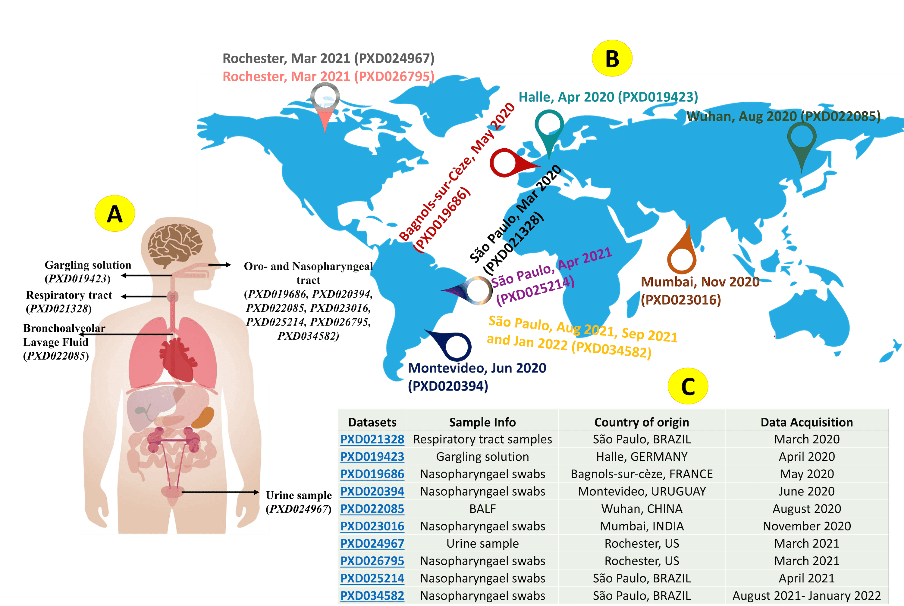
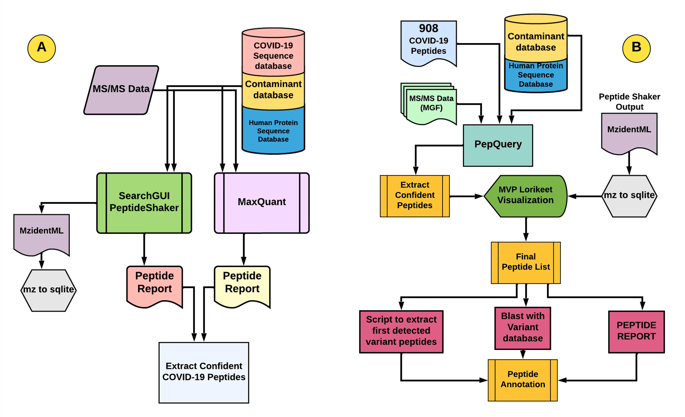
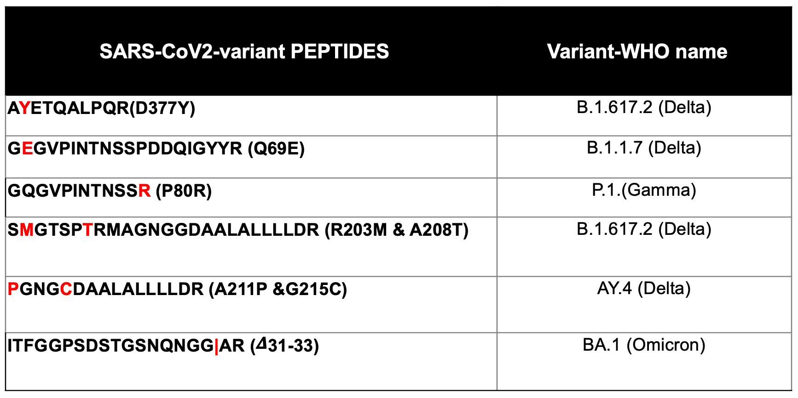
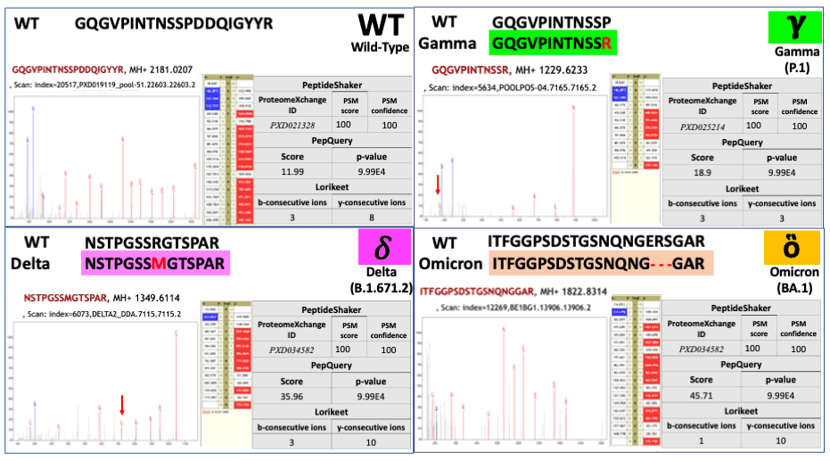

# Variant specific peptide panel for diagnosis, characterization and surveillance of the SARS-CoV-2 variants during the pandemic. 

## Live Resources

| Input / History / Workflow  | Link                                                        |
|--------------------------|-------------------------------------------------------------|
| Input data               | [Galaxy-COVID-Input-history](https://usegalaxy.eu/u/galaxyp/h/covid-viruses-input)  |
| Variant analysis history | [Galaxy-COVID-Variant-Analysis-history](https://usegalaxy.eu/u/galaxyp/h/covid-viruses-history) |
| Discovery workflow       | [Workflow 1](https://usegalaxy.eu/u/galaxyp/w/coviddiscovery-workflow)    |
| Verification workflow    | [Worklfow 2](https://usegalaxy.eu/u/galaxyp/w/covid-verification-workflow) |

## Description

The COVID-19 pandemic continues with the emergence of new strains. As virulence seems to be increasing with each variant, there is a dire need to advance the MS-based diagnostics to identify optimal strain-specific biomarker peptides from non-invasively collected clinical samples.The [Galaxy-P Team](http://galaxyp.org/) has developed workflows to detect and validate the SARS-CoV-2 peptides useful for developing targeted MS-based biomarker assays.

## Workflows

Our workflows are divided into two parts:

A) **Discovery workflow**, where MS/MS data from publicly available & nasopharyngeal patient samples were searched against protein FASTA files from SARS-CoV-2 Wild Type (WT) & variant strains along with Human UniProt & contaminants using SearchGUI/Peptide Shaker & MaxQuant search algorithms. Confident peptides were extracted from the peptide results & SARS-CoV-2 peptides were filtered by removing human proteins & contaminants.
We detected 210 SARS-CoV-2 peptides from twelve clinical datasets. These peptides were then added to a panel of 803 peptides to get 908 unique peptides.
 
 
B) **Verification workflow**, in which the 908 peptides were verified for their presence in the 12 clinical datasets using PepQuery Tool. The PepQuery Tool ranks the matches of the peptide panel to COVID-19 MS data against a reference proteome containing proteins from human and contaminants. Resulting data was filtered to generate a list of confident peptide matches with associated P-values (<0.05) to SARS-CoV-2 and its variants.
The peptide list was further analyzed using the tool BlastP. The spectral quality of these verified peptides was inspected manually using the tool Lorikeet within the Multi-omics Viewing Platform (MVP). 
Verified peptides were further investigated to extract additional information using the GISAID repository and then the peptides were manually aligned to the SARS-CoV-2 Wild type sequence for variant identification.

## Results

Most of the verified strain-specific peptides align to the nucleocapsid and spike proteins of the viral proteome, and would serve as the optimal targets for direct detection of SARS-CoV-2 strains.

The flexibility of the Galaxy workflows has the potential to detect the emerging strains on newly published MS datasets (DDA or Parallel Reaction Monitoring (PRM)). We are expanding our peptide panel to include peptide targets to detect emerging strains.

