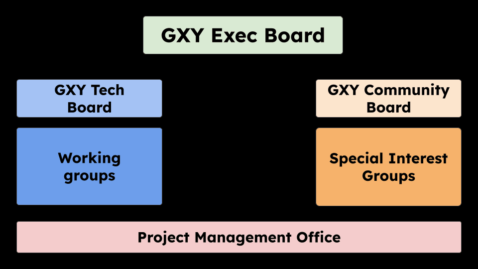

# Galaxy Community Board (GCB)

<slot name="/community/governance/linkbox" />

**Keywords:** Special Interest Groups, Community of Practices

<!-- This is the text from this GTN snippet. One day, would be good to make one central location for this and embed it https://training.galaxyproject.org/training-material/topics/community/faqs/governance_gcb.html -->

The Galaxy Community Board provides a supportive virtual forum for the exchange of ideas, and a governance body to represent [**Special Interest Groups** (SIGs)](https://galaxyproject.org/community/sig/) in Galaxy.

The goals of the GCB are to:

 - share resources, tips & best practices to make running **SIGs** easier;
 - discuss scientist (user) feedback to help guide Galaxy platform development;
 - communicate scientist (user) needs to the Galaxy Governance structure; and
 - develop proposals to advance scientist (user) goals in the Galaxy community.

## Where is the GCB in the Galaxy Governance Structure?

<!-- This is the text from this GTN snippet. One day, would be good to make one central location for this and embed it https://training.galaxyproject.org/training-material/topics/community/faqs/governance_structure.html -->

Galaxy Governance consists of a [Galaxy Executive Board](https://galaxyproject.org/community/governance/geb/) that provides global direction, working with a [Galaxy Technical Board](https://galaxyproject.org/community/governance/gtb/) that represents [Working Groups](https://galaxyproject.org/community/wg/) and a [Galaxy Community Board](https://galaxyproject.org/community/governance/gcb/) that represents [Special Interest Groups](https://galaxyproject.org/community/sig/).

## Who is in the GCB?
Each Galaxy Special Interest Group (**SIG**) may elect one member to represent their interests on the [GCB](/community/governance/gcb/). In practice, this is often (but not always) the person chairing the **SIG**.
This is analogous to the [Technical Board](/community/governance/gtb/), consisting of representatives of the [Working Groups (WG)](/community/wg).

You can learn more about **SIGs** in our dedicated tutorials below, or explore our [**SIG** directory](/community/sig).

  

    
 <!-- Changed from col-md-6 to col-md-12 -->
      

        

          <a href="https://training.galaxyproject.org/training-material/topics/community/tutorials/sig_define/tutorial.html">
            
            What is a SIG?
          </a>
        

        

          <a href="https://training.galaxyproject.org/training-material/topics/community/tutorials/sig_create/tutorial.html">
            
            Creating a SIG
          </a>
        

        

          <a href="https://training.galaxyproject.org/training-material/topics/community/faqs/governance_gcb_join.html">
            
            Join the GCB
          </a>
        

      

    

  

## Purpose

Representation of community aspects of the Galaxy ecosystem is central to long-term project sustainability. The goal is to empower community members
to participate in planning and governance, through efficient and transparent structures and processes, that can scale effectively as the Galaxy project continues to expand.

## Practicalities

The **GCB** organises and manages its own agenda and work, including arranging meetings and asynchronous discussions. The agenda might include planning new initiatives; supporting ongoing development; identifying and advocating for user needs; managing coherent, community-owned proposals and responses in the roadmap
processes and other important project decision-making.

Efficient communication between the GCB (Community Board) and both the GEB (Executive Board) and the GTB (Technical Board) requires at least one representative
from GEB and from GTB to be also members of the GCB. Therefore, it is recommended that at least one member of each of the other two Boards are also members of the GCB.

SIG members, and especially the representatives, are encouraged to join WG meetings or talk to WG representatives to raise issues or request help.
For example, SIG members could request assistance from the tools and workflows WG. WGs might contact SIGs to collect feedback from the community.

## Meetings Calendar

<iframe src="https://calendar.google.com/calendar/embed?height=600&wkst=1&ctz=Europe%2FLondon&showPrint=0&mode=AGENDA&showCalendars=0&src=MDQwNDY2MDRhNGYxODE2NDk0MjBkYTQzMzUzMTBkN2E1MmQxMGJmNDkxNDgwMGEyZjNhYjEzZWE0ZWY3MzEyY0Bncm91cC5jYWxlbmRhci5nb29nbGUuY29t&color=%237CB342" style="border-width:0" width="800" height="600" frameborder="0" scrolling="no"></iframe>

## Origins

During GCC 2023, we discussed how to empower the Galaxy community in terms of project planning, decision-making, execution, and overall governance. The Galaxy Community Board (GCB) was formed to take over from the Global Galaxy Steering Committee.

## Contributors
This page is brought to you by:
- [Wendi Bacon](https://training.galaxyproject.org/training-material/hall-of-fame/nomadscientist/)

with thanks for editing and review from:

 - [Saskia Hiltemann](https://training.galaxyproject.org/training-material/hall-of-fame/shiltemann/)
 - [Helena Rasche](https://training.galaxyproject.org/training-material/hall-of-fame/hexylena/)
