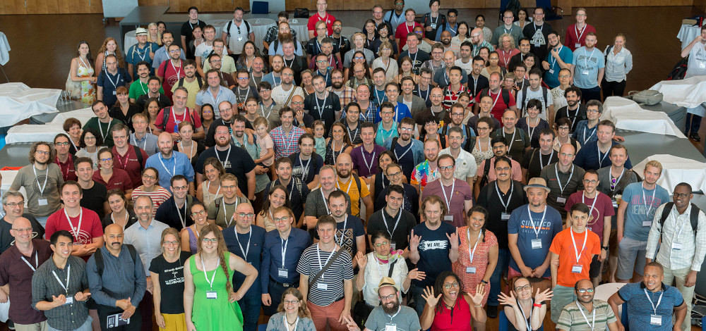

A vibrant community of contributors is the reason this project exists. The [Galaxy team](/galaxy-team/) alone cannot possibly [maintain enough servers](/use/), [wrap enough tools](https://toolshed.g2.bx.psu.edu/), [teach enough workshops](/events/), implement [all needed features](https://github.com/galaxyproject), or [answer every question](/support/) on its own. This is why community is vital to our core mission - enabling reproducible research in data-rich sciences and beyond. Members within the Galaxy community are located all around the world and often form subgroups that differ in size (small versus large) and degree of privacy (public versus private). This page highlights these groups.

<small>GCC2019 in Freiburg, Germany, photo by Bérénice Batut</small>

# Galaxy Community Conferences

In 2010 the National Science Foundation initiated a yearly gathering of Galaxy users and developers by providing the project with a grant supplement. Since then this gathering has grown into an annual event known as the **[Galaxy Community Conference (GCC)](/gcc/)**. GCC alternates between North America and elsewhere, and provides a forum for sharing knowledge and building collaborations. There have been over 200 participants every year since 2012.

# Working Groups and Project Governance

[Galaxy Working Groups](/community/wg/) are how the community manages and contributes to key parts of the Galaxy ecosystem.  Working Groups were introduced in December 2020.  If you want to get involved with Galaxy in a significant way then we recommend joining a working group.

*Working Groups are a key component of the [Galaxy Governance Model](/community/governance/), which also includes the [Galaxy Steering Committee](/community/steering/) and the [Galaxy Exec](/community/exec/).*

# IUC: Keepers of Galaxy Tools

The [Intergalactic Utilities Commission](/iuc/) (IUC) was established in 2012 to enable the pervasive use of the main Galaxy Tool Shed by ensuring the repositories available include contents that are functionally correct and optimized for installation into local Galaxies.  When appropriate, the group provides guidance to Galaxy tool developers so that they can improve the quality of their repositories.

<small class="trim-p">

[Code contributions](https://github.com/galaxyproject/tools-iuc/graphs) to [tools-iuc](https://github.com/galaxyproject/tools-iuc) repository

</small>

 

**Activities**

* Maintains a set of high quality Galaxy tools in the GitHub [repository](https://github.com/galaxyproject/tools-iuc). This repo serves as an excellent example and inspiration to all Galaxy tool developers.
* Cultivates and shares the Galaxy tool development best practices [document](http://galaxy-iuc-standards.readthedocs.io/).
* Provides support to tool developers on a public Gitter [channel](https://gitter.im/galaxy-iuc/iuc).

# Galaxy Training Network

The [Galaxy Training Network (GTN)](https://training.galaxyproject.org/) is a [network of people](https://training.galaxyproject.org/training-material/hall-of-fame) that create and maintain a [large library of Galaxy and Galaxy-based training materials](https://training.galaxyproject.org/). This material can be used in training and education settings, or used in stand-alone, self-paced training.  It's a good way to learn bioinformatics and Galaxy.

# Conda and Bioconda

[Conda](https://conda.io/docs/index.html) is an open source package management system that is heavily used by Galaxy to manage tool dependencies and installations. [Bioconda](https://bioconda.github.io/) is a specific channel for Conda that distributes popular bioinformatics software, many of which have been wrapped by the Galaxy community.

# Galaxy Developer Roundtable

[This group](/community/devroundtable/) meets every other Thursday.  It's an opportunity for presenters (Galaxy users, developers, admins) to engage with the Galaxy developer community interactively.  These are lightweight and informal gatherings, and are cancelled if no one volunteers to present.

Anyone is welcome to attend. If you would like to present, please [fill out this form](https://bit.ly/gxdevroundtablepresent) by midday Wednesday of that week.

# Regional Communities

| Region | Info | Links |
|--------|------|-------|
| [Arabic Community](/community/arabic/) | The Galaxy Arabic speaking community supports Galaxy activity for the Arabic speaking community and Arabic speaking regions of the world. | [<i class="fab fa-twitter" aria-hidden="true"></i>](http://twitter.com/galaxy_arabic) [<i class="fa fa-envelope" aria-hidden="true"></i>](https://lists.galaxyproject.org/lists/galaxy-arabic.lists.galaxyproject.org/) [<i class="fab fa-facebook-square" aria-hidden="true"></i>](http://bit.ly/2ek7fTh) |
| Australia | Australian Galaxy community | [<i class="fab fa-twitter" aria-hidden="true"></i>](http://twitter.com/galaxyaustralia) [<i class="fa fa-external-link-alt" aria-hidden="true"></i>](https://usegalaxy.org.au/) |
| [Czech](/community/czech/) | Česká komunita Galaxy / Czech Galaxy Community | [<i class="fa fa-envelope" aria-hidden="true"></i>](https://lists.galaxyproject.org/lists/galaxy-czech.lists.galaxyproject.org/) |
| Europe | [ELIXIR Galaxy Community](https://elixir-europe.org/communities/galaxy)   [Galaxy Europe](https://galaxyproject.eu/) | [<i class="fa fa-external-link-alt" aria-hidden="true"></i>](https://elixir-europe.org/communities/galaxy)   [<i class="fa fa-external-link-alt" aria-hidden="true"></i>](https://galaxyproject.eu/) [<i class="fab fa-gitter" aria-hidden="true"></i>](https://gitter.im/usegalaxy-eu) |
| France | Galaxy in the French Speaking World | [<i class="fa fa-external-link-alt" aria-hidden="true"></i>](https://community.france-bioinformatique.fr/c/galaxy/8) |
| India | [Indian Galaxy Community](https://www.galaxyproject.in/) | [<i class="fa fa-external-link-alt" aria-hidden="true"></i>](https://www.galaxyproject.in/) [<i class="fab fa-whatsapp" aria-hidden="true"></i>](https://chat.whatsapp.com/CCXT7t97ZX5D3MiD7MVmun) [<i class="fab fa-whatsapp" aria-hidden="true"></i>](https://chat.whatsapp.com/LYAWg6Yah1i4QbMU0sktqB) [<i class="fab fa-gitter" aria-hidden="true"></i>](https://gitter.im/usegalaxy-in/adda) [<i class="fab fa-twitter" aria-hidden="true"></i>](http://twitter.com/GxyIndia) [<i class="fab fa-twitter" aria-hidden="true"></i>](http://twitter.com/useGalaxyIndia) [<i class="fab fa-github" aria-hidden="true"></i>](https://github.com/usegalaxy-in/) [<i class="fa fa-envelope" aria-hidden="true"></i>](https://lists.galaxyproject.org/lists/india.lists.galaxyproject.org/) |
| Japan | Pitagora Galaxy Community | [<i class="fab fa-twitter" aria-hidden="true"></i>](https://twitter.com/hashtag/usegalaxyjp) [<i class="fa fa-external-link-alt" aria-hidden="true"></i>](http://wiki.pitagora-galaxy.org) |
| [The Netherlands](https://www.choosegalaxy.nl/) | Galaxy-NL has a mailing list and annual community meetings. | [<i class="fa fa-envelope" aria-hidden="true"></i>](https://lists.dtls.nl/mailman/listinfo/nlgalaxy-team) |
| UK | Galaxy in the United Kingdom | [<i class="fab fa-twitter" aria-hidden="true"></i>](http://twitter.com/galaxyukfriends) |
