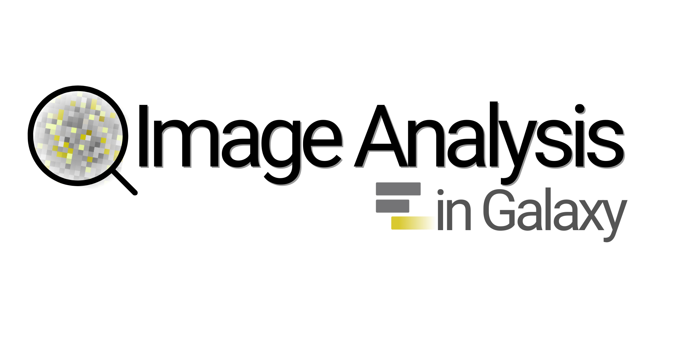
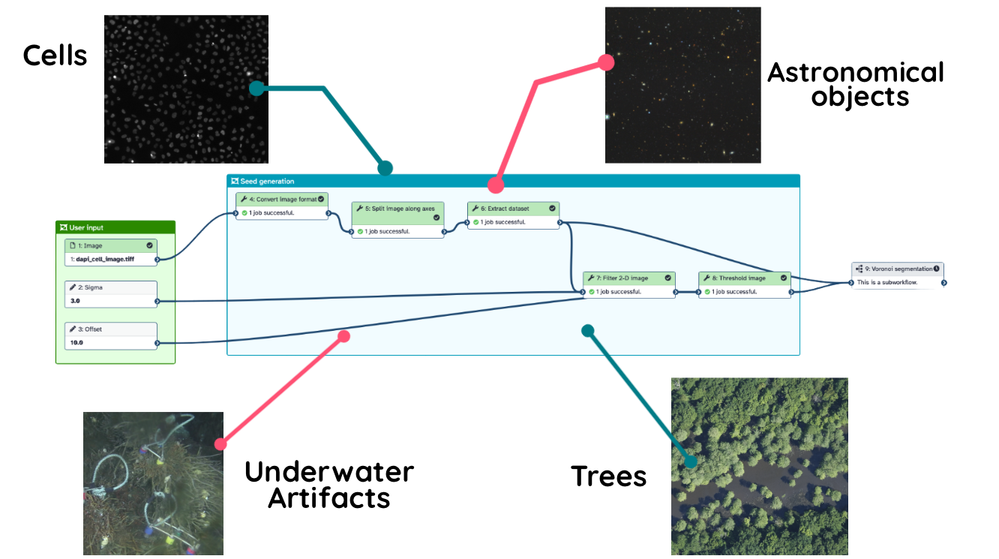

<slot name="/community/sig/common_linkbox" />

 

Welcome to the Image Analysis Community in Galaxy!

**The Galaxy Imaging community** integrates multiples disciplines and aims to connect scientists from different scientific fields. Our main goal is to bring together researchers and developers to create open-access tools and reusable imaging workflows.

## Community goals

Our primary goals are to:

* **Coordinate efforts** across the Galaxy ecosystem to reduce tool redundancy and harmonize workflows and training.
* **Highlight progresses** by sharing our work, both within and outside the Galaxy community, to drive scientific impact.
* **Empower the community** through proactive knowledge-sharing, collaborative troubleshooting, and cross-disciplinary support.

Additionally, we strive to:

* **Develop, add, and maintain** state-of-the-art image analysis tools within the Galaxy ecosystem.
* **Standardize [FAIR](https://www.nature.com/articles/sdata201618) principles**, ensuring all workflows are natively reproducible, interoperable, and reusable.
* **Bridge the learning gap** by expanding documentation and training resources for accessible skill-building across all expertise levels.
  

## Who we are

We are a diverse group of users, developers, trainers, and image data enthusiasts, collaborating to expand Galaxy’s image analysis capabilities, bringing the latest tools, feedback, and beyond.

- **Developers**: Are you building image analysis tools in Galaxy, or thinking of starting a project here? Do you need users, testers, or just want to make sure you’re not duplicating tools that already exist? Join us to connect, share ideas, and get support for your development journey!

- **Users**: Do you use Galaxy’s image analysis tools for bioimaging, Earth observation, or other fields? Have feedback for us, or interested in testing new resources? Perhaps you have ideas or requests for new tools — your input can help shape future developments!

- **Trainers**: Are you using Galaxy to train others in image analysis? If you have suggestions or specific needs to better support your trainees, we'd love to hear from you. Your insights are invaluable in helping us create better learning experiences and share data image analysis knowledge. 

# Getting started: GTN tutorials

To dive into Galaxy, the [Galaxy Training Network (GTN)](https://training.galaxyproject.org) offers tutorials for beginners and experts alike. These tutorials cover basic and advanced workflows, guiding you through analyses step-by-step. They also include a curated selection of workflows to help you gain hands-on experience in Galaxy. 

The Imaging community maintains a dedicated **[Imaging Scientific Topic](https://training.galaxyproject.org/training-material/topics/imaging/)** within the GTN. Our resources are designed to kick-start your understanding of **image data fundamentals** and the application behind complex analysis, ensuring you are guided and learn the science of imaging alongside the platform.

Our imaging tutorials cover:

* **Foundational Training**: Introduction to multidimensional image data, metadata standards, and digital signal processing.
* **Advanced Image RDM**: Specialized tutorials on **Research Data Management (RDM)** tailored for imaging, focusing on data stewardship, provenance, and FAIR practices.
* **Imaging Ecosystem Integration**: Expert-level guides teaching you how to manage and analyze data between Galaxy and remote image repositories such as [OMERO](https://www.openmicroscopy.org/omero/), [IDR](https://idr.openmicroscopy.org/), [BioImage Archive](https://www.ebi.ac.uk/bioimage-archive/) and [Zenodo](https://zenodo.org/).
* **Hands-on Workflows**: Step-by-step pipelines ranging from basic preprocessing and filtering to advanced AI-based segmentation using tools like **Cellpose** or running pre-trained models from the **BioImage.IO** model zoo.

<iframe 
  src="https://training.galaxyproject.org/training-material/tags/imaging/embed.html" height="400px" 
  width="100%" 
  class="gtn-embed" 
  frameborder="0">
</iframe>

# What is available?

## Image analysis tools

The Galaxy ToolShed offers a library of tools for image analysis, supporting the entire data lifecycle:

* **Format Conversion & Metadata**: Leverage **Bio-Formats** for robust data handling. Use tools like [Convert image format with Bioformats](https://usegalaxy.eu/root?tool_id=toolshed.g2.bx.psu.edu/repos/imgteam/bfconvert/ip_convertimage/6.7.0+galaxy3) or [Convert to OME-Zarr with Bio-Formats](https://usegalaxy.eu/root?tool_id=toolshed.g2.bx.psu.edu/repos/imgteam/bioformats2raw/bf2raw/0.7.0+galaxy5) to transform proprietary files into interoperable formats like OME-TIFF, OME-Zarr, or specialized transitions like DICOM to TIFF.
* **Segmentation & Classification**: Access state-of-the-art algorithms including **[Cellpose](https://usegalaxy.eu/root?tool_id=toolshed.g2.bx.psu.edu/repos/bgruening/cellpose/cellpose)**, **[SuperDSM](https://usegalaxy.eu/root?tool_id=toolshed.g2.bx.psu.edu/repos/imgteam/superdsm/ip_superdsm)**, and the cutting-edge **[Cellpose-SAM](https://usegalaxy.eu/root?tool_id=toolshed.g2.bx.psu.edu/repos/bgruening/cellposesam/cellposesam)**. You can also run high-performance pre-trained models directly from the **[BioImage.IO](https://usegalaxy.eu/root?tool_id=toolshed.g2.bx.psu.edu/repos/bgruening/bioimage_inference/bioimage_inference/2.4.1+galaxy3)** ecosystem.
* **Advanced Computing**: For custom deep learning, Galaxy provides GPU acceleration via **[Interactive Jupyter Notebooks](https://usegalaxy.eu/root?tool_id=interactive_tool_ml_jupyter_notebook)**, enabling you to train and fine-tune models on high-performance infrastructure.

<iframe
  id="inlineFrameExample"
  title="Image analysis related tools"
  width="100%"
  height="300px"
  frameBorder="0"
  src="https://galaxyproject.github.io/galaxy_codex/communities/imaging/resources/">
</iframe>

> **Get involved with the Codex**: This list is powered by the [Galaxy Codex Project](https://github.com/galaxyproject/galaxy_codex/tree/main/communities/imaging/resources). You can explore the raw metadata or contribute by adding new tools directly to the repository.

*Are we missing a tool? [Reach out to us](https://matrix.to/#/#galaxyproject_imaging:matrix.org) to help keep this list comprehensive.*

## Cross-disciplinary workflows

One of our community’s aims is to develop **universal workflows**. The idea is that a single Galaxy pipeline can be designed to handle data from very different scientific fields, making tools more reusable across the board. 

As a proof of concept, we’ve built a workflow that works across multiple disciplines:

*Example: The same Voronoi segmentation workflow processing data from Cell Biology, Astronomy, Underwater Archaeology, and Ecology. You can see it in action in [this video](https://youtu.be/2w8okrORVtM?si=O8NOxgXVmdzwE2Pc).*

## Interactive tools

Many image analysis tasks require "eyes-on-data" interaction. Galaxy's **Interactive Tools** bring the power of desktop software directly to your browser for real-time exploration and manual curation:

* **[Napari](https://galaxyproject.org/news/2024-02-26-napari-available/)**: A powerful multi-dimensional image viewer for interactive visualization and segmentation.
* **[QuPath](https://galaxyproject.org/news/2025-06-24-qupath-post/)**: The industry standard for digital pathology and whole-slide image analysis.
* **[CellProfiler](https://usegalaxy.eu/root?tool_id=interactive_tool_cellprofiler)**: A comprehensive solution for automated image analysis, allowing you to build modular pipelines for measuring and quantifying phenotypes in large-scale biological datasets.
* **[ilastik](https://usegalaxy.eu/root?tool_id=interactive_tool_ilastik)**: The interactive learning and segmentation toolkit that leverages machine learning to perform pixel classification and object segmentation.
* **[Cellpose Interactive](https://usegalaxy.eu/root?tool_id=interactive_tool_cellpose)**: Fine-tune your cellular segmentation parameters on-the-fly.

*Visualizing complex imaging data directly in the browser using the Napari interactive tool.*

## Visualizations

The **[zarr](https://zarr.dev/)** format is becoming a standard for storing large image data. With various adaptations like [OME-Zarr](https://ome-zarr.readthedocs.io/en/stable/) and [GEOZarr](https://github.com/zarr-developers/geozarr-spec), this interoperable format enhances data reusability across disciplines. Our community supports zarr-based visualization through tools like vizarr, helping bring this dream of cross-discipline interoperability to life.

<video-player
  src="/community/sig/image-analysis/vizarr-visualization.mp4"
  style="display:block; width:100%; height:auto; max-width:100%; margin:0 auto;"
></video-player>

## A dedicated Galaxy interface

For a streamlined experience, visit our dedicated portal, **[imaging.usegalaxy.eu](https://imaging.usegalaxy.eu)**, tailored specifically for imaging scientists like you!

# How to get involved?

If you're interested in image analysis (within or outside Galaxy) and want to help ensure our tools represent the best, up-to-date practices, your feedback is needed! We’re constantly looking for ways to improve, whether in scientific fields already supported by Galaxy or in exploring new applications.

If you're **passionate about shaping the future of image analysis in Galaxy** and want to help build a strong, collaborative, and supportive community, **you're in the right place!**

## Communication channels

Our community connects via our dedicated [Matrix channel](https://matrix.to/#/#galaxyproject_imaging:matrix.org).

## Online community meetings

We organize regular meetups as part of the Euro-BioImaging Expert Group "FAIR Image Data Workflows," chaired by Anne Fouilloux and Beatriz Serrano-Solano.

- **Frequency**: Monthly
- **Duration**: 1 hour
- **Time**: 3rd Wednesday of the month at 4 pm CET
- **Meeting Agenda**: Updates from the community (e.g., upcoming events), relevant talks or case studies, and coordination for activities such as grant writing, paper development, and event planning. View our [open agenda and notes here](https://docs.google.com/document/d/1eWyj5IJVW4qeLKcz2SybHbf0Kx6K3Njvirl6ql-f1Fo/edit?tab=t.0#heading=h.wvq01nlj8eqb).

## In-person meetings and conferences

In-person meetups are also part of our community engagement. We recently participated in BioHackathon 2023 and 2024, where we collaborated on new projects and shared [preprints](https://osf.io/preprints/biohackrxiv/w8dsz).

Poster available in [Zenodo](https://zenodo.org/records/13847465).

## Community calendar

<iframe src="https://calendar.google.com/calendar/embed?src=c_8acb465939b9b029599a18b0d57e9793dd9d4a742c20c033f25f43c1f1de6ba9%40group.calendar.google.com&ctz=Europe%2FParis" style="border: 0" width="100%" height="600" frameborder="0" scrolling="no"></iframe>

# Acknowledgments

Our community's success is made possible through partnerships and collaborations. We thank our partners for their support.

## Partner projects

Community members actively pursue funding opportunities and contribute to various projects, such as:

| Project Name | Description | Community Members Involved | Funding Period |
|-------------------|-------------------------------------------------------------------------------------------------------|-----------------------------------------------------------|----------------|
| [**NFDI4BIOIMAGE**](https://nfdi4bioimage.de/) | NFDI4BIOIMAGE is working on solutions that enable researchers in bioimaging to handle, store, share, and reuse bioimaging data. | Riccardo Massei, Bjoern Gruening, Yi Sun | 2022 - 2027 |
| [**OSCARS**](https://oscars-project.eu/) | Creating reusable workflows for diverse disciplines like microscopy, astrophysics, and environmental sciences | Beatriz Serrano-Solano, Anne Fouilloux, Matus Kalas  | 2025 - 2027 |

<table><tr>
<td width="18%">

</td>
<td width="12%">

</td>
<td width="10%">

</td>
<td width="20%">

</td>
<td width="10%">

</td>
<td width="12%">

</td>
<td width="12%">

</td>
</tr></table>
