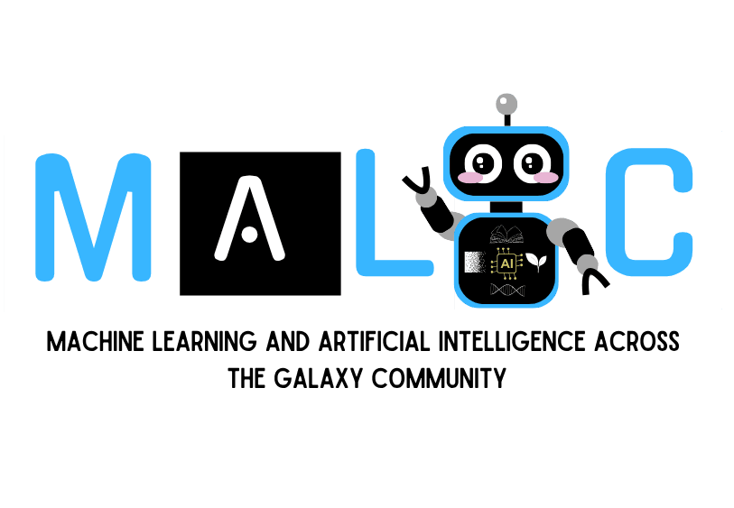
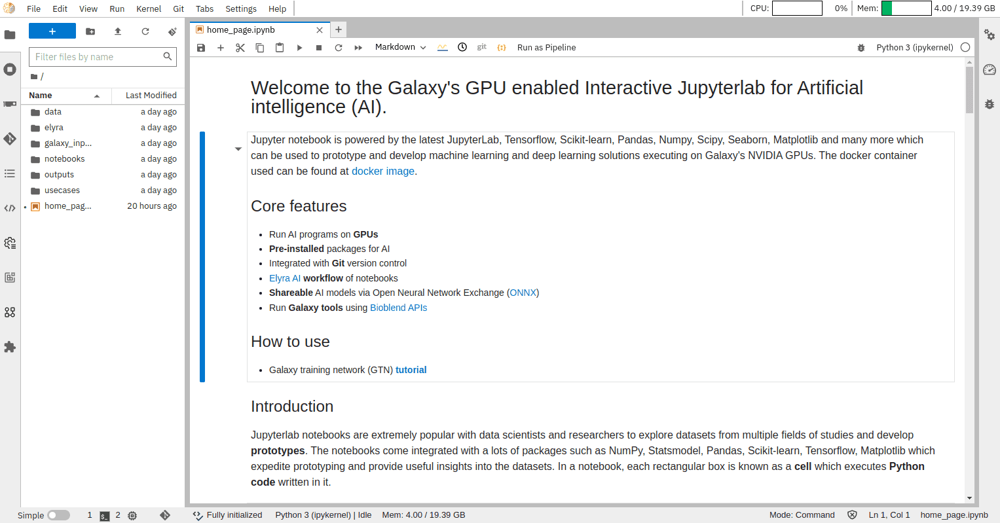
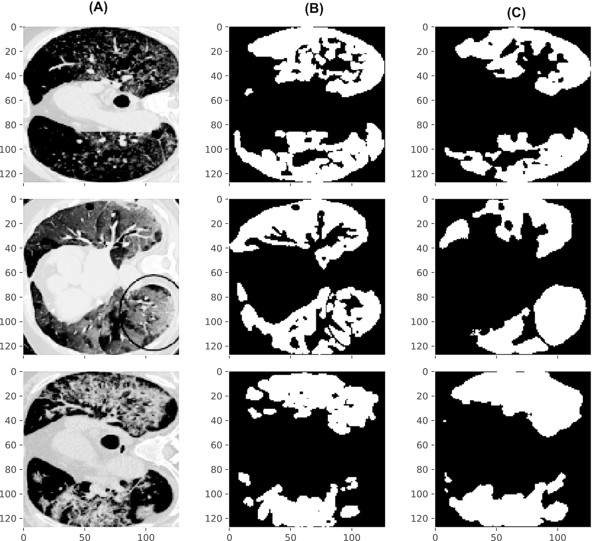
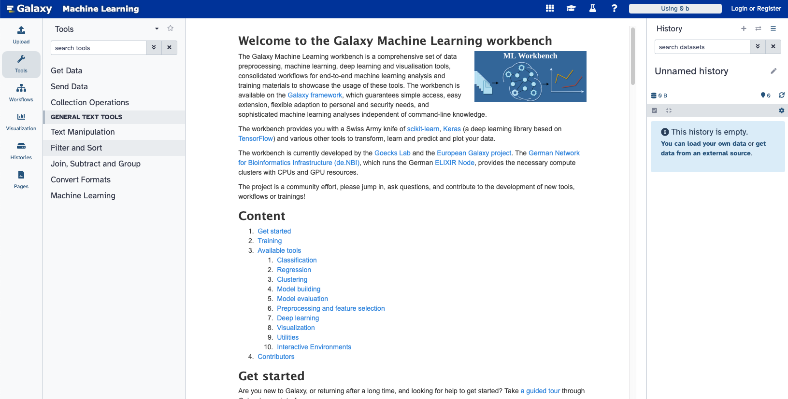
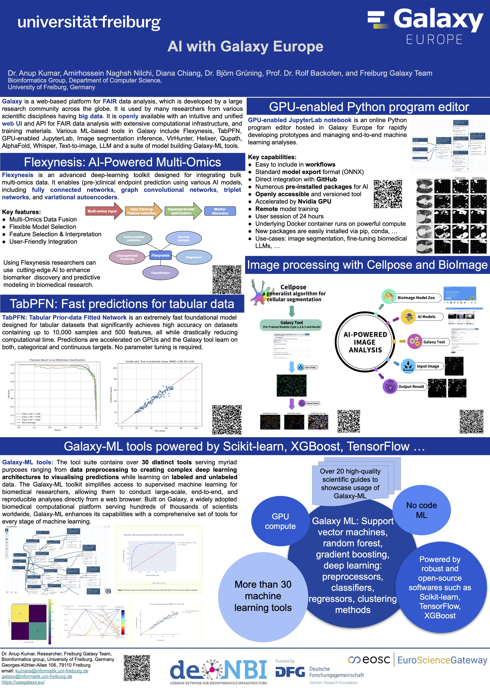

  

  <slot name="/community/sig/common_linkbox" />

# Welcome to **MALIC – Machine Learning and Artificial Intelligence across the Galaxy Community!**  
*The Galaxy-wide community for ML & AI across disciplines*

**MALIC** is a stylized name representing the key themes of our community:  
- **M** – Machine  
- **A** – Artificial  
- **L** – Learning  
- **I** – Intelligence  
- **C** – Community (across Galaxy)

**Like every Galaxy community, we have our own unique flavor!**
MALIC brings together everything related to machine learning (ML) and artificial intelligence (AI) within Galaxy. We connect users, developers, and trainers from diverse fields to collaborate, share, and grow together in this transformative era of AI.

**Our mission is to connect fields such as _digital humanities_, _omics_, _ecology_, and _imaging_, by sharing expertise to strengthen the Galaxy platform.**

## Could MALIC be your new home within Galaxy? Let’s find out!

We’re a growing, welcoming community of people using and developing ML/AI tools in Galaxy.  
Whether you're working with data in biology, ecology, humanities, imaging or anywhere in between, there's a place for you here!

- **Developers**  
  Are you wrapping or building ML or deep learning tools? Join us to coordinate efforts, avoid duplications and get early feedback from others in the community.
- **Users**  
  Are you using Galaxy ML tools for omics, images or texts? Share your experiences, tell us what works well and where we can improve. Your feedback helps shape future tool design.
- **Trainers**  
  Are you contributing tutorials or running workshops? Help us curate and connect training resources across different use cases and domains.
- **Researchers**  
  Are you exploring new ML applications in Galaxy? Join us to benchmark workflows, improve reproducibility and exchange ideas across disciplines.

## MALIC Community Goals

Our primary goals are to:
* **Coordinate efforts** across the Galaxy ecosystem to reduce redundancy in tools, workflows, and training.
* **Share our work** from within and outside Galaxy to showcase our advancements.
* **Support each other** through knowledge-sharing, troubleshooting, and collaboration.

Additionally, we strive to:
* **Develop and maintain** ML/AI tools within Galaxy.
* **Implement FAIR principles** to make workflows reproducible and reusable.
* **Expand documentation** and **training resources** for accessible learning and skill-building.

## Meetings and Communication

- **When?** We meet every third Thursday at 16:00 CET  
- **How long?** Just one hour, short and sweet!  
- **What’s on the agenda?** Tool demos, cross-domain updates, collaboration planning, and relaxed idea sharing.

- Our community connects via our dedicated [Matrix channel](https://matrix.to/#/#galaxyproject-machine-learning:matrix.org).
- Check out our [agenda](https://docs.google.com/document/d/1ElFZtbUemUXvygcozbrvS7XEfMIpi0eYPT-gsnjVq3o/edit?usp=sharing) to see what we’re currently working on.

## New to ML in Galaxy?

We got you covered! These resources are perfect for beginners or returning users:

To dive into ML and AI with Galaxy, the [Galaxy Training Network (GTN)](https://training.galaxyproject.org) offers a wide range of tutorials. These tutorials guide you step by step through core ML, statistics, and AI concepts, tools, and workflows. They help you gain hands-on experience and build reproducible analyses using Galaxy.

<iframe 
  src="https://training.galaxyproject.org/training-material/tags/statistics/embed.html" height="400px" 
  width="100%" 
  class="gtn-embed" 
  frameborder="0">
</iframe>

# What ML and AI tools are available?

The Galaxy ToolShed offers a wide variety of ML and AI tools, freely available for installation on any Galaxy server.  
Our community maintains a curated list to keep users informed and up to date.

Here is a curated highlight of tools from our community:

## Galactic Wizard: Your LLM-Powered Guide 

Integrated with a Large Language Model (LLM), the Galactic Wizard is an AI-powered assistant within Galaxy,
ready to answer questions.

### Generative AI tools

- **[Text-to-Image Magic](https://galaxyproject.org/news/2024-11-26-flux/)**: The FLUX model suite enables the generation of high-quality images from text descriptions.
- **[Large Language Model (LLM)](https://galaxyproject.org/news/2024-09-02-chat-gpt/)**: in Complex Workflows: Galaxy’s ongoing innovation incorporates Large Language Models into complex workflows, enabling users to build and refine intricate pipelines with AI assistance.

## MCP-based AI-agent

This project offers a **[Model Context Protocol (MCP)](https://github.com/galaxyproject/galaxy-mcp)** server designed to interface with the Galaxy bioinformatics platform. It allows AI assistants and other clients to connect to Galaxy instances, search for and run tools, manage workflows, and interact with various features within the Galaxy ecosystem.

## Intelligent Tool Recommendations

Building on advanced RNN-based systems, **[Galaxy’s tool recommender](https://galaxyproject.org/news/2023-11-29-transformer-paper/)** suggests the most relevant tools based on user activity and data inputs, streamlining workflow creation and analysis.

## ML-based tools

Galaxy hosts more than 3500 tools, numerous ML/AI-powered and tailored for specific research questions:

- [Whisper](https://galaxyproject.org/news/2024-04-25-whisper-tool/): Open-source speech recognition now available in Galaxy enables accurate transcription of audio files.
- [Cleanlab](https://usegalaxy.eu/root?tool_id=toolshed.g2.bx.psu.edu/repos/bgruening/cleanlab/cleanlab_issue_handler/2.7.1+galaxy1.0): Detect and optionally [clean ML datasets](https://galaxyproject.org/news/2025-06-13-cleanlab/) issues using Cleanlab.
- [TabPFN](https://usegalaxy.eu/root?tool_id=toolshed.g2.bx.psu.edu/repos/bgruening/tabpfn/tabpfn/2.0.9+galaxy0): TabPFN offers a foundational model for tabular data. It can be used for classification and regression on tabular datasets.
- [CellPose Interactive](https://usegalaxy.eu/root?tool_id=interactive_tool_cellpose): A generalist algorithm for cellular segmentation and restoration
- [VirHunter](https://usegalaxy.eu/root?tool_id=toolshed.g2.bx.psu.edu/repos/iuc/virhunter/virhunter/1.0.0+galaxy3): Detect novel RNA viruses in plant sequencing data using deep learning.
- [Helixer](https://usegalaxy.eu/root?tool_id=toolshed.g2.bx.psu.edu/repos/genouest/helixer/helixer/0.3.3+galaxy1): Perform gene calling with state-of-the-art deep neural networks.
- [Qupath](https://usegalaxy.eu/root?tool_id=interactive_tool_qupath): Leverage interactive machine learning for object and pixel classification.
- [Deep-Learning Multi-Omics Integration](https://usegalaxy.eu/root?tool_id=toolshed.g2.bx.psu.edu/repos/bgruening/flexynesis/flexynesis/0.2.18+galaxy0): Integrate bulk sequencing data across multiple omics.
- [Alphafold](https://usegalaxy.eu/root?tool_id=toolshed.g2.bx.psu.edu/repos/galaxy-australia/alphafold2/alphafold/2.3.2+galaxy3): AI-powered 3D protein structure prediction.
- [Ilastik](https://usegalaxy.eu/root?tool_id=interactive_tool_ilastik): Utilize an interactive learning and segmentation toolkit for image analysis.

**...many other tools that use internal models, as illustrated below by our CODEX project!**

<iframe
  id="inlineFrameExample"
  title="ML/AI related tools"
  width="100%"
  height="300px"
  frameBorder="0"
  src="https://galaxyproject.github.io/galaxy_codex/machine-learning/">
</iframe>

## GPU-Enabled JupyterLab Notebook

Galaxy now supports [GPU-enabled Jupyter Notebooks](https://galaxyproject.org/news/2023-06-06-new-paper-gpu-jupyter-lab/), enhancing computational performance for resource-intensive ML and AI tasks. This feature enables users to experiment with deep learning models and large-scale data analytics seamlessly.

  

    
    

      GPU-enabled JupyterLab notebook is an online Python program editor hosted in Galaxy Europe  
      for rapidly developing prototypes and managing end-to-end machine learning analyses.
    

  

  

    
    

      Example of CT scan segmentation using the JupyterLab tool.  
      The model predicts region masks using BCE Loss and TV Loss.
    

  

## AI-Assisted Programming

Through Galaxy Jupyter Notebooks, researchers can harness ChatGPT as a programming assistant. [This integration](https://galaxyproject.org/news/2023-08-14-chat-gpt/) simplifies code generation, debugging, and workflow optimization.

## AI-Powered Model Inference

Galaxy integrates a range of pre-trained AI models to support different inference tasks, from biological systems modeling to biomedical image analysis. These models are accessible through dedicated tools and resources:

### BioModels for systems biology

The **[BioModels](https://www.ebi.ac.uk/biomodels/)** repository provides computational models of biological processes (e.g. in SBML format). Galaxy integrates a **[dedicated tool](https://usegalaxy.eu/root?tool_id=toolshed.g2.bx.psu.edu/repos/bgruening/biomodels_biomd0000001066/biomodels_biomd0000001066/1.1)** that serves a pre-trained Random Forest model to predict immune checkpoint blockade efficacy across multiple cancer patient cohorts.

This enables researchers to run predictive models directly within Galaxy—without the need for local infrastructure.

> _Learn more in the [BioModels tool blog post](https://galaxyproject.org/news/2023-11-29-bio-m-ltool/)._

### BioImage.IO models for image analysis

Galaxy also supports **[BioImage.IO](https://bioimage.io/#/)**, a repository of deep learning models for biomedical image processing (e.g., segmentation, classification).  
Using the **[BioImage Inference tool](https://usegalaxy.eu/root?tool_id=toolshed.g2.bx.psu.edu/repos/bgruening/bioimage_inference/bioimage_inference/2.4.1+galaxy3)**, users can:

- Load models directly from BioImage.IO for inference
- Apply state-of-the-art models on microscopy data
- Access mirrored models within Galaxy for fast and efficient use

> _Explore the GTN tutorial: [Processing Images with BioImage.IO models](https://training.galaxyproject.org/training-material/topics/imaging/tutorials/process-image-bioimageio/tutorial.html)_

## Yolo-based inference tools

- **[Perform YOLO image labeling](https://usegalaxy.eu/root?tool_id=toolshed.g2.bx.psu.edu/repos/bgruening/yolo_predict/yolo_predict/8.3.0+galaxy0)**: Perform segmentation and object detection on images.
- **[Perform YOLO training](https://usegalaxy.eu/root?tool_id=toolshed.g2.bx.psu.edu/repos/bgruening/yolo_predict/yolo_predict/8.3.0+galaxy0)**: Process a dataset of images by splitting them into training, validation, and test sets, then trains a machine learning model based on YOLO models.
- **[DocLayout-YOLO Enhancing document layout analysis](https://usegalaxy.eu/root?tool_id=toolshed.g2.bx.psu.edu/repos/bgruening/doclayoutyolo/doclayoutyolo/0.0.4.1+galaxy0)**: The tool takes a Yolo model trained for annotating bounding boxes around text.

_Are we missing some tools? [Reach out to us](https://matrix.to/#/#galaxyproject-machine-learning:matrix.org) to keep the list comprehensive._

# Galaxy-ML: Democratizing Machine Learning in Biomedicine and beyond

## A dedicated Galaxy ML instance

[ml.usegalaxy.eu](https://ml.usegalaxy.eu) is a Galaxy instance designed specifically for machine learning and AI. This web-based toolkit is designed to make supervised machine learning accessible, reproducible, and scalable for researchers. It supports end-to-end workflows, from preprocessing to evaluation, all within a browser. 

_Original Publication: [Galaxy-ML Toolkit](https://journals.plos.org/ploscompbiol/article?id=10.1371/journal.pcbi.1009014)_

## In-person meetings and conferences

In-person meetups are also part of our community engagement. We recently participated in a local symposium on AI in Freiburg, where we shared all the exciting novelties on AI in Galaxy!

Poster available in [Zenodo](https://zenodo.org/records/15639973).

<iframe src="https://calendar.google.com/calendar/embed?src=4479a7d76a41a3160e0dd6f173dc3180cd90efd503930a87037dd136fd83b864%40group.calendar.google.com&ctz=Europe%2FBerlin" style="border:solid 1px #777" width="100%" height="300" frameborder="0" scrolling="no"></iframe>

## Ways to Contribute

- Share your Galaxy ML-AI use case
- Contribute new tools, training, or workflows
- Test and review tools from other domains
- Join **Hackathons**, **Co-Fests** or **Co-Host GTN Tutorials**

## Keywords

AI, Machine Learning, Deep Learning, Galaxy ML, Keras, scikit-learn, Text Mining, Digital Humanities, Imaging, Genomics, Ecology, Classification, Clustering, Neural Networks, Predictive Models, Training, Community, FAIR workflows

We’re already building something great — but it won’t be complete without you.
**Come be part of MALIC, your home for Machine Learning and AI within Galaxy!**

<table><tr>
<td width="10%">

</td>
<td width="10%">

</td>
<td width="10%">

</td>
<td width="10%">

</td>
<td width="20%">

</td>
<td width="10%">

</td>
</tr></table>
