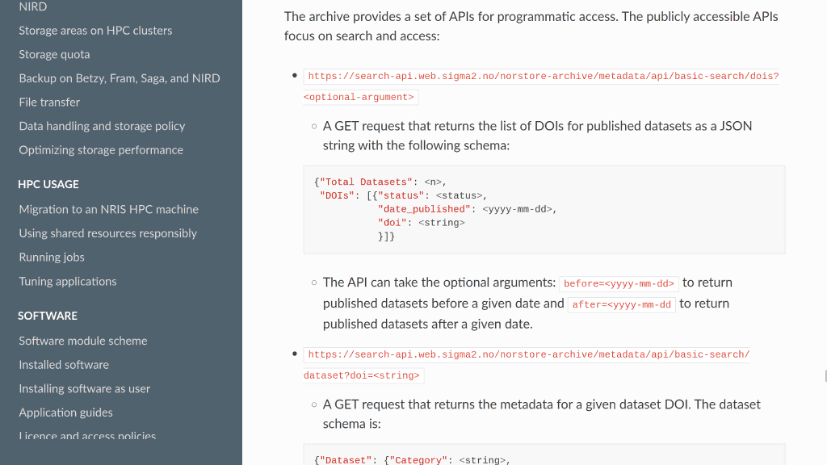
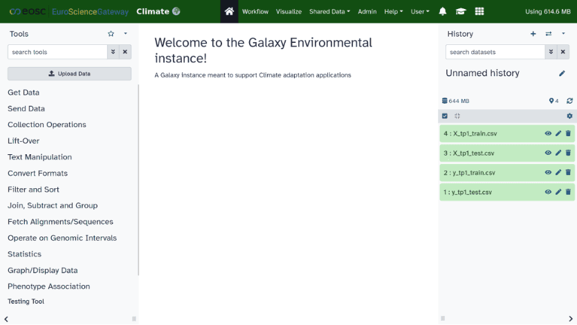

## Our community onboarding

### How did we get to know about Galaxy project and framework and its potential

We, representing the Climate community within the [EuroScienceGateway project](https://galaxyproject.org/projects/esg/), are a group of engineers and scientists from the [University of Oslo in Norway (UiO)](https://www.uio.no/english/), which was originally formed at the [Geosciences Department](https://www.mn.uio.no/geo/english/), and then some of us transferred to the [IT Department](https://www.usit.uio.no/english/) while others left academia.

Climate Science Workbench which predated [EuroScienceGateway](https://galaxyproject.org/projects/esg/)

Way before the [EuroScienceGateway (ESG) project](https://galaxyproject.org/projects/esg/) started some of us had already identified the potential of Galaxy beyond bioinformatics applications and introduced it to the climate science community. Over the years a number of tools more suited to geoscience applications were packaged and added to the [toolshed](https://toolshed.g2.bx.psu.edu/). A more domain [specific Galaxy portal](https://climate.usegalaxy.eu/), was also set up where a selection of climate-related tools was made more easily accessible on the front page and in the meantime [a lot of training material](https://training.galaxyproject.org/training-material/topics/climate/) was developed.

Landing page of the https://climate.usegalaxy.eu/

This work was largely presented at conferences, workshops were organised, and a number of climate Galaxy users were taken on board and trained. We therefore had a good knowledge and practice of Galaxy, as opposed to the astrophysics, catalysis and muon communities.

### What were our needs / challenges

We quickly realised that the tools we had introduced into Galaxy because we thought that they were what the climate community needed were not necessarily those that would attract more users. On the other hand some of these tools, like those to display multi-dimensional data, were also appreciated by users from other disciplines.

Basically the climate community is formed of a wide range of people with a large variety of interests and broad technical skills. Some are involved in developing and running large numerical models on supercomputers, for Earth System Modelling typically, or analysing large amounts of spatiotemporal data, and these users are not afraid by the command-line interface. On the opposite side of the spectrum are more terrain people, those going on sites, doing measurements in the field or experiments in the laboratory, and these largely prefer a Graphical User Interface.

Attracting computer literates and those allergic to it to Galaxy is challenging because the former are used to high-performance and see Galaxy as a mere toy and do not see the need to learn something new, whereas the latter will only come to Galaxy if they get immediate access to applications that they can use without much effort, via a nice GUI. In both cases users expect to be able to achieve more with Galaxy than on their laptop, with more resources and more facilities. For them it is not the number of tools available that matters but access to a Workflow Management System making it possible to showcase their research and reproduce entire sequences of tasks in an automatic way.

### What were the steps we made

Based on this experience and considering that there are “enough” generic tools in the Climate Galaxy already, we decided to focus with [EuroScienceGateway](https://galaxyproject.org/projects/esg/) on providing workflows and examples of applications that go beyond what climate scientists can easily achieve on their own laptop. Thereby demonstrating that Galaxy is a perfectly suited place for performing complex tasks including for instance Machine Learning with all the data preparation, model training and forecasting that is already difficult to carry out for most practitioners in a dedicated framework, or running a fully fledged Earth System Model in Galaxy, taking advantage of the large amount of resources to be made available through the Bring Your Own Compute (BYOC) service introduced by the [EuroScienceGateway project](https://galaxyproject.org/projects/esg/).

This meant that we had to select a number of use cases, touching on topical research and starting from scientific communications, with related Jupyter notebooks, devising a method to split these notebooks into manageable “chunks” which can be converted into Galaxy tools to reform workflows:

- IceNet is a complex probabilistic, deep learning sea ice forecasting system which learns how sea ice changes from climate simulations and observational data and is able to forecast up to 6 months in advance the monthly-averaged sea ice concentration maps at 25km resolution.
- FArLiG is also a machine learning model that uses meteorological reanalysis data from ERA5-land at ~10km resolution to detect winter warming periods, and combines it with a detailed satellite derived vegetation cover classification (initially at 100m resolution) to forecast the concentration of moss and lichen in the Arctic (which is vital for wildlife and local reindeer herders).

For both the examples, we needed to sort out the provision of the input data, create new tools when appropriate and reusing existing ones where available, optimise the workflow and make it to work as well as the original Jupyter notebooks, all at the click of a button. The idea here is to demonstrate that very intricate data analysis can be accessible to climate Galaxy users whereas it would have required significant work for them to achieve it by themselves, that the entire workflow is reproducible but also reusable for other applications.

### What have we have achieved given our level of maturity

At the time of writing this report, the machine learning part of the IceNet and FArLiG workflows which form the heart of these use cases work and we now have to finalise the packaging, add the data preparation for FArLiG (for the downscaling) and sort out some persistent storage for the inputs. For this purpose we envisage several options, including using the Norwegian Infrastructure for Research Data (NIRD) archive which is being deployed, if individual entries can be accessed as S3-compatible, using the Lumi-O object storage partition (although what happens to the data after the end of the allocation period is not clear yet), or Bring Your Own Storage (BYOS) provided this also offers a permanent solution. We also have to think about how and how often the data will be updated for future forecasts, and we aim to develop the associated documentation and training material.

The updated NIRD API which should now provide S3 links (work in progress).

To advertise further Galaxy and highlight the potential benefits of Open Science, FAIR principles and reproducible workflows, we are used to communicate with the wider climate community via conferences (for presenting IceNEt and FArLiG for example at [European Geosciences Union (EGU)](https://www.egu.eu/meetings/) and Galaxy Community Conferece (GCC)) and get feedback. We also tried to raise awareness among scientists in our own community but also other academic disciplines that study human cultures, including history, philosophy, literature, arts, and language (humanities) by taking part in a series of workshops where we introduced and illustrated what are Open Science and the [European Open Science Cloud (EOSC)](https://eosc.eu/), also explaining what is behind the words “Findability, Accessibility, Interoperability, and Reusability” of research data, what Research Objects are and more generally how Galaxy portals and the project [EuroScienceGateway](https://galaxyproject.org/projects/esg/) can be useful to researchers in their day to day work/activities [https://zenodo.org/records/10478824](https://zenodo.org/records/10478824).

One of the presentations made at the Digital Scholarship Days 2024.

### What have we have in mind for the remainder of the project

Regarding the possibility of running climate simulation within Galaxy, we already have a [tool for CESM](https://anaconda.org/bioconda/cesm), the Community Earth System Model, however this being built using generic conda packages it can only be used on a single node (i.e., it lacks the system libraries specific to individual supercomputers to allow inter-node communications and hence the ability to run on a large number of processors). As a result, this fantastic tool is not used much, despite offering climate Galaxy users access to a state-of-the-art model to test themselves various scenarios without them having to get hold of the model source code, then install and port it on their own computer. The main reason for that is that running climate simulations to be able to perform sensible analysis requires several model years (in climate science we consider 25-30 years is the minimum) and given the current  model throughout (i.e., number of simulated years per computation day) achievable with the limited compute resources available from Galaxy Europe (a couple of months per day at best) this is a no go. Taking advantage of ESG’s Bring-Your-Own-Compute (BYOC) we hope to leverage thousands of CPUs to make climate simulations in Galaxy practical. Note that this relies on revisiting the entire feedstock to add interconnect protocols aware packages and hence a significant amount of work that we may not be able to finish within the timeframe of this project.

The Community Earth System Model conda package used in the eponymous Galaxy tool.

There is also an increased demand for tools related to the [“Urban Heat Island” (UHI) effect](https://en.wikipedia.org/wiki/Urban_heat_island), which occurs when cities replace the natural land cover and vegetation with a dense concentration of buildings and pavements, with surfaces and materials which absorb and retain heat, as opposed to nearby more rural areas. This UHI effect is normally most noticeable during the night, however due to climate change it seems to  impact territories that were previously unaffected, and is associated with increased energy consumption, elevated cooling demands, reduced air quality, potential health and security risks for urban residents. We therefore endeavour, if time permits, to add a UHI tool to Galaxy, the exact form and capabilities of this tool still remain to define but it has to be easy to use and produce something visually appealing like heat maps to “condense” the information.

#### Setup

UiO Galaxy server: 

Test server for the Climate Galaxy Pulsar node: 16 vCPUs (main Galaxy front end)
Job runner: 16 vCPUS (Pulsar)

This was setup following the Galaxy Server administration tutorials and is intended to evaluate the possible deployment of a Pulsar node on Lumi, currently in standby.

### Reference data

No satisfying solution for “persistent” storage of reference data implemented yet. Several options will be explored, including the NIRD archive, Lumi-O and Bring-Your-Own-Storage (BYOS).

### Problems to solve

The provision of additional CPU and GPU resources within [EuroScienceGateway](https://galaxyproject.org/projects/esg/) is a must, and that should satisfy most compute needs of a vast majority of Galaxy users. However the main issues we see for some of the computationally demanding tools such as CESM (climate model) or for Machine Learning on GPUs is that there are compatibility issues with existing conda packages and related biocontainers. Without going into the details of the hardware and software requirements, and while NVIDIA, AMD and Intel are major vendors of GPUs, most (if not all) conda packages are only adapted to NVIDIA GPUs: this makes it currently impossible to exploit the powerful AMD GPUs on the Lumi-G partition, for instance. 

The other issue which has been largely overlooked is about the inability to run Galaxy jobs spanning multiple nodes on High-Performance Computers (HPCs) high-speed interconnects without the tools themselves being compatible with the host transport protocol implemented. This came to light after Lumi’s recent interconnect upgrade to Slingshot-11 with OFI (OpenFabrics Interfaces) instead of supporting UCX (Unified Communication X). That stopped short all efforts to deploy a Pulsar node on Lumi.

Addressing this will require significant community efforts to completely rewrite the feedstock recipes for a number of tools, along with testing and experimenting, otherwise these tools will be restricted to running on a single node on the host (and will provide extremely poor performance on multi-node applications).

### Ideas/proposals/solutions

Regarding the hardware/software compatibility issue we are looking into adapting the biocontainers to work on different platforms with minimal additional changes and will test this approach in the coming months. Should this not be achievable we will have to add relevant metadata to cater for the diversity of Pulsar nodes’ hardware (drivers) and software stacks and send jobs only to the hosts able to accommodate them.

We may also have to refine the scope of the CESM tool and focus more on facilitating training newcomers to climate modelling than running long simulations on Galaxy.

## Our community outreach
- Personal contacts
- Publications, conferences, workshops
- The other communities are:
  - how similar their needs are
  - how difficult it is to satisfy their needs