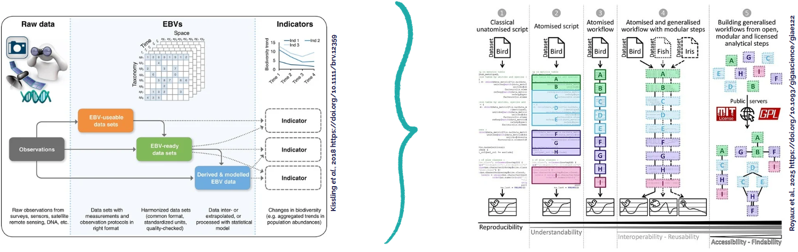

Since 2018, French museum of natural history (through the Biodiversity Data Hub - PNDB - of the Data Terra research Infrastructure and as a co-leader of the French BON) is leading the "Galaxy for Ecology" initiative, to coordinate contributions of source codes, computational workflows and related tutorials linked to Biodiversity data management and treatments. Using the Galaxy platform, we are focusing on one of the biggest open source ecosystem for science worldwide.

We also take advantage of a high level of FAIRness regarding Galaxy services with transparency, traceability and reproducibility of processes. We propose here to showcase the use of Galaxy and related platforms already deployed at national, regional and international levels to build, test and improve computational workflows dedicated to Biodiversity metrics and indicators production and then facilitate biodiversity monitoring and conservation.

# Context and issue

Data integration in biodiversity science is complex, essentially because the framework harmonizing data and methods is lacking. Getting interoperable data from raw, heterogeneous and scattered datasets to measure and understand the spatio-temporal dynamics of biodiversity from local to global scales is both necessary and challenging.

Essential Biodiversity Variables (EBVs) represent a relevant framework for identifying appropriate data to be collated and for creating and implementing analytical workflows, from raw data to EBV data products.

# EBV

EBVs have been settled by experts from the GEO BON in the purpose of defining a conceptual frame globally shared to assess the state of biodiversity, reflect in an integrative way the different facets of biodiversity and enhance its management. EBVs are divided in classes, each one representing one organization level of biodiversity and containing several EBV types standing for the different facets of the class.

> EBV classes defined by GEO BON (https://geobon.org/ebvs/what-are-ebvs/) ![EBV classes defined by GEO BON]

EBVs are biological state variables aiming to measure changes and trends in biodiversity in a comparable way from local to global scale. The operationalization of such variables will allow the improvement of spatial, temporal and taxonomic consistency of biodiversity assessment, hence its conservative management.

They must have three main characteristics : 
- **Relevance**, through the ability to reflect the state and/or dynamic of the studied system ;
- **Feasibility**, through time-tested and globally actionable methods ;
- and **Practicality**, through gathering, storage and analysis realistic with limited resources.

# Use Galaxy for operationalizing EBV workflows

From Kissling *et al.* 2018 (https://doi.org/10.1111/brv.12359) to Royaux *et. al* 2025 (https://doi.org/10.1093/gigascience/giae122) or how to go from EBV operationalization concept to a concrete way to operationalize it through Galaxy Ecology:

“Galaxy-Ecology allows us to demonstrate a way to reach higher levels of reproducibility in ecological sciences by increasing the accessibility and reusability of analytical workflows once atomized and generalized” (Royaux *et al.*, 2025 https://doi.org/10.1093/gigascience/giae122). Based on this first FAIR platform layer, creating EBV computational workflows allowing the production of "EBV data products", and thus biodiversity indicators, from raw biodiversity datasets, rely "just" on adressing use cases, EBV class by EBV class.

# FAIR and reproducible EBV computational workflows

## Genetic composition
According to GEO BON, this EBV class represents spatio-temporal variability in the genetic composition within one species.
Composed of the following EBV types : 
- Intraspecific genetic diversity : [Galaxy Workflow](https://ecology.usegalaxy.eu/u/coline_royaux/w/workflow-constructed-from-history-imported-ebv-genetic-differentiation-through-population-study)
- Genetic differentiation : [Galaxy Workflow](httpsg://ecology.usegalaxy.eu/u/coline_royaux/w/workflow-constructed-from-history-imported-ebv-genetic-differentiation-through-population-study)
- Effective population size
- Inbreeding : [Galaxy Workflow](https://ecology.usegalaxy.eu/u/coline_royaux/w/workflow-constructed-from-history-imported-ebv-intraspecific-genetic-diversity-through-genetics-maps)
 
### RAD-seq workflow
This workflow permits, from data of RED-seq 'single-end' sequencing, a barcode file and a population map, to compute metrics of EBV types 'Intraspecific genetic diversity', 'Genetic differentiation' and 'Inbreeding' :
- Nucleotidic diversity (pi)
- Frequence of the prevalent allele in the population \(P\)
- Polymorphic sites, variant sites and polymorphic loci percentage
- Haplotypic diversity (H)
- Gene diversity
- Haplotype count
- Genotype count
- Maximum percentage of the most frequent genotype
- Genotype frequence
- Inbreeding coefficient for each loci (F)
- Between-individuals differentiation coefficient
- Genetic differentiation between sub-populations (F_st)
- Orthogonal measure of locus differentiation (D_est)
- Absolute measure of locus differentiation (D_xy)

Then, it permits the production of a genetic map and an analysis of genetic diversity within the population. 

> Global vision of the RAD-seq workflow
> Need more elements

### Other tool list
* [Amova](https://ecology.usegalaxy.eu/root?tool_id=toolshed.g2.bx.psu.edu/repos/iuc/mothur_amova/mothur_amova/1.39.5.0)
* [Homova](https://ecology.usegalaxy.eu/root?tool_id=toolshed.g2.bx.psu.edu/repos/iuc/mothur_homova/mothur_homova/1.39.5.0)
* [Mantel](https://ecology.usegalaxy.eu/root?tool_id=toolshed.g2.bx.psu.edu/repos/iuc/mothur_mantel/mothur_mantel/1.39.5.0)

## Species populations
According to GEO BON, this EBV class represents spatio-temporal variability in the distribution and abundance of populations.
Composed of the following EBV types : 
- Species distribution : [Galaxy Workflow](https://ecology.usegalaxy.eu/u/coline_royaux/w/species-distribution-ebv-workflow)
- Species abundances : [Galaxy Workflow](https://ecology.usegalaxy.eu/u/coline_royaux/w/species-abundances-ebv-workflow)

### PAMPA workflow | [Tutorial](https://training.galaxyproject.org/training-material/topics/ecology/tutorials/PAMPA-toolsuite-tutorial/tutorial.html)
This workflow permits, from occurrence data of one or several species population(s), to compute metrics of EBV types 'Species distribution' and 'Species abundance' :
- Presence-absence
- Abundance 

Then, with optional data on sites, it permits to compute a Generalized Linear (Mixed) Model (GLM or GLMMTMB) estimating the effects of year, site and/or habitat on a chosen metric. It is also possible to represent graphically the temporal variation of this metric (raw and estimated by the model) for each species individually.

> Global vision of the PAMPA workflow
> 

#### Use-cases of the workflow on several data types
- Catch Per Unit of Effort data [DATRAS](https://datras.ices.dk/Data_products/Download/Download_Data_public.aspx) : Galaxy history [link](https://ecology.usegalaxy.eu/u/coline_royaux/h/datras-full---pampa-workflow)
- [Reef Life Survey data](https://reeflifesurvey.imas.utas.edu.au/static/landing.html) : Galaxy history [link](https://ecology.usegalaxy.eu/u/coline_royaux/h/reeflifesurvey-data-on-pampa)
- Marine Protected Area data from rotative cameras : Galaxy history [link](https://ecology.usegalaxy.eu/u/coline_royaux/h/donnes-staviro-amp-nouma---pampa-workflow)
- Anonymized data from the french common bird survey scheme ([STOC](http://www.vigienature.fr/fr/suivi-temporel-des-oiseaux-communs-stoc)) : Galaxy history [link](https://ecology.usegalaxy.eu/u/coline_royaux/h/stoc-data-on-pampa-workflow)
- [Vigie-Chiro data](http://www.vigienature.fr/fr/chauves-souris) : Galaxy history [link](https://ecology.usegalaxy.eu/u/coline_royaux/h/donnes-vigie-chiro)

### STOC workflow
This workflow permits, from occurrence data of one or several species population(s) and diverse informations on species, to compute a Generalized Linear Model (GLM) estimating the effects of year and site on the abundance of each species and for each specialization group (generalist, forestry, ...). It also permits to get a plot of the temporal variation of the number of sites where the species has been observed and of the abundance of the species (raw and estimated by the model for each species and specilization group).

> Global vision of the STOC workflow
> 

### Regional GAM workflow | [Tutorial](https://training.galaxyproject.org/training-material/topics/ecology/tutorials/regionalGAM/tutorial.html)
This workflow permits, from occurrence data of a single species population, to compute a flight curve, an abundance index along with an expected and modelized (linear model) temporal trend of this index. It is also possible to take auto-correlation into consideration in the model.

> Global vision of the Regional GAM workflow
> 

### Vigie-Chiro workflow
This workflow permits, from a participation file created by the Tadarida software (Chiroptera identification), to generate a restitution of the data through tables and HTML representatins for participants to Vigie-Nature participative science protocols.

> Global vision of the Vigie-Chiro workflow
> 

**Tools in section "Animal Detection on Acoustic Recordings"**
 
## Species traits
According to GEO BON, this EBV class represents the variation of traits measures within a species according to the taxonomic diversity axis.
Composed of the following EBV types : 
- Morphology
- Physiology
- Phenology : [Galaxy Workflow](https://ecology.usegalaxy.eu/u/coline_royaux/w/workflow-constructed-from-history-tuto-regional-gam)
- Mobility
### Regional GAM workflow | [Tutorial](https://training.galaxyproject.org/training-material/topics/ecology/tutorials/regionalGAM/tutorial.html)
This workflow permits, from occurrence data of a single species population, to compute an abundance index that will be used to modelize and represent in a plot the flight phenology of a butterfly species through time.

> Global vision of the Regional GAM workflow
> 

## Community composition
According to GEO BON, this EBV class represents the abundance and diversity of organisms in ecological assemblages.
Composed of the following EBV types : 
- Community abundance : [Galaxy Workflow](https://ecology.usegalaxy.eu/u/coline_royaux/w/community-abundance-and-taxonomicphylogenetic-diversity-ebv-workflow)
- Taxonomic / phylogenetic diversity : [Galaxy Workflow](https://ecology.usegalaxy.eu/u/coline_royaux/w/community-abundance-and-taxonomicphylogenetic-diversity-ebv-workflow)
- Traits diversity : [Galaxy Workflow](https://ecology.usegalaxy.eu/u/coline_royaux/w/trait-and-interaction-diversity-ebv-workflow)
- Interactions diversity : [Galaxy Workflow](https://ecology.usegalaxy.eu/u/coline_royaux/w/trait-and-interaction-diversity-ebv-workflow)

### PAMPA workflow | [Tutorial](https://training.galaxyproject.org/training-material/topics/ecology/tutorials/PAMPA-toolsuite-tutorial/tutorial.html)
This workflow permits, from occurrence data of several species populations, to compute metrics of EBV types 'Community abundance' and 'Taxonomic / phylogenetic diversity' : 
- alpha and gamma diversity
    - Species richness
    - Shannon index
    - Simpson index
    - Hill index
- Pielou index

Then, with optional data on sites, it permits to compute a Generalized Linear (Mixed) Model (GLM or GLMMTMB) estimating the effects of year, site and/or habitat on a chosen metric. It is also possible to represent in a plot the temporal variation of this metric (raw and estimated by the model) for the whole community described in the data. The user can also ask to cut the analysis according to a factor given in the data on sites (per geographical area, protected area type, ...).

> Global vision of the PAMPA workflow
> 

#### Use-cases of the workflow on several data types
- Catch Per Unit of Effort data [DATRAS](https://datras.ices.dk/Data_products/Download/Download_Data_public.aspx) : Galaxy history [link](https://ecology.usegalaxy.eu/u/coline_royaux/h/datras-full---pampa-workflow)
- [Reef Life Survey data](https://reeflifesurvey.imas.utas.edu.au/static/landing.html) : Galaxy history [link](https://ecology.usegalaxy.eu/u/coline_royaux/h/reeflifesurvey-data-on-pampa)
- Marine Protected Area data from rotative cameras : Galaxy history [link](https://ecology.usegalaxy.eu/u/coline_royaux/h/donnes-staviro-amp-nouma---pampa-workflow)
- Anonymized data from the french common bird survey scheme ([STOC](http://www.vigienature.fr/fr/suivi-temporel-des-oiseaux-communs-stoc)) : Galaxy history [link](https://ecology.usegalaxy.eu/u/coline_royaux/h/stoc-data-on-pampa-workflow)
- [Vigie-Chiro data](http://www.vigienature.fr/fr/chauves-souris) : Galaxy history [link](https://ecology.usegalaxy.eu/u/coline_royaux/h/donnes-vigie-chiro)

### STOC workflow
This workflow permits, from occurrence data of several species populations, diverse informations on species (including specialization, temperature and/or trophic indexes) and coordinates of sites, to compute metrics of EBV types 'Traits diversity' and 'Interactions diversity' :
- Community Specialization Index (CSI)
- Community Temperature Index (CTI)
- Community Trophic Index (CTrI)

a Generalized Linear Model (GLM) estimating the effects of year and site on 

From one of these indexes, a Generalized Linear Mixed Model (GLMMTMB or GAM) is computed to test the fixed effect of year and random effect of site on the chosen index. The temporal trend of this index estimated by the model is then represented in a plot for the whole community described in the data.

> Global vision of the STOC workflow
> 

### OTU workflow
This workflow permits, from diverse Operational Taxonomic Units (OTU) data files (phylogenetic tree, sequence count, taxonomic map, ...), to compute metrics of the EBV type 'Taxonomic / phylogenetic diversity' :
- alpha and gamma diversity
    - Species richness
    - Shannon index
    - Simpson index
    - Fisher index
    - Unique branch length
- beta diversity
    - alpha/gamma matrix
    - Pearson index
    - Spearman index

Moreover, it permits to plot a rarefaction curve of alpha diversity and OTUs.

Tool list (non-exhaustive) : 
* [Phylo.diversity](https://ecology.usegalaxy.eu/root?tool_id=toolshed.g2.bx.psu.edu/repos/iuc/mothur_phylo_diversity/mothur_phylo_diversity/1.39.5.0)
* [Collect.single](https://ecology.usegalaxy.eu/root?tool_id=toolshed.g2.bx.psu.edu/repos/iuc/mothur_collect_single/mothur_collect_single/1.39.5.0)
* [Collect.shared](https://ecology.usegalaxy.eu/root?tool_id=toolshed.g2.bx.psu.edu/repos/iuc/mothur_collect_shared/mothur_collect_shared/1.39.5.0)
* [Rarefaction.single](https://ecology.usegalaxy.eu/root?tool_id=toolshed.g2.bx.psu.edu/repos/iuc/mothur_rarefaction_single/mothur_rarefaction_single/1.39.5.0)
* [Rarefaction.shared](https://ecology.usegalaxy.eu/root?tool_id=toolshed.g2.bx.psu.edu/repos/iuc/mothur_rarefaction_shared/mothur_rarefaction_shared/1.39.5.0)
* [Run QIIME diversity analyses](https://ecology.usegalaxy.eu/root?tool_id=toolshed.g2.bx.psu.edu/repos/iuc/qiime_core_diversity/qiime_core_diversity/1.9.1.0)
* [beta_diversity_through_plots](https://ecology.usegalaxy.eu/root?tool_id=toolshed.g2.bx.psu.edu/repos/iuc/qiime_beta_diversity_through_plots/qiime_beta_diversity_through_plots/1.9.1.0)
* [OTU alpha diversity](https://ecology.usegalaxy.eu/root?tool_id=toolshed.g2.bx.psu.edu/repos/iuc/qiime_alpha_diversity/qiime_alpha_diversity/1.9.1.0)
* [OTU alpha rarefaction](https://ecology.usegalaxy.eu/root?tool_id=toolshed.g2.bx.psu.edu/repos/iuc/qiime_alpha_rarefaction/qiime_alpha_rarefaction/1.9.1.0)
* Vegan [diversity](https://ecology.usegalaxy.eu/root?tool_id=toolshed.g2.bx.psu.edu/repos/iuc/vegan_diversity/vegan_diversity/2.4-3), [fisher](https://ecology.usegalaxy.eu/root?tool_id=toolshed.g2.bx.psu.edu/repos/iuc/qiime_alpha_rarefaction/qiime_alpha_rarefaction/1.9.1.0), [rarefaction](https://ecology.usegalaxy.eu/root?tool_id=toolshed.g2.bx.psu.edu/repos/iuc/vegan_rarefaction/vegan_rarefaction/2.4-3)

## Ecosystem functioning
According to GEO BON, this EBV class represents attributes related to performance of ecosystems as a result of collective activities of the organisms.
Composed of the following EBV types : 
- Primary production
- Ecosystem phenology
- Ecosystem disturbances 

### Dead wood ONB French indicator workflow

Direct link to the workflow on European Galaxy Ecology instance: https://ecology.usegalaxy.eu/u/ylebras/w/workflow-constructed-from-history-onb-cration-de-linicateur-bois-mort

<iframe title="Galaxy Workflow Dead wood ONB French indicator" style="width: 100%; height: 700px; border: none;" src="https://ecology.usegalaxy.eu/published/workflow?id=b5f8fa88823d5a16&embed=true&buttons=true&about=true&heading=true&minimap=true&zoom_controls=true&initialX=-20&initialY=-20&zoom=1"></iframe>

## Ecosystem structure
According to GEO BON, this EBV class represents the spatial arrangment of spatial units of the ecosystem, defined collectively by the organisms composing these units.
Composed of the following EBV types : 
- Live cover fraction
- Ecosystem distribution
- Ecosystem Vertical Profile

### Ecoregionalization workflow

Here a workflow who can be used on GBIF occurences, including GBIF data pre-treatment / handling. A description of the workflow and input data and parameters as outputs is illustrated in this [tutorial](https://training.galaxyproject.org/training-material/topics/ecology/tutorials/Ecoregionalization_tutorial/tutorial.html).

Direct links to the workflows on European Galaxy Ecology instance: 
- A 2024 version is existing, with two parts, allowing the user to look at clusters number proposal from first part and to decide the value to choose to execute the second part.
    - Part 1: https://ecology.usegalaxy.eu/published/workflow?id=c5de0b794849e1b1
    - Part 2: https://ecology.usegalaxy.eu/published/workflow?id=b727b64f37238fff
- A 2025 version is coming, with an automatic choice of the number of cluster included so a unique workflow can be used.

<iframe title="Galaxy Workflow Ecoregionalization part 1" style="width: 100%; height: 700px; border: none;" src="https://ecology.usegalaxy.eu/published/workflow?id=c5de0b794849e1b1&embed=true&buttons=true&about=true&heading=true&minimap=true&zoom_controls=true&initialX=-20&initialY=-20&zoom=1"></iframe>

<iframe title="Galaxy Workflow Ecoregionalization part 2" style="width: 100%; height: 700px; border: none;" src="https://ecology.usegalaxy.eu/published/workflow?id=b727b64f37238fff&embed=true&buttons=true&about=true&heading=true&minimap=true&zoom_controls=true&initialX=-20&initialY=-20&zoom=1"></iframe>

### Red List Ecosystem Index

Direct link to the workflow on European Galaxy Ecology instance: https://ecology.usegalaxy.eu/u/ylebras/w/geo-bon-headline-indicator-km-gbf-a-1-red-list-ecosystem

<iframe title="Galaxy Workflow Red List Ecosystem Index" style="width: 100%; height: 700px; border: none;" src="https://ecology.usegalaxy.eu/published/workflow?id=5f7a767d96844c24&embed=true&buttons=true&about=true&heading=true&minimap=true&zoom_controls=true&initialX=-20&initialY=-20&zoom=1"></iframe>

# Contact and information

Royaux C., Seguineau P., Bénateau S., Yguel B., Payet K., Martinez-Anton L., Barreau A., Norvez O., Delavaud A., Julliard R., Vigne J.-D., Clément F., Buisine N., Sun J.-S., Jossé M., Mahé M., Mayi E., Bissery C., Lorrilliere R., Bas Y., Martin A., Eon L., Le Bris N., Eléaume M., Pelletier D., Grüning B., Mihoub J.-B., & Le Bras Y. 2026. Using Galaxy platform to operationalize EBV computational workflows.  CC-BY 4.0 
