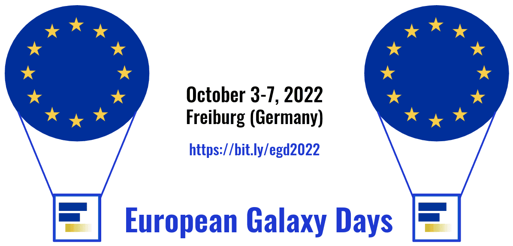

It's time again to gather together, discuss recent and future Galaxy developments in Freiburg at the **European Galaxy Days 2022**!

To minimize travelling (and yes, we recommend taking a train :-) ), we are co-locating 3 events on the same week:

 

- **ELIXIR Galaxy Implementation Study (IS2021)** meeting,
- **European Galaxy Days (EGD)**, talks, discussions and updates, including ELIXIR-Galaxy community meeting, and CoFest,
- **EuroScienceGateway (ESG)** kick-off, an EU-funded project to build a mature network of national Galaxy servers and Pulsar endpoints in European clouds and HPC centers.

  

# Registration

Registration is free, but the space is limited, so we recommend to you register soon to secure your spot for the different events. 

> If you want to give a talk (10-20') or have a demo, please register by **September 16**.

> The registration for attendance will close on **September 23**.

  <a class="btn w-25 btn-dark" href="https://bit.ly/egd2022-registration" role="button">Register now</a>

  

# Schedule

<table>
  <tbody>
    <tr class="lead text-center" style="background-color: lightgray;">
      <th style="border: 3px solid white;">October 3</th>
      <th style="border: 3px solid white;">October 4</th>
      <th style="border: 3px solid white;">October 5</th>
      <th colspan=2 style="border: 3px solid white;">October 6</th>
      <th colspan=2 style="border: 3px solid white;">October 7</th>
    </tr>
    <tr class="text-center" style="background-color: #EEEEEE; border: 5px solid white">
      <th style="min-width: 18%; border: 3px solid white;">Mon</th>
      <th style="max-width: 18%; border: 3px solid white;">Tue</th>
      <th style="max-width: 18%; border: 3px solid white;">Wed</th>
      <th colspan=2 style="max-width: 18%; border: 3px solid white;">Thu</th>
      <th colspan=2 style="max-width: 18%; border: 3px solid white;">Fri</th>
    </tr>
    <tr class="text-center">
      <td style="border: 3px solid white; background-color: lightgray;">Arrival & Get together in Freiburg
         <small>(German Holiday)</small>
      </td>
      <td style="background-color: Navy; color: white; border: 3px solid white;"><strong>European Galaxy Days</strong>
          <small>Community updates</small>
      </td>
      <td style="background-color: Navy; color: white; border: 3px solid white;"><strong>European Galaxy Days</strong>
          <small>Community updates</small>
      </td>
      <td style="background-color: DarkKhaki; border: 3px solid white;"><strong>EGD   CoFest </strong>
          <small>Community hacking!</small>
      </td>
      <td style="background-color: SeaGreen; border: 3px solid white;"><strong>ESG kick-off</strong>
          <small>Planning sessions</small>
      </td>
      <td style="background-color: DarkKhaki; border: 3px solid white;"><strong>EGD   CoFest </strong>
          <small>Community hacking!</small>
      </td>
      <td style="background-color: SeaGreen; border: 3px solid white;"><strong>ESG kick-off</strong>
          <small>Discussions</small>
      </td>
    </tr>
    <tr class="text-center">
      <td colspan="7" style="background-color: #EEEEEE">
        <strong>Lunch Break</strong>
      </td>
    </tr>
    <tr class="text-center">
      <td style="background-color: DarkOrange; border: 3px solid white;">
        <strong>ELIXIR IS2021 meeting</strong>
          <small>Strengthen Data Management in Galaxy</small>
      </td>
      <td style="background-color: Navy; color: white; border: 3px solid white;"><strong>European Galaxy Days</strong>
          <small>ELIXIR-Galaxy Community meeting</small>
      </td>
      <td style="background-color: Navy; color: white; border: 3px solid white;"><strong>European Galaxy Days</strong>
          <small>Birds of a Feather</small>
      </td>
      <td style="background-color: DarkKhaki; border: 3px solid white;"><strong>EGD   CoFest </strong>
          <small>Community hacking!</small>
      </td>
      <td style="background-color: SeaGreen; border: 3px solid white;"><strong>ESG kick-off</strong>
          <small>Planning sessions</small>
      </td>
      <td style="background-color: DarkKhaki; border: 3px solid white;"><strong>EGD   CoFest </strong>
          <small>Community hacking!</small>
      </td>
      <td style="background-color: SeaGreen; border: 3px solid white;"><strong>ESG kick-off</strong>
          <small>Discussions</small>
      </td>
    </tr>
  </tbody>
</table>

# Venue

  
Albert-Ludwigs-University Freiburg 
Institute for Informatics 
Georges-Köhler-Allee, 101 
79110 Freiburg 
Germany

  

# Logistics
### Getting to Freiburg

Freiburg can be easily reached by train with the ICE from the North (via Frankfurt and Karlsruhe) and the South (via Basel) [Deutsche Bahn](https://www.bahn.com/en).

#### How to reach Freiburg from Basel/Mulhouse/Freiburg airport (EuroAirport)

- Option 1: Use the French/German exit and take the [airport shuttle bus](http://www.freiburger-reisedienst.de/en/airportbus/timetable.php) to Freiburg main station (Hauptbahnhof).
- Option 2: Use the Swiss exit and take the local bus (#50) to the train station in Basel, and from there take a train to Freiburg.

#### How to reach the venue from Freiburg Hauptbahnhof

- Option 1: Local train, take the Breisgau S-Bahn from Hauptbahnhof Freiburg to Gottenheim/Breisach to Neue Messe/Universität.
- Option 2: Tram 4 direction Messe, stop “Technische Fakultät/Messe” (see [tram plan](http://www.vag-freiburg.de/fahrplan-linien/netzplaene/liniennetzplan.html)).

### Lodging

#### City Center
- [Stadthotel Freiburg](https://www.hotel-freiburg.de/de)
- [Motel One](https://www.motel-one.com/en/hotels/freiburg/hotel-freiburg)
- [Black Forest Hostel](https://www.blackforest-hostel.de)
- [Hotel am Rathaus](http://www.am-rathaus.de)
- [Hotel Barbara](http://www.hotel-barbara.de)
- [Hotel Bären](https://www.hotel-freiburg-baeren.de/)

#### Main station
- [Central](https://www.central-freiburg.de)
- [Park Hotel Post](https://www.park-hotel-post.de/de)
- [Intercity Hotel](https://hrewards.com/de/intercityhotel-freiburg)

#### Faculty of engineering
- [Hotel Stadt Freiburg](https://www.hotel-stadt-freiburg.de)

# Questions?

If you want to present, help, have suggestions or questions, please get in touch with us.

# Supporters

This event is generously supported by [ELIXIR](https://elixir-europe.org/) and funded by the European Union’s HORIZON-INFRA-2021-EOSC-01 under Grant Agreement no. 101057388.

 

