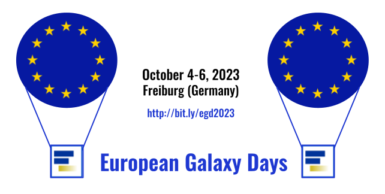

It's time again to gather together, discuss recent and future Galaxy developments in Freiburg at the **European Galaxy Days 2023**!

To minimize travelling (and yes, we recommend taking a train :-) ), we are **co-locating 3 events** on the same week, bringing together major party of the European Galaxy community:

 

[//]: # "- [**EuroScienceGateway General Assembly (ESG GA)**](/events/2023-10-egd/esg/)"

[//]: # "- [**ELIXIR Galaxy Community Meeting**](/events/2023-10-egd/gcm/)"

- The [**ELIXIR Galaxy Community Face-to-face (F2F)** meeting](https://elixir-europe.org/events/elixir-galaxy-community-meeting-0),
- The **[EuroScienceGateway](/projects/esg/) [General Assembly (ESG GA)](/events/2023-10-egd/esg/)**,
- The **[European Galaxy Days (EGD)](/events/2023-10-egd/egd/)** themselves.

  

# Contributing

No matter of which particular community, Galaxy is driven by the people who use, develop and administrate it. Accordingly, we are looking forward to a motley gathering and *your* contributions, say: talks, demos, posters and Birds-of-a-feather meetings (BoFs). You have done something you want to present or discuss, we provide the stage.

Our detailed planning depends to a certain extent on the content you want to share, so please consider registering at the last minute.

# Registration

Registration is free, but the space is limited, so we recommend to you register soon to secure your spot for the different events. 
The traveling, accommodation and subsistence expenses will be partially covered by the organizers for a limited number of ELIXIR participants. 
The organizers will contact you for further clarification. 

[//]: # "> If you want to give a talk or have a demo, please register by **September 8th**."

[//]: # "> The registration for attendance closes on **September 18th**."

  <a class="btn w-25 btn-dark" href="https://docs.google.com/forms/d/1Lgwe6Hy-GgcpVUYi7u6uvyGJuZlueXYpWiK0RwgTGec" role="button" target="_blank">Register now</a>

  

# Schedule
Updates as of September 29th - for a more detailed schedule now check out the [EGD subpage](/events/2023-10-egd/egd/).
<table>
  <tbody>
    <tr class="lead text-center" style="background-color: lightgray;">
      <th style="border: 3px solid white;"></th>
      <th colspan=2 style="border: 3px solid white;">October 4</th>
      <th colspan=2 style="border: 3px solid white;">October 5</th>
      <th colspan=2 style="border: 3px solid white;">October 6</th>
    </tr>
    <tr class="text-center" style="background-color: #EEEEEE; border: 3px solid white">
      <th style="border: 3px solid white;">Time</th>
      <th colspan=2 style="max-width: 18%; border: 3px solid white;">Wed</th>
      <th colspan=2 style="max-width: 18%; border: 3px solid white;">Thu</th>
      <th colspan=2 style="max-width: 18%; border: 3px solid white;">Fri</th>
    </tr>
    <tr class="text-center">
      <th style="border: 3px solid white; vertical-align: middle;">9:00  -  13:00</th>
      <td colspan="2" style="background-color: #78C7C7; border: 3px solid white;"><strong><a href="/events/2023-10-egd/egd/">European Galaxy Days</a></strong>
         <small>Arrival and Welcome Community update talks</small>
      </td>
      <td colspan="2" style="background-color: #78C7C7; border: 3px solid white;"><strong><a href="/events/2023-10-egd/egd/">European Galaxy Days</a></strong>
          <small>New developments talks</small>
      </td>
      <td style="background-color: #87CEFA; border: 3px solid white;"><strong>EGD Co-Fest</strong>
      </td>
      <td style="background-color: #89C35C; border: 3px solid white;"><strong><a href="/events/2023-10-egd/esg/">ESG Annual Meeting</a></strong>
      </td>
    </tr>
    <tr class="text-center">
      <th style="border: 3px solid white; vertical-align: middle;">13:00  -  14:30</th>
      <td colspan="6" style="background-color: #EEEEEE;">
        <strong>Lunch Break</strong>
      </td>
    </tr>
    <tr class="text-center">
      <th style="border: 3px solid white; vertical-align: middle;">14:30  -  16:00</th>
      <td colspan="2" style="background-color: #FBB117; border: 3px solid white;">
        <strong><a href="/events/2023-10-egd/egd/#wednesday-october-4">ELIXIR Galaxy Community</a></strong>
          <small>One talk describing the ELIXIR Galaxy Community and additional talks highlighting interactions with other ELIXIR communities/platforms/focus groups</small>
      </td>
      <td colspan="2" style="background-color: #78C7C7; border: 3px solid white;"><strong><a href="/events/2023-10-egd/egd/">EGD meets ESG</a></strong>
          <small>Several talks to get to know each other</small>
      </td>
      <td style="background-color: #87CEFA; border: 3px solid white;"><strong>EGD Co-Fest</strong>
      </td>
      <td style="background-color: #89C35C; border: 3px solid white;"><strong><a href="/events/2023-10-egd/esg/">ESG Annual Meeting</a></strong>
      </td>
    </tr>
    <tr class="text-center">
      <th style="border: 3px solid white; vertical-align: middle;">16:30  -  17:30</th>
      <td colspan="2" style="background-color: #78C7C7; border: 3px solid white;">
        <strong>Birds of a Feather meetings (BoFs)  <small>Session 1</small></strong>
      </td>
      <td colspan="2" style="background-color: #78C7C7; border: 3px solid white;">
        <strong>Birds of a Feather meetings (BoFs)  <small>Session 2</small></strong>
      </td>
      <td style="background-color: #87CEFA; border: 3px solid white;"><strong>EGD Co-Fest</strong>
      </td>
      <td style="background-color: #89C35C; border: 3px solid white;"><strong><a href="/events/2023-10-egd/esg/">ESG Annual Meeting</a></strong>
      </td>
    </tr>
  </tbody>
</table>

(Coffee breaks included, for sure.)

  

# Venue

  
Albert-Ludwigs-University Freiburg 
Institute for Informatics 
Georges-Köhler-Allee, 101 
79110 Freiburg 
Germany

  

# Logistics

### Getting to Freiburg

Freiburg can be easily reached by train with the ICE from the North (via Frankfurt and Karlsruhe) and the South (via
Basel) [Deutsche Bahn](https://www.bahn.com/en).

#### How to reach Freiburg from Basel/Mulhouse/Freiburg airport (EuroAirport)

- Option 1: Use the French/German exit and take
  the [airport shuttle bus](http://www.freiburger-reisedienst.de/en/airportbus/timetable.php) to Freiburg main station (
  Hauptbahnhof).
- Option 2: Use the Swiss exit and take the local bus (#50) to the train station in Basel, and from there take a train
  to Freiburg.

#### How to reach the venue from Freiburg Hauptbahnhof

- Option 1: Local train, take the Breisgau S-Bahn from Hauptbahnhof Freiburg to Gottenheim/Breisach to “Neue
  Messe/Universität”.
- Option 2: Tram 4, direction “Mess”, exit at stop “Technische Fakultät/Messe” (see [tram plan](http://www.vag-freiburg.de/fahrplan-linien/netzplaene/liniennetzplan.html)).

### Tram tickets for local transport

[Here](https://www.vag-freiburg.de/tickets) you can find the types of tram tickets that VAG offers.
The [2x4 rides ticket](https://www.vag-freiburg.de/tickets/einzel-und-tageskarten/2x4-fahrtenkarte) and the [day pass](https://www.vag-freiburg.de/tickets/einzel-und-tageskarten/tageskarte) are convenient options for several days and/or passengers.

### Lodging

If you book before September 21st 2023, we can offer you a special rate for two hotels in Freiburg. Afterwards, please use the usual portals such as booking.com etc.

  <a class="btn w-25 btn-dark" href="https://tportal.toubiz.de/freiburgKongresse/ukv/?doSearch=1&ukv_result_order=1&number_adult=1&rate=FIT00020071573930301&date_from=03.10.2023&date_to=06.10.2023&reset=1&globalReset=1&lang=en" role="button" target="_blank">Special rate hotel booking</a>

 

Apart from simply using any hotel booking portal of your choice, we can recommend the following accommodations, grouped by city area.

#### City Center

- [Exclusive Accommodation (Secure before September 21, 2023)](https://tportal.toubiz.de/freiburgKongresse/ukv/?doSearch=1&ukv_result_order=1&number_adult=1&rate=FIT00020071573930301&date_from=03.10.2023&date_to=06.10.2023&reset=1&globalReset=1&lang=en)
- [Stadthotel Freiburg](https://www.hotel-freiburg.de/de)
- [Motel One](https://www.motel-one.com/en/hotels/freiburg/hotel-freiburg)
- [Black Forest Hostel](https://www.blackforest-hostel.de)
- [Hotel am Rathaus](http://www.am-rathaus.de)
- [Hotel Barbara](http://www.hotel-barbara.de)
- [Hotel Bären](https://www.hotel-freiburg-baeren.de/)

#### Main station

- [Central](https://www.central-freiburg.de)
- [Park Hotel Post](https://www.park-hotel-post.de/de)
- [Intercity Hotel](https://hrewards.com/de/intercityhotel-freiburg)

#### Faculty of engineering (close to the venue)

- [Hotel Stadt Freiburg](https://www.hotel-stadt-freiburg.de)

# Event rules and regulations

### CoC

The European Galaxy Days will abide the [Galaxy Project Code of Conduct](https://galaxyproject.org/community/coc/).
Please, make sure that you read it before the event.

# Questions?

If you want to present, help, have suggestions or questions, please get in touch with us.
Simply contact:

Anika Erxleben (erxleben@informatik.uni-freiburg.de) 
Sebastian Schaaf (sebastian.schaaf.galaxy@gmail.com) 
Hans-Rudolf Hotz (hrhotz@googlemail.com) 
Björn Grüning (bjoern.gruening@gmail.com) 

# Supporters

This event is generously supported by [ELIXIR](https://elixir-europe.org/) and funded by the European Union’s
HORIZON-INFRA-2021-EOSC-01 under Grant Agreement no. 101057388.

 

