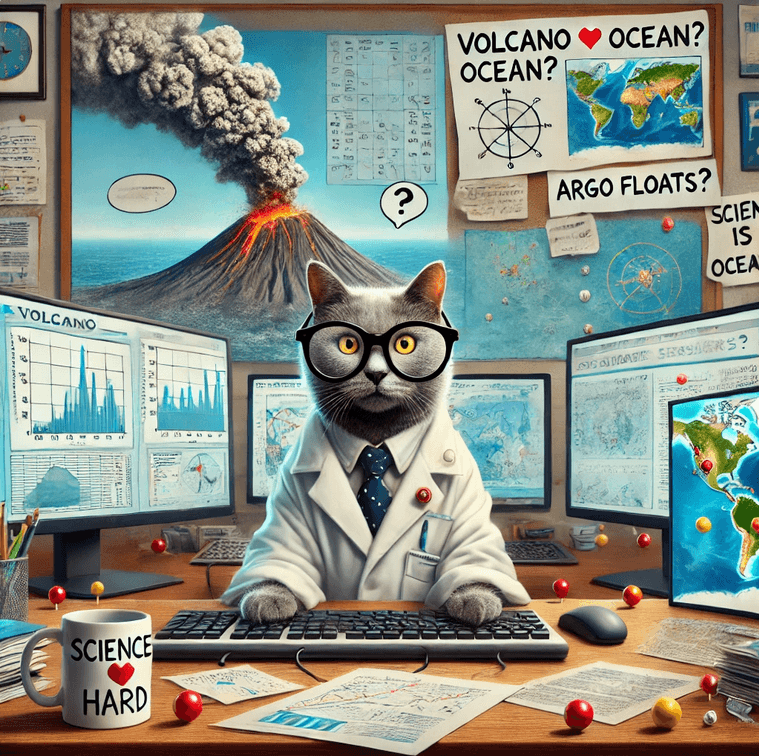

# FAIR-EASE Hackathon: Advancing Scientific & Technical Data Integration! 🚀

**🔬 What?** A 3-day scientific and technical workshop focused on analyzing the impact of the Hunga Tonga eruption by cross-referencing atmospheric and oceanic data.

**📍 Where?** IFREMER, Brest, France

**📅 When?** March 18-20, 2025

## 💡 Key Highlights:

- **Scientific** Challenge: Investigating data anomalies and improving interpretations by combining multiple datasets.
- **Technical** Challenge: Bringing all FAIR-EASE services, including Galaxy, together to build a harmonized environment for data retrieval, analysis, and visualization.
- **EuroScienceGateway** Team: Actively involved in both the scientific and technical challenges, ensuring the Hunga Tonga use case is feasible within the Galaxy framework and contributing to a unified data access and processing workflow.

**🚀 A key step toward an integrated data-driven science platform!** #FAIREASE #Hackathon #HungaTonga #Galaxy

## Next steps
Keep an 👁️ out for the outcomes of this Hackathon that will be publish afterwards. 

For any iformation contact Marie Jossé (email: marie.josse@ifremer.fr)
