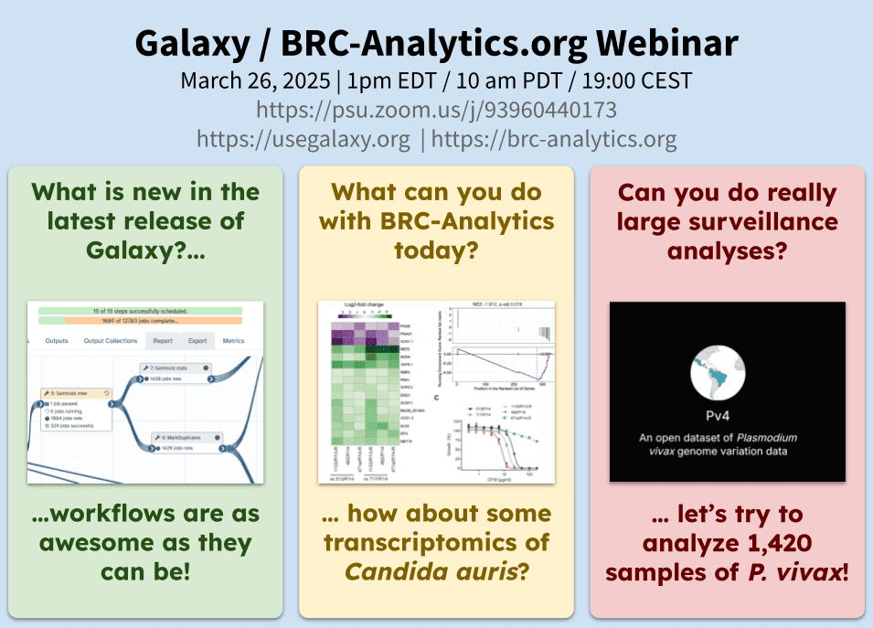

[Video now available!](https://youtu.be/lYzb0j_UtWk)

**BRC Analytics/Galaxy Webinar**

Please join Anton Nekrutenko and Scott Cain for a webinar about [BRC Analytics](https://brc-analytics.org) as well as a discussion of new features in Galaxy. This will be a Q &amp; A which we will present progress we've made in the development of BRC Analytics, as well as a wider discussion of the workflow improvements made to Galaxy as a whole, on which we are building BRC Analytics. Examples of analyzing transcriptomics and outbreak surveillance data will be presented.

- **Time:** 1 PM EDT/10 AM PDT

We will be taking questions and providing information about avenues for following up on development efforts.
