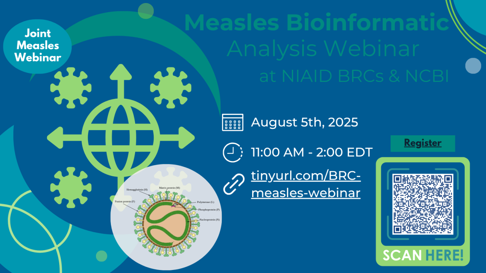

**BRC Measles Data Analysis Webinar**

Join us for an in-depth exploration of measles data analysis across the NIAID Bioinformatics Resource Centers: BV-BRC, BRC Analytics and PDN. Discover powerful use cases and step-by-step workflows, and learn how to tap into each platform for your research. We’ll also feature special guest presentations from NCBI Virus and the SRA team, sharing their latest tools and insights. A detailed agenda is coming soon—register today to secure your spot and take your measles analysis to the next level!

- **Time:** 11 AM EDT/8 AM PDT
- **Register:** [MicroSoft Teams event page](https://events.teams.microsoft.com/event/26e362e7-0d72-4c6a-9e86-0fd306368dfd@24d967f1-3ed8-4448-baa6-560ec572acb3)
