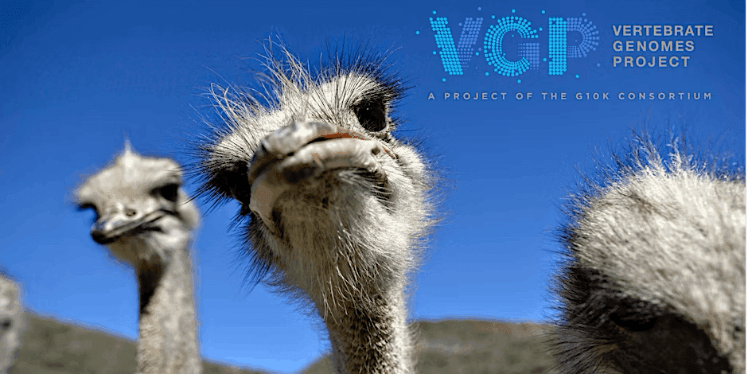

Join us at the VGP In-Person Conference 2025 happening at The Rockefeller University, in New York City! Get ready for a dive deep into the world of vertebrate genomes with top experts and researchers. This event is your chance to network, learn, and collaborate on cutting-edge genomics research. The conference will include focus on studies surrounding VGP Phase 1 species, enhancing and scaling-up genomics technology, assembly and annotation, and planning for the future. Don't miss out on this exciting opportunity to be part of the VGP community. See you there!

[Register on the EventBrite page](https://www.eventbrite.com/e/vertebrate-genomes-project-vgp-in-person-conference-2025-tickets-1478318102239?aff=oddtdtcreator).
