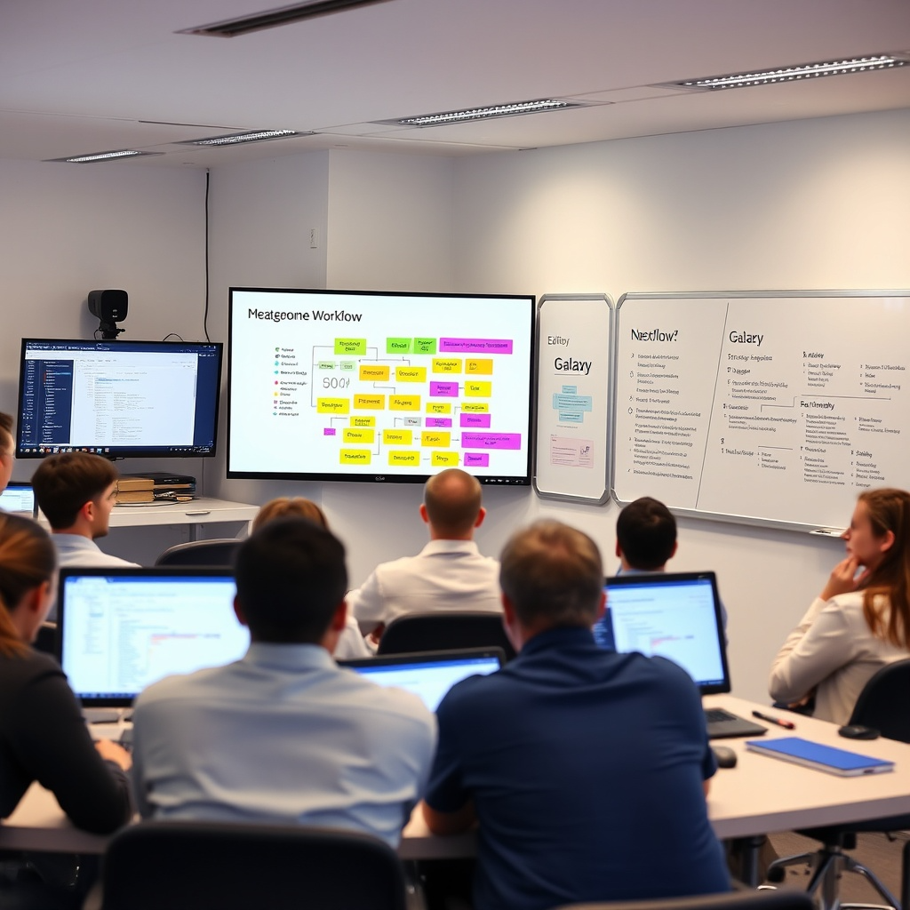

# FairyMAGs Hackathon: Optimising Metagenomics Assembled Genomes building 🚀 

MAGs workflows are both **technically and scientifically challenging**, yet they are **essential tools** for reducing microbial dark matter, as most microbes cannot be cultivated.  

As part of the [FairyMAGs project](https://artifact.galaxyproject.org/news/2025-01-09-bfsp-fairy-ma-gs/) withhin the [ELIXIR BFSP Programme](https://elixir-europe.org/internal-projects/commissioned-services/science/biodiversity-security-pathogens), we are organizing a **4-day hackathon** and warmly invite the community to join us in Freiburg. This event is an opportunity to **collaborate, discuss, and improve MAGs workflows together!**  

# 🔬 What?
## A 4-day scientific and technical hackathon focused on:

### 🚀 Enhancing FAIR MAGs Workflows
* 🧩 Optimizing assembly strategies
  * Individual assembly vs. co-assembly vs. grouped-assembly
  * Automating decision-making for assembly selection
* 🔍 Bin refinement improvements
  * Where do we go beyond MetaWrap?
  * 🏗️ Should we integrate more binning tools for better results?

### 📚 Developing user-friendly training materials
* 🛠️ What parameters should users adjust?
* 🧑‍🏫 How to make complex concepts more accessible?

### 📊 Advancing evaluation methods (using CAMI infrastructure & real data)
* 🧬 Have metagenomic WGS samples? Want to create MAGs? This is your chance!

### ⚙️ Building intelligent resource estimation tools
* 🚦 Whether you're using Nextflow, Snakemake, or Galaxy, resource allocation is key
* ❌ Over-provisioning wastes resources; under-provisioning leads to failed jobs
* 🌍 Let’s design workflow-agnostic tools that optimize resource usage, reducing computational waste and environmental impact!

# 📍 Where? 
Seminar room at Georges-Köhler-Allee 79, 79110 Freiburg
You can get there with the S1 or M4 from Freiburg Main Station or City center.

<iframe src="https://www.google.com/maps/embed?pb=!1m18!1m12!1m3!1d1334.5013784351295!2d7.831373329373388!3d48.01365661220275!2m3!1f0!2f0!3f0!3m2!1i1024!2i768!4f13.1!3m3!1m2!1s0x47911b00372b1dc5%3A0x1328d244d8da765d!2sFreiburg%20Galaxy%20Project!5e0!3m2!1sen!2sde!4v1741177093724!5m2!1sen!2sde" width="600" height="450" style="border:0;" allowfullscreen="" loading="lazy" referrerpolicy="no-referrer-when-downgrade"></iframe>

# 📅 When?
October 06-09, 2025

This event is right after the [European Galaxy Days (EGD)](https://galaxyproject.org/events/2025-10-01-egd2025/), so you have the chance to 
make it a longer trip to Freiburg and profit from both events. 

# Registration

  

Registration is free, but the space is limited to 15 attendees, so we recommend to register soon. Please wait for our confirmation before booking your trip. As this is a hybrid event, remote attendance is also possible (details in the registration).

  <a class="btn btn-dark px-5 py-4 fs-1" href="https://forms.gle/A2VBPtFwVJjpB4tc7" role="button" target="_blank">Register now</a>

# Remote attendance

Hacking is not restricted to onsite, we appreciate your participation from anywhere else, too. We provide a Zoom connection and involve a Meeting Owl to include you as close as possible.

# Schedule

Times to start for each day and the particular schedules are listed down below. All days do not have a fixed end time (onsite decision with the participants).

**Monday, October 6th**

| Time | Topic |
|---|---|
| 10:00 | Welcome & Logistics |
| 10:10 | Presentation of personal goals and plans for the week |
| 11:00 | Presentation of the FairyMAGs project |
| 11:30 | Focus Groups selection |
| 12:00 | Lunch |
| 13:00 | Hacking |

**Tuesday, October 7th**

| Time | Topic |
|---|---|
| 9:30 | Hacking days - Stand-up meeting |
| 12:00 | Lunch |

**Wednesday, October 8th**

| Time | Topic |
|---|---|
| 9:30 | Hacking days - Stand-up meeting |
| 12:00 | Lunch |

**Thursday, October 9th**

| Time | Topic |
|---|---|
| 9:30 | Hacking |
| 12:00 | Lunch |
| 12:30 | Presentations of Hackathon outcomes |

**Friday, October 10th**

Social event optional. Sight seeing in Freiburg or visit to [Mundenhof Tier Park](https://www.mundenhof.de/).

# Event rules and regulations

## Code of Conduct

The Hackathon will abide the [Galaxy Project CoC](https://galaxyproject.org/community/coc/).
Please, make sure that you read it before the event.

## Data protection policy

This event follows the data protection policy established by the University of Freiburg as the host of the event. For details please refer to https://uni-freiburg.de/en/data-protection-applications/

## Next steps
Keep an 👁️ out for the outcomes of this Hackathon that will be publish afterwards. 

For any iformation contact Paul Zierep (email: zierep@informatik.uni-freiburg.de) or Bérénice Batut (email: berenicebatut@gmail.com)
