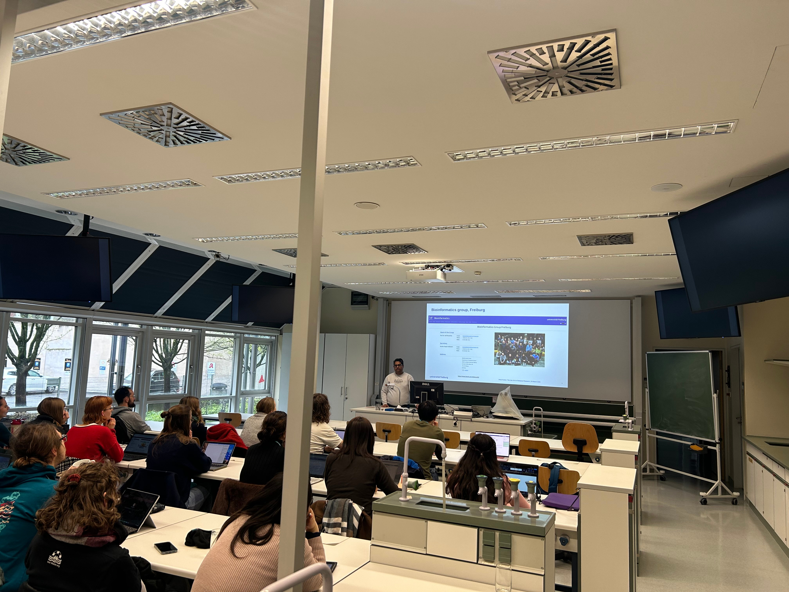
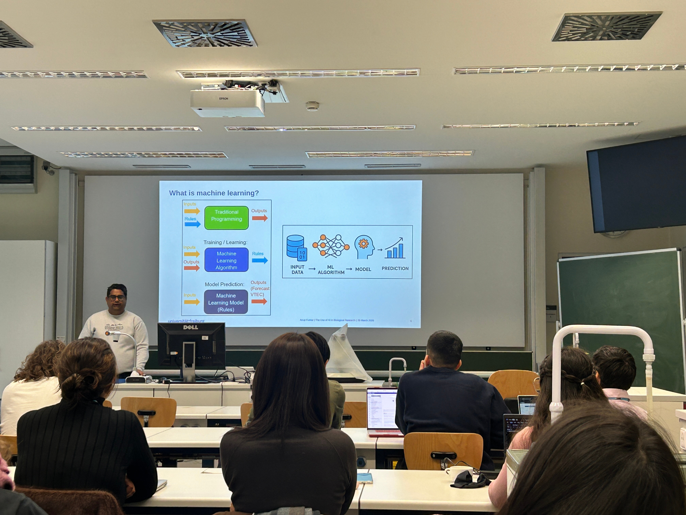
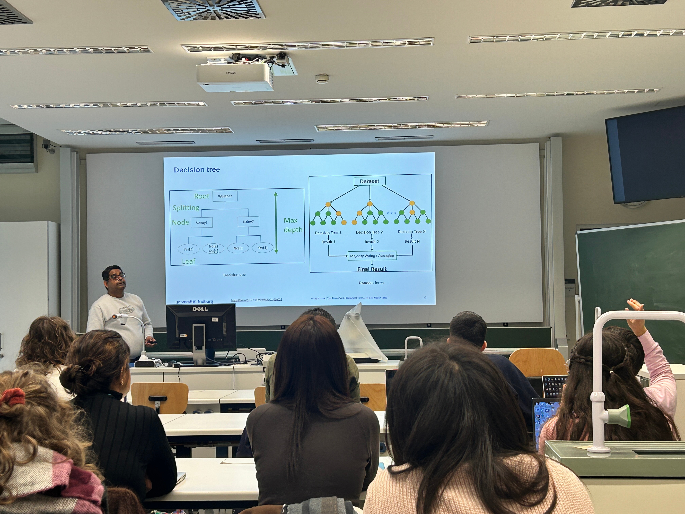
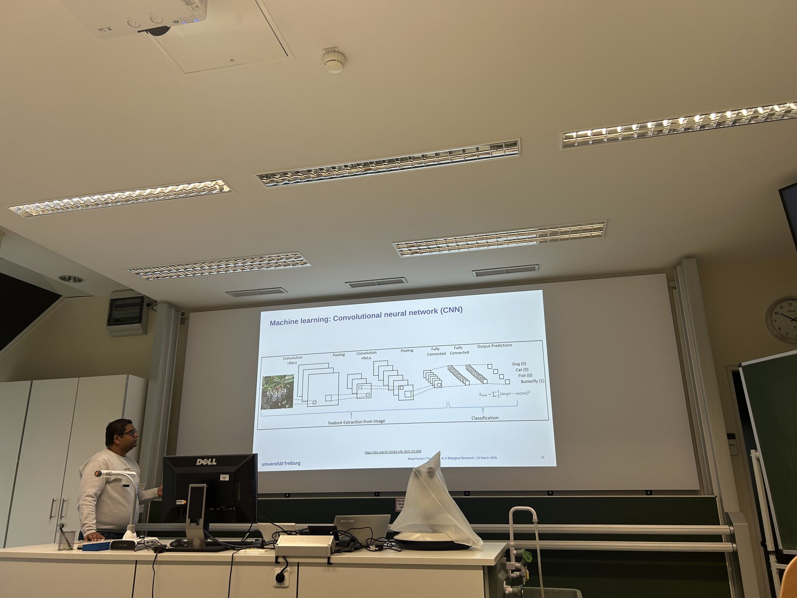

## The Use of AI in Biological Research

The talk provided a comprehensive introduction to how artificial intelligence (AI), particularly machine learning (ML), deep learning (DL) and foundation models, are transforming biological research. It began with foundational concepts, explaining how ML models learn patterns from data to perform tasks such as classification and regression, and introduced widely used algorithms including decision trees, random forests, support vector machines, and neural networks. The lecture emphasized how these approaches can process diverse biological data types—such as genomic sequences, medical images, and molecular structures to generate predictive models and extract meaningful biological insights. It also highlighted the rapid growth of AI-driven research in bioinformatics by showing the exponential rise in the number of PubMed articles over the last 20 years.

Building on these foundations, the lecture demonstrated real-world applications in domains such as genomics, proteomics, systems biology, and plant science. A key example was the use of convolutional neural networks (CNNs) for plant disease detection, where workflows include data collection, preprocessing, augmentation, and model evaluation to classify healthy versus diseased crops. Additionally, the lecture introduced the [Galaxy platform](https://usegalaxy.eu/) and [Galaxy Training Network](https://training.galaxyproject.org/) as accessible tools and resources that enable researchers to perform complex ML analyses without extensive programming expertise. Communities such as [Data Plant](https://www.nfdi4plants.org/), active in plant research, was also introduced. Overall, the lecture underscored the growing role of AI in enabling data-driven discoveries, improving biological understanding, and accelerating innovation in life sciences. 

More details on the [DOMPS Symposium](https://dompssymposium.wixsite.com/domps). The lecture slides can be found [here](https://docs.google.com/presentation/d/1VgvbVe6PCz_qBuXdvcaKqaeEMWdukpkf/edit?usp=sharing&ouid=113741045749084750249&rtpof=true&sd=true)

We thank the organisers of DOMPS SYMPOSIUM 2026 for their kind invitation for the talk.

# Talk in progress

