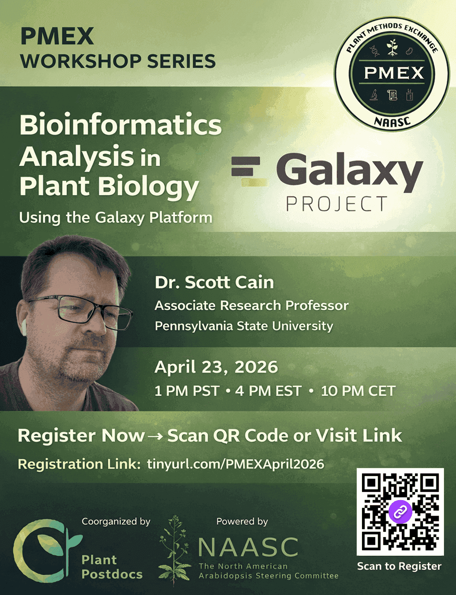

Join Scott at 4:00 EDT/1:00 PDT for an introduction to Galaxy webinar for early researchers in plant biology. [Register here!](https://caltech.zoom.us/meeting/register/IZooar2uRROJhmziHX6lWQ#/registration)
