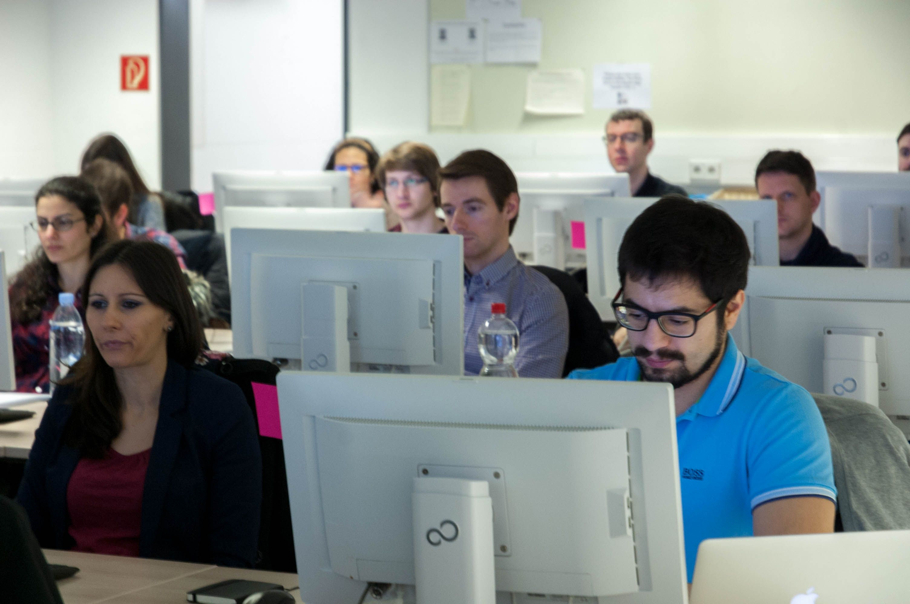
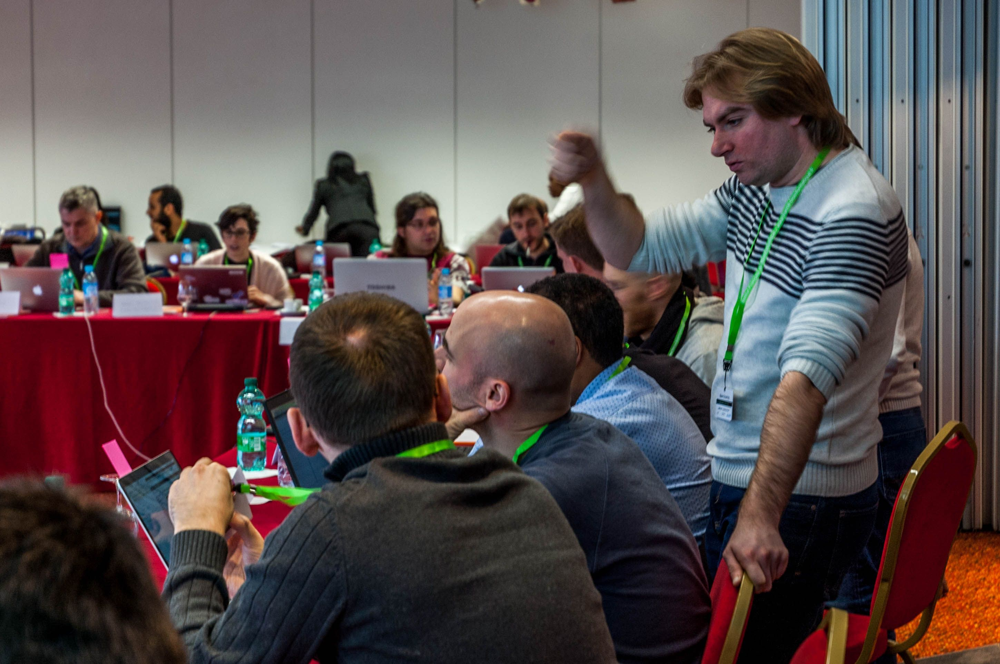
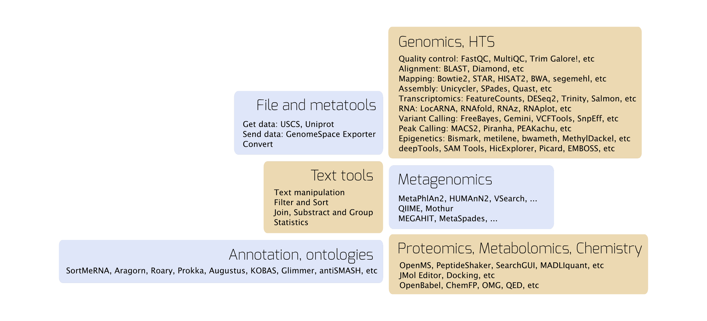

The Freiburg Galaxy Team is offering several services to enable **reproducible** and **accessible** research for everyone:

- [European Galaxy server](#the-european-galaxy-server)
- [Training](#training)
- [Training Infrastructure as a Service (TIaaS)](#training-infrastructure-as-a-service-tiaas)
- [Virtualization for sensitive data](#virtualization-for-sensitive-data)
- [Data analysis](#data-analysis)
- [Tool integration](#tool-integration)
- [Scientific cloud computing](#scientific-computing-cloud)
- [Acknowledgements](#acknowledgements)

## The European Galaxy Server

Our flagship service is the **European Galaxy server** [UseGalaxy.eu](https://usegalaxy.eu/), one of the biggest Galaxy instances in Europe and worldwide.

With **free** registration to [UseGalaxy.eu](https://usegalaxy.eu/) we provide easy access to:

- Free compute and storage resources.
- Databases such as EMBL-EBI ENA, NCBI SRA, Ensembl, UCSC, UniProt, and many organism-specific databases.
- More than 2,500 different, well-documented, and constantly maintained scientific tools.
- Public HTS data analysis workflows.
- Reference genomes.
- Visualizations.

This effort, combined with community-maintained workflows and in-depth [Galaxy Training Network material](https://training.galaxyproject.org/), makes up a productive work experience. We believe in enabling everyone to perform reproducible science.

Simply upload your data from your computer or via FTP and get started with your data analysis. If you have one, you can log in with your ELIXIR AAI.

### Galaxy Subcommunities

We encourage scientists to join forces and foster subcommunities by giving them a common place, a Galaxy subdomain page. Every subdomain comes with its own welcome page, specific tool box, example data, workflows, and training material. More information can be found in the [Galaxy platforms directory](/use/).

## Training

We are passionate about training. Our team wants to support researchers to take part in their own data analyses by educating them in big data analysis, programming, data management, and Galaxy server administration. We believe that sharing knowledge and open science are key points for the future.

  

    
  

  

    
  

  

    
  

### Galaxy Training Workshops

Locally in Freiburg, we offer a free full-week hands-on high-throughput sequencing (HTS) data analysis workshop twice per year. A typical workshop schedule for a week looks as follows:

- Monday: Introduction to Galaxy and HTS data analysis.
- Tuesday: Quality control, IGV, ChIP-seq data analysis.
- Wednesday: RNA-seq data analysis.
- Thursday: Hi-C data analysis, Methyl-C data analysis.
- Friday: Bring your own data, exercises.

We have training material for various topics, including transcriptomics, metabolomics, metagenomics, proteomics, genome annotation, and variant calling. Topics are usually selected from the desired topics of the applicants.

All workshops are announced on our [events page](/freiburg/events/). Registrations are possible through our website after the announcement.

We and other members of the Galaxy Training Network (GTN) give training courses around the world for data analysis, developers, and administrators. Check the main [Galaxy events page](/events/) as well as [de.NBI courses](https://www.denbi.de/training).

### Galaxy Training Material

The Freiburg Galaxy Team is a very active contributor to the community-driven development of GTN Galaxy training material. All of this material is online and freely accessible for everyone at [training.galaxyproject.org](https://training.galaxyproject.org/).

We provide more than 170 tutorials designed for both self-training and workshops for Galaxy users, developers, and administrators. Each tutorial comes with:

- Introduction of the topic with information and theoretical background as a slide deck.
- Step-by-step instruction of the data analysis guiding through the analysis workflow.
- Real-world example data sets stored in data libraries and on Zenodo.
- Interactive tours.

We also provide technical support with tools, data, virtualized instances, and more. You can use this material on our Galaxy instance or spin up your own Galaxy server.

If you want to offer a training course to other researchers, we maintain material for train-the-trainers events and are happy to share our knowledge and experience. We also provide training material for Galaxy developers and administrators, as well as the possibility to use IPython notebooks and Jupyter directly in Galaxy. If you want to give a Galaxy training, you can request [TIaaS](/eu/tiaas/) to get dedicated resources for it.

### Collaboration And Contribution Fests

Contribution fests, or hackathons, are short events where people join forces to develop new techniques, tools, training materials, and other community resources, or improve existing ones.

We organize numerous hackathons per year on site or online, in close cooperation with [de.NBI](https://www.denbi.de/), [ELIXIR](https://www.elixir-europe.org/), and the Galaxy community.

## Training Infrastructure as a Service (TIaaS)

We are very excited to offer a special service for Galaxy trainers: [Training Infrastructure as a Service](/eu/tiaas/).

If you have a training event planned, get in touch with us and we will allocate **dedicated compute resources** for the duration of your training. Your users' jobs on usegalaxy.eu will be directed to these resources and are free from the regular job queue. No setup, no queueing times, no hassle. Apply through the [TIaaS request form](https://usegalaxy.eu/tiaas/new/).

Just drop us an email and concentrate on the important things during your training.

## Virtualization for Sensitive Data

For sensitive biomedical data and users with internet limitations, we offer virtualizations for Galaxy and many other tools. Our aim is to enable all researchers easy access to tools, wherever they need them.

### Virtualized Deployments

Spending valuable time in compilation problems or frustrating conversations with cluster administrators because tools are not available should not be a problem nowadays.

Therefore, we are leading the [Bioconda](https://bioconda.github.io/) and [BioContainers](https://biocontainers.pro/) projects, which together form a strong stack for reproducible science.

### Virtualization Of Galaxy And Customized Flavors

With the [Galaxy Docker project](https://github.com/bgruening/docker-galaxy-stable), we offer a "Galaxy in a box". It is a production-ready, scalable Galaxy instance, complete with the features that make Galaxy popular.

To meet custom needs, we also maintain and offer these Galaxy instances for download in a variety of different flavors. For example:

- The [RNA-workbench flavor](https://github.com/bgruening/galaxy-rna-workbench) for RNA-related research.
- The [ASaiM](https://asaim.readthedocs.io/) flavor for metagenomics.
- A [flavor dedicated to epigenetic research](https://github.com/bgruening/docker-galaxy-epigenetics).

## Data Analysis

You don't have time to analyse your data or have a very specialized question? Our team consists of experts in different fields, including RNA-seq, ChIP-seq, and metagenomics.

We are eager to assist you and solve your scientific question with you. We have a long track record of solving advanced NGS analysis tasks in tight collaborations with experimental groups around the world.

## Tool Integration

Do you have a scientific question and cannot find the appropriate tool for it? We will put ideas into code, and then the code into Galaxy, so everyone can use it.

We are also maintaining, adapting, and optimizing existing Galaxy tools in collaboration with the Galaxy community, for example as part of the [Intergalactic Utilities Commission](https://github.com/galaxyproject/tools-iuc).

## Scientific Computing Cloud

As part of the German Network for Bioinformatics Infrastructure [de.NBI](https://www.denbi.de/), we maintain a scientific cloud for our users.

If you have special needs or require a virtualized computing environment for your research, get in touch with us and we will work with you to develop a personalized solution.

## Acknowledgements

We aim to maintain high competency and provide high-quality data analysis services to all Galaxy users.

Therefore, we request that you acknowledge this service by including the members of the Freiburg Galaxy Team as co-authors if they have made a significant intellectual or organizational contribution to the work described, such as conceptualization, design, data analysis, data interpretation, or input into drafting, revising, or writing any portion of the manuscript.

Individuals who have contributed to the project, but whose contributions do not rise to the level justifying authorship, can be recognized in the acknowledgements section of the manuscript as follows:

> The authors acknowledge the support of the Freiburg Galaxy Team: Person X and Prof. Rolf Backofen, Bioinformatics, University of Freiburg, Germany funded by [Collaborative Research Centre 992 Medical Epigenetics](https://www.sfb992.uni-freiburg.de/) ([DFG](https://www.dfg.de/) grant SFB 992/1 2012) and the German Federal Ministry of Education and Research ([BMBF](https://www.bmbf.de/) grant 031 A538A [de.NBI](https://www.denbi.de/)-RBC).

Additional funding of projects and provision of material expenses are welcome as well, to help support our growing Galaxy community in Freiburg.
