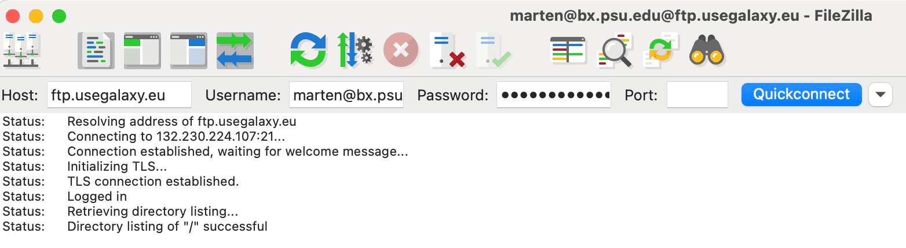
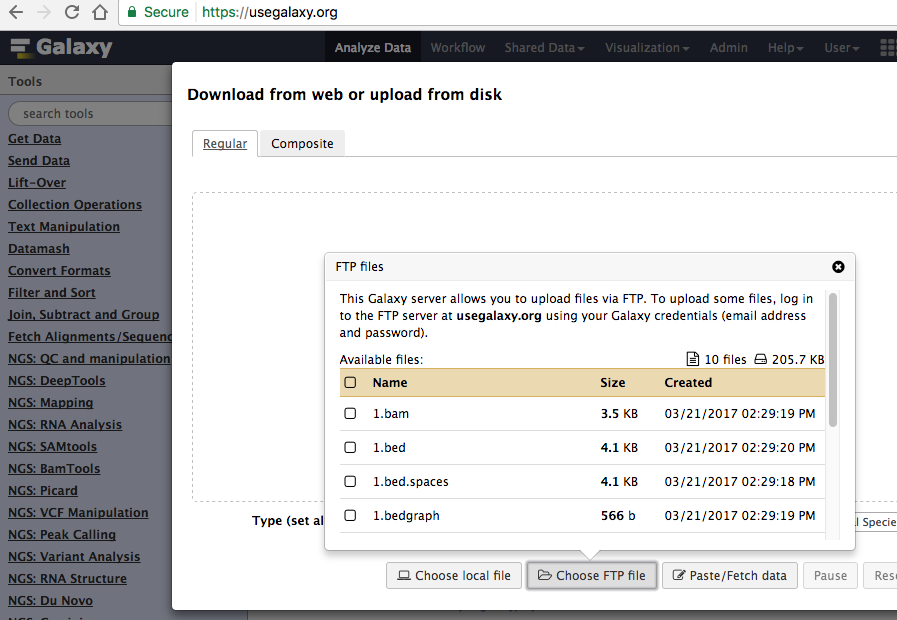

# File Upload via FTP

Uploading data directly from the browser can be unreliable and cumbersome.
Because of this some Galaxy instances allow you to upload data via FTP.
FTP will allow you to monitor the upload status as well as resume interrupted transfers.
Compression types .gz/.gzip, .bz/.bzip, .bz2/.bzip2, and single-file .zip are also supported.

<div class="alert alert-info trim-p" role="alert">
FTP upload is not supported on UseGalaxy.org.
</div>

## Introduction

If you are completely new to FTP transfers you might benefit from reading a [wikihow](https://www.wikihow.com/Use-FTP) page about it.

To get started using FTP with Galaxy, you'll need to have registered a regular Galaxy account. Once registered, you can initiate an FTP connection in your preferred FTP
client. Please see the [comparison](https://en.wikipedia.org/wiki/Comparison_of_FTP_client_software) of available FTP clients.

## Upload with a client

In this example, FileZilla for MacOS is used. Point your client to the FTP server hostname provided in the upload modal window (e.g. `ftp.usegalaxy.eu` for Galaxy Europe).


If you are having trouble connecting to the server try enabling FTP with `passive` mode in your client. 

In most clients, when a connection is made with `FTP` or `FTPS`, a pop-up server certificate authentication will need to be accepted.

Need more help? See: [Galaxy Help](https://help.galaxyproject.org/)

## Upload using command line

### lftp
In this example, `lftp` for MacOS is used.

First, check to see if `lftp` is installed. Type in the command and the prompt will result, as show below, *if installed*. Type `exit` at the prompt to back out of the session.

```
$ lftp
lftp :~>
```

If the command is not found, `brew` can be used to install `lftp`. [Instructions when using MacOS](http://macappstore.org/lftp/).

Command-line for `lftp` when connecting to the Public Main Galaxy server. Executing the command will prompt for your password. Your `email` (aka `user@email.edu`) and `password` are exactly the same as when logging into your account at https://usegalaxy.org.

For explicit FTPS:

```
$ lftp -u user@email.edu ftp.usegalaxy.example
```

For implicit FTPS:

```
$ lftp -u user@email.edu ftps://ftp.usegalaxy.example
```

On some Galaxy servers `FTPS` may or may not be enabled, or the server may only accept implicit or explicit `FTP/FTPS` connections. Check with the administrators of that server if you are not sure.

### ftp

General `FTP` command for a Galaxy server *that has `FTP` enabled but not `FTPS`* is below. The `email` (aka `user@email.example`) and `password` is also server specific and the same as when logging in through a browser.

```
$ ftp -u user@email.example ftp.usegalaxy.example
```


## Import to Galaxy

Files uploaded to the FTP server won't automatically be imported to your history -
rather, you will be presented with a list of the contents of your FTP directory
in the standard upload interface. Select the ones you want to import and hit Start.



<div class="alert alert-info" role="alert">
Files not imported within 3 days will be cleaned up from the FTP folder. Ask your Galaxy admin for details. 
</div>

## Configure your Galaxy as Admin

To configure FTP upload in your installations of Galaxy follow the instructions in the [admin documentation](https://docs.galaxyproject.org/en/master/admin/special_topics/ftp.html).
