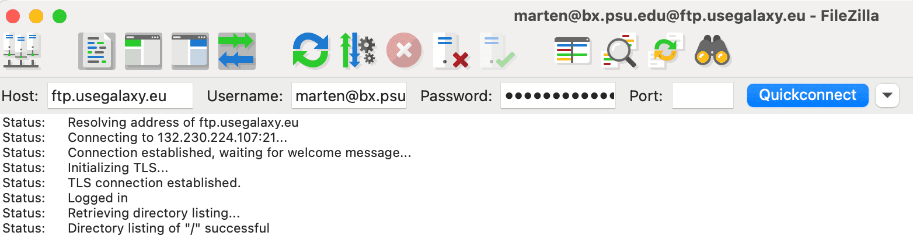

# UseGalaxy.eu FTP Server

> We integrated a new way to upload data into Galaxy based on [tus.io](https://tus.io/). This enables users to upload large amounts of data via the web interface in a more reliable way with resumable file upload support. This also means that the 1 GB limit for uploads via your browser does not exist anymore. Try out the new upload system and [let us know how it goes](mailto:contact@usegalaxy.eu?subject=Tus.io+feedback).

| Server             | Port | Properties                     |
| ------------------ | ---- | ------------------------------ |
| `ftp.usegalaxy.eu` | 21   | Secure connections only (TLS). |

## UseGalaxy.eu Credentials

Use **the same email address and password** that you use to log in to [usegalaxy.eu](https://usegalaxy.eu/).

## UseGalaxy.eu Service Policies

Any user data uploaded to our FTP server should be imported into Galaxy as soon as possible. Data left in FTP folders for more than 3 months will be deleted.

## Upload Multiple Files Using FileZilla

This is intended for regular users who want to access the service through a desktop client.

We suggest installing and trying a simple application like [FileZilla](https://filezilla-project.org/download.php?type=client), available for Windows, macOS, and Linux operating systems.

All default settings should work:

- Type in the `ftp.usegalaxy.eu` URL.
- Type in your email and password, the same credentials used to log into Galaxy at that server.
- Click the button for quick connect.
- Review and accept the certificate pop-ups.

Then it is as simple as navigating to the files on your computer on the left side and dragging them over to the server on the right side. The transfer status will be reported in the bottom tabs.

**Don't quit out** of the application or let your computer **sleep** until the full data transfer is completed. Should a connection drop or a partial file transfer occur:

- Click quick connect again.
- Review and accept server certificate pop-ups, if requested.
- Click "resume transfer".

## Upload Multiple Files Via curl

This is intended for expert users who want to access the service through a command line.

```bash
curl -T {"file1,file2"} --user user@name.de --ssl ftp://ftp.usegalaxy.eu
```

The comma-separated list of files needs to be quoted and must not contain spaces: `{"file1,file2"}`.

## UseGalaxy.eu Troubleshooting

If you are experiencing a **"Connection timed out after 20 seconds of inactivity"** error, try the suggestions shown on this [Galaxy Help thread](https://help.galaxyproject.org/t/error-while-connecting-to-usegalaxy-eu-server/6815).

## Generic Galaxy FTP Upload

Uploading data directly from the browser can be unreliable and cumbersome.
Because of this some Galaxy instances allow you to upload data via FTP.
FTP will allow you to monitor the upload status as well as resume interrupted transfers.
Compression types .gz/.gzip, .bz/.bzip, .bz2/.bzip2, and single-file .zip are also supported.

<div class="alert alert-info trim-p" role="alert">
FTP upload is not supported on the usegalaxy.org instance.
</div>

## Introduction

If you are completely new to FTP transfers you might benefit from reading a [wikihow](https://www.wikihow.com/Use-FTP) page about it.

To get started using FTP with Galaxy, you'll need to have registered a regular Galaxy account. If you are signed-in to Galaxy using a third-party identity and you do not have a Galaxy password please use the reset password option in the login form with your email to create a password for your account.

Once you have a username and a password, you can initiate an FTP connection in your preferred FTP
client. Please see the [comparison](https://en.wikipedia.org/wiki/Comparison_of_FTP_client_software) of available FTP clients.

## Upload with a client

In this example, FileZilla for MacOS is used. Point your client to the FTP server hostname provided in the upload modal window (e.g. `ftp.usegalaxy.eu` for Galaxy Europe).


If you are having trouble connecting to the server try enabling FTP with `passive` mode in your client.

In most clients, when a connection is made with `FTP` or `FTPS`, a pop-up server certificate authentication will need to be accepted.

For more help ask at [Galaxy Help](https://help.galaxyproject.org/).

## Upload using command line

### lftp

In this example, `lftp` for MacOS is used.

First, check to see if `lftp` is installed. Type in the command and the prompt will result, as show below, _if installed_. Type `exit` at the prompt to back out of the session.

```
$ lftp
lftp :~>
```

If the command is not found, `brew` can be used to install `lftp`. [Instructions when using MacOS](http://macappstore.org/lftp/).

Command-line for `lftp` when connecting to an example Galaxy server. Executing the command will prompt for your password. Your `email` (aka `user@email.example`) and `password` are exactly the same as when logging into your account at `https://usegalaxy.example`.

For explicit FTPS:

```
$ lftp -u user@email.example ftp.usegalaxy.example
```

For implicit FTPS:

```
$ lftp -u user@email.example ftps://ftp.usegalaxy.example
```

On some Galaxy servers `FTPS` may or may not be enabled, or the server may only accept implicit or explicit `FTP/FTPS` connections. Check with the administrators of that server if you are not sure.

### ftp

General `FTP` command for a Galaxy server _that has `FTP` enabled but not `FTPS`_ is below. The `email` (aka `user@email.example`) and `password` is also server specific and the same as when logging in through a browser.

```
$ ftp -u user@email.example ftp.usegalaxy.example
```

## Import to Galaxy

Files uploaded to the FTP server won't automatically be imported to your history -
rather, you will be presented with a list of the contents of your FTP directory
in the standard upload interface. Select the ones you want to import and hit Start.

Depending on the configuration of your Galaxy the import dialogue will be either under `Upload -> Choose FTP Files` or `Upload -> Choose Remote Files -> FTP Directory`.

<div class="alert alert-info" role="alert">
Files not imported within a couple of days are usually cleaned up from the FTP folder. Ask your Galaxy admin for details.
</div>

## Configure your Galaxy as Admin

To configure FTP upload in your installations of Galaxy follow the instructions in the [admin documentation](https://docs.galaxyproject.org/en/master/admin/special_topics/ftp.html).
