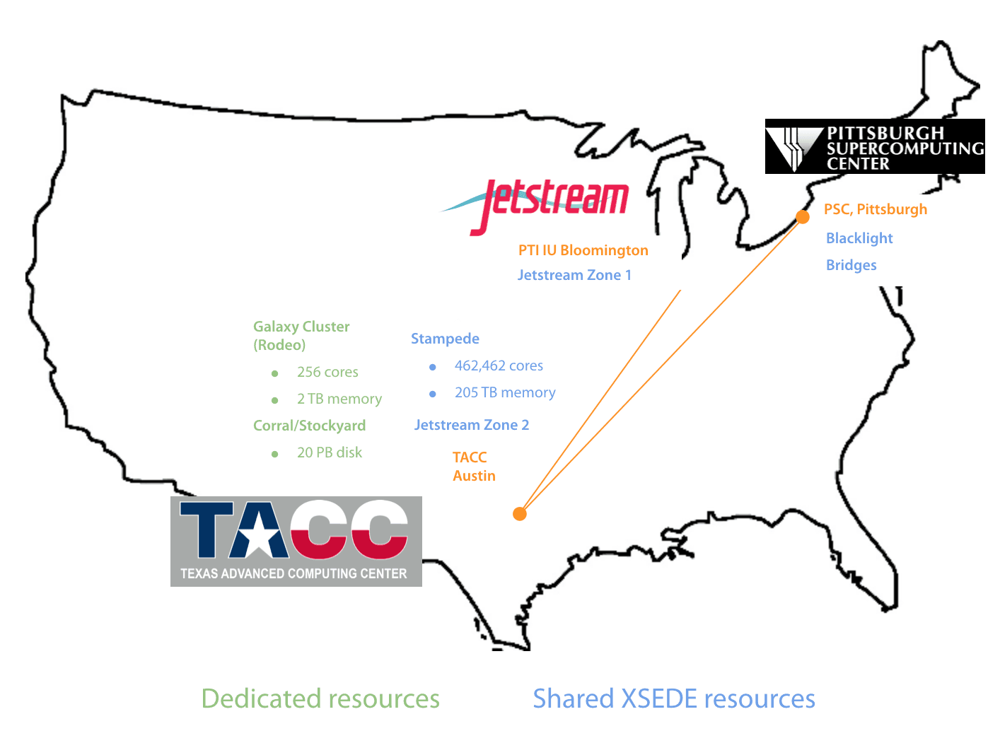

The main Galaxy site at https://usegalaxy.org is an installation of the Galaxy software combined with many common tools and data; this site has been available since 2007 for anyone to analyze their data free of charge. The site provides substantial CPU and disk space, making it possible to analyze large datasets. The site supports thousands of users and hundreds of thousands of jobs per month (see [Project Statistics](/galaxy-project/statistics/)). It is sustained by [Texas Advanced Computing Center (TACC)](https://www.tacc.utexas.edu/) hardware using allocation generously provided by the [CyVerse](https://www.cyverse.org/) project.  

Anyone can use the public servers, with or without an account, but Galaxy user accounts are simple to create (email, password, user name and go!). With an account, data quotas are increased and full functionality across sessions opens up, such as naming, saving, sharing, and publishing Galaxy objects (Histories, Workflows, Datasets, Pages).

**Note**: Galaxy's *Terms and Conditions* (see below) specifically declare a "one-account per user" requirement.

## Status of the public site

The status page with the current state of the Main Server, Test Server, and ToolShed is available at [status page](https://stats.uptimerobot.com/shbYTgpExK).

## Resources available to main site

Our public site utilizes multiple computational resources distributed across the US:

Most jobs are allocated 1 core and 8 GB of memory and run on the dedicated Galaxy cluster at TACC. Some tools that regularly use slightly more memory are allocated 16 GB of memory. Tools that utilize multiple cores (which also typically use larger amounts of memory) can run with either 6 cores and 30 GB of memory on the dedicated Galaxy cluster at TACC or with 10 cores and 30 GB of memory on *m1.xlarge* [Jetstream](https://jetstream-cloud.org/) cloud instances at Indiana University.

In addition to these typical cases, some jobs (involving tools for genome and transcriptome assembly) are submitted to [Bridges](https://www.psc.edu/index.php/resources/computing/bridges) at the Pittsburgh Supercomputing Center or [Stampede2](https://portal.tacc.utexas.edu/user-guides/stampede2) at TACC.

### Choosing computational resources

Tools that can run on more than one computational resource are, by default, automatically directed to the most suitable and readily available resource automatically by Galaxy. However, these tools also have the option for you to manually select the resource. Although not designed for typical usage, manual selection can be a good idea if you know (or strongly suspect) that a tool will exceed the allocation (time limit or memory) on a given resource. On the form for these tools, a **Job Resource Parameters** parameter is available that, if selected, will display a **Compute Resources** selection parameter. The possible options (not all are available for every tool) for this parameter are:

| Resource                                    | Characteristics                                                            |
|---------------------------------------------|----------------------------------------------------------------------------|
| Galaxy cluster                              | 36 hour walltime, 6 cores, 30 GB memory, short/moderate wait               |
| Jetstream                                   | 36 hour walltime, 10 cores, 30 GB memory, short/moderate wait              |
| TACC Stampede2 normal (KNL) partition       | 48 hour walltime, 64 low-frequency cores, 96 GB memory, moderate/long wait |
| TACC Stampede2 SKX partition                | 48 hour walltime, 48 cores, 192 GB memory, long/very long wait             |
| PSC Bridges                                 | variable walltime, variable cores, variable memory, moderate/long wait     |

[Bridges](https://www.psc.edu/index.php/resources/computing/bridges) is a unique *large shared memory* system. The amount of memory allocated varies from 240 GB to 960 GB depending on the tool, inputs, and tool parameters. The walltime also varies from 24 to 96 hours and the cores vary from 5 to 20.

Each resource also offers a *test/development* option, which submits jobs with a very short (30 minute) walltime, often to a dedicated test/development partition. This allows you to test your parameters and a small subset of input data in order to ensure proper tool use before submitting a regular job that may have to wait a substantial time in the queue for full resources. The Galaxy cluster test/development option restricts jobs to 2 cores and 10 GB of memory, whereas all other test/development options are allocated the full amount of cores and memory for the standard resource.

## User data and job quotas

Jobs that have low memory and CPU requirements are subject to the following limits:

| Maximum total accounts per user   | 1 registered/unregistered                              |
|-----------------------------------|--------------------------------------------------------|
| Maximum total user data on server | 250GB for registered users, 5GB for unregistered users |
| Maximum concurrent jobs           | 6 for registered users, 1 for unregistered users       |

Tools utilizing multiple CPUs and over 8 Gb of RAM are subject to stricted limits:

| Resource                        | Per-resource job concurrency quotas    |
|---------------------------------|----------------------------------------|
| Increased memory tools          | 1 registered/unregistered              |
| Galaxy cluster                  | 2 registered, unregistered not allowed |
| Jetstream                       | 4 registered, unregistered not allowed |
| TACC Stampede                   | 4 registered, unregistered not allowed |

All test/development resources are limited to 1 registered, unregistered not allowed.

## Galaxy Web Portal Service Agreement

**Use of Service.**
 
The Galaxy Web Portal is a free, public, Internet accessible resource (the "Service"). Data transfer and data storage are not encrypted. If there are restrictions on the way your research data can be stored and used, please consult your local institutional review board or the project principal investigator before uploading it to any public site, including this Service. If you have protected data, large data storage requirements, or short deadlines you are encouraged to set up your own local Galaxy instance and not use this Service. Your access to the service may be revoked at any time for reasons deemed necessary by the operators of the Service.
 
**Accounts and Service Limitations.**
 
You may choose to register an account with the Service. Your registration data is primarily used so you may persistently store data on the Service and use advanced Galaxy features such as sharing and workflows. The operators of the Service will not provide your registration data to any third party unless required to do so by law. Your access to the Service is provided under the condition that you abide by any published quotas on data storage, job submissions, or any other limitations placed on the public Service. Attempts to subvert these limits by creating multiple accounts or through any other method may result in termination of all associated accounts.
 
**Disclaimer.**
 
The Service is provided to you on an "AS IS" BASIS and WITHOUT WARRANTY, either express or implied, including, without limitation, the warranties of non-infringement, merchantability or fitness for a particular purpose. THE ENTIRE RISK AS TO THE QUALITY OF THE SERVICE IS WITH YOU. This DISCLAIMER OF WARRANTY constitutes an essential part of this service agreement.
 
**Limitation of Liability.**
 
Under no circumstances and under no legal theory, whether in tort (including negligence), contract, or otherwise, shall The Pennsylvania State University or any other entity which provides resources for the Service be liable to anyone for any indirect, special, incidental, or consequential damages of any character arising as a result of the use of this Service including, without limitation, damages for loss of goodwill, work stoppage, computer failure or malfunction, or any and all other commercial damages or losses. This limitation of liability shall not apply to the extent applicable law prohibits such limitation.

