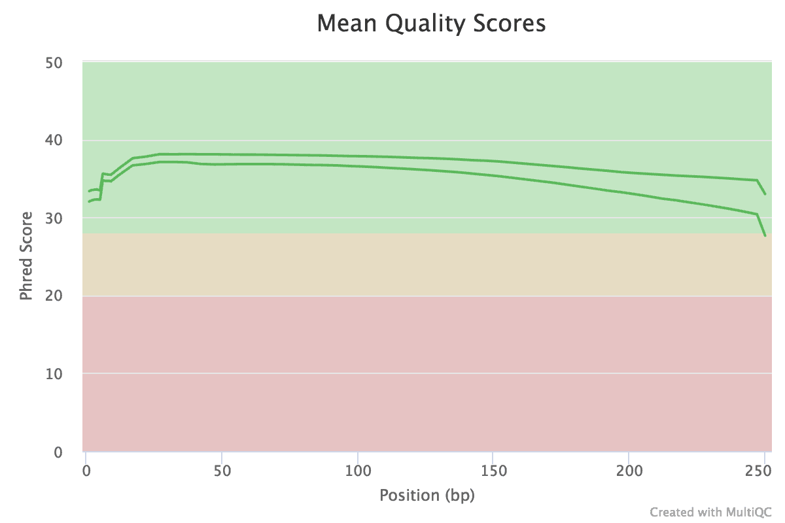
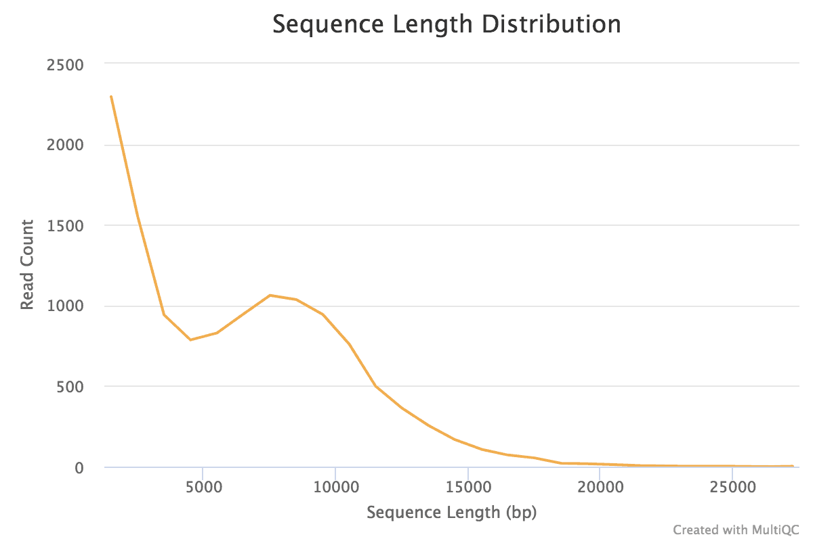
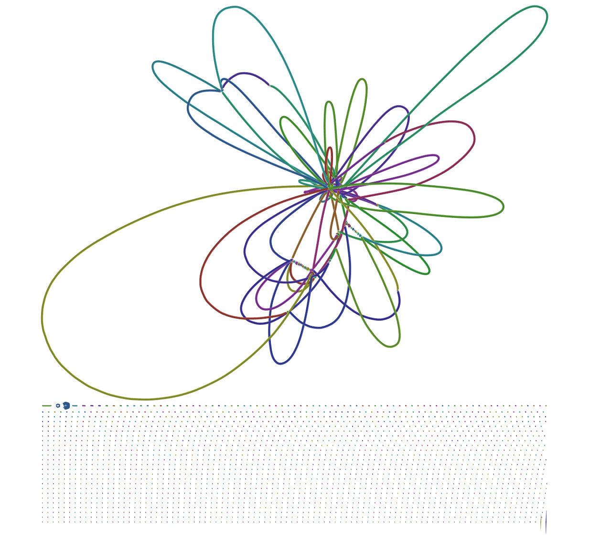
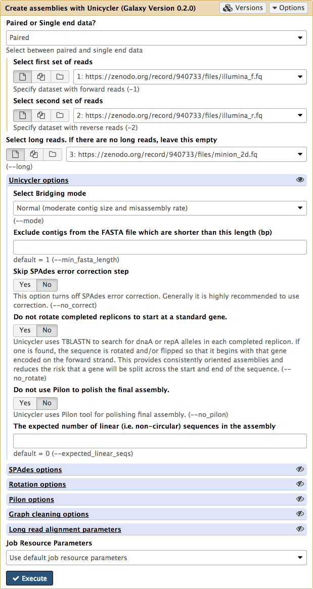
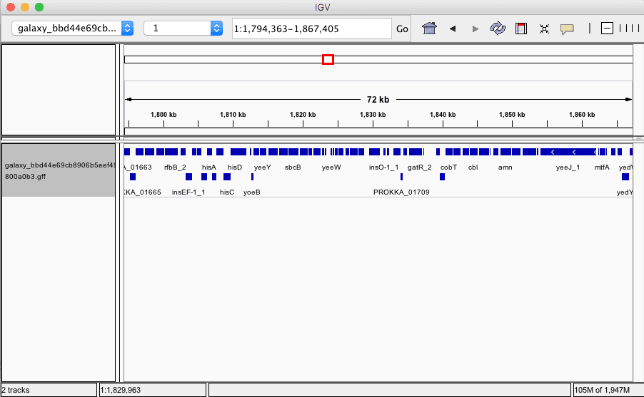

<div class="alert alert-info trim-p inline-p" role="alert"><i class="fa fa-fighter-jet" aria-hidden="true"></i>

If you are impatient (like me) and would like to try assembly right away - go to the [tutorial](https://galaxyproject.github.io/training-material/topics/assembly/tutorials/unicycler-assembly/tutorial.html).

</div>

Perhaps assembly is spelled **ass**embly for a reason - it is complicated. When I first needed to perform assembly I was uneasy about it - I had never done it before. What I needed was to sequence a genome of an *E. coli* type C-1 that my lab was using in experimental evolution experiments (e.g., [Dickins 2009](https://www.ncbi.nlm.nih.gov/pmc/articles/PMC2817424/)). We had generated data and were sitting figuring out what to do with it. Here I describe our logic and how we ended up with integrating genome assembly into Galaxy, so *you* can use your time more wisely.

## Getting data

We have sequenced the genome using two technologies: Illumina MiSeq (250 nucleotide paired reads) and Oxford Nanopore. For MiSeq we used [Penn State core facility](https://www.huck.psu.edu/content/instrumentation-facilities/genomics-core-facility) while Oxford Nanopore Sequencing was performed in [James Taylor's lab](https://web.archive.org/web/20210308182933/https://taylorlab.org/) who just could not resist and bought the [MinIon](https://nanoporetech.com/products/minion) device. Of course devices don't simply sequence the DNA. Libraries need to be prepared, QCed, and sequenced. Both myself and James are lucky to have excellent people in the lab. For MiSeq run all experimental work was performed by [Han Mei](http://bmb.psu.edu/directory/hzm5191), a graduate student at Penn State. For Oxford Nanopore run everything was done by [Mallory Freeberg](https://twitter.com/malloryfreeberg?lang=en) (currently a bioinformatician at EMBL-EBI). As you can see below the data were spectacular:

|             |
|-------------|
||
|<small>**Figure 1.** Quality score distribution for MiSeq reads.</small>|

|             |
|-------------|
||
|<small>**Figure 2.** Read length distribution for Oxford Nanopore reads. The longest read was 27,519 nucleotides long.</small>|

## Trying assembly

After reading and consulting with people who actually understand genome assembly process (notably [Paul Medvedev](http://medvedevgroup.com/)) we chose [SPAdes](http://bioinf.spbau.ru/spades) for performing the assembly. SPAdes supports [hybrid assembly](https://www.ncbi.nlm.nih.gov/pubmed/26589280) where short high quality reads (Illumina in our case) are supplemented by long, relatively inaccurate reads (Oxford Nanopore that we've generated).

### Running SPAdes

We installed Spades 3.11.1 using [Bioconda](https://bioconda.github.io/recipes/spades/README.html) and generated assembly using the following command:

```
spades.py -k 21,33,55,77,99,127 -1 forward_miseq_reads.fastq -2 reverse_miseq_reads.fastq --nanopore nanopore_reads.fastq  -t 20 -o assembly    
```

It produced the following assembly (for distinction between contigs and scaffolds [see here](https://support.ncbi.nlm.nih.gov/link/portal/28045/28049/Article/752/How-are-genome-assemblies-generated-and-what-are-assembly-levels)):

| Statistics                       | Contigs   | Scaffolds |
|----------------------------------|-----------|-----------|
| # contigs/scaffolds > 0 bp       | 2,271     | 2,253     |
| # contigs/scaffolds &#8925; 1,000 bp  | 22        | 33        |
| Total length > 0 bp              | 5,676,639 | 5,679,836 |
| Total length &#8925; 1000 bp          | 4,611,915 | 4,629,934 |
| Largest contig/scaffold          | 4,135,925 | 4,575,240 |
| GC (%)                           | 50.91     | 50.91     |
| N50                              | 4,135,925 | 4,575,240 |
| N75                              | 4,135,925 | 4,575,240 |
| # of Ns per 100 kbp              | 0.0       | 22.07     |

Here you can see that the largest scaffold is 4,575,240 bp which is very close to a complete *E. coli* genome (*E. coli* [K-12's genome](https://www.ncbi.nlm.nih.gov/nuccore/NC_000913.3) is 4,641,652 bp). But what about these extra 2,253 scaffolds? Looking at assembly graph generated with SPAdes using [Bandage](http://rrwick.github.io/Bandage/) produces this image:

|             |
|-------------|
||
|<small>**Figure 3.** SPAdes assembly graph. Repeat resolution and scaffolding along this graph produces contigs and scaffolds produced by SPAdes. This is why sequences reported by assembler are longer that nodes shown in this graph.</small>|

At the bottom of this graph there is a very large number of subgraphs disconnected from the main graph. It was not clear to me what to do with them and what is their significance.

### Unicycler to the rescue


[Ryan Wick](https://github.com/rrwick), the author of Bandage used above, has written a tool, [Unicycler](https://github.com/rrwick/Unicycler), that is designed to produce a much more palatable assembly. Unicycler uses SPAdes to produce an assembly graph, which is then bridged (simplified) using long reads to produce longest possible set of contigs. These are then polished by aligning original short reads against produced contigs and feeding these alignment to [Pilon](https://github.com/broadinstitute/pilon/wiki) - an assembly improvement tool.

Applying Unicycler to the same data produces just two (instead of 2,271!) contigs:

| Statistics                       | Contigs   |
|----------------------------------|-----------|
| # contigs/scaffolds > 0 bp       | 2         |
| # contigs/scaffolds &#8925; 1,000 bp  | 2    |
| Total length > 0 bp              | 4,581,676   |
| Total length &#8925; 1000 bp     | 4,581,676   |
| Largest contig          | 4,576,290   |
| GC (%)                           | 50.93     |
| N50                              | 4,576,290   |
| N75                              | 4,576,290   |
| # of Ns per 100 kbp              | 0.0       |

and the final assembly graph that looks like this:

|             |
|-------------|
||
|<small>**Figure 4.** Unicycler final assembly graph.</small>|

The second short contig is simply the complete genome of bacteriophage &#632;X174, which is added as spike-in in Illumina sequencing protocol.

So after doing all of this the obvious question is why not to enable assembly is Galaxy?

## Assembly on the web

Unicycler has proven to be a great tool. So with help of [Bj&#246;rn Gr&#252;ning](https://github.com/bgruening), [Delphine Lariviere](https://github.com/Delphine-L), and [Dave Bouvier](https://github.com/davebx) we [added it to Bioconda](https://bioconda.github.io/recipes/unicycler/README.html) and [wrapped](https://github.com/galaxyproject/tools-iuc/tree/master/tools/unicycler) it for [Galaxy](http://usegalaxy.org), so anyone can repeat this entire analysis on-line without installing and configuring anything.

<div class="float-right">

</div>

By allowing assembly tools in Galaxy we are also allowing multiple users to perform assembly simultaneously. This requires substantial computational resources. Execution of Unicycler on Galaxy [main instance](http://usegalaxy.org) actually takes place on [Bridges supercomputer](https://www.psc.edu/bridges) at the Pittsburgh Supercomputing Center. This resource allocation is provided by a grant from the [XSEDE](https://www.xsede.org/) consortium for which we are extremely grateful.

The Unicycler interface in Galaxy looks like this:

|             |
|-------------|
||
|<small>**Figure 5.** Unicycler interface in Galaxy.</small>|

<div class="float-right">

</div>

But it's not just Unicycler, we've also integrated [Quast](http://bioinf.spbau.ru/quast) to evaluate assembly quality and [Prokka](http://www.vicbioinformatics.com/software.prokka.shtml) to produce annotations. So you can start with sequencing reads and end up with full-fledged annotated genome:

|             |
|-------------|
||
|<small>**Figure 6.** Assembled and annotated genome of *E. coli* C-1.</small>|

So ...

<a href="https://galaxyproject.github.io/training-material/topics/assembly/tutorials/unicycler-assembly/tutorial.html"><button type="button" class="btn btn-success">Go to the Unicycler tutorial Now!</button></a>


