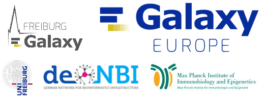
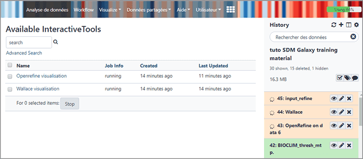
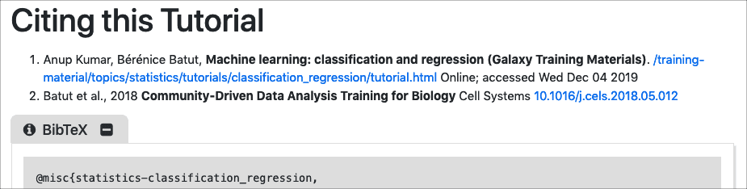
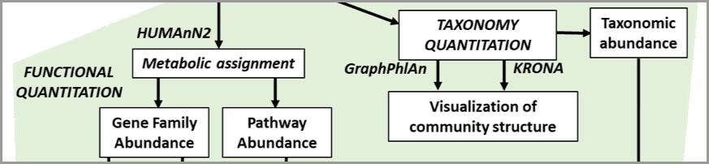
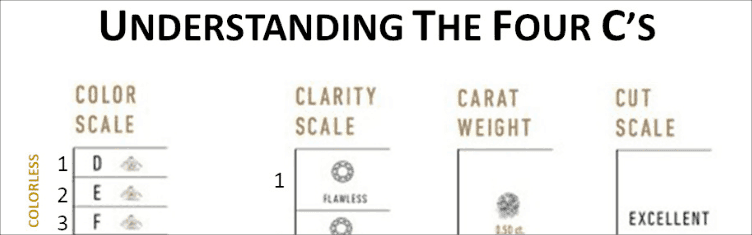

The *December 2019 Galactic News* is out:

* **[12 Upcoming Events](/news/2019-12-galaxy-update/#events)**
    * India, PAG, HTS, single cell/microbiome, Barcelona, and more
* **[191 new publications](/news/2019-12-galaxy-update/#publications)**
* **[Two new blog posts](#galactic-blog-activity)**
    * g:Profiler, GalaxyP
* **[Galaxy Platform News](/news/2019-12-galaxy-update/#galaxy-platforms-news)**
    * Systems biology, Laniakea, OpenRefine, ...
* **[Training material and doc updates](/news/2019-12-galaxy-update/#doc-hub-and-training-updates)**
    * defining data types, citing GTN, Windows, account help, metatranscriptomics, Galaxy for everyone
* **[Openings](/news/2019-12-galaxy-update/#whos-hiring)**
    * with 5 organizations in Denmark, France, US, US, Germany
* **[Releases](#releases)**
    * Galaxy 19.09 is out
* And **[other news too](/news/2019-12-galaxy-update/#other-news)**

If you have anything to include to next month's newsletter, then please send it to outreach@galaxyproject.org.

# Events

Galaxy @ InSyB 2019

Galaxy (especially [Galaxy Australia](https://usegalaxy.org.au/) will be [featured in a workshop and a plenary talk](/events/2019-12-insyb/) at the [International Symposium on Bioinformatics 2019 (InSyB2019)](https://www.hrmmv.org/INSYB2019) being held December 21-22, 2019 at [Hans Raj Mahila Maha Vidyalaya](https://www.hrmmv.org/), Jalandhar, Punjab, India.  *Registration and abstract submission are still open.*

Galaxy @ PAG 2020

[Galaxy will be at Plant and Animal Genome XXVII (PAG 2020)](/events/2020-pag/), in San Diego, California, United States, January 11-15. This includes a *hands-on Galaxy Workshop* (highlighting the new [Excellence in Breeding platform](/use/cropgalaxy/)) and many talks and posters featuring Galaxy.

And there will be a [GMOD Codefest](http://gmod.org/wiki/Codefest_2020) *before* PAG and an [NCBI Codeathon](https://ncbi-codeathons.github.io/) *after* PAG.

9th Galaxy workshop on HTS data analysis

This [week-long Galaxy workshop in Freiburg](https://galaxyproject.eu/event/2019-11-07-GalaxyWS_FR/) will introduce participants to high-throughput data analysis with Galaxy.  Space is limit, and applications are competitive.  **Apply by 19 December.**

Galaxy @ ABRF 2020

[Galaxy will be at 2020 ABRF meeting](/events/2020-abrf/), in Palm Springs, California, United States, February 29 through March 3. This includes a full day *hands-on Galaxy Workshop* about **using Galaxy with your single cell and microbiome** data.  ABRF is *the annual conference for technology-enabled multidisciplinary research.*

[Registration is now open](https://conf.abrf.org/program/registration-schedule/), **but space is limited**.

2-6 March: Galaxy Admin Training 2020

Save these dates!  The next **[Galaxy Admin Training](/events/2020-03-admin/) will be offered 2-6 March at the [Barcelona Supercomputing Center](https://www.bsc.es/).**

This week-long hands-on training will feature what you need to know to set up your own production quality Galaxy server.  Registration will open later this month.

Upcoming Events

There are

* [12 upcoming events](/events/)
* on 3 continents, plus online
* in India, US, Belgium, Germany, France, Spain, and the UK.

# Publications

**191 new publications** referencing, using, extending, and implementing Galaxy were added to the [Galaxy Publication Library](https://www.zotero.org/groups/galaxy) in the last month.  There were seven *[Galactic](https://www.zotero.org/groups/1732893/galaxy/tags/%2BGalactic)* and *[Stellar](https://www.zotero.org/groups/1732893/galaxy/tags/%2BStellar)* publications added, *and all seven of them are open access:*

[Tool recommender system in Galaxy using deep learning](https://doi.org/10.1101/838599)

Kumar, A., [Grüning, B.](/people/bjoern-gruening/), & Backofen, R. (2019). *BioRxiv*, 838599. doi: 10.1101/838599

[The de.NBI / ELIXIR-DE training platform - Bioinformatics training in Germany and across Europe within ELIXIR](https://doi.org/10.12688/f1000research.20244.1)

Wibberg, D., Batut, B., Belmann, P., Blom, J., Glöckner, F. O., [Grüning, B.](/people/bjoern-gruening/), … Kohlbacher, O. (2019).  *F1000Research*, 8, 1877. doi: 10.12688/f1000research.20244.1

[Scalable Data Analysis in Proteomics and Metabolomics Using BioContainers and Workflows Engines](https://doi.org/10.1002/pmic.201900147)

Perez‐Riverol, Y., & Moreno, P. (2019). *PROTEOMICS*, 1900147. doi: 10.1002/pmic.201900147

[Computational Modelling of Metabolic Burden and Substrate Toxicity in Escherichia coli Carrying a Synthetic Metabolic Pathway](https://doi.org/10.3390/microorganisms7110553)

Demko, M., Chrást, L., Dvořák, P., Damborský, J., & Šafránek, D. (2019). *Microorganisms*, 7(11), 553. doi:10.3390/microorganisms7110553

[Multi-omics Visualization Platform: An extensible Galaxy plug-In for multi-omics data visualization and exploration]( https://doi.org/10.1101/842856)

McGowan, T., Johnson, J. E., Kumar, P., Sajulga, R., Mehta, S., Jagtap, P. D., & Griffin, T. J. (2019). *BioRxiv,* 842856. doi: 10.1101/842856

[A sectioning and database enrichment approach for improved peptide spectrum matching in large, genome-guided protein sequence databases](https://doi.org/10.1101/843078)

Kumar, P., Johnson, J. E., Easterly, C., Mehta, S., Sajulga, R., Nunn, B., … Griffin, T. J. (2019). *BioRxiv,* 843078. doi: 10.1101/843078

[Analytic Correlation Filtration: A New Tool to Reduce Analytical Complexity of Metabolomic Datasets](https://doi.org/10.3390/metabo9110250)

Monnerie, S., Petera, M., Lyan, B., Gaudreau, P., Comte, B., & Pujos-Guillot, E. (2019). *Metabolites,* 9(11), 250. doi: 10.3390/metabo9110250

Publication Topics

Publications are tagged with how they use, extend or reference Galaxy.  The past month's pubs were tagged as:

<a class="btn"  style="text-align: right; background-color: #63c463;" href="https://www.zotero.org/groups/1732893/galaxy/tags/+Methods"> 136 : <strong>+Methods</strong></a>
 <a class="btn"  style="text-align: right; background-color: #7acd7a;" href="https://www.zotero.org/groups/1732893/galaxy/tags/+UsePublic"> 64 : <strong>+UsePublic</strong></a>
 <a class="btn"  style="text-align: right; background-color: #99d899;" href="https://www.zotero.org/groups/1732893/galaxy/tags/+Workbench"> 24 : <strong>+Workbench</strong></a>
 <a class="btn"  style="text-align: right; background-color: #a0dba0;" href="https://www.zotero.org/groups/1732893/galaxy/tags/+UseLocal"> 19 : <strong>+UseLocal</strong></a>
 <a class="btn"  style="text-align: right; background-color: #a0dba0;" href="https://www.zotero.org/groups/1732893/galaxy/tags/+UseMain"> 19 : <strong>+UseMain</strong></a>
 <a class="btn"  style="text-align: right; background-color: #a9dfa9;" href="https://www.zotero.org/groups/1732893/galaxy/tags/+RefPublic"> 14 : <strong>+RefPublic</strong></a>
 <a class="btn"  style="text-align: right; background-color: #b0e1b0;" href="https://www.zotero.org/groups/1732893/galaxy/tags/+Tools"> 11 : <strong>+Tools</strong></a>
 <a class="btn"  style="text-align: right; background-color: #cceccc;" href="https://www.zotero.org/groups/1732893/galaxy/tags/+IsGalaxy"> 4 : <strong>+IsGalaxy</strong></a>
 <a class="btn"  style="text-align: right; background-color: #d3eed3;" href="https://www.zotero.org/groups/1732893/galaxy/tags/+Reproducibility"> 3 : <strong>+Reproducibility</strong></a>
 <a class="btn"  style="text-align: right; background-color: #dcf2dc;" href="https://www.zotero.org/groups/1732893/galaxy/tags/+Education"> 2 : <strong>+Education</strong></a>
 <a class="btn"  style="text-align: right; background-color: #dcf2dc;" href="https://www.zotero.org/groups/1732893/galaxy/tags/+Unknown"> 2 : <strong>+Unknown</strong></a>
 <a class="btn"  style="text-align: right; background-color: #dcf2dc;" href="https://www.zotero.org/groups/1732893/galaxy/tags/+Visualization"> 2 : <strong>+Visualization</strong></a>
 <a class="btn"  style="text-align: right; background-color: #e9f7e9;" href="https://www.zotero.org/groups/1732893/galaxy/tags/+Shared"> 1 : <strong>+Shared</strong></a>
 

# Galactic Blog Activity

[Two new entries](/news/) in the past month, both related to UseGalaxy.eu..

[gProfiler is published and running on usegalaxy.eu](/news/2019-11-20-g-profiler/)

By Ivan Kuzmin.  gProfiler is a toolset for functional enrichment analysis and conversions of gene lists.

[Great GalaxyP Tutorials hosted at GalaxyProject.eu](http://proteomicsnews.blogspot.com/2019/11/great-galaxyp-tutorials-hosted-at.html)

By Ben Orsburn.  The arguments are building up for why you need this.

# Galaxy Platforms News

The [Galaxy Platform Directory](/use/) lists resources for easily running your analysis on Galaxy, including publicly available servers, cloud services, and containers and VMs that run Galaxy. There are many new platforms this month:

[BioDivine Toolset Server](/use/biodivine/)

The BioDivine server hosts tools for systems biology, developed by the [Systems Biology Research Centre (Sybila)](https://sybila.fi.muni.cz/) in the [Faculty of Informatics of Masaryk University](https://www.fi.muni.cz/index.html.en) in Brno, Czechia.

[Laniakea 2 Launched](https://laniakea-elixir-it.github.io/)

Version 2 of [Laniakea](/use/laniakea/) announced at the November [ELIXIR Innovation and SME Forum](https://elixir-europe.org/events/sme-2019-milan).  Laniakea provides automatic deployment of virtual Galaxy environments. See the [video for details](https://laniakea-elixir-it.github.io/).

[OpenRefine on Ecology Galaxy](https://ecology.usegalaxy.eu/root?tool_id=interactive_tool_openrefine)

[OpenRefine](http://openrefine.org/), a tool for cleaning data, is now [available as an Interactive tool](https://ecology.usegalaxy.eu/root?tool_id=interactive_tool_openrefine) on [Ecology Galaxy](https://ecology.usegalaxy.eu/).

[UseGalaxy.*](/usegalaxy/) News

* [UseGalaxy.eu: 10,000 users, 6,370,000 jobs and 11,900,000 datasets](https://galaxyproject.eu/posts/2019/12/02/10000user/)
* UseGalaxy.eu Tool Updates for [10th](https://galaxyproject.eu/posts/2019/11/10/tool-update/), [15th](https://galaxyproject.eu/posts/2019/11/15/tool-update/), [23rd](https://galaxyproject.eu/posts/2019/11/22/tool-update/), and [30th](https://galaxyproject.eu/posts/2019/11/30/tool-update/) of November.
* Also see [recent blog posts](#galactic-blog-activity)

Galaxy Platforms in Publications

Platforms that were referenced at least twice in the past month's publications:

<a class="btn"  style="text-align: right; background-color: #98d898;" href="https://www.zotero.org/groups/1732893/galaxy/tags/>Huttenhower"> 25 : <strong>Huttenhower</strong></a>
 <a class="btn"  style="text-align: right; background-color: #b6e3b6;" href="https://www.zotero.org/groups/1732893/galaxy/tags/>UseGalaxy.eu"> 9 : <strong>UseGalaxy.eu</strong></a>
 <a class="btn"  style="text-align: right; background-color: #b9e5b9;" href="https://www.zotero.org/groups/1732893/galaxy/tags/>CPT"> 8 : <strong>CPT</strong></a>
 <a class="btn"  style="text-align: right; background-color: #b9e5b9;" href="https://www.zotero.org/groups/1732893/galaxy/tags/>RepeatExplorer"> 8 : <strong>RepeatExplorer</strong></a>
 <a class="btn"  style="text-align: right; background-color: #c6eac6;" href="https://www.zotero.org/groups/1732893/galaxy/tags/>Workflow4Metabolomics"> 5 : <strong>Workflow4Metabolomics</strong></a>
 <a class="btn"  style="text-align: right; background-color: #cceccc;" href="https://www.zotero.org/groups/1732893/galaxy/tags/>Cistrome"> 4 : <strong>Cistrome</strong></a>
 <a class="btn"  style="text-align: right; background-color: #cceccc;" href="https://www.zotero.org/groups/1732893/galaxy/tags/>Galaxy-P"> 4 : <strong>Galaxy-P</strong></a>
 <a class="btn"  style="text-align: right; background-color: #d3eed3;" href="https://www.zotero.org/groups/1732893/galaxy/tags/>UseGalaxy.org.au"> 3 : <strong>UseGalaxy.org.au</strong></a>
 <a class="btn"  style="text-align: right; background-color: #dcf2dc;" href="https://www.zotero.org/groups/1732893/galaxy/tags/>ARGs-OAP"> 2 : <strong>ARGs-OAP</strong></a>
 <a class="btn"  style="text-align: right; background-color: #dcf2dc;" href="https://www.zotero.org/groups/1732893/galaxy/tags/>Orione"> 2 : <strong>Orione</strong></a>

And the ProteoRE group is hiring too.  [See below](#whos-hiring).

# Doc, Hub, and Training Updates

Defining Data Types in Galaxy

New comprehensive documentation by [@selten](https://github.com/selten) on [how to define data types for Galaxy](https://docs.galaxyproject.org/en/latest/dev/data_types.html).

Cite GTN Tutorials

Thanks to [Helena Rasche](/people/helena-rasche/), every [GTN Tutorial](https://training.galaxyproject.org/) now includes a *Citing this Tutorial* section, including a BibTex citation for the tutorial.

Galaxy on Windows

The documentation on [how to run Galaxy on Windows](/admin/config/windows/) has been completely revamped by [Tomas Klingström](https://www.slu.se/cv/tomas-klingstrom/) to use the Windows Subsystem for Linux.

Account Creation Help

The account creation documentation was expanded by [Jennifer Hillman-Jackson](/people/jennifer-jackson/) to cover additional situations and help resources.

Metatranscriptomics analysis using microbiome RNA-seq data

By [Pratik Jagtap](https://training.galaxyproject.org/training-material/hall-of-fame#pratikdjagtap), [Subina Mehta](https://training.galaxyproject.org/training-material/hall-of-fame#subinamehta), [Ray Sajulga](https://training.galaxyproject.org/training-material/hall-of-fame#jraysajulga), [Bérénice Batut](https://training.galaxyproject.org/training-material/hall-of-fame#bebatut), [Emma Leith](https://training.galaxyproject.org/training-material/hall-of-fame#emmaleith), [Praveen Kumar](https://training.galaxyproject.org/training-material/hall-of-fame#pravs3683)

Metatranscriptomics analysis examines how the microbiome responds to the environment by studying the functional analysis of genes expressed by the microbiome. This tutorial uses the ASaiM workflow ([Batut et al. 2018](https://doi.org/10.1093/gigascience/giy057)) to study a time-series analysis of a microbial community from ([Kunath et al. 2018](https://doi.org/10.1038/s41396-018-0290-y)).

[Galaxy 101 for everyone](https://training.galaxyproject.org/topics/introduction/tutorials/galaxy-intro-101-everyone/tutorial.html)

By [Anne Fouilloux](https://training.galaxyproject.org/training-material/hall-of-fame#annefou), [Nadia Goué](https://training.galaxyproject.org/training-material/hall-of-fame#nagoue), [Christopher Barnett](https://training.galaxyproject.org/training-material/hall-of-fame#chrisbarnettster), [Michele Maroni](https://training.galaxyproject.org/training-material/hall-of-fame#michelemaroni89), [Olha Nahorna](https://training.galaxyproject.org/training-material/hall-of-fame#olanag1), [Dave Clements](https://training.galaxyproject.org/training-material/hall-of-fame#tnabtaf), [Saskia Hiltemann](https://training.galaxyproject.org/training-material/hall-of-fame#shiltemann). Familiarize yourself with Galaxy, even if you aren't working in life sciences.

# Who's Hiring

Hey Good People!  It's hard to find good people, such as yourself, but surely you know good people who could help the good people below fill their open positions.  (And if you have a Galaxy-related opening then please send it to outreach @ galaxyproject.org and we'll put it in the [Galaxy News feed](/news/) and include it in next month's [update](/galaxy-updates/).)

[Master's student position at bioinformatics core facility](https://candidate.hr-manager.net/ApplicationInit.aspx/?cid=1307&departmentId=19025&ProjectId=150840)

[Biotech Research & Innovation Centre (BRIC)](https://www.bric.ku.dk/) Bioinformatics Core Facility, University of Copenhagen.

Maintain, update, upgrade and provide user support for a local version of a Galaxy server.  (And other stuff too.)  **Applications close 15 December.**

[Conception et évaluation de workflow d'analyse proteogénomique d’intérêt biomédical sous Galaxy](https://www.sfbi.fr/node/12163)

CEA/INSERM/UGA, Grenoble, France. Conception d’un workflow protéogénomiques: identifiez, optimisez, et le cas échéant, développez les outils necessaires dans Galaxy; ils seront déployés sur le serveur [ProteoRE](http://www.proteore.org/). Idéalement,  le workflow  sera documenté sous la forme de leçons intégrées dans le "[Galaxy Training Network](https://training.galaxyproject.org/)".

[Grad Students: Plant Computational Genomics](http://plantcompgenomics.com/graduate-students/)

The [Plant Computational Genomics lab](http://plantcompgenomics.com/) in the Department of Ecology and Evolutionary Biology at the University of Connecticut seeks motivated MS and PhD students to join the lab in the Summer/Fall 2020.

[DevOps engineer for large scale Galaxy](https://galactic-core.com/)

Take the Galaxy deployments to the next level with the core team members at [Galactic Core](https://galactic-core.com/).  Email recruiting@galactic-core.com.

[Software engineer, system analysts / administrators, data analyst, and a community and/or research manager](https://usegalaxy-eu.github.io/posts/2019/01/10/openpositions/)

The [The European Galaxy Team has open positions](https://usegalaxy-eu.github.io/posts/2019/01/10/openpositions/) in Freiburg, Germany.

# Releases

Galaxy 19.09

The [19.09 release of Galaxy](https://docs.galaxyproject.org/en/master/releases/19.09_announce.html) is out and full of new features:

* [Embedded reports in workflows](https://docs.galaxyproject.org/en/master/releases/19.09_announce_user.html#highlights)
* [New visualizations](https://docs.galaxyproject.org/en/master/releases/19.09_announce_user.html#new-visualizations)
    * free style image annotation, allowing you to make notes on images in Galaxy and save these annotations (from [Anup Kumar](https://github.com/anuprulez))
    * OpenLayers based map visualization, allowing you to visualize your GIS data in Galaxy (also from [Anup Kumar](https://github.com/anuprulez))
    * And HyPhy-Vision (from [iGEM/UCSD](https://github.com/veg)), and [iCn3D](https://doi.org/10.1093/bioinformatics/btz502)
* Lots of [new datatypes](https://docs.galaxyproject.org/en/master/releases/19.09_announce_user.html#new-datatypes).
* A [new type of interactive Galaxy tool](https://docs.galaxyproject.org/en/master/releases/19.09_announce.html#highlights) has been implemented
* A [New Toolshed Client Interface](https://docs.galaxyproject.org/en/master/releases/19.09_announce.html#highlights)

Want the details?  See the [developer and admin release announcement](https://docs.galaxyproject.org/en/master/releases/19.09_announce.html) and the [user release announcement](https://docs.galaxyproject.org/en/master/releases/19.09_announce_user.html).

# Other News

$3.5 million NSF grant to use GPUs in Galaxy

A US$3.5M NSF grant [has been awarded to Penn State researchers](https://www.eecs.psu.edu/news/2019/kandemir-mahmut-nsf-grant-galaxy.aspx) to enable Galaxy-based tools to use GPUs.  Speeding up science, by 10-100x.

Galaxy Help Forum Turns One!

The [Galaxy Help online forum](https://help.galaxyproject.org/) turned one year old November 19. This [Discourse](https://discourse.org) based site now has over 3500 posts and 1000 users. Give it a look.

Platypi (?) Spotted at Galaxy Africa!

And now, everybody wants one.

And that is quite possibly the coolest end of year news item we have ever had.

Thanks for an excellent year, and looking forward to 2020.

