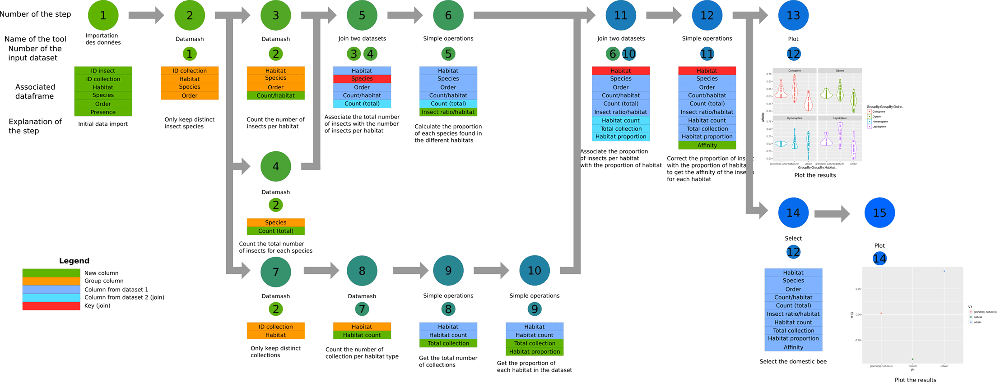
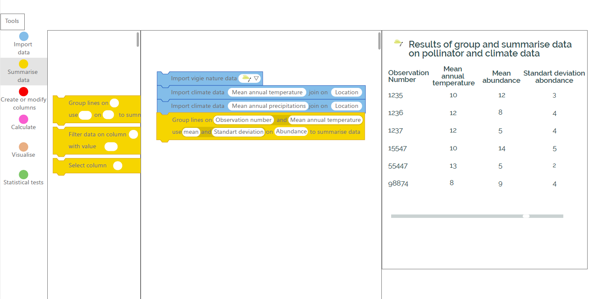
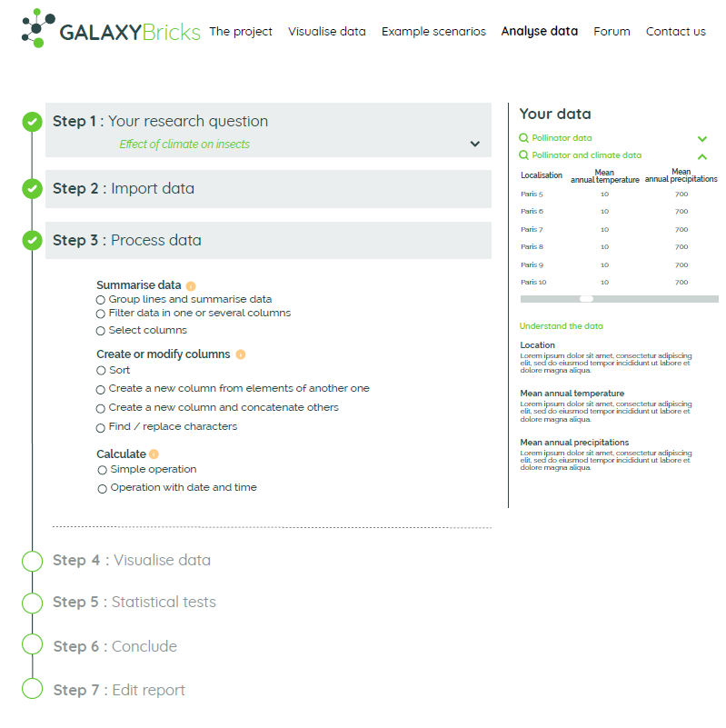
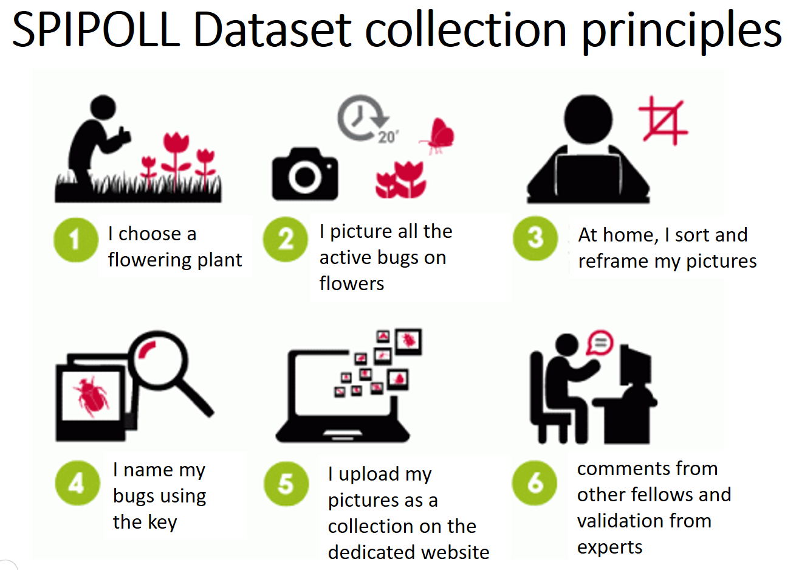
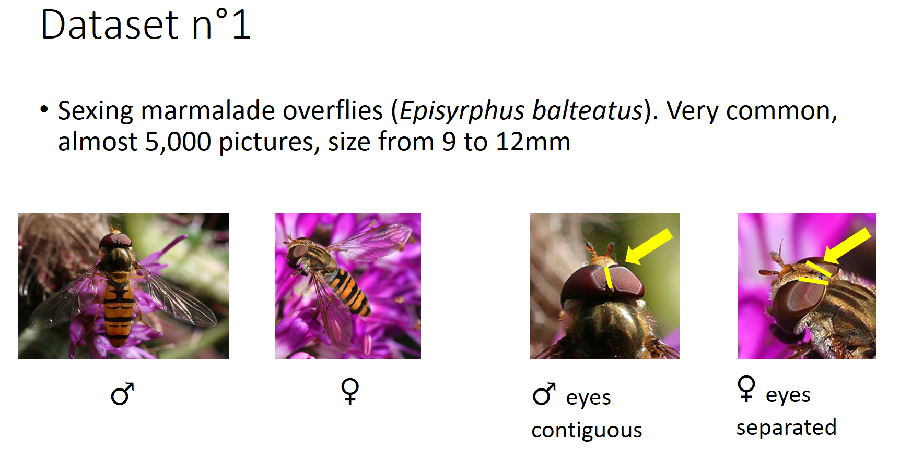
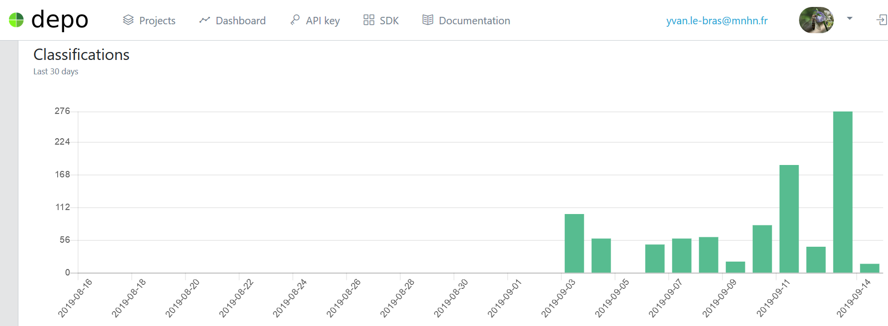

One year after the *[Galaxy contributor of the Month!](https://galaxyproject.org/blog/2018-10-cotm-yvan-le-bras/)* (originally I was supposed to post this blog post in october 2019... but starting 2020 appears to be better no ? ;) ) it's a pleasure for me to come back with some crispy news about the Galaxy for Ecology project!

## Official launch of the European Galaxy-E instance

### GCC2019, a particular GCC for Ecology!

GCC2019 in Freiburg was my 5th GCC and a very special one. If each GCC is a wonderful moment, this time was amazzziinnnng for ecology guys. Thanks to the new ["outside the genome community track"](https://gcc2019.sched.com/event/Lufc/session-13outside-the-genome-community-track), we have had dedicated sessions to exchange with colleagues from climate science and chemoinformatics notably and beautiful exposure of Ecology related works with an amazing [invited talk on data viz by citizen scientists to better speak about biodiversity conservation](https://gcc2019.sched.com/event/PSq5/invited-talk-data-visualisation-by-citizen-science-participants-the-case-of-birds-and-bats-monitoring-schemes-and-galaxy-e) and lightning talks on the [Galaxy-Bricks concept](https://gcc2019.sched.com/event/PSq8/galaxy-bricks-a-tool-for-data-literacy-and-scientific-approach-education-in-the-context-of-citizen-science) and presenting how [Galaxy-E can facilitate biodiversity indicators production from citizen science projects](https://gcc2019.sched.com/event/PSqB/citizen-science-project-in-ecology-with-the-galaxy-e-platform) . For that I really want to thank colleagues from french museum of natural history for the quality of the presentations as GCC2019 scientific committee for selecting these abstracts. Finally, this GCC was also the chosen moment to officially announce the launch of https://ecology.usegalaxy.eu/, the European Galaxy instance dedicated to ecological research!

### Result of a community effort, but also an Alan one!

For sure existence of this Galaxy-E instance is due to the work of so many people I can't cite all of them. This is a community effort, special "bricks" of "foundations" of this effort are the Incredible Freiburg Galaxy team, ouhaouhou, you rocks guys! And I have to address a big thank to a young talented engineer I have had the chance our tracks cross 3 years ago, Alan, who was the guy who build all 2019 Galaxy-E tools working hard to be sure to have a sufficient quality to be accepted by Björn ;)

### So what happen since GCC? Cripsy things ;)

Thanks to the [H2020 GAPARS project](http://gapars.mmos.ch/), we deploy 2 small scale experiments,

- Galaxy-Bricks, a data analysis tool based on Galaxy for ecology designed for non-professional scientists to develop data literacy, favor open data and collaboration in our communities.
- MOODA, to enable Massive Open Online Data Analysis using Galaxy to facilitate giving access to large communities of analyzers (professional and non-professional scientists) research datasets, tools and compute.

#### Galaxy-Bricks

The gamified interface and scenarios increase the interest of the participants and lift some of the common constraints linked with data literacy education such as complex tools, long formation of the teachers and stimulate the interest for the students and participant as they can directly interact and ‘play’ with the data. The ease of use allows teachers of fields where the use of computer is rare to rapidly adapt and to build bridges between fields. Data collection and input can be done during ecology class and data analysis during mathematics and the output of these analyses can be used again in ecology class.

Summary of validated activities:

We investigated different existing solutions in order to test a first version of our platform and reduce the time needed for the development. We compared Scratch, BioBlocks, WAVE, Galaksio and NGPhylogeny.
Scratch is a programming language already used to learn how to code in high schools. Users assemble graphical blocks of code together and form programs such as interactive stories, games or animations. This makes it a good candidate to adapt galaxy-E. As the concept of block of code is already present and the interface is already known by teachers and students. We were able to create an extension and we are now in the development phase to link the API of galaxy and scratch.

Scratch3 based wireframe:

Others tested solutions were developed for research purpose and already included a link with galaxy and a simplified interface that we can modify toward our GGUI project. The solutions we tested are WAVES, Galaksio and NGPhylogeny.fr. We chose NGPhylogeny.fr and started a collaboration with the development team in the ‘Institut Pasteur’ and deployed our own NGPhylogeny.fr instance.

NGPhylogeny.fr based wireframe:

We propose a simplified activity using our citizen science program [SPIPoll](https://www.spipoll.org/) (Photographic monitoring of pollinators). In this example, we will import biodiversity data and then climatic data linked to the location of our initial data. We will perform a small data treatment (calculate mean and standard deviation), plot the data and use linear regression to test the relation between two variables.

Focus on the citizen science SPIPOLL project for a first operationalization:

#### Massive Open Online Data Analysis using Galaxy

Currently, MMOS API is used in 2 main different manners to serve scientific data and analytic tools to different communities: (i) using Games as a front-end to access gamers and (ii) using MOOCS to access learners. Here we want to investigate the use of Galaxy as a massively multi-user online scientific platform. To give access to a multitude of scientific data, tools and workflows, the aim was to create connections between the MMOS system and the Galaxy Platform.
In this small-scale experiment, connections have been established between usegalaxy.eu instance with MMOS. After having try several possibilities, we found the Galaxy webhooks functionality (https://docs.galaxyproject.org/en/master/admin/webhooks.html) relevant to create such a connection.

SPIPOLL datasets and first MMOS task:

Thanks to the major contributions of Galaxy community and particularly Rémi Planel ([GitHub rplanel](https://github.com/rplanel/)) and Héléna Rasche ([GitHub hexylena](https://github.com/hexylena/)) at GCC2019 CoFest, we now have a first galaxy.eu working implementation.
You want to classify hoverflies pictures ? Let's go to use usegalaxy.eu!

Classifications results for the first week on MMOS developer portal:

"This project has received funding from the European Union’s Horizon 2020 research and innovation programme under grant agreement Nr 732703”

#### References

- Galaxy-E tools and workflows: https://github.com/galaxyecology/tools-ecology
- Galaxy-E tutorials:
    - Code https://github.com/galaxyproject/training-material/tree/master/topics/ecology
    - Website https://galaxyproject.github.io/training-material/topics/ecology/
- European Galaxy instance for Ecology: https://ecology.usegalaxy.eu/
- Galaxy-Bricks: Data literacy teaching activities
    - Wireframes
        - NGPhylogeny version https://xd.adobe.com/view/67f3b137-4f58-4349-5c51-de2cef02ca4d-11c2/grid
        - Scratch3 version https://xd.adobe.com/view/a762f0fb-00b9-490d-57e4-18e73ab60251-d153/
    - Code
        - Scratch3 WIP https://github.com/yvanlebras/Scratch3Galaxy
        - NGPhylogeny planned for September 2020
- Massive Open Online Data Analysis: MNHN SPIPOLL citizen science project Galaxy webhook
    - Developmental initial repository https://github.com/yvanlebras/GAPARS_Galaxy
    - Up-to-date dev repository https://github.com/galaxyecology/webhook_SPIPOLL_Flash/
    - Production repository https://github.com/usegalaxy-eu/infrastructure-playbook
    - Standalone webapp https://usegalaxy.eu/gapars-experiment/
