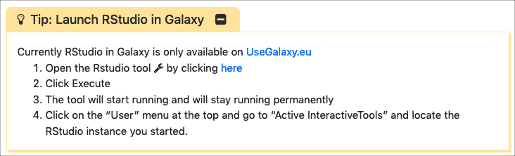
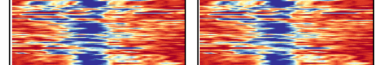
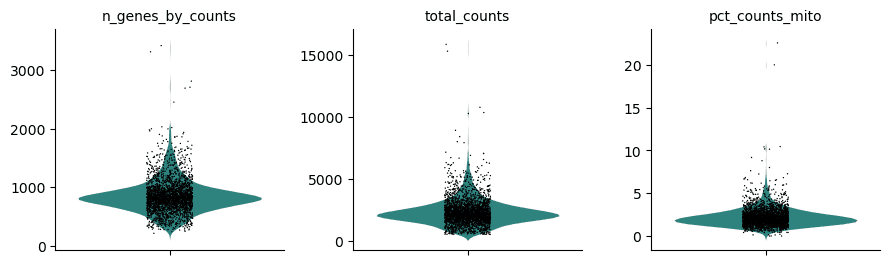

The *January 2020 Galactic News* is out:

* **[13 Upcoming Events](/news/2020-01-galaxy-update/#events)**
    * BCC2020 training topic nominations, Register for Galaxy Admin Training, Galaxy @ PAG & ABRF, and training @ Earlham and Rennes.
* **[172 new publications](/news/2020-01-galaxy-update/#publications)**
    * Six highlighted pubs from RT-qPCR to functional genomics
* **[Two new blog posts](#galactic-blog-activity)**
    * PGP-UK and Crowdsourcing Science
* **[Galaxy Platform News](/news/2020-01-galaxy-update/#galaxy-platforms-news)**
    * Three new platforms, UseGalaxy.* news, and platforms in pubs
* **[Training material and doc updates](/news/2020-01-galaxy-update/#doc-hub-and-training-updates)**
    * R, RStudio, ATAC-Seq, Scanpy, and Single Cell RNA-Seq
* And **[other news too](/news/2020-01-galaxy-update/#other-news)**

If you have anything to include to next month's newsletter, then please send it to outreach@galaxyproject.org.

# Events

There is an unusually rich (and aromatic!) mix of [upcoming Galaxy related events](/events/):

BCC2020: Call for Tutorial Nominations

The **[Bioinformatics Community Conference (BCC2020)](https://bcc2020.github.io/)** needs

* **[Nominate Training Topics](https://bcc2020.github.io/blog/training-nom) by January 17**

BCC is [GCC](/gcc/) + [BOSC](https://www.open-bio.org/events/bosc/about/#Past_BOSCs), and will be held in July in Toronto, right after [ISMB 2020](https://www.iscb.org/ismb2020) in Montréal.

Register Now: Galaxy Admin Training 2020

Registration is now open for the **[2020 Galaxy Admin Training](/events/2020-03-admin/) being offered 2-6 March at the [Barcelona Supercomputing Center](https://www.bsc.es/).**  This week-long hands-on training will feature what you need to know to set up your own production quality Galaxy server. **Space is limited.**

Galaxy @ PAG 2020

[Galaxy will be at Plant and Animal Genome XXVII (PAG 2020)](/events/2020-pag/), in San Diego, California, United States, January 11-15. This includes a *hands-on Galaxy Workshop* (highlighting the new [Excellence in Breeding platform](/use/cropgalaxy/)) and many talks and posters featuring Galaxy.

And there will be a [GMOD Codefest](http://gmod.org/wiki/Codefest_2020) *before* PAG and an [NCBI Codeathon](https://ncbi-codeathons.github.io/) *after* PAG.

Galaxy @ ABRF 2020

[Galaxy will be at 2020 ABRF meeting](/events/2020-abrf/), in Palm Springs, California, United States, February 29 through March 3. This includes a full day *hands-on Galaxy Workshop* about **using Galaxy with your single cell and microbiome** data.  ABRF is *the annual conference for technology-enabled multidisciplinary research.*

[Early registration ends January 15](https://conf.abrf.org/program/registration-schedule/). **Space is limited**.

Single-Cell RNAseq training at Earlham Institute

An [introduction to Single-Cell Genomics](https://www.earlham.ac.uk/single-cell-rnaseq-2020) featuring Galaxy. This course is for bench-based researchers planning a single-cell project.  **Registration deadline is 2 March.**

Traitement de données de séquences par Galaxy

[Introduction à la manipulation de données de régions génomiques](https://www.omic-rennes.com/modules/galaxy/)  et à l’analyse de jeux de données de type NGS via Galaxy.

Upcoming Events

There are

* [13 upcoming events](/events/)
* on 3 continents, plus online
* in US, Japan, Belgium, Germany, Spain, France, UK, and Canada.

# Publications

**172 new publications** referencing, using, extending, and implementing Galaxy were added to the [Galaxy Publication Library](https://www.zotero.org/groups/galaxy) in the last month.  There were 9 *[Galactic](https://www.zotero.org/groups/1732893/galaxy/tags/%2BGalactic)* and *[Stellar](https://www.zotero.org/groups/1732893/galaxy/tags/%2BStellar)* publications added, and 7 of them are open access. Some highlights:

[PIPE-T: a new Galaxy tool for the analysis of RT-qPCR expression data](https://doi.org/10.1038/s41598-019-53155-9)

Zanardi, N., Morini, M., Tangaro, M. A., Zambelli, F., Bosco, M. C., Varesio, L., … Cangelosi, D. (2019). *Scientific Reports*, 9(1), 1–12. doi: 10.1038/s41598-019-53155-9

[Accessible and reproducible mass spectrometry imaging data analysis in Galaxy](https://doi.org/10.1093/gigascience/giz143)

Föll, M. C., Moritz, L., Wollmann, T., Stillger, M. N., Vockert, N., Werner, M., … Schilling, O. (2019). *GigaScience*, 8(12). doi: 10.1093/gigascience/giz143

[Interoperable and scalable data analysis with microservices: applications in metabolomics](https://doi.org/10.1093/bioinformatics/btz160)

Emami Khoonsari, P., Moreno, P., Bergmann, S., Burman, J., Capuccini, M., Carone, M., … Spjuth, O. (2019). *Bioinformatics*, 35(19), 3752–3760. doi: 10.1093/bioinformatics/btz160

[Genome-wide analysis of the H3K27me3 epigenome and transcriptome in *Brassica rapa*](https://academic.oup.com/gigascience/article/8/12/giz147/5652252)

Payá-Milans, M., Poza-Viejo, L., Martín-Uriz, P. S., Lara-Astiaso, D., Wilkinson, M. D., & Crevillén, P. (2019). *GigaScience*, 8(12). doi: 10.1093/gigascience/giz147

[Galaxy-based training resource for single-cell RNA-sequencing quality control and analyses](https://doi.org/10.3390/microorganisms7110553)

Etherington, G. J., Soranzo, N., Mohammed, S., Haerty, W., Davey, R. P., & Palma, F. D. (2019). A *GigaScience*, 8(12). doi: 10.1093/gigascience/giz144

[A comprehensive resource for retrieving, visualizing, and integrating functional genomics data](https://doi.org/10.26508/lsa.201900546)

Blum, M., Cholley, P.-E., Malysheva, V., Nicaise, S., Moehlin, J., Gronemeyer, H., & Mendoza-Parra, M. A. (2020). *Life Science Alliance*, 3(1). doi: 10.26508/lsa.201900546

Publication Topics

Publications are tagged with how they use, extend or reference Galaxy.  The past month's pubs were tagged as:

<a class="btn"  style="text-align: right; background-color: #66c566;" href="https://www.zotero.org/groups/1732893/galaxy/tags/+Methods"> 113 : <strong>+Methods</strong></a>
 <a class="btn"  style="text-align: right; background-color: #81cf81;" href="https://www.zotero.org/groups/1732893/galaxy/tags/+UsePublic"> 48 : <strong>+UsePublic</strong></a>
 <a class="btn"  style="text-align: right; background-color: #98d898;" href="https://www.zotero.org/groups/1732893/galaxy/tags/+RefPublic"> 23 : <strong>+RefPublic</strong></a>
 <a class="btn"  style="text-align: right; background-color: #9eda9e;" href="https://www.zotero.org/groups/1732893/galaxy/tags/+Workbench"> 19 : <strong>+Workbench</strong></a>
 <a class="btn"  style="text-align: right; background-color: #a1dca1;" href="https://www.zotero.org/groups/1732893/galaxy/tags/+UseMain"> 17 : <strong>+UseMain</strong></a>
 <a class="btn"  style="text-align: right; background-color: #a5dda5;" href="https://www.zotero.org/groups/1732893/galaxy/tags/+UseLocal"> 15 : <strong>+UseLocal</strong></a>
 <a class="btn"  style="text-align: right; background-color: #b4e3b4;" href="https://www.zotero.org/groups/1732893/galaxy/tags/+IsGalaxy"> 9 : <strong>+IsGalaxy</strong></a>
 <a class="btn"  style="text-align: right; background-color: #bce6bc;" href="https://www.zotero.org/groups/1732893/galaxy/tags/+Reproducibility"> 7 : <strong>+Reproducibility</strong></a>
 <a class="btn"  style="text-align: right; background-color: #c0e7c0;" href="https://www.zotero.org/groups/1732893/galaxy/tags/+Tools"> 6 : <strong>+Tools</strong></a>
 <a class="btn"  style="text-align: right; background-color: #d2eed2;" href="https://www.zotero.org/groups/1732893/galaxy/tags/+Education"> 3 : <strong>+Education</strong></a>
 <a class="btn"  style="text-align: right; background-color: #dbf2db;" href="https://www.zotero.org/groups/1732893/galaxy/tags/+Cloud"> 2 : <strong>+Cloud</strong></a>
 <a class="btn"  style="text-align: right; background-color: #dbf2db;" href="https://www.zotero.org/groups/1732893/galaxy/tags/+Shared"> 2 : <strong>+Shared</strong></a>
 <a class="btn"  style="text-align: right; background-color: #e9f7e9;" href="https://www.zotero.org/groups/1732893/galaxy/tags/+Other"> 1 : <strong>+Other</strong></a>
 <a class="btn"  style="text-align: right; background-color: #e9f7e9;" href="https://www.zotero.org/groups/1732893/galaxy/tags/+Visualization"> 1 : <strong>+Visualization</strong></a>

# Galactic Blog Activity

[Reaching for the stars: PGP-UK multi-omics data now also available on Galaxy Europe](https://pgpukblog.wordpress.com/2019/12/18/reaching-for-the-stars-pgp-uk-multi-omics-data-now-also-available-on-galaxy-europe/)

By Stephan Beck.

Includes [genetic, methylome, and transcriptome data](https://usegalaxy.eu/library/list#/folders/F43c642051145b1b6).

[Crowdsourcing citizen science data on usegalaxy.eu](/news/2020-01-galaxy-ecology-citizen-science/)

By Yvan Le Bras, Simon Bénateau.

Galaxy for Ecology, mixing Ecology research, Citizen Science and Massively Multi Online Science.

# Galaxy Platforms News

The [Galaxy Platform Directory](/use/) lists resources for easily running your analysis on Galaxy, including publicly available servers, cloud services, and containers and VMs that run Galaxy. There are many new platforms this month:

[GASLINI Server](/use/gaslini/)

The [GASLINI server](http://igg.cloud.ba.infn.it/galaxy) supports PIPE-T, a tool for reverse transcription quantitative real-time polymerase chain reaction (RT-qPCR) analysis. Requires an account, but anyone can create an account.

[Shapiro Lab VM](/use/shapiro-lab/)

The [Shapiro Lab at NCI](https://binkley2.ncifcrf.gov/users/bshapiro/) provides RNA structure and design tools, including RNA2D3D and StructureLab, on a [Galaxy virtual machine image](https://binkley2.ncifcrf.gov/users/bshapiro/software.html).

[Epigenomics Docker](/use/epigenomics/)

This [Galaxy docker instance](https://hub.docker.com/r/mpaya/epigenomics_galaxy) contains tools and workflows aimed at the analysis of epigenomics data, both ChIP-Seq and RNA-Seq.

[UseGalaxy.*](/usegalaxy/) News

* UseGalaxy.org.Au is expanding its range of tools to better support different communities [including 19 metabolomics analysis tools & 2 workflows](https://twitter.com/GalaxyAustralia/status/1207453015814238208/photo/1) and 20 new tools for trimming, analysing, QC and assembling Oxford Nanopore data
* [Galaxy Australia upgraded to Galaxy version 19.09](https://usegalaxy-au.github.io/posts/2019/12/11/galaxy-australia-to-galaxy-version-19-09/plain.html)

Galaxy Platforms in Publications

Platforms that were referenced *at least twice* in the past month's publications:

<a class="btn"  style="text-align: right; background-color: #95d795;" href="https://www.zotero.org/groups/1732893/galaxy/tags/>Huttenhower"> 25 : <strong>Huttenhower</strong></a>
 <a class="btn"  style="text-align: right; background-color: #b8e4b8;" href="https://www.zotero.org/groups/1732893/galaxy/tags/>Workflow4Metabolomics"> 8 : <strong>Workflow4Metabolomics</strong></a>
 <a class="btn"  style="text-align: right; background-color: #c5e9c5;" href="https://www.zotero.org/groups/1732893/galaxy/tags/>UseGalaxy.eu"> 5 : <strong>UseGalaxy.eu</strong></a>
 <a class="btn"  style="text-align: right; background-color: #cbebcb;" href="https://www.zotero.org/groups/1732893/galaxy/tags/>CPT"> 4 : <strong>CPT</strong></a>
 <a class="btn"  style="text-align: right; background-color: #cbebcb;" href="https://www.zotero.org/groups/1732893/galaxy/tags/>Galaxy-P"> 4 : <strong>Galaxy-P</strong></a>
 <a class="btn"  style="text-align: right; background-color: #cbebcb;" href="https://www.zotero.org/groups/1732893/galaxy/tags/>RepeatExplorer"> 4 : <strong>RepeatExplorer</strong></a>
 <a class="btn"  style="text-align: right; background-color: #d2eed2;" href="https://www.zotero.org/groups/1732893/galaxy/tags/>ARGs-OAP"> 3 : <strong>ARGs-OAP</strong></a>
 <a class="btn"  style="text-align: right; background-color: #dbf2db;" href="https://www.zotero.org/groups/1732893/galaxy/tags/>Genomic Hyperbrowser"> 2 : <strong>Genomic Hyperbrowser</strong></a>
 <a class="btn"  style="text-align: right; background-color: #dbf2db;" href="https://www.zotero.org/groups/1732893/galaxy/tags/>GVL-Unspecified"> 2 : <strong>GVL-Unspecified</strong></a>
 <a class="btn"  style="text-align: right; background-color: #dbf2db;" href="https://www.zotero.org/groups/1732893/galaxy/tags/>HiCExplorer"> 2 : <strong>HiCExplorer</strong></a>
 <a class="btn"  style="text-align: right; background-color: #dbf2db;" href="https://www.zotero.org/groups/1732893/galaxy/tags/>Pasteur"> 2 : <strong>Pasteur</strong></a>
 <a class="btn"  style="text-align: right; background-color: #dbf2db;" href="https://www.zotero.org/groups/1732893/galaxy/tags/>PhenoMeNal"> 2 : <strong>PhenoMeNal</strong></a>
 <a class="btn"  style="text-align: right; background-color: #dbf2db;" href="https://www.zotero.org/groups/1732893/galaxy/tags/>UseGalaxy.org.au"> 2 : <strong>UseGalaxy.org.au</strong></a>

# Doc, Hub, and Training Updates

[Do you use Galaxy for training?](https://forms.gle/Uc8Qs23TsVcAYfCD8)

**Then the Galaxy Training Network [wants your feedback](https://forms.gle/Uc8Qs23TsVcAYfCD8).**  Please take a few minutes to let us know about your training experiences.

[R basics in Galaxy](https://training.galaxyproject.org/training-material/topics/introduction/tutorials/r-basics/tutorial.html)

By [Bérénice Batut](https://training.galaxyproject.org/training-material/hall-of-fame#bebatut), [Fotis E. Psomopoulos](https://training.galaxyproject.org/training-material/hall-of-fame#fpsom), [Toby Hodges](https://training.galaxyproject.org/training-material/hall-of-fame#tobyhodges).

We believe that every learner can **achieve competency with R.**  Give it a try.

[RStudio in Galaxy](https://training.galaxyproject.org/topics/galaxy-ui/tutorials/rstudio/tutorial.html)

By [Bérénice Batut](https://training.galaxyproject.org/training-material/hall-of-fame#bebatut), [Fotis E. Psomopoulos](https://training.galaxyproject.org/training-material/hall-of-fame#fpsom), [Toby Hodges](https://training.galaxyproject.org/training-material/hall-of-fame#tobyhodges).

This tutorial adapt [the Carpentries](https://carpentries.org/) “[Intro to R and RStudio for Genomics](https://datacarpentry.org/genomics-r-intro/)” lesson to the Galaxy platform.

[ATAC-Seq data analysis tutorial update](https://training.galaxyproject.org/training-material/topics/epigenetics/tutorials/atac-seq/tutorial.html)

[Lucille Delisle](https://training.galaxyproject.org/training-material/hall-of-fame#lldelisle) has updated the [ATAC-Seq data analysis tutorial](https://training.galaxyproject.org/training-material/topics/epigenetics/tutorials/atac-seq/tutorial.html) to add `macs2 callpeak` as an alternative to `Genrich` and addressed issues with `bowtie` indexes.

[Clustering 3K PBMCs with Scanpy](https://training.galaxyproject.org/training-material/topics/transcriptomics/tutorials/scrna-scanpy-pbmc3k/tutorial.html)

By [Bérénice Batut](https://training.galaxyproject.org/training-material/hall-of-fame#bebatut).

Clustering single-cell data from 10x Genomics, including preprocessing, clustering and the identification of cell types via known marker genes, using [Scanpy](https://scanpy.readthedocs.io/en/stable/index.html) ([Wolf et al. 2018](https://training.galaxyproject.org/training-material/topics/transcriptomics/tutorials/scrna-scanpy-pbmc3k/tutorial.html#wolf2018scanpy)).

[Single Cell RNA-seq Analysis using Galaxy](https://www.youtube.com/watch?v=1w4sA-qyO3g)

By [Wendi Bacon](https://www.ebi.ac.uk/about/people/wendi-bacon), EMBL-EBI.

This webinar video highlights Galaxy interface for single cell analysis. Specifically it highlights Scanpy (which would otherwise require Python programming skills) to analyse a Drop-seq dataset located in EMBL-EBI's Single Cell Expression Atlas.

# Other News

[Auf das richtige Werkzeug kommt es an](https://www.laborjournal.de/epaper/LJ_19_12.pdf#page50)

Including a report about usegalaxy.eu and this year's community conference in Freiburg.

[NCI ITCR Informatics Tools](https://itcr.cancer.gov/informatics-tools)

Galaxy is a prominent part of the NCI ITCR Program that funds tools that support the analysis of –omics, imaging, and clinical data, as well as network biology and data standards.  

[Investing in a shared resource for scientific software sustainability in computational chemistry](https://www.paperturn-view.com/uctresearchoffice/uct-eresearch-report-2018-2019?pid=NjY66984&p=33&v=1.1)

Dr Chris Barnett has invested in the research cloud-computing platform ilifu to create a central resource where a like-minded research community can come together and share these tools and expertise, using the opensource platform Galaxy.

