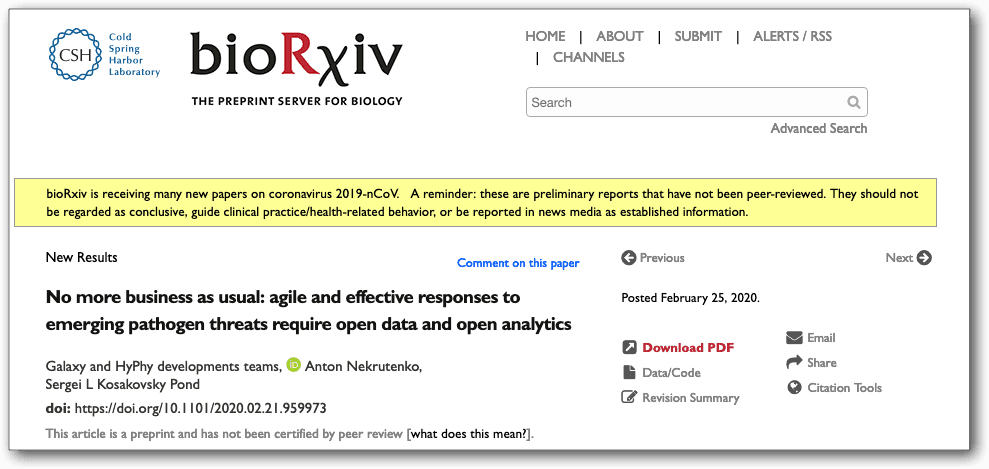

The UseGalaxy Community has published a paper in *bioRxiv*

The [paper](https://doi.org/10.1101/2020.02.21.959973) opens with

<blockquote class="blockquote">
The current state of much of the Wuhan pneumonia virus (COVID-19) research shows a regrettable lack of data sharing and considerable analytical obfuscation. This impedes global research cooperation, which is essential for tackling public health emergencies, and requires unimpeded access to data, analysis tools, and computational infrastructure. Here we show that community efforts in developing open analytical software tools over the past ten years, combined with national investments into scientific computational infrastructure, can overcome these deficiencies and provide an accessible platform for tackling global health emergencies in an open and transparent manner.
</blockquote>

and closes with

<blockquote class="blockquote">
In an age of digital connectedness, open, highly accessible, globally shared data and analysis platforms have the potential to transform the way biomedical research is done, opening the way to ‘global research markets’, *where competition arises from deriving understanding rather than access to samples and data.* [emphasis added] ...
</blockquote>

For more information, see

* **[Initial analysis of COVID-19 data using Galaxy, BioConda and public research infrastructure (XSEDE, de.NBI-cloud, ARDC cloud)](https://github.com/galaxyproject/SARS-CoV-2)**, a GitHub repository describing the analyses used in this paper, with links to Galaxy workflows and histories, and to the Bioconda repos that were used.
* **[Open collaborative infrastructure to tackle public health emergencies](https://elixir-europe.org/news/COVID-19-data-open-analysis)**, news item from ELIXIR Europe on this research
* **[Galaxy Australia contributes to global research effort into COVID-19](https://www.biocommons.org.au/galaxy-covid-19)**, news item from the Australian BioCommons
* **[Coronavirus Data Analysis](https://www.pr.uni-freiburg.de/pm-en/press-releases-2020/coronavirus-data-analysis)**, news item from the University of Freiburg.

We believe this paper makes a powerful and transformative argument for reshaping the way biomedical research is done.

Thank you, 
The UseGalxy.* Community
