---

# From the editor

This is our first newsletter since January. It has been an eventful and sorrowful four months for the world, and for the Galaxy Community too: *This newsletter starts with the [tragic loss of James Taylor](#james-peter-taylor-1979-2020), one of Galaxy's founders and leaders.*  We lost James at the beginning of April. This community, I suspect, will always feel that loss.

This newsletter also covers [how Galaxy is addressing the international COVID-19 crises](#galaxy-covid-19-response), and [how the pandemic pushed BCC2020 organizers to shift from an in-person event in Toronto, to a truly global, affordable, and accessible conference, where any researcher in the world can now participate](#bcc2020-will-be-online-global-affordable-and-accessible).  Even in the darkest of times, there is some sunlight.

The mix of news this month reflects our times.  Our support of each other, no matter what, reflects the strength of this community.

Thanks for everything, and please continue to support each other, 
Dave Clements, on behalf of the Galaxy Community

---

# In the May 2020 issue

* **[James Peter Taylor](#james-peter-taylor-1979-2020)**, 1979-2020
* **[BCC2020](#bcc2020-will-be-online-global-affordable-and-accessible) will be online, global, affordable, and accessible**
    * **All abstracts are due May 8**
* **[Galaxy COVID-19 Response](#galaxy-covid-19-response)**
* [Upcoming events](#upcoming-events)
* [Blog posts](#galactic-blog-activity)
* [Galaxy Platform News](#galaxy-platforms-news)
* [Training material and doc updates](/news/2020-05-galaxy-update/#doc-hub-and-training-updates)
* [Who's Hiring](#whos-hiring)
* [New Releases](#releases)
* [New publications](/news/2020-05-galaxy-update/#publications) (671 of them)
* And [other cool news too](#other-news)

If you have anything to include to next month's newsletter, then please send it to outreach@galaxyproject.org.

---

# James Peter Taylor, 1979-2020

James Taylor, one of the founders and leaders of the Galaxy Project died of natural causes on April 2.  One day he was online tweeting about open access to data, and the next day he was not.  News of his passing spread around the world, and the response has been overwhelming.

These responses, plus a summary of his academic life, and extended remembrances from several colleagues have been compiled on the [@jxtx page](/jxtx/).  If you want to add your thoughts, please [submit them here](https://docs.google.com/forms/d/e/1FAIpQLSd4iKUV7r91OxRFq6DbkVpSb4ftTP4eQqhvcSl-TD-PUdvFPw/viewform) and we will post them.

We are also [starting a foundation to continue and commemorate James' work](/jxtx/#JTech-Junior-Training-and-Educational-Connections-Hotspot) by supporting grad students, junior faculty, and underrepresented groups.  Please consider contributing.

Galaxy will go on and we will continue to support his legacy of open reproducible science.

We miss you James.

---

# BCC2020 will be Online, Global, Affordable, and Accessible

[BOSC + GCC = BCC2020](https://bcc2020.github.io/)

The [2020 Bioinformatics Community Conference (BCC2020)](https://bcc2020.github.io/) brings together the [Bioinformatics Open Source Conference (BOSC)](https://www.open-bio.org/events/bosc/) and [Galaxy Community Conference](/gcc/).  If you are working in data intensive life science research then there is no better event for sharing your work, and learning from other researchers addressing the challenges of modern data driven biology.  [BCC2020 will be held July 17-26](https://bcc2020.sched.com/), and offer 2 days of training, a 3 day meeting, and a 4 day CollaborationFest.

[BCC2020 is Online](https://bcc2020.github.io/blog/going-virtual)

All BCC2020 events [will be held online](https://bcc2020.github.io/blog/going-virtual).  Training will be live and interactive.  The meeting will feature keynotes, accepted talks, lightning talks, posters, demos, and birds-of-a-feather and other networking opportunities.  Talks (with the possible exception of keynotes) will be pre-recorded.  Posters, demos, and BoFs will be live and interactive.  The CoFest will also be live and interactive.

[BCC2020 is Global](https://bcc2020.github.io/blog/going-global)

[BCC2020 events will be held twice](https://bcc2020.github.io/blog/going-global): once in the [originally scheduled Toronto time zone (BCC West/Americas)](https://bcc2020.sched.com/overview/area/West%3A+Americas), and then [again 12 hours later in the Eastern hemisphere (BCC East/Asia-Australia)](https://bcc2020.sched.com/overview/area/East%3A+Asia+%26+Australia).  Training will differ between East and West, with enrollment open to all, regardless of where you are. The main conference content will be presented in both East and West.  We are striving to have the CoFest run continuously, with participants from every part of the world.

[BCC2020 is Affordable](https://bcc2020.github.io/Registration/)

We have slashed [registration rates for BCC2020](https://bcc2020.github.io/Registration/), and are offering even larger discounts to participants based in low and lower-middle income countries.  Pricing starts at US$3 per training session, and $12 for the 3 day meeting.  The CoFest is free.

BCC2020 is Accessible

Going online and global, combined with the low registration rates this enables, **makes this the most accessible Galaxy or BOSC conference ever.**  If you work in open source bioinformatics, *anywhere in the world*, then this is 2020’s best opportunity to share your work and learn from others.

[Keynotes Announced](https://bcc2020.github.io/blog/keynotes/)

We are pleased to announce that **Abigail Cabunoc Mayes** of the Mozilla Foundation, and **Lincoln Stein** of OICR will be keynote speakers at BCC2020.

[Abstracts due May 8](https://bcc2020.github.io/submit/)

BCC2020 is seeking oral presentations, lightning talks, posters, and demos, from researchers working in bioinformatics, and all over the world.  Abstracts are due May 8 (and that deadline will not be extended). Please [submit your work](https://bcc2020.github.io/submit/) today.

[Save 50% with Early Registration Now](https://bcc2020.github.io/Registration/)

BCC2020 registration is [now open](https://bcc2020.github.io/Registration/).  Registering early saves 50% off of the full rates and starts $3 per training session and $12 for the three day meeting.

 

# Galaxy COVID-19 Response

A wide variety of Galaxy community member organizations are contributing and collaborating to help address the coronavirus pandemic.

## UseGalaxy.* COVID-19 Efforts

[Several prominent efforts](https://covid19.galaxyproject.org/) use entirely open source tools using open access data, on public cyberinfrastructure.  Galaxy workflows and histories are provided by all analyses (in both Galaxy and Zenodo), making this work easily accessible and reusable by all.  The work produced by this consortium is documented and runnable in the UseGalaxy.* servers, and available in Zenodo as well.

These efforts focus on three areas:

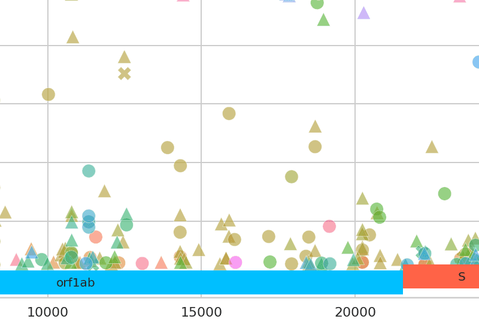

[Genomics](https://covid19.galaxyproject.org/genomics/)

There are 397 sites showing intra-host variation across 33 samples (with frequencies between 5% and 95%). Twenty nine samples have fixed differences at 39 sites from the published reference. Variant lists and VCF files are updated daily.

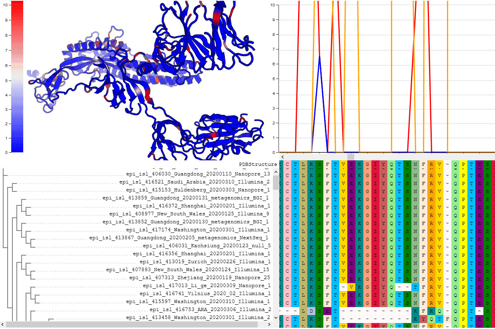

[Evolution](https://covid19.galaxyproject.org/evolution/)

We are using comparative evolutionary techniques to run daily analyses identify potential candidates using genomes from GISAID. At present, ~5 genomic positions may merit further investigation because they may be subject to diversifying positive selection. See live results presented as continuously updated notebooks. 

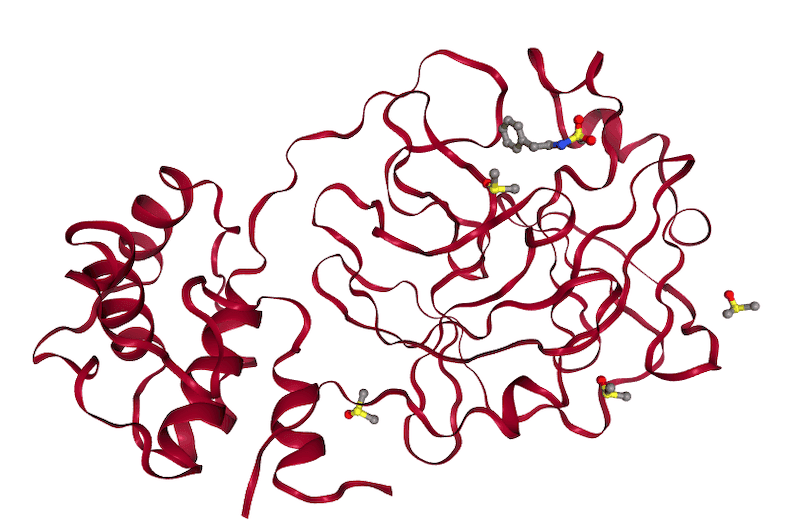

[Cheminformatics](https://covid19.galaxyproject.org/cheminformatics/)

Computational analyses using protein-ligand docking to identify potentially inhibitory compounds that can bind to MPro and can be used to control viral proliferation. This work analyzed over 40,000 compounds considered to be likely to bind, which were chosen based on recently published X-ray crystal structures, and identified 500 high scoring compounds.

## Additional Efforts

**And there are many additional efforts and posts about COVID-19 research using Galaxy:**

[COVID-19 Analysis Performed With Galaxy Bioinformatics Platform](https://www.tacc.utexas.edu/-/covid-19-analysis-performed-with-galaxy-bioinformatics-platform)

The [Texas Advanced Computing Center (TACC)](https://www.tacc.utexas.edu/) provides large-scale compute infrastructure for the analysis of thousands of genomes, [including Galaxy's work on SARS-CoV-2](https://www.tacc.utexas.edu/-/covid-19-analysis-performed-with-galaxy-bioinformatics-platform).

[MRC CLIMB supports COG-UK efforts](https://www.climb.ac.uk/climb-provides-computing-resources-and-storage-capacity-to-the-cog-uk/)

The MRC CLIMB project has been [providing compute and storage for the COVID-19 Genomics UK Consortium (COG-UK)](https://www.climb.ac.uk/climb-provides-computing-resources-and-storage-capacity-to-the-cog-uk/).  (See below for more CLIMB news.)

[Virtual screening of the SARS-CoV-2 main protease with rDock and pose scoring](https://training.galaxyproject.org/training-material/topics/computational-chemistry/tutorials/covid19-docking/tutorial.html)

This new Galaxy Training Network tutorial from [Simon Bray](https://training.galaxyproject.org/training-material/hall-of-fame#simonbray) is a companion tutorial for the cheminformatics work described above that performs virtual screening on candidate ligands for the SARS-CoV-2 main protease (MPro).

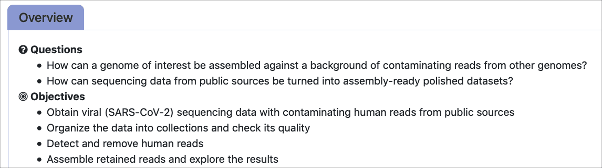

[Unicycler assembly of SARS-CoV-2 genome with preprocessing to remove human genome reads](https://training.galaxyproject.org/training-material/topics/assembly/tutorials/assembly-with-preprocessing/tutorial.html)

This new Galaxy Training Network tutorial from [Wolfgang Maier](https://training.galaxyproject.org/training-material/hall-of-fame#wm75) guides you through the preprocessing of sequencing data of bronchoalveolar lavage fluid (BALF) samples obtained from early COVID-19 patients in China. Since such samples are expected to be contaminated signficantly with human sequenced reads, the goal is to enrich the data for SARS-CoV-2 reads by identifying and discarding reads of human origin before trying to assemble the viral genome sequence.

[Laniakea SARS-CoV-2 flavour available](https://laniakea-elixir-it.github.io/2020/03/27/covid19-docker-flavor.html)

A Galaxy Covid-19 flavour is now available in Laniakea, as a Docker Container. It is based on the GalaxyProject covid-19 analysis and it is continuously updated. Due to the current Covid-19 outbreak, the flavour is made available to Laniakea users without the usual test routine.

[Galaxy Australia on Nimbus Cloud](https://pawsey.org.au/covid19announcement/)

Galaxy Australia relies on distributed deployments using Pulsar to increase the range and number of jobs that can be run on the service. The team has been allocated resources on the Nimbus cloud to deploy a dedicated COVID-19 Pulsar as part of Galaxy Australia at the Pawsey Centre that allows Galaxy users to rapidly analyse their data on published tools/workflows to further research into SARS-CoV-2.

# Upcoming Events

The coronavirus outbreak has impacted BCC2020, and just about every other event for the rest of the year too.  Most events through the end of August have been postponed or moved online.  We have updated our [list of events](/events/) to reflect what we know.  Some highlights:

[Galaxy-ELIXIR webinar series](https://elixir-europe.org/events/webinar-galaxy-elixir-covid19)

**FAIR data and Open Infrastructures to tackle the COVID-19 pandemic**

This [webinar series](https://elixir-europe.org/events/webinar-galaxy-elixir-covid19) demonstrates how open access and open science are fundamental for fast and efficient response to public health crises. The focus will be on research reproducibility and transparency, using exclusively open source tools and the Galaxy platform.

The first session was held on 30 April.  Subsequent sessions are

* [Genomics/Variant Calling, 7 May](https://attendee.gotowebinar.com/register/6993001011673446160), Anton Nekrutenko and Wolfgang Maier
* [Cheminformatics: Screening of the main protease, 14 May](https://attendee.gotowebinar.com/register/4607898607259954448), TBA
* [Evolution of the Virus, 20 May](https://register.gotowebinar.com/register/3263865489071323920), Sergei Pond
* [Behind the scenes: Global Open Infrastructures at work, 28 May](https://attendee.gotowebinar.com/register/7607010086065649936), TBA

Galaxy on SGCI Webinars

Want to learn the Galaxy community and platform big picture?  Attend the next two [Scientific Gateways Community Institute webinars](https://sciencegateways.org/engage/webinars):

* [Galaxy Project: Enabling an active global research community](https://sciencegateways.org/engage/webinars#p_p_id_101_INSTANCE_b7INfhQBwyLp_), May 13, Dave Clements
* [Overview of the Galaxy Project platform](https://sciencegateways.org/engage/webinars#_101_INSTANCE_b7INfhQBwyLp_106196), June 10, Nate Coraor

Upcoming Events

There are

* [25 upcoming events](/events/) (most of them virtual)
* covering COVID-19 (5 events), single-cell, variant detection, assembly, RNA-Seq and more.

And material from some recent past events is now available:

* [Galaxy: much more than a workflow management system](https://drive.google.com/file/d/1j_AYy7Jn0WXL5BZxtVGVU1qMGVHxf954/preview): Video
* [Galaxy @ PAG 2020](/events/2020-pag/): Slides and posters
* [Development of BioCompute Objects for Integration into Galaxy in a Cloud Computing Environment](https://youtu.be/8pwss1SY8Tg): on video
* [Intro to Circos, its applications & use within Galaxy Australia](https://www.youtube.com/watch?v=j2R10doH5_4): on video
* [Galaxy-based Multi-omic Informatics Hub for Cancer Researchers](https://datascience.cancer.gov/news-events/events/galaxy-based-multi-omic-informatics-hub-cancer-researchers): on video

# Galactic Blog Activity

[Multi-omics Visualization Platform: An extensible Galaxy plug-in for multi-omics data visualization and exploration](https://galaxyproject.eu/posts/2020/04/23/mvp/)

By Björn Grüning.

A visualization plug-in that extends Galaxy-P’s advantages into the visualization of large, complex datasets.

[Galaxy Admin 2020 and beyond](https://www.open-bio.org/2020/04/14/galaxy-admin-2020/)

By Michael Thompson.

Michael Thompson of Kwame Nkrumah University of Science and Technology (K.N.U.S.T) describes his experience at the 2020 Galaxy Admin Training in Barcelona.

[Integrative meta-omics analysis ](https://galaxyproject.eu/posts/2020/04/14/integrative-meta-omics/)

By Magnus Ø. Arntzen.

Adaption of a repertoire of commonly used omics tools spanning metagenomics, -transcriptomics and -proteomics into the Galaxy framework, in order to generate a user-accessible, scalable and robust analytical pipeline for integrated meta-omics analysis.

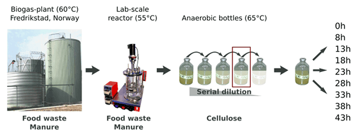

# Galaxy Platforms News

The [Galaxy Platform Directory](/use/) lists resources for easily running your analysis on Galaxy, including publicly available servers, cloud services, and containers and VMs that run Galaxy. There are many new platforms this month:

[CLIMB becomes CLIMB-BIG-DATA](https://quadram.ac.uk/funding-boost-for-cloud-computing-supporting-microbial-bioinformatics/)

The CLIMB project (Cloud Infrastructure for Microbial Bioinformatics) has been [renewed as the CLIMB-BIG-DATA project](https://www.climb.ac.uk/proud-to-announce-climb-big-data-project/). The initiative will benefit from a just-awarded £2Million grant from the UKRI, and will gradually become self-sustaining. This will ensure long-term provision of an always up-to-date cloud-based infrastructure for microbial bioinformatics.

[CoralSNP](/use/coral-snp/)

The [CoralSNP server](https://coralsnp.science.psu.edu/galaxy/) implements *Standard Tools for Acroporid Genotyping (STAG)*. In STAG the user’s data is compared to the database of previously genotyped samples and generates a report of genet identification. A login is required, but anyone can create a login.

Mississippi Server Upgraded

The [Mississippi server was upgraded](/news/2020-03-mississippi/), and [has a new URL](https://mississippi.sorbonne-universite.fr/).  Every tool installed on the previous server should be already installed on the new server.  The old server will be put into a read only state on June 1st, and then taken down on September 1st.

[Laniakea@ReCaS: resource allocation call](https://laniakea-elixir-it.github.io/laniakea_at_recas)

The [ELIXIR-ITALY Laniakea@ReCaS Call](https://drive.google.com/file/d/13xAslyusLwbAxyl3Yef58NgEYI5-BoKQ/view?usp=sharing) offers access to Cloud resources to be used for the deployment of on-demand Galaxy instances, ready for production, with reference data and tools already pre-configured and ready to be used.

[ProteoRE 2.1 Launched](/news/2020-02-proteore/)

[ProteoRE 2.1](http://www.proteore.org/) is a user-oriented Galaxy-based service for the functional interpretation and exploration of proteomics data for biomedical research; This version now comprises 20 tools organized in 4 sections (data manipulation and visualization; add features/annotation; functional analysis; pathways analysis). All data sources have been updated. Two tutorials are available via the [Galaxy Training Network](https://training.galaxyproject.org/training-material/topics/proteomics/).

[UseGalaxy.*](/usegalaxy/) News

* [Galaxy Australia processed its one millionth job in January](https://usegalaxy-au.github.io/posts/2020/01/29/one-millionth-job/).
* [Exciting progress in the ELIXIR Galaxy community](https://elixir-europe.org/news/galaxy-europe-2020)
* [ChiRA, an integrated framework for Chimeric Read Analysis from RNA-RNA interactome data, added to RNA Workbench](https://galaxyproject.eu/posts/2020/03/24/rna-interactome/)
URL
* [UseGalaxy.eu reaches 12,000 users, 6,900,000 jobs, and 13,300,000 datasets](https://usegalaxy-eu.github.io/posts/2020/02/12/sab2020-stats/plain.html)

Galaxy Platforms in Publications

Platforms that were referenced *at least three times* in recent publications:

<a class="btn"  style="text-align: right; background-color: #88d288;" href="https://www.zotero.org/groups/1732893/galaxy/tags/>Huttenhower"> 103 : <strong>Huttenhower</strong></a>
 <a class="btn"  style="text-align: right; background-color: #ace0ac;" href="https://www.zotero.org/groups/1732893/galaxy/tags/>RepeatExplorer"> 24 : <strong>RepeatExplorer</strong></a>
 <a class="btn"  style="text-align: right; background-color: #b1e2b1;" href="https://www.zotero.org/groups/1732893/galaxy/tags/>Workflow4Metabolomics"> 20 : <strong>Workflow4Metabolomics</strong></a>
 <a class="btn"  style="text-align: right; background-color: #b8e4b8;" href="https://www.zotero.org/groups/1732893/galaxy/tags/>UseGalaxy.eu"> 15 : <strong>UseGalaxy.eu</strong></a>
 <a class="btn"  style="text-align: right; background-color: #bae5ba;" href="https://www.zotero.org/groups/1732893/galaxy/tags/>ARGs-OAP"> 14 : <strong>ARGs-OAP</strong></a>
 <a class="btn"  style="text-align: right; background-color: #bfe7bf;" href="https://www.zotero.org/groups/1732893/galaxy/tags/>CPT"> 11 : <strong>CPT</strong></a>
 <a class="btn"  style="text-align: right; background-color: #c7eac7;" href="https://www.zotero.org/groups/1732893/galaxy/tags/>Galaxy-P"> 8 : <strong>Galaxy-P</strong></a>
 <a class="btn"  style="text-align: right; background-color: #caebca;" href="https://www.zotero.org/groups/1732893/galaxy/tags/>UseGalaxy.org.au"> 7 : <strong>UseGalaxy.org.au</strong></a>
 <a class="btn"  style="text-align: right; background-color: #cdeccd;" href="https://www.zotero.org/groups/1732893/galaxy/tags/>Cistrome"> 6 : <strong>Cistrome</strong></a>
 <a class="btn"  style="text-align: right; background-color: #d1eed1;" href="https://www.zotero.org/groups/1732893/galaxy/tags/>Globus Genomics"> 5 : <strong>Globus Genomics</strong></a>
 <a class="btn"  style="text-align: right; background-color: #d1eed1;" href="https://www.zotero.org/groups/1732893/galaxy/tags/>LAPPS Grid"> 5 : <strong>LAPPS Grid</strong></a>
 <a class="btn"  style="text-align: right; background-color: #d6efd6;" href="https://www.zotero.org/groups/1732893/galaxy/tags/>UseGalaxy.org"> 4 : <strong>UseGalaxy.org</strong></a>
 <a class="btn"  style="text-align: right; background-color: #dbf2db;" href="https://www.zotero.org/groups/1732893/galaxy/tags/>deepTools"> 3 : <strong>deepTools</strong></a>
 <a class="btn"  style="text-align: right; background-color: #dbf2db;" href="https://www.zotero.org/groups/1732893/galaxy/tags/>GVL-Unspecified"> 3 : <strong>GVL-Unspecified</strong></a>
 <a class="btn"  style="text-align: right; background-color: #dbf2db;" href="https://www.zotero.org/groups/1732893/galaxy/tags/>HiCExplorer"> 3 : <strong>HiCExplorer</strong></a>
 <a class="btn"  style="text-align: right; background-color: #dbf2db;" href="https://www.zotero.org/groups/1732893/galaxy/tags/>Langille"> 3 : <strong>Langille</strong></a>
 <a class="btn"  style="text-align: right; background-color: #dbf2db;" href="https://www.zotero.org/groups/1732893/galaxy/tags/>Pasteur"> 3 : <strong>Pasteur</strong></a>
 <a class="btn"  style="text-align: right; background-color: #dbf2db;" href="https://www.zotero.org/groups/1732893/galaxy/tags/>PhenoMeNal"> 3 : <strong>PhenoMeNal</strong></a>
 <a class="btn"  style="text-align: right; background-color: #dbf2db;" href="https://www.zotero.org/groups/1732893/galaxy/tags/>RiboGalaxy"> 3 : <strong>RiboGalaxy</strong></a>

# Doc, Hub, and Training Updates

[Galaxy Server Admin Training Library](https://training.galaxyproject.org/training-material/topics/admin/)

By a [whole team of authors](https://training.galaxyproject.org/training-material/topics/admin/#maintainers)

The Galaxy Training Network library has been entirely updated to reflect current best practices and new features implemented in the last year.  If you are learning Galaxy admin, this is where you should start.

[Label-free data analysis using MaxQuant](https://training.galaxyproject.org/training-material/topics/proteomics/tutorials/maxquant-label-free/tutorial.html)

By [Melanie Foell](https://training.galaxyproject.org/training-material/hall-of-fame#foellmelanie) and [Matthias Fahrner](https://training.galaxyproject.org/training-material/hall-of-fame#matthias313).

Introduces the data analysis from raw data files to protein identification and quantification of two label-free human serum samples with the MaxQuant software.

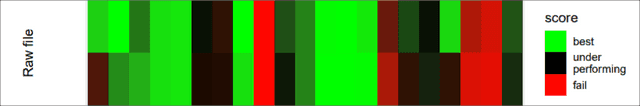

[Visualize Climate data with Panoply netCDF viewer](https://training.galaxyproject.org/training-material/topics/climate/tutorials/panoply/tutorial.html )

By [Anne Fouilloux](https://training.galaxyproject.org/training-material/hall-of-fame#annefou)

Familiarze yourself with the [Panoply](https://www.giss.nasa.gov/tools/panoply/) Galaxy interactive environment. Panoply is among the most popular tools to visualize geo-referenced data stored in [Network Common Data Form (netCDF)](https://en.wikipedia.org/wiki/NetCDF).

[TIaaS Calendar and Stats site](https://galaxyproject.eu/posts/2020/02/27/TIaaS-update/)

We’ve seen the [TIaaS Queue Status](https://galaxyproject.eu/tiaas) receive a lot of positive feedback. Helena Rasche has added two new features to get a general information about the TIaaS service.

* A [calendar](https://usegalaxy.eu/tiaas/calendar/) that shows when TIaaS trainings are booked
* [Some Statistics](https://usegalaxy.eu/tiaas/stats/) about the TIaaS events

[Training Infrastructure as a Service Tutorial!](https://training.galaxyproject.org/training-material/topics/admin/tutorials/tiaas/tutorial.html)

By [Helena Rasche](https://training.galaxyproject.org/training-material/hall-of-fame#hexylena) and [Saskia Hiltemann](https://training.galaxyproject.org/training-material/hall-of-fame#shiltemann).

How to set up your own *[Training Infrastructure as a Service (TIaaS)](https://galaxyproject.eu/tiaas.html)*  service to support Galaxy training compute infrastructure.

My History is Missing! And other  updated support doc

By Jennifer Hillman-Jackson.

* [How to find hard-to-locate histories and datasets](/support/missing-history/)
* [New guidelines for downloading large datasets and troubleshooting downloads](/support/download-data/)
* [Account quotas](/support/account-quotas/)

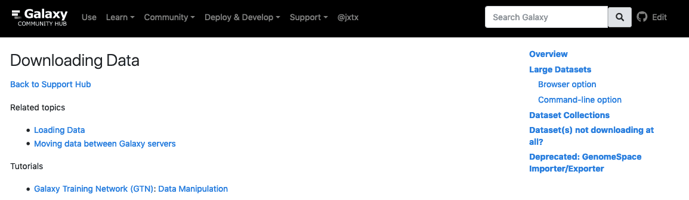

Updated info on UseGalaxy.org

By Nate Coraor.

Find out the latest about how the [UseGalaxy.org server is set up](/main/).

New OIDC Doc

OIDC is [OpenID Connect](https://openid.net/connect/), a simple identity layer on top of the [OAuth 2.0 authorization protocol](https://oauth.net/).  Galaxy supports it.

* [Configure Your Galaxy Instance as a CILogon OIDC Client](/authnz/config/oidc/idps/cilogon/), by Juleen Graham.
* [Login to Galaxy Using Your Organization's Okta identity](/authnz/use/oidc/idps/okta/), by Peter Selten
* [Configure Your Galaxy Instance as an OIDC Client for your organization's Okta Infrastructure](/authnz/config/oidc/idps/okta/), by Peter Selten

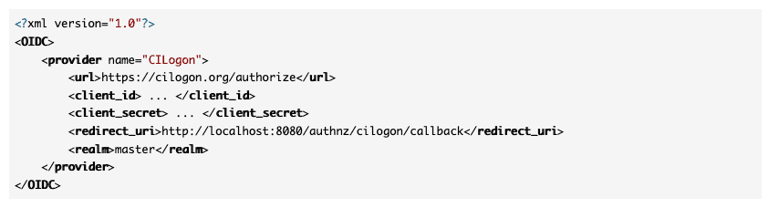

RNA-RNA interactome data analysis

By [Pavankumar Videm](https://training.galaxyproject.org/training-material/hall-of-fame#pavanvidem).

This [GTN tutorial](https://training.galaxyproject.org/training-material/topics/transcriptomics/tutorials/rna-interactome/tutorial.html) presents the analysis of a CLEAR-CLIP data set using the ChiRA tool suite.

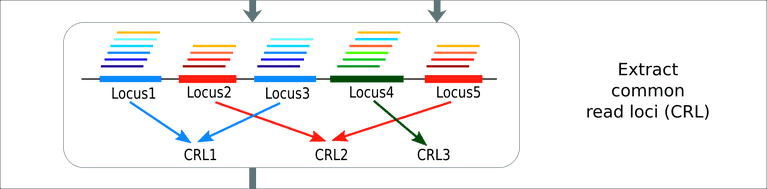

[Introduction to deep learning](https://training.galaxyproject.org/training-material/topics/statistics/tutorials/intro_deep_learning/tutorial.html)

By [Anup Kumar](https://training.galaxyproject.org/training-material/hall-of-fame#anuprulez) and [Alireza Khanteymoori](https://training.galaxyproject.org/training-material/hall-of-fame#khanteymoori)

What are deep learning and neural networks? Why is it useful? How to create a neural network architecture for classification?  This tutorial presents basic principles of deep learning.

[Regression in Machine Learning](https://training.galaxyproject.org/training-material/topics/statistics/tutorials/regression_machinelearning/tutorial.html)

By [Alireza Khanteymoori](https://training.galaxyproject.org/training-material/hall-of-fame#khanteymoori), [Anup Kumar](https://training.galaxyproject.org/training-material/hall-of-fame#anuprulez) and [Simon Bray](https://training.galaxyproject.org/training-material/hall-of-fame#simonbray)

How to use regression techniques to create predictive models from biological datasets.

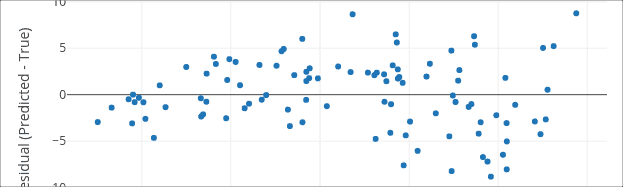

[Metatranscriptomics analysis using microbiome RNA-seq data (short)](https://training.galaxyproject.org/training-material/topics/metagenomics/tutorials/metatranscriptomics-short/tutorial.html)

By Pratik Jagtap, Subina Mehta, Ray Sajulga, Bérénice Batut, Emma Leith, Praveen Kumar, and Saskia Hiltemann.

This is a shortened version of an [existing tutorial](https://training.galaxyproject.org/training-material/topics/metagenomics/tutorials/metatranscriptomics/tutorial.html). Instead of running each tool individually, this tutorial employs workflows to run groups of analysis steps (e.g. data cleaning) at once.

# Who's Hiring

* [Senior Software Developer](https://boards.greenhouse.io/blackcanyonconsulting/jobs/4013069003), Black Canyon Consulting, Bethesda, Maryland, United States
* [Bioinformatics Software Developer](https://absci.bamboohr.com/jobs/view.php?id=52), AbSci, Vancouver, Washington, United States
* [Data Scientist](https://neb.wd5.myworkdayjobs.com/en-US/NEB_Careers/job/Ipswich-MA-United-States/Data-Scientist_1193), New England Biolabs, Ipswich, Massachusetts, United States

# Releases

[Galaxy 20.01](/news/2020-02-galaxy-release-20-01/)

See

* **[Developer and admin release announcement](https://docs.galaxyproject.org/en/master/releases/20.01_announce.html)**
* **[User release announcement](https://docs.galaxyproject.org/en/master/releases/20.01_announce_user.html)**.

Features:

* Easily list and review recently invoked workflows.
* Galaxy Markdown Pages and Workflow Reports as PDF
* Screenreader-friendly Navigation
* Email notification for completed jobs
* Workflows can now make use of optional datasets and optional parameters
* Major update to container and dependency management interface
Extended job metadata collection

[GVL 5.0 Beta Releases](/news/2020-04-gvl5-beta2/)

By Alexandru Mahmoud, Nuwan Goonasekera, Luke Sargent, Enis Afgan, Alex Ostrovsky, and the GVL and Galaxy teams.

GVL, the Genomics Virtual laboratory, had two beta releases in the first 4 months of 2020:

* [With Love: The All-new GVL 5.0 (beta)](/news/2020-02-gvl5-beta/): Now more reliable, with better security, and with new features.
* [GVL 5.0-beta2 release](/news/2020-04-gvl5-beta2/): 30% faster and single sign-on, ohh my

The GVL makes dedicated, production-grade installations of Galaxy available on cloud providers, all via a web browser. The GVL has been used extensively whenever public and shared servers were not suitable. The GVL 5.0 is a ground-up rewrite of the GVL based on Kubernetes and containerization technologies.

[Galaxy Helm 3.1.0](https://github.com/galaxyproject/galaxy-helm) was also released simultaneously.

[nebulizer 0.50](https://pypi.org/project/nebulizer/0.5.0/)

Command-line utilities to help with managing users, data libraries and tools in a Galaxy instance, using the Galaxy API via the [Bioblend](http://bioblend.readthedocs.org/en/latest/) library.

[sequence-utils 1.1.5](https://github.com/galaxyproject/sequence_utils)

Galaxy's sequence utilities are a set of Python modules for reading, analyzing, and converting sequence formats.

# Publications

**671 new publications** referencing, using, extending, and implementing Galaxy were added to the [Galaxy Publication Library](https://www.zotero.org/groups/galaxy) in January, February, and March.  There were over 25 *[Galactic](https://www.zotero.org/groups/1732893/galaxy/tags/%2BGalactic)* and *[Stellar](https://www.zotero.org/groups/1732893/galaxy/tags/%2BStellar)* publications added, and **20 of them are open access**:

[User-friendly, scalable tools and workflows for single-cell analysis](https://doi.org/10.1101/2020.04.08.032698)

Moreno, P., Huang, N., Manning, J. R., Mohammed, S., Solovyev, A., Polanski, K., Chazarra, R., Talavera-Lopez, C. A., Doyle, M., Marnier, G., Gruening, B. A., Rasche, H., Bacon, W., Perez-Riverol, Y., Haeussler, M., Meyer, K. B., Teichmann, S., & Papatheodorou, I. (2020). *BioRxiv*, 2020.04.08.032698. https://doi.org/10.1101/2020.04.08.032698

[Machine learning of reverse transcription signatures of variegated polymerases allows mapping and discrimination of methylated purines in limited transcriptomes](https://doi.org/10.1093/nar/gkaa113)

Werner, S., Schmidt, L., Marchand, V., Kemmer, T., Falschlunger, C., Sednev, M. V., Bec, G., Ennifar, E., Höbartner, C., Micura, R., Motorin, Y., Hildebrandt, A., & Helm, M. (2020). *Nucleic Acids Research*. https://doi.org/10.1093/nar/gkaa113

[Survey of metaproteomics software tools for functional microbiome analysis](https://doi.org/10.1101/2020.01.07.897561)

Sajulga, R., Easterly, C., Riffle, M., Mesuere, B., Muth, T., Mehta, S., Kumar, P., Johnson, J., Gruening, B., Schiebenhoefer, H., Kolmeder, C. A., Fuchs, S., Nunn, B. L., Rudney, J., Griffin, T. J., & Jagtap, P. D. (2020). *BioRxiv*, 2020.01.07.897561. https://doi.org/10.1101/2020.01.07.897561

[Influenza Classification Suite: An automated Galaxy workflow for rapid influenza sequence analysis](https://doi.org/10.1111/irv.12722)

Eisler, D., Fornika, D., Tindale, L. C., Chan, T., Sabaiduc, S., Hickman, R., Chambers, C., Krajden, M., Skowronski, D. M., Jassem, A., & Hsiao, W. (2020). *Influenza and Other Respiratory Viruses*. https://doi.org/10.1111/irv.12722

[GraphClust2: Annotation and discovery of structured RNAs with scalable and accessible integrative clustering](https://doi.org/10.1093/gigascience/giz150)

Miladi, M., Sokhoyan, E., Houwaart, T., Heyne, S., Costa, F., Grüning, B., & Backofen, R. (2019). GigaScience, 8(12). https://doi.org/10.1093/gigascience/giz150

[Family reunion via error correction: An efficient analysis of duplex sequencing data](https://doi.org/10.1186/s12859-020-3419-8)

Stoler, N., Arbeithuber, B., Povysil, G., Heinzl, M., Salazar, R., Makova, K. D., Tiemann-Boege, I., & Nekrutenko, A. (2020). *BMC Bioinformatics*, 21(1), 96. https://doi.org/10.1186/s12859-020-3419-8

[Visualizing Omics Data from Spaceflight Samples using the NASA GeneLab Platform](https://doi.org/10.29007/rh7n)

Berrios, D., Weitz, E., Grigorev, K., Costes, S., Gebre, S., & Beheshti, A. (2020). EPiC Series in Computing, 70, 89–98. https://doi.org/10.29007/rh7n

[No more business as usual: Agile and effective responses to emerging pathogen threats require open data and open analytics](https://doi.org/10.1101/2020.02.21.959973)

Galaxy and HyPhy developments teams, Nekrutenko, A., & Pond, S. L. K. (2020). *BioRxiv*, 2020.02.21.959973. https://doi.org/10.1101/2020.02.21.959973

[Koala: Sistema para integração de métodos de predição e análise de estruturas de proteína](https://doi.org/10.11606/D.82.2016.tde-22062016-102823)

Defelicibus, A. (2016).  [Thesis, Universidade de São Paulo]. https://doi.org/10.11606/D.82.2016.tde-22062016-102823

[VINYL: Variant prIoritizatioN bY survivaL analysis](https://doi.org/10.1101/2020.01.23.917229)

Chiara, M., Mandreoli, P., Tangaro, M. A., D’Erchia, A. M., Sorrentino, S., Forleo, C., Horner, D. S., Zambelli, F., & Pesole, G. (2020). *BioRxiv*, 2020.01.23.917229. https://doi.org/10.1101/2020.01.23.917229

[Computational Infrastructures for biomolecular research](http://diposit.ub.edu/dspace/handle/2445/149802)

Codó Tarraubella, L. (2019). [Thesis, Universitat de Barcelona]. http://diposit.ub.edu/dspace/handle/2445/149802

[A workflow-based algorithm for tracing Computational Synteny Blocks along different species](https://riuma.uma.es/xmlui/handle/10630/19060)

Holthausen Bermejo, R. (2019).  [Thesis, Universidad de Malaga]. https://riuma.uma.es/xmlui/handle/10630/19060

[Infrastructure for Semantic Annotation in the Genomics Domain](https://eprints.lancs.ac.uk/id/eprint/142283/)

El-Haj, M., Rutherford, N., Rayson, P., Knight, J., Piao, S., Coole, M., Mariani, J., Ezeani, I., Prentice, S., Ide, N., & Suderman, K. (2020, March 11). LREC 2020, Twelfth International Conference on Language Resources and Evaluation. https://eprints.lancs.ac.uk/id/eprint/142283/

[A benchmark of hemoglobin blocking during library preparation for mRNA-Sequencing of human blood samples](https://doi.org/10.1038/s41598-020-62637-0)

Uellendahl-Werth, F., Wolfien, M., Franke, A., Wolkenhauer, O., & Ellinghaus, D. (2020). *Scientific Reports*, 10(1), 1–10. https://doi.org/10.1038/s41598-020-62637-0

[Uncovering informative content in metabolomics data: From pre-processing of 1H NMR spectra to biomarkers discovery in multifactorial designs](https://dial.uclouvain.be/pr/boreal/object/boreal:227671)

Martin, M. (2020).  [Thesis, UCL - Université Catholique de Louvain]. https://dial.uclouvain.be/pr/boreal/object/boreal:227671

[NG-Tax 2.0: A Semantic Framework for High-Throughput Amplicon Analysis](https://doi.org/10.3389/fgene.2019.01366)

Poncheewin, W., Hermes, G. D. A., van Dam, J. C. J., Koehorst, J. J., Smidt, H., & Schaap, P. J. (2020). *Frontiers in Genetics*, 10. https://doi.org/10.3389/fgene.2019.01366

[Design of Bacterial Strain-Specific qPCR Assays Using NGS Data and Publicly Available Resources and Its Application to Track Biocontrol Strains](https://doi.org/10.3389/fmicb.2020.00208)

Hernández, I., Sant, C., Martínez, R., & Fernández, C. (2020). *Frontiers in Microbiology*, 11. https://doi.org/10.3389/fmicb.2020.00208

[STAGdb: A 30K SNP genotyping array and Science Gateway for Acropora corals and their dinoflagellate symbionts](https://doi.org/10.1101/2020.01.21.914424)

Kitchen, S. A., Kuster, G. V., Kuntz, K. L. V., Reich, H. G., Miller, W., Griffin, S., Fogarty, N. D., & Baums, I. B. (2020). *BioRxiv*, 2020.01.21.914424. https://doi.org/10.1101/2020.01.21.914424

[Genome-Wide Search for Candidate Drivers of Adaptation Reveals Genes Enriched for Shifts in Purifying Selection (SPurS)](https://doi.org/10.1101/2020.01.11.902759)

Popejoy, A. B., Domanska, D. E., & Thomas, J. H. (2020). *BioRxiv*, 2020.01.11.902759. https://doi.org/10.1101/2020.01.11.902759

[Genome size, chromosome number determination, and analysis of the repetitive elements in *Cissus quadrangularis*](https://doi.org/10.7717/peerj.8201)

Gichuki, D. K., Ma, L., Zhu, Z., Du, C., Li, Q., Hu, G., Zhong, Z., Li, H., Wang, Q., & Xin, H. (2019). . PeerJ, 7, e8201. https://doi.org/10.7717/peerj.8201

Publication Topics

Publications are tagged with how they use, extend or reference Galaxy.  This batch of pubs were tagged as:

<a class="btn"  style="text-align: right; background-color: #61c361;" href="https://www.zotero.org/groups/1732893/galaxy/tags/+Methods"> 468 : <strong>Methods</strong></a>
 <a class="btn"  style="text-align: right; background-color: #75cb75;" href="https://www.zotero.org/groups/1732893/galaxy/tags/+UsePublic"> 214 : <strong>UsePublic</strong></a>
 <a class="btn"  style="text-align: right; background-color: #8ed48e;" href="https://www.zotero.org/groups/1732893/galaxy/tags/+UseMain"> 81 : <strong>UseMain</strong></a>
 <a class="btn"  style="text-align: right; background-color: #8fd58f;" href="https://www.zotero.org/groups/1732893/galaxy/tags/+Workbench"> 78 : <strong>Workbench</strong></a>
 <a class="btn"  style="text-align: right; background-color: #98d898;" href="https://www.zotero.org/groups/1732893/galaxy/tags/+RefPublic"> 54 : <strong>RefPublic</strong></a>
 <a class="btn"  style="text-align: right; background-color: #9bd99b;" href="https://www.zotero.org/groups/1732893/galaxy/tags/+UseLocal"> 48 : <strong>UseLocal</strong></a>
 <a class="btn"  style="text-align: right; background-color: #aadfaa;" href="https://www.zotero.org/groups/1732893/galaxy/tags/+Tools"> 26 : <strong>Tools</strong></a>
 <a class="btn"  style="text-align: right; background-color: #ace0ac;" href="https://www.zotero.org/groups/1732893/galaxy/tags/+Reproducibility"> 24 : <strong>Reproducibility</strong></a>
 <a class="btn"  style="text-align: right; background-color: #b8e4b8;" href="https://www.zotero.org/groups/1732893/galaxy/tags/+IsGalaxy"> 15 : <strong>IsGalaxy</strong></a>
 <a class="btn"  style="text-align: right; background-color: #cdeccd;" href="https://www.zotero.org/groups/1732893/galaxy/tags/+Cloud"> 6 : <strong>Cloud</strong></a>
 <a class="btn"  style="text-align: right; background-color: #d1eed1;" href="https://www.zotero.org/groups/1732893/galaxy/tags/+Shared"> 5 : <strong>Shared</strong></a>
 <a class="btn"  style="text-align: right; background-color: #d1eed1;" href="https://www.zotero.org/groups/1732893/galaxy/tags/+Unknown"> 5 : <strong>Unknown</strong></a>
 <a class="btn"  style="text-align: right; background-color: #dbf2db;" href="https://www.zotero.org/groups/1732893/galaxy/tags/+Education"> 3 : <strong>Education</strong></a>
 <a class="btn"  style="text-align: right; background-color: #dbf2db;" href="https://www.zotero.org/groups/1732893/galaxy/tags/+HowTo"> 3 : <strong>HowTo</strong></a>
 <a class="btn"  style="text-align: right; background-color: #dbf2db;" href="https://www.zotero.org/groups/1732893/galaxy/tags/+Other"> 3 : <strong>Other</strong></a>
 <a class="btn"  style="text-align: right; background-color: #dbf2db;" href="https://www.zotero.org/groups/1732893/galaxy/tags/+Visualization"> 3 : <strong>Visualization</strong></a>
 <a class="btn"  style="text-align: right; background-color: #edf8ed;" href="https://www.zotero.org/groups/1732893/galaxy/tags/+Project"> 1 : <strong>Project</strong></a>

# Other News

[Galaxy has migrated to Python 3.6](https://github.com/galaxyproject/galaxy/issues/1715)

And so has the Galaxy ToolShed.  And we are darn happy about it.  Many thanks to [Nicola Soranzo](https://github.com/nsoranzo) and [Marius van den Beek](https://github.com/mvdbeek) for leading this years-long community wide effort.

[Galaxy Community Statistics Update](/galaxy-project/statistics/)

The semi-annual update of the [Galaxy Statistics Page](/galaxy-project/statistics/) happened.  Stuff is up...

[Based in the UK? Computational resources for bioinformatics at home](https://www.earlham.ac.uk/newsroom/computational-resources-power-your-bioinformatics-analysis-while-working-home)

If you’re a UK-based researcher working from home, you might require some additional computing power. The Earlham Institute offers Galaxy and CyVerse UK cloud-based bioinformatics resources to help.

[Multiplying science: Tool-sharing platform for genomics analysis becomes so much more](https://sciencenode.org/feature/Multiplying%20science.php)

Read ScienceNode's [writeup](https://sciencenode.org/feature/Multiplying%20science.ph) on Galaxy and watch their interview with James Taylor at Gateways 2019.

[ABLS20 #UseGalaxy Poster Prizes awarded](https://www.vibconferences.be/news/the-3rd-sold-out-edition-of-abls20-showcases-the-power-of-bioinformatics)

[Sema Elif Eski](https://www.researchgate.net/profile/Sema_Eski) (ULB, BE) and [Simon van Heeringen](https://molbio.science.ru.nl/about/molecular-developmental-biology/simon-van-heeringen/) (Radboud Universiteit, NL) received the #UseGalaxy poster prizes at the
[Applied Bioinformatics in Life Sciences Conference](https://www.vibconferences.be/events/applied-bioinformatics-in-life-sciences-3rd-edition) in Leuven.

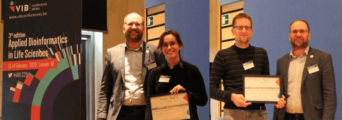

