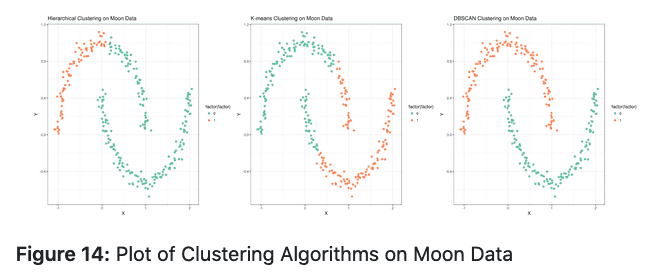
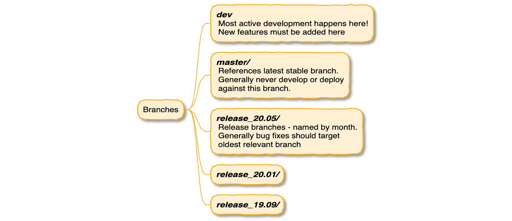

# In the June 2020 issue

* **[James Taylor Foundation](#jtech-the-james-taylor-foundation)**
* **[BCC2020](#bcc2020-will-be-online-global-affordable-and-accessible) will be online, global, affordable, and accessible**
* **[Galaxy and the NCBI Sequence Read Archive (SRA)](#galaxy-and-the-ncbi-sequence-read-archive-sra)**
* [Upcoming events](#more-upcoming-events)
* [Galaxy Platform News](#galaxy-platforms-news)
* [Training material and doc updates](#doc-hub-and-training-updates)
* [Who's Hiring](#whos-hiring)
* [New Releases](#releases)
* [New publications](#publications)
* And [other cool news too](#other-news)

If you have anything to include to next month's newsletter, then please send it to outreach@galaxyproject.org.

---

# JTech, the James Taylor Foundation

 

Design by [Rebekka Paisner](https://twitter.com/rebekkapaisner)

The recent passing of [Dr. James Taylor](/jxtx/), the Ralph S. O’Connor Professor of Biology and Professor of Computer Science at Johns Hopkins University, has left an enormous void in the field of computational biology. To help fill this void and continue James’ efforts, the Galaxy community has established a memorial foundation in James’ name.

James believed that scientific progress can best be sustained through mentoring of students and junior faculty. The Junior Training and Educational Connections Hotspot (JTech) foundation will ensure implementation of this vision. To begin, JTech will  (1) support  graduate students to participate in computational biology and data science conferences, and (2) organize and host mentoring sessions between senior and junior faculty members at high-profile meetings. JTech will later expand its reach as a platform for academic mentorship including high school through college age students.

To make this happen we are [accepting contributions here](https://galaxyproject.org/jxtx/). Please, help us continue what James has started.

---

# BCC2020 will be Online, Global, Affordable, and Accessible

[BOSC + GCC = BCC2020](https://bcc2020.github.io/)

The [2020 Bioinformatics Community Conference (BCC2020)](https://bcc2020.github.io/) brings together the [Bioinformatics Open Source Conference (BOSC)](https://www.open-bio.org/events/bosc/) and [Galaxy Community Conference](/gcc/).  If you are working in data intensive life science research then there is no better event for sharing your work, and learning from other researchers addressing the challenges of modern data driven biology.  [BCC2020 will be held July 17-26](https://bcc2020.sched.com/), and offer 2 days of training, a 3 day meeting, and a 4 day CollaborationFest.

BCC2020 is Accessible

Going [online](https://bcc2020.github.io/blog/going-virtual) and [global](https://bcc2020.github.io/blog/going-global)), combined with [low registration rates](https://bcc2020.github.io/Registration/), **makes this the most accessible Galaxy or BOSC conference ever.**  If you work in open source bioinformatics, *anywhere in the world*, then this is 2020’s best opportunity to share your work and learn from others.

Keynote Speaker: Prash Suravajhala

We are pleased to announce that **Prash Suravajhala** of [BioClues](https://bioclues.org) and the [Birla Institute of Scientific Research](https://bisr.res.in/) will give a keynote address at BCC2020.  Prash is a founder of BioClues, India’s largest bioinformatics society.

[Save 50% with Early Registration](https://bcc2020.github.io/Registration/)

BCC2020 registration is [now open](https://bcc2020.github.io/Registration/).  Registering early saves 50% off of the full rates and starts $3 per training session and $12 for the three day meeting.

 

## BCC2020 Sponsors

We are pleased to announce several sponsors for BCC2020!  These organizations have stepped up to help make BCC global and affordable:

**[Amazon Web Services (AWS)](https://aws.amazon.com/)** is the world’s most comprehensive and broadly adopted cloud platform, offering over 175 fully featured services from data centers globally.  AWS has long [enabled life science researchers](https://aws.amazon.com/health/genomics/) to access dynamically scalable and cost-effective compute resources without requiring an investment in dedicated and expensive local computational infrastructure that can become rapidly out dated. Millions of customers—including the fastest-growing startups, largest enterprises, and leading government agencies—are using AWS to lower costs, become more agile, and innovate faster. You can too.

Please welcome AWS as a **Gold Level sponsor of BCC2020**.

The **[Broad Institute's Data Sciences Platform](https://www.broadinstitute.org/data-sciences-platform)** accelerates science, transforms medicine, and improves lives through data technologies. It is a diverse organization of more than 160 people working together and with external collaborators to deliver high-quality open source software and services, such as the[ Genome Analysis Toolkit (GATK)](https://gatk.broadinstitute.org/), the[ Cromwell workflow management system](https://cromwell.readthedocs.io/) and[ Terra](https://terra.bio/), the Broad Institute's cloud-based data access and analysis platform. Learn more about [Terra](https://app.terra.bio/) with these 3-10 minute [video guides](https://www.youtube.com/playlist?list=PLh_zJaZ9uQ7P0w6bMLWgL8oDul2EiNlv6) and at this [BCC training session on Saturday, July 18](https://sched.co/c4pR).

Please welcome Broad Institute's Data Sciences Platform as a **Silver Level sponsor of BCC2020**.

The **[Software Sustainability Institute](https://software.ac.uk/)** is a world-leading hub for the cultivation and improvement of research software practice. The Institute provides guidance, training, policy, and tools to thousands of researchers and research software engineers working across all disciplines to help achieve a vision of “better software, better research”.

Please welcome the Software Sustainability Institute as a **Gold Level sponsor of BCC2020**.

[ ***GigaScience*** ](https://academic.oup.com/gigascience) is an open access, open data, open peer-review journal published by [**Oxford University Press**](https://academic.oup.com/) and [**BGI**](https://www.bgi.com/us/). We offer ‘big data’ research from the life sciences, including work that uses difficult-to-access large-scale data, such as imaging, neuroscience, ecology, systems biology, and other types of shareable data. *GigaScience* is uniquely publishes *all* research objects (data, software tools, source code, [workflows](http://gigagalaxy.net/), containers and other elements related to the findings in the article). Novel work presented at the meeting is eligible for 15% off APC.

Please welcome *GigaScience* as a **Silver Level sponsor of BCC2020**.

Interested in helping BCC2020 happen?  See the [sponsorship opportunities page](https://bcc2020.github.io/sponsorships/) for information.

# Galaxy and the NCBI Sequence Read Archive (SRA)

Webinar: Using the new Galaxy-SRA Connector

Galaxy and the NIH Sequence Read Archive are now directly connected, enabling researchers to work with SRA data available from NCBI (https://www.ncbi.nlm.nih.gov/sra/) more easily within the Galaxy framework. This webinar will talk about the connection and demonstrate how to use it to get SRA data into Galaxy.

[NIH's Sequence Read Archive (SRA)](https://www.ncbi.nlm.nih.gov/sra) will become an integrated data source on [UseGalaxy.org](https://usegalaxy.org) this month. This functionality is also built in to the upcoming 20.05 release of Galaxy. With this connection, you will be able to work with SRA data available from NCBI more easily within the Galaxy framework.

A [webinar on June 24](/events/2020-06-sra/) will demonstrate this integration and how to use SRA data in the Galaxy platform.  The webinar will be held on June 24, at Noon, Eastern US time (GMT -4).  Interested?  **[Register now](https://docs.google.com/forms/d/e/1FAIpQLSfeAjnJSEfG11ngNn_sS3imPiXuHhdUcDSaBO6u__88xRnMbA/viewform).**

RFI: Use of Cloud Resources and New File Formats for SRA

NIH has released a request for information (RFI) to solicit community feedback on new proposed Sequence Read Archive (SRA) data formats. Learn more and share your thoughts at https://go.usa.gov/xvhdr.

**The response deadline is July 17th, 2020**. We encourage you all to share with your colleagues and networks, and respond if you are an SRA submitter or data user.

# More Upcoming Events

The coronavirus outbreak has impacted BCC2020, and just about every other event for the rest of the year too.  Most events through the end of August have been postponed or moved online.  We have updated our [list of events](/events/) to reflect what we know.  Some highlights:

SGCI Online Events

June is an active month for the Scientific Gateways Community Institute:

* **[Jumpstart Your Sustainability Plan mini-course](https://sciencegateways.org/engage/focus-week/jumpstart)**
    * June 16-18, with main presentations 12-1:30 pm ET each day, and optional office hours and special topics presentations from 2-5 pm ET
    * **Register by June 12, 2020**
* **[Galaxy: Powering Science from the Desktop to Global Cyberinfrastructure](https://sciencegateways.org/engage/webinars)**, June 24, Nate Coraor.

[This workshop](https://galaxyproject.eu/event/2020-05-27-Machine-Learning-Elixir/) will be held online 22-26 June.  **Registration deadline is 16 June!**

*The organizers are seeking French-speaking Teaching Assistants for this workshop. If you can help (Tues + Thurs only) please contact [Björn Grüning](/people/bjoern-gruening/).*

[ISMB 2020](https://www.iscb.org/ismb2020) has gone virtual and [Galaxy is going with it](/events/2020-ismb/): Check out

* a tutorial,
* a COSI keynote, and
* five posters

so far.  Look for more as the schedule comes online.

Upcoming Events

There are

* [20 upcoming events](/events/) (most of them virtual)
* covering COVID-19, variant detection, assembly, machine learning, accessing SRA, metabarcoding, bioinformatics education, RNA-Seq and more.

And material from some recent past events is now available:

* **Videos of all 5 sessions in the [Galaxy-ELIXIR webinar series: FAIR data and Open Infrastructures to tackle the COVID-19 pandemic](https://elixir-europe.org/events/webinar-galaxy-elixir-covid19) are now available**.
* Slides and video for the webinar [Galaxy Project—Enabling an active global research community](https://sciencegateways.org/-/galaxy-project-enabling-an-active-global-research-community?inheritRedirect=true&redirect=%2Fengage%2Fwebinar-archive) are online.

# Galaxy Platforms News

The [Galaxy Platform Directory](/use/) lists resources for easily running your analysis on Galaxy, including publicly available servers, cloud services, and containers and VMs that run Galaxy. Here's the recent platform news we know about:

[MaREA4Galaxy](/use/marea4galaxy/)

The **[MaREA4Galaxy server](http://bimib.disco.unimib.it:5555/)** supports the *Metabolic Reaction Enrichment Analysis and visualization of RNA-seq data* toolset.  This includes tools to

* Compute Reaction Activity Scores from gene expression (RNA-seq) dataset(s).
* Cluster analysis of any dataset, according to most used algorithms: K-means, agglomerative clustering and DBSCAN.
* Analyze and visualize differences in the Reaction Activity Scores (RASs) of groups of samples, as computed by the Expression2RAS tool, of groups of samples.

[wQAP](/use/wqap/)

The **[wQAP Galaxy server](http://life2cloud.com:6005/qap)** is an online version of [QAP](http://life2cloud.com:6005/qap), the *Quasispecies Analysis Package*, and contains all the programs in QAP, and there are nearly no differences between them.  It comes with a tutorial and email support. wAQP is supported by the [Research Laboratory of Clinical Virology, Ruijin Hospital, Shanghai Jiaotong University, School of Medicine, Shanghai, China](https://www.shsmu.edu.cn/english/).

[ChemicalToolBox](https://cheminformatics.usegalaxy.eu/)

**[ChemicalToolBox](https://cheminformatics.usegalaxy.eu/)** is a webserver for processing, analysing and visualising chemical data, and performing molecular simulations, with almost 100 tools.  [Training materials are available](https://galaxyproject.github.io/training-material/topics/computational-chemistry), and this toolbox was used in the recent [Virtual screening of the SARS-CoV-2 main protease](https://covid19.galaxyproject.org/cheminformatics) work.

[UseGalaxy.*](/usegalaxy/) News

* UseGalaxy.eu has surpassed 100,000 *workflow* invocations.
* Lots of tool updates on [UseGalaxy.eu](https://galaxyproject.eu/news) and [UseGalaxy.org.au](https://usegalaxy-au.github.io/galaxy/news.html)

Galaxy Platforms in Publications

Platforms that were referenced/used *at least twice* in recent publications:

<a class="btn"  style="text-align: right; background-color: #8ed48e;" href="https://www.zotero.org/groups/1732893/galaxy/tags/>Huttenhower"> 43 : <strong>Huttenhower</strong></a>
 <a class="btn"  style="text-align: right; background-color: #b0e1b0;" href="https://www.zotero.org/groups/1732893/galaxy/tags/>Workflow4Metabolomics"> 13 : <strong>Workflow4Metabolomics</strong></a>
 <a class="btn"  style="text-align: right; background-color: #b2e2b2;" href="https://www.zotero.org/groups/1732893/galaxy/tags/>UseGalaxy.eu"> 12 : <strong>UseGalaxy.eu</strong></a>
 <a class="btn"  style="text-align: right; background-color: #c5e9c5;" href="https://www.zotero.org/groups/1732893/galaxy/tags/>RepeatExplorer"> 6 : <strong>RepeatExplorer</strong></a>
 <a class="btn"  style="text-align: right; background-color: #c9ebc9;" href="https://www.zotero.org/groups/1732893/galaxy/tags/>ARGs-OAP"> 5 : <strong>ARGs-OAP</strong></a>
 <a class="btn"  style="text-align: right; background-color: #cfedcf;" href="https://www.zotero.org/groups/1732893/galaxy/tags/>Cistrome"> 4 : <strong>Cistrome</strong></a>
 <a class="btn"  style="text-align: right; background-color: #d5efd5;" href="https://www.zotero.org/groups/1732893/galaxy/tags/>Galaxy-P"> 3 : <strong>Galaxy-P</strong></a>
 <a class="btn"  style="text-align: right; background-color: #def3de;" href="https://www.zotero.org/groups/1732893/galaxy/tags/>ARIES"> 2 : <strong>ARIES</strong></a>
 <a class="btn"  style="text-align: right; background-color: #def3de;" href="https://www.zotero.org/groups/1732893/galaxy/tags/>Mississippi"> 2 : <strong>Mississippi</strong></a>
 <a class="btn"  style="text-align: right; background-color: #def3de;" href="https://www.zotero.org/groups/1732893/galaxy/tags/>RNA Workbench"> 2 : <strong>RNA Workbench</strong></a>
 <a class="btn"  style="text-align: right; background-color: #def3de;" href="https://www.zotero.org/groups/1732893/galaxy/tags/>Trinity"> 2 : <strong>Trinity</strong></a>
 <a class="btn"  style="text-align: right; background-color: #def3de;" href="https://www.zotero.org/groups/1732893/galaxy/tags/>UseGalaxy.org.au"> 2 : <strong>UseGalaxy.org.au</strong></a>
 

# Doc, Hub, and Training Updates

[Galaxy Machine Learning Community Hub Page](/community/machine-learning/)

Machine Learning has had an active Galaxy community for a while now, and now that community has it's [own web page on the Galaxy Hub](/community/machine-learning/) describing the [Machine learning Workbench](https://ml.usegalaxy.eu/), relevant training, and supported tools.  Coming soon: community communication channels.

[Clustering in Machine Learning](https://training.galaxyproject.org/training-material/topics/statistics/tutorials/clustering_machinelearning/tutorial.html)

By [Alireza Khanteymoori](https://training.galaxyproject.org/training-material/hall-of-fame#khanteymoori) and [Anup Kumar](https://training.galaxyproject.org/training-material/hall-of-fame#anuprulez).

Discover hidden structure or patterns in unlabeled training data using unsupervised learning with clustering.

[Label-free data analysis using MaxQuant](https://training.galaxyproject.org/training-material/topics/proteomics/tutorials/maxquant-label-free/tutorial.html)

By [Melanie Föll](https://training.galaxyproject.org/training-material/hall-of-fame#foellmelanie) and [Matthias Fahrner](https://training.galaxyproject.org/training-material/hall-of-fame#matthias313)

Introduces the data analysis from raw data files to protein identification and quantification of two label-free human serum samples with the MaxQuant software.

[Galaxy Code Architecture Slide Deck](https://training.galaxyproject.org/training-material/topics/dev/tutorials/architecture/slides.html#1)

This extensive overview slide deck on how Galaxy Code is architected received a major update from [John Chilton](https://training.galaxyproject.org/training-material/hall-of-fame#jmchilton), [Helena Rasche](https://training.galaxyproject.org/training-material/hall-of-fame#hexylena), and [Nicola Soranzo](https://training.galaxyproject.org/training-material/hall-of-fame#nsoranzo).

Updated: [Virtual screening of the SARS-CoV-2 main protease with rDock and pose scoring](https://training.galaxyproject.org/training-material/topics/computational-chemistry/tutorials/covid19-docking/tutorial.html)

[Simon Bray](https://training.galaxyproject.org/training-material/hall-of-fame#simonbray) posted a major update to this COVID-19 related tutorial. (He added *Frankenstein*.)

# Who's Hiring

[Data Management Usability Officer](https://vibvzw.jobsoid.com/j/27205/data-management-usability-officer)

[VIB-UGent Center for Plant Systems Biology](http://www.vib.be/en/), Ghent, Belgium

... We are building on the internationally used platform [FAIRDOMhub](https://fairdomhub.org) for data management, and Galaxy (https://www.usegalaxy.be and https://usegalaxy.eu) for data analysis.

[Senior Software Developer](https://boards.greenhouse.io/blackcanyonconsulting/jobs/4013069003)

[Black Canyon Consulting](http://www.bccdc.net/) at NCBI, Bethesda, Maryland, United States

[Data Scientist](https://neb.wd5.myworkdayjobs.com/en-US/NEB_Careers/job/Ipswich-MA-United-States/Data-Scientist_1193)

[New England Biolabs](https://www.neb.com/), Ipswich, Massachusetts, United States

# Releases

[blend4php release v0.1](https://github.com/galaxyproject/blend4php)

The first full stable release of the [blend4php package](https://github.com/galaxyproject/blend4php) is out. blend4*php* is a PHP wrapper for interacting with Galaxy and CloudMan. blend4php currently offers a partial implementation of the Galaxy API and includes support for datasets, data types, folder contents, folders, genomes, group roles, groups, group users, histories, history contents, jobs, libraries, library contents, requests, roles, search, tools, toolshed repositories, users, visualizations and workflows.

# Publications

**262 new publications** referencing, using, extending, and implementing Galaxy were added to the [Galaxy Publication Library](https://www.zotero.org/groups/galaxy) in April and May.  There were 16 *[Galactic](https://www.zotero.org/groups/1732893/galaxy/tags/%2BGalactic)* and *[Stellar](https://www.zotero.org/groups/1732893/galaxy/tags/%2BStellar)* publications added, and **14 of them are open access**.

[In memory of James Taylor: The birth of Galaxy](https://doi.org/10.1186/s13059-020-02016-0)

Nekrutenko, A., & Schatz, M. C. (2020). *Genome Biology*, 21(1), 105. https://doi.org/10.1186/s13059-020-02016-0

[Advanced Research Infrastructure for Experimentation in genomicS (ARIES): a lustrum of Galaxy experience](https://doi.org/10.1101/2020.05.14.095901)

Knijn, A., Michelacci, V., Orsini, M., & Morabito, S. (2020).  *BioRxiv*, 2020.05.14.095901. https://doi.org/10.1101/2020.05.14.095901

[GLASSGo in Galaxy: High-throughput, reproducible and easy-to-integrate prediction of sRNA homologs](https://doi.org/10.1093/bioinformatics/btaa556)

Schäfer, R. A., Lott, S. C., Georg, J., Grüning, B. A., Hess, W. R., & Voß, B. (2020).  *Bioinformatics*. https://doi.org/10.1093/bioinformatics/btaa556

[GalaxyCloudRunner: Enhancing scalable computing for Galaxy](https://doi.org/10.1101/2020.05.28.121772)

Goonasekera, N., Mahmoud, A., Chilton, J., & Afgan, E. (2020). *BioRxiv*, 2020.05.28.121772. https://doi.org/10.1101/2020.05.28.121772

[The ChemicalToolbox: Reproducible, user-friendly cheminformatics analysis on the Galaxy platform](https://doi.org/10.1186/s13321-020-00442-7)

Bray, S. A., Lucas, X., Kumar, A., & Grüning, B. A. (2020). *Journal of Cheminformatics*, 12(1), 40. https://doi.org/10.1186/s13321-020-00442-7

[MaREA4Galaxy: Metabolic reaction enrichment analysis and visualization of RNA-seq data within Galaxy](https://doi.org/10.1016/j.csbj.2020.04.008)

Damiani, C., Rovida, L., Maspero, D., Sala, I., Rosato, L., Di Filippo, M., Pescini, D., Graudenzi, A., Antoniotti, M., & Mauri, G. (2020). *Computational and Structural Biotechnology Journal*, 18, 993–999. https://doi.org/10.1016/j.csbj.2020.04.008

[A single-cell RNA-seq Training and Analysis Suite using the Galaxy Framework](https://doi.org/10.1101/2020.06.06.137570)

Tekman, M., Batut, B., Ostrovsky, A., Antoniewski, C., Clements, D., Ramirez, F., Etherington, G. J., Hotz, H.-R., Scholtalbers, J., Manning, J. R., Bellenger, L., Doyle, M. A., Heydarian, M., Huang, N., Soranzo, N., Moreno, P., Papatheodorou, I., Nekrutenko, A., Taylor, J., … Grüning, B. (2020). *BioRxiv*, 2020.06.06.137570. https://doi.org/10.1101/2020.06.06.137570

[Galaxy HiCExplorer 3: A web server for reproducible Hi-C, capture Hi-C and single-cell Hi-C data analysis, quality control and visualization](https://doi.org/10.1093/nar/gkaa220)

Wolff, J., Rabbani, L., Gilsbach, R., Richard, G., Manke, T., Backofen, R., & Grüning, B. A. (2020). *Nucleic Acids Research*. https://doi.org/10.1093/nar/gkaa220

[EpiMOLAS: An intuitive web-based framework for genome-wide DNA methylation analysis](https://doi.org/10.1186/s12864-019-6404-8)

Su, S.-Y., Lu, I.-H., Cheng, W.-C., Chung, W.-C., Chen, P.-Y., Ho, J.-M., Chen, S.-H., & Lin, C.-Y. (2020). *BMC Genomics*, 21(3), 163. https://doi.org/10.1186/s12864-019-6404-8

[Optimizing Open Data to Support One Health: Best Practices to Ensure Interoperability of Genomic Data from Microbial Pathogens](https://doi.org/10.20944/preprints202004.0253.v1)

Timme, R. E., Wolfgang, W. J., Balkey, M., Venkata, S. L. G., Randolph, R., Allard, M., & Strain, E. (2020). *Preprints*. https://doi.org/10.20944/preprints202004.0253.v1

[Ewastools: Infinium Human Methylation BeadChip pipeline for population epigenetics integrated into Galaxy](https://doi.org/10.1093/gigascience/giaa049)

Murat, K., Grüning, B., Poterlowicz, P. W., Westgate, G., Tobin, D. J., & Poterlowicz, K. (2020). *GigaScience*, 9(5). https://doi.org/10.1093/gigascience/giaa049

[Connecting data, tools and people across Europe: ELIXIR’s response to the COVID-19 pandemic](https://doi.org/10.1038/s41431-020-0637-5)

Blomberg, N., & Lauer, K. B. (2020). *European Journal of Human Genetics*, 1–5. https://doi.org/10.1038/s41431-020-0637-5

[ARIAweb: A server for automated NMR structure calculation](https://doi.org/10.1093/nar/gkaa362)

Allain, F., Mareuil, F., Ménager, H., Nilges, M., & Bardiaux, B. (2020). *Nucleic Acids Research*. https://doi.org/10.1093/nar/gkaa362

[An integrated software for virus community sequencing data analysis](https://doi.org/10.1186/s12864-020-6744-4)

Wang, M., Li, J., Zhang, X., Han, Y., Yu, D., Zhang, D., Yuan, Z., Yang, Z., Huang, J., & Zhang, X. (2020). *BMC Genomics*, 21(1), 363. https://doi.org/10.1186/s12864-020-6744-4

Publication Topics

Publications are tagged with how they use, extend or reference Galaxy.  This batch of pubs were tagged as:

<a class="btn"  style="text-align: right; background-color: #62c462;" href="https://www.zotero.org/groups/1732893/galaxy/tags/+Methods"> 185 : <strong>Methods</strong></a>
 <a class="btn"  style="text-align: right; background-color: #7bcd7b;" href="https://www.zotero.org/groups/1732893/galaxy/tags/+UsePublic"> 82 : <strong>UsePublic</strong></a>
 <a class="btn"  style="text-align: right; background-color: #94d794;" href="https://www.zotero.org/groups/1732893/galaxy/tags/+UseMain"> 34 : <strong>UseMain</strong></a>
 <a class="btn"  style="text-align: right; background-color: #9cda9c;" href="https://www.zotero.org/groups/1732893/galaxy/tags/+RefPublic"> 26 : <strong>RefPublic</strong></a>
 <a class="btn"  style="text-align: right; background-color: #a5dda5;" href="https://www.zotero.org/groups/1732893/galaxy/tags/+Workbench"> 19 : <strong>Workbench</strong></a>
 <a class="btn"  style="text-align: right; background-color: #a8dea8;" href="https://www.zotero.org/groups/1732893/galaxy/tags/+UseLocal"> 17 : <strong>UseLocal</strong></a>
 <a class="btn"  style="text-align: right; background-color: #ace0ac;" href="https://www.zotero.org/groups/1732893/galaxy/tags/+IsGalaxy"> 15 : <strong>IsGalaxy</strong></a>
 <a class="btn"  style="text-align: right; background-color: #b2e2b2;" href="https://www.zotero.org/groups/1732893/galaxy/tags/+Tools"> 12 : <strong>Tools</strong></a>
 <a class="btn"  style="text-align: right; background-color: #c9ebc9;" href="https://www.zotero.org/groups/1732893/galaxy/tags/+Reproducibility"> 5 : <strong>Reproducibility</strong></a>
 <a class="btn"  style="text-align: right; background-color: #d5efd5;" href="https://www.zotero.org/groups/1732893/galaxy/tags/+Cloud"> 3 : <strong>Cloud</strong></a>
 <a class="btn"  style="text-align: right; background-color: #d5efd5;" href="https://www.zotero.org/groups/1732893/galaxy/tags/+Other"> 3 : <strong>Other</strong></a>
 <a class="btn"  style="text-align: right; background-color: #d5efd5;" href="https://www.zotero.org/groups/1732893/galaxy/tags/+Project"> 3 : <strong>Project</strong></a>
 <a class="btn"  style="text-align: right; background-color: #def3de;" href="https://www.zotero.org/groups/1732893/galaxy/tags/+Education"> 2 : <strong>Education</strong></a>
 <a class="btn"  style="text-align: right; background-color: #eaf7ea;" href="https://www.zotero.org/groups/1732893/galaxy/tags/+Shared"> 1 : <strong>Shared</strong></a>
 <a class="btn"  style="text-align: right; background-color: #eaf7ea;" href="https://www.zotero.org/groups/1732893/galaxy/tags/+UseCloud"> 1 : <strong>UseCloud</strong></a>
 <a class="btn"  style="text-align: right; background-color: #eaf7ea;" href="https://www.zotero.org/groups/1732893/galaxy/tags/+Visualization"> 1 : <strong>Visualization</strong></a>
 

# Other News

[Apply for Open Life Science cohort 2 by 30 June](https://openlifesci.org/posts/2020/05/27/ols1-wrapup/#announcing-ols-2---please-share-with-your-networks)

[Open Life Science](https://openlifesci.org/) is launching its 2nd cohort.  If you are an early-stage researcher who wants to become an ambassador for Life Science in your communities then please considering applying for the [next 16-week mentoring & training program](https://openlifesci.org/ols-2).

