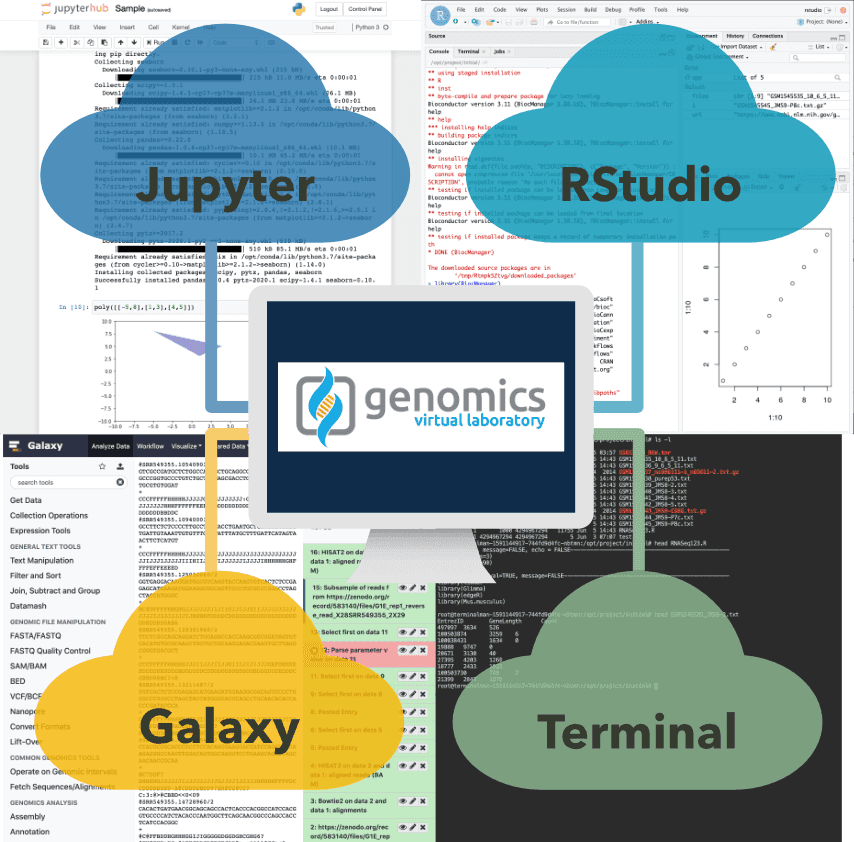

We are happy to announce the latest release of the Genomics Virtual Lab (GVL),
beta3, that brings two new major features:

1. Isolated projects, and
2. Multiple applications.

# GVL projects

Traditionally, the GVL has provided a mechanism for users to obtain
ready-access to a production-grade Galaxy installation on the cloud in a
self-serve model. In that model, users would launch their own instance, first
needing to obtain access to a cloud provider, procure cloud credentials,
navigate the launch process, and then maintain the launched instance in the
long term. The GVL 5.0 release aims to relieve the user from that burden by
providing a platform on which managed GVL deployments can be made available by
groups and institutions. With a managed GVL, researchers simply _start_ a
Galaxy instance, as opposed to _launching_ it. The difference between _start_
and _launch_ is that the managed GVL can provide the cloud resources and the
management software as already running services where users simply claim access
to a new Galaxy instance, running in an isolated containerized environment, and
do not need to provide their own resources or cloud credentials. In many ways
it is similar to how _usegalaxy.*_ servers provide access to a ready-to-use
Galaxy. With the GVL, the goal is to provide a similar service of
easy-to-access Galaxy but for private Galaxy instances.

As a step in this direction, the beta3 release of the GVL 5.0 series introduces
the notion of _projects_. A project is a virtual separation of the environment
in which Galaxy runs. Projects allow multiple Galaxy instances to run
simultaneously on the same underlying resources while each instance is
completely separate. With this capability, individual users or different groups
can obtain a Galaxy instance by simply requesting a new GVL project, without
providing cloud credentials or managing the cloud infrastructure. A GVL
administrator creates a new project and grants the user access. Each Galaxy
instance has its own database, data, and users, separated at the infrastructure
level. This provides isolation and flexibility where different Galaxy instances
can run differentiated toolsets, be supported by different cloud allocations,
or be made available to targeted users.

While a managed deployment of the GVL that anyone can access and request their
Galaxy instance is still an endeavor for the future, the GVL projects are now
available on latest GVL instances launched via CloudLaunch. In turn, the
project feature caters to the classroom or workshop training use cases where
individual participants can have access to their own Galaxy instance,
regardless if they are _using Galaxy_ or _administering Galaxy_.

# Support for multiple applications

In addition to the production installation of Galaxy, the GVL now offers users
access to Jupyter, RStudio, and a web-based Terminal within any GVL project. A
GVL administrator has an option to add applications at-will via Helm Charts.
This multi-application environment significantly expands the capabilities for
data analysis with the GVL. Researchers can seamlessly switch between these
applications and work in an environment most suitable for the task at hand:
interactive Python scripts are within reach in a Jupyter notebook allowing
users to mix code, figures, and text; some 1,500
[Bioconductor](https://www.bioconductor.org/) packages are available for
installation in RStudio; and one-off scripts can be developed in the Terminal.
Meanwhile, Galaxy remains as a graphical interface to workflows and well-known
tools with extensive sharing capabilities. As a user, you have unrestricted
access to those applications and can install any additional packages within
those applications that are needed for the analysis.

Having access to multiple applications on the same platform needs to be
complemented with the ability to easily exchange data between those
applications. In turn, each GVL project comes with a project-scoped data folder
that is available in any of the available applications, mounted under
_/gvl/projects/current/_. For example, a file formatted in the Terminal is
immediately visible in RStudio and can be readily visualized and ingested for
analyses. Similarly, the shared folder can be made available in a Galaxy data
library, although not automatically yet, and subsequently imported into a
History for analysis. The directory being consistent across apps and projects,
ensures the portability of scripts expecting files at that path.

To further facilitate classroom or workshop usage scenarios, each GVL comes
with a folder that is shared across all projects, mounted at _/gvl/public_. Any
file placed in this directory will be simultaneously available in any GVL
project. This folder provides a medium to share common inputs and training
materials, or final results as outcomes from a lecture.

# Use these GVL features

To get started with these features, launch the latest release of the GVL on
your choice of cloud provider using
[CloudLaunch](https://launch.usegalaxy.org/). After the server starts up (~12
minutes on AWS), Galaxy will automatically start and be available at the link
provided. To start Jupyter, RStudio, or Terminal, click the _Add Application_
button on the CloudMan dashboard and select which application you’d like to
add. In a few moments, a link to the selected application will become available
and the application will be ready for use about a minute later.

As with the recent GVL releases
([Feb](https://galaxyproject.org/blog/2020-02-gvl5-beta),
[Apr](https://galaxyproject.org/blog/2020-04-gvl5-beta2)), we are still in beta
but we are approaching the end of adding new features. We will then transition
to improving robustness of the applications as well as write documentation. In
the meantime, please take the GVL for a test drive and [let us
know](https://gitter.im/galaxyproject/FederatedGalaxy) how it feels. **If you
have a good use case that makes use of the multiple applications now available,
please reach out to the authors.** We’d love to work with you to support the
use case, test the platform, and ideally write a paper describing the new
capabilities.
