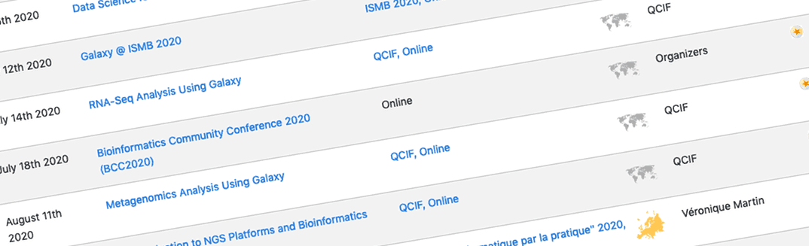
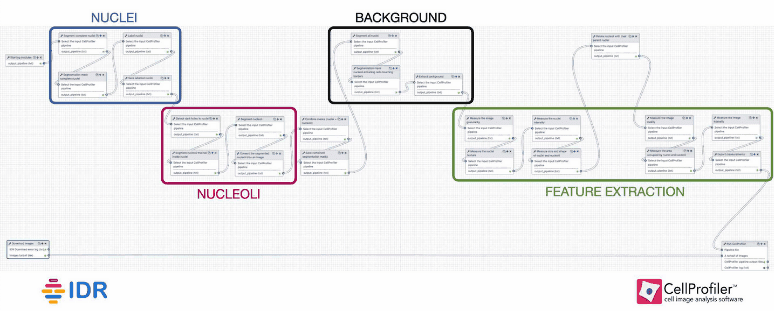

# In the July 2020 issue

* **[BCC2020](#bcc2020-starts-july-17) starts July 17**
    * **Early registration ends July 10**
    * **All registration ends July 15**
    * BoF proposals due July 10
    * Fellowships due July 5
    * Full training, talk, and poster/demo schedules are online
* [Galaxy and the NCBI Sequence Read Archive (SRA)](#galaxy-and-the-ncbi-sequence-read-archive-sra)
* [Upcoming events](#more-upcoming-events)
* [Galaxy Platform News](#galaxy-platforms-news)
* [Training material and doc updates](#doc-hub-and-training-updates)
* [Who's Hiring](#whos-hiring)
* [New blog posts](#galactic-blog-activity)
* [New Releases](#releases)

If you have anything to include to next month's newsletter, then please send it to outreach@galaxyproject.org.

---

# BCC2020 Starts July 17

[BOSC + GCC = BCC2020](https://bcc2020.github.io/)

The [2020 Bioinformatics Community Conference (BCC2020)](https://bcc2020.github.io/) brings together the [Bioinformatics Open Source Conference (BOSC)](https://www.open-bio.org/events/bosc/) and [Galaxy Community Conference](/gcc/).  If you are working in data intensive life science research then there is no better event for sharing your work, and learning from other researchers addressing the challenges of modern data driven biology.  [BCC2020 will be held July 17-26](https://bcc2020.sched.com/), and offer 2 days of training, a 3 day meeting, and a 4 day CollaborationFest.

[Register by July 10 and Save 50%](https://bcc2020.github.io/Registration/)

**BCC2020 early registration [ends July 10](https://bcc2020.github.io/Registration/).**  Registering early saves 50% off of the full rates and starts $3 per training session and $12 for the three day meeting.

**All registration ends on July 15.**

So *get on it.*

If the registration rates for BCC2020 are a barrier to your participation, and you are based in a low, lower-middle, or middle-upper income country ([as defined by the World Bank](https://bit.ly/bcc2020wb)) then you are encouraged to [apply for a BCC2020 Galaxy Fellowship](https://docs.google.com/forms/d/e/1FAIpQLSdTXI2-tdgtDZpj0IqrJAa50rPx3gS5des1MH_lLqSIisoPHA/viewform).  **Applications are due July 5.**

BoF Proposals due July 10

Birds of a Feather (BoFs) are informal, self-organized meetups focused on specific topics. They are a great way to meet other like-minded community members and have an in-depth discussion on a topic of interest.

**Any BCC2020 participant is welcome to [propose a BoF by July 10](https://docs.google.com/forms/d/e/1FAIpQLSdMv8CEKNVGsnwM0S6G2fXWU256hfyhttaKn6az754OoUXXPQ/viewform)!**  BoFs will be scheduled right before and after the main meeting day in both hemispheres.

[Silver Sponsor: GalaxyWorks](https://galaxyworks.io/)

[GalaxyWorks](https://galaxyworks.io/) is a new company providing commercial support, hosting and management, and tool wrapping and custom development for Galaxy. See their [announcement to the Galaxy Community](/news/2020-06-galaxyworks-announcement/) for more. If you are in the business of life science, GalaxyWorks is here to help.

Please welcome GalaxyWorks as a new Silver Sponsor of BCC2020.

[Training at BCC2020](https://bcc2020.sched.com/)

There are **[60 training sessions](https://bcc2020.sched.com/overview/subject/Training), covering 36 topics (18 with a Galaxy emphasis), in 2 hemispheres, all adding up to 9000 minutes, or 150 hours of live instruction.**

Galaxy topics:

* *Introduction to Using Galaxy: [East](https://sched.co/bzFk), [West](https://sched.co/c4bP)*
* *From stars to constellations: Scaling analyses in Galaxy: [East](https://sched.co/c4Pv), [West](https://sched.co/c468)*
* *Adding Fun(ction) to Microbiome Analysis: Metatranscriptomics and Metaproteomics Workflows in Galaxy: [West](https://sched.co/cHYi)*
* *Proteomic data analysis in Galaxy: [West](https://sched.co/cFoU)*
* *Import, handle, visualize and analyze biodiversity data in Galaxy: [East](https://sched.co/c4Py), [West](https://sched.co/c46C)*
* *Processing of Single Cell RNA-Seq Data with Galaxy: [East](https://sched.co/c46L), [West](https://sched.co/c7TP)*
* *Introduction to Machine Learning: [East](https://sched.co/c9GY), [West](https://sched.co/c9GT)*
* *High-throughput molecular dynamics with Galaxy: [East](https://sched.co/cEfa)*
* *RNA-Seq analysis with Galaxy: [East](https://sched.co/c88a), [West (w/ AskOmics)](https://sched.co/c4V7)*
* *Galaxies for Crop Science: [East](https://sched.co/c9H2)*
* *Getting your hands on Climate data: [East](https://sched.co/c44d), [West](https://sched.co/c5gP)*
* *Scripting Galaxy with BioBlend: [East](https://sched.co/c87Q), [West](https://sched.co/c3cW)*
* *Introduction to Galaxy Administration I, II, III: [East](https://sched.co/c3fo)*
* *Galaxy Code Architecture: [East](https://sched.co/c4Q4), [West](https://sched.co/c5at)*
* *Reference data with CVMFS and remote jobs with Pulsar: [East](https://sched.co/c7Ua), [West](https://sched.co/c4VM)*
* *Fit your tools into any platform with Bioconda and BioContainers: [West](https://sched.co/cYGp)*
* *Train the Galaxy Trainer: [East](https://sched.co/c44a), [West](https://sched.co/c7Th)*

You can also [learn about](https://bcc2020.sched.com/) *Git & GitHub, Reactome, R & Bioconductor, InterMine, Glow & Apache Spark, Dockstore, shell, Bionitio, CWL/WDL/Janis/GATK, community, JBrowse, education, Nextflow, and Terra!*

BCC2020 Talk Schedule is Up!

The full BCC2020 talk schedule is now online

* [Keynotes](https://bcc2020.sched.com/subject/Keynote) from [Lincoln Stein](https://bcc2020.sched.com/speaker/lincoln.stein), [Prashanth N Suravajhala](https://bcc2020.sched.com/speaker/prash1), and [Abigail Cabunoc Mayes](https://bcc2020.sched.com/speaker/abbycabs)
* [70 long and lightning talks](https://bcc2020.sched.com/overview/subject/Talk) covering the full spectrum of open source bioinformatics.
* [Posters and demos](https://bcc2020.sched.com/overview/subject/Poster-Demo) too

 

# Galaxy and the NCBI Sequence Read Archive (SRA)

The new Galaxy-SRA Connector

UseGalaxy.org and the NIH Sequence Read Archive are now directly connected, enabling researchers to work with SRA data available from NCBI (https://www.ncbi.nlm.nih.gov/sra/) more easily within the Galaxy framework. This connection was presented in a webinar on June 24.  [Slides and video](/events/2020-06-sra/) from the webinar and a GTN tutorial (see below) are now available.  This functionality will be included in the 2020.05 release.

RFI: Use of Cloud Resources and New File Formats for SRA

NIH has released a request for information (RFI) to solicit community feedback on new proposed Sequence Read Archive (SRA) data formats. Learn more and share your thoughts at https://go.usa.gov/xvhdr.

**The response deadline is July 17th, 2020**. We encourage you all to share with your colleagues and networks, and respond if you are an SRA submitter or data user.

# More Upcoming Events

The coronavirus outbreak has impacted BCC2020, and just about every other event for the rest of the year too.  Most events through the end of August have been postponed or moved online.  We have updated our [list of events](/events/) to reflect what we know.  Some highlights:

[Galaxy Developer Roundtable](/community/devroundtable/)

This [new bi-weekly forum](/community/devroundtable/) is an opportunity for presenters (Galaxy users, developers, admins) to engage with the Galaxy developer community interactively. If you have something you want to present then please submit your idea at least a day in advance.  See you (every other) Thursday.

[Galaxy @ ISMB 2020](/events/2020-ismb/))

[ISMB 2020](https://www.iscb.org/ismb2020) has gone virtual and **[Galaxy is going with it](/events/2020-ismb/): Check out**

* a tutorial,
* a COSI keynote,
* four other talks, and
* eight posters

There are [four upcoming Galaxy Australia workshops offered by QCIF](https://www.qcif.edu.au/training/training-courses/) on  Galaxy, RNA-Seq Analysis, and Metagenomics.  The first one is 14 July.

Upcoming Events

There are

* [17 upcoming events](/events/) (most of them virtual)
* covering, well, everything

And material from some recent past events is now available:

* [Machine Learning using Galaxy](https://elixir-europe.org/events/machine-learning-using-galaxy-webinar-workshop-series), slides and video for this week long course supported by ELIXIR.
* [Galaxy—Powering Science from the Desktop to Global Cyberinfrastructure](https://sciencegateways.org/-/galaxy-powering-science-from-the-desktop-to-global-cyberinfrastructure), slides and video.  A talk presented by Nate Coraor at SGCI June webinar.

# Galaxy Platforms News

The [Galaxy Platform Directory](/use/) lists resources for easily running your analysis on Galaxy, including publicly available servers, cloud services, and containers and VMs that run Galaxy. Here's the recent platform news we know about:

[Galaxy-SynBioCAD](/use/synbiocad/)

The **[Galaxy-SynBioCAD server](https://galaxy-synbiocad.org/)** provides a suite of interoperable and standardized tools for designing pathways from the design specification (choice of the compound, strain) to the DNA parts to be assembled.  SMBL is used for strain and pathway info, and SBOL is used for genetic layouts.  The server comes with a tutorial, FAQ, email support and a QuickStart guide.

[ARIAWeb](/use/ariaweb/)

**[ARIAWeb](https://ariaweb.pasteur.fr/)** supports automated NOE assignment and NMR structure calculation using ARIA (Ambiguous Restraints for Iterative Assignment).  ARIAweb does not look like Galaxy, but it uses the [Galaxy@Pasteur server](/use/galaxy-pasteur/) for data analysis and workflow execution. ARIAWeb has email support and a mailing list.

[UseGalaxy.*](/usegalaxy/) News

* Lots of tool updates on [UseGalaxy.eu](https://galaxyproject.eu/news) and [UseGalaxy.org.au](https://usegalaxy-au.github.io/galaxy/news.html)

# Doc, Hub, and Training Updates

[Custos doc update](/authnz/config/oidc/idps/custos/)

The [documentation for using Custos in Galaxy](/authnz/config/oidc/idps/custos/) got a major update from Juleen Graham and Enis Afgan.

[Custos](https://airavata.apache.org/custos/) is an [NSF-funded
project](https://www.nsf.gov/awardsearch/showAward?AWD_ID=1840003&HistoricalAwards=false) that provides science gateways such as Galaxy with single sign-on, group management, and secret management. Custos authentication for Galaxy is now live on [test.galaxyproject.org](https://test.galaxyproject.org/).

<!-- Search -->

[Galaxy Training Search](https://training.galaxyproject.org/training-material/search)

[Saskia Hiltemann](https://training.galaxyproject.org/training-material/hall-of-fame/shiltemann) has added the much requested site-wide search to the Galaxy Training Materials. Find everything you are interested in, e.g. [all covid19 tutorials](https://training.galaxyproject.org/search?query=covid)

[Nucleoli segmentation and feature extraction using CellProfiler](https://training.galaxyproject.org/training-material/topics/imaging/tutorials/tutorial-CP/tutorial.html)

By [Beatriz Serrano-Solano](https://training.galaxyproject.org/training-material/hall-of-fame/beatrizserrano) and [Jean-Karim Hériché](https://training.galaxyproject.org/training-material/hall-of-fame/jkh1).

Create a workflow that downloads a selection of images from the Image Data Resource, and uses CellProfiler to segment the nuclei and nucleoli. And then extract and export features at three different levels: image, nucleus, nucleolus.

<!-- Profiles -->

[GTN Profiles](https://training.galaxyproject.org/training-material/hall-of-fame)

[Helena Rasche](https://training.galaxyproject.org/training-material/hall-of-fame/hexylena) implemented GTN trainer profile pages, which document their contributions to the Galaxy Training Materials. Check [yours](https://training.galaxyproject.org/training-material/hall-of-fame) out!

<!-- GAT -->

[Updated: Galaxy Server Administration Tutorials](https://training.galaxyproject.org/training-material/topics/admin/)

This set of tutorials was updated by [Helena Rasche](https://training.galaxyproject.org/training-material/hall-of-fame/hexylena) to incorporate feedback and discussion with students, during the most recent Galaxy Administration Training in March 2020. The updates covered topics including Ansible, using clusters, CVMFS, external authentication, distributed compute, tool management, quotas, and job metrics, monitoring, and troubleshooting.

<!-- Matrix -->

[Matrix Chat Support in GTN](https://training.galaxyproject.org/training-material/topics/proteomics/tutorials/maxquant-label-free/tutorial.html)

Thanks to an update by [Saskia Hiltemann](https://training.galaxyproject.org/training-material/hall-of-fame/shiltemann), GTN tutorials now show a link to Matrix chat help at the bottom of the screen.  Authors can configure this to go to topic or tutorial specific chat rooms, or default to the main GTN room.

[Updated: ATAC-Seq data analysis](https://training.galaxyproject.org/training-material/topics/epigenetics/tutorials/atac-seq/tutorial.html)

This tutorial was upgraded by [Lucille Delisle](https://training.galaxyproject.org/training-material/hall-of-fame/lldelisle) to use the latest version of pyGenomeTracks to make publication-quality figures and successfully used in the first official [SIB galaxy Training course](https://www.sib.swiss/training/course/2020-06-galaxy).

# Who's Hiring

[Postdoctoral Pharmacology Fellowship](https://www.indeed.com/viewjob?jk=9cd29813c250492d)

The [US Food and Drug Administration](https://www.fda.gov/home) has an opening for a [Postdoctoral Pharmacology Fellowship](https://www.indeed.com/viewjob?jk=9cd29813c250492d) in Silver Spring, Maryland.

[Data Management Usability Officer](https://vibvzw.jobsoid.com/j/27205/data-management-usability-officer)

[VIB-UGent Center for Plant Systems Biology](http://www.vib.be/en/), Ghent, Belgium

... We are building on the internationally used platform [FAIRDOMhub](https://fairdomhub.org) for data management, and Galaxy (https://www.usegalaxy.be and https://usegalaxy.eu) for data analysis.

[Senior Software Developer](https://boards.greenhouse.io/blackcanyonconsulting/jobs/4013069003)

[Black Canyon Consulting](http://www.bccdc.net/) at NCBI, Bethesda, Maryland, United States

# Galactic Blog Activity

[Multi-tenant, multi-project GVL with Galaxy, Jupyter, Terminal, and RStudio](/news/2020-06-gvl5-beta3/)

By Alexandru Mahmoud, Nuwan Goonasekera, Enis Afgan.

The GVL Beta 3 release features complete analysis on one platform, including training and collaboration.

[Go global and go affordable](https://eventfund.codeforscience.org/go-global-and-go-affordable/)

By [Emily Lescak](https://eventfund.codeforscience.org/author/emily/) of [Code for Science & Society](https://codeforscience.org/)

A conversation with [Dave Clements](/people/dave-clements/) about moving BCC2020 from an in-person to a virtual event, and the opportunities that move enabled.

# Releases

See the GVL Beta 3 release [described in the blog](/news/2020-06-gvl5-beta3/) (and above).

[Galaxy 20.05](/news/2020-06-galaxy-release-20-05/)

See

* **[Developer and admin release announcement](https://docs.galaxyproject.org/en/master/releases/20.05_announce.html)**
* **[User release announcement](https://docs.galaxyproject.org/en/master/releases/20.05_announce_user.html)**.

Features:

* Many new Interactive Tools
* Data Tables can now be backed by refgenie
* Tool Shed is now Python3 ready, ending a 4 year effort to get to Python 3.
* The Workflow Editor and Workflow Run Form have been re-written in Vue.js.
* Faster startup: Galaxy now caches expanded tool documents, delays creating the tool search index until after startup and creates search indexes incrementally.

[Galaxy Workflow Executor 0.2.1](https://pypi.org/project/galaxy-workflow-executor/0.2.1/)

Execute workflows on Galaxy using a command line interface, and YAML to specify inputs and parameters.

# Publications

We did not curate recent publications this month.  We just ran out of time.  We probably won't get to them until after BCC either.  However, the next time we curate papers, we will hit 10,000 publications.  *Thanks for using (and citing) Galaxy.*

