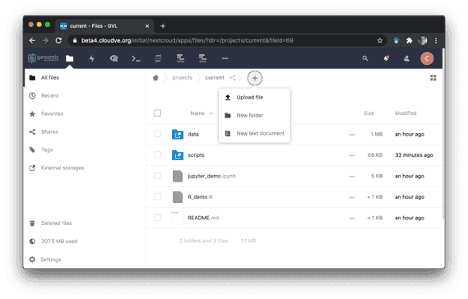

Less than a month ago we shared the news about the [beta3 release of GVL
5](https://galaxyproject.org/blog/2020-06-gvl5-beta3/), which introduced
isolated projects within a GVL and additional applications alongside Galaxy. In
this beta4 release, we would like to announce availability of a data browser,
project-level isolation, and availability of the latest release of Galaxy.

# GVL data browser

Starting with the beta3 release of the GVL, there was a notion of shared
storage between different applications and across GVL projects that enables
users to easily access the same data between those applications. Namely, each
GVL project comes with a project-scoped data folder that is available in the
available applications, mounted under _/gvl/projects/current/_. For example, a
file formatted in the Terminal is immediately visible in RStudio under the same
path and can be readily visualized and ingested for analyses. Additionally,
each GVL comes with a folder that is shared across all projects, available at
_/gvl/public_. Any file placed in this directory will be simultaneously
available in any project on the given GVL instance.

For the beta4 release we have added a visual data browser that allows users to
upload and navigate around their GVL data from anywhere. Based on
[NextCloud](https://nextcloud.com/), a user can access their GVL data using a
web browser, a desktop app, or a mobile app. Data can be organized into folders
using drag-and-drop, text files can be previewed, and even mounted as an
external drive on the user’s local laptop to interact with it as if it was a
local folder. Think of the GVL as your data repository in the cloud.

The data browser also provides the ability to connect buckets from AWS S3 or
OpenStack and make them available within the GVL. Once a user attaches a bucket
as external storage, data can be copied from the bucket into one of the folders
available to the GVL applications. Similarly, any data generated on the GVL can
be copied or moved to a bucket for persistence and further sharing. The
screenshot below captures the contents of an S3 bucket viewed through the AWS
web console and the content of that same bucket linked to a GVL instance.

Finally, the project folders available on the GVL are automatically backed up
to the respective cloud provider’s object storage service. In the case of AWS,
an S3 bucket is created for a GVL and any data uploaded or generated on the GVL
is synchronized to that bucket using the same folder structure as what is
created on the GVL. Just like the GVL, these backups work for AWS, OpenStack,
and GCP clouds. The backups provide a new level of redundancy for the GVLs that
minimize chances for data loss or corruption as well as enable service recovery
in case the GVL servers are unexpectedly lost.

# Project-level isolation

With the introduction of GVL projects in the previous release the vision for a
hosted GVL that caters to different needs of users while minimizing
infrastructure management overhead came one big step closer to reality.
However, the initial implementation provided no isolation between projects for
users - any user could access any project. For single-user Galaxy instances or
private group instances this was not sufficient. While more work remains to
ensure proper service isolation, an initial implementation is now available
that restricts user access to projects. Managed through Keycloak roles, when a
new project is created, a new GVL user is also created that is the sole user
authorized to access the newly created projects. Additional users can be added
by an admin via the Keycloak web console. When a user logs in, they now see
only the projects that are available to them and can switch between them from
the CloudMan console. However, it is also possible to easily collaborate
between multiple projects that users have access to. Projects can share data
between each other using the public shared folder, or by mounting the project’s
data into another project, provided the user has permissions.

# Update to latest Galaxy: 20.05

A new version of Galaxy was recently announced, [release
20.05](https://galaxyproject.org/news/2020-06-galaxy-release-20-05/). This
release brings an accelerated Galaxy startup and a complete rewrite of the
workflow editor and run form that are noticeably snappier among many other
[user
upgrades](https://docs.galaxyproject.org/en/master/releases/20.05_announce_user.html)
and [developer
improvements](https://docs.galaxyproject.org/en/master/releases/20.05_announce.html).
The GVL beta4 has incorporated this release of Galaxy and any new GVL will
automatically use Galaxy 20.05.

# tl; dr;

This new GVL release allows you to

* Provides a powerful data management interface through NextCloud - allowing
  you to upload data to the GVL, or use GVL data locally just as if it were a
  local folder
* Easily connect external storage including AWS S3 buckets, OpenStack buckets,
  FTP servers, or webdav folders
* Enforces project level isolation - users can only interact with projects they
  have been assigned to
* Share data between projects easily by mounting them through webdav or through
  public folders
* Updates Galaxy to the latest release
