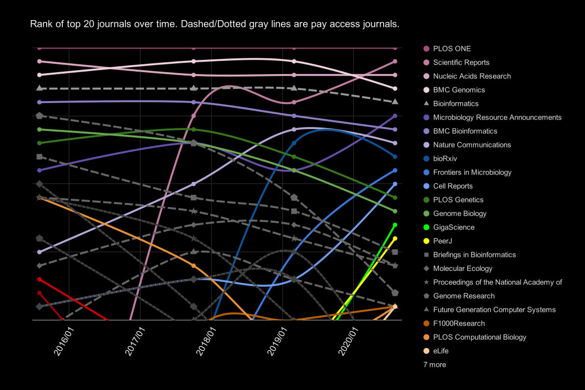

---

date: '2020-08-26'
title: "Galaxy: the first 10,000 pubs "
tease: "The Galaxy Publication Library hits a milestone"
image: /images/logos/zotero-logo-small-trans.png
authors: "Dave Clements"
source_blog: "Galaxy Project Blog"
source_blog_url: "https://galaxyproject.org/blog/2020-08-10k-pubs/"
---

We reached 10,000 publications in the [Galaxy Publication Library](https://www.zotero.org/groups/1732893/galaxy) this month.  This library tracks publications that use, extend, implement or reference Galaxy or Galaxy-based platforms.  It includes journal articles, theses, book chapters, preprints, and a couple more odds and ends.  This milestone is a good opportunity to look at what the library tells us about where the Galaxy project has been, and maybe where it's going as well.

The library was started December 2011, when the first 168 galaxy related publications were added and classified using [8 tags](#more-on-tags).  This included all project publications plus every pub that our *ad hoc* literature searches could find at the time.  The library started on CiteULike and stayed there until September 2017, when we [moved it to Zotero](/news/2017-09-publication-lib-on-zotero/). The library had 4500 publications by the time we moved to Zotero.

The library uses *tags* to indicate how publications relate to Galaxy.  See below for an [explanation and history of the tags](#more-on-tags).

 

# Publications and Tags Over Time

<table class="table">
  <tr style="height: 8rem;">
    <th style="vertical-align: bottom;"> Year </th>
    <th style="vertical-align: bottom;"> # Pubs </th>
    <th> </th>
    <th style="max-width: 3rem; vertical-align: middle; transform: translate(0rem, 2.5rem) rotate(290deg);"> <a href="https://www.zotero.org/groups/1732893/galaxy/items/tags/+Methods">Methods</a> </th>
    <th style="max-width: 3rem; vertical-align: middle; transform: translate(0rem, 2.5rem) rotate(290deg);"> <a href="https://www.zotero.org/groups/1732893/galaxy/items/tags/+UsePublic">UsePublic</a> </th>
    <th style="max-width: 3rem; vertical-align: middle; transform: translate(0rem, 2.5rem) rotate(290deg);"> <a href="https://www.zotero.org/groups/1732893/galaxy/items/tags/+Workbench">Workbench</a> </th>
    <th style="max-width: 3rem; vertical-align: middle; transform: translate(0rem, 2.5rem) rotate(290deg);"> <a href="https://www.zotero.org/groups/1732893/galaxy/items/tags/+UseMain">UseMain</a> </th>
    <th style="max-width: 3rem; vertical-align: middle; transform: translate(0rem, 2.5rem) rotate(290deg);"> <a href="https://www.zotero.org/groups/1732893/galaxy/items/tags/+RefPublic">RefPublic</a> </th>
    <th style="max-width: 3rem; vertical-align: middle; transform: translate(0rem, 2.5rem) rotate(290deg);"> <a href="https://www.zotero.org/groups/1732893/galaxy/items/tags/+UseLocal">UseLocal</a> </th>
    <th style="max-width: 3rem; vertical-align: middle; transform: translate(0rem, 2.5rem) rotate(290deg);"> <a href="https://www.zotero.org/groups/1732893/galaxy/items/tags/+Tools">Tools</a> </th>
    <th style="max-width: 3rem; vertical-align: middle; transform: translate(0rem, 2.5rem) rotate(290deg);"> <a href="https://www.zotero.org/groups/1732893/galaxy/items/tags/+IsGalaxy">IsGalaxy</a> </th>
    <th style="max-width: 3rem; vertical-align: middle; transform: translate(0rem, 2.5rem) rotate(290deg);"> <a href="https://www.zotero.org/groups/1732893/galaxy/items/tags/+Reproducibility">Reproducibility</a> </th>
    <th style="max-width: 3rem; vertical-align: middle; transform: translate(0rem, 2.5rem) rotate(290deg);"> <a href="https://www.zotero.org/groups/1732893/galaxy/items/tags/+Cloud">Cloud</a> </th>
    <th style="max-width: 3rem; vertical-align: middle; transform: translate(0rem, 2.5rem) rotate(290deg);"> <a href="https://www.zotero.org/groups/1732893/galaxy/items/tags/+Other">Other</a> </th>
    <th style="max-width: 3rem; vertical-align: middle; transform: translate(0rem, 2.5rem) rotate(290deg);"> <a href="https://www.zotero.org/groups/1732893/galaxy/items/tags/+Shared">Shared</a> </th>
    <th style="max-width: 3rem; vertical-align: middle; transform: translate(0rem, 2.5rem) rotate(290deg);"> <a href="https://www.zotero.org/groups/1732893/galaxy/items/tags/+Unknown">Unknown</a> </th>
    <th style="max-width: 3rem; vertical-align: middle; transform: translate(0rem, 2.5rem) rotate(290deg);"> <a href="https://www.zotero.org/groups/1732893/galaxy/items/tags/+HowTo">HowTo</a> </th>
    <th style="max-width: 3rem; vertical-align: middle; transform: translate(0rem, 2.5rem) rotate(290deg);"> <a href="https://www.zotero.org/groups/1732893/galaxy/items/tags/+Project">Project</a> </th>
    <th style="max-width: 3rem; vertical-align: middle; transform: translate(0rem, 2.5rem) rotate(290deg);"> <a href="https://www.zotero.org/groups/1732893/galaxy/items/tags/+Visualization">Visualization</a> </th>
    <th style="max-width: 3rem; vertical-align: middle; transform: translate(0rem, 2.5rem) rotate(290deg);"> <a href="https://www.zotero.org/groups/1732893/galaxy/items/tags/+Education">Education</a> </th>
    <th style="max-width: 3rem; vertical-align: middle; transform: translate(0rem, 2.5rem) rotate(290deg);"> <a href="https://www.zotero.org/groups/1732893/galaxy/items/tags/+UseCloud">UseCloud</a> </th>
  </tr>
  <tr>
    <th> 2005 </th>
    <td  style="text-align: right; background-color: #f2faf2;" > 1 </td>
    <td> </td>
    <td >  </td>
    <td >  </td>
    <td >  </td>
    <td >  </td>
    <td >  </td>
    <td >  </td>
    <td >  </td>
    <td >  </td>
    <td >  </td>
    <td >  </td>
    <td >  </td>
    <td >  </td>
    <td >  </td>
    <td >  </td>
    <td  style="text-align: right; background-color: #f2faf2;" > 1 </td>
    <td >  </td>
    <td >  </td>
    <td >  </td>
  </tr>
  <tr>
    <th> 2006 </th>
    <td  style="text-align: right; background-color: #e2f4e2;" > 4 </td>
    <td> </td>
    <td >  </td>
    <td >  </td>
    <td  style="text-align: right; background-color: #e6f6e6;" > 3 </td>
    <td >  </td>
    <td >  </td>
    <td >  </td>
    <td >  </td>
    <td >  </td>
    <td >  </td>
    <td >  </td>
    <td >  </td>
    <td >  </td>
    <td >  </td>
    <td  style="text-align: right; background-color: #f2faf2;" > 1 </td>
    <td >  </td>
    <td >  </td>
    <td >  </td>
    <td >  </td>
  </tr>
  <tr>
    <th> 2007 </th>
    <td  style="text-align: right; background-color: #d1eed1;" > 12 </td>
    <td> </td>
    <td  style="text-align: right; background-color: #ebf8eb;" > 2 </td>
    <td >  </td>
    <td  style="text-align: right; background-color: #d9f1d9;" > 7 </td>
    <td >  </td>
    <td >  </td>
    <td >  </td>
    <td >  </td>
    <td >  </td>
    <td >  </td>
    <td  style="text-align: right; background-color: #f2faf2;" > 1 </td>
    <td >  </td>
    <td >  </td>
    <td >  </td>
    <td  style="text-align: right; background-color: #ebf8eb;" > 2 </td>
    <td  style="text-align: right; background-color: #ebf8eb;" > 2 </td>
    <td >  </td>
    <td >  </td>
    <td >  </td>
  </tr>
  <tr>
    <th> 2008 </th>
    <td  style="text-align: right; background-color: #c0e7c0;" > 32 </td>
    <td> </td>
    <td  style="text-align: right; background-color: #cdeccd;" > 15 </td>
    <td >  </td>
    <td  style="text-align: right; background-color: #d1eed1;" > 12 </td>
    <td  style="text-align: right; background-color: #f2faf2;" > 1 </td>
    <td >  </td>
    <td >  </td>
    <td >  </td>
    <td  style="text-align: right; background-color: #ebf8eb;" > 2 </td>
    <td >  </td>
    <td >  </td>
    <td >  </td>
    <td >  </td>
    <td  style="text-align: right; background-color: #ebf8eb;" > 2 </td>
    <td >  </td>
    <td  style="text-align: right; background-color: #f2faf2;" > 1 </td>
    <td  style="text-align: right; background-color: #f2faf2;" > 1 </td>
    <td >  </td>
    <td >  </td>
  </tr>
  <tr>
    <th> 2009 </th>
    <td  style="text-align: right; background-color: #b7e4b7;" > 52 </td>
    <td> </td>
    <td  style="text-align: right; background-color: #c3e9c3;" > 26 </td>
    <td >  </td>
    <td  style="text-align: right; background-color: #caebca;" > 18 </td>
    <td >  </td>
    <td >  </td>
    <td >  </td>
    <td  style="text-align: right; background-color: #e6f6e6;" > 3 </td>
    <td  style="text-align: right; background-color: #ebf8eb;" > 2 </td>
    <td >  </td>
    <td >  </td>
    <td  style="text-align: right; background-color: #f2faf2;" > 1 </td>
    <td  style="text-align: right; background-color: #f2faf2;" > 1 </td>
    <td  style="text-align: right; background-color: #e2f4e2;" > 4 </td>
    <td  style="text-align: right; background-color: #f2faf2;" > 1 </td>
    <td  style="text-align: right; background-color: #f2faf2;" > 1 </td>
    <td >  </td>
    <td >  </td>
    <td >  </td>
  </tr>
  <tr>
    <th> 2010 </th>
    <td  style="text-align: right; background-color: #aadfaa;" > 107 </td>
    <td> </td>
    <td  style="text-align: right; background-color: #b8e4b8;" > 50 </td>
    <td >  </td>
    <td  style="text-align: right; background-color: #bee6be;" > 36 </td>
    <td  style="text-align: right; background-color: #f2faf2;" > 1 </td>
    <td >  </td>
    <td >  </td>
    <td  style="text-align: right; background-color: #f2faf2;" > 1 </td>
    <td  style="text-align: right; background-color: #dff3df;" > 5 </td>
    <td >  </td>
    <td >  </td>
    <td  style="text-align: right; background-color: #f2faf2;" > 1 </td>
    <td  style="text-align: right; background-color: #f2faf2;" > 1 </td>
    <td  style="text-align: right; background-color: #d9f1d9;" > 7 </td>
    <td  style="text-align: right; background-color: #e2f4e2;" > 4 </td>
    <td  style="text-align: right; background-color: #dff3df;" > 5 </td>
    <td >  </td>
    <td >  </td>
    <td >  </td>
  </tr>
  <tr>
    <th> 2011 </th>
    <td  style="text-align: right; background-color: #9fdb9f;" > 205 </td>
    <td> </td>
    <td  style="text-align: right; background-color: #ade0ad;" > 93 </td>
    <td >  </td>
    <td  style="text-align: right; background-color: #b2e2b2;" > 69 </td>
    <td  style="text-align: right; background-color: #f2faf2;" > 1 </td>
    <td >  </td>
    <td >  </td>
    <td  style="text-align: right; background-color: #d7f0d7;" > 8 </td>
    <td  style="text-align: right; background-color: #cceccc;" > 16 </td>
    <td  style="text-align: right; background-color: #dcf2dc;" > 6 </td>
    <td  style="text-align: right; background-color: #e6f6e6;" > 3 </td>
    <td >  </td>
    <td  style="text-align: right; background-color: #d7f0d7;" > 8 </td>
    <td  style="text-align: right; background-color: #e6f6e6;" > 3 </td>
    <td  style="text-align: right; background-color: #e2f4e2;" > 4 </td>
    <td  style="text-align: right; background-color: #dcf2dc;" > 6 </td>
    <td  style="text-align: right; background-color: #f2faf2;" > 1 </td>
    <td  style="text-align: right; background-color: #f2faf2;" > 1 </td>
    <td >  </td>
  </tr>
  <tr>
    <th> 2012 </th>
    <td  style="text-align: right; background-color: #93d693;" > 398 </td>
    <td> </td>
    <td  style="text-align: right; background-color: #9fdb9f;" > 197 </td>
    <td  style="text-align: right; background-color: #f2faf2;" > 1 </td>
    <td  style="text-align: right; background-color: #a7dea7;" > 128 </td>
    <td  style="text-align: right; background-color: #e6f6e6;" > 3 </td>
    <td >  </td>
    <td  style="text-align: right; background-color: #e6f6e6;" > 3 </td>
    <td  style="text-align: right; background-color: #c1e8c1;" > 30 </td>
    <td  style="text-align: right; background-color: #cdeccd;" > 15 </td>
    <td  style="text-align: right; background-color: #d9f1d9;" > 7 </td>
    <td  style="text-align: right; background-color: #ceedce;" > 14 </td>
    <td  style="text-align: right; background-color: #d5efd5;" > 9 </td>
    <td  style="text-align: right; background-color: #d1eed1;" > 12 </td>
    <td  style="text-align: right; background-color: #d4efd4;" > 10 </td>
    <td  style="text-align: right; background-color: #d1eed1;" > 12 </td>
    <td  style="text-align: right; background-color: #d4efd4;" > 10 </td>
    <td  style="text-align: right; background-color: #ebf8eb;" > 2 </td>
    <td  style="text-align: right; background-color: #f2faf2;" > 1 </td>
    <td >  </td>
  </tr>
  <tr>
    <th> 2013 </th>
    <td  style="text-align: right; background-color: #8ed58e;" > 506 </td>
    <td> </td>
    <td  style="text-align: right; background-color: #9ad99a;" > 264 </td>
    <td  style="text-align: right; background-color: #cceccc;" > 16 </td>
    <td  style="text-align: right; background-color: #a4dda4;" > 149 </td>
    <td  style="text-align: right; background-color: #ade0ad;" > 92 </td>
    <td  style="text-align: right; background-color: #d1eed1;" > 12 </td>
    <td  style="text-align: right; background-color: #c2e8c2;" > 28 </td>
    <td  style="text-align: right; background-color: #bde6bd;" > 37 </td>
    <td  style="text-align: right; background-color: #c2e8c2;" > 28 </td>
    <td  style="text-align: right; background-color: #d5efd5;" > 9 </td>
    <td  style="text-align: right; background-color: #c6eac6;" > 22 </td>
    <td  style="text-align: right; background-color: #d5efd5;" > 9 </td>
    <td  style="text-align: right; background-color: #c6eac6;" > 22 </td>
    <td  style="text-align: right; background-color: #cfedcf;" > 13 </td>
    <td  style="text-align: right; background-color: #d9f1d9;" > 7 </td>
    <td  style="text-align: right; background-color: #dcf2dc;" > 6 </td>
    <td  style="text-align: right; background-color: #e6f6e6;" > 3 </td>
    <td  style="text-align: right; background-color: #e6f6e6;" > 3 </td>
    <td  style="text-align: right; background-color: #ebf8eb;" > 2 </td>
  </tr>
  <tr>
    <th> 2014 </th>
    <td  style="text-align: right; background-color: #88d288;" > 741 </td>
    <td> </td>
    <td  style="text-align: right; background-color: #96d796;" > 331 </td>
    <td  style="text-align: right; background-color: #b5e3b5;" > 60 </td>
    <td  style="text-align: right; background-color: #9dda9d;" > 226 </td>
    <td  style="text-align: right; background-color: #ace0ac;" > 98 </td>
    <td  style="text-align: right; background-color: #c1e8c1;" > 30 </td>
    <td  style="text-align: right; background-color: #bbe5bb;" > 43 </td>
    <td  style="text-align: right; background-color: #b3e2b3;" > 67 </td>
    <td  style="text-align: right; background-color: #b9e4b9;" > 48 </td>
    <td  style="text-align: right; background-color: #c4e9c4;" > 25 </td>
    <td  style="text-align: right; background-color: #bce6bc;" > 40 </td>
    <td  style="text-align: right; background-color: #bce6bc;" > 39 </td>
    <td  style="text-align: right; background-color: #c6e9c6;" > 23 </td>
    <td  style="text-align: right; background-color: #d9f1d9;" > 7 </td>
    <td  style="text-align: right; background-color: #d1eed1;" > 12 </td>
    <td  style="text-align: right; background-color: #d9f1d9;" > 7 </td>
    <td  style="text-align: right; background-color: #d7f0d7;" > 8 </td>
    <td  style="text-align: right; background-color: #ebf8eb;" > 2 </td>
    <td  style="text-align: right; background-color: #f2faf2;" > 1 </td>
  </tr>
  <tr>
    <th> 2015 </th>
    <td  style="text-align: right; background-color: #84d084;" > 929 </td>
    <td> </td>
    <td  style="text-align: right; background-color: #90d590;" > 473 </td>
    <td  style="text-align: right; background-color: #a6dda6;" > 140 </td>
    <td  style="text-align: right; background-color: #9cda9c;" > 233 </td>
    <td  style="text-align: right; background-color: #a9dfa9;" > 116 </td>
    <td  style="text-align: right; background-color: #b7e4b7;" > 52 </td>
    <td  style="text-align: right; background-color: #b5e3b5;" > 58 </td>
    <td  style="text-align: right; background-color: #b3e2b3;" > 68 </td>
    <td  style="text-align: right; background-color: #b8e4b8;" > 49 </td>
    <td  style="text-align: right; background-color: #c3e9c3;" > 26 </td>
    <td  style="text-align: right; background-color: #b9e4b9;" > 48 </td>
    <td  style="text-align: right; background-color: #bfe7bf;" > 33 </td>
    <td  style="text-align: right; background-color: #c6e9c6;" > 23 </td>
    <td  style="text-align: right; background-color: #ceedce;" > 14 </td>
    <td  style="text-align: right; background-color: #d7f0d7;" > 8 </td>
    <td  style="text-align: right; background-color: #d2eed2;" > 11 </td>
    <td  style="text-align: right; background-color: #d9f1d9;" > 7 </td>
    <td  style="text-align: right; background-color: #f2faf2;" > 1 </td>
    <td  style="text-align: right; background-color: #e6f6e6;" > 3 </td>
  </tr>
  <tr>
    <th> 2016 </th>
    <td  style="text-align: right; background-color: #80cf80;" > 1125 </td>
    <td> </td>
    <td  style="text-align: right; background-color: #8cd48c;" > 575 </td>
    <td  style="text-align: right; background-color: #9eda9e;" > 213 </td>
    <td  style="text-align: right; background-color: #9bd99b;" > 246 </td>
    <td  style="text-align: right; background-color: #a9dfa9;" > 115 </td>
    <td  style="text-align: right; background-color: #a9dfa9;" > 116 </td>
    <td  style="text-align: right; background-color: #b2e2b2;" > 72 </td>
    <td  style="text-align: right; background-color: #b1e2b1;" > 73 </td>
    <td  style="text-align: right; background-color: #b8e4b8;" > 49 </td>
    <td  style="text-align: right; background-color: #b9e5b9;" > 46 </td>
    <td  style="text-align: right; background-color: #bde6bd;" > 37 </td>
    <td  style="text-align: right; background-color: #b9e5b9;" > 47 </td>
    <td  style="text-align: right; background-color: #c9ebc9;" > 19 </td>
    <td  style="text-align: right; background-color: #cfedcf;" > 13 </td>
    <td  style="text-align: right; background-color: #c8eac8;" > 20 </td>
    <td  style="text-align: right; background-color: #d9f1d9;" > 7 </td>
    <td  style="text-align: right; background-color: #d5efd5;" > 9 </td>
    <td  style="text-align: right; background-color: #ebf8eb;" > 2 </td>
    <td  style="text-align: right; background-color: #e2f4e2;" > 4 </td>
  </tr>
  <tr>
    <th> 2017 </th>
    <td  style="text-align: right; background-color: #7dce7d;" > 1333 </td>
    <td> </td>
    <td  style="text-align: right; background-color: #87d287;" > 760 </td>
    <td  style="text-align: right; background-color: #99d999;" > 279 </td>
    <td  style="text-align: right; background-color: #9cda9c;" > 239 </td>
    <td  style="text-align: right; background-color: #a6dda6;" > 138 </td>
    <td  style="text-align: right; background-color: #aadfaa;" > 110 </td>
    <td  style="text-align: right; background-color: #ace0ac;" > 98 </td>
    <td  style="text-align: right; background-color: #b1e1b1;" > 76 </td>
    <td  style="text-align: right; background-color: #b2e2b2;" > 72 </td>
    <td  style="text-align: right; background-color: #b2e2b2;" > 72 </td>
    <td  style="text-align: right; background-color: #bee7be;" > 35 </td>
    <td  style="text-align: right; background-color: #c4e9c4;" > 25 </td>
    <td  style="text-align: right; background-color: #c5e9c5;" > 24 </td>
    <td  style="text-align: right; background-color: #c6e9c6;" > 23 </td>
    <td  style="text-align: right; background-color: #d7f0d7;" > 8 </td>
    <td  style="text-align: right; background-color: #dcf2dc;" > 6 </td>
    <td  style="text-align: right; background-color: #d9f1d9;" > 7 </td>
    <td  style="text-align: right; background-color: #dff3df;" > 5 </td>
    <td  style="text-align: right; background-color: #f2faf2;" > 1 </td>
  </tr>
  <tr>
    <th> 2018 </th>
    <td  style="text-align: right; background-color: #7acd7a;" > 1578 </td>
    <td> </td>
    <td  style="text-align: right; background-color: #82d082;" > 1028 </td>
    <td  style="text-align: right; background-color: #94d794;" > 373 </td>
    <td  style="text-align: right; background-color: #9cda9c;" > 236 </td>
    <td  style="text-align: right; background-color: #a1dba1;" > 185 </td>
    <td  style="text-align: right; background-color: #a6dda6;" > 138 </td>
    <td  style="text-align: right; background-color: #aadfaa;" > 110 </td>
    <td  style="text-align: right; background-color: #b8e4b8;" > 51 </td>
    <td  style="text-align: right; background-color: #b9e5b9;" > 46 </td>
    <td  style="text-align: right; background-color: #b1e1b1;" > 76 </td>
    <td  style="text-align: right; background-color: #c2e8c2;" > 28 </td>
    <td  style="text-align: right; background-color: #caebca;" > 18 </td>
    <td  style="text-align: right; background-color: #c3e9c3;" > 26 </td>
    <td  style="text-align: right; background-color: #c4e9c4;" > 25 </td>
    <td  style="text-align: right; background-color: #cceccc;" > 16 </td>
    <td  style="text-align: right; background-color: #d7f0d7;" > 8 </td>
    <td  style="text-align: right; background-color: #dcf2dc;" > 6 </td>
    <td  style="text-align: right; background-color: #dcf2dc;" > 6 </td>
    <td  style="text-align: right; background-color: #e6f6e6;" > 3 </td>
  </tr>
  <tr>
    <th> 2019 </th>
    <td  style="text-align: right; background-color: #76cb76;" > 1926 </td>
    <td> </td>
    <td  style="text-align: right; background-color: #7dce7d;" > 1310 </td>
    <td  style="text-align: right; background-color: #8cd48c;" > 579 </td>
    <td  style="text-align: right; background-color: #9cda9c;" > 236 </td>
    <td  style="text-align: right; background-color: #9fdb9f;" > 205 </td>
    <td  style="text-align: right; background-color: #a2dca2;" > 167 </td>
    <td  style="text-align: right; background-color: #a5dda5;" > 144 </td>
    <td  style="text-align: right; background-color: #b4e3b4;" > 64 </td>
    <td  style="text-align: right; background-color: #b8e4b8;" > 51 </td>
    <td  style="text-align: right; background-color: #afe1af;" > 82 </td>
    <td  style="text-align: right; background-color: #c6eac6;" > 22 </td>
    <td  style="text-align: right; background-color: #cbebcb;" > 17 </td>
    <td  style="text-align: right; background-color: #c4e9c4;" > 25 </td>
    <td  style="text-align: right; background-color: #dff3df;" > 5 </td>
    <td  style="text-align: right; background-color: #d1eed1;" > 12 </td>
    <td  style="text-align: right; background-color: #dcf2dc;" > 6 </td>
    <td  style="text-align: right; background-color: #e2f4e2;" > 4 </td>
    <td  style="text-align: right; background-color: #d1eed1;" > 12 </td>
    <td  style="text-align: right; background-color: #ebf8eb;" > 2 </td>
  </tr>
  <tr>
    <th> 2020 </th>
    <td  style="text-align: right; background-color: #7cce7c;" > 1405 </td>
    <td> </td>
    <td  style="text-align: right; background-color: #82d082;" > 1018 </td>
    <td  style="text-align: right; background-color: #91d591;" > 452 </td>
    <td  style="text-align: right; background-color: #a6dea6;" > 134 </td>
    <td  style="text-align: right; background-color: #a2dca2;" > 173 </td>
    <td  style="text-align: right; background-color: #abdfab;" > 106 </td>
    <td  style="text-align: right; background-color: #ace0ac;" > 96 </td>
    <td  style="text-align: right; background-color: #b8e4b8;" > 50 </td>
    <td  style="text-align: right; background-color: #bbe5bb;" > 42 </td>
    <td  style="text-align: right; background-color: #bde6bd;" > 38 </td>
    <td  style="text-align: right; background-color: #d2eed2;" > 11 </td>
    <td  style="text-align: right; background-color: #d2eed2;" > 11 </td>
    <td  style="text-align: right; background-color: #d7f0d7;" > 8 </td>
    <td  style="text-align: right; background-color: #e2f4e2;" > 4 </td>
    <td  style="text-align: right; background-color: #dff3df;" > 5 </td>
    <td  style="text-align: right; background-color: #d7f0d7;" > 8 </td>
    <td  style="text-align: right; background-color: #d7f0d7;" > 8 </td>
    <td  style="text-align: right; background-color: #cdeccd;" > 15 </td>
    <td  style="text-align: right; background-color: #f2faf2;" > 1 </td>
  </tr>
  <tr>
    <th> 2021 </th>
    <td  style="text-align: right; background-color: #dcf2dc;" > 6 </td>
    <td> </td>
    <td  style="text-align: right; background-color: #ebf8eb;" > 2 </td>
    <td  style="text-align: right; background-color: #f2faf2;" > 1 </td>
    <td  style="text-align: right; background-color: #e6f6e6;" > 3 </td>
    <td >  </td>
    <td >  </td>
    <td >  </td>
    <td >  </td>
    <td >  </td>
    <td >  </td>
    <td >  </td>
    <td >  </td>
    <td >  </td>
    <td  style="text-align: right; background-color: #f2faf2;" > 1 </td>
    <td >  </td>
    <td >  </td>
    <td >  </td>
    <td >  </td>
    <td >  </td>
  </tr>
  <tr>
    <th> Total </th>
    <th  style="text-align: right; background-color: #58c058;" > 10360 </th>
    <th> </th>
    <th  style="text-align: right; background-color: #61c461;" > <a href="https://www.zotero.org/groups/1732893/galaxy/items/tags/+Methods">6144</a> </th>
    <th  style="text-align: right; background-color: #75cb75;" > <a href="https://www.zotero.org/groups/1732893/galaxy/items/tags/+UsePublic">2114</a> </th>
    <th  style="text-align: right; background-color: #76cb76;" > <a href="https://www.zotero.org/groups/1732893/galaxy/items/tags/+Workbench">1975</a> </th>
    <th  style="text-align: right; background-color: #80cf80;" > <a href="https://www.zotero.org/groups/1732893/galaxy/items/tags/+UseMain">1128</a> </th>
    <th  style="text-align: right; background-color: #88d288;" > <a href="https://www.zotero.org/groups/1732893/galaxy/items/tags/+RefPublic">731</a> </th>
    <th  style="text-align: right; background-color: #8ad38a;" > <a href="https://www.zotero.org/groups/1732893/galaxy/items/tags/+UseLocal">652</a> </th>
    <th  style="text-align: right; background-color: #8ed48e;" > <a href="https://www.zotero.org/groups/1732893/galaxy/items/tags/+Tools">528</a> </th>
    <th  style="text-align: right; background-color: #92d692;" > <a href="https://www.zotero.org/groups/1732893/galaxy/items/tags/+IsGalaxy">425</a> </th>
    <th  style="text-align: right; background-color: #93d693;" > <a href="https://www.zotero.org/groups/1732893/galaxy/items/tags/+Reproducibility">387</a> </th>
    <th  style="text-align: right; background-color: #9ad99a;" > <a href="https://www.zotero.org/groups/1732893/galaxy/items/tags/+Cloud">261</a> </th>
    <th  style="text-align: right; background-color: #9edb9e;" > <a href="https://www.zotero.org/groups/1732893/galaxy/items/tags/+Other">210</a> </th>
    <th  style="text-align: right; background-color: #a0dba0;" > <a href="https://www.zotero.org/groups/1732893/galaxy/items/tags/+Shared">192</a> </th>
    <th  style="text-align: right; background-color: #a7dea7;" > <a href="https://www.zotero.org/groups/1732893/galaxy/items/tags/+Unknown">131</a> </th>
    <th  style="text-align: right; background-color: #aadfaa;" > <a href="https://www.zotero.org/groups/1732893/galaxy/items/tags/+HowTo">112</a> </th>
    <th  style="text-align: right; background-color: #afe1af;" > <a href="https://www.zotero.org/groups/1732893/galaxy/items/tags/+Project">85</a> </th>
    <th  style="text-align: right; background-color: #b6e3b6;" > <a href="https://www.zotero.org/groups/1732893/galaxy/items/tags/+Visualization">56</a> </th>
    <th  style="text-align: right; background-color: #b9e4b9;" > <a href="https://www.zotero.org/groups/1732893/galaxy/items/tags/+Education">48</a> </th>
    <th  style="text-align: right; background-color: #cbebcb;" > <a href="https://www.zotero.org/groups/1732893/galaxy/items/tags/+UseCloud">17</a> </th>
  </tr>
</table>

Trends in the publication library reflect the trajectory of the Galaxy Project.  Here are some trends that stand out in this data.

## Up, Up, Up

From 2013 through 2019 the number of pubs per year increased by an average of 25% each year.  This year the trend is even steeper, and if it continues, we will end up with 2400 new publications in 2020.

Note that it took

* [44 months to reach 2,500 publications](/news/first2500-papers/),
* [26 months to add the next 2,500 publications](/news/2017-10-5000-pubs/),
* 18 months to add the next 2,500 (data not shown), and
* 16 months to add the most recent 2,500 pubs.

If trends continue, we will hit 20,000 pubs by 2024.

## Methods

The most obvious trend is that **there are a lot of pubs using Galaxy in their methods**.  59% of all publications mention Galaxy in their methods section, up from 51% of [the first 5000 pubs](/news/2017-10-5000-pubs/).  So far in 2020, 72% of all pubs are tagged *Methods*.

This trend doesn't show any sign of slowing down.

## UsePublic and UseMain

Not all *[Methods](https://www.zotero.org/groups/1732893/galaxy/tags/%2BMethods)* papers say which Galaxy instance(s) they used.  But starting in 2013, papers that do mention this are also tagged with *[UseMain](https://www.zotero.org/groups/1732893/galaxy/tags/%2BUseMain)*, *[UsePublic](https://www.zotero.org/groups/1732893/galaxy/tags/%2BUsePublic)*, *[UseLocal](https://www.zotero.org/groups/1732893/galaxy/tags/%2BUseLocal)*, and/or *[UseCloud](https://www.zotero.org/groups/1732893/galaxy/tags/%2BUseCloud)* tags (see [Tags](#tags) below for an explanation of all tags).

**The relative number of *UseMain* and *UsePublic* pubs highlights the increasing availability of publicly accessible Galaxy platforms.**

* In 2013-2014, there were 2 1/2 times as many *UseMain* pubs as *UsePublic* pubs.
* In 2015 they were about the same,
* in 2016-2017, there were nearly twice as many *UsePublic* pubs,
* and in 2019-2020 there are nearly 3 times as many *UsePublic* as there are *UseMain* pubs.

This rise reflects the increase in available [public platforms](/use/) from 21 servers at the start of 2012 to over 150 platforms today.

## UseLocal ... dropping?

The number of pubs reporting using local / non-public instances of Galaxy increases every year, up from 58 in 2015 to 144 in 2019.  However, in most years the percentage of *Methods* papers that report using local installs is dropping slightly, from 12% of Methods papers in 2015 to 9% in 2020.

We aren't sure what to make of this, as we believe that *by far* the largest group of Galaxy installations are *UseLocal*.  Some possible explanations:

1. Researchers using local Galaxy instances are less like to report that they are using Galaxy.
1. Most local installs aren't used in research that ends up being published.
1. There are far fewer local installs than we think.

We hope to introduce features in 2021 that will allow us to confirm or contradict hypothesis #3.

# Journals

The library contains any type of academic publication, including theses, conference papers, books and book chapters, and of course *journal articles*.

Galaxy has appeared in over 1800 journals.  The 20 most popular journals in the library are:

| Rank | Journal | # Pubs |
| ----: | ---- | ----: |
| 1 | *PLOS ONE* | 381 |
| 2 | *Scientific Reports* | 300 |
| 3 | *Nucleic Acids Research* | 263 |
| 4 | *BMC Genomics* | 243 |
| 5 | *Bioinformatics* | 228 |
| 6 | *Microbiology Resource Announcements* * | 171 |
| 7 | *BMC Bioinformatics* | 167 |
| 8 | *Nature Communications* | 141 |
| 9 | *BioRxiv* | 86 |
| 10 | *Frontiers in Microbiology* | 81
| 11 | *Cell Reports* | 80 |
| 12 | *PLOS Genetics* | 78 |
| 13 | *Genome Biology* | 76 |
| 14 | *GigaScience* | 72 |
| 15 | *PeerJ* | 70 |
| 16 | *Briefings in Bioinformatics* | 68 |
| 17 | *Molecular Ecology* | 64 |
| 17 | *Proceedings of the National Academy of Sciences* | 64 |
| 19 | *Genome Research* | 62 |
| 20 | *eLife* | 58 |
| 20 | *F1000Research* | 58 |
| 20 | *Future Generation Computer Systems* | 58 |
| 20 | *PLOS Computational Biology* | 58 |

*  *Genome Announcements* was re-titled *Microbiology Resource Announcements* in July 2018.

There are 6 journals in the top 20 that weren't there [when we hit 5000 pubs](/news/2017-10-5000-pubs/#journals).  All 6 newcomers are open access.

## Open Access is Rising

This highlights a general trend towards adoption of open access journals by the Galaxy community:

This shows the top 20 journals in the library at 4 points in time over the past 5 years.  A couple of things to note:

* The graph shows the top 20 journals *in the entire library* at each point in time, not just in the pubs added since the last point in time. (That graph would show the last two points here even more starkly.)
* Points, 1, 2, and 4 correspond to reaching 2500, 5000, and 10,000 pubs.
* With the exception of *Bioinformatics*, the rankings of paid access journals have been on a clear downward trend since at least 2018.
* Although not shown on the graph, the *absolute* number of papers published in these formerly high-ranking paid access journals (including *Cell* and *Nature*) has remained relatively constant.  It is their relative ranking that has dropped as the number of pubs in other journals has increased.

## Preprints & *BioRxiv*

*BioRxiv* is both over-counted and under-counted because of how we handle preprints:  When a paper shows up as a preprint we add it as a preprint.  Once or twice a year, we check all pubs currently in preprint form to see if they have been published in a peer-reviewed journal.  If they have, then we delete the preprint version, and add the peer-reviewed pub.

This has two implications:

* The total number of articles that have been published in *BioRxiv* is actually much higher than shown.
* At most points in time, the number of pubs shown in *BioRxiv* is an over-count of Galaxy-related pubs that still don't exist in a peer-reviewed journal.

# The 10,000th Pub?

The 10,000th pub is

* Dai, W., Xiong, J., Zheng, H., Ni, S., Ye, Y., & Wang, C. (2020). Effect of Rhizophora apiculata plantation for improving water quality, growth, and health of mud crab. *Applied Microbiology and Biotechnology*, 104(15), 6813–6824. https://doi.org/10.1007/s00253-020-10716-7

Which is an exemplar 10,000th publication: It's

* a *[Methods](https://www.zotero.org/groups/1732893/galaxy/tags/%2BMethods)* paper, by far the [most popular topic tag](#topic-tags);
* a *[UsePublic](https://www.zotero.org/groups/1732893/galaxy/tags/%2BUsePublic)* paper, an ascendant topic tag;
* and a *[Huttenhower](https://www.zotero.org/groups/1732893/galaxy/tags/%3EHuttenhower)* paper, the [most frequently referenced public platform tag](#platform-tags).

However, in one way it going against trends: It's in a paid access journal.

# The Future

The future of Galaxy being referenced, used, and extended in journals, theses, books, and preprints is bright.  However, the future of curating all those pubs is a wee bit murky.  Above I said:

<blockquote class="blockquote">
If trends continue, we will hit 20,000 pubs by 2024.
</blockquote>

Which means adding about 3000 pubs per year.  Lately we have knocked the false positive rate for our pub searches down to around 20%, which means we will be *reviewing* about 3600 pubs per year, or 300 per month.

This is not scalable with current methods.

How we do, and how much we do, paper curation in the future is uncertain.  Right now every paper that automatic searches can identify is scanned by me, and either flagged as irrelevant or added to the library.  Easy papers take a 1-2 minutes.  Most papers take 2-4 minutes, and some take much longer.  If we assume 3 minutes per pub, and 300 pubs a month going forward, that is 180 hours per year, or a full work-month.  if 4 minutes per pub is a more accurate guess then we go to 240 hours per year.

## Why go through the trouble?

*Or: why not just use a purely automated process like Google Scholar citation alerts?*

**Most papers that use Galaxy don't formally reference it**

Getting tools and platforms cited is a common challenge for bioinformatics software.  The more popular / ubiquitous the platform is, the less likely it is that researchers will think of citing it in their methods sections.  Galaxy faces this challenge constantly.  (It could be worse.  I imagine even fewer researchers cite PubMed, Python, or R.)  We are grateful when we papers mention Galaxy at all.  Expecting everyone to also include formal citations would just be frustrating, *and is just not going to happen.*

Using just formal references, we would miss out on the bulk of Galaxy papers.

**The tools on many public Galaxy platforms are also available as command line tools**

Many public Galaxy platforms are *[tool publishing](/use/#tool-publishing)* platforms.  These platforms make a lab's tools easily accessible to researchers via a web interface (Galaxy).  These labs often also make their tools available as command line tools that can be locally installed.  The challenge is that both the Galaxy platform with the tools, and the command line tools often have the same base citation.

Blindly counting any publication that references these papers would result in over-counting papers, and include a large number of irrelevant papers in the Galaxy pub library, thus greatly reducing the value of the library.

**Annotation would not be possible**

The tags (see below) add significant value to the library.  With them we can track trends over time, and identify, for instance, papers about using Galaxy in education.  Without them, we have pubs per year and that's it.

**This is how we discover a lot of cool work by the community**

Finally, by looking at all these papers (albeit, not very deeply) we have found all sorts of cool work done by the Galaxy community.  The monthly process of curation is a great way to find out about community developments that might otherwise go unnoticed.

## Can we make this tractable?

Well, maybe.  We do have a large training dataset (10,000 pubs!), and access to machine learning and natural language processing tools and expertise.  We might even be able to use Galaxy itself, which has strong support for both those fields.   (We also have access to undergraduates!)  We are looking into options.

## Next steps

For now, we are stepping back from the monthly curation effort to figure out what to do going forward.   If we do return with manual or automatic or a hybrid technique then we will likely also adjust how we tag publications.  Specifically, the *UseMain* and *UseCloud* tags are no longer meaningful.

** *UseMain* and *UseCloud* tags are past their expiration date**

*UseMain:* When this was introduced the UseGalaxy.org server stood alone as by far the largest publicly accessible platform.  It is still a large platform, but it no longer stands alone.  Giving it special emphasis is no longer useful. All *UseMain* tags may get replaced with a couplet of *UsePublic* and *>UseGalaxy.org* tags.

*UseCloud:* When introduced this meant (and still means) that a custom instance was launched on public or private cloud infrastructure, used for analysis, and then shut down.  In 2020, this tag is more confusing than enlightening.  Several public Galaxy platforms now support launching private instances in a way that is seamless and transparent to the researcher.  Several other platforms use public and private cloud infrastructures (including the big 3 UseGalaxy.* servers), again in ways the end user is never aware of.  We may just drop this tag.

 

Galaxy has had an interesting journey over the past 15 years, and the Galaxy Publications Library reflects that.  We look forward to continuing to track where we go in the future.

*Thanks for using Galaxy (and for saying that you are using Galaxy!),*

[Dave Clements](/people/dave-clements/)

----

# More on Tags

We've used *[Topic Tags](#topic-tags)* since the beginning of the library to track how publications relate to Galaxy. Since the move to Zotero, we've also added *[Galaxy Featured Tags](#galaxy-featured-tags)*, *[Platform Tags](#platform-tags)*, and *[Publisher Tags](#publisher-tags)*.

## Topic Tags

Topic tags indicate how the publication relates to Galaxy.  Here's the current set and when each tag was added:

| Tag | Explanation | Year |
| --- | --- | ----: |
| [+HowTo](https://www.zotero.org/groups/galaxy/items/tag/+HowTo) | Papers about how to use Galaxy for specific analyses. These are tutorials. | 2011 |
| [+IsGalaxy](https://www.zotero.org/groups/galaxy/items/tag/+IsGalaxy/) | Publications about Galaxy itself or installations of Galaxy. | 2011 |
| [+Methods](https://www.zotero.org/groups/galaxy/items/tag/+Methods/) | Uses Galaxy in their methods. | 2011 |
| [+Other](https://www.zotero.org/groups/galaxy/items/tag/+Other/) | Publications that don't fit well under any other tag. | 2011 |
| [+Project](https://www.zotero.org/groups/galaxy/items/tag/+Project/) | Publications with a [Galaxy team](/galaxy-team/) member as an author. | 2011 |
| [+Reproducibility](https://www.zotero.org/groups/galaxy/items/tag/+Reproducibility/) | Reproducibility and persistence in science. | 2011 |
| [+Shared](https://www.zotero.org/groups/galaxy/items/tag/+Shared/) |  Publications that have published workflows, histories, datasets, pages, or visualizations in a Galaxy instance. | 2011 |
| [+Workbench](https://www.zotero.org/groups/galaxy/items/tag/+Workbench/) | Publication mentions Galaxy as a platform. | 2011 |
| [+Tools](https://www.zotero.org/groups/galaxy/items/tag/+Tools/) | Tools that run in, have been ported to, or interact with Galaxy | 2012 |
| [+Cloud](https://www.zotero.org/groups/galaxy/items/tag/+Cloud/) | Publications referencing / extending / discussing Galaxy in a cloud context. | 2013 |
| [+RefPublic](https://www.zotero.org/groups/galaxy/items/tag/+RefPublic/) | References a [publicly accessible Galaxy instance](/use/) or a [Galaxy service](/use/).  This is distinct from the *+UsePublic* tag. | 2013 |
| [+Unknown](https://www.zotero.org/groups/galaxy/items/tag/+Unknown/) | Publications that we know refer to Galaxy, but we aren't sure how because they are behind a paywall we don't have access to.  These are revisited periodically. | 2013 |
| [+UseCloud](https://www.zotero.org/groups/galaxy/items/tag/+UseCloud/) | Uses a custom built cloud based instance of Galaxy in its methods. | 2013 |
| [+UseLocal](https://www.zotero.org/groups/galaxy/items/tag/+UseLocal/) | Uses a local installation of Galaxy in its methods. | 2013 |
| [+UseMain](https://www.zotero.org/groups/galaxy/items/tag/+UseMain/) | Uses the project's public server, [usegalaxy.org](https://usegalaxy.org/) (a.k.a. [Main](/main/), in its methods. | 2013 |
| [+UsePublic](https://www.zotero.org/groups/galaxy/items/tag/+UsePublic/) | Uses a [publicly accessible Galaxy instance](/use/) or a [Galaxy service](/use/) in its methods. | 2013 |
| [+Visualization](https://www.zotero.org/groups/galaxy/items/tag/+Visualization/) | Publications referencing Galaxy in a visualization and/or visual analytics context. | 2013 |
| [+Education](https://www.zotero.org/groups/galaxy/items/tag/+Education/) | Papers referencing Galaxy in a training or education context. | 2019 |

## Galaxy Featured Tags

With the move to Zotero we added two new sets of tags. The first set is used to highlight publications that feature Galaxy prominently:

| Tag | Explanation |
| --- | --- |
| **[+Galactic](https://www.zotero.org/groups/galaxy/items/tag/+Galactic/)** | Publication is about Galaxy. |
| **[+Stellar](https://www.zotero.org/groups/galaxy/items/tag/+Stellar/)** | Publication features Galaxy prominently. |

## Platform tags

The second set of new tags show which [public Galaxy platform](/use/) is used or discussed in publications. These are  tagged with the platform's name, preceded by a ">".  For example, the [>RepeatExplorer](https://www.zotero.org/groups/1732893/galaxy/tags/%3ERepeatExplorer) tag lists all papers that use or reference the [RepeatExplorer](/use/repeatexplorer/) public server.

## Publisher Tags

Zotero is configured to also add any keywords it can detect automatically when the publication is added.  These tags are not rationalized in any way, and tend to describe the research topic or domain. [Prosapip1](https://www.zotero.org/groups/1732893/galaxy/tags/Prosapip1) and [Genome evolution](https://www.zotero.org/groups/1732893/galaxy/tags/Genome%20evolution) are examples.

## Retroactive Tagging?

These tags were added over an 8 year period.  Are older papers back-tagged when new tags are added?  *Mostly not, but there are some exceptions:*

* **Galaxy Featured Tags** exist back to the beginning of time.  (These were converted from CiteULike's *priority* feature.)
* **Topic and platform tags** have been applied to older publications on a selected basis.

Therefore, don't look for a lot of **+UsePublic** or **+Cloud** tagged papers from before 2013.

