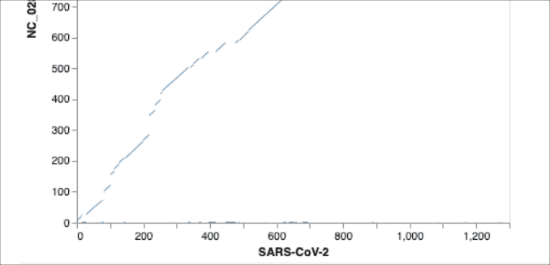
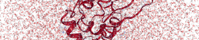
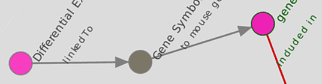
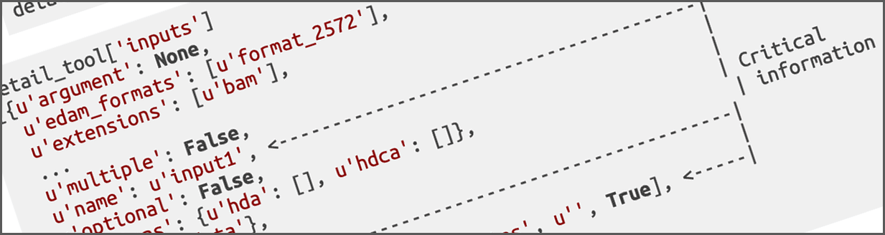
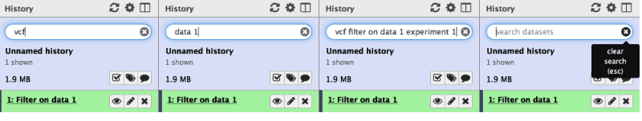
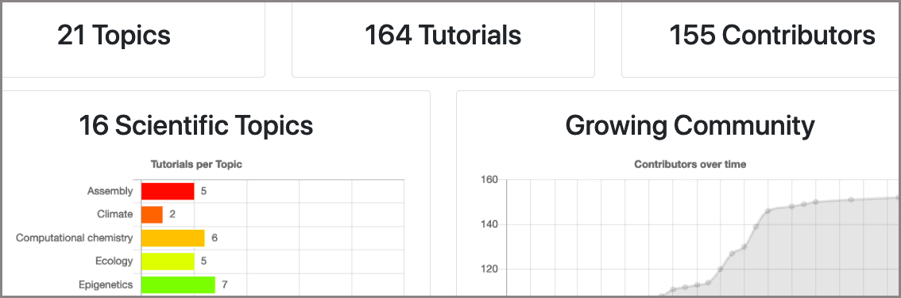
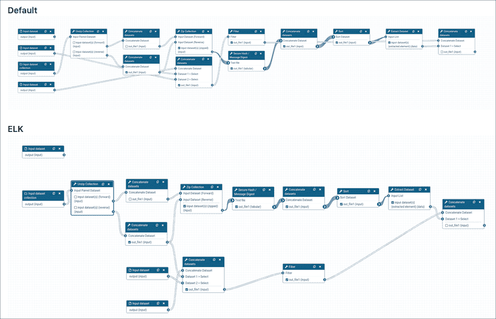

# In the  September 2020 issue

* [BCC2020 Wrap up and GCC2021 is on the way](#bcc2020-is-done-gcc2021-is-coming)
* [More event news](#more-event-news)
* [Galaxy platform news](#galaxy-platforms-news)
* [Blog posts (lots of them)](#galactic-blog-activity)
* [Training material and doc updates](#doc-hub-and-training-updates)
* [Publications](#publications) (a *boatload* of them)
* [Who's hiring](#whos-hiring)
* [New releases](#releases)
* [Other news too](#other-news)

If you have anything to include to next month's newsletter, then please send it to outreach@galaxyproject.org.

---

# BCC2020 is Done; *GCC2021 is Coming*

[BCC2020](https://bcc2020.github.io/)

The [2020 Bioinformatics Community Conference (BCC2020)](https://bcc2020.github.io/) brought together over 800 people for the second joint [Bioinformatics Open Source Conference (BOSC)](https://www.open-bio.org/events/bosc/) and [Galaxy Community Conference (GCC)](/gcc/). There are several write ups of the event:

* [Birthdays and Online Conferences go Viral. ISMB2020 & BCC2020 in the time of COVID-19](http://gigasciencejournal.com/blog/conferences-go-viral/), a [GIGABlog](http://gigasciencejournal.com/blog) post by Chris Armit.
* [Getting introduced to Bioinformatics and Open Science through BCC 2020](https://www.open-bio.org/2020/08/19/bcc-2020-gigi-kenneth/), by Gigi Kenneth
* [Lessons learnt from organizing a virtual conference (BCC2020)](https://bcc2020.github.io/blog/lessons-learnt), by BCC2020 Organizers

[BCC2020: the numbers](https://bcc2020.sched.com/)

* 804 people registered for one or more events
    * 592 for the three day meeting
    * 443 for training
    * 393 for CollaborationFest
* Training
    * [60 training sessions](https://bcc2020.sched.com/overview/subject/Training)
    * covering 36 topics (18 with a Galaxy emphasis)
    * adding up to 150 hours of live instruction
* Presentations
    * 3 live keynotes (and then 3 recorded keynotes)
    * 70+ talks, presented in both hemispheres
    * 80+ posters and demos
* 20 Birds-of-a-Feather & 2 Socials

[BCC2020 Videos are online](https://bcc2020.sched.com/)

Videos of most presentations and training are now available on the [conference web site](https://bcc2020.sched.com/).  Training materials for many tutorials are also linked to.

**Slides & Posters?**

If you presented a talk or poster/demo then please upload your slides and PDFs to the [F1000Research Galaxy Gateway](https://f1000research.com/gateways/galaxy).  Once they are there, we will link to them from the conference site.  (You can also send links/PDFs to outreach@galaxyproject.org.)

</a>

BCC2021: Pack your bags for Ghent

**The 2021 Galaxy Community Conference (GCC2021) will be held in Ghent, Belgium, 5-12 July.**  We are hoping to be back in person next year. GCC2021 will end shortly before the [The Ghent Festivities](https://visit.gent.be/en/calendar/ghent-festivities), 10 days of varied and free offer (music) performances, (street) theatre, exhibitions, animation for children, fairs, parades and much more.

Watch this space for details, and we hope to see you there.

# More Event News

Despite COVID-19, there is still a lot going on.  Some of it is virtual, but live events are starting to happen again, especially in Europe. We have updated our [list of events](/events/) to reflect what we know.  Some highlights:

[Galaxy Developer Roundtable](/community/devroundtable/)

The next two [roundtables](/community/devroundtable/) are [September 3 (this Thursday)](/events/2020-09-03-dev-roundtable/) and September 17. This week's topics are [interactive PR commands](https://github.com/almahmoud/galaxy/pull/9) by Alex Mahmood, and workflow updates - format, tooling, and GUI by John Chilton.

[Cycle "Bioinformatique par la pratique"](https://migale.inra.fr/trainings)

Five workshops this fall, all in Jouy-en-Josas and in French, and starting September 10.  Oui.

There are [two upcoming Galaxy Australia workshops offered by QCIF](https://www.qcif.edu.au/training/training-courses/) on  Galaxy (Intro and RNA-Seq Analysis).  The first one is 8 September.

Upcoming Events

There are [15 events](/events/) in the next 4 months

* 5 are online
* The remaining 10 are in France (6), Australia (2), and the United States (2)

And material from some recent events is now available:

* [End user open source bioinformatics tools](https://youtu.be/ItTjJjzMrig), by Peter van Heusden at [Bioinformatics Hub of Kenya](https://bioinformaticshubofkenya.wordpress.com/upcoming-event/)
* [MPDS and Open Source Tools for Computer Aided Drug Discovery](https://www.youtube.com/watch?v=lWWPTA7JyJ0&feature=youtu.be&t=183), by Lijo John, S Nagamani, Himakshi Sarma at [DDH2020 Training Program](http://www.neist.res.in/ddh2020/)

# Galaxy Platforms News

The [Galaxy Platform Directory](/use/) lists resources for easily running your analysis on Galaxy, including publicly available servers, cloud services, and containers and VMs that run Galaxy. Here's the recent platform news we know about:

[PiRATE](/use/pirate/)

[PiRATE, a **Pi**peline to **R**etrieve and **A**nnotate **T**ransposable **E**lements](https://www.seanoe.org/data/00406/51795/), is a Galaxy VM for detecting, classifying and annotating TEs of non-model organisms.  It has a [tutorial](https://archimer.ifremer.fr/doc/00412/52373/) and user support.  PiRATE is supported by [IFREMER](https://wwz.ifremer.fr/en/).

[UseGalaxy.fr](/use/usegalaxy-fr/)

The [UseGalaxy.fr server](https://usegalaxy.fr/) is a general purpose omics analysis server hosted by the [French Institute of Bioinformatics (IFB)](https://www.france-bioinformatique.fr/en/).  In addition, this server also hosts the specialized [Workflow4Metabolomics](/use/workflow4metabolomics/) and [ProteoRE](/use/proteore/) servers.

User support is provided through [a discourse-based forum](https://community.france-bioinformatique.fr/c/galaxy).

[Machine Learning Workbench](/use/ml-workbench/)

A comprehensive set of data preprocessing, machine learning, deep learning and visualisation tools, consolidated workflows for end-to-end machine learning analysis and training materials to showcase the usage of these tools.  [This workbench](https://ml.usefalaxy.eu/) includes scikit-learn, Keras (a deep learning library based on TensorFlow) and various other tools to transform, learn and predict and plot your data.  The server is supported by the [Goecks Lab](https://goeckslab.org/) at OHSU and the [Freiburg Galaxy Project](https://usegalaxy-eu.github.io/freiburg/).

[deepTS](/use/deepts/)

[deepTS](https://github.com/cma2015/deepTS)  is a Galaxy platform for identifying, visualizing and analyzing Transcriptional Switch (TS) events from pairwise, temporal and population transcriptome data. A [tutorial](https://github.com/cma2015/DeepTS) and user support are provided. deepTS is available as both a [server](https://deepts.nwafu.edu.cn/) and a [Docker container](https://hub.docker.com/r/malab/deepts). It is supported by [Northwest A&F University](http://en.nwsuaf.edu.cn/index.htm).

[BioCompute Object Galaxy](/use/biocompute-object/)

[BioCompute Objects](https://biocomputeobject.org/) and [BioCompute Object Galaxy server](https://galaxy.aws.biochemistry.gwu.edu/1) supports the [IEEE 2791-2020 standard](https://gitlab.com/IEEE-SA/2791/ieee-2791-schema) for bioinformatics pipelines/workflows in the High-Throughput Sequencing (HTS) space.  This effort is supported by the [FDA](https://smhs.gwu.edu/news/gw-led-consortium-receives-22m-grant-fund-biocompute-object-specification-project) and the [HIVE Lab at George Washington University](https://hive.biochemistry.gwu.edu/home).

[UseGalaxy.*](/usegalaxy/) News

* Lots of tool updates on [UseGalaxy.eu](https://galaxyproject.eu/news) and [UseGalaxy.org.au](https://usegalaxy-au.github.io/galaxy/news.html)
* Galaxy Europe [is joining the NFDI-DataPLANT consortiu]m](https://galaxyproject.eu/posts/2020/08/22/DataPLANT/)

Galaxy Platforms in Publications

Platforms that were referenced/used *at least twice* in recent publications:

<a class="btn"  style="text-align: right; background-color: #8cd48c;" href="https://www.zotero.org/groups/1732893/galaxy/tags/>Huttenhower"> 86 : <strong>Huttenhower</strong></a>
 <a class="btn"  style="text-align: right; background-color: #ace0ac;" href="https://www.zotero.org/groups/1732893/galaxy/tags/>UseGalaxy.eu"> 24 : <strong>UseGalaxy.eu</strong></a>
 <a class="btn"  style="text-align: right; background-color: #afe1af;" href="https://www.zotero.org/groups/1732893/galaxy/tags/>RepeatExplorer"> 22 : <strong>RepeatExplorer</strong></a>
 <a class="btn"  style="text-align: right; background-color: #b2e2b2;" href="https://www.zotero.org/groups/1732893/galaxy/tags/>ARGs-OAP"> 19 : <strong>ARGs-OAP</strong></a>
 <a class="btn"  style="text-align: right; background-color: #c7eac7;" href="https://www.zotero.org/groups/1732893/galaxy/tags/>UseGalaxy.org.au"> 8 : <strong>UseGalaxy.org.au</strong></a>
 <a class="btn"  style="text-align: right; background-color: #caebca;" href="https://www.zotero.org/groups/1732893/galaxy/tags/>Galaxy-P"> 7 : <strong>Galaxy-P</strong></a>
 <a class="btn"  style="text-align: right; background-color: #cdeccd;" href="https://www.zotero.org/groups/1732893/galaxy/tags/>Cistrome"> 6 : <strong>Cistrome</strong></a>
 <a class="btn"  style="text-align: right; background-color: #d1eed1;" href="https://www.zotero.org/groups/1732893/galaxy/tags/>Pasteur"> 5 : <strong>Pasteur</strong></a>
 <a class="btn"  style="text-align: right; background-color: #d1eed1;" href="https://www.zotero.org/groups/1732893/galaxy/tags/>Workflow4Metabolomics"> 5 : <strong>Workflow4Metabolomics</strong></a>
 <a class="btn"  style="text-align: right; background-color: #d6efd6;" href="https://www.zotero.org/groups/1732893/galaxy/tags/>Globus Genomics"> 4 : <strong>Globus Genomics</strong></a>
 <a class="btn"  style="text-align: right; background-color: #d6efd6;" href="https://www.zotero.org/groups/1732893/galaxy/tags/>Orione"> 4 : <strong>Orione</strong></a>
 <a class="btn"  style="text-align: right; background-color: #d6efd6;" href="https://www.zotero.org/groups/1732893/galaxy/tags/>UseGalaxy.org"> 4 : <strong>UseGalaxy.org</strong></a>
 <a class="btn"  style="text-align: right; background-color: #dbf2db;" href="https://www.zotero.org/groups/1732893/galaxy/tags/>ARGalaxy"> 3 : <strong>ARGalaxy</strong></a>
 <a class="btn"  style="text-align: right; background-color: #dbf2db;" href="https://www.zotero.org/groups/1732893/galaxy/tags/>Mississippi"> 3 : <strong>Mississippi</strong></a>
 <a class="btn"  style="text-align: right; background-color: #e3f4e3;" href="https://www.zotero.org/groups/1732893/galaxy/tags/>APOSTL"> 2 : <strong>APOSTL</strong></a>
 <a class="btn"  style="text-align: right; background-color: #e3f4e3;" href="https://www.zotero.org/groups/1732893/galaxy/tags/>BioCiphers"> 2 : <strong>BioCiphers</strong></a>
 <a class="btn"  style="text-align: right; background-color: #e3f4e3;" href="https://www.zotero.org/groups/1732893/galaxy/tags/>BioTeam"> 2 : <strong>BioTeam</strong></a>
 <a class="btn"  style="text-align: right; background-color: #e3f4e3;" href="https://www.zotero.org/groups/1732893/galaxy/tags/>DDBJ"> 2 : <strong>DDBJ</strong></a>
 <a class="btn"  style="text-align: right; background-color: #e3f4e3;" href="https://www.zotero.org/groups/1732893/galaxy/tags/>G-OnRamp"> 2 : <strong>G-OnRamp</strong></a>
 <a class="btn"  style="text-align: right; background-color: #e3f4e3;" href="https://www.zotero.org/groups/1732893/galaxy/tags/>GCAC"> 2 : <strong>GCAC</strong></a>
 <a class="btn"  style="text-align: right; background-color: #e3f4e3;" href="https://www.zotero.org/groups/1732893/galaxy/tags/>Genomic Hyperbrowser"> 2 : <strong>Genomic Hyperbrowser</strong></a>
 <a class="btn"  style="text-align: right; background-color: #e3f4e3;" href="https://www.zotero.org/groups/1732893/galaxy/tags/>GIO"> 2 : <strong>GIO</strong></a>
 <a class="btn"  style="text-align: right; background-color: #e3f4e3;" href="https://www.zotero.org/groups/1732893/galaxy/tags/>GVL-MEL"> 2 : <strong>GVL-MEL</strong></a>
 <a class="btn"  style="text-align: right; background-color: #e3f4e3;" href="https://www.zotero.org/groups/1732893/galaxy/tags/>ImmPort"> 2 : <strong>ImmPort</strong></a>
 <a class="btn"  style="text-align: right; background-color: #e3f4e3;" href="https://www.zotero.org/groups/1732893/galaxy/tags/>LAPPS Grid"> 2 : <strong>LAPPS Grid</strong></a>
 <a class="btn"  style="text-align: right; background-color: #e3f4e3;" href="https://www.zotero.org/groups/1732893/galaxy/tags/>Osiris"> 2 : <strong>Osiris</strong></a>
 <a class="btn"  style="text-align: right; background-color: #e3f4e3;" href="https://www.zotero.org/groups/1732893/galaxy/tags/>PhenoMeNal"> 2 : <strong>PhenoMeNal</strong></a>
 <a class="btn"  style="text-align: right; background-color: #e3f4e3;" href="https://www.zotero.org/groups/1732893/galaxy/tags/>PreSTIGE"> 2 : <strong>PreSTIGE</strong></a>
 <a class="btn"  style="text-align: right; background-color: #e3f4e3;" href="https://www.zotero.org/groups/1732893/galaxy/tags/>RiboGalaxy"> 2 : <strong>RiboGalaxy</strong></a>
 <a class="btn"  style="text-align: right; background-color: #e3f4e3;" href="https://www.zotero.org/groups/1732893/galaxy/tags/>SouthGreen"> 2 : <strong>SouthGreen</strong></a>
 <a class="btn"  style="text-align: right; background-color: #e3f4e3;" href="https://www.zotero.org/groups/1732893/galaxy/tags/>SymD"> 2 : <strong>SymD</strong></a>

# Galactic Blog Activity

Here's what people are saying right now:

[GVL 5.0-beta4: data browser, project-level isolation, and Galaxy 20.05](/news/2020-07-gvl5-beta4/)

By Nuwan Goonasekera, Alexandru Mahmoud, Mohamad Safadieh, Enis Afgan

A data browser, project-level isolation, and the latest release of Galaxy.

[The landscape of SARS-CoV-2 RNA modifications](https://galaxyproject.eu/posts/2020/07/19/drs_sars-cov-2-paper/)

By StreetScience

Studying the RNA modifications of SARS-CoV-2 to improve understanding of SARS viruses.

[Climate Science at BCC2020](https://galaxyproject.eu/posts/2020/07/27/climate-at-bcc/)

By Anne Fouilloux

July has been a very busy month for Galaxy Climate ending with several sessions dedicated to Climate Science at BCC2020.

[3 steps to get your tool into Galaxy](https://galaxyproject.eu/posts/2020/08/22/three-steps-to-galaxify-your-tool/)

By Björn Grüning and Beatriz Serrano-Solano

How you can get your software tool into a Galaxy server and thus, exposed to thousands of researchers. For this purpose, we will follow David Lopez’s steps to add the very generic UNIX `diff` tool to Galaxy.

[Bioinformatics training in Africa during the COVID-19 pandemic](https://depot.galaxyproject.org/hub/attachments/blog/2020-08-training/sasbi-newsletter-202008.pdf#page=3)

By Peter van Heusden

The COVID-19 pandemic has forced a rapid - and unplanned - shift towards online events instead of the usual roster of face-to-face seminars and conferences.

[Galaxy: the first 10,000 pubs](/news/2020-08-10k-pubs/)

By Dave Clements

Ten thousand publications have used, referenced, extended and implemented Galaxy in the past 15 years.  Half of those pubs appeared in just the last 3 years.  Learn about this and other trends in the Galaxy community, as revealed by what we are publishing.

[A resource for comparing SARS-CoV2 to other coronaviruses: Coordinate mapping and residue annotation](https://virological.org/t/a-resource-for-comparing-sars-cov2-to-other-coronaviruses-coordinate-mapping-and-residue-annotation/534)

By Delphine Lariviere, Sergei Kosakovsky Pond, Anton Nekrutenko + HyPhy and Galaxy Teams

An on-line, curated resource that serves two functions:

* Provide a [coordinate conversion table between amino-acid coordinates](https://observablehq.com/@delphine-l/coordinate-conversion-between-species-of-coronavirus) in SARS-CoV-2 and a set of well-studied coronaviruses;
* Annotate [amino acid residues of SARS-CoV-2](https://observablehq.com/@delphine-l/annotation-of-sars-2-coronavirus-genome) using available coronavirus literature.

# Doc, Hub, and Training Updates

[RNA-RNA interactome data analysis](https://training.galaxyproject.org/training-material/topics/transcriptomics/tutorials/rna-interactome/tutorial.html)

This tutorial was updated by [Pavankumar Videm](https://training.galaxyproject.org/training-material/hall-of-fame/pavanvidem/) to use the most recent versions of tools. Learn how to use CLEAR-CLIP data in your analysis.

[*M. tuberculosis* Variant Analysis](https://training.galaxyproject.org/training-material/topics/variant-analysis/tutorials/tb-variant-analysis/tutorial.html)

By [Peter van Heusden](https://training.galaxyproject.org/training-material/hall-of-fame/pvanheus/), [Simon Gladman](https://training.galaxyproject.org/training-material/hall-of-fame/slugger70/), and [Thoba Lose](https://training.galaxyproject.org/training-material/hall-of-fame/thobalose/)

A tutorial on variant calling in *M. tuberculosis*. This was first conceived at a workshop at NUBRI in Khartoum, Sudan, then presented at the African Society for Bioinformatics and Computational Biology meeting in Kumasi, Ghana in November 2019.

[Running molecular dynamics simulations using GROMACS](https://training.galaxyproject.org/training-material/topics/computational-chemistry/tutorials/md-simulation-gromacs/tutorial.html)

This tutorial was updated and expanded by [Simon Bray](https://training.galaxyproject.org/training-material/hall-of-fame/simonbray/).  An introductory guide to using [GROMACS](https://doi.org/10.1016/j.softx.2015.06.001) (Abraham et al. 2015) in Galaxy to prepare and perform molecular dynamics on a small protein.

Job configuration in Ansible

Sections on job configuration in Ansible were added to the [Galaxy Installation with Ansible](https://training.galaxyproject.org/training-material/topics/admin/tutorials/ansible-galaxy/tutorial.html) tutorial by [Simon Gladman](https://training.galaxyproject.org/training-material/hall-of-fame/slugger70/) and to the [Running Jobs on Remote Resources with Pulsar](https://training.galaxyproject.org/training-material/topics/admin/tutorials/pulsar/tutorial.html#configuring-galaxy) by [Helena Rasche](https://training.galaxyproject.org/training-material/hall-of-fame/hexylena/).

[Galaxy Installation with Ansible](https://training.galaxyproject.org/training-material/topics/admin/tutorials/ansible-galaxy/tutorial.html)

This tutorial saw a major revamp by [Helena Rasche](https://training.galaxyproject.org/training-material/hall-of-fame/hexylena/).  Learn how to use Ansible for your deployment recipes.

[GTN in Galaxy Webhook](https://github.com/galaxyproject/galaxy/pull/10024)

By [Helena Rasche](https://training.galaxyproject.org/training-material/hall-of-fame/hexylena/)

The new *GTN in Galaxy Webhook* enables trainees to view training directly within Galaxy. This has been well received:

<blockquote class="blockquote">
This is awesome! Magic @hexylena!
<footer class="blockquote-footer">@bgruening</footer>
</blockquote>

[Tool ID/Version Support](https://training.galaxyproject.org/training-material/topics/contributing/tutorials/create-new-tutorial-content/tutorial.html#tool-links)

By [Helena Rasche](https://training.galaxyproject.org/training-material/hall-of-fame/hexylena/)

The GTN in Galaxy Webhook enables trainees to view training directly within Galaxy. As part of this, trainees can click on tools, and have those tools directly activated in Galaxy.

[RNA-Seq analysis with AskOmics Interactive Tool](https://training.galaxyproject.org/training-material/topics/transcriptomics/tutorials/rna-seq-analysis-with-askomics-it/tutorial.htmll)

By Xavier Garnier, Anthony Bretaudeau, Anne Siegel, and Olivier Dameron

This new tutorial (and matching [slides](https://training.galaxyproject.org/training-material/topics/transcriptomics/tutorials/rna-seq-analysis-with-askomics-it/slides.html))uses data from the [RNA-seq counts to genes](https://training.galaxyproject.org/training-material/topics/transcriptomics/tutorials/rna-seq-counts-to-genes/tutorial.html) tutorial in the AskOmics web application to do data integration and querying using the semantic web technologies

[Creating, Editing and Importing Galaxy Workflows](https://training.galaxyproject.org/training-material/topics/galaxy-interface/tutorials/workflow-editor/tutorial.html)

By [Marius van den Beek](https://training.galaxyproject.org/training-material/hall-of-fame/mvdbeek/)

Learn how to use Galaxy's Workflow Editor to construct different reusable workflows.

[Scripting Galaxy using the API and BioBlend](https://training.galaxyproject.org/training-material/topics/galaxy-interface/tutorials/workflow-editor/tutorial.html)

These slides were updated by by [Nicola Soranzo](https://training.galaxyproject.org/training-material/hall-of-fame/nsoranzo/) to reflect the [14.0 release of BioBlend](#releases).  BioBlend is a Python library for interacting with Galaxy programmatically.

[Searching Your History](https://training.galaxyproject.org/training-material/topics/galaxy-interface/tutorials/search/tutorial.html)

This tutorial got a major update from [Helena Rasche](https://training.galaxyproject.org/training-material/hall-of-fame/hexylena/).  Feeling overwhelmed by all the work you have done in Galaxy?  Don't be.  Use History search to find what you are looking for.

[Galaxy Code Architecture Slides](https://training.galaxyproject.org/training-material/topics/dev/tutorials/architecture/slides.html#1)

This slide deck and related resources got a thorough update from [John Chilton](https://training.galaxyproject.org/training-material/hall-of-fame/jmchilton/).  John also [created several videos on this topic](https://bit.ly/gx-arch-vids) as well.

[GTN Stats Dashboard](https://training.galaxyproject.org/stats)

Ask and you shall receive.  Thanks to work by [Saskia Hiltemann](https://training.galaxyproject.org/training-material/hall-of-fame/shiltemann/) and [Helena Rasche](https://training.galaxyproject.org/training-material/hall-of-fame/hexylena/) there is now a GTN statistics page, listing all sorts of cool information about the state of the GTN library.

# Publications

**671 new publications** referencing, using, extending, and implementing Galaxy were added to the [Galaxy Publication Library](https://www.zotero.org/groups/galaxy) in June, July and August.  There were a *boatload1* of *[Galactic](https://www.zotero.org/groups/1732893/galaxy/tags/%2BGalactic)* and *[Stellar](https://www.zotero.org/groups/1732893/galaxy/tags/%2BStellar)* publications added, and a *truckload1* of them **are open access**:

 1 Who needs a [Units of Measurement Ontology](https://bioportal.bioontology.org/ontologies/UO)!

[AskMe: A LAPPS Grid-based NLP Query and Retrieval System for Covid-19 Literature](https://openreview.net/forum?id=WQwNh1RShX)

Suderman, K., Ide, N., Marc, V., Cochran, B., & Pustejovsky, J. (2020, June 30). ACL 2020 Workshop NLP-COVID.

[Accessible, Reproducible, and Scalable Machine Learning for Biomedicine](https://doi.org/10.1101/2020.06.25.172445)

Gu, Q., Kumar, A., Bray, S., Creason, A., Khanteymoori, A., Jalili, V., Grüning, B., & Goecks, J. (2020). *BioRxiv*, 2020.06.25.172445. [doi: 10.1101/2020.06.25.172445](https://doi.org/10.1101/2020.06.25.172445)

[Galactic Circos: User-friendly Circos plots within the Galaxy platform](https://doi.org/10.1093/gigascience/giaa065)

Rasche, H., & Hiltemann, S. (2020). *GigaScience*, 9(6). [doi: 10.1093/gigascience/giaa065](https://doi.org/10.1093/gigascience/giaa065)

[Training Infrastructure as a Service](https://doi.org/10.1101/2020.08.23.263509)

Rasche, H., & Gruening, B. A. (2020). *BioRxiv*, 2020.08.23.263509. [doi: 10.1101/2020.08.23.263509](https://doi.org/10.1101/2020.08.23.263509)

[pyGenomeTracks: Reproducible plots for multivariate genomic data sets](https://doi.org/10.1093/bioinformatics/btaa692)

Lopez-Delisle, L., Rabbani, L., Wolff, J., Bhardwaj, V., Backofen, R., Grüning, B., Ramírez, F., & Manke, T. (2020). *Bioinformatics*. [doi: 10.1093/bioinformatics/btaa692](https://doi.org/10.1093/bioinformatics/btaa692)

[Laniakea: An open solution to provide Galaxy “on-demand” instances over heterogeneous cloud infrastructures](https://doi.org/10.1093/gigascience/giaa033)

Tangaro, M. A., Donvito, G., Antonacci, M., Chiara, M., Mandreoli, P., Pesole, G., & Zambelli, F. (2020). *GigaScience*, 9(4). https://doi.org/10.1093/gigascience/giaa033

[Multi-omics Visualization Platform: An extensible Galaxy plug-in for multi-omics data visualization and exploration](https://doi.org/10.1093/gigascience/giaa025)

McGowan, T., Johnson, J. E., Kumar, P., Sajulga, R., Mehta, S., Jagtap, P. D., & Griffin, T. J. (2020). *GigaScience*, 9(4). https://doi.org/10.1093/gigascience/giaa025

[No more business as usual: Agile and effective responses to emerging pathogen threats require open data and open analytics](https://doi.org/10.1371/journal.ppat.1008643)

Baker, D., Beek, M. van den, Blankenberg, D., Bouvier, D., Chilton, J., Coraor, N., Coppens, F., Eguinoa, I., Gladman, S., Grüning, B., Keener, N., Larivière, D., Lonie, A., Pond, S. K., Maier, W., Nekrutenko, A., Taylor, J., & Weaver, S. (2020). *PLOS Pathogens*, 16(8), e1008643. https://doi.org/10.1371/journal.ppat.1008643

[Galaxy-SynBioCAD: Synthetic Biology Design Automation tools in Galaxy workflows](https://doi.org/10.1101/2020.06.14.145730
)

Lac, M. du, Duigou, T., Herisson, J., Carbonell, P., Swainston, N., Zulkower, V., Shah, F., Faure, L., Mahdy, M., Soudier, P., & Faulon, J.-L. (2020). *BioRxiv*, 2020.06.14.145730. https://doi.org/10.1101/2020.06.14.145730

[G-OnRamp: Generating genome browsers to facilitate undergraduate-driven collaborative genome annotation](https://doi.org/10.1371/journal.pcbi.1007863)

Sargent, L., Liu, Y., Leung, W., Mortimer, N. T., Lopatto, D., Goecks, J., & Elgin, S. C. R. (2020). *PLOS Computational Biology*, 16(6), e1007863. https://doi.org/10.1371/journal.pcbi.1007863

[The Galaxy platform for accessible, reproducible and collaborative biomedical analyses: 2020 update](https://doi.org/10.1093/nar/gkaa434)

Jalili, V., Afgan, E., Gu, Q., Clements, D., Blankenberg, D., Goecks, J., Taylor, J., & Nekrutenko, A. (2020). *Nucleic Acids Research*, 48(W1), W395–W402. https://doi.org/10.1093/nar/gkaa434

[Tripal and Galaxy: Supporting reproducible scientific workflows for community biological databases](https://doi.org/10.1093/database/baaa032)

Spoor, S., Wytko, C., Soto, B., Chen, M., Almsaeed, A., Condon, B., Herndon, N., Hough, H., Jung, S., Staton, M., Wegrzyn, J., Main, D., Feltus, F. A., & Ficklin, S. P. (2020). *Database*, 2020. https://doi.org/10.1093/database/baaa032

[Exploring Non-Coding RNAs in RNAcentral](https://doi.org/10.1002/cpbi.104)

Sweeney, B. A., Tagmazian, A. A., Ribas, C. E., Finn, R. D., Bateman, A., & Petrov, A. I. (2020). *Current Protocols in Bioinformatics*, 71(1), e104. https://doi.org/10.1002/cpbi.104

[Epiviz File Server: Query, Transform and Interactively Explore Data from Indexed Genomic Files](https://doi.org/10.1093/bioinformatics/btaa591)

Kancherla, J., Yang, Y., Chae, H., & Bravo, H. C. (2020). *Bioinformatics*. https://doi.org/10.1093/bioinformatics/btaa591

[Quantifying the RNA cap epitranscriptome reveals novel caps in cellular and viral RNA](https://doi.org/10.1093/nar/gkz751)

Wang, J., Alvin Chew, B. L., Lai, Y., Dong, H., Xu, L., Balamkundu, S., Cai, W. M., Cui, L., Liu, C. F., Fu, X.-Y., Lin, Z., Shi, P.-Y., Lu, T. K., Luo, D., Jaffrey, S. R., & Dedon, P. C. (2019). *Nucleic Acids Research*, 47(20), e130–e130. https://doi.org/10.1093/nar/gkz751

[*De novo* identification of satellite DNAs in the sequenced genomes of *Drosophila virilis* and *D. americana* using the RepeatExplorer and TAREAN pipelines](https://doi.org/10.1371/journal.pone.0223466)

Silva, B. S. M. L., Heringer, P., Dias, G. B., Svartman, M., & Kuhn, G. C. S. (2019). *PLOS ONE*, 14(12), e0223466. https://doi.org/10.1371/journal.pone.0223466

[Differential Genome Size and Repetitive DNA Evolution in Diploid Species of *Melampodium sect. Melampodium* (Asteraceae)](https://doi.org/10.3389/fpls.2020.00362)

McCann, J., Macas, J., Novák, P., Stuessy, T. F., Villaseñor, J. L., & Weiss-Schneeweiss, H. (2020). *Frontiers in Plant Science*, 11. https://doi.org/10.3389/fpls.2020.00362

[Environmental enrichment during forced abstinence from cocaine self-administration opposes gene network expression changes associated with the incubation effect](https://doi.org/10.1038/s41598-020-67966-8)

Powell, G. L., Vannan, A., Bastle, R. M., Wilson, M. A., Dell’Orco, M., Perrone-Bizzozero, N. I., & Neisewander, J. L. (2020). *Scientific Reports*, 10(1), 11291. https://doi.org/10.1038/s41598-020-67966-8

[CandiMeth: Powerful yet simple visualization and quantification of DNA methylation at candidate genes](https://doi.org/10.1093/gigascience/giaa066)

Thursby, S.-J., Lobo, D. K., Pentieva, K., Zhang, S.-D., Irwin, R. E., & Walsh, C. P. (2020). *GigaScience*, 9(6). https://doi.org/10.1093/gigascience/giaa066

Publication Topics

Publications are tagged with how they use, extend or reference Galaxy.  This batch of pubs were tagged as:

<a class="btn"  style="text-align: right; background-color: #62c462;" href="https://www.zotero.org/groups/1732893/galaxy/tags/+Methods"> 448 : <strong>Methods</strong></a>
 <a class="btn"  style="text-align: right; background-color: #79cc79;" href="https://www.zotero.org/groups/1732893/galaxy/tags/+UsePublic"> 185 : <strong>UsePublic</strong></a>
 <a class="btn"  style="text-align: right; background-color: #8fd58f;" href="https://www.zotero.org/groups/1732893/galaxy/tags/+Workbench"> 78 : <strong>Workbench</strong></a>
 <a class="btn"  style="text-align: right; background-color: #8fd58f;" href="https://www.zotero.org/groups/1732893/galaxy/tags/+UseMain"> 77 : <strong>UseMain</strong></a>
 <a class="btn"  style="text-align: right; background-color: #9edb9e;" href="https://www.zotero.org/groups/1732893/galaxy/tags/+RefPublic"> 42 : <strong>RefPublic</strong></a>
 <a class="btn"  style="text-align: right; background-color: #a1dca1;" href="https://www.zotero.org/groups/1732893/galaxy/tags/+Reproducibility"> 38 : <strong>Reproducibility</strong></a>
 <a class="btn"  style="text-align: right; background-color: #a2dca2;" href="https://www.zotero.org/groups/1732893/galaxy/tags/+UseLocal"> 36 : <strong>UseLocal</strong></a>
 <a class="btn"  style="text-align: right; background-color: #a9dea9;" href="https://www.zotero.org/groups/1732893/galaxy/tags/+Tools"> 28 : <strong>Tools</strong></a>
 <a class="btn"  style="text-align: right; background-color: #abdfab;" href="https://www.zotero.org/groups/1732893/galaxy/tags/+IsGalaxy"> 25 : <strong>IsGalaxy</strong></a>
 <a class="btn"  style="text-align: right; background-color: #bde6bd;" href="https://www.zotero.org/groups/1732893/galaxy/tags/+Education"> 12 : <strong>Education</strong></a>
 <a class="btn"  style="text-align: right; background-color: #c4e9c4;" href="https://www.zotero.org/groups/1732893/galaxy/tags/+Shared"> 9 : <strong>Shared</strong></a>
 <a class="btn"  style="text-align: right; background-color: #caebca;" href="https://www.zotero.org/groups/1732893/galaxy/tags/+Cloud"> 7 : <strong>Cloud</strong></a>
 <a class="btn"  style="text-align: right; background-color: #caebca;" href="https://www.zotero.org/groups/1732893/galaxy/tags/+Project"> 7 : <strong>Project</strong></a>
 <a class="btn"  style="text-align: right; background-color: #cdeccd;" href="https://www.zotero.org/groups/1732893/galaxy/tags/+Visualization"> 6 : <strong>Visualization</strong></a>
 <a class="btn"  style="text-align: right; background-color: #d1eed1;" href="https://www.zotero.org/groups/1732893/galaxy/tags/+Other"> 5 : <strong>Other</strong></a>
 <a class="btn"  style="text-align: right; background-color: #e3f4e3;" href="https://www.zotero.org/groups/1732893/galaxy/tags/+HowTo"> 2 : <strong>HowTo</strong></a>
 <a class="btn"  style="text-align: right; background-color: #edf8ed;" href="https://www.zotero.org/groups/1732893/galaxy/tags/+Unknown"> 1 : <strong>Unknown</strong></a>
 <a class="btn"  style="text-align: right; background-color: #edf8ed;" href="https://www.zotero.org/groups/1732893/galaxy/tags/+UseCloud"> 1 : <strong>UseCloud</strong></a>
 

# Who's Hiring

[Bioinformaticiens/Biostatisticiens](https://www.sfbi.fr/node/12708)

Quatre postes (CDI) de bioinformaticiens / biostatisticiens (H/F) à l’Institut Pasteur (Paris).

[Postdoctoral Scholar – Computational Genomics – Deep Learning for Genome Annotation](http://plantcompgenomics.com/postdocs/)

The [Plant Computational Genomics laboratory](http://plantcompgenomics.com/) at the University of Connecticut (Storrs, CT) has an opening for a Postdoctoral Scholar, developing mechanisms for cross-platform data/application sharing that builds on existing efforts with Galaxy, the [Tripal platform](https://tripal.info), and cloud-based HPC.

[Software Engineer/Full Stack Developer](https://jobs.jhu.edu/job/Baltimore-Software-EngineerFull-Stack-Developer-MD-21218/667182900/) and [Sr. Programmer Analyst](https://jobs.jhu.edu/job/Baltimore-Sr_-Programmer-Analyst-MD-21218/666390700/)

The Schatz Lab  at Johns Hopkins University is looking for

* self-driven individuals that can work independently to fill multiple software development positions on the Galaxy Project.
* ambitious individuals to fill a programmer analyst position working on the Galaxy and [AnVIL](https://anvilproject.org/) projects.

[Bioinformatics Data Management Specialist (RE2)](https://www.bsc.es/join-us/job-opportunities/22720lsinbre2) and [Bioinformatics Technician (RE3)](https://www.bsc.es/join-us/job-opportunities/10420lsinbre2)

The [Barcelona Supercomputing Center - Centro Nacional de Supercomputación (BSC-CNS)](https://www.bsc.es/) is hiring.

[Data Management Usability Officer](https://vibvzw.jobsoid.com/j/27205/data-management-usability-officer)

[VIB-UGent Center for Plant Systems Biology](http://www.vib.be/en/), Ghent, Belgium.

... We are building on the internationally used platform [FAIRDOMhub](https://fairdomhub.org) for data management, and Galaxy (https://www.usegalaxy.be and https://usegalaxy.eu) for data analysis.

[Senior Software Developer](https://boards.greenhouse.io/blackcanyonconsulting/jobs/4013069003)

[Black Canyon Consulting](http://www.bccdc.net/) at NCBI, Bethesda, Maryland, United States.

# Releases

[Nebulizer 0.6.0](/news/2020-06-galaxy-release-20-05/)

Command-line utilities to help with managing users, data libraries and tools in a Galaxy instance, using the Galaxy API via the [Bioblend](http://bioblend.readthedocs.org/en/latest/) library.  This release features new commands (search toolsheds, delete users, uninstall tools), fixes & updates, and newly extended documentation.

[BioBlend 0.14.0](https://github.com/galaxyproject/bioblend/releases/tag/v0.14.0)

[BioBlend](http://bioblend.readthedocs.org/) is a Python library for interacting with CloudMan and Galaxy‘s API.  BioBlend makes it possible to script and automate the process of cloud infrastructure provisioning and scaling via CloudMan, and running of analyses via Galaxy.

See the [release notes](https://github.com/galaxyproject/bioblend/releases) for what's new in release 0.14.0.

# Other news

[Fostering Collaborative Tools for Science](https://medium.com/@cziscience/fostering-collaborative-tools-for-science-8b8aa81758a9)

This write up by the [Chan Zuckerberg Science Initiative](https://medium.com/@cziscience) includes a [section on Irene Papatheodorou group's work](https://medium.com/@cziscience/fostering-collaborative-tools-for-science-8b8aa81758a9#ob3b) on the [Human Cell Atlas](https://humancellatlas.usegalaxy.eu/).

[Improved workflow layout engine](https://github.com/galaxyproject/galaxy/pull/10045)

Galaxy's graphical workflow editor includes an automatic/default workflow layout algorithm that is 10 years old.  A replacement based on [elkjs](https://github.com/kieler/elkjs)is on the way, thanks to [work by Helena Rasche](https://github.com/galaxyproject/galaxy/pull/10045).

