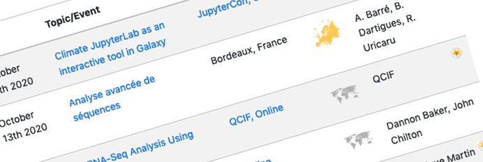

# In the  October 2020 issue

* **[Event news & JTech Scholarships](#event-news)**
* **[Galaxy platform news](#galaxy-platforms-news):** BRIDGE, BioCompute Object, French Galaxies, PhagePromoter, and UseGalaxy.*
* **[Blog posts](#galactic-blog-activity):** Remote training, EOSC-Life calls
* **[Training material and doc updates](#doc-hub-and-training-updates):** refgenie magic
* **[Publications](#publications)**
* **Q: Who's hiring? [A: Ten different groups](#whos-hiring)**
* **[New releases](#releases)**
* **[Other news too](#other-news)**

If you have anything to include to next month's newsletter, then please send it to outreach@galaxyproject.org.

---

# Event News

Despite COVID-19, there is still a lot going on.  Some of it is virtual, but live events are starting to happen again, especially in Europe. We have updated our [list of events](/events/) to reflect what we know.  Some highlights:

<!-- JTech -->

[First JTech Scholarships Awarded](/news/2020-09-jtech-scholarships/)

The [first group of scholarships have been awarded](/news/2020-09-jtech-scholarships/) by the [James Taylor Foundation's Junior Training and Educational Hotspot (JTech)](https://jxtxfoundation.org/donate) to attend [Biological Data Science](https://meetings.cshl.edu/meetings.aspx?meet=data&year=20).

**Please consider [making a donation to JTech](https://jxtxfoundation.org/donate) to support James Taylor’s legacy.**

<!-- Gateways -->

[Gateways 2020](https://sciencegateways.org/web/gateways2020/)

[Registration for Gateways 2020](https://sciencegateways.org/web/gateways2020/attend/register) ends October 5. Conference events start on October 12 with a week of tutorials, including [Securing Science Gateways with Custos Services](https://sched.co/dca6) on Wednesday October 14.

<!-- MIGALE -->

[Cycle "Bioinformatique par la pratique"](https://migale.inra.fr/trainings)

Two more workshops in October in Jouy-en-Josas and in French.

* Initiation à l’utilisation de Galaxy, October 15.
* Analyse primaire de données issues de séquenceurs nouvelle génération sous Galaxy, October 16.

<!-- Galaxy Dev Round Table -->

[Galaxy Developer Roundtable](/community/devroundtable/
)

The next two [roundtables](/community/devroundtable/) are [October 15](/events/2020-10-15-dev-roundtable/) and [October 29](/events/2020-10-29-dev-roundtable/).  Both events need speakers ([that means you](https://bit.ly/gxdevroundtablepresent)!).

<!-- eResearch Down Under -->

[eResearch Australasia](/events/2020-10-eresearch-australasia/)

Galaxy [is featured in talks, a BoF, and a poster](/events/2020-10-eresearch-australasia/) at the virtual [eResearch Australasia](https://conference.eresearch.edu.au/) this month.  Learn more about [Galaxy Australia](https://usegalaxy.org.au/) and how Galaxy support research at CSIRO.

<!-- Paper Cuts -->

Paper Cuts: 21 October

Paper cuts are annoying but easy to fix bugs. We plan to have a one-day contribution fest, dedicated to reducing Paper cuts in Galaxy and its ecosystem. It will be a 24-hours event to span all time zones with our worldwide community. The first one will be on October 21. Please save the date! It's an ideal opportunity for newcomers to get started. And remember it's still [Hacktoberfest](https://hacktoberfest.digitalocean.com/)!

<!-- ASHG -->

[ASHG 2020](https://www.ashg.org/meetings/2020meeting/)

As many other events, the American Society of Human Genetics Meeting is going virtual this year.

There will be a session on [GWAS Analysis with Galaxy on the Analysis Visualization Integrated Lab-space (AnVIL)](https://www.abstractsonline.com/pp8/#!/9070/session/146).

<!-- BioHackathon-Europe -->

[Galaxy @ BioHackathon Europe 2020](/events/2020-11-biohackathon-europe/)

Galaxy [is featured in at least 6 projects at BioHackathon Europe 2020](/events/2020-11-biohackathon-europe/), being held online, 9-13 November.  Registration is available on a first come, first serve basis. Registration is free, but space is limited. [Register now](https://www.biohackathon-europe.org/registration.html).

<!-- All events -->

Upcoming Events

There are [15 events](/events/) in the next 3 months:

* 9 are online.
* The remaining 6 are in France (4) and the United States (2).

# Galaxy Platforms News

The [Galaxy Platform Directory](/use/) lists resources for easily running your analysis on Galaxy, including publicly available servers, cloud services, and containers and VMs that run Galaxy. Here's the recent platform news we know about:

<!-- BRIDGE -->

[BRIDGE](/use/bridge/)

[BRIDGE (Biomolecular Reaction and Interaction Dynamics Global Environment)](https://galaxy-compchem.ilifu.ac.za/) is a Computational Chemistry flavour of Galaxy - a webserver for preparing, simulating and analysing and visualising molecular simulations, especially molecular dynamics and free energies. Includes NAMD, GROMACS and CHARMM. Offers tutorials and a [Gitter support channel](https://gitter.im/galaxycomputationalchemistry/Lobby).

<!-- BioCompute Object -->

[BioCompute Object](/use/biocompute-object/)

Implements the [BioCompute Objects](https://biocomputeobject.org/about.html) standard for communication of High-throughput Sequencing (HTS) analysis results, data set creation and curation, and bioinformatics verification protocols within a Galaxy server.  Extensive [documentation](https://github.com/biocompute-objects/BCO_Specification) and [chat support](https://gitter.im/biocompute-objects/community) are available.

<!-- French Instances -->

[A Quick Tour of French Galaxy Instances](http://eepurl.com/hcRat1)

The [24 September IFB newsletter highlights 10 Galaxy resources](http://eepurl.com/hcRat1) in France (believe it or not, there are more), including a few public servers.

<!-- PhagePromoter -->

[PhagePromoter](/use/phagepromoter/)

PhagePromoter predicts promoter sequences in phage genomes, using machine learning models.  This server is hosted by the [Centre of Biological Engineering](https://www.ceb.uminho.pt/), School of Engineering at the University of Minho &mdash; our first public server in Portugal.

<!-- UseGalaxy.* -->

[UseGalaxy.*](/usegalaxy/) News

* Talking about UseGalaxy.eu in a blog post or presentation? Galaxy Europe has provided [cool graphics and a fact sheet as well](https://galaxyproject.eu/posts/2020/09/06/branding/).
* Lots of tool updates on [UseGalaxy.eu](https://galaxyproject.eu/news) and [UseGalaxy.org.au](https://usegalaxy-au.github.io/galaxy/news.html).

# Galactic Blog Activity

Here's what people are saying right now:

<!-- Remote Training Lessons -->

[Remote Training Using Galaxy](https://docs.google.com/document/d/1_sQocj98DxhgnyvtXbRvcXlV84T_I3K1rFmWrMuw6x0/preview#)

*Lessons learned from our [ELIXIR Galaxy Machine Learning Workshop](https://elixir-europe.org/events/machine-learning-using-galaxy-webinar-workshop-series).*

By Alireza Khanteymoori, Björn Grüning, and Beatriz Serrano-Solano.

Lessons learned along with a description of the methodology applied in the workshop.

<!-- EOSC-Life -->

[EOSC-Life Open Calls](https://galaxyproject.eu/posts/2020/09/23/eosc-life-open-calls/)

Two funding opportunities are now open within the EU project [EOSC-Life](https://www.eosc-life.eu/).

* [Digital Life Sciences Open Call](https://www.eosc-life.eu/services/open-call/), deadline: **22.12.2020**.
* [Training Open Call](https://www.eosc-life.eu/services/open-call-training/), deadline: **13.11.2020**.

# Doc, Hub, and Training Updates

[refgenie for Local Instances](/admin/refgenie/)

By [Dan Blankenberg](/people/dan/).

How to use **[refgenie](http://refgenie.databio.org/)** with your local instance of Galaxy.

# Publications

Pub curation activities [are on hiatus right now](/blog/2020-08-10k-pubs/#the-future) but a few publications referencing, using, extending, and implementing Galaxy were added to the [Galaxy Publication Library](https://www.zotero.org/groups/galaxy) anyway.

[BRIDGE: An Open Platform for Reproducible Protein-Ligand Simulations and Free Energy of Binding Calculations](https://doi.org/10.21769/BioProtoc.3731)

Senapathi, T., Barnett, C. B., & Naidoo, K. J. (2020). *Bio-Protocol*, 10(17), e3731–e3731. [doi: 10.21769/BioProtoc.3731](https://doi.org/10.21769/BioProtoc.3731)

[Capacity building for whole genome sequencing of Mycobacterium tuberculosis and bioinformatics in high TB burden countries](https://doi.org/10.1093/bib/bbaa246)

Rivière, E., Heupink, T. H., Ismail, N., Dippenaar, A., Clarke, C., Abebe, G., Heusden, P., Warren, R., Meehan, C. J., & Van Rie, A. (2020). *Briefings in Bioinformatics*. [doi: 10.1093/bib/bbaa246](https://doi.org/10.1093/bib/bbaa246)

[Fostering Accessible Online Education Using Galaxy as an e-learning Platform](https://doi.org/10.20944/preprints202009.0457)

Serrano-Solano, B., Erxleben, A., Gallardo-Alba, C., Rasche, H., Hiltemann, S., Föll, M., Fahrner, M., Dunning, M. J., Schulz, M., Scholtz, B., Clements, D., Nekrutenko, A., Batut, B., & Grüning, B. (2020). *Preprints*. [doi: 10.20944/preprints202009.0457](https://doi.org/10.20944/preprints202009.0457)

# Who's Hiring

<!-- QUT -->

[Research Associate in Bioinformatics](https://www.appsnet.org/Careers/pdf/Research%20Associate%20in%20Bioinformatics.pdf)

Queensland University of Technology, Mickleham, *Victoria*.

"Lead the implementation, testing and validation of a virus diagnostics bioinformatics workflow within Galaxy Australia"

<!-- Galaxy P -->

[Application Developer](https://hr.myu.umn.edu/jobs/ext/337630)

Help with Galaxy-P tools and workflow development, and general support for Galaxy implementation at the [Minnesota Supercomputing Institute](https://www.msi.umn.edu/).

<!-- Cleveland Clinic -->

[Postdoctoral Fellow](https://postdocjobs.com/posting/7070235) and [Software Engineer](https://twitter.com/DBlankenberg/status/1310586405282885632)

The Blankenberg Lab in the Genomic Medicine Institute at the Cleveland Clinic Lerner Research Institute is searching for Software Engineers and Postdoctoral Fellows. We utilize high-throughput omics technologies, such as next generation sequencing, and data-intensive computing to explore biomedical research questions.

<!-- University Hospital of Cologne  -->

[Computational Biologist](https://euraxess.ec.europa.eu/jobs/557466)

The [Cluster of Excellence on Cellular Stress Responses in Aging-Associated Diseases (CECAD)](https://www.cecad.uni-koeln.de/home/) at the University Hospital of Cologne is expanding its bioinformatics core facility in close collaboration with the Institute for Medical Statistics and Bioinformatics (IMSB).  **Apply by 18 October.**

<!-- NCGAS -->

[Bioinformatics Analyst](https://hrms.indiana.edu/psp/PH1PRD_PUB/EMPLOYEE/HRMS/c/HRS_HRAM_FL.HRS_CG_SEARCH_FL.GBL?Page=HRS_APP_JBPST_FL&Action=U&FOCUS=Applicant&SiteId=1&JobOpeningId=292187&PostingSeq=1)

Supports genomics and other ‘omics research at Indiana University and for the national audience served by NSF-funded [NCGAS](https://ncgas.org/).

<!-- Pasteur -->

[4 Bioinformaticiens / Biostatisticiens](https://www.sfbi.fr/node/12708)

Quatre postes (CDI) de bioinformaticiens / biostatisticiens (H/F) à l’Institut Pasteur (Paris).

<!-- ARTbio -->

[Genomic Data Analyst](https://www.artbio.fr/home/job-offers)

A 3-year position of genomic data analyst is available to work within the "COllaborative NEtwork on research for Children and Teenagers with Acute Myeloblastic Leukemia" CONECT-AML framework.

The project is funded by the Institut National de Recherche sur le Cancer (INCA) and the Fight Kids Cancer programme. It involves 10 participant teams across France, with clinical or fundamental approaches.

<!-- UConn -->

[Postdoctoral Scholar – Computational Genomics – Deep Learning for Genome Annotation](http://plantcompgenomics.com/postdocs/)

The [Plant Computational Genomics laboratory](http://plantcompgenomics.com/) at the University of Connecticut has a Postdoctoral Scholar  opening, for developing mechanisms for cross-platform data/application sharing that builds on existing efforts with Galaxy, the [Tripal platform](https://tripal.info), and cloud-based HPC.

**Applications due October 9.**

<!-- Hopkins -->

[Software Engineer/Full Stack Developer](https://jobs.jhu.edu/job/Baltimore-Software-EngineerFull-Stack-Developer-MD-21218/667182900/) and [Sr. Programmer Analyst](https://jobs.jhu.edu/job/Baltimore-Sr_-Programmer-Analyst-MD-21218/666390700/)

The Schatz Lab  at Johns Hopkins University is looking for

* self-driven individuals that can work independently to fill multiple software development positions on the Galaxy Project.
* ambitious individuals to fill a programmer analyst position working on the Galaxy and [AnVIL](https://anvilproject.org/) projects.

<!-- VIB -->

[Data Management Usability Officer](https://vibvzw.jobsoid.com/j/27205/data-management-usability-officer)

[VIB-UGent Center for Plant Systems Biology](http://www.vib.be/en/), Ghent, Belgium.

We are building on the internationally used platform [FAIRDOMhub](https://fairdomhub.org) for data management, and Galaxy (https://www.usegalaxy.be and https://usegalaxy.eu) for data analysis.

# Releases

[Pulsar 0.14.0](https://github.com/galaxyproject/pulsar/blob/master/HISTORY.rst)

[Pulsar](https://pypi.python.org/pypi/pulsar-app/) is a Python server application that allows a Galaxy server to run jobs on remote systems (including Windows) without requiring a shared mounted file systems. Unlike traditional Galaxy job runners - input files, scripts, and config files may be transferred to the remote system, the job is executed, and the results are transferred back to the Galaxy server - eliminating the need for a shared file system.

# Other news

[Euro-BioImaging contributes to cloud-based biological image analysis workflow tools](https://www.eurobioimaging.eu/news/euro-bioimaging-contributes-to-cloud-based-biological-image-analysis-workflow-tools-/)

[Euro-BioImaging](https://www.eurobioimaging.eu/) and [ELIXIR](https://elixir-europe.org/), in collaboration with the [Image Data Resource (IDR)](https://idr.openmicroscopy.org/) and [Galaxy Europe](https://galaxyproject.eu/), have facilitated the use and re-analysis of publicly available datasets by integrating [CellProfiler](https://cellprofiler.org/), an image analysis software with a focus on recognizing cellular components, into Galaxy, a key cloud workflow tool.

[CINECA Project Profiles Saskia Hiltemann](https://www.cineca-project.eu/blog-all/connect-with-cineca-saskia-hiltemann)

Saskia is a core member of the [Intergalactic Utilities Commission](/iuc/), and one of the creators of the [Galaxy Training Network](https://training.galaxyproject.org/).  Within the [CINECA project](https://www.cineca-project.eu/) Saskia is co-Lead on Work Package 6, dissemination and outreach work, and a major contributor to Work Package 5 - Healthcare Interoperability and Clinical Applications.

[GalaxyWorks is starting a webinar series](https://galaxyworks.io/)

[GalaxyWorks](https://galaxyworks.io/), a commercial branch of Galaxy, will be starting a webinar series to showcase analysis capabilities of [Galaxy Pro](https://galaxyworks.io/product). If you have topics you would like to see covered, please suggest them by emailing to info@galaxyworks.io.
Separately, GalaxyWorks subbmitted a Phase II STTR funding application to the NIH last month.

