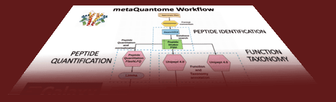
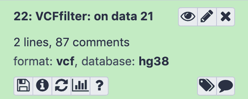

# In the November 2020 issue

* **[JXTX: The James P. Taylor Foundation for Open Science](#jxtx-the-james-p.-taylor-foundation-for-open-science)**
* **[Event news](#event-news)**
* **[Galaxy platform news](#galaxy-platforms-news):** GalaxyTrakr, Galaxy Africa, Australia, Europe, and UseGalaxy.*
* **[Blog posts](#galactic-blog-activity):** Advanced Microbiology with Galaxy and TIaaS
* **[Training material and doc updates](#doc-hub-and-training-updates)**
* **[Publications](#publications)**
* **Q: Who's hiring? [A: Eight different groups](#whos-hiring)**
* **[New releases](#releases)**
* **[Other news too](#other-news)**

If you have anything to include to next month's newsletter, then please send it to outreach@galaxyproject.org.

---

# JXTX: The James P. Taylor Foundation for Open Science

<!-- New Name -->

Same mission, new name

The foundation continuing James's legacy of supporting Open Science has been renamed from *JTech* to *[JXTX: The James P. Taylor Foundation for Open Science](/jxtx/foundation/)*. The JXTX Foundation will continue to focus on mentoring and enabling junior researchers to participate in the Open Science James was dedicated to.

<!-- First 10 -->

[Meet the first recipients](/news/2020-10-jxtx-awardees/)

The JXTX Foundation's first activity is to sponsor 10 graduate students to attend the [2020 Biological Data Science Conference at Cold Spring Harbor Laboratory](https://meetings.cshl.edu/meetings.aspx?meet=DATA&year=20). Awards were competitive and we are delighted to support this first cohort of awardees.

<!-- Donate -->

Help move Open Science forward

**You can help continue James's legacy of open and reproducible science by contributing to [JXTX: The James P. Taylor Foundation for Open Science](/jxtx/foundation/).**

<button type="button" class="btn btn-secondary" style="font-size: x-large; font-weight: 600;">

[Donate now](https://jxtxfoundation.org/donate/)

</button>

---

# Event News

Despite COVID-19, there is still a lot going on.  Some of it is virtual, but live events are starting to happen again, especially in Europe. We have updated our [list of events](/events/) to reflect what we know.  Some highlights:

<!-- Galaxy Dev Round Table -->

[Galaxy Developer Roundtable: 12 November](/community/devroundtable/)

There will be one roundtable meetup this month, on **[November 12](/events/2020-11-12-dev-roundtable/)**. Discussion will focus on working with the [Galaxy Training Network](https://training.galaxyproject.org/).

<!-- Paper Cuts -->

[Paper Cuts: 18 November](/events/2020-11-papercuts/)

Paper Cuts are annoying but easy to fix bugs. The [first Paper Cuts event](/events/2020-10-papercuts/) in October was a [smashing success](https://galaxyproject.eu/posts/2020/10/29/first-papercuts/), so we are going to [do it again on November 18](/events/2020-11-papercuts/). Our second one-day Paper Cuts contribution fest will also be a 24-hour event spanning all time zones with our worldwide community.

Please save the date! **It's an ideal opportunity for newcomers to become a Galaxy contributor.**

<!-- Du Novo -->

[Ultra-Low Variant Detection: Du Novo Sequencing](https://depot.galaxyproject.org/hub/attachments/events/2020-11-du-novo/du-novo-webinar.pdf)

This **November 10 webinar** by Barbara Arbeithuber​ and ​Nick Stoler will present *Du Novo Sequencing*, a method that can achieve <1% variant detection,​ by removing the reliance on a reference sequence, preserving a higher proportion of the input reads, and being available for Galaxy.

<!-- Down Under -->

Whats Up Down Under?

Three Galaxy Australia events are being offered by in November:

* [Webinar: Galaxy Australia: enabling online data analysis for the research community](https://www.biocommons.org.au/events/galaxy-aust-mass-spec), **4 Nov**, from Australian BioCommons.
* [Workshop: Online data analysis for biologists](https://www.eventbrite.com.au/e/online-data-analysis-for-biologists-november-2020-tickets-123259172503), **11 Nov**, from Australian BioCommons.
* [Workshop: Hybrid de novo genome assembly - Nanopore and Illumina](https://www.eventbrite.com.au/e/hybrid-de-novo-genome-assembly-nanopore-and-illumina-online-tickets-125568852819), **30 Nov**, from Melbourne Bioinformatics.

<!-- GTN -->

[Galaxy Training Network Day: CoFest and community call](/events/2020-11-gtn/)

**19th of November, Online**

A [dedicated day of collaborative work](/events/2020-11-gtn/) on the training content and calls with the Galaxy training community. Anyone who would like to contribute, learn how to contribute to the Galaxy Training Material or just catch up with the community is very welcome to join.

<!-- DDA and DIA -->

[DDA and DIA proteomic analysis in Galaxy](https://training.vib.be/all-trainings/dda-and-dia-proteomic-analysis-galaxy)

**3rd of December, Online**

This hands-on workshop will familiarize you with the Galaxy user interface & execute (label-free) proteomics data-analysis. Taught by Melanie Föll and Matthias Fahrner from the University of Freiburg.

<!--sur les outils -->

[Hackathon sur les outils interactifs de Galaxy (GxIT)](https://forgemia.inra.fr/geoc/hackaton2020)

**7 au 10 décembre 2020, en visio**

Un Hackathon pour partager des compétences en terme du développement logiciel et d'administration système des Interactive Tools de Galaxy.  **Limité à 25 participants.**

<!--Galaxy Admin Training -->

[Galaxy Admin Training: January 2021](/events/2021-01-admin-training/)

Galaxy Admin Training is coming in January.  It will be online and global, and registration will open this month.  Watch Twitter, this web site, and Galaxy Gitter channels for the announcement.

<!-- All events -->

Upcoming Events

There are more than [16 events](/events/) before the end of the year:

* workshops, CoFests, talks, ...
* all of them are online.

# Galaxy Platforms News

The [Galaxy Platform Directory](/use/) lists resources for easily running your analysis on Galaxy, including publicly available servers, cloud services, and containers and VMs that run Galaxy. Here's the recent platform news we know about:

<!-- GalaxyTrakr -->

[GalaxyTrakr](/use/galaxytrakr/)

The [GalaxyTrakr server](https://galaxytrakr.org/) is provided by the [US Food and Drug Administration](https://www.fda.gov/) to support food-borne pathogen research worldwide. A [User Guide](https://s3.amazonaws.com/cfsan-genometrakr-docs/user+guide/Galaxy+Genome+Trakr+User+Guide.pdf), [FAQ](https://cfsan-genometrakr-docs.s3.amazonaws.com/user+guide/FAQs+for+GalaxyTrakr.pdf), [Videos](https://www.youtube.com/channel/UCxuzusNRSpnw3qG6dQDDzGw), and [Email support](mailto:GalaxyTrakrSupport_at_fda.hhs.gov) are available.  An account is required and anyone working in public health can apply.

<!-- Galaxy Africa -->

[Galaxy Africa](/use/galaxy-africa/)

Devoted to assisting researchers on the African continent, accelerate their genomics research and analyses. This [public server](https://africa.usegalaxy.eu/) is configured by the Galaxy Africa team, and hosted by the UseGalaxy.eu team.

<!-- Galaxy Australia -->

[Galaxy Australia](https://usegalaxy.org.au/)

Galaxy Australia is now officially supporting 10,000 researchers to analyse their valuable data.
It's rapidly becoming the essential research tool for so many around the world.

<!-- Galaxy Europe -->

[Galaxy Europe](https://usegalaxy.eu/)

Galaxy EU has surpassed 20,000 users!

5 continents, 100 countries, more than 100 industry companies, 4,000 users trained using TIaaS, 11 million jobs, 12 jobs per minute...

<!-- UseGalaxy.* -->

[UseGalaxy.*](/usegalaxy/) News

* Talking about UseGalaxy.eu in a blog post or presentation? Galaxy Europe has provided [cool graphics and a fact sheet as well](https://galaxyproject.eu/posts/2020/09/06/branding/).
* Lots of tool updates on [UseGalaxy.eu](https://galaxyproject.eu/news) and [UseGalaxy.org.au](https://usegalaxy-au.github.io/galaxy/news.html).

# Galactic Blog Activity

<!-- Strathclyde -->

[Teaching Advanced Microbiology with Galaxy and TIaaS](https://galaxyproject.eu/posts/2020/10/14/tiaas_feedback_Leighton/)

By Leighton Pritchard.

Leighton reports on the University of Strathclyde's experience teach Advanced Microbiology using UseGalaxy.eu's Training Infrastructure as a Service (TIaaS).

*Spoiler: It went well.*

# Doc, Hub, and Training Updates

<!-- metaQuantome -->

Metaproteomics analysis with metaQuantome

By [Subina Mehta](https://training.galaxyproject.org/training-material/hall-of-fame/subinamehta/), [Timothy J. Griffin](https://training.galaxyproject.org/training-material/hall-of-fame/timothygriffin/), [Pratik Jagtap](https://training.galaxyproject.org/training-material/hall-of-fame/pratikdjagtap/), [Emma Leith](https://training.galaxyproject.org/training-material/hall-of-fame/emmaleith/), [Marie Crane](https://training.galaxyproject.org/training-material/hall-of-fame/mariecrane/), and [Praveen Kumar](https://training.galaxyproject.org/training-material/hall-of-fame/pravs3683/)

A three part series on doing metaproteomics analysis with metaQuantome:

1. [Data Creation](https://training.galaxyproject.org/training-material/topics/proteomics/tutorials/metaquantome-data-creation/tutorial.html)
1. [Function](https://training.galaxyproject.org/training-material/topics/proteomics/tutorials/metaquantome-function/tutorial.html)
1. [Taxonomy](https://training.galaxyproject.org/training-material/topics/proteomics/tutorials/metaquantome-taxonomy/tutorial.html)

<!-- non-dip var -->

[Calling variants in non-diploid systems](https://training.galaxyproject.org/training-material/topics/variant-analysis/tutorials/non-dip/tutorial.html)

This tutorial got a thorough update from [Mallory Freeberg](https://training.galaxyproject.org/training-material/hall-of-fame/malloryfreeberg/).

<!-- video -->

[Adding auto-generated video to your slides](https://training.galaxyproject.org/training-material/topics/contributing/tutorials/slides-with-video/tutorial.html)

By [Helena Rasche](https://training.galaxyproject.org/training-material/hall-of-fame/hexylena/)

Based on the work by Delphine Larivière and James Taylor with their [COVID-19 Lectures](https://github.com/galaxyproject/video-lectures/), we have implemented a similar feature in the Galaxy Training Network.  Learn how to use it.

<!-- somatic -->

[Identification of somatic and germline variants from tumor and normal sample pairs](https://training.galaxyproject.org/training-material/topics/variant-analysis/tutorials/somatic-variants/tutorial.html)

This tutorial got a thorough update from [Mallory Freeberg](https://training.galaxyproject.org/training-material/hall-of-fame/malloryfreeberg/).

# Publications

Pub curation activities [are on hiatus right now](/blog/2020-08-10k-pubs/#the-future) but a few publications referencing, using, extending, and implementing Galaxy were added to the [Galaxy Publication Library](https://www.zotero.org/groups/galaxy) anyway.  Here are the new open access *Galactic* and *Stellar* pubs:

[Capacity building for whole genome sequencing of Mycobacterium tuberculosis and bioinformatics in high TB burden countries](https://doi.org/10.1093/bib/bbaa246)

Rivière, E., Heupink, T. H., Ismail, N., Dippenaar, A., Clarke, C., Abebe, G., Heusden, P., Warren, R., Meehan, C. J., & Van Rie, A. (2020). *Briefings in Bioinformatics*. [doi: doi.org/10.1093/bib/bbaa246](https://doi.org/10.1093/bib/bbaa246)

[Expanding the Galaxy’s reference data](https://doi.org/10.1101/2020.10.09.327114)

VijayKrishna, N., Joshi, J., Coraor, N., Hillman-Jackson, J., Bouvier, D., Beek, M. van den, Eguinoa, I., Coppens, F., Golitsynskiy, S., Stolarczyk, M., Sheffield, N. C., Gladman, S., Cuccuru, G., Grüning, B., Soranzo, N., Rasche, H., Langhorst, B. W., Bernt, M., Fornika, D., … Blankenberg, D. (2020). *BioRxiv*, 2020.10.09.327114. [doi: 10.1101/2020.10.09.327114](https://doi.org/10.1101/2020.10.09.327114)

[A single-cell RNA-sequencing training and analysis suite using the Galaxy framework](https://doi.org/10.1093/gigascience/giaa102)

Tekman, M., Batut, B., Ostrovsky, A., Antoniewski, C., Clements, D., Ramirez, F., Etherington, G. J., Hotz, H.-R., Scholtalbers, J., Manning, J. R., Bellenger, L., Doyle, M. A. , Heydarian, M., Huang, N., Soranzo, N., Moreno, P., Mautner, S., Papatheodorou, I., Nekrutenko, A., Taylor, J., Blankenberg, D., Backofen, R., Grüning, B. (2020). *GigaScience*, 9(10). [doi: 10.1093/gigascience/giaa102](https://doi.org/10.1093/gigascience/giaa102)

[Assessing sequence quality in GalaxyTrakr](https://dx.doi.org/10.17504/protocols.io.bdvfi63n)

Timme, R., Laxmi, S., Balkey, M., Randolf, R., Wolfgang, W., & Strain, E. (2020). *Protocols.io.* [doi: 10.17504/protocols.io.bdvfi63n](https://dx.doi.org/10.17504/protocols.io.bdvfi63n)

[NanoGalaxy: Nanopore long-read sequencing data analysis in Galaxy](https://doi.org/10.1093/gigascience/giaa105)

de Koning, W., Miladi, M., Hiltemann, S., Heikema, A., Hays, J. P., Flemming, S., van den Beek, M., Mustafa, D. A., Backofen, R., Grüning, B., & Stubbs, A. P. (2020). *GigaScience*, 9(10). [doi: 10.1093/gigascience/giaa105](https://doi.org/10.1093/gigascience/giaa105)

[GalaxyCloudRunner: enhancing scalable computing for Galaxy](https://doi.org/10.1093/bioinformatics/btaa860)

Goonasekera, N., Mahmoud, A., Chilton, J., Afgan, E. (2020). *Bioinformatics*. [doi: 10.1093/bioinformatics/btaa860](https://doi.org/10.1093/bioinformatics/btaa860)

# Who's Hiring

<!-- , open #UseGalaxy position at @unibait in collaboration with @RegionePuglia & @MIsocialTW euraxess.ec.europa.eu/jobs/570194 -->

<!-- Puglia -->

[Development of a bioinformatic platform for Precision Medicine](https://euraxess.ec.europa.eu/jobs/570194)

Università degli Studi di Bari Aldo Moro, Regione Puglia, Italy.

Development and implementation of a computing platform in a cloud environment with a web interface based on the Galaxy workflow management system to provide access to computational tools for Precision Medicine compliant with GDPR directives.

**Applications close 14 November.**

<!-- Roche -->

[Principle Scientist II, Bioinformatics](https://roche.wd3.myworkdayjobs.com/en-US/roche-ext/job/Pleasanton/Principle-Scientist-II--Bioinformatics_202010-126228-1)

Roche, Bay Area, California, United States.

* Lead data mining for biomarker discovery for medical conditions of interest.
* Develop Agile Assay Design (AAD) tools for qPCR tests.
* NGS data analysis tools and/or workflows.
* Use these tools & workflows for R&D projects.
* Deploy these tools on Roche intranet (Galaxy) and train scientists to use them.

<!-- ELIXIR Norway -->

[Senior Engineer](https://no.neuvoo.com/view/?id=2d3aa44730bc)

ELIXIR Norway Team, University of Oslo, Norway.

Join the ELIXIR development / operations team at the University of Oslo (UiO), participating in the development, implementation and operation of functionality for various national and international solutions provided by ELIXIR Norway, including [UseGalaxy.no](/use/usegalaxy-no/) and NeLS.

<!-- AnVIL -->

[AnVIL Project Manager](https://jobs.jhu.edu/job/Baltimore-AnVIL-Project-Manager-MD-21218/682125700/)

Johns Hopkins University, Baltimore, Maryland, United States.

Provide technical expertise and oversight for the [AnVIL Project](http://anvilproject.org/), which incorporates Galaxy, Bioconductor, Terra, Gen3, and Dockstore into a secure cloud-based software ecosystem for genomic data analysis.

<!-- Galaxy P -->

[Application Developer](https://hr.myu.umn.edu/jobs/ext/337630)

Help with Galaxy-P tools and workflow development, and general support for Galaxy implementation at the [Minnesota Supercomputing Institute](https://www.msi.umn.edu/).

<!-- Cleveland Clinic -->

[Postdoctoral Fellow](https://postdocjobs.com/posting/7070235) and [Software Engineer](https://twitter.com/DBlankenberg/status/1310586405282885632)

The Blankenberg Lab in the Genomic Medicine Institute at the Cleveland Clinic Lerner Research Institute is searching for Software Engineers and Postdoctoral Fellows. We utilize high-throughput omics technologies, such as Next-Generation Sequencing, and data-intensive computing to explore biomedical research questions.

<!-- ARTbio -->

[Genomic Data Analyst](https://www.artbio.fr/home/job-offers)

A 3-year position of genomic data analyst is available to work within the "COllaborative NEtwork on research for Children and Teenagers with Acute Myeloblastic Leukemia" CONECT-AML framework.

The project is funded by the Institut National de Recherche sur le Cancer (INCA) and the Fight Kids Cancer programme. It involves 10 participant teams across France, with clinical or fundamental approaches.

<!-- Hopkins -->

[Software Engineer/Full Stack Developer](https://jobs.jhu.edu/job/Baltimore-Software-EngineerFull-Stack-Developer-MD-21218/667182900/) and [Sr. Programmer Analyst](https://jobs.jhu.edu/job/Baltimore-Sr_-Programmer-Analyst-MD-21218/666390700/)

The Schatz Lab at Johns Hopkins University is looking for:

* Self-driven individuals that can work independently to fill multiple software development positions on the Galaxy Project.
* Ambitious individuals to fill a programmer analyst position working on the Galaxy and [AnVIL](https://anvilproject.org/) projects.

# Releases

[Galaxy Language Server 0.1.2](https://github.com/galaxyproject/galaxy-language-server)

[Galaxy Language Server](https://github.com/galaxyproject/galaxy-language-server) implements the [Language Server Protocol](https://microsoft.github.io/language-server-protocol/) to assist in the development of [Galaxy tool wrappers](https://docs.galaxyproject.org/en/latest/dev/schema.html) inside modern code editors.

*Please note this is still an early work in progress and bugs and issues are expected.*

It provides realtime XML validation, code completion, help/documentation and other smart features to help in following best practices during the development process of XML tool wrappers for Galaxy.

The Galaxy Tools Visual Studio Code extension that uses the Galaxy Language Server can be downloaded from the [Open VSX Registry](https://open-vsx.org/extension/davelopez/galaxy-tools) and the [Visual Studio Marketplace](https://marketplace.visualstudio.com/items?itemName=davelopez.galaxy-tools).

# Other news

[The Community Against COVID-19](https://www.pr.uni-freiburg.de/pm-en/online-magazine/research-and-discover/the-community-against-covid-19)

A group of Freiburg researchers provide global, open access to data on the SARS-CoV-2 genome which could hold the key for a new approach to treating the virus.

