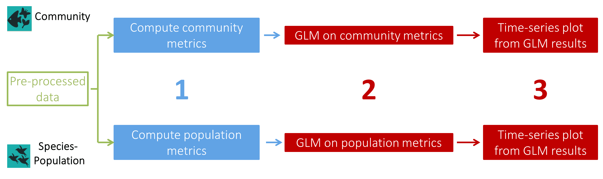
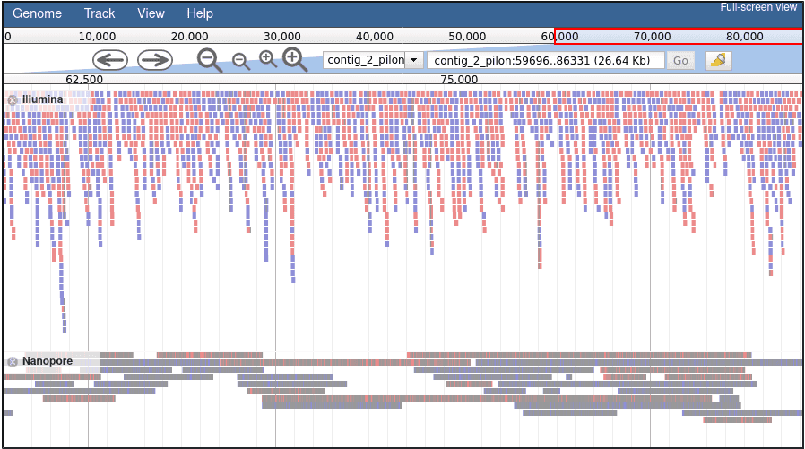
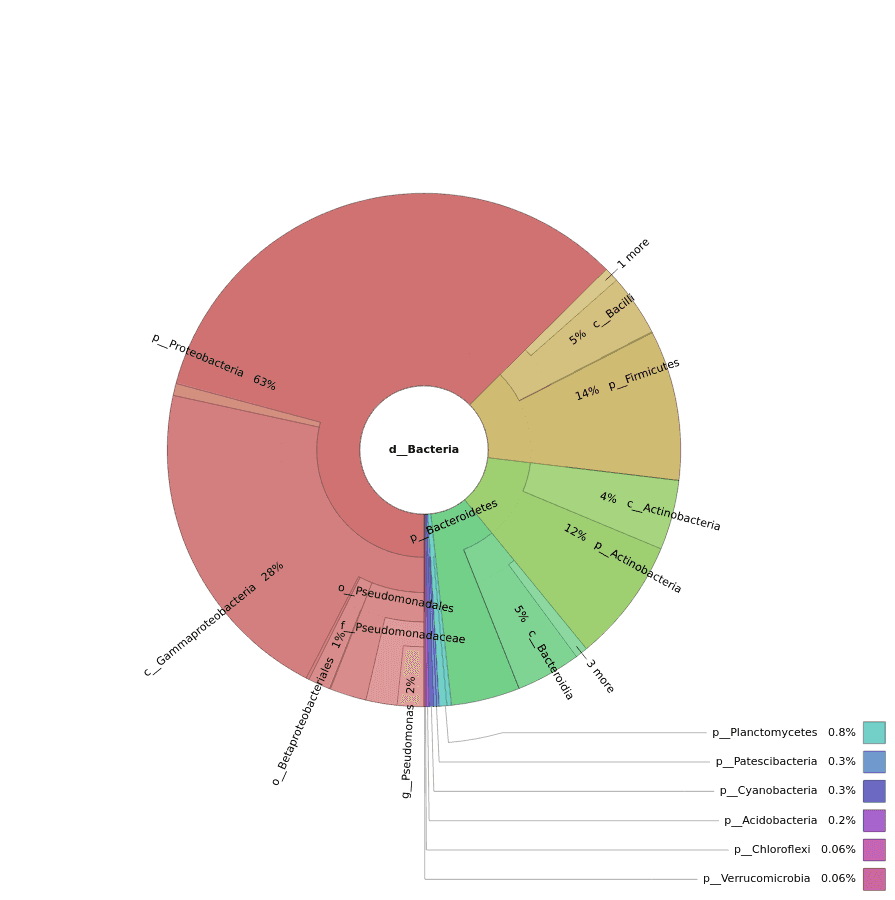
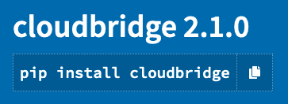

In this issue:

<ul style="font-size: 1.1rem;">
  <li>**[Event news](#event-news)**:
    <ul>
      <li>Webinars:
        <ul>
          <li>Use Galaxy anywhere, right now, *December 9*</li>
          <li>Chloroplast Genome Assembly, *December 10*</li>
        </ul>
      </li>
      <li>First Metabolomics Community Call, *December 10*</li>
      <li>Galaxy Developer Round Table: Working Groups, *December 10*</li>
      <li>Papercuts CollaborationFest: *December 17*</li>
      <li>Galaxy Admin Training: *Apply by December 18*</li>
      <li>Tripal CodeFest 2021: *January 11-15*</li>
      <li>GTN Smörgåsbord: A Global Galaxy Course. *Register by February 1*</li>
    </ul>
  <li>**[Galaxy platform news](#galaxy-platforms-news):**
    <ul>
      <li>CLIP-Explorer, a new server for CLIP-Seq data </li>
      <li>GenAP expansion funded by CANARIE (Canada!)</li>
      <li>UseGalaxy.eu gets more storage and GPUs through deNBI-Cloud</li>
      <li>Plus more UseGalaxy.\* news</li>
    </ul>
  </li>
  <li>**[Blog posts](#galactic-blog-activity):**
    <ul>
      <li>Outcome of the BioHackathon Europe</li>
      <li>Accessible single-cell RNA-sequencing bioinformatics training using Galaxy</li>
      <li>TIaaS and training feedback</li>
    </ul>
  </li>
  <li>**[Training material and doc updates](#doc-hub-and-training-updates)**:
    <ul>
      <li>Chloroplast genome assembly</li>
      <li>Compute and analyze Essential Biodiversity Variables with PAMPA toolsuite</li>
      <li>16S Microbial analysis with Nanopore data</li>
    </ul>
  </li>
  <li>**[Publications](#publications)**
    <ul>
      <li>Metaproteomics, CLIP-Explorer, GIANT, and package management is your friend</li>
    </ul>
  </li>
  <li>**[Q: Who's hiring?](#whos-hiring)**
    <ul>
      <li> Europe:
        <ul>
          <li>Max Planck IIE, University of Oslo, Hannover Medical School, EMBL Rome, Norwegian University of Life Science, Sorbonne-Université</li>
        </ul>
      </li>
      <li>North America:
        <ul>
          <li>Roche, Johns Hopkins (AnVIL, 2 positions; Galaxy, 2 Positions), Cleveland Clinic</li>
        </ul>
      <li>*A: Everyone, it seems.* </li>
    </ul>
  </li>
  <li>**[New releases](#releases)**:
    <ul>
      <li>Galaxy 20.09</li>
      <li>ENA submission</li>
      <li>OMERO accessible from Galaxy</li>
      <li>CloudLaunch</li>
    </ul>
  </li>
  <li>**[Other news too](#other-news)**</li>
</ul>

 

If you have anything to include to next month's newsletter, then please send it to outreach@galaxyproject.org.

---

# Event News

Despite COVID-19, there is still a lot going on. Some of it is virtual, but live events are starting to happen again, especially in Europe. We have updated our [list of events](/events/) to reflect what we know.  Some highlights:

<!-- Galaxy Webinars -->

[Galaxy Webinars](/events/webinars/)

**9 & 10 December, Online**

Interested in learning more about Galaxy [in a webinar](/events/webinars/)?  Here's two offered this month:

**[Use Galaxy on the web, the cloud, and your laptop too](/events/2020-12-webinar-where/)**  
There are *many* ways that researchers can access Galaxy. [This webinar](/events/2020-12-webinar-where/) on **Wednesday, December 9**, will introduce participants to a range of options for using Galaxy instances around the world, and on your own laptop too.

**[Plant genomics: chloroplast genome assembly using Galaxy Australia](https://www.biocommons.org.au/events/chloroplastgenomeassembly)**  
You can also see Galaxy, in action, in **another webinar 12 hours later**: Anna Syme of Australian BioCommons will present a [webinar on plant genomics and genome assembly](https://www.biocommons.org.au/events/chloroplastgenomeassembly).

<!-- Metabolomics Call -->

[Galaxy Metabolomics Community Call](https://galaxyproject.eu/event/2020-11-24-metabolomics/)

**10 December, Online**

The first call of the Galaxy Metabolomics Community will be held on the 10th of December at 2 PM CET. The bi-monthly community calls aim to bring together Galaxy metabolomics researchers -including users and developers- to discuss needs, ideas, and scientific problems, and to find new collaborators and synergies in the community. See the [announcement for details](https://galaxyproject.eu/event/2020-11-24-metabolomics/).

<!-- Galaxy Dev Round Table -->

[Galaxy Developer Roundtable: Working Groups](/community/devroundtable/)

**10 December, Online**

There will be [one roundtable meetup this month](/events/2020-12-10-dev-roundtable/). Discussion will focus on restructuring how development and other Galaxy components are gathered and coordinated.

*A gentle shout form the editors:* **Wake up!** If you want to get involved in guiding and contributing to Galaxy in a significant way, then please join this call.

<!-- Paper Cuts -->

[December Papercuts CollaborationFest](/events/2020-12-papercuts/)

**17 December, Online**

Paper Cuts are annoying but easy to fix bugs. October and November were a success, so we are going to [do it again on December 17](/events/2020-12-papercuts/). Our third one-day Paper Cuts contribution fest will also be a 24-hour event spanning all time zones with our worldwide community.

Please save the date! **It's an ideal opportunity for newcomers to become a Galaxy contributor.**

<!--Galaxy Admin Training -->

[Galaxy Admin Training: January 2021](/events/2021-01-admin-training/)

**Application Deadline: 18 December**

Applications to attend the [2021 Galaxy Admin Training](/events/2021-01-admin-training/) in January are now open and being accepted through 18 December.  This week-long workshop will be online, global, and free.  Apply now.  (Applications are competitive).

<!-- Tripal Codefest 2021 -->

[Tripal CodeFest 2021](http://tripal.info/events/codefest_2021)

**11-15 January, Online**

*Calling all Tripal Core, Extension Module and Tool Integration Developers!*

[Tripal](http://tripal.info/) is a toolkit for construction of online biological (genetics, genomics, breeding, etc.), community database web portals. Tripal includes [Tripal Galaxy](https://github.com/tripal/tripal_galaxy) and [blend4php](https://github.com/galaxyproject/blend4php).

<!-- GTN Smörgåsbord -->

[GTN Smörgåsbord: A Global Galaxy Course](https://shiltemann.github.io/global-galaxy-course/)

**15-19 February, Online; Register by 1 February**

This week-long workshop on how to use Galaxy will be online, global, and free.  The [program](https://shiltemann.github.io/global-galaxy-course/#program) covers a general introduction to the Galaxy platform, NGS Analysis (DNA-seq and RNA-seq), Proteomics, and also features a *Choose your own adventure* day (!?).

# Galaxy Platforms News

The [Galaxy Platform Directory](/use/) lists resources for easily running your analysis on Galaxy, including publicly available servers, cloud services, and containers and VMs that run Galaxy.  Here's the recent platform news we know about:

<!-- CLIP Seq -->

[CLIP-Explorer](/use/clip-explorer/)

The [CLIP-Explorer server](https://galaxyproject.org/use/clip-explorer/) is a webserver hosted by the UseGalaxy.eu team to process, analyse and visualise CLIP-Seq data.

<!-- GenAP -->

CANARIE funds GenAP expansion

GenAP, a Galaxy provider for Canadian researchers has been awarded additional funds by [CANARIE](https://www.canarie.ca/l) to expand it's service. [Read more here](https://www.canarie.ca/to-spur-software-re-use-in-research-canarie-awards-up-to-3-4m-to-research-teams-to-evolve-their-platforms-for-use-by-other-researchers/).

<!-- New Hardware -->

[UseGalaxy.eu gets new hardware: More storage and GPUs](https://galaxyproject.eu/posts/2020/11/17/new-compute-nodes/)

The [de.NBI-Cloud](https://www.denbi.de/cloud) has extended the support to the European Galaxy Server by providing new computational infrastructure.

If you have some special needs that we should consider in our next purchase, [let us know!](mailto:galaxy@informatik.uni-freiburg.de) And please consider growing the Galaxy computational resources with the funding leftovers of your group by the end of the year.

<!-- UseGalaxy.* -->

[UseGalaxy.*](/usegalaxy/) News

* Wanna know what has happened in the last 5 years in the Freiburg Galaxy Team? [Here is the 5-years report!](https://docs.google.com/document/d/1qZjFADy3opMM5l6nEAMMeYzdf2gpBVCD0Kgglo8ZFj4/preview#)
* Lots of tool updates on [UseGalaxy.eu](https://galaxyproject.eu/news?tag=tools) and [UseGalaxy.org.au](https://usegalaxy-au.github.io/galaxy/news.html).

*Note: these platforms will feature prominently in the [December 9 webinar](/events/2020-12-webinar-where/).*

# Galactic Blog Activity

<!-- BioHackathon Europe 2020 -->

[Outcome of the BioHackathon Europe 2020](https://galaxyproject.eu/posts/2020/11/16/biohackathon/)

The Galaxy community participated in 8 different projects during the BioHackathon Europe 2020:

* [CNV detection software containerisation and benchmark](https://github.com/elixir-europe/BioHackathon-projects-2020/tree/master/projects/7)
* [EDAM and Tool Information Profiles](https://github.com/elixir-europe/BioHackathon-projects-2020/tree/master/projects/10)
* [Exporting rich metadata and provenance from Galaxy using RO-Crate packaging](https://github.com/elixir-europe/BioHackathon-projects-2020/tree/master/projects/14)
* [Improve the support of Common Workflow Language in Galaxy](https://github.com/elixir-europe/BioHackathon-projects-2020/tree/master/projects/17)
* [Hardening and Testing Galaxy cluster support with BioContainer](https://github.com/elixir-europe/BioHackathon-projects-2020/tree/master/projects/18)
* [An interface between Galaxy and disease maps](https://github.com/elixir-europe/BioHackathon-projects-2020/tree/master/projects/27)
* [Deploying biocontainers in orchestration environments for life science research](https://github.com/elixir-europe/BioHackathon-projects-2020/tree/master/projects/31)
* [bio.tools integration and sustainable development](https://github.com/elixir-europe/BioHackathon-projects-2020/tree/8f588223a2ca50ecb76cdf37fa5bfc21aa54e5d4/projects/11)

<!-- Earlham -->

[Accessible single-cell RNA-sequencing bioinformatics training using Galaxy](https://www.earlham.ac.uk/articles/accessible-single-cell-rna-sequencing-bioinformatics-training-using-galaxy)

By Peter Bickerton.

_“I wanted to step away from the command line”_, Graham Etherington explains. _“It takes a long time and it causes confusion, whereas everybody knows how to use a web browser."_

<!-- TIaaS -->

[Teaching reads inspection to genome assembly, annotation and reads mapping](https://galaxyproject.eu/posts/2020/11/27/tiaas_feedback_Ambre/)

By Ambre Jousselin.

Ambre reports on the Université de Toulouse Paul Sabatier's experience teaching Genomics using UseGalaxy.eu's Training Infrastructure as a Service (TIaaS).

<!-- EOSC-Nordic -->

[Insights from the first cross-training between EOSC-Life and EOSC-Nordic](https://www.eosc-nordic.eu/insights-from-the-first-cross-training-between-eosc-life-and-eosc-nordic/)

By Anne Fouilloux, Research Software Engineer at NeIC.

This training covered modelling with _FATES_ (Functionally Assembled Terrestrial Ecosystem Simulator) for improving climate models using UseGalaxy.eu's Training Infrastructure as a Service (TIaaS) and funded by EOSC-Life.

# Doc, Hub, and Training Updates

<!-- Compute and analyze Essential Biodiversity Variables with PAMPA toolsuite -->

[Compute and analyze Essential Biodiversity Variables with PAMPA toolsuite](https://training.galaxyproject.org/training-material/topics/ecology/tutorials/PAMPA-toolsuite-tutorial/tutorial.html)

By [Coline Royaux](https://training.galaxyproject.org/training-material/hall-of-fame/colineroyaux/) and [Yvan Le Bras](https://training.galaxyproject.org/training-material/hall-of-fame/yvanlebras/).

This tutorial aims to present the PAMPA Galaxy workflow, how to use it to compute Essential Biodiversity Variables (EBV) from species abundance data and analyse it through generalized linear (mixed) models (GLM and GLMM). This workflow made up of 5 tools will allow you to process temporal series data that include at least year, location and species sampled along with abundance value and, finally, generate article-ready data products.

<!-- Chloroplast genome assembly -->

[Chloroplast genome assembly](https://training.galaxyproject.org/training-material/topics/assembly/tutorials/chloroplast-assembly/tutorial.html)

By [Anna Syme](https://training.galaxyproject.org/training-material/hall-of-fame/annasyme/).

This tutorial shows genome assembly for the plant chloroplast genome with a subset of a real data set from sweet potato.

<!-- 16S Microbial analysis with Nanopore data -->

[16S Microbial analysis with Nanopore data](https://training.galaxyproject.org/training-material/topics/metagenomics/tutorials/nanopore-16S-metagenomics/tutorial.html)

By [Cristóbal Gallardo](https://training.galaxyproject.org/training-material/hall-of-fame/gallardoalba/).

This tutorial uses sequencing data obtained through the MinION sequencer (Oxford Nanopore Technologies) with two objectives:

1) evaluate the health status of soil samples,
2) study how microbial populations are modified by their interaction with plant roots.

# Publications

Pub curation activities [are on hiatus right now](/news/2020-08-10k-pubs/#the-future) but a few publications referencing, using, extending, and implementing Galaxy were added to the [Galaxy Publication Library](https://www.zotero.org/groups/galaxy) anyway.  Here are the new open access *Galactic* and *Stellar* pubs:

 [Survey of metaproteomics software tools for functional microbiome analysis](https://doi.org/10.1371/journal.pone.0241503)

Sajulga, R., Easterly, C., Riffle, M., Mesuere, B., Muth, T., Mehta, S., Kumar, P., Johnson, J., Gruening, B. A., Schiebenhoefer, H., Kolmeder, C. A., Fuchs, S., Nunn, B. L., Rudney, J., Griffin, T. J., & Jagtap, P. D. (2020).  *PLOS ONE*, 15(11), e0241503. [doi: 10.1371/journal.pone.0241503](https://doi.org/10.1371/journal.pone.0241503)

 [Galaxy CLIP-Explorer: A web server for CLIP-Seq data analysis](https://doi.org/10.1093/gigascience/giaa108)

Heyl, F., Maticzka, D., Uhl, M., & Backofen, R. (2020). *GigaScience*, 9(11). [doi: 10.1093/gigascience/giaa108](https://doi.org/10.1093/gigascience/giaa108)

 [GIANT: Galaxy-based tool for interactive analysis of transcriptomic data](https://doi.org/10.1038/s41598-020-76769-w)

Vandel, J., Gheeraert, C., Staels, B., Eeckhoute, J., Lefebvre, P., & Dubois-Chevalier, J. (2020). *Scientific Reports*, 10(1), 19835. [doi: 10.1038/s41598-020-76769-w](https://doi.org/10.1038/s41598-020-76769-w)

 [Adding software to package management systems can increase their citation by 280%](https://doi.org/10.1101/2020.11.16.385211)

Jalili, V., Clements, D., Gruning, B., Blankenberg, D., & Goecks, J. (2020). *BioRxiv*, 2020.11.16.385211. [doi: 10.1101/2020.11.16.385211](https://doi.org/10.1101/2020.11.16.385211)

# Who's Hiring

<!-- MPI -->

[Bioinformaticians](https://www.ie-freiburg.mpg.de/5407142/job_full_offer_16014663)

Bioinformatics Unit, [Max Planck Institute of Immunobiology and Epigenetics](https://www.ie-freiburg.mpg.de/), Freiburg, Germany

Work in an interdisciplinary team with close links to different departments, research groups, and other core facilities.

**Apply by 11 December.**

<!-- Oslo-->

[Postdoctoral Research Fellow in Informatics/Bioinformatics](https://arbeidsplassen.nav.no/stillinger/stilling/cb7fba1d-9b7d-4a1f-b17f-26ad56693f96)

Centre for Bioinformatics (SBI), Department of Informatics, University of Oslo (UiO), Oslo, Norway.

This 3-year postdoc position will collaborate closely with the Oslo bioinformatics ELIXIR team, which is the Oslo node of the [ELIXIR Norway project](https://elixir.no/). Work on [Genomic HyperBrowser](https://hyperbrowser.uio.no), [GTrack](https://gtrack.no), [FAIRtracks](https://fairtracks.github.io), [TrackFind](http://trackfind.elixir.no), [Galaxy ProTo](https://github.com/elixir-oslo/proto), and the [Norwegian Federated European EGA (European Genome-Phenome Archive) node](https://ega.elixir.no).

**Apply by 11 December.**

<!-- Hannover -->

[Experienced specialist in Next Generation Sequencing data analysis](https://mhh.hr4you.org/job/view/559/experienced-specialist-in-next-generation-sequencing-data-analysis-f-d-m?page_lang=en)

[Research Core Unit Genomics (RCUG)](https://www.mhh.de/genomics), Hannover Medical School, Hannover, Germany

A full position is available for 2 years in the Research Core Unit Genomics (RCUG), Germany, starting at the earliest timepoint possible. This includes working with and running training on the internal Galaxy instance.

**Apply by 16 December.**

<!-- EMBL Rome -->

[Research Technician](https://euraxess.ec.europa.eu/jobs/581427)

Boskkovic Lab, EMBL Rome, Italy.

Directly participate in various experiments in developmental biology and epigenetics to meet the research goals of the laboratory.

**Apply by 27 December.**

<!-- NMBU -->

[PhD or postdoc project Spring/Summer  2021](https://www.nmbu.no/en/research/groups/memo/join-us-)

[MEMO Group](https://www.nmbu.no/en/research/groups/memo), [Norwegian University of Life Science](https://www.nmbu.no/en), Ås, Norway

Interested in host-microbiome interactions and multi-omic data? We have multiple positions starting in 2021. Projects have fun and interesting EU partners. Will be hiring after Christmas.

<!-- Hopkins AnVIL / ITCR -->

[Research Associate in Biomedical Data Science](https://apply.interfolio.com/81395)

Department of Biostatistics, Bloomberg School of Public Health, Johns Hopkins University.

Data science research and education focusing on genomics ([AnVIL](https://anvilproject.org/), [Genomic Data Science Community Network](http://www.gdscn.org/)), cancer ([ITCR](https://itcr.cancer.gov/))  or pain [A2CPS](https://a2cps.org/).

<!-- Roche -->

[Principle Scientist II, Bioinformatics](https://roche.wd3.myworkdayjobs.com/en-US/roche-ext/job/Pleasanton/Principle-Scientist-II--Bioinformatics_202010-126228-1)

Roche, Bay Area, California, United States.

* Lead data mining for biomarker discovery for medical conditions of interest.
* Develop Agile Assay Design (AAD) tools for qPCR tests.
* NGS data analysis tools and/or workflows.
* Use these tools & workflows for R&D projects.
* Deploy these tools on Roche intranet (Galaxy) and train scientists to use them.

<!-- AnVIL -->

[AnVIL Project Manager](https://jobs.jhu.edu/job/Baltimore-AnVIL-Project-Manager-MD-21218/682125700/)

Johns Hopkins University, Baltimore, Maryland, United States.

Provide technical expertise and oversight for the [AnVIL Project](http://anvilproject.org/), which incorporates Galaxy, Bioconductor, Terra, Gen3, and Dockstore into a secure cloud-based software ecosystem for genomic data analysis.

<!-- Cleveland Clinic -->

[Postdoctoral Fellow](https://postdocjobs.com/posting/7070235) and [Software Engineer](https://twitter.com/DBlankenberg/status/1310586405282885632)

The Blankenberg Lab in the Genomic Medicine Institute at the Cleveland Clinic Lerner Research Institute is searching for Software Engineers and Postdoctoral Fellows. We utilize high-throughput omics technologies, such as Next-Generation Sequencing, and data-intensive computing to explore biomedical research questions.

<!-- ARTbio -->

[Genomic Data Analyst](https://www.artbio.fr/home/job-offers)

A 3-year position of genomic data analyst is available to work within the "COllaborative NEtwork on research for Children and Teenagers with Acute Myeloblastic Leukemia" CONECT-AML framework.

The project is funded by the Institut National de Recherche sur le Cancer (INCA) and the Fight Kids Cancer programme. It involves 10 participant teams across France, with clinical or fundamental approaches.

<!-- Hopkins -->

[Software Engineer/Full Stack Developer](https://jobs.jhu.edu/job/Baltimore-Software-EngineerFull-Stack-Developer-MD-21218/667182900/) and [Sr. Programmer Analyst](https://jobs.jhu.edu/job/Baltimore-Sr_-Programmer-Analyst-MD-21218/666390700/)

The Schatz Lab at Johns Hopkins University is looking for:

* Self-driven individuals that can work independently to fill multiple software development positions on the Galaxy Project.
* Ambitious individuals to fill a programmer analyst position working on the Galaxy and [AnVIL](https://anvilproject.org/) projects.

# Releases

[Galaxy 20.09](/news/2020-11-galaxy-release-20-09/)

See

* **[Developer and admin release announcement](https://docs.galaxyproject.org/en/master/releases/20.09_announce.html)**
* **[User release announcement](https://docs.galaxyproject.org/en/master/releases/20.09_announce_user.html)**
* **[Release summary video](https://youtu.be/dIeXVW_eoJk)**

Features:

* GTN in Galaxy.
* Plugin framework for uploading datasets.
* Upload directly from the Tool Form.
* Workflow import from GA4GH TRS servers.
* Simplified workflow submission form.
* Accelerated batch job creation and workflow step scheduling.

<!-- Submission to ENA -->

[Simplified submission of SARS-CoV-2 data to open databases](https://galaxyproject.eu/posts/2020/11/20/elixir-post/)

[ELIXIR Belgium](https://www.elixir-belgium.org/), in collaboration with the European Galaxy project (de.NBI) and the [European COVID-19 Data Platform](https://www.covid19dataportal.org/), have developed a tool to simplify the submission of viral sequencing data to the [European Nucleotide Archive (ENA)](https://www.ebi.ac.uk/ena/browser/home), an ELIXIR Core Data Resource providing open access to nucleotide sequences. The new submission tool offers an easy-to-use interface, guides researchers through the submission process and verifies the data format and description. Read more in the [official ELIXIR press release](https://elixir-europe.org/news/ENA-new-tool-COVID-19-data).

<!-- OMERO -->

[Images stored in local OMERO instances are now accessible from Galaxy](https://galaxyproject.eu/posts/2020/11/23/OMERO-post/)

Good news for the imaging community! The [IDR Download tool](https://usegalaxy.eu/root?tool_id=toolshed.g2.bx.psu.edu/repos/iuc/idr_download_by_ids/idr_download_by_ids/) can now download images from a local OMERO instance.

This is an important step towards the accessibility of bioimage data. Now, images stored in local OMERO databases that are not publicly available are accessible from either public or private Galaxy instances. Imaging facilities that are running their local instance and want to perform image analysis in Galaxy can directly benefit from this new feature.

<!-- CloudBridge -->

[CloudBridge 2.1.0](http://cloudbridge.cloudve.org/en/latest/)

[CloudBridge version 2.1.0](https://pypi.org/project/cloudbridge/) is a Python library that provides a consistent layer of abstraction over different Infrastructure-as-a-Service cloud providers, reducing or eliminating the need to write conditional code for each cloud. 2.1.0 adds new services and improved robustness.  See the [full documentation](http://cloudbridge.cloudve.org/en/latest/) for more.

# Other news

[Extending Galaxy for Large-scale and Integrative Biomedical Analyses](/news/2020-11-czi/)

The Chan Zuckerberg Initiative's (CZI)  [Essential Open
Source Software for
Science](https://chanzuckerberg.com/rfa/essential-open-source-software-for-science/) (EOSS) program is [funding work to extend Galaxy](https://chanzuckerberg.com/eoss/proposals/extending-galaxy-for-large-scale-and-integrative-biomedical-analyses/).  See [the announcement for details](/news/2020-11-czi/).

JXTX Foundation Impact

The [JXTX Foundation](/jxtx/foundation/) sponsored [10 graduate students](/news/2020-10-jxtx-awardees/) to attend the [2020 Biological Data Science Conference at Cold Spring Harbor Laboratory](https://meetings.cshl.edu/meetings.aspx?meet=DATA&year=20).  The scholarships included connecting the recipients with prominent mentors in the field.  Here what the awardees have to say about this experience:

* [David Twesigomwe on the impact of the JXTX Foundation](/news/2020-11-jxtx-twesigomwe/)
* [Anoushka Joglekar: Making Connections via the JXTX Foundation](/news/2020-11-jxtx-joglekar/)
* [Sumaira Zaman: JXTX Foundation and Unique Opportunities](/news/2020-11-jxtx-zaman/)
* [Georgia Doing on the JXTX Foundation: Funding + Community](/news/2020-11-jxtx-doing/)

