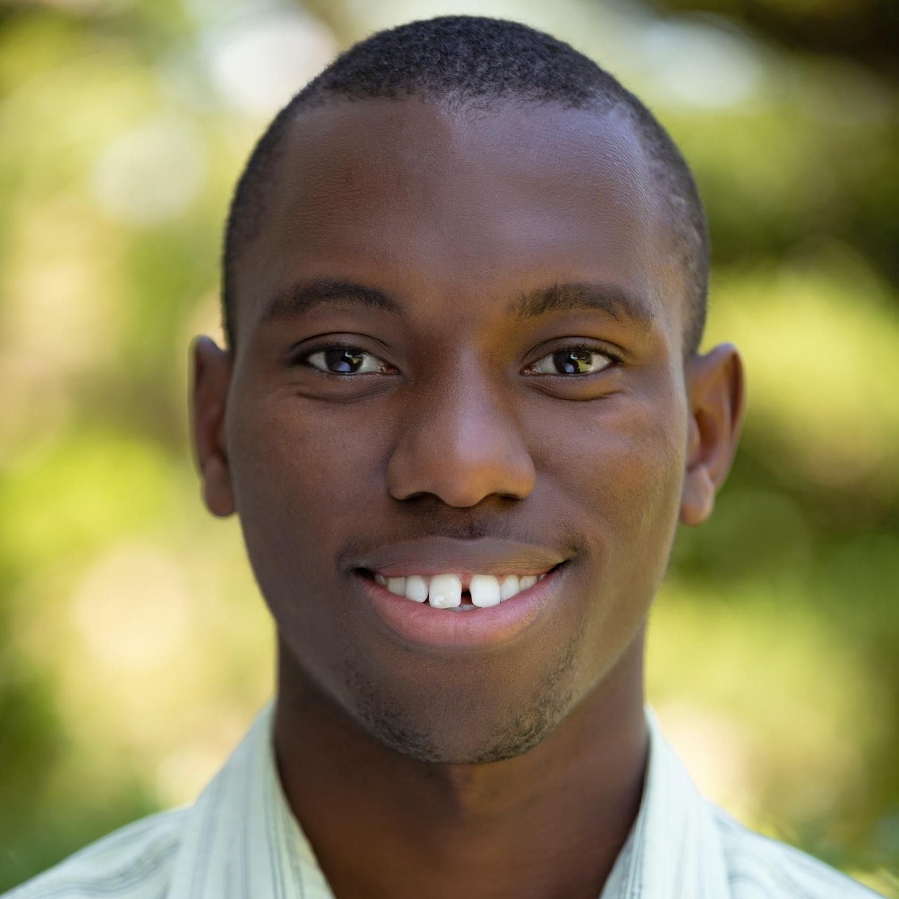
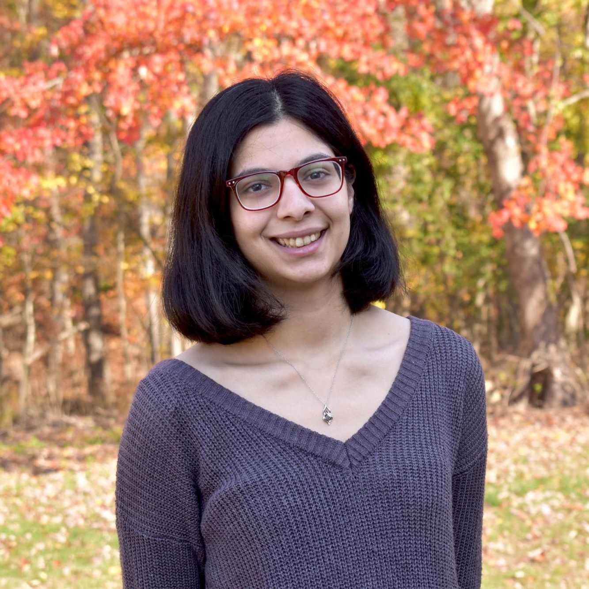

**[JXTX: The James P. Taylor Foundation for Open Science](/jxtx/foundation)** is pleased to announce the recipients of the 2020 JTech Scholarships. The JXTX Foundation provides support for students to attend conferences in computational biology and data science, where they can present their work and form connections with other researchers in the field.

Ten genomics and data sciences graduate students from around the globe were awarded the first annual JTech scholarship.  These awardees will present their work at the [2020 Cold Spring Harbor Laboratory (CSHL) Biological Data Science Conference](https://meetings.cshl.edu/meetings.aspx?meet=DATA&year=20) being held virtually November 4-6.  Awardees represent ten institutions and are presenting a wide range of research at the meeting.

In addition to covering conference registration, awardees will also be paired with senior researchers in the field prior to the conference. Awardees and mentors will meet before and during the conference to establish what we hope will become long term relationships.

<!-- Emily -->

Emily Davis-Marcisak

Johns Hopkins University

*Matrix factorization of single-cell RNA-sequencing identifies immune cell states that project across species, cancer type, and infectious disease*

<!-- Georgia -->

Georgia Doing

[Hogan Lab](https://sites.dartmouth.edu/hoganlab/), Geisel School of Medicine at Dartmouth

*De-noising autoencoder-derived gene expression signatures for* Pseudomonas aeruginosa *elucidate virulence-promoting characteristics of ex vivo sputum from persons with cystic fibrosis*

<!-- Kwame -->

Kwame Forbes

University of North Carolina Chapel Hill

*Integration of preprocessed single-cell datasets with bulk differential analysis results for DESeq2*

<!-- Yuhan -->

Yuhan Hao

New York Genome Center and New York University

*Multi-modal representation and mapping of single-cell data*

<!-- Anoushka Joglekar -->

[Anoushka Joglekar](https://twitter.com/noush_joglekar)

Weill Cornell Medicine

*Cell type signatures of brain-region specific splicing in postnatal development*

<!-- John -->

[John Lawson](https://j-lawson.github.io/)

Center for Public Health Genomics and Department of Biomedical Engineering, University of Virginia

*COCOA: coordinate covariation analysis to annotate epigenetic heterogeneity*

<!-- Jens  -->

[Jens Luebeck](https://jluebeck.github.io/)

Bioinformatics & Systems Biology, University of California, San Diego

*AmpliconReconstructor integrates NGS and optical mapping to resolve the complex structures of focal amplifications*

<!--  David -->

[David Twesigomwe](https://about.me/twesidave)

Sydney Brenner Institute for Molecular Bioscience, University of the Witwatersrand

*CypGen: A Nextflow pipeline for calling star alleles in cytochrome P450 genes*

<!-- Loan -->

[Loan Vulliard](http://vulliard.loan/)

Department of Biochemistry and Cell Biology, Max Perutz Labs, University of Vienna

*Understanding Chemical-Genetic Interactions: Morphological screen of combined perturbations*

<!-- Sumaira -->

Sumaira Zaman

University of Connecticut

*EASEL: Efficient, Accurate, Scalable Eukaryotic modeLs for de novo Genome Annotation*

## About JXTX: The James P. Taylor Foundation for Open Science

“The most important job of senior faculty is to mentor junior faculty and students.” These are the words that Professor [James P. Taylor](https://galaxyproject.org/jxtx/), the Ralph S. O’Connor Professor at the Departments of Biology and Computer Science at Johns Hopkins University said and lived by. This, he believed, was imperative to advance science, and in a way that facilitated diversity and inclusion. The mission of this foundation is to continue his legacy, through a multifaceted approach which will be unrolled across several stages.

Towards the goal of advancing mentorship, the JXTX Foundation will organize and host mentoring sessions between senior and junior faculty members at select high-profile meetings.  JTech also aims to attract new scholars, including high school and undergrad students, to computational biology and data science, and to form connections and opportunities for members of underrepresented minority populations.

According to his colleagues, James hated self-promotion. But the community would be done a grave disservice if the seeds planted by Dr.Taylor were not nourished to grow and flourish.  Thank you to those who have generously contributed.

**Please consider [making a donation](https://jxtxfoundation.org/donate/) to support James Taylor’s legacy.**
