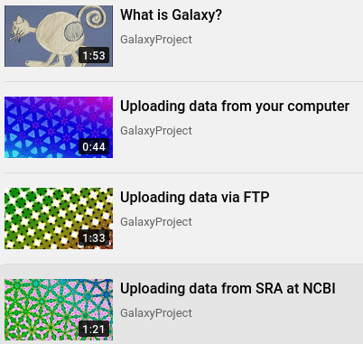

In this issue:

<ul style="font-size: 1.1rem;">
  <li>**[Event news](#event-news)**:
    <ul>
      <li>2nd Galaxy-ELIXIR webinar series, *starts January 20*</li>
      <li>Galaxy Developer Roundtables, *January 7 & 21*</li>
      <li>Papercuts CollaborationFest: *January 21*</li>
      <li>Future Galaxy Admin Trainings, *Register your interest*</li>
      <li>Tripal CodeFest 2021: *January 11-15*</li>
      <li>Structural Variant Detection using ONT Data, *January 26*</li>
      <li>GTN Smörgåsbord: A Global Galaxy Course. *Register by February 1*</li>
      <li>Single-cell RNA-seq & network analysis using Galaxy and Cytoscape, *Apply by 26 February*
    </ul>
  <li>**[Galaxy platform news](#galaxy-platforms-news):**
    <ul>
      <li>UseGalaxy.no</li>
      <li>VINYL on Laniakea</li>
      <li>W4M on UseGalaxy.fr</li>
      <li>Center for Phage Technology server upgraded and improved</li>
      <li>Plus more UseGalaxy.\* news</li>
    </ul>
  </li>
  <li>**[Blog posts](#galactic-blog-activity):**
    <ul>
      <li>Involvement of the Galaxy community in OLS-2 and invitation to apply to the next cohort</li>
      <li>DDA and DIA proteomic analysis in Galaxy</li>
      <li>GTN plant-related trainings</li>
    </ul>
  </li>
  <li>**[Training material and doc updates](#doc-hub-and-training-updates)**:
    <ul>
      <li>Videos: Galactic Introductions</li>
      <li>Videos: Quick Tips</li>
    </ul>
  </li>
  <li>**[Publications](#publications)**
    <ul>
      <li>Metaproteomics, CorGAT (SARS-CoV-2), GAIT-GM (metabolites), and training</li>
    </ul>
  </li>
  <li>**[Q: Who's hiring?](#whos-hiring)**
    <ul>
      <li> Europe:
        <ul>
          <li>MPI, Norwegian University of Life Science, IFB, VIB</li>
        </ul>
      </li>
      <li>North America:
        <ul>
          <li>Roche, Johns Hopkins (AnVIL, 2 positions; Galaxy, 2 Positions)</li>
        </ul>
    </ul>
  </li>
  <li>**[New releases](#releases)**:
    <ul>
      <li>Planemo 0.74.1</li>
    </ul>
  </li>
</ul>

 

If you have anything to include to next month's newsletter, then please send it to outreach@galaxyproject.org.

---

# Event News

Despite COVID-19, there is still a lot going on, although online. We have updated our [list of events](/events/) to reflect what we know. Some highlights:

<!-- Galaxy Webinars -->

[2nd Galaxy-ELIXIR webinar series](https://elixir-europe.org/events/2nd-galaxy-elixir-webinar-series)

**20 January - 24 February**
 
*Open Data Infrastructures to tackle COVID-19 pandemic*

This series of [six webinar sessions](https://elixir-europe.org/events/2nd-galaxy-elixir-webinar-series) features experts from ELIXIR and the global Galaxy community demonstrating how open access and open science are fundamental for fast and efficient response to public health crises. The first two webinars are:

1. **COVID-19 analysis in Galaxy: Lessons learned and introduction to the series, 20 January**
2. **Importance of (open) infrastructures in responding to a pandemic, 27 January**

<!-- Galaxy Dev Round Table -->

[Galaxy Developer Roundtables](/community/devroundtable/)

There are two roundtable meetups this month:

* **[Galaxy Working Groups Follow Up and Discussion](/events/2021-01-07-dev-roundtable/), January 7**, Björn Grüning, Anton Nekrutenko
* **[FastAPI](/events/2021-01-21-dev-roundtable/), January 21**, Marius van den Beek

<!-- Paper Cuts -->

[January Papercuts CollaborationFest](/events/2021-01-papercuts/)

**21 January, Online**

Our one-day January Paper Cuts contribution fest is a 24-hour event spanning all time zones with our worldwide community.

Please save the date! **It's an ideal opportunity for newcomers to become a Galaxy contributor.**

<!--Galaxy Admin Training -->

[Future Galaxy Admin Trainings](/events/2021-01-admin-training/)

The application deadline for the [January 2021 Galaxy Admin Training](/events/2021-01-admin-training/) has passed, and (as expected) we received more applications than we have slots.  If you missed the deadline or weren't accepted, then all is not lost because:

1. More than a day of Admin Training will be offered as [part of GCC2021](https://www.vibconferences.be/events/gcc2021) in July.
1. You can [register your interest in future Galaxy Admin Trainings here](https://docs.google.com/forms/d/e/1FAIpQLSfKAcHcZGt7H9LyXbfKJNCrDkh1dwPproyirxSmasD9Aqt2JQ/viewform).  *If we get enough interest, we will try to hold another online training sometime this year.*

<!-- Tripal Codefest 2021 -->

[Tripal CodeFest 2021](http://tripal.info/events/codefest_2021)

**11-15 January, Online**

*Calling all Tripal Core, Extension Module and Tool Integration Developers!*

[Tripal](http://tripal.info/) is a toolkit for construction of online biological (genetics, genomics, breeding, etc.), community database web portals. Tripal includes [Tripal Galaxy](https://github.com/tripal/tripal_galaxy) and [blend4php](https://github.com/galaxyproject/blend4php).

<!-- SV with ONT -->

[Structural Variant Detection using ONT Data](/events/2021-01-sv-with-ont/sv-with-ont.pdf)

**January 26, Online**

In this webinar, Nathan Roach​ ([GalaxyWorks](https://galaxyworks.io/)) will demonstrate analysis methods of long read data using the Oxford Nanopore (ONT) tool suite in Galaxy Pro. [Michael Alonge](https://michaelalonge.com/)​ (Johns Hopkins University) will highlight the application of these methods.

<!-- GTN Smörgåsbord -->

[GTN Smörgåsbord: A Global Galaxy Course](https://shiltemann.github.io/global-galaxy-course/)

**15-19 February, Online; Register by 1 February**

This week-long workshop on how to use Galaxy will be online, global, and free.  The [program](https://shiltemann.github.io/global-galaxy-course/#program) covers a general introduction to the Galaxy platform, NGS Analysis (DNA-seq and RNA-seq), Proteomics, and also features a *Choose your own adventure* day (!?).

<!-- EBI Single Cell -->

[Single-cell RNA-seq & network analysis using Galaxy and Cytoscape](https://www.ebi.ac.uk/training-beta/events/single-cell-rna-seq-network-analysis-using-galaxy-and-cytoscape/)

**26-30 April, Online; Apply by 26 February**

"This course utilises Galaxy pipelines, an online open-access resource that allows *even the most computer-phobic bench scientists to analyse their biological data.* Participants will be guided through the droplet-based scRNA-seq analysis pipelines from raw reads to cell cluster comparisons."

# Galaxy Platforms News

The [Galaxy Platform Directory](/use/) lists resources for easily running your analysis on Galaxy, including publicly available servers, cloud services, and containers and VMs that run Galaxy.  Here's the recent platform news we know about:

<!-- UseGalaxy.No -->

[UseGalaxy.no](/use/usegalaxy-no/)

A central, joint & free [Galaxy instance for Norway-based researchers and their collaborators](https://usegalaxy.no/), with ~2000 bioinformatics tools, 200 GB short-term storage and project storage on nels.bioinfo.no.

<!-- VINYL -->

[VINYL on Laniakea](/use/vinyl/)

A flexible and fully automated system for the functional annotation and prioritization of genetic variants. The [VINYL server](http://www.beaconlab.it/VINYL) runs on the [Laniakea research cloud](/use/laniakea/). A [VINYL manual](http://90.147.75.93/galaxy/static/manual/), including a tutorial is provided.

<!-- W4M -->

[W4M on UseGalaxy.fr](https://workflow4metabolomics.usegalaxy.fr/)

The [Workflow4Metabolomics (W4M) server](https://workflow4metabolomics.usegalaxy.fr/) has completed its move to [UseGalaxy.fr](https://usegalaxy.fr/), the French national Galaxy server supported by [IFB](https://www.france-bioinformatique.fr/).

<!-- Center for Phage Technology (CPT) -->

[Center for Phage Technology (CPT)](/use/center-for-phage-technology-cpt/)

The upgraded and improved Galaxy-Apollo phage annotation platform is now ready to use at https://cpt.tamu.edu/galaxy-pub. Free, web-based, gold standard phage annotation.

<!-- UseGalaxy.* -->

[UseGalaxy.*](/usegalaxy/) News

* Wanna know what has happened in the European Galaxy community in 2020? The Freiburg Galaxy Team has summarised the activities in a [blog post](https://galaxyproject.eu/posts/2020/12/31/balance-2020/).
* Lots of tool updates on [UseGalaxy.eu](https://galaxyproject.eu/news?tag=tools) and [UseGalaxy.org.au](https://usegalaxy-au.github.io/galaxy/news.hgtml).

# Galactic Blog Activity

<!-- OLS-3 -->

[Involvement of the Galaxy community in OLS-2 and invitation to apply to the next cohort](https://galaxyproject.eu/posts/2020/12/22/ols/)

The Galaxy Project has been involved in the second cohort of the [Open Life Science (OLS)](https://openlifesci.org/) program with two projects, _Growing the Galaxy Community_ and _Creating a single pipeline for metagenome classification_.

[Applications for the 3rd cohort (OLS-3)](https://openlifesci.org/ols-3) that will take place from February to May 2021 are open until __January 11__.

<!-- TIaaS -->

[DDA and DIA proteomic analysis in Galaxy](https://galaxyproject.eu/posts/2020/12/08/tiaas_feedback_Melanie-Matthias/)

By [Matthias Fahrner](https://training.galaxyproject.org/training-material/hall-of-fame/matthias313/) & [Melanie Föll](https://training.galaxyproject.org/training-material/hall-of-fame/foellmelanie/).

At the beginning of December, Melanie and Matthias ran a 2-day Proteomics data analysis workshop organized by ELIXIR Belgium.

<!-- Plant tutorials -->

[GTN plant-related trainings](https://galaxyproject.eu/posts/2021/01/04/plant-trainings/)

Good news for the plant community! Recently two new trainings of interest to the plant research community have been incorporated to the GTN tutorial collection.

A common feature shared by both tutorials is the use of sequencing data generated by nanopore technology, a third-generation plataform which provides the possibility of sequencing long reads.

# Doc, Hub, and Training Updates

<!-- Galactic Introductions -->

[Videos: Galactic Introductions](https://www.youtube.com/playlist?list=PLNFLKDpdM3B9UaxWEXgziHXO3k-003FzE)

New series of Galaxy videos about Galaxy features.

<!-- Quick Tips -->

[Videos: Quick Tips](https://www.youtube.com/playlist?list=PLNFLKDpdM3B8__nz2xlzY2bA_2Sb_vb2o)

Learn your way through Galaxy interface and functionalities with automatically generated videos under 3 minutes.

# Publications

Pub curation activities [are on hiatus right now](/news/2020-08-10k-pubs/#the-future) but a few publications referencing, using, extending, and implementing Galaxy were added to the [Galaxy Publication Library](https://www.zotero.org/groups/galaxy) anyway.  Here are the new open access *Galactic* and *Stellar* pubs:

 [Metaproteomics Analysis of SARS-CoV-2-Infected Patient Samples Reveals Presence of Potential Coinfecting Microorganisms](https://doi.org/10.1021/acs.jproteome.0c00822)

Thuy-Boun P.S., Mehta, S., Gruening, B., McGowan, T., Nguyen, A. Rajczewski, A.T., Johnson, J.E., Griffin, T.J., Wolan, D.W., and Jagtap, P.D. (2020).  *Journal of Proteome Research*. [doi: 10.1021/acs.jproteome.0c00822](https://doi.org/10.1021/acs.jproteome.0c00822)

 [CorGAT: a tool for the functional annotation of SARS-CoV-2 genomes](https://doi.org/10.1093/bioinformatics/btaa1047)

Chiara, M., Zambelli, F., Tangaro, M.A., Mandreoli, P., Horner, D.S., Pesole, G. (2020). *Bioinformatics*. [doi: 10.1093/bioinformatics/btaa1047](https://doi.org/10.1093/bioinformatics/btaa1047)

 [GAIT-GM: Galaxy tools for modeling metabolite changes as a function of gene expression](https://doi.org/10.1101/2020.12.25.424407)

McIntyre, L.M., Huertas, F., Moskalenko, O., Llansola, M., Felipo, V., Morse, A.M., Conesa, A. (2020). *bioRxiv*. [doi: 10.1101/2020.12.25.424407](https://doi.org/10.1101/2020.12.25.424407)

 [A Constructivist-based Proposal for Bioinformatics Teaching Practices During Lock-down](https://www.preprints.org/manuscript/202008.0532/v2)

Gallardo-Alba, C., Grüning, B., & Serrano-Solano, B. (2020).  *Preprints.* [doi: 10.20944/preprints202008.0532.v2](https://www.preprints.org/manuscript/202008.0532/v2)

# Who's Hiring

<!-- MPI -->

[Bioinformaticians](https://www.ie-freiburg.mpg.de/5439833/job_full_offer_16204637)

Bioinformatics Unit, [Max Planck Institute of Immunobiology and Epigenetics](https://www.ie-freiburg.mpg.de/), Freiburg, Germany

Work in an interdisciplinary team with close links to different departments, research groups, and other core facilities.

**Apply by 22 January.**

<!-- NMBU -->

[PhD or postdoc project Spring/Summer  2021](https://www.nmbu.no/en/research/groups/memo/join-us-)

[MEMO Group](https://www.nmbu.no/en/research/groups/memo), [Norwegian University of Life Science](https://www.nmbu.no/en), Ås, Norway

Interested in host-microbiome interactions and multi-omic data? We have multiple positions starting in 2021. Projects have fun and interesting EU partners. Will be hiring after Christmas.

<!-- Hopkins AnVIL / ITCR -->

[Research Associate in Biomedical Data Science](https://apply.interfolio.com/81395)

Department of Biostatistics, Bloomberg School of Public Health, Johns Hopkins University.

Data science research and education focusing on genomics ([AnVIL](https://anvilproject.org/), [Genomic Data Science Community Network](http://www.gdscn.org/)), cancer ([ITCR](https://itcr.cancer.gov/))  or pain [A2CPS](https://a2cps.org/).

<!-- Roche -->

[Principle Scientist II, Bioinformatics](https://roche.wd3.myworkdayjobs.com/en-US/roche-ext/job/Pleasanton/Principle-Scientist-II--Bioinformatics_202010-126228-1)

Roche, Bay Area, California, United States.

* Lead data mining for biomarker discovery for medical conditions of interest.
* Develop Agile Assay Design (AAD) tools for qPCR tests.
* NGS data analysis tools and/or workflows.
* Use these tools & workflows for R&D projects.
* Deploy these tools on Roche intranet (Galaxy) and train scientists to use them.

<!-- AnVIL -->

[AnVIL Project Manager](https://jobs.jhu.edu/job/Baltimore-AnVIL-Project-Manager-MD-21218/682125700/)

Johns Hopkins University, Baltimore, Maryland, United States.

Provide technical expertise and oversight for the [AnVIL Project](http://anvilproject.org/), which incorporates Galaxy, Bioconductor, Terra, Gen3, and Dockstore into a secure cloud-based software ecosystem for genomic data analysis.

<!-- Hopkins -->

[Software Engineer/Full Stack Developer](https://jobs.jhu.edu/job/Baltimore-Software-EngineerFull-Stack-Developer-MD-21218/667182900/) and [Sr. Programmer Analyst](https://jobs.jhu.edu/job/Baltimore-Sr_-Programmer-Analyst-MD-21218/666390700/)

The Schatz Lab at Johns Hopkins University is looking for:

* Self-driven individuals that can work independently to fill multiple software development positions on the Galaxy Project.
* Ambitious individuals to fill a programmer analyst position working on the Galaxy and [AnVIL](https://anvilproject.org/) projects.

<!-- IFB -->

[Engineer Developer / DevOps](https://www.france-bioinformatique.fr/ingenieure-developpeur-devops/)

The [French Institute of Bioinformatics (IFB)](https://www.france-bioinformatique.fr/) is offering a 1-year position for a developer to work on [usegalaxy.fr](https://usegalaxy.fr/), focused on the contribution to the development, evolution, deployment and maintenance of the French infrastructure.

<!-- VIB -->

[Communications and Community Outreach Officer](https://jobs.vib.be/j/32498/communications-and-community-outreach-officer) and [Research Software Engineer](https://jobs.vib.be/j/32497/research-software-engineer)

VIB-UGent Center for Plant Systems Biology has two open positions to work on the [ELIXIR Belgium](https://www.elixir-belgium.org/) research data analysis team, both for an initial duration of 2 years.

# Releases

Planemo 0.70-0.74.1

[Planemo](https://pypi.python.org/pypi/planemo) is a set of
command-line utilities to assist in developing Galaxy and [Common Workflow Language](https://www.commonwl.org/) artifacts - including tools, workflows, and training materials.  These releases included numerous fixes and enhancements. Some major changes

* `gxwf` functionality integrated, greatly expanding workflow development support.
* Finished migration to Python 3.
* Testing infrastructure improvements.

See [GitHub for details](https://github.com/galaxyproject/planemo/blob/master/HISTORY.rst).

