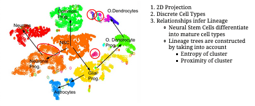
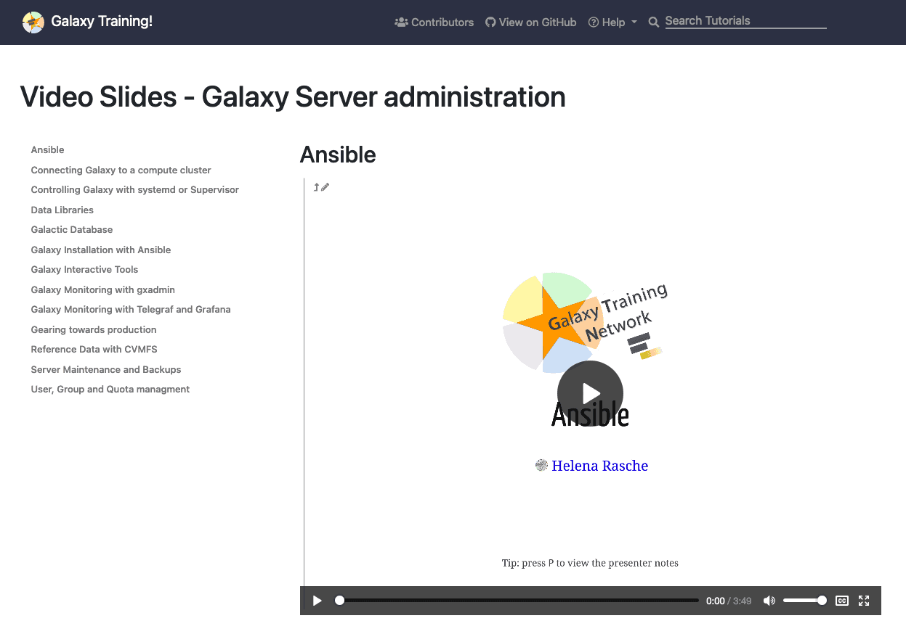
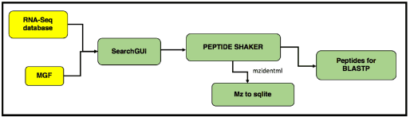

In this issue:

<ul style="font-size: 1.1rem;">
  <li>**[Event news](#event-news)**:
    <ul>
      <li>GCC2021 will be virtual, affordable, and globally accessible.</li>
      <li>GTN Smörgåsbord: A Global Galaxy Course. *Register by February 12 and we want your help!*</li>
      <li>2nd Galaxy-ELIXIR webinar series, *February 10, 17, 24.*</li>
      <li>Papercuts and GTN CollaborationFest: *February 25.*</li>
      <li>CWL Mini Conference. *Starts Today.*</li>
      <li>Galaxy Developer Roundtable. *February 18, we need your topics.*</li>
      <li>Single-cell RNA-seq & network analysis using Galaxy and Cytoscape. *Apply by 26 February.*
    </ul>
  <li>**[Galaxy platform news](#galaxy-platforms-news)**:
    <ul>
      <li>ATACgraph</li>
      <li>CorGAT on Laniakea</li>
      <li><em>Everything</em> on UseGalaxy.eu</li>
      <li>Plus more UseGalaxy.\* news</li>
    </ul>
  </li>
  <li>**[Blog posts](#galactic-blog-activity)**:
    <ul>
      <li>Nora, the new visualisation in Galaxy</li>
      <li>Three articles related to COVID-19 research using Galaxy in the de.NBI brochure</li>
      <li>Trusted CI and SGCI Collaborate to Secure the Galaxy Platform</li>
      <li>New and updated CNV and Variant Calling tools</li>
      <li>Variant Analysis of SARS-CoV-2 Sequencing Data: January 2021 update</li>
      <li>Major update to SearchGUI and PeptideShaker</li>
      <li>Try out Galaxy in Terra via AnVIL</li>
      <li>Analysis of RNA-seq data from neurodegenerative disease</li>
      <li>Galaxy Metabolomics Mini-Symposium report</li>
    </ul>
  </li>
  <li>**[Training material and doc updates](#doc-hub-and-training-updates)**:
    <ul>
      <li>Report on 2021 Galaxy Admin Training</li>
      <li>Galaxy Server Administration Tutorials Update</li>
      <li>An introduction to scRNA-seq data analysis</li>
      <li>Gallantries implements automated text to speech for slides...</li>
      <li>... resulting in lots of new videos!</li>
      <li>Life Science Trainers Questionnaire</li>
      <li>Functionally Assembled Terrestrial Ecosystem Simulator (FATES)</li>
      <li>Proteogenomics 2: Database Search</li>
      <li>Chloroplast genome assembly</li>
    </ul>
  </li>
  <li>**[Publications](#publications)**:
    <ul>
      <li>Tool recommender system in Galaxy using deep learning</li>
      <li>Comparative ligand structural analytics illustrated on variably glycosylated MUC1 antigen–antibody binding</li>
      <li>PDAUG - a Galaxy based toolset for peptide library analysis, visualization, and machine learning modeling</li>
      <li>CorGAT: A tool for the functional annotation of SARS-CoV-2 genomes</li>
      <li>Deep Learning for Detection and Segmentation in High-Content Microscopy Images</li>
      <li>ATACgraph: Profiling Genome-Wide Chromatin Accessibility From ATAC-seq</li>
      <li>SHARP: Harmonizing Galaxy and Taverna workflow provenance</li>
      <li>SARS-CoV-2 RECoVERY: A multi-platform open-source bioinformatic pipeline for the automatic construction and analysis of SARS-CoV-2 genomes from NGS sequencing data</li>
    </ul>
  </li>
  <li>**[Who's hiring?](#whos-hiring)**
    <ul>
      <li> Europe:
        <ul>
          <li>INRAE & AgroParisTech, Norwegian University of Life Science, IFB, VIB</li>
        </ul>
      </li>
      <li>North America:
        <ul>
          <li>Cleveland Clinic, Roche, Johns Hopkins (AnVIL, 2 positions; Galaxy, 2 Positions)</li>
        </ul>
    </ul>
  </li>
  <li>**[New releases](#releases)**:
    <ul>
      <li>Galaxy Language Server 0.3.2</li>
    </ul>
  </li>
  <li>**[Other News](#other-news)**:
    <ul>
      <li>Chan Zuckerberg Initiative injects funds into Galaxy platform for biomedical research</li>
      <li>Nuovo software per l’analisi genomica del Covid</li>
      <li>EMBL COVID-19 Data Platform</li>
    </ul>
  </li>
</ul>

 

If you have anything to include to next month's newsletter, then please send it to outreach@galaxyproject.org.

---

# Event News

Despite COVID-19, there is still a lot going on, although online. We have updated our [list of events](/src/events/index.md) to reflect what we know. Some highlights:

<!-- GCC2021 Goes Virtual -->

[GCC2021 Goes Virtual](/src/news/2021-02-gcc-virtual/index.md)

**The [2021 Galaxy Community Conference](https://www.vibconferences.be/events/gcc2021) will be virtual, affordable, and globally accessible.**

Things are just too uncertain to continue to plan an in person event for early July. GCC2021 won't be in person, but it will be more accessible and affordable because of it:

* **GCC2021 events will be held twice each day**, once in their original Ghent time zone (GCC EMEA/APO), and again 8 hours later in the Americas (GCC Americas).
* **Registration rates will be a fraction of the cost of an in person event**, and will include a significant discount for students and researchers based in low and lower-middle income countries.

Other things are changing too. See [the announcement](/src/news/2021-02-gcc-virtual/index.md) for details.

<!-- GTN Smörgåsbord -->

[GTN Smörgåsbord: A Global Galaxy Course](https://shiltemann.github.io/global-galaxy-course/)

**15-19 February, Online, Global**

**[Register by 12 February.](https://shiltemann.github.io/global-galaxy-course/)**

This week-long workshop on how to use Galaxy will be online, global, and free.  The [program](https://shiltemann.github.io/global-galaxy-course/#program) covers a general introduction to the Galaxy platform, NGS Analysis (DNA-seq and RNA-seq), Proteomics, and also features a *Choose your own adventure* day (!?).

**Instructors and Instructor Support Wanted**

Are you interested in teaching with Galaxy, and would you like to be involved in this event?  **[Then we want your help](https://shiltemann.github.io/global-galaxy-course/instructors.html)**.

<!-- Galaxy Webinars -->

[2nd Galaxy-ELIXIR Webinar Series](https://elixir-europe.org/events/2nd-galaxy-elixir-webinar-series)

**10, 17, 24 February**
 
*Open Data Infrastructures to tackle COVID-19 pandemic*

This series of [webinars](https://elixir-europe.org/events/2nd-galaxy-elixir-webinar-series) features experts from ELIXIR and the global Galaxy community demonstrating how open access and open science are fundamental for fast and efficient response to public health crises. This webinar series wraps up this month:

**Insights from selection analysis of complete genomes and read-level data**, *10 February*

**Viral Beacon and Galaxy variant workflows**, *17 February*

**DRS, long-read-sequencing, proteomics and more — an update to recent COVID-19 workflow developments**, *24 February*

<!-- Paper Cuts & GTN Cofest -->

[February Papercuts + GTN: CoFests & Community Calls](/src/events/2021-02-gtn/index.md)

**25 February, Online, Global**

The February GTN CoFest & Community calls are joining forces with the February Papercuts Cofest day for a concurrent, 24 hour long event, starting in Melbourne, Australia, and following the sun all the way to Portland, Oregon.

Both events will feature community calls throughout the day with community engagement on chat throughout the day.  This is an excellent opportunity to become a contributor to the global open science, open source, and open access Galaxy community.

* [Galaxy Training Network day -  CoFest and community call](/src/events/2021-02-gtn/index.md)
* [Galaxy February Papercuts CoFest day](/src/events/2021-02-papercuts/index.md)

Please join us online on 25 February, wherever you are in the world.

<!-- CWL MiniConf -->

[CWL Mini Conference](https://github.com/common-workflow-language/common-workflow-language/wiki/2021-CWL-Mini-Conference)

**8-10 February, Online, Global**

Three half days of talks, discussions and co-working time, all about the [Common Workflow Language](https://www.commonwl.org/).

**[Register now](https://docs.google.com/forms/d/e/1FAIpQLSfls3QLbjqNCn4a0bE8ICjlmza3h93Sq-zV81VC_OxNybSAxA/viewform).**

<!-- MassSpec Meetup -->

[Mass Spectrometry Meetup](https://z.umn.edu/celestialmasses)

**18 February, Online, Global**

Working in mass spec?  The Galaxy mass spec community gathers every 6 weeks and the next meetup is February 18.  The meeting will include a panel discussion on *Tools and Workflows for Mass Spec in Galaxy and GTN.*  Please join us.

<!-- Galaxy Dev Round Table -->

[Galaxy Developer Roundtable](/src/community/devroundtable/index.md)

There next roundtable meetup will be:

**[February 18: Featuring You!](/src/events/2021-02-18-dev-roundtable/index.md)**, We don't yet have topics for this round table. *If you have topics you want to discuss, [please submit them by February 15](https://bit.ly/gxdevroundtablepresent)*.

<!-- EBI Single Cell -->

[Single-cell RNA-seq & network analysis using Galaxy and Cytoscape](https://www.ebi.ac.uk/training-beta/events/single-cell-rna-seq-network-analysis-using-galaxy-and-cytoscape/)

**26-30 April, Online; Apply by 26 February**

"This course utilises Galaxy pipelines, an online open-access resource that allows *even the most computer-phobic bench scientists to analyse their biological data.* Participants will be guided through the droplet-based scRNA-seq analysis pipelines from raw reads to cell cluster comparisons."

# Galaxy Platforms News

The [Galaxy Platform Directory](/src/use/index.md) lists resources for easily running your analysis on Galaxy, including publicly available servers, cloud services, and containers and VMs that run Galaxy.  Here's the recent platform news we know about:

<!-- ATACgraph -->

[ATACgraph](/src/use/atacgraph/index.md)

The [ATACgraph Galaxy container](https://hub.docker.com/r/lsbnb/galaxy_atacgraph) profiles accessible chromatin regions and provides ATAC-seq-specific information including definitions of nucleosome-free regions (NFRs) and nucleosome-occupied regions. ATACgraph also allows identification of differentially accessible regions between two ATAC-seq datasets.

<!-- CorGAT -->

[CorGAT](/src/use/corgat/index.md)

[CorGAT](http://corgat.cloud.ba.infn.it/galaxy) aligns complete assemblies of SARS-CoV-2 genomes wih the reference genomic sequence, to obtain a list of polymorphic positions and to annotate genetic variants.  See the [CorGAT Manual](https://corgat.readthedocs.io/en/latest/) for more.  CorGAT is one of several servers that runs on [Laniakea](/src/use/laniakea/index.md).

<!-- StreetScience, Virology, COVID-19, metabolomics, metagenomics -->

StreetScience / Virology / COVID-19 / Metabolomics / Metagenomics / ...

The Galaxy Europe team has been busy creating more customized Galaxy instances:

* [StreetScience](https://streetscience.usegalaxy.eu/)
* [Virology](https://virology.usegalaxy.eu/)
* [COVID-19](https://covid19.usegalaxy.eu/)
* [Metabolomics](https://metabolomics.usegalaxy.eu/), and
* [Metagenomics](https://metagenomics.usegalaxy.eu/)

These are just a few of the [large number of specialty subdomains hosted by UseGalaxy.eu](https://galaxyproject.eu/posts/2020/12/28/subdomains/).

<!-- UseGalaxy.* -->

[UseGalaxy.*](/src/usegalaxy/index.md) News

* Lots of tool updates on [UseGalaxy.eu](https://galaxyproject.eu/news?tag=tools) and [UseGalaxy.org.au](https://usegalaxy-au.github.io/galaxy/news.hgtml).

* UseGalaxy.eu has [increased in 11 TB its RAM](https://galaxyproject.eu/posts/2021/02/05/new-hw/) thanks to de.NBI-Cloud.

* The European Galaxy server listed as an official resource on the [COVID-19 Data Portal](https://www.covid19dataportal.org/related-resources).

# Galactic Blog Activity

<!-- Nora, the new visualisation in Galaxy -->

[Nora, the new visualisation in Galaxy](https://galaxyproject.eu/posts/2021/01/18/nora-available-in-Galaxy/)

A new framework for medical imaging research, Nora, has been added to the Galaxy visualisations. Nora has been developed by Dr. Marco Reisert and Dr. Elias Kellner at the Department of Radiology from the University Medical Center of Freiburg.

Nora will be included in the next Galaxy release, 21.01.

<!-- Three articles related to COVID-19 research using Galaxy in the de.NBI brochure -->

[Three articles related to COVID-19 research using Galaxy in the de.NBI brochure](https://www.denbi.de/images/Downloads/deNBI_COVID19_brochure.pdf)

Three articles using Galaxy have been included in the de.NBI brochure Data analysis for the COVID-19 Research.

- __RNA Bioinformatics to Analyze SARS-CoV-2 – The Causative Agent of COVID-19__, by Wolfgang R. Hess, Steffen C. Lott, Steve Hoffmann and Rolf Backofen.
- __Open Data, Software and Analytics as a response to emerging pathogen threats__, by Beatriz Serrano-Solano, Wolfgang Maier, Simon Bray, Gianmauro Cuccuru, Anika Erxleben, Bérénice Batut, Mehmet Tekman, Rolf Backofen and Björn Grüning.
- __Virtual Screening for SARS-CoV-2 Drug Development using Open Research and Compute Infrastructures__, by Simon Bray, Beatriz Serrano-Solano and Björn Grüning.

<!-- Trusted CI -->

[Trusted CI and SGCI Collaborate to Secure the Galaxy Platform](https://galaxyproject.eu/posts/2021/01/30/cnv-and-vc-updates/)

By Kelli Shute.

[Trusted CI](https://trustedci.org/) and Galaxy reviewed the security of a new Galaxy software distribution being developed as a containerized package, with an eye toward its use with sensitive information such as protected health information (PHI). See the [announcement](https://blog.trustedci.org/2021/02/trusted-ci-and-sgci-collaborate-to.html) and the [report](http://hdl.handle.net/2022/26262) for details.

<!-- New and updated CNV and Variant Calling tools -->

[New and updated CNV and Variant Calling tools](https://galaxyproject.eu/posts/2021/01/30/cnv-and-vc-updates/)

By Wolfgang Maier.

Wolfgang highlights a wide variety (14!) of tools useful for the analysis of Copy Number Variation (CNV).

<!-- Variant Analysis of SARS-CoV-2 Sequencing Data, Jan 2021 update -->

[Variant Analysis of SARS-CoV-2 Sequencing Data: January 2021 update](https://galaxyproject.eu/posts/2021/01/22/sars-cov-2-variant-analysis/)

By Wolfgang Maier and Björn Grüning.

Continuous tracking of viral evolution through genome sequencing.

<!-- Major update to SearchGUI and PeptideShaker -->

[Major update to SearchGUI and PeptideShaker](https://galaxyproject.eu/posts/2021/01/18/sg-ps-update/)

By Carlos Horro Marcos.

After 3 years of work, SearchGUI (SG), a tool that performs protein identification using various search engines, and PeptideShaker (PS) for protein identification (which uses SearchGUI results) have been deeply updated and released in new major versions: 4.0.7 and 2.0.5, respectively. 

<!-- Galaxy in Terra via AnVIL -->

[Try out Galaxy in Terra via AnVIL](https://terra.bio/try-out-galaxy-in-terra/)

By Geraldine Van der Auwera.

Run your own personal, and customizable Galaxy server in the secure (FISMA moderate) AnVIL environment.

<!-- TIaaS feedback -->

[Analysis of RNA-seq data from neurodegenerative disease](https://galaxyproject.eu/posts/2021/01/28/tiaas_Lachlan/)

By Lachlan Gray.

Lachlan tells the training experience or the SciX program at the University of New South Wales, Sydney.

<!-- Galaxy Metabolomics Mini-Symposium report -->

[Galaxy Metabolomics Mini-Symposium report](https://galaxyproject.eu/posts/2021/02/06/metabo-symposium/)

By Melanie C. Föll.

The past 29th of January, the Galaxy Metabolomics community had the first Mini-Symposium in which users as well as developers had the chance to present their work and discuss the fuure integration into Galaxy.

To know more about the Galaxy Metabolomics community, please [subscribe to the mailing list](https://lists.galaxyproject.org/lists/metabolomics.lists.galaxyproject.org/) or join the [metabolomics Gitter channel](https://gitter.im/usegalaxy-eu/metabolomics).

# Doc, Hub, and Training Updates

<!-- GAT Summary -->

[Galaxy Admin Training Report](https://gallantries.github.io/posts/2021/02/01/gat/)

By Helena Rasche.

Galaxy Admin Training was held online for the first time and running a global course for 88 participants required us to develop a large number of innovations we’re very excited to share with everyone.  Here is what we learned and future directions.

<!-- Server Admin Update -->

[Galaxy Server Administration Tutorials Updated](https://training.galaxyproject.org/training-material/topics/admin/)

By Galaxy Admin Training Instructors.

As a result of the recently completed Admin Training course, most [Galaxy Server Admin topics](https://training.galaxyproject.org/training-material/topics/admin/tutorials/job-destinations/tutorial.html) were updated:

* [Ansible](https://training.galaxyproject.org/training-material/topics/admin/tutorials/ansible/tutorial.html)
* [Galaxy Installation with Ansible](https://training.galaxyproject.org/training-material/topics/admin/tutorials/ansible-galaxy/tutorial.html)
* [Connecting Galaxy to a compute cluster](https://training.galaxyproject.org/training-material/topics/admin/tutorials/connect-to-compute-cluster/tutorial.html)
* [Data Libraries](https://training.galaxyproject.org/training-material/topics/admin/tutorials/data-library/tutorial.html)
* [Distributed Object Storage](https://training.galaxyproject.org/training-material/topics/admin/tutorials/object-store/tutorial.html)
* [Galaxy Monitoring with Reports](https://training.galaxyproject.org/training-material/topics/admin/tutorials/reports/tutorial.html)
* [Galaxy Monitoring with Telegraf and Grafana](https://training.galaxyproject.org/training-material/topics/admin/tutorials/monitoring/tutorial.html)
* [Galaxy Tool Management with Ephemeris](https://training.galaxyproject.org/training-material/topics/admin/tutorials/tool-management/tutorial.html)
* [Mapping Jobs to Destinations](https://training.galaxyproject.org/training-material/topics/admin/tutorials/job-destinations/tutorial.html)
* plus at least 6 more hands on examples and at least 13 slide decks.

<!-- Intro to scRNA Slides -->

[An introduction to scRNA-seq data analysis](https://training.galaxyproject.org/training-material/topics/transcriptomics/tutorials/scrna-intro/slides.html)

By Mehmet Tekman.

This new slide deck (and accompanying video, see next) provide a broad introduction to single-cell RNA-seq analysis concepts.

Mehmet updated the **[Pre-processing of 10X Single-Cell RNA Datasets](https://training.galaxyproject.org/training-material/topics/transcriptomics/tutorials/scrna-preprocessing-tenx/tutorial.html)** tutorial as well.

<!-- Gallantries Implements Automated TTS for Slides -->

[Gallantries implements automated text to speech for slides](https://gallantries.github.io/posts/2021/02/02/tts/)

By Helena Rasche.

This new feature will help the GTN contributors, as they will only need to enable video and opt-in to automatic video production. The video will be re-built anytime a contributor updates their slide decks in a completely automatic way.

<!--Videos -->

Videos!

A number of tutorials have already created videos using the new text to speech capability:

* [Functionally Assembled Terrestrial Ecosystem Simulator (FATES)](https://training.galaxyproject.org/training-material/topics/climate/videos/#video-climate-fates), added by Anne Fouilloux
* [Genome Annotation with Prokka](https://training.galaxyproject.org/training-material/topics/genome-annotation/videos/#video-genome-annotation-annotation-with-prokka), added by Anthony Bretaudeau
*  [An introduction to scRNA-seq data analysis](https://training.galaxyproject.org/training-material/topics/transcriptomics/videos/#video-transcriptomics-scrna-intro), added by Mehmet Tekman
* **[Thirteen videos on Galaxy Server Administration](https://training.galaxyproject.org/training-material/topics/admin/videos/)**, created by the 2021 Galaxy Admin Training instructors.
* [ Scripting Galaxy using the API and BioBlend](https://training.galaxyproject.org/training-material/topics/dev/videos/#video-dev-bioblend-api), added by Nicola Soranzo

<!-- Life Science Trainers -->

[Life Science Trainers Questionnaire](https://lifescitrainers.org/2021/01/18/global-trainers-survey/)

The global [Life Science Trainers Community](https://lifescitrainers.org/) (yes, you should join) wants to highlight the important role of trainers and understand how they can be better supported. If you are, or have been a trainer, [share your thoughts](https://lifescitrainers.org/2021/01/18/global-trainers-survey/) in this survey by March 20.

<!-- It's FATES! -->

[Functionally Assembled Terrestrial Ecosystem Simulator (FATES)](https://training.galaxyproject.org/training-material/topics/climate/tutorials/fates/tutorial.html)

By Anne Fouilloux and Hui Tang.

Familiarize yourself (**especially you ecologists**) with how to run a terrestrial ecosystem model (i.e., CLM-FATES) at site-level in Galaxy and then analyze the model results.

<!-- Proteogenomics db -->

[Proteogenomics 2: Database Search](https://training.galaxyproject.org/training-material/topics/proteomics/tutorials/proteogenomics-dbsearch/tutorial.html)

This tutorial on proteogenomic database searching using mass spectrometry data got a major update from Subina Mehta and JJ Johnson.

<!-- Chloroplast Assembly -->

[Chloroplast genome assembly](https://training.galaxyproject.org/training-material/topics/assembly/tutorials/chloroplast-assembly/tutorial.html)

This genome assembly tutorial got an update from Anna Syme.

 

# Publications

Pub curation activities [are on a semi-hiatus right now](/src/blog/2020-08-10k-pubs/index.md#the-future) but a few publications referencing, using, extending, and implementing Galaxy were added to the [Galaxy Publication Library](https://www.zotero.org/groups/galaxy) anyway.  Here are the new open access *Galactic* and *Stellar* pubs:

 [Tool recommender system in Galaxy using deep learning](https://doi.org/10.1093/gigascience/giaa152)

Kumar, A., Rasche, H., Grüning, B., & Backofen, R. (2021). *GigaScience*, 10(giaa152). [DOI: 10.1093/gigascience/giaa152](https://doi.org/10.1093/gigascience/giaa152)

 [Comparative ligand structural analytics illustrated on variably glycosylated MUC1 antigen–antibody binding](https://doi.org/10.3762/bjoc.16.206)

Barnett, C. B., Senapathi, T., & Naidoo, K. J. (2020). *Beilstein Journal of Organic Chemistry*, 16(1), 2540–2550. [DOI: 10.3762/bjoc.16.206](https://doi.org/10.3762/bjoc.16.206)

 [PDAUG - a Galaxy based toolset for peptide library analysis, visualization, and machine learning modeling](https://doi.org/10.1101/2021.02.02.429203)

Joshi, J., & Blankenberg, D. (2021). *BioRxiv*, 2021.02.02.429203. [DOI: 10.1101/2021.02.02.429203](https://doi.org/10.1101/2021.02.02.429203)

 [CorGAT: A tool for the functional annotation of SARS-CoV-2 genomes](https://doi.org/10.1093/bioinformatics/btaa1047)

Chiara, M., Zambelli, F., Tangaro, M. A., Mandreoli, P., Horner, D. S., & Pesole, G. (2020). *Bioinformatics*, btaa1047. [DOI: 10.1093/bioinformatics/btaa1047](https://doi.org/10.1093/bioinformatics/btaa1047)

 [Deep Learning for Detection and Segmentation in High-Content Microscopy Images](https://archiv.ub.uni-heidelberg.de/volltextserver/28827/)

Wollmann, T. S. (2020). [Dissertation, Heidelberg University]. [DOI: 10.11588/heidok.00028827](https://doi.org/10.11588/heidok.00028827)

 [ATACgraph: Profiling Genome-Wide Chromatin Accessibility From ATAC-seq](https://doi.org/10.3389/fgene.2020.618478)

Lu, R. J.-H., Liu, Y.-T., Huang, C. W., Yen, M.-R., Lin, C.-Y., & Chen, P.-Y. (2021). *Frontiers in Genetics*, 11. [DOI: 10.3389/fgene.2020.618478](https://doi.org/10.3389/fgene.2020.618478)

 [SHARP: Harmonizing Galaxy and Taverna workflow provenance](https://hal.archives-ouvertes.fr/hal-01768401)

Gaignard, A., Belhajjame, K., & Skaf-Molli, H. (2017, May). SeWeBMeDA 2017 : Semantic Web Solutions for Large-Scale BioMedical Data Analtics.

 [SARS-CoV-2 RECoVERY: A multi-platform open-source bioinformatic pipeline for the automatic construction and analysis of SARS-CoV-2 genomes from NGS sequencing data](https://doi.org/10.1101/2021.01.16.425365)

Sabato, L. D., Vaccari, G., Knijn, A., Ianiro, G., Bartolo, I. D., & Morabito, S. (2021). *BioRxiv*, 2021.01.16.425365. [DOI: 10.1101/2021.01.16.42536](https://doi.org/10.1101/2021.01.16.425365)

# Who's Hiring

<!-- Cleveland Clinic -->

[Postdoctoral Fellowships](https://blankenberglab.org/jobs)

[Blankenberg Lab](https://blankenberglab.org/), Genomic Medicine Institute, Cleveland Clinic Lerner Research Institute, Cleveland, Ohio, United States

Utilize high-throughput omics technologies, such as next generation sequencing, and data-intensive computing to explore biomedical research questions.

<!-- SynBioData -->

[Software and Galaxy Workflow Developers](http://www.jfaulon.com/wp-content/uploads/galaxy-engineer-positions_20210125.pdf)

[Galaxy-SynBioCAD team](https://www.jfaulon.com/galaxy-synbiocad-portal/), MICALIS Institute, INRAE & AgroParisTech, Jouy-en-Josas, France

Design solutions to synthesize molecules in microorganisms & to implement the sesolutions on robotized workstations.

**Apply by 1 March.**

<!-- NMBU -->

[PhD or postdoc project Spring/Summer  2021](https://www.nmbu.no/en/research/groups/memo/join-us-)

[MEMO Group](https://www.nmbu.no/en/research/groups/memo), [Norwegian University of Life Science](https://www.nmbu.no/en), Ås, Norway

Interested in host-microbiome interactions and multi-omic data? We have multiple positions starting in 2021. Projects have fun and interesting EU partners. Will be hiring after Christmas.

<!-- Hopkins AnVIL / ITCR -->

[Research Associate in Biomedical Data Science](https://apply.interfolio.com/81395)

Department of Biostatistics, Bloomberg School of Public Health, Johns Hopkins University. 

Data science research and education focusing on genomics ([AnVIL](https://anvilproject.org/), [Genomic Data Science Community Network](http://www.gdscn.org/)), cancer ([ITCR](https://itcr.cancer.gov/))  or pain [A2CPS](https://a2cps.org/).

<!-- Roche -->

[Principle Scientist II, Bioinformatics](https://roche.wd3.myworkdayjobs.com/en-US/roche-ext/job/Pleasanton/Principle-Scientist-II--Bioinformatics_202010-126228-1)

Roche, Bay Area, California, United States.

* Lead data mining for biomarker discovery for medical conditions of interest.
* Develop Agile Assay Design (AAD) tools for qPCR tests.
* NGS data analysis tools and/or workflows.
* Use these tools & workflows for R&D projects.
* Deploy these tools on Roche intranet (Galaxy) and train scientists to use them.

<!-- AnVIL -->

[AnVIL Project Manager](https://jobs.jhu.edu/job/Baltimore-AnVIL-Project-Manager-MD-21218/682125700/)

Johns Hopkins University, Baltimore, Maryland, United States.

Provide technical expertise and oversight for the [AnVIL Project](http://anvilproject.org/), which incorporates Galaxy, Bioconductor, Terra, Gen3, and Dockstore into a secure cloud-based software ecosystem for genomic data analysis. 

<!-- Hopkins -->

[Software Engineer/Full Stack Developer](https://jobs.jhu.edu/job/Baltimore-Software-EngineerFull-Stack-Developer-MD-21218/667182900/) and [Sr. Programmer Analyst](https://jobs.jhu.edu/job/Baltimore-Sr_-Programmer-Analyst-MD-21218/666390700/)

The Schatz Lab at Johns Hopkins University is looking for:
* Self-driven individuals that can work independently to fill multiple software development positions on the Galaxy Project.
* Ambitious individuals to fill a programmer analyst position working on the Galaxy and [AnVIL](https://anvilproject.org/) projects.

<!-- IFB -->

[Engineer Developer / DevOps](https://www.france-bioinformatique.fr/ingenieure-developpeur-devops/)

The [French Institute of Bioinformatics (IFB)](https://www.france-bioinformatique.fr/) is offering a 1-year position for a developer to work on [usegalaxy.fr](https://usegalaxy.fr/), focused on the contribution to the development, evolution, deployment and maintenance of the French infrastructure.

<!-- VIB -->

[Communications and Community Outreach Officer](https://jobs.vib.be/j/32498/communications-and-community-outreach-officer) and [Research Software Engineer](https://jobs.vib.be/j/32497/research-software-engineer)

VIB-UGent Center for Plant Systems Biology has two open positions to work on the [ELIXIR Belgium](https://www.elixir-belgium.org/) research data analysis team, both for an initial duration of 2 years.

# Releases

Galaxy Language Server 0.3.2

<iframe width="255" src="https://www.youtube.com/embed/MpPrgtNrEcQ" frameborder="0" allow="accelerometer; autoplay; clipboard-write; encrypted-media; gyroscope; picture-in-picture" allowfullscreen></iframe>

[Galaxy Language Server and Galaxy Tools VS Extension](https://github.com/galaxyproject/galaxy-language-server/releases/tag/v0.3.2) assist in the development fo Galaxy tools wrappers inside modern code editors.

The release 0.3.2. includes fixes and new features. See the [GitHub repository](https://github.com/galaxyproject/galaxy-language-server) for details.

# Other News

Chan Zuckerberg Initiative injects funds into Galaxy platform for biomedical research

This [news item from the Australian Research Data Commons (ADRC)](https://ardc.edu.au/news/chan-zuckerberg-initiative-injects-funds-into-galaxy-platform-for-biomedical-research/) highlights the recent grant to extend Galaxy, and Galaxy Australia's role in the effort.

Also see [Nuwan Goonasekera shares in Chan Zuckerberg Initiative grant for the Galaxy Project](https://uat.melbournebioinformatics.org.au/news/czigrant/) from Melbourne Bioinformatics.

[Nuovo software per l’analisi genomica del Covid](https://www.corrierenazionale.it/2021/01/31/nuovo-software-per-analisi-genomica-del-covid/)

Cnr e Statale di Milano hanno realizzato un nuovo software per l’analisi genomica del SARS-CoV-2: lo studio è stato pubblicato sulla rivista Bioinformatics.

[EMBL COVID-19 Data Platform](https://twitter.com/embl/status/1354718579866955781)

As the EMBL COVID19 Data Platform expands, it has enabled our partners at ELIXIR Belgium, Galaxy Project and Open Targets to build useful infectious disease tools and services on top of it.

[Watch the short video](https://twitter.com/embl/status/1354718579866955781).

