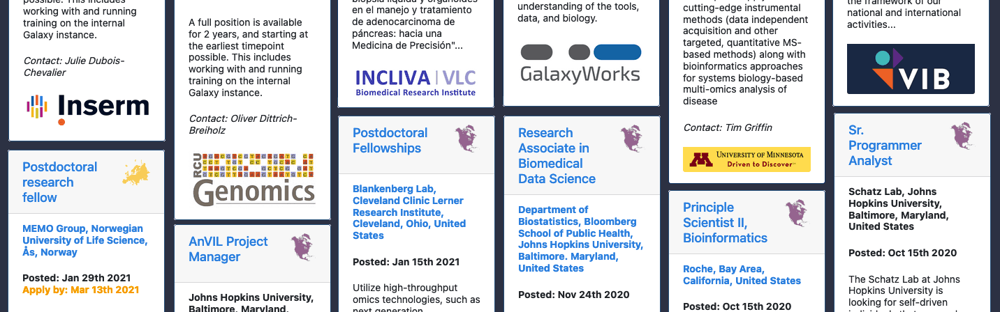
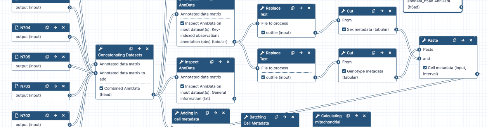
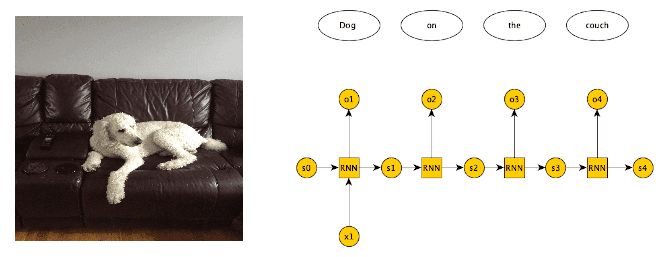
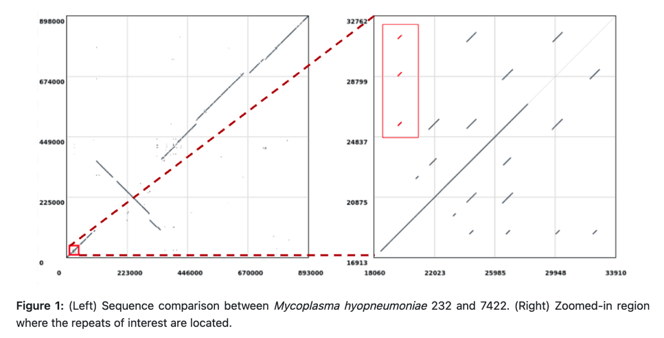
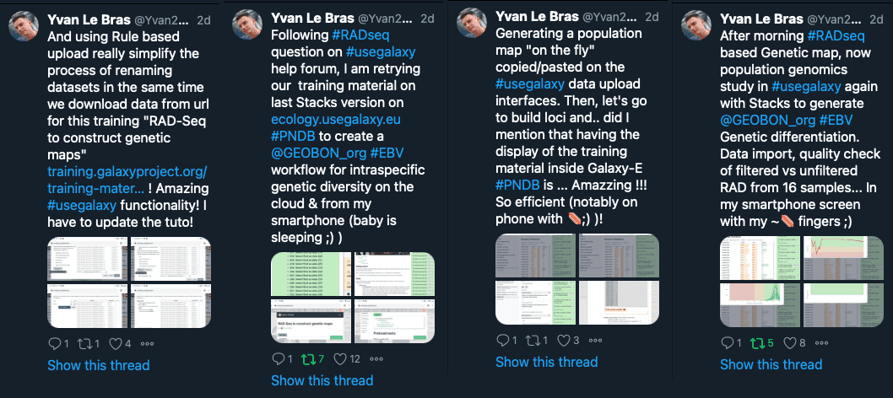

It is a very busy time in the Galaxy. 2021 is young, but we have already had two large training events, including the largest Galaxy event ever - the GTN Smörgåsbord (with an amazing 1100+ people registered). We are ramping up for GCC2021, which will be online, global, and affordable, and will be more accessible (and likely much larger) than an in-person Galaxy Community Conference.

Galaxy is also shifting with the times, and to reflect how our community has grown.  This newsletter includes a new **[Featured News](#featured-news)** section highlighting 1) the **recent explosion of videos** related to Galaxy, 2) a draft **global governance model for Galaxy**, and 3) the new **Galaxy Career Center.**

That's followed by another new section highlighting **[community news](#community-news).** Arguably, *everything* here is community news, but items listed here particularly emphasize the community aspects of Galaxy.

The newsletter still includes sections on

* **[upcoming events](#event-news)**,
* news about **[public Galaxy platforms](#galaxy-platforms-news)**,
* recent **[blog posts](#galactic-blog-activity)**,
* **[training and doc updates](#doc-hub-and-training-updates)**,
* recent **[open-access Galaxy-related publications](#publications)**, and
* **[new releases](#releases).**

It's a lot to take in, but it all highlights the breadth and depth of the Galaxy Community.

Enjoy,

Dave Clements and Beatriz Serrano-Solano, Editors

---

# Featured news

<!-- Videos -->

[Galaxy Videos](https://www.youtube.com/channel/UCwoMMZPbz1L9AZzvIvrvqYA)

When Galaxy started, *screencasts* were a big part of our documentation and training.  Fifteen years later videos have returned to Galaxy with a vengeance.  This is partly due to the pandemic, and partly due to a long term global shift towards recording events, and towards creating short demonstration and introduction videos.

A number of notable videos and video collections have recently been published:

* <strong><a href="https://www.youtube.com/channel/UCwoMMZPbz1L9AZzvIvrvqYA/playlists?view=50&sort=dd&shelf_id=2">Galaxy Smörgåsbord Collection</a></strong>
    * This collection of 43 videos was created for the recently completed Galaxy Smörgåsbord training event.  They cover a huge sample of the Galaxy Training Network materials.
* **[Galaxy Admin Training Collection](https://www.youtube.com/channel/UCwoMMZPbz1L9AZzvIvrvqYA/playlists?view=50&sort=dd&shelf_id=3)**
    * This collection of 27 videos was created for the also recently completed 2021 Galaxy Admin Training event.  Everything you ever wanted to know about administering your own Galaxy instance (well, almost).
* **[Quick Tips](https://youtube.com/playlist?list=PLNFLKDpdM3B8__nz2xlzY2bA_2Sb_vb2o)**
    * Nine videos (and growing), each under 3 minutes, providing brief introductions to commonly used features of Galaxy.
* **[Galactic Introductions](https://youtube.com/playlist?list=PLNFLKDpdM3B9UaxWEXgziHXO3k-003FzE)**
    * Covers a wide range of galaxy features.  Videos range from 24 seconds (History: Sharing via link) to 12 and half minutes (Galaxy and NGS)
* <strong><a href="https://www.youtube.com/channel/UCwoMMZPbz1L9AZzvIvrvqYA/playlists?view=50&sort=dd&shelf_id=7">Developer resources</a></strong>
    * Includes [Developer Quick Dives](https://youtube.com/playlist?list=PLNFLKDpdM3B8Ro-V0mZboQjj40RimRZ8n), short videos introducing common tasks in Galaxy development; and [Galaxy Developer Roundtables](https://youtube.com/playlist?list=PLNFLKDpdM3B-j7cdWzG3Qh5609fZK4fvO), recordings of the bi-weekly [Galaxy Developer Roundtable](/community/devroundtable/) calls.
* **[Webinars & Workshops](https://youtube.com/playlist?list=PLNFLKDpdM3B8beIdQKVP8zES47v5rooQm)**
    * Recordings of Galaxy Webinars and Workshops are spread across the web.  This playlist attempts to list recent webinars that we know about that are on YouTube.  This list is brand new and is rapidly expanding.
* **[Community](https://youtube.com/playlist?list=PLNFLKDpdM3B-IT4cyNMHcQFLmxdDS8YKm)**
    * Videos that introduce the Galaxy community.

<!-- Governance  -->

[Working Groups](/community/wg/) and the [draft Galaxy Governance Model](/community/governance/)

In December, Galaxy introduced [Working Groups](/community/wg/), community-driven small groups that manage different aspects of the Galaxy Ecosystem. Working groups set quarterly milestones for their areas, distribute work, and meet to discuss progress and roadblocks. Working Groups were launched in late 2020.  *If you want to contribute to Galaxy in a big way, please join one or more Working Groups.*

This month we are introducing the first draft of a [Galaxy Governance Model](/community/governance/) that includes Working Groups as a key component.  The model also includes the new [Galaxy Executive Board](/community/governance/geb/), the Global Galaxy Steering Committee, and incorporates the longstanding [Committers Groups](/community/committers/).

Our hope is that this framework will enable us to become a truly global community.

<!-- Smorgasbord -->

[GTN Smörgåsbord Report](https://gallantries.github.io/posts/2021/03/01/sm%C3%B6rg%C3%A5sbord/)

*The recently completed GTN Smörgåsbord course was the largest Galaxy event ever, and it was absolutely incredible.*

* 1,189 people from 76 countries
* 583 people on slack
* 60+ instructors
* 25 hours of video, all with closed captioning, which were used by 45% of participants
* 24 hour coverage for a week

We strongly encourage you to read the full [event report](https://gallantries.github.io/posts/2021/03/01/sm%C3%B6rg%C3%A5sbord/).  It's amazing.

<!-- Galaxy Career Center -->

[Galaxy Career Center Opens](/careers/)

The recently opened **[Galaxy Career Center](/careers/)** lists every Galaxy Related opening we know about.  Each posting (and there are 10 that are currently open) includes a short description, a link to the full posting, and deadlines, when known. There are openings at

* **North America**
    * **GalaxyWorks, University of Minnesota, Cleveland Clinic, and Johns Hopkins University (3 positions)**
* **Europe**
    * **Incliva (24 March), INSERM (1 April), and Hannover Medical School**

# Community News

<!-- EOSC-LIFE -->

[EOSC-Life Use Cases](https://galaxyproject.eu/posts/2021/03/10/eosc-life-d6/)

The first round of EOSC-Life demonstrators has driven eight successful use cases, three of them using Galaxy:

* European Open Science Cloud resources for Chemical Biology and Structure-Based Drug Discovery workflows
* Marine Eukaryote Genomics Portal – access to tools and data-flows for marine genome annotation
* Image Repository and Scaleable Mining

<!-- Czechia! -->

[Czech Galaxy Community](https://www.elixir-czech.cz/news/czech-galaxy-community-questionnaire-feb-2021)

Has [launched](https://www.elixir-czech.cz/news/czech-galaxy-community-questionnaire-feb-2021)!  If you are part of the Czech computational analysis community then please consider getting involved by:

* Filling out the [Czech Galaxy Community Questionnaire](https://bit.ly/czech-gxy)
* Signing up for the [Galaxy Czech community mailing list](https://lists.galaxyproject.org/lists/galaxy-czech.lists.galaxyproject.org/).

<!-- F1000 -->

[F1000 Research Galaxy Gateway](https://f1000research.com/gateways/galaxy)

We would like to reintroduce the newly updated [Galaxy Gateway](https://f1000research.com/gateways/galaxy) powered by [F1000Research](https://f1000research.com/). This Gateway offers an accessible home for all research outputs. You can [rapidly publish your Galaxy-related presentations for free](https://f1000research.com/gateways/galaxy/for-authors/publish-your-research). The Gateway has been the recommended venue for publishing [GCC](/gcc/) slides and posters since GCC2016. It's a great way to improve the visibility and accessibility of your research, and you will receive a DOI too.

[F1000Research](https://f1000research.com/) is an open access publishing platform supporting data deposition and sharing. The [Galaxy Gateway](https://f1000research.com/gateways/galaxy/about-this-gateway) enables you to accelerate the impact of your work. Discover this month's [highlighted paper](https://doi.org/10.12688/f1000research.28608.1) (and see [Platforms](#galaxy-platforms-news) and [Publications](#publications) below too).

<!-- Papercuts awards -->

[Galaxy Participating in Google Summer of Code](https://summerofcode.withgoogle.com/organizations/6022098314592256/)

The [Open Genome Informatics Consortium](http://gmod.org/wiki/GSoC) of which Galaxy is a part, has been accepted to participate in the [2021 Google Summer of Code](https://summerofcode.withgoogle.com/).

*And we need your help!*

1. Please [add suggestions for projects here](http://gmod.org/wiki/GSOC_Project_Ideas_2021) (or send them to Dave Clements).
2. Please apply to work on Galaxy projects between March 29 and April 12.

<!-- Papercuts awards -->

[January Papercuts Award Winners](/news/2021-02-papercuts-awards/)

The [January Papercuts CoFest](/events/2021-01-papercuts/) offered prizes for 10 randomly selected contributors. The winners are:

* Catherine Bromhead, University of Melbourne
* Helena Rasche, ErasmusMC
* Anthony Bretaudeau, INRAE
* Oleg Zharkov, University of Freiburg
* Saskia Hiltemann, ErasmusMC
* Estelle Ancelet, INRAE
* And 4 anonymous

The calendars actually start in March 2021.  You [can order one too](https://www.mixbook.com/photo-calendars/all/full-photo-layout-copy-24634591?vk=QK1D58DRcWF1R8nwwwOf).

<!-- Meet & Join the Galaxy Community -->

<iframe width="290" height="180" src="https://www.youtube.com/embed/-1MPdxmRs8U" frameborder="0" allow="accelerometer; autoplay; clipboard-write; encrypted-media; gyroscope; picture-in-picture" allowfullscreen></iframe>

[Meet & Join the Galaxy Community](https://galaxyproject.eu/posts/2021/02/18/community-video/)

The Galaxy community has recorded different ways of joining us, with suggestions for newcomers.

# Event News

Despite COVID-19, there is still a lot going on, and most of it is online. See the [full list of events](/events/). Some highlights:

<!-- Galaxy Webinars -->

[Galaxy-ELIXIR webinars series: Advanced Features](https://elixir-europe.org/events/galaxy-elixir-webinars-series-advanced-features)

**3, 10, 17, 24 March**
 
*Galaxy-ELIXIR webinars series: Advanced Features*

With this series of four [webinars](https://elixir-europe.org/events/galaxy-elixir-webinars-series-advanced-features) chaired by Hans-Rudolf Hotz, the global Galaxy community will present advanced features that may have remain unknown due to the rapid developments in every Galaxy release. The series will touch upon workflows, data processing and management, interoperability and interactive tools, among others.

**Advanced Galaxy workflow features**, *3 March*, [watch the video](https://youtu.be/7atWvOoMQwE)

**Processing thousands of datasets simultaneously**, *10 March* [watch the video](https://youtu.be/7DN8hbI87PE)

**Galaxy bridge to Jupyter notebooks and RStudio**, *17 March*

**Speed up your data analysis with Galaxy: Features no one knows about**, *24 March*

<!-- GCC2021 -->

[GCC2021 Update](https://www.vibconferences.be/events/gcc2021)

**The [2021 Galaxy Community Conference](https://www.vibconferences.be/events/gcc2021) will be held 28 June through July 10.  It will be [virtual, affordable, and globally accessible](/news/2021-02-gcc-virtual/).**

*GCC2021 will start on 28 June with a [week of online training](https://galaxyproject.org/events/gcc2021/training/).* Training will largely use the GTN Smörgåsbord model: Lectures will be prerecorded, with live help available on chat for the duration of the week.  This model allows participants to learn at their own pace, avoids scheduling conflicts that are inherent with our usual multi-track training, and enables those with low bandwidth internet connections to fully participate.

We also expect to open registration and abstract submission shortly.  Registration discounts will be available to researchers from low and lower-middle income countries.  For everyone else, registration will be downright cheap too.  We will reuse the BCC2020 model for talks, posters, and demos: Posters and demos will be live (sometimes in both hemispheres), and talks will be prerecorded.

**And [GCC2021 is looking for sponsors](http://bit.ly/gcc2021_prospectus_v1) too!**

Please watch Galaxy channels for the registration and abstract submission announcements.

<!-- UseGalaxy.No -->

[Using the Norwegian e-infrastructure for Life Science and usegalaxy.no](https://elixir.no/news/55/63/Online-course-by-ELIXIR-Norway-Using-the-Norwegian-e-infrastructure-for-Life-Science-and-usegalaxy.no)

**23 March, 7 April, or 13 April**

ELIXIR Norway is pleased to announce the first online course on using the [Norwegian e-infrastructure for Life Science (NeLS)](https://nels.bioinfo.no/) and the nationally supported [usegalaxy.no](https://usegalaxy.no/). There are 3 identical events. Please register for only one of them.

<!-- Czechia! -->

[Introduction to Galaxy & Proteomics online workshop](https://www.elixir-czech.cz/events/introduction-to-galaxy-and-proteomics-online-workshop-mar-2021)

**March 22**

This workshop is open to everybody interested in Galaxy and has two independent parts (Intro, and Proteomics-specific). Please feel free to join any or both.  *But you do need to register as space is limited.*

<!-- Paper Cuts -->

[March Papercuts CoFest](/events/2021-03-papercuts/)

**18 March, Online, Global**

Please join us for the [6th Papercuts CoFest day on March 18](/events/2021-03-papercuts/) to help the Galaxy Ecosystem become a better place, and to help new contributors come on board.

<!-- Galaxy Dev Round Table -->

[Galaxy Developer Roundtable](/community/devroundtable/)

There next roundtable meetup will be:

**[March 18: Bringing GPU support to Galaxy](/events/2021-03-18-dev-roundtable/)**, Jashwant Raj and Gulsum Gudukbay will discuss the integration of GPU Resources in Galaxy for accelerating tool executions.

<!-- biohack deadline -->

[Biohackathon Europe Call for Proposals](https://biohackathon-europe.org/projects.html)

**Deadline: 1 April**

Galaxy has always had a strong presence at Biohackathon Europe.  We hope this tradition will continue in November 2021. [Get your proposals in now](https://biohackathon-europe.org/projects.html).

<!-- Mass Spec -->

[Galaxy For Mass Spectrometry-based Research Meetup](https://z.umn.edu/celestialmasses)

**1 April**

Feel charged up while discussing mass spec and proteomics? Please join us on this call to learn more about the Galaxy Mass Spec Community. The next meeting is on April 1st (not a fool’s joke) at 1 PM UTC / 12 noon GMT.  See [the agenda](https://z.umn.edu/celestialmasses) for details and joining instructions.

# Galaxy Platforms News

The [Galaxy Platform Directory](/use/) lists resources for easily running your analysis on Galaxy, including publicly available servers, cloud services, and containers and VMs that run Galaxy.  Here's the recent platform news we know about:

<!-- ASaiM -->

[ASaiM](/use/asaim/)

ASaiM integrates and hierarchically organizes metagenomic and metatranscriptomic tools to orient user choice toward the best tool for a given task. It now has a [new publication and new functionality](https://doi.org/10.12688/f1000research.28608.1) and the update is now available as <a href="https://quay.io/repository/bebatut/asaim-framework?tag=latest&tab=tags">its own Docker image</a>, and on [UseGalaxy.eu](https://usegalaxy.eu/) too.

<!-- immuneML -->

[immuneML](/use/immuneml/)

immuneML is an open-source collaborative ecosystem for machine learning-based (ML) analyses of adaptive immune [receptors](https://docs.immuneml.uio.no/galaxy/galaxy_simple_receptors.html) and [repertoires](https://docs.immuneml.uio.no/galaxy/galaxy_simple_repertoires.html) (AIRR).  It comes with extensive help, and is supported by the University of Oslo.

<!-- InteractoMIX -->

[InteractoMIX](/use/interactomix/)

A [one-stop resource](http://galaxy.interactomix.com/) offering a wide range of computational analyses from proteome-wide interactomes to structure of protein complexes.  Includes [shared workflows](http://galaxy.interactomix.com/workflows/list_published) and supports anonymous use.

InteractoMIX is the result of the combined efforts of [Structural Bioinformatics](http://sbi.imim.es/web/index.php) and [Bioinsilico](http://www.bioinsilico.org/) labs.

<!-- GalaxyWorks -->

[A new Galaxy Pro Service is Coming](https://galaxyworks.io/blog/researcher-beta-users)

[GalaxyWorks](https://galaxyworks.io/) is a company that offers commercial-grade support for Galaxy instances, and they are looking for beta testers for a new service.  Galaxy Pro Researcher will offer:

* A self sign-up option with a low subscription fee
* Access to fast and versatile Galaxy Pro without usage quotas
* No need to manage your own Galaxy server

Interested in being an early adopter? See the [full announcement](https://galaxyworks.io/blog/researcher-beta-users).

<!-- UseGalaxy.* -->

[UseGalaxy.*](/usegalaxy/) News

* Lots of tool updates on [UseGalaxy.eu](https://galaxyproject.eu/news?tag=tools) and [UseGalaxy.org.au](https://usegalaxy-au.github.io/galaxy/news.hgtml).

# Galactic Blog Activity

<!-- GalaxyWorks Blog Posts -->

[GalaxyWorks Blog Posts](https://galaxyproject.eu/posts/2021/02/18/community-video/)

[GalaxyWorks](https://galaxyworks.io/) has also started a blog highlighting aspects of Galaxy (and sometimes their offerings too). Two posts from the past month are:

* [Change a datatype on multiple datasets](https://galaxyworks.io/blog/change-datatype-on-many-datasets), Feb 8, by Dan Blankenberg
* [How to choose the Galaxy that works for you](https://galaxyworks.io/blog/choose-your-galaxy), Mar 1, by Enis Afgan

<!-- ELIXIR-AAI -->

[Login via ELIXIR-AAI, Google, LinkedIn, or your ORCID iD](https://galaxyproject.eu/posts/2021/02/20/elixir-aai-login/)

The [ELIXIR Authentication and Authorisation Infrastructure (AAI)](https://elixir-europe.org/services/compute/aai) enables researchers to use their home organisation credentials or community or commercial identities (e.g. ORCID, LinkedIn, Google) to sign in and access Galaxy.

<!-- Global framework for SARS-CoV-2 data analysis: Application to intrahost variation -->

Global framework for SARS-CoV-2 data analysis: Application to intrahost variation

By Wolfgang Maier, Marius Van Den Beek, Björn Grüning, Sergei Kosakovsky Pond, Anton Nekrutenko, and the Galaxy Team in US, EU, and AU

This analysis of intrahost variation in the COVID pandemic is split into two postings (**[Part 1](https://virological.org/t/global-framework-for-sars-cov-2-data-analysis-application-to-intrahost-variation-part-1/623)** and **[Part 2](https://virological.org/t/global-framework-for-sars-cov-2-data-analysis-application-to-intrahost-variation-part-2/624)**).

<!-- TIaaS feedback -->

[RNA-Seq analysis](https://galaxyproject.eu/posts/2021/02/22/tiaas-Mali-Salmon/)

By Mali Salmon-Divon.

Mali shares the feedback of two workshops run using TIaaS: one or graduate students and another one for medical doctors.

# Doc, Hub, and Training Updates

<!-- GTN video -->

<iframe width="290" height="180" src="https://www.youtube.com/embed/lDqWxzWNk1k" frameborder="0" allow="accelerometer; autoplay; clipboard-write; encrypted-media; gyroscope; picture-in-picture" allowfullscreen></iframe>

New GTN welcome video

Geert Bonamie ([VIB Bioinformatics Core](https://www.bits.vib.be/)) has produced an astonishing video introduction to the GTN features.

<!-- Generating a cell matrix using Alevin -->

[Generating a cell matrix using Alevin](https://training.galaxyproject.org/training-material/topics/transcriptomics/tutorials/droplet-quantification-preprocessing/tutorial.html)

By [Wendi Bacon](https://training.galaxyproject.org/training-material/hall-of-fame/nomadscientist/) and [Jonathan Manning](https://training.galaxyproject.org/training-material/hall-of-fame/pinin4fjords/)

This new tutorial will take you from raw FASTQ files to a cell x gene data matrix in AnnData format. What’s a data matrix, and what’s AnnData format? Well you’ll find out! Importantly, this is the first step in processing single cell data in order to start analysing it.

<!-- Introduction to recurrent neural networks (RNN) -->

[Introduction to recurrent neural networks (RNN)](https://training.galaxyproject.org/training-material/topics/statistics/tutorials/RNN/tutorial.html)

By [Kaivan Kamali](https://training.galaxyproject.org/training-material/hall-of-fame/kxk302/)

In this tutorial, we discuss recurrent neural networks, which model sequential data, and have been successfully applied to language generation, machine translation, speech recognition, image description, and text summarization.

<!-- Updated Hub landing page -->

[Hub Landing Page Update](/)

We updated the bottom part of the [hub landing page](/).  In addition to highlighting *News, Blog posts, Events,* and *Twitter,* we added summary sections for *Recent Videos, Careers, New Platforms,* and *Recent Pubs.* We also expanded the News and Blog sections.

<!-- From small to large-scale genome comparison -->

[From small to large-scale genome comparison](https://training.galaxyproject.org/training-material/topics/genome-annotation/tutorials/hpc-for-lsgc/tutorial.html)

By [Esteban Perez-Wohlfeil](https://training.galaxyproject.org/training-material/hall-of-fame/estebanpw/)

This new [tutorial](https://training.galaxyproject.org/training-material/topics/genome-annotation/tutorials/hpc-for-lsgc/tutorial.html) and [slide deck](https://training.galaxyproject.org/training-material/topics/genome-annotation/tutorials/hpc-for-lsgc/slides.html) cover how to compare both small and large sequences using both seed-based alignment methods and alignment-free methods, and how to post-process our comparisons to refine our results. Plus the theoretical background of sequence comparison, including why some tools are suitable for some jobs and others are not.

<!-- Life Science Trainers -->

[Life Science Trainers Questionnaire](https://lifescitrainers.org/2021/01/18/global-trainers-survey/)

The global [Life Science Trainers Community](https://lifescitrainers.org/) (yes, you should join) wants to highlight the important role of trainers and understand how they can be better supported. **If you are, or have been a trainer, [share your thoughts](https://lifescitrainers.org/2021/01/18/global-trainers-survey/) in this survey by March 20.**

<!-- Galaxy-ELIXIR webinar series -->

[Recordings of the Galaxy-ELIXIR webinar series: Open Data Infrastructures to tackle COVID-19 pandemic](https://galaxyproject.eu/posts/2021/02/25/2nd-elixir-webinar-series-covid/)

After the success of the first [‘Galaxy-ELIXIR webinar series: FAIR data and Open Infrastructures to tackle the COVID-19 pandemic’](https://elixir-europe.org/events/webinar-galaxy-elixir-covid19) last spring, the Galaxy community has been running a second Galaxy-ELIXIR webinar series on [‘Open Data Infrastructures to tackle COVID-19 pandemic’](https://elixir-europe.org/events/2nd-galaxy-elixir-webinar-series).

In this second edition, and for six consecutive weeks, speakers from all around the globe have been describing the latest Galaxy developments for working with SARS-CoV-2 data. If you missed them, the recordings are now available on the [ELIXIR Europe YouTube channel](https://www.youtube.com/c/ELIXIREurope).

# Publications

Pub curation activities [are on a semi-hiatus right now](/news/2020-08-10k-pubs/#the-future) but a few publications referencing, using, extending, and implementing Galaxy were added to the [Galaxy Publication Library](https://www.zotero.org/groups/galaxy) anyway.  Here are the new open access *Galactic* and *Stellar* pubs:

[Using Galaxy to Perform Large-Scale Interactive Data Analyses—An Update]( https://doi.org/10.1002/cpz1.31)

Ostrovsky, A., Hillman‐Jackson, J., Bouvier, D., Clements, D., Afgan, E., Blankenberg, D., Schatz, M. C., Nekrutenko, A., Taylor, J., Team,  the G., & Lariviere, D. (2021). *Current Protocols*, 1(2), e31. https://doi.org/10.1002/cpz1.31

[ASaiM-MT: A validated and optimized ASaiM workflow for metatranscriptomics analysis within Galaxy framework](https://doi.org/10.12688/f1000research.28608.1)

Mehta, S., Crane, M., Leith, E., Batut, B., Hiltemann, S., Arntzen, M. Ø., Kunath, B. J., Delogu, F., Sajulga, R., Kumar, P., Johnson, J. E., Griffin, T. J., & Jagtap, P. D. (2021). *F1000Research*, 10, 103. https://doi.org/10.12688/f1000research.28608.1

[GalaxyTrakr: A distributed analysis tool for public health whole genome sequence data accessible to non-bioinformaticians](https://doi.org/10.1186/s12864-021-07405-8)

Gangiredla, J., Rand, H., Benisatto, D., Payne, J., Strittmatter, C., Sanders, J., Wolfgang, W. J., Libuit, K., Herrick, J. B., Prarat, M., Toro, M., Farrell, T., & Strain, E. (2021). *BMC Genomics*, 22(1), 114. https://doi.org/10.1186/s12864-021-07405-8

[Galaxy and Apollo as a biologist-friendly interface for high-quality cooperative phage genome annotation](https://doi.org/10.1371/journal.pcbi.1008214)

Ramsey, J., Rasche, H., Maughmer, C., Criscione, A., Mijalis, E., Liu, M., Hu, J. C., Young, R., & Gill, J. J. (2020). *PLOS Computational Biology*, 16(11), e1008214. https://doi.org/10.1371/journal.pcbi.1008214

[immuneML: An ecosystem for machine learning analysis of adaptive immune receptor repertoires](https://doi.org/10.1101/2021.03.08.433891)

Pavlovic, M., Scheffer, L., Motwani, K., Kanduri, C., Kompova, R., Vazov, N., Waagan, K., Bernal, F. L. M., Costa, A. A., Corrie, B., Akbar, R., Hajj, G. S. A., Balaban, G., Brusko, T. M., Chernigovskaya, M., Christley, S., Cowell, L. G., Frank, R., Grytten, I., … Sandve, G. K. (2021). *BioRxiv*, 2021.03.08.433891. https://doi.org/10.1101/2021.03.08.433891

[ChiRA: An integrated framework for chimeric read analysis from RNA-RNA interactome and RNA structurome data](https://doi.org/10.1093/gigascience/giaa158)

Videm, P., Kumar, A., Zharkov, O., Grüning, B. A., & Backofen, R. (2021). *GigaScience*, 10(giaa158). https://doi.org/10.1093/gigascience/giaa158

[Galaxy and MEAN Stack to Create a User-Friendly Workflow for the Rational Optimization of Cancer Chemotherapy](https://doi.org/10.3389/fgene.2021.624259)

Pires, J. G., da Silva, G. F., Weyssow, T., Conforte, A. J., Pagnoncelli, D., da Silva, F. A. B., & Carels, N. (2021). *Frontiers in Genetics*, 12. https://doi.org/10.3389/fgene.2021.624259

[A rigorous evaluation of optimal peptide targets for MS-based clinical diagnostics of Coronavirus Disease 2019 (COVID-19)](https://doi.org/10.1101/2021.02.09.21251427)

Rajczewski, A. T., Mehta, S., Nguyen, D. D. A., Grüning, B. A., Johnson, J. E., McGowan, T., Griffin, T. J., & Jagtap, P. D. (2021). . *MedRxiv*, 2021.02.09.21251427. https://doi.org/10.1101/2021.02.09.21251427

# Releases

Galaxy 21.01

We are pleased to [announce the 21.01 Galaxy release](/news/2021-03-galaxy-release-21-01/).  As the announcement says:

<blockquote class="blockquote">

**Workflows are the absolute ✨star✨ of Galaxy v21.01**

</blockquote>

This include support for a workflow best practices checker, workflow reports, and tracking your workflow invocations.

The new [Remote Files interface](/news/2021-03-galaxy-release-21-01/#remote-files) is an absolutely fantastic new way to browse your data. Browse files on many remote file services, from your Dropbox to TCGA.

**And there is a *lot* more in the full [user](https://docs.galaxyproject.org/en/master/releases/21.01_announce_user.html) and the [developer and admin](https://docs.galaxyproject.org/en/master/releases/21.01_announce.html) release announcements.**

Planemo 0.74.2-3

[Planemo](https://pypi.python.org/pypi/planemo) is a set of
command-line utilities to assist in developing Galaxy and [Common Workflow Language](https://www.commonwl.org/) artifacts - including tools, workflows, and training materials.  These releases included numerous fixes and enhancements. Some notable changes

* Better handling of `virtualenv`
* Display live logs when Galaxy is run in the background.
* Container register for GitHub workflows fixes

See [GitHub for details](https://github.com/galaxyproject/planemo/blob/master/HISTORY.rst).

[BioBlend 0.15.0](https://github.com/galaxyproject/bioblend/releases/tag/v0.15.0)

[BioBlend](http://bioblend.readthedocs.org/) is a Python library for interacting with CloudMan and Galaxy‘s API.  BioBlend makes it possible to script and automate the process of cloud infrastructure provisioning and scaling via CloudMan, and running of analyses via Galaxy.

There were a lot of improvements in this release. See the [release notes](https://github.com/galaxyproject/bioblend/releases) for details

Galaxy Language Server 0.4.0-1

[Galaxy Language Server and Galaxy Tools VS Extension](https://github.com/galaxyproject/galaxy-language-server/releases/tag/v0.4.1) assist in the development of Galaxy tools
wrappers inside modern code editors.

The 0.4.x releases includes fixes and new features. See the [GitHub repository](https://github.com/galaxyproject/galaxy-language-server) for details.

# Other News

[RADseq data analysis](https://galaxyproject.eu/posts/2021/03/13/radseq-analysis/)

...on mobile phone, while baby is sleeping.

Yvan Le Bras reminded us of several very cool things.

