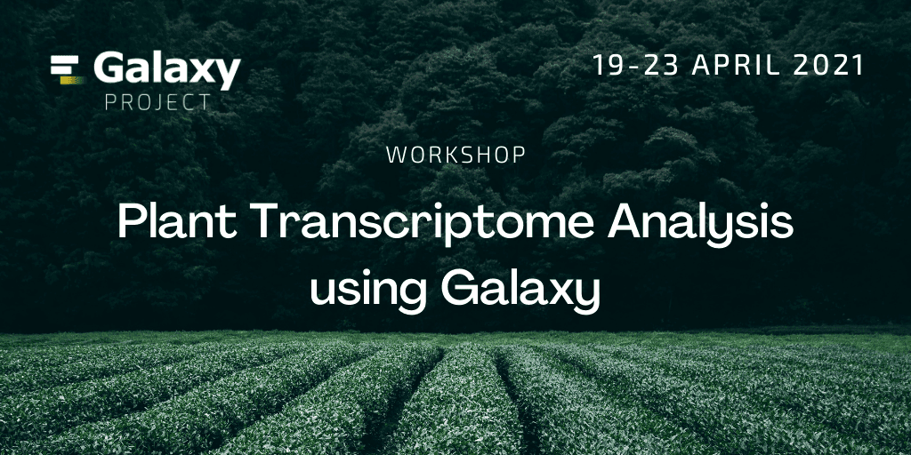

This newsletter coincides with the [anniversary of James Taylor's death](#featured-news) on April 2, 2020.  James was a Galaxy Project founder and PI, and losing him at the same time as the global COVID-19 shutdown made for a tough month, and then a tough year for the Galaxy Community.  To mark this, there are two items about James below.  First, *a call to share your favorite story about James* via a 30 second video (by April 30).  Second, there is a link to *a note to James* written by project leadership (mainly Anton).

The other big news is that [registration, abstract submission, and fellowship applications for the 2021 Galaxy Community Conference are now open](#community-news).  Abstracts and fellowship applications are due by May 7.

And as always there are sections on

* **[upcoming events](#event-news)**,
* news about **[public Galaxy platforms](#galaxy-platforms-news)**,
* recent **[blog posts](#galactic-blog-activity)**,
* **[training and doc updates](#doc-hub-and-training-updates)**,
* recent **[open-access Galaxy-related publications](#publications)**, and
* **[new releases](#releases).**

It's been a memorable twelve months.  It would have been easy to curl up and hide, but we kept going, addressed gaps, and helped address the global pandemic as well.

Thanks for supporting each other,

Dave Clements and Beatriz Serrano-Solano, Editors

---

# Featured news

<!-- James -->

Share your favorite James Taylor story

It's been a year since [James Taylor](/jxtx/) passed away.  To remember him, and mark his upcoming birthday (May 18) we would like to create a community video. We are asking you to tell us your favorite story about James in ~ 30 seconds. We will combine your clips into a video that will be prominently featured on all Galaxy-related sites.

Here is what we will need you to do before April 30:

1. Think of your favorite story/interaction/event involving James
2. Pick a nice location and record the video!
3. The video should be:

* in a high-resolution
* without background noise
* in a horizontal orientation (not vertical!)
* ≲ 30 seconds in length

4. Deposit video file to your Google Drive or Dropbox folder (or any other location that would allow us to retrieve it)
5. Send a link to the video, your name and location as you would like them to appear in the final video to: outreach@galaxyproject.org

Thank you all in advance and please feel free to invite other friends of James to participate.

<!-- James -->

[A note to James, one year after his passing](/jxtx/)

The project leadership marked the one year anniversary of James's passing with [a letter to him](/jxtx/) summarizing the year he missed.  It starts with

  "What a year. It was difficult."

and then goes on to describe the community's progress and perseverance over the year.  It's a powerful reflection on James, this community, and the past year.  Please take a look.

# Community News

<!-- GCC2021 -->

[GCC2021 Update](https://www.vibconferences.be/events/gcc2021)

**The [2021 Galaxy Community Conference](https://www.vibconferences.be/events/gcc2021) will be held 28 June through July 10.  It will be [virtual, affordable, and globally accessible](/news/2021-02-gcc-virtual/).**

GCC2021 will start on 28 June with a [__week of online training__](https://galaxyproject.org/events/gcc2021/training/). Training will largely use the GTN Smörgåsbord model: lectures will be prerecorded, with live help available on chat for the duration of the week.  This model allows participants to learn at their own pace, avoids scheduling conflicts that are inherent with our usual multi-track training, and enables those with low bandwidth internet connections to fully participate.

We will reuse the BCC2020 model for talks, posters, and demos: __posters and demos__ will be live (sometimes in both hemispheres), and __talks__ will be prerecorded.

**And [GCC2021 is looking for sponsors](http://bit.ly/gcc2021_prospectus_v1) too!**

<!-- Registration -->

[GCC2021 Registration Open](https://www.vibconferences.be/events/gcc2021-virtual-edition)

__June 25__

GCC2021 registration is open until June 25.

Registering before __May 24__ saves 50% off of the full rates. Registration discounts will be available to researchers from low and lower-middle income countries. For everyone else, registration are downright cheap too: the rates start in €15.00 for the training week and in €25.00 for the 3-day conference. The CoFest is free.

<!-- Fellowships -->

[GCC2021 Fellowships](https://docs.google.com/forms/d/e/1FAIpQLSfyqKg87x8wL1EhOfrGR0SlQui8wEkQgg3qVFi6txO6GmHgKg/viewform)

__May 7__

The Galaxy Community Fund is offering fellowships to students, post-docs, and other non-profit / academic / government researchers based in lower, lower-middle and upper-middle income countries who will benefit from attending GCC2021, and for whom the cost of registration is a barrier.

It will cover the full registration for any GCC2021 events. [Apply here](https://docs.google.com/forms/d/e/1FAIpQLSfyqKg87x8wL1EhOfrGR0SlQui8wEkQgg3qVFi6txO6GmHgKg/viewform).

<!-- Abstracts -->

[GCC2021 Abstracts Submission Open](https://www.vibconferences.be/events/gcc2021-virtual-edition)

__Submissions due May 7__

GCC2021 is seeking oral presentations, lightning talks, posters, and demos, from researchers using Galaxy, and __all over the world__. If you would like to present your work, please [submit your abstract](https://www.vibconferences.be/events/gcc2021-virtual-edition) by May 7!

<!-- GSoC -->

[Galaxy Participating in Google Summer of Code](https://summerofcode.withgoogle.com/organizations/6022098314592256/)

The [Open Genome Informatics Consortium](http://gmod.org/wiki/GSoC) of which Galaxy is a part, has been accepted to participate in the [2021 Google Summer of Code](https://summerofcode.withgoogle.com/).

Interested?  Please review the [Galaxy project proposals](http://gmod.org/wiki/GSOC_Project_Ideas_2021) **and apply to GSoC by April 12.**  Questions? Please contact the mentor(s) for each proposal.

# Event News

Despite COVID-19, there is still a lot going on, and most of it is online. See the [full list of events](/events/). Some highlights:

<!-- Galaxy @ ISMB? -->

[ISMB/ECCB/BOSC Deadlines](https://www.iscb.org/ismbeccb2021)

**Submissions due May 6**

[ISMB/ECCB 2021](https://www.iscb.org/ismbeccb2021) is one of the largest bioinformatics conferences and every year Galaxy has had a significant presence.  ISMB/ECCB is built from community building blocks, and this year that includes the **[Bioinformatics Open Source Conference (BOSC)](https://www.open-bio.org/events/bosc-2021/)** (our 2018 and 2020 conference partner), as well as communities focused on [high-throughput sequencing](http://hitseq.org/), [mass spec](http://cosi.iscb.org/wiki/CompMS:Home), [bioinformatics education](http://cosi.iscb.org/wiki/Education:Home), [visualization](http://biovis.net/2021/index.html), [microbiomes](https://www.microbiome-cosi.org/), [bioinformatics core facilities](http://bioinfo-core.org/index.php/ISMB_2021:_BioinfoCoreWorkshop), and [many others](https://www.iscb.org/communities-of-special-interest).

**[BOSC](https://www.open-bio.org/2021/03/24/join-us-at-bosc-2021/)** is a particularly good match for the Galaxy community. Topics include software development practices that promote open science standards and sharing of biological data and code, as well as approaches for building diverse communities.

Most of these are accepting talk and poster submissions through the [ISMB/ECCB website](https://www.iscb.org/ismbeccb2021), but [BioInfo-Core is taking talk submissions here](https://forms.gle/N1mfB3dEEd4oi4wBA).  All submissions are due May 6.

<!-- Webinars -->

[Webinars](/events/webinars/)

Our next webinar series will focus on Galaxy resources for several different communities.  Webinars are held every other Wednesday at 10:00 Eastern US / 16:00 Central European time.  The first two webinars are:

**[Galaxy Resources for Researchers](/events/2021-04-gr4-researchers/), April <del>14</del> 21** (postponed one week)

**[Galaxy Resources for Educators and Trainers](/events/2021-04-gr4-education/), April 28**

Space is, um, unlimited!  But sign up today anyway and we will send you a reminder.

In addition, there are two more webinars this month:

**[ELIXIR & Galaxy Project](https://www.elixir-czech.cz/events/elixir-cz-friday-coffee-16-april-2021), April 16**

**[Building a bioinformatics platform: Lessons learned from immuneML](https://docs.google.com/forms/d/e/1FAIpQLSd7pNc4x-ONjNW9-_ybf5cHz3OvgB6SLo3iL9qDwIzRHwh_Cw/viewform), April 28**

<!-- Paper Cuts -->

[April Papercuts CoFest](/events/2021-04-papercuts/)

**15 April, Online, Global**

Please join us for the [7th Papercuts CoFest day on April 15](/events/2021-04-papercuts/) to help the Galaxy Ecosystem become a better place, and to help new contributors come on board.

We will be on [Matrix](https://matrix.to/#/#galaxyproject_Lobby:gitter.im) for chat all day long, and on 3 calls spread across the day. Please take advantage of both to communicate with your collaborators around the world.

<!-- UseGalaxy.No -->

[Using the Norwegian e-infrastructure for Life Science and usegalaxy.no](https://elixir.no/news/55/63/Online-course-by-ELIXIR-Norway-Using-the-Norwegian-e-infrastructure-for-Life-Science-and-usegalaxy.no)

**13 April**

ELIXIR Norway is pleased to announce the first online course on using the [Norwegian e-infrastructure for Life Science (NeLS)](https://nels.bioinfo.no/) and the nationally supported [usegalaxy.no](https://usegalaxy.no/). There are 3 identical events. Please register for only one of them.

<!-- Galaxy Dev Round Table -->

[Galaxy Developer Roundtable](/community/devroundtable/)

The next roundtable meetups will be:

<del>April 15: TBD</del>

**[April 29: Scalability and Challenges](/events/2021-04-29-dev-roundtable/)**, led by Aysam Guerler

That is, *they will be [if anyone volunteers to lead discussions on topics of interest](https://bit.ly/gxdevroundtablepresent).* (Kudos to Sam!)

<!-- Plant genomics: chloroplast genome assembly using Galaxy Australia -->

[Plant genomics: chloroplast genome assembly using Galaxy Australia](https://www.biocommons.org.au/events/plant-genomics-galaxy)

**21 April, Online, Australia**

Step through genome assembly using chloroplast sequencing data and the Galaxy Australia web platform.

[Register here!](https://plant-genomics-galaxy.eventbrite.com.au/)

<!-- Plant Transcriptomics workshop -->

[Plant Transcriptome Analysis using Galaxy](/events/2021-04-plant-transcriptome)

**19-23 April, Online, Global**

The purpose of this workshop is to gain knowledge on Next Generation Sequencing (NGS) with a special focus on bulk and single-cell RNA-Seq data analysis in Arabidopsis thaliana. Although it is designed to deal with plant transcriptome data analysis, most of the analysis can be adapted to other organisms too.

[Register here!](https://docs.google.com/forms/d/e/1FAIpQLSdZZ0-_8BhZgcOdUm1jPZNpGPjN9tFlBfrd-sMptO24nXkS-Q/viewform)

<!-- Analyse avancée de séquences -->

[Analyse avancée de séquences](https://cnrsformation.cnrs.fr/analyse-avancee-sequences)

**4-6 May, Bordeaux, France**

Savoir rechercher des informations dans les banques de données. Maîtriser les outils d'analyse de séquences tels que les alignements et savoir interpréter les résultats. Maîtriser les formats et les analyses des nouvelles données issues du séquençage (NGS).

# Galaxy Platforms News

The [Galaxy Platform Directory](/use/) lists resources for easily running your analysis on Galaxy, including publicly available servers, cloud services, and containers and VMs that run Galaxy.  Here's the recent platform news we know about:

<!-- IPK BLAST -->

[IPK Blast](/use/ipk-blast/)

The [IPK Galaxy Blast Suite](https://galaxy-web.ipk-gatersleben.de) is part of the IPK Crop Analysis Tools Suite (CATS). Offers access to genomic references published by IPK and collaborative projects. Provides BLAST for Barley, Wheat, and Rye data.  Comes with [an introduction](https://galaxy-web.ipk-gatersleben.de/static/galaxyweb/intro.html), [tutorials](https://galaxy-web.ipk-gatersleben.de/static/galaxyweb/tutorials.html), and [email support](mailto:galaxyadmin@ipk-gatersleben.de).

<!-- Human Cell Atlas -->

[Single-cell RNAseq analysis made easy](https://www.ebi.ac.uk/about/news/announcements/SCiAp)

... on the [Human Cell Atlas Galaxy instance](https://humancellatlas.usegalaxy.eu/) of course.  This [write-up from EMBL-EBI](https://www.ebi.ac.uk/about/news/announcements/SCiAp) discusses both the user interface and the back end implementation of this server.

<!-- Australia Job 2M -->

[Better plant quarantine enabled by Galaxy Australia’s two millionth job](https://www.biocommons.org.au/news/galaxy-au-two-millionth-job)

We asked the submitter for some background on what research they were doing. We found a fascinating story.

<!-- UseGalaxy.* -->

[UseGalaxy.*](/usegalaxy/) News

* [March 2021 Australian BioCommons Newsletter](https://mailchi.mp/0ff74a85c2a3/ausbiocommons-mar-2021-update) features several stories on Galaxy Australia.
* Lots of tool updates on [UseGalaxy.eu](https://galaxyproject.eu/news?tag=tools) and [UseGalaxy.org.au](https://usegalaxy-au.github.io/galaxy/news.hgtml).
* Galaxy Australia is [hiring](http://jobs.unimelb.edu.au/caw/en/job/904562/academic-specialist-bioinformatician).  **Apply by 19 Apr.**

# Galactic Blog Activity

<!-- Tips and Tricks -->

[Tips and Tricks for Galaxy](https://thewoods.blog/Galaxy-tips/)

By [Nolan Woods](https://www.linkedin.com/in/nolan-woods)

Tips for collections, mapping, AWK, flow control, writing tool wrappers, and more.

<!-- TIaaS feedback -->

TIaaS Feedback

We heard from a lot [Training Infrastructure as a Service (TIaaS)](https://galaxyproject.eu/tiaas.html) users this month:

* [RNA-Seq analysis at the University of Freiburg (Germany)](https://galaxyproject.eu/posts/2021/03/19/tiaas-Tuan/), from Tuan Leng Tay.
* [Introduction to Galaxy by ELIXIR Czech Republic](https://galaxyproject.eu/posts/2021/03/22/tiaas-martin-cech/), from Martin Čech
* [Bioinformatics Course for Biomedical Research](https://galaxyproject.eu/posts/2021/03/25/tiaas-Ricardo-Gonzalo-Sanz/), from Ricardo Gonzalo Sanz.
* [RNA-Seq data analysis at the Aristotle University of Thessaloniki (Greece)](https://galaxyproject.eu/posts/2021/03/28/tiaas-Fotis-Psomopoulos/), from Fotis Psomopoulos.
* [TIaaS feedback from Galaxy Australia](https://galaxyproject.eu/posts/2021/04/03/tiaas-Simon-Gladman/), from Simon Gladman.

TIaaS is coming to both UseGalaxy.org and UseGalaxy.org.au.  Watch this space for updates.

# Doc, Hub, and Training Updates

<!-- Single cell  -->

[Filter, Plot and Explore Single-cell RNA-seq Data](https://training.galaxyproject.org/training-material/topics/transcriptomics/tutorials/scrna-seq-basic-pipeline/tutorial.html)

By [Wendi Bacon](https://training.galaxyproject.org/training-material/hall-of-fame/nomadscientist/)

Fully process single-cell data, remove low quality cells, reduce the many dimensions of data that make it difficult to work with, and ultimately define clusters and find biological meaning and insights!

<!-- Workflow Hub -->

<iframe width="290" height="180" src="https://www.youtube.com/embed/eU1753h6NIs" frameborder="0" allow="accelerometer; autoplay; clipboard-write; encrypted-media; gyroscope; picture-in-picture" allowfullscreen></iframe>

[How to import a workflow from the Workflow Hub and run it on remote COVID-19 data](https://galaxyproject.eu/posts/2021/03/25/wfh-video/)

Thanks to a great Collaboration between the Galaxy Community, [Dockstore](https://dockstore.org/) and the [Workflow Hub](https://workflowhub.eu/),
it is possible to import a
workflow directly into Galaxy and run it. This is using the [GH4GH](https://www.ga4gh.org/) API [TRS](https://github.com/ga4gh/tool-registry-service-schemas).

<!-- Galaxy-ELIXIR webinar series -->

[Recordings of the Galaxy-ELIXIR webinar series: Advanced features](https://galaxyproject.eu/posts/2021/03/25/elixir-webinar-series-advanced-features/)

Four weeks of webinars are now over. In these four sessions, the Galaxy community gave an excellent overview of recent features in Galaxy that may have remained unknown to many users, due to the rapid developments in this very large and very active community.

If you missed them, the recordings are now available on the [ELIXIR Europe YouTube channel](https://www.youtube.com/c/ELIXIREurope).

<!-- Genome assembly of a MRSA genome  -->

[Genome assembly of a MRSA genome](https://training.galaxyproject.org/training-material/news/2021/03/24/tutorial_assembly_mrsa.html)

By [Bazante Sanders](https://training.galaxyproject.org/training-material/hall-of-fame/bazante1/), [Miaomiao Zhou](https://training.galaxyproject.org/training-material/hall-of-fame/miaomiaozhou88/), [Helena Rasche](https://training.galaxyproject.org/training-material/hall-of-fame/hexylena/), [Saskia Hiltemann](https://training.galaxyproject.org/training-material/hall-of-fame/shiltemann/)

Two new assembly tutorials have been added to the GTN. In one, you [perform this analysis on Nanopore MinION data](https://training.galaxyproject.org/training-material/topics/assembly/tutorials/mrsa-nanopore/tutorial.html), and in the other, you [perform a similar analysis on Illlumina-sequenced datasets](https://training.galaxyproject.org/training-material/topics/assembly/tutorials/mrsa-illumina/tutorial.html).

<!-- Downstream Single-cell RNA Plant analysis with ScanPy  -->

[Downstream Single-cell RNA Plant analysis with ScanPy](https://training.galaxyproject.org/training-material/news/2021/03/30/tutorial_scrna_plant.html)

By [Mehmet Tekman](https://training.galaxyproject.org/training-material/hall-of-fame/mtekman/) and [Beatriz Serrano-Solano](https://training.galaxyproject.org/training-material/hall-of-fame/beatrizserrano/)

Single cell RNA-seq analysis provides a great level of detail in understanding the underlying dynamic processes within tissues. This tutorial uses scRNA-Seq to highlight some of the key differentiation pathways that plant root cells undergo.

<!-- Object tracking using CellProfiler   -->

[Object tracking using CellProfiler](https://training.galaxyproject.org/training-material/news/2021/03/18/tutorial_imaging_cell_profiler.html)

By [Beatriz Serrano-Solano](https://training.galaxyproject.org/training-material/hall-of-fame/beatrizserrano/), [Yi Sun](https://training.galaxyproject.org/training-material/hall-of-fame/sunyi000/) and [Jean-Karim Hériché](https://training.galaxyproject.org/training-material/hall-of-fame/jkh1/)

This tutorial tracks dividing nuclei in a short time-lapse recording of one mitosis of a syncytial blastoderm stage *Drosophila* embryo expressing a GFP-histone gene that labels chromatin.

<!-- Whole transcriptome analysis of Arabidopsis thaliana  -->

[Whole transcriptome analysis of Arabidopsis thaliana](https://training.galaxyproject.org/training-material/topics/transcriptomics/tutorials/mirna-target-finder/tutorial.html)

By [Cristóbal Gallardo](https://training.galaxyproject.org/training-material/hall-of-fame/gallardoalba/), [Pavankumar Videm](https://training.galaxyproject.org/training-material/hall-of-fame/pavanvidem/) and [Beatriz Serrano-Solano](https://training.galaxyproject.org/training-material/hall-of-fame/beatrizserrano/)

Brassinosteroids are phytohormones that have the ability to stimulate plant growth and confer resistance against abiotic and biotic stresses.
This tutorial details the necessary steps to identify potential targets of brassinosteroid-induced miRNAs.  

<!-- FAQs  -->

[GTN has FAQs!](https://training.galaxyproject.org/training-material/news/2021/03/24/faqs.html)

The Galaxy Training Network now has a [Frequently Asked Questions (FAQ) page](https://training.galaxyproject.org/training-material/faqs/) that is automatically populated from reusable snippets that are already in the GTN.

# Publications

Pub curation activities [are on a semi-hiatus right now](/news/2020-08-10k-pubs/#the-future) but a few publications referencing, using, extending, and implementing Galaxy were added to the [Galaxy Publication Library](https://www.zotero.org/groups/galaxy) anyway.  Here are the new open access *Galactic* and *Stellar* pubs:

[Fast and accurate genome-wide predictions and structural modeling of protein-protein interactions using Galaxy](https://doi.org/10.1101/2021.03.17.435706)

Guerler, A., Baker, D., Beek, M. van den, Bouvier, D., Coraor, N., Schatz, M. C., & Nekrutenko, A. (2021). *BioRxiv*, 2021.03.17.435706. https://doi.org/10.1101/2021.03.17.435706

[Freely accessible ready to use global infrastructure for SARS-CoV-2 monitoring](https://doi.org/10.1101/2021.03.25.437046)

Maier, W., Bray, S., Beek, M. van den, Bouvier, D., Coraor, N., Miladi, M., Singh, B., Argila, J. R. D., Baker, D., Roach, N., Gladman, S., Coppens, F., Martin, D., Lonie, A., Gruning, B., Pond, S. K., & Nekrutenko, A. (2021). *BioRxiv*, 2021.03.25.437046. https://doi.org/10.1101/2021.03.25.437046

[Bioinformatics tools developed to support BioCompute Objects](https://doi.org/10.1093/database/baab008)

Patel, J. A., Dean, D. A., King, C. H., Xiao, N., Koc, S., Minina, E., Golikov, A., Brooks, P., Kahsay, R., Navelkar, R., Ray, M., Roberson, D., Armstrong, C., Mazumder, R., & Keeney, J. (2021). *Database*, 2021(baab008). https://doi.org/10.1093/database/baab008

[JBrowse Connect: A server API to connect JBrowse instances and users](https://doi.org/10.1371/journal.pcbi.1007261)

Yao, E., Buels, R., Stein, L., Sen, T. Z., & Holmes, I. (2020). *PLOS Computational Biology*, 16(8), e1007261. https://doi.org/10.1371/journal.pcbi.1007261

[INO80C Remodeler Maintains Genomic Stability by Preventing Promiscuous Transcription at Replication Origins](https://doi.org/10.1016/j.celrep.2020.108106)

Topal, S., Van, C., Xue, Y., Carey, M. F., & Peterson, C. L. (2020). *Cell Reports*, 32(10), 108106. https://doi.org/10.1016/j.celrep.2020.108106

[Intuitive, reproducible high-throughput molecular dynamics in Galaxy: A tutorial](https://doi.org/10.1186/s13321-020-00451-6)

Bray, S. A., Senapathi, T., Barnett, C. B., & Grüning, B. A. (2020). *Journal of Cheminformatics*, 12(1), 54. https://doi.org/10.1186/s13321-020-00451-6

[Investigating RNF43 Mutations as Biomarkers for ctDNA Surveillance of Colorectal Cancer](https://ourarchive.otago.ac.nz/handle/10523/10560)

Lima, J. S. (2020).  [Thesis, University of Otago]. https://ourarchive.otago.ac.nz/handle/10523/10560 (and see [this article](https://www.otago.ac.nz/biochemistry/news/otago747094.html) for more about the author and her research)

# Releases

Planemo 0.74.4

[Planemo](https://pypi.python.org/pypi/planemo) is a set of
command-line utilities to assist in developing Galaxy and [Common Workflow Language](https://www.commonwl.org/) artifacts - including tools, workflows, and training materials.  This release includes:

* New flag `--download_outputs` for the run command.
* Simultaneous file upload configurable for the run and test commands.
* Add option to add tags to a history with the run command.
* Revise Allure reporting experience for workflows.

See [GitHub for details](https://github.com/galaxyproject/planemo/blob/master/HISTORY.rst).

