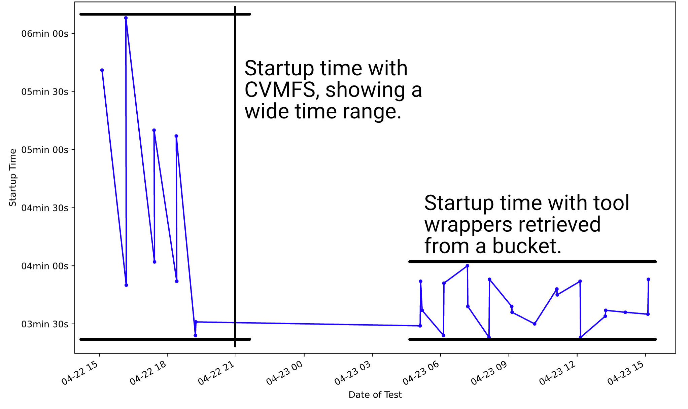

---

title: "Galaxy Helm chart v4.0"
tease: "From dev to testing to production on the same stack."
authors: "Alex Mahmoud, Nuwan Goonasekera, Keith Suderman, Enis Afgan"
date: "2021-05-07"
source_blog: "Galaxy Project Blog"
source_blog_url: "https://galaxyproject.org/blog/2021-05-galaxy-helm-chart-v4/"
---

We are happy to announce general availability of a new major version of the
Galaxy Helm chart: version 4.0. The Galaxy Helm chart automates the mechanics of
deploying Galaxy into a single package. The same package can be used to deploy
Galaxy for development, testing, or production. With v4, the chart also
introduces improvements for managing Galaxy over time. Let’s take a look at the
highlights!

# Faster startup

We have changed how Galaxy obtains tool wrappers to make the startup time for
Galaxy about ~30% faster and more consistent. Traditionally, production
deployments would mount Galaxy’s CVMFS repository and load tool wrappers from
that file system. Tool wrappers are generally small files but there are many of
them, making this a very slow process via CVMFS as each file must be cached
locally before Galaxy would start. This also required CVMFS to be locally
available, which is not possible on Mac computers due to an issue with CVMFS
drivers.

Version 4 of the Galaxy chart retrieves tool wrappers from object store buckets
instead of the CVMFS. As the Galaxy Helm chart is installed, a relevant archive
is downloaded before the Galaxy process starts, hence eliminating the wait while
Galaxy is starting up. This process works in three stages: (1) an initial
archive contains the necessary XML files so Galaxy can load the tool panel. This
archive is about 1MB in size and it is downloaded before Galaxy starts; (2) a
second archive contains the tool scripts and any tool configuration files that
are required to run the tools. This archive is about 110MB and it is downloaded
as part of the startup but Galaxy does not need to wait for it; (3) finally, the
third archive contains the tool test data. It is about 770MB in size and can be
downloaded in due time. The URLs of the three archives are controlled via chart
variables so custom toolsets are readily supported.

A result is the faster and more consistent startup time (see timing results
below), reduced dependency on the Galaxy-project-managed CVMFS structure,
increased opportunities for toolset customization by individual sites, and
ability to load and run the tools without the CVMFS. In the future, it will be
interesting to explore options for retrieving reference data using a similar
approach and entirely eliminate the dependency on CVMFS.

  <a href="/news/2021-05-galaxy-helm-chart-v4/no-cvmfs.png">
    

  </a>

# Improved long-term application management

Installing Galaxy is only the first step towards offering an analysis
environment for users. A medium to large-scale installation of Galaxy can easily
consume half of a system administrator’s time. The Galaxy Helm chart is aiming
to lower this burden by consolidating best-practice deployment strategies into a
single package as well as offering capabilities for streamlining long-term
application management.

With the v4 release, the chart now uses a Postgres Operator for database
management. [Kubernetes
Operators](https://kubernetes.io/docs/concepts/extend-kubernetes/operator/)
capture highly capable logic and processes for entire application lifecycle
management that mimic that of a human administrator. This includes daily
application operations, healing, upgrades, logging, and more (yes, it would be
great to have a Galaxy Operator one day). With this upgrade to the Galaxy chart,
management of the database layer supports multiple PostgreSQL versions
(currently ranging between v9.5 and v13), high-availability mode, custom UI, and
an eye toward the future.

In addition to the Postgres Operator, the latest version of the chart offers
enhanced Galaxy probes for application startup, readiness, and liveness. The
newly added startup probes allow administrators of production instances to
better configure their handler health checks for high availability setups and
more reliable handler scaling.

# Increased robustness of the deployment

Automated and ongoing testing are critical capabilities for ensuring robustness
of code. With v4 of the Galaxy Helm chart, continuous integration capabilities
have been added. The chart repository now implements a number of GitHub Actions
that (1) lint each commit, (2) perform two end-to-end Galaxy deployment, with
and without the CVMFS, and (3) package the chart for distribution based on the
label used on a pull request.

Collectively, this increases the quality of the chart implementation because
each pull request must adhere to consistent standards. With ongoing deployment
tests, any regressions will be more readily pinned, and automated packaging
ensures all compatible components make up the released package.

In addition to the chart testing, the latest chart release is used to
automatically and on an ongoing basis test all the tools available in the
default release. Split over the course of a week, each day, 1/7th of the toolset
is tested and [test results
recorded](https://github.com/anvilproject/galaxy-ci#tool-testing). This provides
a new test target for all containerized Galaxy tools as well as a longitudinal
view into test results.

# Configuration changes, including backward incompatible changes

Following the evolution of software used within the chart, version 4 uses latest
available configuration options and tool versions, which introduce some backward
incompatible changes.

Support for Helm 2 has been dropped. Helm 2 stopped being maintained in November
2020 so it’s time. And Helm 3 is [much
better](https://helm.sh/blog/helm-3-released/).

Many Galaxy configurations have gradually transitioned from XML-based files to
YAML-based files.  Job configuration file is no exception and the chart v4 has
adopted the YAML-based configuration. A direct benefit for the chart is the
ability to set individual values within the file using the _--set_ option with
Helm as opposed to having to update the entire file even if only a single value
is being changed.

The Galaxy Helm chart has long held an option to specify resource requirements
for a tool as well as declare or override which container image is used for a
given tool. Version 4 of the chart introduces an updated format for specifying
these values. The new format is based on experience of using the old format and
provides a more expressive format that allows individual values to be set. The
chart remains backwards compatible but we recommend updating the values to use
the new format to gain the above-mentioned benefits.

# Software updates

This chart update brings along new default versions of the software it wraps.
The chart now requires Kubernetes 1.16 or newer due to the introduction of
startup probes. Galaxy has also been upgraded to the latest available version,
21.05. Finally, with the Postgres Operator, new deployments come with PostgreSQL
13.

In addition to the core software updates, v4 of the chart introduces a new and
updated toolset for Galaxy. The toolset has been streamlined to include relevant
tools for a number of domains and it includes only the latest versions of the
included tools. The toolset includes just over 200 tools, with a detailed list
[available in the CI
repo](https://github.com/almahmoud/anvil-misc/blob/master/reports/anvil/tools.yaml).
On a daily basis, this toolset is automatically copied off the CVMFS,
compressed, and pushed to a publicly available bucket. This toolset can thus be
used either through the traditional CVMFS setup or the new bucket method.
