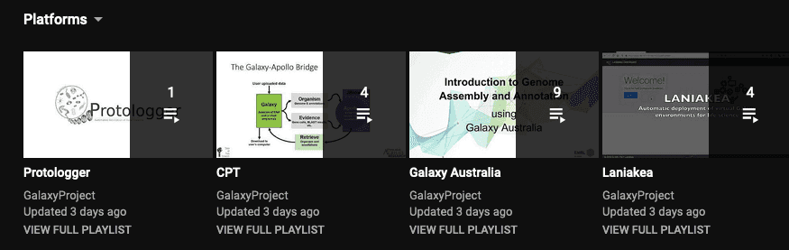
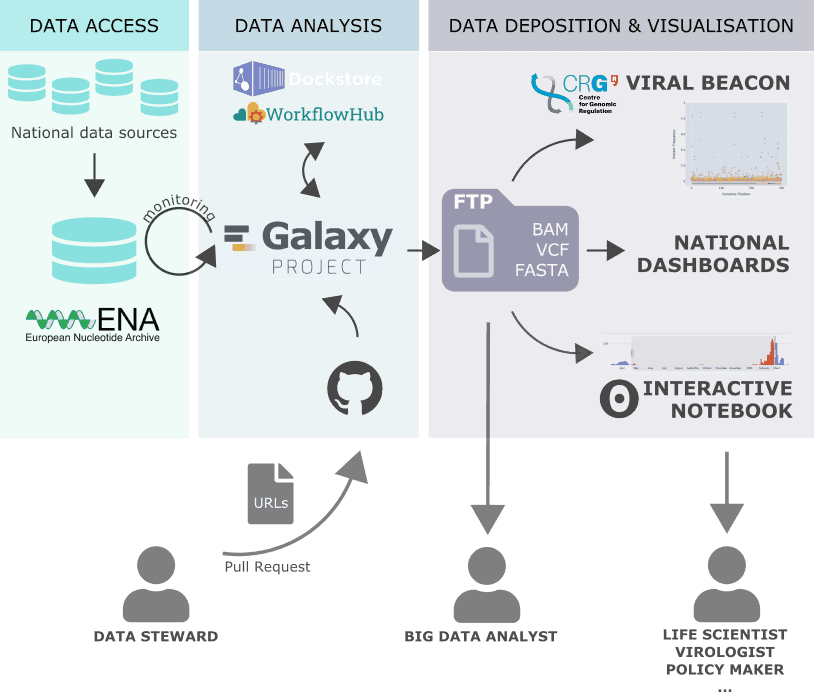
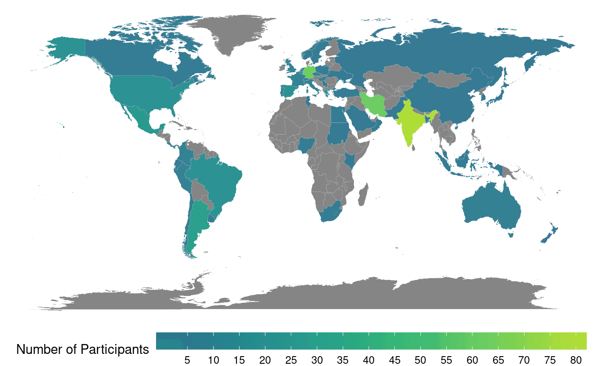
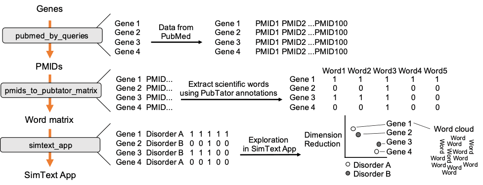

Hello all,

Welcome to the May 2021 edition of Galaxy News.  The big news is that **[several deadlines for the 2021 Galaxy Community Conference](#community-news) have been extended, and the [deadline for submitting James Taylor videos](#featured-news) has been extended to this Friday.**

And there are other upcoming deadlines too:

* **[ISMB/ECCB and BOSC 2021 abstracts](#event-news) are due this Thursday.**
* **Apply for the [Galaxy Australia Variant Calling Workshops](#event-news) by May 12.**

We also have

* **[open positions](#community-news)**
* **[webinars, CoFests, workshops, community meetups, and other events](#event-news)**,
* news about **[public Galaxy platforms](#galaxy-platforms-news)**,
* recent **[blog posts](#galactic-blog-activity)**,
* **[training and doc updates](#doc-hub-and-training-updates)**,
* recent **[open-access Galaxy-related publications](#publications)**, and
* **[new releases](#releases).**

As always, thanks for using Galaxy,

Dave Clements and Beatriz Serrano-Solano, Editors

---

# Featured news

<!-- James -->

Share your favorite James Taylor story: Deadline extended to May 7

It's been a year since [James Taylor](/jxtx/) passed away.  To remember him, and mark his upcoming birthday (May 18) we are creating a community video, *and we have extended the deadline for contributions to this Friday, May 7*.  We are asking you to tell us your favorite story about James in ~ 30 seconds. We will combine your clips into a video that will be prominently featured on all Galaxy-related sites.

Here is what we will need you to do by the end of Friday, May 7:

1. Think of your favorite story/interaction/event involving James
2. Pick a nice location and record the video!
3. The video should be:

* in a high-resolution
* without background noise
* in a horizontal orientation (not vertical!)
* ≲ 30 seconds in length

4. Deposit video file to your Google Drive or Dropbox folder (or any other location that would allow us to retrieve it)
5. Send a link to the video, your name and location as you would like them to appear in the final video to: outreach@galaxyproject.org

Thank you all in advance and please feel free to invite other friends of James to participate.

# Community News

<!-- GCC2021 Registration -->

[GCC2021 Registration](https://www.vibconferences.be/events/gcc2021)

**The [2021 Galaxy Community Conference](https://www.vibconferences.be/events/gcc2021) will be held 28 June through July 10.  It will be [virtual, affordable, and globally accessible](/news/2021-02-gcc-virtual/).**

GCC2021 will start with a [__week of online training__](https://galaxyproject.org/events/gcc2021/training/). Training will largely use the GTN Smörgåsbord model: lectures will be prerecorded, with live help available on chat for the duration of the week. This model allows participants to learn at their own pace, avoids scheduling conflicts that are inherent with our usual multi-track training, and enables those with low bandwidth internet connections to fully participate.

__Registration closes June 25__

Registering before __June 1__ saves 50% off of the full rates. Registration discounts will be available to researchers from low and lower-middle income countries. For everyone else, registration are downright cheap too: the rates start in €15.00 for the training week and in €25.00 for the 3-day conference (plus VAT). The CoFest is free.

**And [GCC2021 is looking for sponsors](http://bit.ly/gcc2021_prospectus_v1) too!**

<!-- GCC Abstracts submission & Fellowships -->

[GCC2021 Fellowships & Abstract Submission Deadlines Extended](/news/2021-05-gcc-extended/)

Several deadlines for the [2021 Galaxy Community Conference (GCC2021)](https://www.vibconferences.be/events/gcc2021-virtual-edition) have been extended. See below.

GCC2021 talk and poster/demo presentations will be selected from abstract submissions. We welcome submissions that use, implement or extend the Galaxy platform and ecosystem, including integrating and analyzing datasets in any research area, enhancing reproducibility in computational analyses, and fostering collaboration in scientific workflow development

**Talk Abstracts: 17 May**

Talks can be either long (15-20 minutes) or lightning (5-7 minutes). **Talks** will be pre-recorded, with live Q`&`A. [Submit your abstract now](https://www.vibconferences.be/events/gcc2021-virtual-edition#abstracts).

**Poster/Demo Abstracts: 14 June**

(However, you are encouraged to submit your abstracts earlier, if at all possible.)  Poster/Demos will be presented live at Remo.co tables and will not be limited to a single large PDF.  They are an opportunity to fully communicate your work. [Submit your abstract now](https://www.vibconferences.be/events/gcc2021-virtual-edition#abstracts).

**GCC2021 Community Fellowships: 17 May**

The Galaxy Community Fund is offering fellowships to students, post-docs, and other non-profit / academic / government researchers based in [lower, lower-middle and upper-middle income countries](https://docs.google.com/document/d/1aFR1b8Al0DE0Ovn1pFJYlLchVUl2At82Dt4MRudvtRY/edit?usp=sharing) who will benefit from attending GCC2021, and for whom the [cost of registration](/news/2021-04-gcc-reg/) is a barrier.

Fellowships will cover the full registration for any GCC2021 events awardees want to attend. Interested?  [Apply here](https://docs.google.com/forms/d/e/1FAIpQLSfyqKg87x8wL1EhOfrGR0SlQui8wEkQgg3qVFi6txO6GmHgKg/viewform) by May 17.

**Early Registration: 1 June**

Early conference registration [is open until 1 June](/news/2021-04-gcc-reg/).

<!-- hiring -->

[Open Galaxy Positions](/careers/)

There are two new positions in the [Galaxy Career Center](/careers/), both in Rennes, France (and is due **1 June**).  There are also several previously posted positions that are still open, including several with the Galaxy Project in the US.

# Event News

Despite COVID-19, there is still a lot going on, and most of it is online. See the [full list of events](/events/). Some highlights:

<!-- Galaxy @ ISMB? -->

[ISMB/ECCB/BOSC Deadlines](https://www.iscb.org/ismbeccb2021)

**Submissions due May 6**

[ISMB/ECCB 2021](https://www.iscb.org/ismbeccb2021) is one of the largest bioinformatics conferences and every year Galaxy has had a significant presence.  ISMB/ECCB is built from community building blocks, and this year that includes the **[Bioinformatics Open Source Conference (BOSC)](https://www.open-bio.org/events/bosc-2021/)** (our 2018 and 2020 conference partner), as well as communities focused on [high-throughput sequencing](http://hitseq.org/), [mass spec](http://cosi.iscb.org/wiki/CompMS:Home), [bioinformatics education](http://cosi.iscb.org/wiki/Education:Home), [visualization](http://biovis.net/2021/index.html), [microbiomes](https://www.microbiome-cosi.org/), [bioinformatics core facilities](http://bioinfo-core.org/index.php/ISMB_2021:_BioinfoCoreWorkshop), and [many others](https://www.iscb.org/communities-of-special-interest).

**[BOSC](https://www.open-bio.org/2021/03/24/join-us-at-bosc-2021/)** is a particularly good match for the Galaxy community. Topics include software development practices that promote open science standards and sharing of biological data and code, as well as approaches for building diverse communities.

Most of these are accepting talk and poster submissions through the [ISMB/ECCB website](https://www.iscb.org/ismbeccb2021), but [BioInfo-Core is taking talk submissions here](https://forms.gle/N1mfB3dEEd4oi4wBA).  All submissions are due May 6.

<!-- Webinars -->

[Webinars](/events/webinars/)

Our current webinar series focuses on Galaxy resources for several different communities.  Webinars are held every other Wednesday at 10:00 Eastern US / 16:00 Central European time.  The last two webinars are this month

**[Galaxy Resources for Tool Developers](/events/2021-05-gr4-tool-devs/), May 12**

**[Galaxy Resources for Sys Admins and Infrastructure Providers](/events/2021-05-gr4-admins/), May 26**

Space is, um, unlimited!  But sign up today anyway and we will send you a reminder.

Recordings of the two earlier webinars in the series are now available:

* [Galaxy Resources for Researchers](https://youtu.be/cFN_WPGz9qk)
* [Galaxy Resources for Educators and Trainers](https://www.youtube.com/watch?v=AXynJtPXgRQ)

<!-- Paper Cuts -->

[May Papercuts](/events/2021-05-papercuts/) and
[GTN CoFest Day](/events/2021-02-gtn/)

**20 May, Online, Global**

Please join us for the [8th Papercuts CoFest day](/events/2021-05-papercuts/) and the [Galaxy Training Network CoFest day](/events/2021-05-gtn/) on May 20 to help the Galaxy Ecosystem become a better place, and to help new contributors come on board.

We will be on Matrix for chat all day long, and each event will have 3 calls spread across the day. Please take advantage of both to communicate with your collaborators around the world.

<!--Variant calling -->

Variant Calling Workshop Series

**Apply by 12 May**

This series of online workshops covers variant calling across the tree of life.

**[Variant calling in humans, animals and plants with Galaxy](https://www.biocommons.org.au/events/variants-polyploid), 25 May**

**[Viral variant calling with Galaxy](https://biocommons.org.au/events/variants-viruses), 26 May**

**[Bacterial variant calling with Galaxy](https://biocommons.org.au/events/variants-bacteria), 27 May**

All 3 workshops will be run by Gareth Price and Igor Makunin.

<!-- RepeatExplorer -->

[RepeatExplorer Workshop](https://training.vib.be/all-trainings/metatranscriptomics-analysis-using-microbiome-rna-seq-data-galaxy)

**25 May - June 11, Online**

The workshop will focus on theoretical and practical aspects of using next generation sequencing (NGS) data for analyzing repeat composition of plant genomes. Special emphasis will be given to repeat characterization methods implemented in the RepeatExplorer pipeline, including practical training in using the pipeline. Participants are also encouraged to make short presentations of their research related to the workshop topic.

[Register now](http://repeatexplorer.org/?page_id=19). The workshop is free.

<!-- Galaxy Dev Round Table -->

[Galaxy Developer Roundtable](/community/devroundtable/)

The next roundtable meetups will be:

**[May 13: Customizeable welcome and introduction page for new Galaxy users](/events/2021-05-13-dev-roundtable/), Alex Ostrovsky**

**May 27: TBD**

We still [need a volunteer to lead a discussions on a topic of interest on May 27](https://bit.ly/gxdevroundtablepresent).

<!-- Metabolomics -->

[Galaxy Metabolomics Community Call](/events/2021-05-metabolomics/)

**6 May, 14:00 CET**

The call features a guest speaker, Amrita Cheema, Georgetown University School of Medicine in Washington DC, presenting her work in radiometabolomics. We'll also discuss GCC CoFest work, and training and standardization in metabolomics.

To know more about the Galaxy Metabolomics community, please [subscribe to the mailing list](https://lists.galaxyproject.org/lists/metabolomics.lists.galaxyproject.org/) or join the [metabolomics Matrix channel](https://matrix.to/#/#usegalaxy-eu_metabolomics:gitter.im).

<!-- Analyse avancée de séquences -->

[Analyse avancée de séquences](https://cnrsformation.cnrs.fr/analyse-avancee-sequences)

**4-6 May, Bordeaux, France**

Savoir rechercher des informations dans les banques de données. Maîtriser les outils d'analyse de séquences tels que les alignements et savoir interpréter les résultats. Maîtriser les formats et les analyses des nouvelles données issues du séquençage (NGS).

<!-- Metatranscriptomes -->

[Metatranscriptomics analysis using microbiome RNA seq data in Galaxy](https://training.vib.be/all-trainings/metatranscriptomics-analysis-using-microbiome-rna-seq-data-galaxy)

**25 May, VIB, Online, Ghent, Belgium**

An introduction basic concepts and tools from the ASaiM-MT workflow. ASaiM-MT provides a curated collection of tools to explore and visualize taxonomic and functional information from metatranscriptomic sequences.

<!-- Galaxy NL -->

[Galaxy-NL Meeting 2021](https://docs.google.com/document/d/1irLt2gtm-iNdgDZqybUpj7g39zkf5qaDkGW4-wW31YQ/edit)

**28 May, Online**

This year's [Galaxy Netherlands meeting](https://docs.google.com/document/d/1irLt2gtm-iNdgDZqybUpj7g39zkf5qaDkGW4-wW31YQ/edit) will take place on 28 May, from 10:00-12:00.  Interested in meeting with the Dutch Galaxy community? Please [add your name and join the conversation](https://docs.google.com/document/d/1irLt2gtm-iNdgDZqybUpj7g39zkf5qaDkGW4-wW31YQ/edit).

# Galaxy Platforms News

The [Galaxy Platform Directory](/use/) lists resources for easily running your analysis on Galaxy, including publicly available servers, cloud services, and containers and VMs that run Galaxy.  Here's the recent platform news we know about:

<!-- Protologger -->

[Protologger](/use/protologger/)

Protologger is an all-in-one genome description tool, aimed at simplifying gathering the data required for writing protologues. This includes providing taxonomic, functional and ecological insights. See the [Protologger video](https://youtu.be/OffujFMP4OU) for an introduction.

<!-- QIIME 2 -->

[q2Galaxy](/use/qiime2/) (Alpha)

Starting with the [2021.4 release](https://forum.qiime2.org/t/qiime-2-2021-4-is-now-available/19340) of [QIIME 2](https://qiime2.org/) (see releases below), this [Docker image](https://quay.io/repository/qiime2/q2galaxy) is automatically updated as QIIME 2 is updated. It contains the full set of QIIME 2 actions as Galaxy tools, and is maintained by the [QIIME 2 community](https://github.com/orgs/qiime2/people). QIIME 2 is a next-generation microbiome bioinformatics platform that is extensible, free, and open source. QIIME 2 has [extensive documentation](https://docs.qiime2.org/), an [online (and free) workshop](https://workshops.qiime2.org/microbiome-bioinformatics-qiime-2-free-online-work/), and a [support forum](https://forum.qiime2.org/). There is also a [video](https://youtu.be/pjVJ0ncBRsM) describing how to launch the QIIME 2 Galaxy Docker image (on Windows!).  Finally, this is an *Alpha* release. Please report any issues you notice on the [forum](https://forum.qiime2.org/).

<!-- CPT -->

[Center for Phage Technology (CPT)](/use/center-for-phage-technology-cpt/)

[Four videos about](https://youtube.com/playlist?list=PLNFLKDpdM3B-wbkkZJHqS4aMkg_9UhOsF) the Texas A&M [Center for Phage Technology](https://cpt.tamu.edu/)'s [Galaxy server](/use/center-for-phage-technology-cpt/) came out recently.  They include three how-to videos, and a webinar by Jason Gill. The Videos highlight doing annotation with Galaxy and Apollo.

<!-- Platforms Videos -->

<a href="https://www.youtube.com/channel/UCwoMMZPbz1L9AZzvIvrvqYA/playlists?view=50&sort=dd&shelf_id=7">New Platforms Section on YouTube</a>

Protologger and CPT are not the only Galaxy platforms creating videos.  We have gathered or created YouTube playlists for every Galaxy platform that we could find videos for.  There are <a href="https://www.youtube.com/channel/UCwoMMZPbz1L9AZzvIvrvqYA/playlists?view=50&sort=dd&shelf_id=7">52 videos about 15 different platforms</a>, ranging from Galaxy Australia to Sciensano.

<!-- Plants subdomain -->

[New Plants flavour in UseGalaxy.eu](https://plants.usegalaxy.eu/)

In preparation for the workshop [Plant Transcriptome Analysis using Galaxy](https://docs.google.com/document/d/1Y5MqYmMxFCy7PDImYYuHLhgCKVV7MjoGMr22G2U68Ec/preview) that took place in mid April, a new flavour of the European Galaxy Server has been set up, filtering the tools by their relevance to the plant research field.

<!-- 30K users EU -->

[30,000 registered users in usegalaxy.eu](https://galaxyproject.eu/posts/2021/04/25/30000user/)

The European Galaxy Server has surpassed the 30,000 registered users, has around 3,000 active users per month and a total of 18 million jobs has been run since its opening in 2018.

<!-- UseGalaxy.* -->

[UseGalaxy.*](/usegalaxy/) News

* The European Galaxy community is involved in [several ELIXIR Implementation Studies](https://galaxyproject.eu/posts/2021/04/19/elixir-is/).
* Lots of tool updates on [UseGalaxy.eu](https://galaxyproject.eu/news?tag=tools) and [UseGalaxy.org.au](https://usegalaxy-au.github.io/galaxy/news.hgtml).

# Galactic Blog Activity

<!-- COVID monitoring -->

[Monitoring of raw open data for SARS-CoV-2 genome surveillance](https://galaxyproject.eu/posts/2021/04/29/sars-cov-2-monitoring/)

By Simon Bray, Wolfgang Maier, Beatriz Serrano-Solano and Björn Grüning

UseGalaxy.eu is now automatically collecting, and analyzing raw sequencing data published by the COVID-19 Genomics UK Consortium (COG-UK). This infrastructure is easily scalable and could be used in other large-scale SARS-CoV-2 sequencing projects.

<!-- Plants workshop report -->

[Plant Transcriptomics Workshop: A Summary](https://galaxyproject.eu/posts/2021/05/03/plant-summary/)

By Mehmet Tekman, Beatriz Serrano-Solano

The outcome of the [Plant Transcriptome Analysis using Galaxy](https://docs.google.com/document/d/1Y5MqYmMxFCy7PDImYYuHLhgCKVV7MjoGMr22G2U68Ec/preview) workshop has been summarised in a report.

A huge shout out to all the participants, instructors and helpers for their support during the training week!

# Doc, Hub, and Training Updates

<!-- Text-mining with the SimText toolset  -->

[Text-mining with the SimText toolset](https://training.galaxyproject.org/training-material/topics/statistics/tutorials/text-mining_simtext/tutorial.html)

By [Marie Gramm](https://training.galaxyproject.org/training-material/hall-of-fame/mgramm1/), [Dennis Lal group](https://training.galaxyproject.org/training-material/hall-of-fame/dlalgroup/) and [Daniel Blankenberg](https://training.galaxyproject.org/training-material/hall-of-fame/blankenberg/)

This tutorial is based on a proof-of-concept example given in Gramm et al. 2020. It uses SimText, a toolset for literature research to collect text from PubMed for any given set of biomedical entities, extract associated terms, and analyze similarities among them and their key characteristics in an interactive tool.

<!-- Plates Batches Barcodes  -->

[Plates, Batches, and Barcodes](https://training.galaxyproject.org/training-material/videos/watch.html?v=transcriptomics/tutorials/scrna-plates-batches-barcodes/slides)

This [slide deck](https://training.galaxyproject.org/training-material/topics/transcriptomics/tutorials/scrna-plates-batches-barcodes/slides.html) about single-cell RNA-Seq experiments is [now available as a video](https://training.galaxyproject.org/training-material/videos/watch.html?v=transcriptomics/tutorials/scrna-plates-batches-barcodes/slides).

# Publications

Pub curation activities [are on a semi-hiatus right now](/news/2020-08-10k-pubs/#the-future) but a few publications referencing, using, extending, and implementing Galaxy were added to the [Galaxy Publication Library](https://www.zotero.org/groups/galaxy) anyway.  Here are the new open access *Galactic* and *Stellar* pubs:

[RNA-Seq Data Analysis in Galaxy](https://doi.org/10.1007/978-1-0716-1307-8_20)

Batut, B., van den Beek, M., Doyle, M. A., & Soranzo, N. (2021). In E. Picardi (Ed.), RNA Bioinformatics (pp. 367–392). Springer US. [https://doi.org/10.1007/978-1-0716-1307-8_20](https://doi.org/10.1007/978-1-0716-1307-8_20)

[Inverting the model of genomics data sharing with the NHGRI Genomic Data Science Analysis, Visualization, and Informatics Lab-space (AnVIL)](https://doi.org/10.1101/2021.04.22.436044)

Schatz, M. C., Philippakis, A. A., Afgan, E., Banks, E., Carey, V. J., Carroll, R. J., Culotti, A., Ellrott, K., Goecks, J., Grossman, R. L., Hall, I., Hansen, K. D., Lawson, J., Leek, J. T., Luria, A. O., Mosher, S., Morgan, M., Nekrutenko, A., O’Connor, B. D., … Team, A. (2021). *BioRxiv*, 2021.04.22.436044. https://doi.org/10.1101/2021.04.22.436044

# Releases

<!-- QIIME 2 -->

[QIIME 2 2021.4](https://forum.qiime2.org/t/qiime-2-2021-4-is-now-available/19340)

The 2021.4 release of QIIME2 includes a new interface, [q2galaxy](https://github.com/qiime2/q2galaxy) (see Platform News above), for generating Galaxy tool descriptions automatically from QIIME 2 actions. This means that as plugins are created and evolve, the QIIME 2 team can automatically generate complete Galaxy tools in a few seconds, rather than developing them by hand as is typically done.

[Pulsar 0.14.5](https://github.com/galaxyproject/pulsar/blob/master/HISTORY.rst)

[Pulsar](https://pypi.python.org/pypi/pulsar-app/) is a Python server application that allows a Galaxy server to run jobs on remote systems (including Windows) without requiring a shared mounted file systems. Unlike traditional Galaxy job runners - input files, scripts, and config files may be transferred to the remote system, the job is executed, and the results are transferred back to the Galaxy server - eliminating the need for a shared file system.

