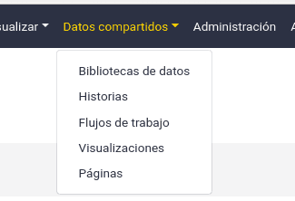
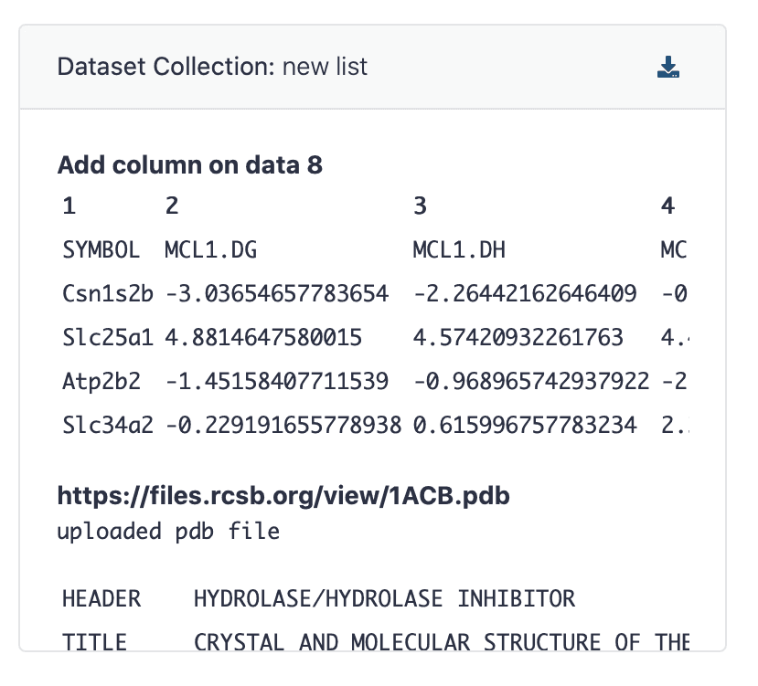

We are pleased to announce the release of Galaxy
21.05 - **[developer and admin release announcement](https://docs.galaxyproject.org/en/master/releases/21.05_announce.html)** and **[user release announcement](https://docs.galaxyproject.org/en/master/releases/21.05_announce_user.html)**.

# Highlights

## New development stack

Galaxy release 21.09 will ship with a new web framework
([fastAPI](https://fastapi.tiangolo.com/)),
[Celery](https://docs.celeryproject.org/en/stable/index.html) task queue
and process management using
[Circus](https://circus.readthedocs.io/en/latest/). You can preview new
stack now by running `APP_WEBSERVER=dev ./run.sh`.

## Celery for background tasks

Galaxy can now run certain tasks in the background. The Celery workers
are currently not required, but if activated can perform certain
long-running tasks, such as creating history export archives. Celery
tasks will bridge the gap between rapid requests that can be handled
during a web request and jobs that require extensive and relatively slow
setup.

## More robust selection of job handlers
Job throughput can be increased by starting Galaxy with multiple
external job handler processes. Jobs were traditionally assigned to a
job handler process by the web handler or workflow handler process that
created the job. Since Release 19.01 Galaxy has supported additional
mechanisms that use database serialization techniques to let job
handlers assign processes to themselves. This mechanism is more robust
and doesn't require that all job handler processes be alive and known by
the web handler process. Galaxy now determines the best method for
assigning jobs based on the database in use, if the assignment method is
not set explicitly. Older job assignment methods will be removed in
Galaxy release 21.09. For more details see the [Job Handler Assignment
Methods
section](https://docs.galaxyproject.org/en/release_21.05/admin/scaling.html#job-handler-assignment-methods)
of the Galaxy documentation.

## ¡Galaxy, ahora en español!
Thanks to Wendi Bacon, the Spanish language translation of Galaxy has been finalised
and merged, so if you prefer to use Galaxy in Spanish, now you can! This
update will be part of an ongoing project from Spanish speakers within
the Galaxy community to keep the Galaxy interface localisation up to
date, and to produce some Spanish language training materials in the
GTN.

## Bugfixes and Stability
This release of Galaxy features fewer user-facing changes, as a huge amount of
developer time went into making this a maintenance release with better testing,
better stability, and more bugfixes. But watch out, this is all in preparation
for the next release of Galaxy, 21.09, which will have some of the biggest UI
changes in years!

## Remote Files: FTP Support
In the last release, the Remote Files interface was added granting access to a
huge number of remote data sources directly in Galaxy. Support was added for
FTP servers in the latest release so now you can connect e.g. the NCBI FTP
server for all of your genomic data needs.

##Download Collections from Reports##
Workflow reports are gaining popularity and features! You can not only insert
previews of collections in your reports, but also download them directly from
the report interface.

New Visualizations
------------------

Thanks to [@dlal-group](https://github.com/dlal-group), the SimText
suite of tools has been added as an interactive tool within Galaxy. You
can read about how to use this new Interactive Tool in the associated
[GTN
tutorial](https://training.galaxyproject.org/training-material/topics/statistics/tutorials/text-mining_simtext/tutorial.html).

# Release Notes

Please see the [full release notes](https://docs.galaxyproject.org/en/latest/releases/21.05_announce.html) for more
details.
