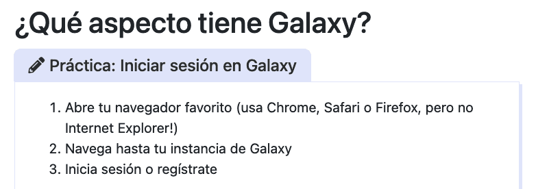
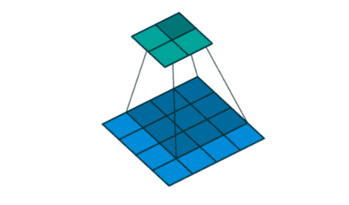
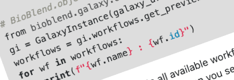
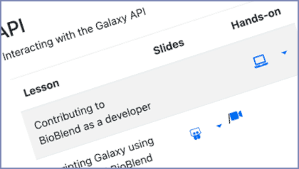

Hello all,

Welcome to the June 2021 edition of Galaxy News.  GCC2021 is upon us, **[with deadlines and events starting this month](#featured-news)**.  It's not too late to register (register by June 8 and get 50% off) and to submit Poster/Demo abstracts.  Training week starts on June 28. We also started getting confirmations from speakers and are **[publishing confirmed presenters](#featured-news)** as we get them. We are also pleased to **[announce our first three sponsors for GCC2021: F1000Research, GigaScience Press and KWS-SAAT](#gcc2021-sponsorships)**.

In addition to GCC news, we also released the **[James Taylor birthday video](#community-news)**, and have several **[new open positions](#community-news)**, lots of **[event news](#event-news)**, **[Galaxy platform news](#galaxy-platforms-news)**, **[Galactic blog posts](#galactic-blog-activity)**, **[training and doc updates](#doc-hub-and-training-updates)**,
recent **[open-access Galaxy-related publications](#publications)**, and **[new releases](#releases).**

As always, thanks for using Galaxy,

Dave Clements and Beatriz Serrano-Solano, Editors

PS: Subscribe to the [Galaxy Announce mailing list](https://lists.galaxyproject.org/?count=100&all-lists=) to receive an email whenever this newsletter is published.

---

# Featured news

<!-- GCC Starts Soon -->

[GCC2021 Dates: Training Starts June 28](https://www.vibconferences.be/events/gcc2021)

**The [2021 Galaxy Community Conference](https://www.vibconferences.be/events/gcc2021) is almost upon us.  GCC2021 will be held 28 June through July 10.    Here are the dates you need to know over the next 5 weeks:**

**June ~~1~~ 8: Early registration closes**

[Register by __June 8__ and save 50% off of the full rates](/news/2021-05-gcc-reg/). Registration [discounts are available to researchers from low and lower-middle income countries](/news/2021-05-gcc-reg/#participants-based-in-low-lower-middle-and-upper-middle-income-countries). For everyone else, registration is downright cheap too, starting at €15.00 for the training week and in €25.00 for the 3-day conference (plus VAT). *The [CoFest](https://sched.co/iLKn) is free.*

**June 14: Poster/Demo Abstracts Due**

We welcome [poster/demo submissions](/news/2021-05-gcc-posterdemo/) that use, implement or extend the Galaxy platform and ecosystem, including integrating and analyzing datasets in any research area, enhancing reproducibility in computational analyses, and fostering collaboration in scientific workflow development

Poster/Demos will be presented live at Remo.co tables and will not be limited to a single large PDF.  They are an opportunity to fully communicate your work. [Submit your abstract now](https://www.vibconferences.be/events/gcc2021-virtual-edition#abstracts).

**June 17: CoFest Prep Day**

The *June Paper Cuts Day* is now  the [GCC2021 CoFest Prep Day](/events/2021-06-papercuts/) for CoFest participants to create plans for the [GCC2021 CoFest](https://sched.co/iLKn). The CoFest will loosely organized around *clusters* -- shared areas of interest. [Find, propose, or guide your cluster ahead of time](/news/2021-05-gcc-cofest-call/), and at prep day.

**June 25: All Registration Closes**

So, [register](https://www.vibconferences.be/events/gcc2021) by then, OK?

**June 28: Training Week Starts**

GCC2021 [Training Week](https://galaxyproject.org/events/gcc2021/training) runs from June 28 through July 2. [Galaxy for Scientists](https://galaxyproject.org/events/gcc2021/training/science-track), [Galaxy for Developers](https://galaxyproject.org/events/gcc2021/training/dev-track), and [Galaxy for Admins](https://galaxyproject.org/events/gcc2021/training/admin-track) tracks are offered (and you can swap back forth between the Scientists and Developers tracks).  Lectures will be prerecorded, with live help available on chat for the week. This enables participants to learn at their own pace, avoids scheduling conflicts that are inherent with multi-track training, and enables those with low bandwidth internet connections to fully participate.  Training Week requires a separate registration from the meeting.

**July 7: Three Day Meeting Starts**

Featuring accepted full and lightning talks, poster/demo presentations, sponsors, birds-of-a-feather gatherings, and plenty of time for networking, the GCC2021 meeting is a three day event that brings the Galaxy Community together to share our work and address common challenges in data intensive science.   I

The meeting is [virtual, affordable, and globally accessible](/news/2021-02-gcc-virtual/) no matter what time zone or country you live in.

**July 9: Two Day CollaborationFest Starts**

GCC2021 wraps up with [a two-day collaborative work event](https://sched.co/iLKn) that aims to broaden the Galaxy contributor community, and to extend and improve all aspects of the Galaxy ecosystem.  The CoFest includes training, documentation, best practice workflows, community infrastructure, tools, and of course code.

<!-- GCC2021 Confirmed Speakers -->

[Confirmed Speakers and Topics](https://gcc2021.sched.com/)

We have a [growing list of confirmed speakers and topics](https://gcc2021.sched.com/) for GCC2021 (and we expect to have them placed in the schedule by the end of this week).  Topics are wide-ranging, and reflect the breadth and depth of the Galaxy community and ecosystem.

Some highlights from the confirmed presentations list so far:

* **Galaxy Training Network (GTN) Community Update**
    * *Saskia Hiltemann*
* **Introducing the Intergalactic Workflow Commission**
    * *Marius van den Beek*
* **Bridging Natural Language Processing and Biomedical Data Analysis**
    * *Nancy Ide*
* **Galaxy Language Server - Develop high-quality Galaxy tool wrappers at intergalactic speed**
    * *David López*
* **Analysis of Microscopy Data in Galaxy**
    * *Beatriz Serrano-Solano*
* **Open Life Science: An Open Research mentoring and training program**
    * *Muhammet Celik*
* **Using the Galaxy (Australia) Database to Aid an Undergraduate Investigation of RNF43 Mutations as Biomarkers for ctDNA Surveillance of Colorectal Cancer**
    * *Jordon Lima*
* **Designing a comprehensive workflow for detection and functional annotation of lncRNA**
    * *Bianca Pasat*
* **MaxQuant and MSstats in Galaxy enable reproducible quantitative high-throughput proteomics for everyone**
    * *Melanie Föll*
* **Modernizing the Galaxy Backend - Typing and the API**
    * *David López*
* **Modernizing the Galaxy Backend - Data Model**
    * *Sergey Golitsynskiy*
* **Fostering Public Health Bioinformatics and Collaboration with GalaxyTrakr**
    * *Justin Payne*
* **Updates from the Single-Cell Community**
    * *Mehmet Tekman*
* **Galaxy Australia - the influx state of a national eResearch service**
    * *Gareth Price*
* **Community engagement and how it influences Galaxy Australia Innovation**
    * *Johan Gustafsson*
* **The “ARIES Genomics” Italian public health surveillance system**
    * *Arnold Knijn*
* ...

See the [GCC2021 schedule](https://gcc2021.sched.com/) for the most current list of confirmed presenters.

# Community News

<!-- James -->

  <iframe width="560" height="315" src="https://www.youtube.com/embed/oGOF3r3SmDY" frameborder="0" allow="accelerometer; autoplay; clipboard-write; encrypted-media; gyroscope; picture-in-picture" allowfullscreen></iframe>

James Taylor's Birthday Video

To help commemorate [James Taylor's](/jxtx/) birthday (he would have turned 42 on May 18), the community contributed short video remembrances, which have been linked together in one video.

Happy birthday James. We miss you.

<!-- hiring -->

[Open Galaxy Positions](/careers/)

There are three new positions in the [Galaxy Career Center](/careers/), two in Rennes, France (one is due **1 June**), and one in Genoa, Italy (due **13 June**).  There are also several previously posted positions that are still open, including several with the Galaxy Project in the US.

# GCC2021 Sponsorships!

We are pleased to announce the [first three sponsors for GCC2021](https://gcc2021.sched.com/directory/sponsors): F1000Research (Silver), GigaScience Press (Bronze), and KWS SAAT (Bronze).  Sponsors are potential research partners, and their sponsorships are key to making GCC2021 accessible and affordable.

<!-- F1000Research -->

[F1000Research](https://gcc2021.sched.com/sponsor/f1000research1)

**Publish your research fast and openly in [F1000Research's Galaxy Gateway](https://f1000research.com/gateways/galaxy), an open platform dedicated to the Galaxy project.**

*Maximise the impact of your research, publishing a range of outputs such as a new Galaxy workflow or an update to an existing method or software tool. [F1000Research](https://f1000research.com/) is an Open Research publishing platform for scientists, scholars and clinicians offering rapid publication of articles and other research outputs without editorial bias.*

<!-- GigaScience Press -->

[GigaScience Press](https://gcc2021.sched.com/sponsor/gigascience3)

BGI's Open Access Publishing division **[GigaScience Press](http://gigasciencepress.com/)** is offering discounts to GCC2021 presenters in our two journals:

* **[*GigaScience:*](https://gigasciencejournal.com/)** 15% APC discount for the [*GigaScience* Galaxy series](https://academic.oup.com/gigascience/pages/galaxy_series_data_intensive_reproducible_research).
* **[*GigaByte:*](https://gigabytejournal.com/)** Less-complex workflow driven work is eligible for a free-APC discount.

We also publish data, software, and other research objects via our database, [GigaDB](http://gigadb.org/), and Galaxy workflows via [GigaGalaxy.net](http://gigagalaxy.net/).

<!-- KWS SAAT -->

[KWS SAAT](https://gcc2021.sched.com/sponsor/kws1)

**Plant tomorrow’s ideas.**

[We](https://kws.com/) strive for new, fresh ideas and pioneering perspectives. We foster entrepreneurial spirit to set standards in our market and to create sustainable solutions for today’s and future challenges of our planet. We use Galaxy to support our research and breeding.

**If your organization wants to reach hundreds of researchers working in data-intensive science and help GCC2021 succeed then please take a look at the [sponsorship prospectus](http://bit.ly/gcc2021_prospectus_v1) and the [list of sponsorship packages](http://bit.ly/gcc2021_packages).**

# Event News

There is a lot going on in the Galaxy, with [10 events this week alone](/events/). Some upcoming highlights:

<!-- Webinars -->

[Webinars](/events/webinars/)

The [*Galaxy Resources* webinar series](/events/webinars/) wrapped up in May (see the [blog post below](#galactic-blog-activity).  All webinars are available as videos.  As of press time, there is only one webinar scheduled for June:

**[Analyzing your own data in VectorBase](https://vectorbase.org/vectorbase/app/static-content/webinars.html#vect4), June 10**

Keep your eyes open for new webinars as they are scheduled.

<!-- OME -->

[Imaging in Galaxy](https://www.openmicroscopy.org/events/ome-community-meeting-2021/day4/)

**11 June, Online**

As part of the [2021 OME Community Meeting](https://www.openmicroscopy.org/events/ome-community-meeting-2021/), Beatriz Serrano-Solano will give a talk on **Imaging in Galaxy** on [day 4 (June 11)](https://www.openmicroscopy.org/events/ome-community-meeting-2021/day4/) of the meeting.  Conference registration is free.

<!-- Galaxy Dev Round Table -->

[Galaxy Developer Roundtable](/community/devroundtable/)

The next roundtable meetups will be:

**June 10: TBD:**

**June 24: TBD**

We still [need volunteers to lead discussions on a topic of interest on June 10 and 24](https://bit.ly/gxdevroundtablepresent).

<!-- Belbi 2021 -->

[Galaxy Training @ BelBI 2021](https://gallantries.github.io/galaxy-workshop/events/belbi-2021.html)

**21-25 June, Online**

Gallantries is hosting a [Galaxy training workshop](https://gallantries.github.io/galaxy-workshop/events/belbi-2021.html) at [Belgrade Bioinformatics Conference 2021](https://belbi.bg.ac.rs/).  This course will familiarise participants with the Galaxy Platform.  [Register now](https://belbi.bg.ac.rs/?page_id=43).

<!-- Traitement de données de séquences par Galaxy -->

[Traitement de données de séquences par Galaxy](https://www.omic-rennes.com/modules/galaxy/)

**2 juillet**

Ce module comprendra un exposé théorique avec des démonstrations pratiques complétées par quelques applications sur la manipulation de données de régions génomiques et sur l’analyse de jeux de données de type NGS (détection de SNP, analyse de données RNA-seq et ChIP-seq).

<!-- GAT CoFEST -->

[Pre-GCC2021 GAT CoFest](/events/2021-06-gat-cofest/)

**1-4 June, Online**

As the [2021 Galaxy Community Conference (GCC2021)](https://www.vibconferences.be/events/gcc2021-virtual-edition) draws near ([training](https://galaxyproject.org/events/gcc2021/training/) starts June 28) the instructors behind the [Galaxy Admin Track](https://galaxyproject.org/events/gcc2021/training/admin-track) (and [Galaxy Admin Training events](/events/2021-01-admin-training/))  would like to gather to address [some lingering issues](https://github.com/galaxyproject/training-material/issues/2274) before GCC.

<!-- Paper Cuts -->

[Pre-GCC CoFest Prep Day](/events/2021-06-papercuts/)

**17 June, Online, Global**

The June Papercuts CoFest Day is now the **[GCC2021 CoFest Prep Day](/events/2021-06-papercuts/)** for participants to plan work *(collaborative work, dang it)* for the **[GCC2021 CoFest](https://sched.co/iLKn)** being held July 9-10, right after the 3-day GCC2021 meeting.  We will have 3 calls, spread throughout the global day, and communicate via Matrix and (video as needed) between calls.

If you are participating in the GCC2021 CoFest* then please join us June 17.

<small> * And if you aren't participating, then <em>we urge you to reconsider your life choices!</em>  Participation is free but you need to register by June 25.</small>

# Galaxy Platforms News

The [Galaxy Platform Directory](/use/) lists resources for easily running your analysis on Galaxy, including publicly available servers, cloud services, and containers and VMs that run Galaxy.  Here's the recent platform news we know about:

<!-- VVV! -->

[Viral Variant Visualizer (VVV)](/use/vvv/)

Use the [VVV Galaxy server](https://viralvariant.anses.fr/) to determine the composition of a viral population.  Uses a novel bioinformatic tool for rapid and simple visualization of viral genetic diversity.

VVV is supported by Agence National de Sécurité Sanitaire, de l’environnement et du travail (ANSES) Laboratory of Ploufragan-Plouzané-Niort, Université Bretagne Loire (UBL), France.

<!-- SHAMAN -->

[SHAMAN](/use/shaman/)

[SHAMAN](https://shaman.pasteur.fr/) is a user-friendly website for metataxonomic analysis from raw reads to statistical analysis. SHAMAN does not look like Galaxy, but it uses the [Galaxy@Pasteur server](/use/galaxy-pasteur/) for data analysis and workflow execution.

SHAMAN is a shiny application for differential analysis of metagenomic data (16S, 18S, 23S, 28S, ITS and WGS) including bioinformatics treatment of raw reads for targeted metagenomics, statistical analysis and results visualization with a large variety of plots (barplot, boxplot, heatmap, …).

<!-- IMAGING -->

  <iframe width="560" height="315" src="https://www.youtube.com/embed/K-Mxjd-hI_M" frameborder="0" allow="accelerometer; autoplay; clipboard-write; encrypted-media; gyroscope; picture-in-picture" allowfullscreen></iframe>

[Imaging EU Server](/use/imaging/)

The [imaging flavor of Galaxy](https://imaging.usegalaxy.eu/) offers a set of training materials and tools that you can assemble into workflows to perform image analysis.

<!-- UseGalaxy.* -->

[UseGalaxy.*](/usegalaxy/) News

* [New high memory servers for Galaxy Australia](https://www.biocommons.org.au/news/unimelb-server-galaxy-au)
* Lots of tool updates on [UseGalaxy.eu](https://galaxyproject.eu/news?tag=tools) and [UseGalaxy.org.au](https://usegalaxy-au.github.io/galaxy/news.hgtml).

# Galactic Blog Activity

<!-- WR4 summary  -->

[Galaxy Resources for ... Webinars Summary](https://galaxyproject.eu/posts/2021/05/28/webinar-series-gr4/)

The Galaxy ecosystem is very broad in scope and reaches many audiences, each one with different needs. To provide those different profiles with the resources available, four webinars have taken place during April and May for researchers, trainers & educators, tool developers and admins & infrastructure providers.  [You can watch them all now](https://galaxyproject.eu/posts/2021/05/28/webinar-series-gr4/).

# Doc, Hub, and Training Updates

<!-- Curated -->

[Breve introducción a Galaxy - en español](https://training.galaxyproject.org/training-material/topics/introduction/tutorials/galaxy-intro-short/tutorial_ES.html)

**¿Hablas español?: The first curated tutorial in Spanish!**

Galaxy has always had Google-translated tutorials, but we are now embarking on a project to assess the learning experience with human-translated, vs Google-translated, bioinformatics tutorials. We are aiming to survey usage and utility in a workshop for native Spanish speakers.

The project started with Anna Syme's [A short introduction to Galaxy](https://training.galaxyproject.org/training-material/topics/introduction/tutorials/galaxy-intro-short/tutorial.html), and produced [Breve introducción a Galaxy - en español](https://training.galaxyproject.org/training-material/topics/introduction/tutorials/galaxy-intro-short/tutorial_ES.html). Many thanks to Wendi Bacon, Beatriz Serrano-Solano,  Patricia Carvajal López, Alejandra Escobar-Zepeda, Saskia Hiltemann, and Helena Rasche for making this happen.

<!-- Convolutional neural networks (CNN) -->

[Convolutional neural networks (CNN)](https://training.galaxyproject.org/training-material/topics/statistics/tutorials/CNN/slides.html#1)

By [Kaivan Kamali](https://training.galaxyproject.org/training-material/hall-of-fame/kxk302/).

There is a new [slide deck](https://training.galaxyproject.org/training-material/topics/statistics/tutorials/CNN/slides.html#1) and [video](https://training.galaxyproject.org/training-material/videos/watch.html?v=statistics/tutorials/CNN/slides) for the [Deep Learning (Part 3) - Convolutional neural networks (CNN) tutorial](https://training.galaxyproject.org/training-material/hall-of-fame/kxk302/).

Convolutional neural networks are specifically tailored to image and video processing tasks. This material explains what convolutional neural networks are, discusses their architecture, and solves an image classification problem using a CNN in Galaxy.

<!-- Contributing to BioBlend as a developer  -->

[Contributing to BioBlend as a developer](https://training.galaxyproject.org/training-material/topics/dev/tutorials/bioblend-dev/tutorial.html)

By [Erik Schill](https://training.galaxyproject.org/training-material/hall-of-fame/rikeshi/) and [Simon Bray](https://training.galaxyproject.org/training-material/hall-of-fame/simonbray/)

BioBlend ([Sloggett et al. 2013](https://training.galaxyproject.org/training-material/topics/dev/tutorials/bioblend-dev/tutorial.html#Sloggett2013)) is a Python library to enable simple interaction with Galaxy via the command line or scripts. This tutorial covers the basics behind BioBlend and the Galaxy API from a developer perspective, and demonstrates how to implement a simple method in BioBlend.

**This is the 200th tutorial in the Galaxy Training Network Library.**

<!-- New organization for dev tutorials -->

[New Organization for Developer Tutorials](https://training.galaxyproject.org/training-material/topics/dev/)

Have you noticed a new emphasis on Galaxy Developer training?  The new BioBlend tutorial is an example. So is the new [Galaxy for Developers track](https://galaxyproject.org/events/gcc2021/training/dev-track) at GCC2021.  Reflecting these and other *develop*ments, the [Development in Galaxy](https://training.galaxyproject.org/training-material/topics/dev/) topic in the GTN now has subsections for areas from **Core** to **Viz**.

# Publications

Pub curation activities [are on a semi-hiatus right now](/news/2020-08-10k-pubs/#the-future) but a few publications referencing, using, extending, and implementing Galaxy were added to the [Galaxy Publication Library](https://www.zotero.org/groups/galaxy) anyway.  Here are the new open access *Galactic* and *Stellar* pubs:

[Fostering accessible online education using Galaxy as an e-learning platform](https://doi.org/10.1371/journal.pcbi.1008923)

Serrano-Solano, B., Föll, M. C., Gallardo-Alba, C., Erxleben, A., Rasche, H., Hiltemann, S., Fahrner, M., Dunning, M. J., Schulz, M. H., Scholtz, B., Clements, D., Nekrutenko, A., Batut, B., & Grüning, B. A. (2021). *PLOS Computational Biology*, 17(5), e1008923. https://doi.org/10.1371/journal.pcbi.1008923

[A constructivist-based proposal for bioinformatics teaching practices during lockdown](https://doi.org/10.1371/journal.pcbi.1008922)

Gallardo-Alba, C., Grüning, B., & Serrano-Solano, B. (2021). *PLOS Computational Biology*, 17(5), e1008922. https://doi.org/10.1371/journal.pcbi.1008922

[SHAMAN: A user-friendly website for metataxonomic analysis from raw reads to statistical analysis](https://doi.org/10.1186/s12859-020-03666-4)

Volant, S., Lechat, P., Woringer, P., Motreff, L., Campagne, P., Malabat, C., Kennedy, S., & Ghozlane, A. (2020). *BMC Bioinformatics*, 21(1), 345. https://doi.org/10.1186/s12859-020-03666-4

[A rigorous evaluation of optimal peptide targets for MS-based clinical diagnostics of Coronavirus Disease 2019 (COVID-19)](https://doi.org/10.1186/s12014-021-09321-1)

Rajczewski, A. T., Mehta, S., Nguyen, D. D. A., Grüning, B., Johnson, J. E., McGowan, T., Griffin, T. J., & Jagtap, P. D. (2021). *Clinical Proteomics*, 18(1), 15. https://doi.org/10.1186/s12014-021-09321-1

[Precursor Intensity-Based Label-Free Quantification Software Tools for Proteomic and Multi-Omic Analysis within the Galaxy Platform](https://doi.org/10.3390/proteomes8030015)

Mehta, S., Easterly, C. W., Sajulga, R., Millikin, R. J., Argentini, A., Eguinoa, I., Martens, L., Shortreed, M. R., Smith, L. M., McGowan, T., Kumar, P., Johnson, J. E., Griffin, T. J., & Jagtap, P. D. (2020). *Proteomes*, 8(3), 15. https://doi.org/10.3390/proteomes8030015

[Semi-supervised learning for somatic variant calling and peptide identification in personalized cancer immunotherapy](https://doi.org/10.1186/s12859-020-03813-x)

Sherafat, E., Force, J., & Măndoiu, I. I. (2020). *BMC Bioinformatics*, 21(18), 498. https://doi.org/10.1186/s12859-020-03813-x

[A Systematic Evaluation of Semispecific Peptide Search Parameter Enables Identification of Previously Undescribed N-Terminal Peptides and Conserved Proteolytic Processing in Cancer Cell Lines](https://doi.org/10.3390/proteomes9020026)

Fahrner, M., Kook, L., Fröhlich, K., Biniossek, M. L., & Schilling, O. (2021). *Proteomes*, 9(2), 26. https://doi.org/10.3390/proteomes9020026

# Releases

<!-- Helm Charts -->

[Galaxy Helm Chart v4.0](/news/2021-05-galaxy-helm-chart-v4/)

The Galaxy Helm chart automates the mechanics of deploying Galaxy into a single package. The same package can be used to deploy Galaxy for development, testing, or production. With v4, the chart also introduces improvements for managing Galaxy over time.

See this [blog post](/news/2021-05-galaxy-helm-chart-v4/) by Alex Mahmoud, Nuwan Goonasekera, Keith Suderman, and Enis Afgan for details.

<!-- Nebulizer -->

[Nebulizer 0.7.0](https://pypi.org/project/nebulizer/0.7.0/)

[Nebulizer](https://nebulizer.readthedocs.io/en/latest/) is a Python utility which provides a high-level interactive command-line interface to remotely administer Galaxy servers.  It is built on top of the [BioBlend library](https://bioblend.readthedocs.io/en/stable/index.html) and offers an interface and range of functionality that complements the lower-level interfaces offered by [Ephemeris](https://ephemeris.readthedocs.io/en/latest/index.html) and [Parsec](https://parsec.readthedocs.io/en/latest/index.html).

