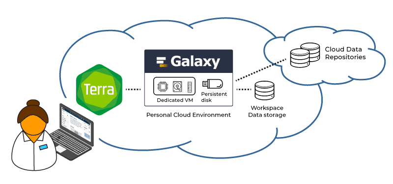
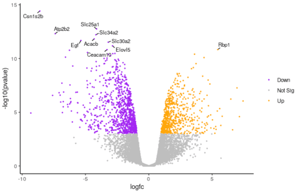
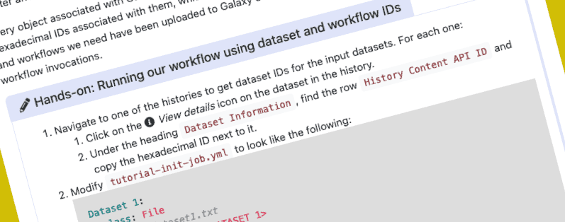
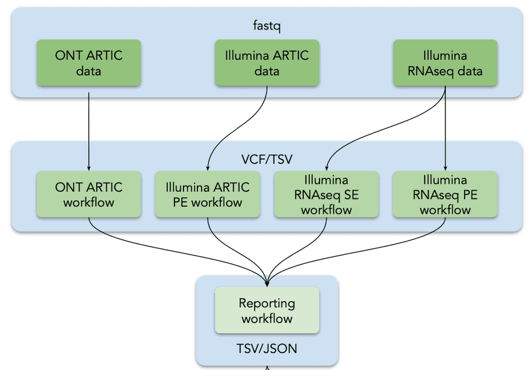

Hello all,

The 2021 Galaxy Community Conference has started!  It is too late to register for the 3 day conference next week.  It is also officially too late to sign up for the CoFest on 9-10 July, but if you [follow this link](https://docs.google.com/forms/d/e/1FAIpQLScdJHTzw7LWVxFaqGI30COZlcxGPksjGL_UDSwDNsQK1FVFCw/viewform), you just mind find yourself invited anyway.

This is one of our thinner newsletters, but there are still **[open positions](#community-news)**, **[event news](#event-news)**, **[Galaxy platform news](#galaxy-platforms-news)**, **[Galactic blog posts](#galactic-blog-activity)**, **[training and doc updates](#doc-hub-and-training-updates)**,
recent **[open-access Galaxy-related publications](#publications)**, **[new releases](#releases), and [other news too](#other-news).**

We hope to see you at GCC events this week and next.

Dave Clements and Beatriz Serrano-Solano, Editors

PS: Subscribe to the [Galaxy Announce mailing list](https://lists.galaxyproject.org/?count=100&all-lists=) and receive an email whenever this newsletter is published.

---

# Featured news

This month our featured news is all about GCC2021, including several new sponsors: **PeerJ, GalaxyWorks**, and **Limagrain**:

<!-- GCC! -->

[GCC2021 has started!](https://www.vibconferences.be/events/gcc2021)

**Did you miss the registration window?**

GCC2021 [Training Week](https://galaxyproject.org/events/gcc2021/training) is underway, and the GCC meeting and [CoFest](https://sched.co/iLKn) are next week.  If you registered in time, *then welcome to one of the coolest community get togethers in data-intensive science!*

If you didn't get registered then here is some hopefully consoling news:

* Training videos and materials are now available for free in the Galaxy Training Network library.
* Videos of all talks presented at GCC2021 will be made available online, for free later this summer.
* All slides and poster PDFs will be made available online this summer as well.
* The CoFest registration is officially closed, but you can still sneak in!  Just [click this link here...](https://docs.google.com/forms/d/e/1FAIpQLScdJHTzw7LWVxFaqGI30COZlcxGPksjGL_UDSwDNsQK1FVFCw/viewform)

<!-- PeerJ -->

[PeerJ](https://peerj.com/)

**[PeerJ](https://peerj.com/)** is an Open Access publisher of seven peer-reviewed journals. Our mission is to give researchers the publishing tools and services they want with a unique and exciting experience. PeerJ offers a unique [Lifetime Membership model](https://www.youtube.com/watch?v=Cv3ooRV7dcY) for Open Access, allowing authors to **pay once and publish for life.**  PeerJ is sponsoring the [Best Poster/Demo presentation award](https://gcc2021.sched.com/sponsor/peerj) at GCC2021.

<!-- GalaxyWorks -->

[GalaxyWorks](https://galaxyworks.io/)

Need more Galaxy? **[Galaxy Pro](https://galaxyworks.io/product/)** is a managed Galaxy instance with no quotas or queue wait times. Ready to use without management overhead.

<!-- Limagrain -->

[Limagrain](https://www.limagrain.com/en/limagrain-home)

An agricultural cooperative held by French farmers, and an international seed group, **[Limagrain](https://www.limagrain.com/en/limagrain-home)** is driven by its purpose: cooperating for the progress of agriculture everywhere, for everyone. Focused on the genetic progress of plants, Limagrain breeds, produces and distributes field seeds, vegetable seeds and agri-food products.

# Community News

<!-- hiring -->

[Galaxy Career Center](/careers/)

There are new positions in the [Galaxy Career Center](/careers/), in the Netherlands, the United Kingdom, and in the United States.  There are also several previously posted positions that are still open, including several with the Galaxy Project in the US.

<!-- OLS -->

[Open Life Science program & the Galaxy community](https://galaxyproject.eu/posts/2021/06/28/ols/)

**Involvement in OLS-3 and invitation to apply to the next cohort**

Open Life Science (OLS) is an online mentoring & training program to help individuals and stakeholders in research to become Open Science ambassadors.  Galaxy was involved in the first 3 cohorts, and the call for the 4th cohort is now open.

# Event News

Did we mention that the [2021 Galaxy Community Conference](https://www.vibconferences.be/events/gcc2021) is under way?  Just checking...

But even something as universe-spanning as GCC doesn't suck up all the oxygen in the Galaxy Community. Here are some other [upcoming events highlights](/events/):

<!-- Galaxy E at Sortee -->

[Galaxy-E @ SORTEE 2021](/events/2021-07-sortee/)

**12-14 July, Online, Global**

SORTEE 2021 brings together researchers working to improve reliability and transparency through cultural and institutional changes in ecology, evolutionary biology, and related fields. [Galaxy-E](/use/ecology/) will have a workshop, a talk, and a hackathon at this event.

<!-- Galaxy at ISMB -->

[Galaxy @ ISMB/ECCB/BOSC 2021](/events/2021-ismb-eccb-bosc/)

**25-31 July, Online, Global**

Galaxy has always had a presence at ISMB/ECCB and BOSC, and we will [be there again in 2021](/events/2021-ismb-eccb-bosc/).

<!-- Galaxy Dev Round Table -->

[Galaxy Developer Roundtable](/community/devroundtable/)

We are skipping the Galaxy Developer Round Table during GCC (although we could [meet as a BoF](https://gcc2021.sched.com/area/BoF)). The lone July round table will be:

**July 22: TBD**

We still [need volunteers to lead the discussion on your favorite topic](https://bit.ly/gxdevroundtablepresent).

<!-- SARS-CoV-2 Data Analysis and Monitoring with Galaxy -->

[SARS-CoV-2 Data Analysis and Monitoring with Galaxy](https://galaxyproject.eu/event/2021-06-21-sars-cov-2-data-analysis-monitoring-training/)

**9-12 August**

The goal of this workshop is to build capacity in SARS-CoV-2 data analysis and data management, including data submission to ENA. After the workshop, all participants will be able to upload viral sequencing data, call all variants, create a variety of reports and create consensus alignments.

It will be a 4-day event introducing scalable and reproducible SARS-CoV-2 data analysis with Galaxy. The sessions will be pre-recorded and provided in advance. During the workshop, there will be live support in chat and live Q&A sessions, in which experts will answer questions.

# Galaxy Platforms News

The [Galaxy Platform Directory](/use/) lists resources for easily running your analysis on Galaxy, including publicly available servers, cloud services, and containers and VMs that run Galaxy.  Here's the recent platform news we know about:

<!-- UseGalaxy.* -->

[UseGalaxy.*](/usegalaxy/) News

* Lots of tool updates on [UseGalaxy.eu](https://galaxyproject.eu/news?tag=tools) and [UseGalaxy.org.au](https://usegalaxy-au.github.io/galaxy/news.hgtml).
* And two new use cases were described for UseGalaxy.eu:
    * [Zika virus effects on brain and brain tumours](https://galaxyproject.eu/posts/2021/06/18/use-case-harry-bulstrode/)
    * [Genetics research on dairy cattle](https://galaxyproject.eu/posts/2021/06/25/use-case-tomas-klingstrom/)

# Galactic Blog Activity

<!-- Galaxy on Terra -->

[A Galaxy of tools at your fingertips](https://terra.bio/a-galaxy-of-tools-at-your-fingertips/")

By Meaghan McConlogue.

Galaxy is now available in all flavors of the Terra platform.

"Today, we released an update that makes Galaxy available through the other “faces” of Terra, i.e. the project-agnostic [Terra Community Workbench](https://app.terra.bio/) and the [NHLBI BioData Catalyst](https://terra.biodatacatalyst.nhlbi.nih.gov/)..."  Galaxy has been available on the [AnVIL Terra Portal](https://anvil.terra.bio/) since last year.

# Doc, Hub, and Training Updates

<!-- Visualization of RNA-Seq results with Volcano Plot in R -->

[Visualization of RNA-Seq results with Volcano Plot in R](https://training.galaxyproject.org/training-material/topics/transcriptomics/tutorials/rna-seq-viz-with-volcanoplot-r/tutorial.html)

By [Maria Doyle](https://training.galaxyproject.org/training-material/hall-of-fame/mblue9/)

In this tutorial we show how you can customise a plot using the R script output from the tool.

<!-- Genome Annotation with Apollo -->

[Refining Genome Annotations with Apollo](https://training.galaxyproject.org/training-material/topics/genome-annotation/tutorials/apollo/tutorial.html)

By [Anthony Bretaudeau](https://training.galaxyproject.org/training-material/hall-of-fame/abretaud/), [Helena Rasche](https://training.galaxyproject.org/training-material/hall-of-fame/hexylena/), [Nathan Dunn](https://training.galaxyproject.org/training-material/hall-of-fame/nathandunn/), [Mateo Boudet](https://training.galaxyproject.org/training-material/hall-of-fame/mboudet/)

After automatically annotating your genome using Prokka or Maker, it is important to visualize your results so you can understand what your organism looks like, and then to manually refine these annotations along with any additional data you might have.

<!-- Automating Galaxy workflows using the command line -->

[Automating Galaxy workflows using the command line](https://training.galaxyproject.org/training-material/topics/galaxy-interface/tutorials/workflow-automation/tutorial.html)

By [Simon Bray](https://training.galaxyproject.org/training-material/hall-of-fame/simonbray/) and [Wolfgang Maier](https://training.galaxyproject.org/training-material/hall-of-fame/wm75/)

Trigger workflow execution via the command line using Planemo, and some tips on how to write scripts to automate the process. The result is a bot which takes care of the the whole analysis process for you.

<!-- Mutation calling, viral genome reconstruction and lineage/clade assignment from SARS-CoV-2 sequencing data -->

[Mutation calling, viral genome reconstruction and lineage/clade assignment from SARS-CoV-2 sequencing data](https://training.galaxyproject.org/training-material/topics/variant-analysis/tutorials/sars-cov-2-variant-discovery/tutorial.html)

By [Wolfgang Maier](https://training.galaxyproject.org/training-material/hall-of-fame/wm75/) and [Bérénice Batut](https://training.galaxyproject.org/training-material/hall-of-fame/bebatut/)

How to obtain, run and combine these workflows appropriately for different types of input data.

# Publications

Pub curation activities [are on a semi-hiatus right now](/news/2020-08-10k-pubs/#the-future) but a few publications referencing, using, extending, and implementing Galaxy were added to the [Galaxy Publication Library](https://www.zotero.org/groups/galaxy) anyway.  Here are the new open access *Galactic* and *Stellar* pubs:

[Galaxy-ML: An accessible, reproducible, and scalable machine learning toolkit for biomedicine](https://doi.org/10.1371/journal.pcbi.1009014)

Gu, Q., Kumar, A., Bray, S., Creason, A., Khanteymoori, A., Jalili, V., Grüning, B., & Goecks, J. (2021). *PLOS Computational Biology*, 17(6), e1009014. https://doi.org/10.1371/journal.pcbi.1009014

# Releases

<!-- Galaxy -->

[Galaxy 21.05](/news/2021-06-galaxy-release-21-05/)

We are pleased to [announce the 21.05 Galaxy release](/news/2021-06-galaxy-release-21-05/).

A new development stack (featuring FastAPI, Celery and Circus) is coming, a job handler update is here, ¡Galaxy, ahora en español!,  Remote Files gets FTP Support, and SimText visualization is added.

**And there is a *lot* more in the full [user](https://docs.galaxyproject.org/en/master/releases/21.05_announce_user.html) and [developer and admin](https://docs.galaxyproject.org/en/master/releases/21.05_announce.html) release announcements.**

<!-- BioBlend -->

[BioBlend 0.16.0](https://bioblend.readthedocs.io/en/latest/)

[BioBlend](https://bioblend.readthedocs.io/en/latest/) is a Python library for interacting with Galaxy and CloudMan APIs. [BioBlend 0.16.0](https://github.com/galaxyproject/bioblend/releases/tag/v0.16.0) supports the latest 21.05 release of Galaxy, and has the largest number of added features for some time.

# Other News

<!-- Tool Templates -->

[Galaxy tool repository template](https://github.com/galaxyproject/galaxy-tool-repository-template)

This template repository from Matthias Berndt can be used to create IUC style tool repositories. It offers:

* the same structure as the IUC repository
* CI for pull requests and weekly CI for all tools

