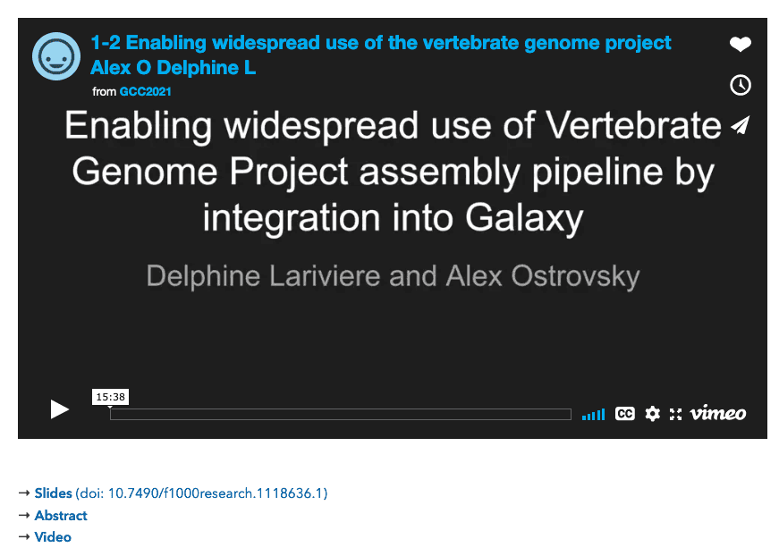

Hello all,

The August newsletter brings news of GCC2021 (just finished) and GCC2022 (in Minneapolis); **[the launch of the Galaxy India community, and open positions in 7 countries](#community-news)**; **[event news](#event-news)**; **[Galaxy platform news](#galaxy-platforms-news)**; **[training and doc updates](#doc-hub-and-training-updates)**;
recent **[open-access Galaxy-related publications](#publications)**; and **[other news too](#other-news).**

Dave Clements and Beatriz Serrano-Solano, Editors

PS: Subscribe to the [Galaxy Announce mailing list](https://lists.galaxyproject.org/?count=100&all-lists=) and receive an email whenever this newsletter is published.

---

# Featured news

<!-- GCC banner image -->

<!-- GCC Meeting Summary -->

[GCC2021 Highlights and Summary](https://galaxyproject.eu/posts/2021/07/13/gcc2021/)

GCC2021 was our second virtual Galaxy Community Conference. This year we had 399 participants from 55 countries attend events spread over 10 days. **See Beatriz Serrano-Solano's great [summary of GCC2021](https://galaxyproject.eu/posts/2021/07/13/gcc2021/) and the [slides from the conference's closing session](https://static.sched.com/hosted_files/gcc2021/5a/GCC2021%20-%20Closing2.pdf) for more.**

<!-- Training Videos -->

[GCC2021 Training Materials and Videos](https://galaxyproject.org/events/gcc2021/training/)

The complete set of training materials, including many new videos, and a whole new Galaxy Development track, are now available for free and online:

* **GCC2021 Science Track**: How to use Galaxy to get science done.
    * [Training Materials](https://galaxyproject.org/events/gcc2021/training/science-track) & [Video Playlist](https://youtube.com/playlist?list=PLNFLKDpdM3B_3M7i8fQ3rH_sax6rmAsyz) (134 videos!)
* **GCC2021 Developer Track**: *A brand new set of tutorials on how to contribute to Galaxy development.*
    * [Training Materials](https://galaxyproject.org/events/gcc2021/training/dev-track) & [Video Playlist](https://youtube.com/playlist?list=PLNFLKDpdM3B_gBvf4mzjIrI8IRhTIFAmc) (35 videos)
* **GCC2021 Administrator Track**: How to deploy, configure and maintain your own Galaxy instance.
    * [Training Materials](https://galaxyproject.org/events/gcc2021/training//admin-track) & [Video Playlist](https://www.youtube.com/playlist?list=PLNFLKDpdM3B9aiB2rLaAIVdjIos4rc9-y) (28 videos)

Many, many thanks to the instructors and helpers who contributed their time and effort to make GCC2021 Training a success.  And a huge thanks to Helena Rasche and Saskia Hiltemann for managing GCC2021 Training Week.

<!-- GCC Videos / Slides / Posters -->

[Presentations Videos, Slides and Posters](https://gcc2021.sched.com/)

Videos of all talks are now linked to from the [conference talk pages](https://gcc2021.sched.com/overview/area/Talk). Videos are also [available on a YouTube playlist](https://youtube.com/playlist?list=PLNFLKDpdM3B_Md0YUja_IjVeXywRi0Kz3).  Most talks also have their slides uploaded, and [PDFs for poster/demo presentations have also been uploaded](https://gcc2021.sched.com/overview/area/Poster+Demo) (when they exist).

<!-- PeerJ Best Poster -->

[PeerJ GCC2021 Best Poster / Demo Presentation Award](https://peerj.com/)

The [PeerJ Best Poster/Demonstration Award](https://gcc2021.sched.com/sponsor/peerj) was awarded to:

* [Th-6.8: Peptide mass spectrometry imaging of pancreatic cancers – A data analysis workflow in Galaxy](https://sched.co/k5N0)
* Presented by Maren Stillger of the University of Freiburg

Maren's presentation took full advantage of the Remo conference platform, which means that the presentation was not a single PDF, but was rather interactive.  Maren's work will be highlighted in the PeerJ Blog, and this work is eligible for free publication in any PeerJ journal.

<!-- GCC2022 -->

GCC2022: July 17-23, Minneapolis, MN

We are pleased to announce that the 2022 Galaxy Community Conference (GCC2022) will take place in Minneapolis, Minnesota, United States, from July 17 through July 23.  GCC2022 is hosted by the [Minnesota Supercomputer Institute](https://www.msi.umn.edu/) and the [Galaxy-P Project](http://galaxyp.org/) at the [University of Minnesota](https://twin-cities.umn.edu/).  It will be live and in person with talks broadcast around the world.  GCC2022 starts two days after [ISMB 2022](https://www.iscb.org/ismb2022) ends in Madison, Wisconsin, a 5 hour drive away.  See the [meeting announcement](https://static.sched.com/hosted_files/gcc2021/5a/GCC2021%20-%20Closing2.pdf#page=19) for full details.

# Community News

<!-- Indian Community -->

[Galaxy India Community](https://www.galaxyproject.in/)

We are very pleased to announce that the [Galaxy India community](https://www.galaxyproject.in/) has started!  Galaxy India had a [soft launch during GCC2021](https://sched.co/kLwE).  **We are planning a full community launch with [two days of pre-conference workshops at InBix 2021](https://easychair.org/cfp/InBix2021).**

The Galaxy India community is about enabling data intensive research and instruction in India using the Galaxy platform. As a group, we sponsor:

* Training and workshops, both standalone and at larger meetings
* Webinars and community calls
* In person gatherings, once these become prudent
* [Communications channels](/community/#regional-communities), including chat and a mailing list
* An [India-focused server](/use/galaxy-india/) hosted by the European Galaxy Team

If you are working in data intensive science in India then please consider getting involved with Galaxy India:

<a href="https://www.galaxyproject.in/"><i class="fa fa-external-link-alt" aria-hidden="true"></i></a>
<a href="https://chat.whatsapp.com/CCXT7t97ZX5D3MiD7MVmun"><i class="fab fa-whatsapp" aria-hidden="true"></i></a>
<a href="https://chat.whatsapp.com/LYAWg6Yah1i4QbMU0sktqB"><i class="fab fa-whatsapp" aria-hidden="true"></i></a>
<a href="https://matrix.to/#/#usegalaxy-in_adda:gitter.im"><i class="fab fa-matrix" aria-hidden="true"></i></a>
<a href="https://twitter.com/GxyIndia"><i class="fab fa-twitter" aria-hidden="true"></i></a>
<a href="https://twitter.com/useGalaxyIndia"><i class="fab fa-twitter" aria-hidden="true"></i></a>
<a href="https://github.com/usegalaxy-in/"><i class="fab fa-github" aria-hidden="true"></i></a>
<a href="https://lists.galaxyproject.org/lists/india.lists.galaxyproject.org/"><i class="fa fa-envelope" aria-hidden="true"></i></a>

<!-- hiring -->

[Galaxy Career Center](/careers/)

**Ten new positions were added to the [Galaxy Career Center](/careers/) in the last month.**  Many of them close soon:

* Australia, closes 11 August
* Norway, closes 15 August
* France x 3, 1 closes 22 August, 2 close 1 September
* the Netherlands, 22 August
* Germany, closes 31 August

There are also "open until filled" positions in the US (x7) and Belgium. Take a look.

<!-- New Videos -->

[New Galaxy Videos](https://www.youtube.com/c/GalaxyProject)

In addition to the GCC2021 talks (54 of them, see above) and the GCC2021 Training Week Videos (almost 200 of them, see above) several other videos have also been published recently. Here's a sample.

* **[Galaxy 101](https://youtu.be/D5HgJWdfOWw)**, our basic tutorial gets an update
* **[Collections 101](https://youtu.be/uZUt9XIHUQo)**, a new [Galactic Introduction](https://www.youtube.com/playlist?list=PLNFLKDpdM3B9UaxWEXgziHXO3k-003FzE) video
* **[Restricting the Galaxy Tool Panel](https://youtu.be/n2uwDaU-L8s)**, a recording of the July 22 Developer Round Table call.
* **[ASaiM: From a local project to a global effort to support microbiome data analysis](https://youtu.be/Il84WUPVaxc)**, Bérénice Batut at the "Holistic Bioinformatic Approaches used in Microbiome Research" conference

# Event News

There is not a lot going on in August, but what is happening is compelling.  See all [upcoming events here](/events/):

<!-- SARS-CoV-2 Data Analysis and Monitoring with Galaxy -->

[SARS-CoV-2 Data Analysis and Monitoring with Galaxy](https://galaxyproject.eu/event/2021-06-21-sars-cov-2-data-analysis-monitoring-training/)

**9-12 August**

The goal of this workshop is to build capacity in SARS-CoV-2 data analysis and data management, including data submission to ENA. After the workshop, all participants will be able to upload viral sequencing data, call all variants, create a variety of reports and create consensus alignments.

It will be a 4-day event introducing scalable and reproducible SARS-CoV-2 data analysis with Galaxy. The sessions will be pre-recorded and provided in advance. During the workshop, there will be live support in chat and live Q&A sessions, in which experts will answer questions.

<!-- BioHackathon -->

[Galaxy @ BioHackathon 2021](/events/2021-11-biohackathon-europe/)

Galaxy [is featured in at least 7 projects at BioHackathon Europe 2021](/events/2021-11-biohackathon-europe/), being held in Barcelona and online, 8-12 November.  Registration is available on a first come, first serve basis. Registration is free, but space is limited. [Register now](https://www.biohackathon-europe.org/registration.html).

<!-- Galaxy Dev Round Table -->

[Galaxy Developer Roundtable](/community/devroundtable/)

August's Galaxy Developer Round Table meetup is:

**August 19: TBD**

As you can see, we still [need volunteers (like you!) to lead the discussion on your favorite topic](https://bit.ly/gxdevroundtablepresent).

# Galaxy Platforms News

The [Galaxy Platform Directory](/use/) lists resources for easily running your analysis on Galaxy, including publicly available servers, cloud services, and containers and VMs that run Galaxy.  Here's the recent platform news we know about:

<!-- Galaxy India -->

[Galaxy India](/use/galaxy-india/)

Welcome to the India Galaxy workbench; a comprehensive set of tools and workflows dedicated to accelerate your bioinformatics analyses focusing on Bharat. Thanks to Galaxy Europe we are hosting the seeds of Indian Galaxy to facilitate more wider user base.

<!-- CropGalaxy -->

[CropGalaxy](/use/cropgalaxy/)

The EIB Demo server is now the CropGalaxy server, hosting tools from [RiceGalaxy](https://galaxy.irri.org/), [GOBii](http://gobiiproject.org/), [HTPG](https://cegsb.icrisat.org/high-throughput-genotyping-project-htpg/), and [EIB](https://excellenceinbreeding.org/).

<!-- UseGalaxy.* -->

[UseGalaxy.*](/usegalaxy/) News

* Lots of tool updates on [UseGalaxy.eu](https://galaxyproject.eu/news?tag=tools) and [UseGalaxy.org.au](https://usegalaxy-au.github.io/galaxy/news.hgtml).
* And several new use cases were described for UseGalaxy.eu:
    * [Epigenomics and transcriptomics in cancer](https://galaxyproject.eu/posts/2021/07/16/use-case-mzwanele-ngubo/)
    * [Plant genomics](https://galaxyproject.eu/posts/2021/07/09/use-case-shaobin-zhong/)
    * [Colorectal cancer research](https://galaxyproject.eu/posts/2021/07/05/use-case-amir/)
    * [Genomics, evolution, and ecology of organohalide-respiring bacteria](https://galaxyproject.eu/posts/2021/07/02/use-case-yi-yang/)

# Doc, Hub, and Training Updates

<!-- Accessibility Improvements -->

[GTN Accessibility Improvements](https://training.galaxyproject.org/training-material/news/2021/07/27/a11y.html)

We are now supporting alternative formats for accessing our JavaScript based slides, as this could be difficult when using screen readers. We’ve now added support for "plain text slides", where we render the slide decks as a single long document. And [there are many more improvements](https://training.galaxyproject.org/training-material/news/2021/07/27/a11y.html) too.

<!-- Removal of humans -->

[Removal of human reads from SARS-CoV-2 sequencing data](https://training.galaxyproject.org/training-material/topics/sequence-analysis/tutorials/human-reads-removal/tutorial.html)

By [Wolfgang Maier](https://training.galaxyproject.org/training-material/hall-of-fame/wm75/).

This tutorial guides you through a typical workflow for clearing human sequences from any kind (ampliconic or not) of viral sequenced sample, which retains non-human reads in a format ready to be submitted to public databases.

<!-- Data Independent Acquisition -->

Data Independent Acquisition Analysis (DIA)

By [Matthias Fahrner](https://training.galaxyproject.org/training-material/hall-of-fame/matthias313/) and [Melanie Föll](https://training.galaxyproject.org/training-material/hall-of-fame/foellmelanie/)

Three new tutorials from the Fahrner & Föll team teach you how to do Data Independent Acquisition analysis within Galaxy:

* [Library Generation for DIA Analysis](https://training.galaxyproject.org/training-material/topics/proteomics/tutorials/DIA_lib_OSW/tutorial.html):
* [Statistical analysis of DIA data](https://training.galaxyproject.org/training-material/topics/proteomics/tutorials/DIA_Analysis_MSstats/tutorial.html)
* [DIA Analysis using OpenSwathWorkflow](https://training.galaxyproject.org/training-material/topics/proteomics/tutorials/DIA_Analysis_OSW/tutorial.html)

<!-- Mutation calling, viral genome reconstruction and lineage/clade assignment from SARS-CoV-2 sequencing data -->

[Mutation calling, viral genome reconstruction and lineage/clade assignment from SARS-CoV-2 sequencing data](https://training.galaxyproject.org/training-material/topics/variant-analysis/tutorials/sars-cov-2-variant-discovery/tutorial.html)

By [Wolfgang Maier](https://training.galaxyproject.org/training-material/hall-of-fame/wm75/) and [Bérénice Batut](https://training.galaxyproject.org/training-material/hall-of-fame/bebatut/).

This tutorial got a major update, including many improvements based on feedback from GCC2021 training.

<!-- Galaxy 101 -->

[Galaxy 101](https://training.galaxyproject.org/training-material/topics/introduction/tutorials/galaxy-intro-101/tutorial.html)

The venerable *Galaxy 101* tutorial is still venerable, but it is now also state of the art, thanks to an update from [Anton Nekrutenko](https://training.galaxyproject.org/training-material/hall-of-fame/nekrut/).

<!-- Feedback summary page -->

[GTN Feedback Summary Page](https://training.galaxyproject.org/training-material/news/2021/07/28/feedback.html)

We have [created a page](https://training.galaxyproject.org/training-material/news/2021/07/28/feedback.html) which aggregates all GTN feedback, displays them globally, and also by topic and tutorial, including the free text.  Take a look and see what the community is saying.

# Publications

Pub curation activities [are on a semi-hiatus right now](/news/2020-08-10k-pubs/#the-future) but a few publications referencing, using, extending, and implementing Galaxy were added to the [Galaxy Publication Library](https://www.zotero.org/groups/galaxy) anyway.  Here are the new open access *Galactic* and *Stellar* pubs:

[A Bioinformatics Whole-Genome Sequencing Workflow for Clinical Mycobacterium tuberculosis Complex Isolate Analysis, Validated Using a Reference Collection Extensively Characterized with Conventional Methods and In Silico Approaches](https://doi.org/10.1128/JCM.00202-21)

Bogaerts, B., Delcourt, T., Soetaert, K., Boarbi, S., Ceyssens, P.-J., Winand, R., Van Braekel, J., De Keersmaecker, S. C. J., Roosens, N. H. C., Marchal, K., Mathys, V., & Vanneste, K. (2021). *Journal of Clinical Microbiology*, 59(6), e00202-21. https://doi.org/10.1128/JCM.00202-21

[Approaches for containerized scientific workflows in cloud environments with applications in life science](https://doi.org/10.12688/f1000research.53698.1)

Spjuth, O., Capuccini, M., Carone, M., Larsson, A., Schaal, W., Novella, J. A., Stein, O., Ekmefjord, M., Tommaso, P. D., Floden, E., Notredame, C., Moreno, P., Hellander, A., Khoonsari, P. E., Herman, S., Kultima, K., & Lampa, S. (2021). *F1000Research*, 10, 513. https://doi.org/10.12688/f1000research.53698.1

[A Trace-Based Validation Study of OpenDC](https://atlarge-research.com/pdfs/2020-12-02_bsc_thesis_jaro_final.pdf)

Bosch, J. (2020).  [Vrije Universiteit Amsterdam]. https://atlarge-research.com/pdfs/2020-12-02_bsc_thesis_jaro_final.pdf

# Other News

[Strengthen Data Management in Galaxy](https://elixir-europe.org/about-us/commissioned-services/strengthen-data-management-galaxy)

[ELIXIR funded seven new life science data projects](https://elixir-europe.org/news/elixir-funds-seven-new-life-science-data-projects), including [Strengthen Data Management in Galaxy](https://elixir-europe.org/about-us/commissioned-services/strengthen-data-management-galaxy).  This project will enhance Galaxy's data management features to provide additional provenance information and improve the integration of Galaxy in the existing data management ecosystem.

[For better patient care: Cooperation between MIRACUM and the German Network for Bioinformatics Infrastructure (de.NBI)](https://www.denbi.de/news/1279-for-better-patient-care-cooperation-between-miracum-and-the-german-network-for-bioinformatics-infrastructure-de-nbi)

The European Galaxy Project turns out to be the glue between many scientific projects.

[galaxy-pulsar-dev](https://github.com/natefoo/galaxy-pulsar-dev/)

From Nate Coraor: a [Docker Compose](https://docs.docker.com/compose/)-based solution for easing the development and testing of [Pulsar](https://github.com/galaxyproject/pulsar/) with Galaxy.

