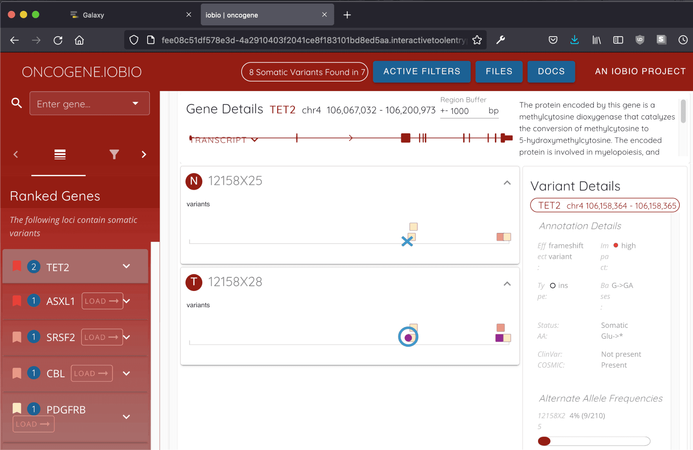

---

title: "Cancer informatics working group T2 update"
tease: "CI-WG Updates from the tertile"
authors: "Luke Sargent"
date: "2021-09-02"
source_blog: "Galaxy Project Blog"
source_blog_url: "https://galaxyproject.org/blog/2021-09-cancer-informatics-wg-update/"
---

# Cancer Informatics + Galaxy
Over this last [tertile](https://en.wiktionary.org/wiki/tertile) (or, if you prefer, [quadrimestre](https://en.wiktionary.org/wiki/quadrimestre)), the Cancer Informatics working group has continued its efforts to bring cancer informatics tools, workflows, and visualizations to the Galaxy community, with the downstream goal of launching an entire 'flavor' of Galaxy (Galaxy Cancer) dedicated specifically to cancer data analysis.

The following are a couple of highlights from these efforts:

## MCMICRO Tools on GVL
The GVL, or [Genomics Virtual Laboratory](https://www.gvl.org.au/), is Galaxy Cancer's chosen platform. It provides [kubernetes](https://kubernetes.io/)-based cloud-agnostic resource provisioning and management, and allows Galaxy to be integrated with several bundled services -- [Grafana](https://grafana.com/) for service stats, [Rancher](https://rancher.com/) for cluster management, and [Keycloak](https://www.keycloak.org/) for identity management, to name a few.

A primary goal of the working group is to perform cancer tissue analysis using Galaxy; our focus currently is on [MCMICRO](https://mcmicro.org/), an end-to-end processing pipeline to transform large, multi-channel whole slide images into single-cell data. Work has been done to [adapt this pipeline for Galaxy](https://mcmicro.org/galaxy/), and to provide whole-tissue- and tumor-microarray-based workflows.

Adapting these tools to GVL has been a major focus of this last tertile. As a) they are under continuous development and as such subject to significant change, and b) they are transitioning from [Conda](https://docs.conda.io/en/latest/)-based to container-based tools, it is not as simple as a quick toolshed install. Additionally, quirks of Galaxy-for-kubernetes related to filesystem permissions have made finding a universal way of running these and future containers, each with disparate internal permission schemes, challenging.

After much experimentation, we have arrived at a strategy that circumvents these quirks with minimal effort, sparing us the various errors and failures generated by our initial attempts. By creating copies of these tool containers with minor permission and UID changes, these tools run successfully and no longer either fail to execute with cryptic error messages or perhaps worse still, fail to clean up intermediates and leave filesystem artifacts that would silently accrue and consume disk space.

*Figure 1: MCMICRO on GVL*

Now that this approach has been developed and tested, any container can be converted for use with the GVL with minimal effort.

## oncogene.iobio
Along with new tools and workflows, new visualizations are being brought into the Galaxy fold by way of [Interactive Tools](https://training.galaxyproject.org/training-material/topics/admin/tutorials/interactive-tools/slides.html)(ITs). ITs are a (relatively) new way to let Galaxy incorporate visualization services that might not be suited to other means of display (e.g., Galaxy Display Applications or Visualizations). An IT tool author creates a wrapper as with any other Galaxy tool (indeed, like a regular tool they can produce outputs and be a component of a workflow!), defines startup behavior and ingresses and the like, specifies a service's container dependency, and *voila*, an IT is born.

An ongoing goal for the working group has been to collaborate with the [iobio team](https://iobio.io/about.html) to port their web-based visualization services to Galaxy. The first such service, [bam.iobio](https://bam.iobio.io), has already been wrapped; over this last tertile, we have added [oncogene.iobio](http://oncogene.iobio.io) to the list.

*Figure 1: The oncogene.iobio IT launched from Galaxy*

We still have some kinks to work out and there remains other services to add, but with each step forward we further our understanding and accelerate the pace of progress.

## Future Developments - spoiler alert!

We still have some steps to take before Galaxy Cancer is ready for users, but that day draws nearer! In the meantime, here's a preview of what's to come:

- programmatic access to controlled [CRDC](https://datacommons.cancer.gov/) data
- more iobio services as ITs
- more tools and workflows

If you have questions, comments or suggestions, please let us know in our matrix channel: https://matrix.to/#/#galaxyproject_wg-cancer-informatics:gitter.im

 
 

